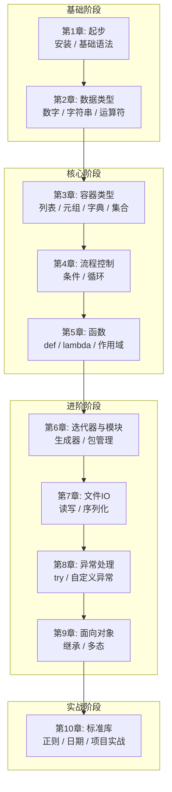

# Python3 基础课程 — 从入门到精通

> **基于 Python 3.11+｜面向零基础学员｜2026年6月**

## 课程概述

本课程基于菜鸟教程（runoob.com）Python3 教程结构，参考业界主流的课件设计方式，
将 20+ 个知识点重组为 10 个递进章节。每个概念都配有图形化解释和可执行代码案例，
确保学员能够循序渐进地掌握 Python 编程。

## 课程特色

- **图形+文字**：每个核心概念都有 Mermaid 图解辅助理解
- **概念驱动**：每节先讲"是什么"再讲"为什么"，建立深层理解
- **动手实操**：每章都有配套 `.py` 代码案例，可直接运行
- **踩坑指南**：每章末尾总结常见错误，提前避坑

## 章节规划

| 章节 | 难度 | 学时 | 核心内容 |
|------|------|------|---------|
| [第1章](第1章·起步—从安装到第一个Python程序.md) | ⭐ | 3h | Python 安装、解释器、基础语法、注释、第一个程序 |
| [第2章](第2章·数据类型与运算符—掌握Python的基石.md) | ⭐ | 3h | 变量、六种数据类型、数字、字符串、运算符 |
| [第3章](第3章·容器类型深度—列表、元组、字典、集合.md) | ⭐⭐ | 3.5h | 列表/元组/字典/集合、四种推导式 |
| [第4章](第4章·流程控制—条件判断与循环.md) | ⭐⭐ | 2.5h | if/match、while/for、break/continue、循环嵌套 |
| [第5章](第5章·函数—从基础到进阶.md) | ⭐⭐⭐ | 3.5h | def、参数类型、lambda、作用域、递归 |
| [第6章](第6章·迭代器、生成器与模块—代码复用的艺术.md) | ⭐⭐⭐ | 2.5h | 迭代器、生成器(yield)、模块与包 |
| [第7章](第7章·文件操作与输入输出—连接外部世界.md) | ⭐⭐ | 3h | 格式化输出、文件读写、OS操作、JSON/pickle |
| [第8章](第8章·错误与异常处理—编写健壮的代码.md) | ⭐⭐ | 2h | try/except、自定义异常、with上下文管理 |
| [第9章](第9章·面向对象编程—组织大规模代码.md) | ⭐⭐⭐ | 3.5h | class、继承、多态、特殊方法 |
| [第10章](第10章·标准库与综合实战—学以致用.md) | ⭐⭐ | 2.5h | 常用标准库、正则表达式、综合项目实战 |

**总学时：约 28 小时**

## 学习路线



## 使用方式

1. 按章节顺序学习，先读 `.md` 课件理解概念，再运行 `code/` 下的代码案例
2. 每章末尾有**常见踩坑**和**课后练习**，务必动手完成
3. 注意每章中的 **概念定义** 和 **核心价值** 标注，它们帮你建立深层理解
4. 学完本课程后，你将具备独立编写 Python 程序的能力

## 环境要求

- Python 3.11+（推荐最新稳定版）
- 建议使用虚拟环境：`python -m venv .venv`

```bash
# 初次使用只需安装 Python 即可，无需额外依赖
python --version  # 确认版本 >= 3.11
```
