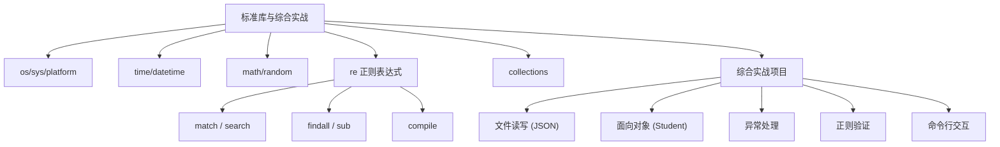
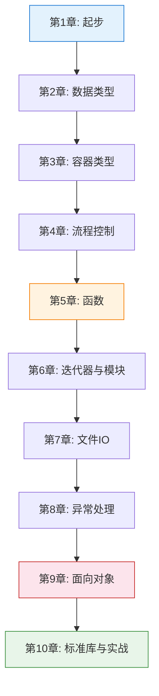

# 第10章 · 标准库与综合实战 — 学以致用

> **时长**：约 2.5 小时 ｜ **难度**：⭐⭐ ｜ **类型**：项目实战
>
> **目标**：掌握 Python 常用标准库模块（os/sys/time/datetime/math/random/re/collections），并综合运用前九章所学独立完成一个完整的学生信息管理系统。

---

## 学习目标

学完本章后，你将能够：
- 使用 `os`、`sys`、`platform` 模块获取系统和运行时信息
- 使用 `time` 和 `datetime` 模块处理日期时间
- 使用 `math` 和 `random` 模块完成数学计算与随机操作
- 使用 `re` 模块进行正则表达式匹配、搜索、替换
- 使用 `collections` 模块的 `namedtuple`、`deque`、`Counter`、`defaultdict` 等实用工具
- 综合运用文件IO、面向对象、异常处理、正则、JSON 序列化等知识，完成一个命令行学生信息管理系统

---

## 知识地图



---

## 1、操作系统接口 — os / sys / platform

**概念定义**：`os` 模块提供与操作系统交互的接口（环境变量、进程管理、文件系统），`sys` 模块提供与 Python 解释器交互的接口（命令行参数、退出、版本信息），`platform` 模块提供跨平台的系统标识。

**核心价值**：这些模块让 Python 程序能够感知和适应运行环境——根据平台做不同处理、读取环境配置、解析命令行参数等。

### 1.1 `os` 模块

```python
import os

# 操作系统名称
print(os.name)              # 'posix' (Linux/macOS) 或 'nt' (Windows)

# 环境变量
print(os.environ)           # 所有环境变量（类 dict 对象）
print(os.environ.get("PATH", "未设置"))
print(os.getenv("HOME", "/tmp"))  # 获取环境变量，可指定默认值

# 进程管理
pid = os.getpid()           # 当前进程 ID
# os.system("dir")          # 执行系统命令（简单但不推荐，建议用 subprocess）

# 路径操作（见第7章，与 pathlib 对比）
print(os.getcwd())          # 当前工作目录
```

### 1.2 `sys` 模块

```python
import sys

# 命令行参数
# 假设运行: python script.py arg1 arg2
print(sys.argv)             # ['script.py', 'arg1', 'arg2']
script_name = sys.argv[0]
first_arg = sys.argv[1] if len(sys.argv) > 1 else None

# 退出程序
# sys.exit(0)               # 正常退出
# sys.exit(1)               # 非正常退出（可带错误信息）

# 平台信息
print(sys.platform)         # 'win32' / 'linux' / 'darwin' (macOS)
print(sys.version)          # '3.12.0 (tags/v3.12.0:...'
print(sys.version_info)     # sys.version_info(major=3, minor=12, micro=0, ...)

# 模块搜索路径
print(sys.path)             # Python 导入模块时的搜索路径列表

# 标准输入输出
# sys.stdin.read()          # 读取标准输入
# sys.stdout.write("hello") # 写入标准输出
# sys.stderr.write("error") # 写入错误输出
```

### 1.3 `platform` 模块

```python
import platform

print(platform.system())        # 'Windows' / 'Linux' / 'Darwin'
print(platform.release())       # '10' / '5.4.0-26-generic'
print(platform.python_version())# '3.12.0'
print(platform.platform())      # 'Windows-10-10.0.22631-SP0'
print(platform.processor())     # 'Intel64 Family 6 Model ...'
```

### ▶ 代码案例

```powershell
cd code/10-标准库与实战-代码案例
python os_sys_demo.py
```

---

## 2、日期和时间 — time / datetime

**概念定义**：`time` 模块处理底层时间戳（自 1970-01-01 以来的秒数），`datetime` 模块提供面向对象的日期时间处理（更推荐日常使用）。

**核心价值**：几乎所有实用程序都涉及时间——日志时间戳、任务调度、性能测量、日期计算等，标准库提供了完善的时间处理工具。

### 2.1 `time` 模块

```python
import time

# 时间戳
print(time.time())          # 当前时间戳: 1752512345.6789

# 睡眠
print("开始")
time.sleep(1.5)             # 暂停 1.5 秒
print("结束")

# 格式化时间
print(time.ctime())         # 'Sun Jun 14 10:30:00 2026'

# 格式化为字符串: struct_time -> str
now = time.localtime()      # 本地时间的 struct_time
print(time.strftime("%Y-%m-%d %H:%M:%S", now))  # '2026-06-14 10:30:00'
print(time.strftime("%A, %B %d", now))          # 'Sunday, June 14'

# 解析字符串: str -> struct_time
parsed = time.strptime("2026-06-14", "%Y-%m-%d")
print(parsed.tm_year)       # 2026
```

### 2.2 `datetime` 模块（推荐）

```python
from datetime import datetime, date, time, timedelta

# 获取当前时间
now = datetime.now()
print(now)                  # 2026-06-14 10:30:00.123456
print(now.year, now.month, now.day, now.hour, now.minute, now.second)

# 创建指定时间
dt = datetime(2026, 6, 14, 10, 30, 0)
print(dt)                   # 2026-06-14 10:30:00

# 字符串解析与格式化
date_str = "2026-06-14 10:30:00"
parsed = datetime.strptime(date_str, "%Y-%m-%d %H:%M:%S")
formatted = parsed.strftime("%Y/%m/%d %H:%M")
print(formatted)            # 2026/06/14 10:30

# 时间差计算 timedelta
today = datetime.now()
tomorrow = today + timedelta(days=1)
last_week = today - timedelta(weeks=1)

diff = tomorrow - today
print(diff.days)            # 1
print(diff.total_seconds()) # 86400.0

# 只使用日期或时间
d = date(2026, 6, 14)
t = time(10, 30, 0)
print(d.isoformat())        # '2026-06-14'
```

### ▶ 代码案例

```powershell
cd code/10-标准库与实战-代码案例
python datetime_demo.py
```

---

## 3、数学与随机 — math / random

**概念定义**：`math` 模块提供数学常数和函数；`random` 模块提供伪随机数生成器，用于模拟、抽样、洗牌等。

**核心价值**：从科学计算到游戏开发、从数据抽样到安全密码生成，数学和随机函数是编程中的高频工具。

### 3.1 `math` 模块

```python
import math

# 常数
print(math.pi)          # 3.141592653589793
print(math.e)           # 2.718281828459045

# 取整
print(math.ceil(3.2))   # 4（向上取整）
print(math.floor(3.8))  # 3（向下取整）
print(math.trunc(3.8))  # 3（截断取整，等同 int()）

# 数学函数
print(math.sqrt(16))    # 4.0（平方根）
print(math.pow(2, 10))  # 1024.0（幂运算）
print(math.sin(math.pi / 2))  # 1.0
print(math.cos(0))      # 1.0
print(math.log(100, 10)) # 2.0（以10为底的对数）

# 数值检查
print(math.isnan(float('nan')))  # True
print(math.isfinite(1.0))        # True
print(math.isinf(float('inf')))  # True
```

### 3.2 `random` 模块

```python
import random

# 基本随机数
print(random.random())          # [0.0, 1.0) 之间的浮点数
print(random.uniform(10, 20))   # [10, 20] 之间的均匀分布浮点数

# 整数随机
print(random.randint(1, 6))     # [1, 6] 闭区间的整数（掷骰子）
print(random.randrange(0, 100, 5))  # range(0,100,5) 中取一个

# 序列操作
fruits = ["苹果", "香蕉", "橘子", "葡萄", "西瓜"]
print(random.choice(fruits))    # 随机选一个
print(random.choices(fruits, k=3))  # 有放回地选3个
print(random.sample(fruits, k=2))   # 无放回地选2个（不重复）

random.shuffle(fruits)          # 原地打乱顺序
print(fruits)

# 设置种子（可复现随机序列）
random.seed(42)
print([random.randint(1, 100) for _ in range(5)])
random.seed(42)                 # 重置种子
print([random.randint(1, 100) for _ in range(5)])  # 结果与上面一致
```

### ▶ 代码案例

```powershell
cd code/10-标准库与实战-代码案例
python math_random_demo.py
```

---

## 4、正则表达式 — re 模块

**概念定义**：正则表达式（Regular Expression）是一种描述字符串模式的微型语言，`re` 模块是 Python 对正则表达式的实现。

**核心价值**：正则表达式是文本处理的瑞士军刀——从验证输入格式（邮箱、手机号）到提取结构化数据（日志解析、爬虫），功能极其强大。

### 4.1 常用元字符

```python
import re

# .    任意字符（除换行）
# ^    字符串开头
# $    字符串结尾
# *    前一个字符 0 次或多次
# +    前一个字符 1 次或多次
# ?    前一个字符 0 次或1次
# []   字符集合 [a-z] [0-9] [abc]
# \    转义字符 \d \w \s
# |    或
# ()   分组

# 预定义字符类
# \d   数字 [0-9]
# \w   单词字符 [a-zA-Z0-9_]
# \s   空白字符 [ \t\n\r\f\v]
# \D   非数字
# \W   非单词字符
# \S   非空白字符
```

### 4.2 主要函数

```python
import re

text = "我的邮箱是 alice@example.com, 电话 138-0000-8888"

# re.match(): 从字符串开头匹配
m = re.match(r"我的", text)
print(m.group() if m else None)  # '我的'

# re.search(): 搜索整个字符串，返回第一个匹配
m = re.search(r"\w+@\w+\.\w+", text)
print(m.group())                  # 'alice@example.com'

# re.findall(): 查找所有匹配，返回列表
phones = re.findall(r"\d{3}-\d{4}-\d{4}", text)
print(phones)                     # ['138-0000-8888']

# re.finditer(): 查找所有匹配，返回迭代器
for m in re.finditer(r"\w+@\w+\.\w+", text):
    print(f"位置 {m.start()}-{m.end()}: {m.group()}")

# re.sub(): 替换
result = re.sub(r"\d{3}-\d{4}-\d{4}", "***-****-****", text)
print(result)                     # '我的邮箱是 alice@example.com, 电话 ***-****-****'

# re.split(): 分割
parts = re.split(r"[,，]\s*", text)
print(parts)                      # ['我的邮箱是 alice@example.com', '电话 138-0000-8888']
```

### 4.3 编译正则表达式

```python
import re

# 编译提升重复使用的性能
phone_pattern = re.compile(r"(\d{3})-(\d{4})-(\d{4})")

text = "电话1: 138-0000-8888, 电话2: 139-1111-2222"

# 使用编译后的对象
for m in phone_pattern.finditer(text):
    print(f"完整: {m.group()}")       # 138-0000-8888
    print(f"区号: {m.group(1)}")       # 138
    print(f"中间: {m.group(2)}")       # 0000
    print(f"尾号: {m.group(3)}")       # 8888
```

### 4.4 贪婪 vs 非贪婪

```python
import re

html = "<div>第一块</div><div>第二块</div>"

# 贪婪模式（默认）：尽可能多地匹配
greedy = re.findall(r"<div>(.*)</div>", html)
print(greedy)  # ['第一块</div><div>第二块']  — 匹配到最后一个 </div>

# 非贪婪模式：在量词后加 ?
non_greedy = re.findall(r"<div>(.*?)</div>", html)
print(non_greedy)  # ['第一块', '第二块']     — 每次匹配到最近的 </div>
```

### ▶ 代码案例

```powershell
cd code/10-标准库与实战-代码案例
python regex_demo.py
```

---

## 5、collections 模块

**概念定义**：`collections` 模块提供了 Python 内置容器类型（dict、list、tuple、set）的替代和扩展，解决特定场景下的数据结构需求。

**核心价值**：这些容器类让常见编程模式（计数、缓存、默认值等）有现成的、性能优良的实现，避免重复造轮子。

### 5.1 `namedtuple` — 有名字的元组

```python
from collections import namedtuple

# 定义命名元组类型
Point = namedtuple("Point", ["x", "y"])

# 创建实例
p = Point(10, 20)

# 通过名称访问（比索引更可读）
print(p.x, p.y)          # 10 20

# 仍然支持元组操作
print(p[0], p[1])        # 10 20
print(len(p))            # 2
x, y = p                 # 解包

# 适用于轻量级数据对象（无需方法的场景）
Student = namedtuple("Student", ["name", "age", "score"])
s = Student("张三", 20, 95)
print(f"{s.name}: {s.score}")  # 张三: 95
```

### 5.2 `deque` — 双端队列

```python
from collections import deque

# 高效的双端操作（列表在左侧插入是 O(n)，deque 是 O(1)）
d = deque(["a", "b", "c"])

d.append("d")         # 右侧追加 → deque(['a', 'b', 'c', 'd'])
d.appendleft("z")     # 左侧追加 → deque(['z', 'a', 'b', 'c', 'd'])

d.pop()               # 右侧弹出 → 'd'
d.popleft()           # 左侧弹出 → 'z'

# 固定长度队列
q = deque(maxlen=3)
for i in range(10):
    q.append(i)
print(q)              # deque([7, 8, 9], maxlen=3)  — 自动丢弃旧元素
```

### 5.3 `Counter` — 计数器

```python
from collections import Counter

words = ["a", "b", "a", "c", "b", "a", "d", "e", "e"]
counter = Counter(words)

print(counter)                  # Counter({'a': 3, 'b': 2, 'e': 2, 'c': 1, 'd': 1})
print(counter["a"])             # 3
print(counter["z"])             # 0（不存在的键返回0，不会 KeyError）

# 常用方法
print(counter.most_common(2))   # [('a', 3), ('b', 2)]（出现最多的前2个）
print(list(counter.elements())) # 展开所有元素

# 计数器运算
c1 = Counter(a=3, b=1)
c2 = Counter(a=1, b=2)
print(c1 + c2)   # Counter({'a': 4, 'b': 3})
print(c1 - c2)   # Counter({'a': 2})（结果只保留正数）
```

### 5.4 `defaultdict` — 带默认值的字典

```python
from collections import defaultdict

# 普通 dict：访问不存在键会 KeyError
# defaultdict：访问不存在键时调用工厂函数创建默认值

# 列表工厂：适合分组
groups = defaultdict(list)
students = [("A班", "张三"), ("B班", "李四"), ("A班", "王五")]
for cls, name in students:
    groups[cls].append(name)
print(groups)
# defaultdict(<class 'list'>, {'A班': ['张三', '王五'], 'B班': ['李四']})

# 整数工厂：适合计数
word_count = defaultdict(int)
for word in ["a", "b", "a", "c", "a", "b"]:
    word_count[word] += 1
print(word_count)  # defaultdict(<class 'int'>, {'a': 3, 'b': 2, 'c': 1})
```

### 5.5 `OrderedDict` — 有序字典

```python
from collections import OrderedDict

# Python 3.7+ 中普通 dict 已经保持插入顺序
# OrderedDict 仍然有用：提供了额外方法

od = OrderedDict()
od["z"] = 1
od["a"] = 2
od["b"] = 3

# 移动到末尾/开头
od.move_to_end("z")      # 将 'z' 移到末尾
print(list(od.keys()))   # ['a', 'b', 'z']

od.move_to_end("z", last=False)  # 移到开头
print(list(od.keys()))   # ['z', 'a', 'b']

# popitem(last=True): 后进先出 (LIFO)
# popitem(last=False): 先进先出 (FIFO)
```

### ▶ 代码案例

```powershell
cd code/10-标准库与实战-代码案例
python collections_demo.py
```

---

## 6、综合实战：学生信息管理系统

**项目目标**：构建一个命令行交互的学生信息管理系统，综合运用以下知识点：
- 面向对象（Student 类）
- 文件读写 + JSON 序列化（数据持久化）
- 异常处理（输入验证）
- 正则表达式（格式校验）
- 标准库模块（os、datetime、collections、re）

### 6.1 Student 类设计

```python
import json
import re
from datetime import datetime

class Student:
    """学生类"""
    def __init__(self, student_id, name, gender, phone, email, enroll_year):
        self.student_id = student_id
        self.name = name
        self.gender = gender
        self.phone = phone
        self.email = email
        self.enroll_year = enroll_year

    def to_dict(self):
        return {
            "student_id": self.student_id,
            "name": self.name,
            "gender": self.gender,
            "phone": self.phone,
            "email": self.email,
            "enroll_year": self.enroll_year
        }

    @classmethod
    def from_dict(cls, data):
        return cls(**data)

    def __str__(self):
        return f"{self.student_id} | {self.name} | {self.gender} | {self.phone} | {self.email} | {self.enroll_year}"
```

### 6.2 输入验证（正则 + 异常）

```python
class Validator:
    """输入验证器"""

    STUDENT_ID_RE = re.compile(r"^\d{8}$")        # 8位学号
    PHONE_RE = re.compile(r"^1[3-9]\d{9}$")      # 手机号
    EMAIL_RE = re.compile(r"^[\w.-]+@[\w.-]+\.\w+$")

    @staticmethod
    def validate_student_id(sid):
        if not Validator.STUDENT_ID_RE.match(sid):
            raise ValueError("学号必须为8位数字")

    @staticmethod
    def validate_phone(phone):
        if not Validator.PHONE_RE.match(phone):
            raise ValueError("手机号格式不正确")

    @staticmethod
    def validate_email(email):
        if not Validator.EMAIL_RE.match(email):
            raise ValueError("邮箱格式不正确")

    @staticmethod
    def validate_year(year):
        current_year = datetime.now().year
        if not (2000 <= int(year) <= current_year):
            raise ValueError(f"入学年份需在 2000-{current_year} 之间")
```

### 6.3 管理系统主类

```python
import os
from pathlib import Path

class StudentManager:
    """学生信息管理系统"""

    DATA_FILE = Path("students.json")

    def __init__(self):
        self.students = []
        self.load_data()

    def load_data(self):
        """从 JSON 文件加载数据"""
        if self.DATA_FILE.exists():
            try:
                with open(self.DATA_FILE, "r", encoding="utf-8") as f:
                    data = json.load(f)
                    self.students = [Student.from_dict(s) for s in data]
            except (json.JSONDecodeError, KeyError) as e:
                print(f"数据文件损坏: {e}，将使用空数据")
                self.students = []

    def save_data(self):
        """保存数据到 JSON 文件"""
        with open(self.DATA_FILE, "w", encoding="utf-8") as f:
            json.dump([s.to_dict() for s in self.students], f,
                      ensure_ascii=False, indent=2)
        print("数据已保存")

    def add_student(self):
        """添加学生"""
        print("\n--- 添加学生 ---")
        try:
            sid = input("学号: ").strip()
            Validator.validate_student_id(sid)
            if any(s.student_id == sid for s in self.students):
                raise ValueError("学号已存在")

            name = input("姓名: ").strip()
            if not name:
                raise ValueError("姓名不能为空")

            gender = input("性别(男/女): ").strip()
            if gender not in ("男", "女"):
                raise ValueError("性别只能为男或女")

            phone = input("手机号: ").strip()
            Validator.validate_phone(phone)

            email = input("邮箱: ").strip()
            Validator.validate_email(email)

            year = input("入学年份: ").strip()
            Validator.validate_year(year)

            self.students.append(Student(sid, name, gender, phone, email, int(year)))
            self.save_data()
            print(f"学生 {name} 添加成功！")

        except ValueError as e:
            print(f"输入错误: {e}")
        except Exception as e:
            print(f"未知错误: {e}")

    def list_students(self):
        """列出所有学生"""
        print(f"\n--- 学生列表 (共 {len(self.students)} 人) ---")
        if not self.students:
            print("暂无学生数据")
            return
        print("学号      | 姓名 | 性别 | 手机号      | 邮箱               | 入学年份")
        print("-" * 70)
        for s in self.students:
            print(s)

    def search_student(self):
        """搜索学生"""
        keyword = input("请输入学号或姓名关键字: ").strip()
        results = [s for s in self.students
                   if keyword in s.student_id or keyword in s.name]
        if results:
            print(f"找到 {len(results)} 条记录:")
            for s in results:
                print(s)
        else:
            print("未找到匹配记录")

    def delete_student(self):
        """删除学生"""
        sid = input("请输入要删除的学号: ").strip()
        for i, s in enumerate(self.students):
            if s.student_id == sid:
                confirm = input(f"确认删除学生 {s.name}({sid})? (y/n): ")
                if confirm.lower() == "y":
                    self.students.pop(i)
                    self.save_data()
                    print("删除成功")
                return
        print("未找到该学号")

    def statistics(self):
        """统计信息"""
        from collections import Counter
        print("\n--- 统计信息 ---")
        print(f"学生总数: {len(self.students)}")
        if self.students:
            gender_counter = Counter(s.gender for s in self.students)
            for gender, count in gender_counter.items():
                print(f"  {gender}生: {count}人")
            years = sorted(set(s.enroll_year for s in self.students))
            print(f"  入学年份分布: {', '.join(str(y) for y in years)}")

    def run(self):
        """主运行循环"""
        menu = """
=== 学生信息管理系统 ===
1. 添加学生
2. 查看所有学生
3. 搜索学生
4. 删除学生
5. 统计信息
0. 退出
请输入选择: """
        while True:
            choice = input(menu).strip()
            if choice == "1":
                self.add_student()
            elif choice == "2":
                self.list_students()
            elif choice == "3":
                self.search_student()
            elif choice == "4":
                self.delete_student()
            elif choice == "5":
                self.statistics()
            elif choice == "0":
                print("感谢使用学生信息管理系统，再见！")
                break
            else:
                print("无效选择，请重新输入")

if __name__ == "__main__":
    manager = StudentManager()
    manager.run()
```

### 6.4 项目文件结构

```
code/10-标准库与实战-代码案例/
├── main.py                # 主程序入口
├── student.py             # Student 类
├── validator.py           # Validator 验证类
├── manager.py             # StudentManager 管理类
├── students.json          # 数据文件（自动生成）
└── README.md              # 使用说明
```

### ▶ 代码案例

```powershell
cd code/10-标准库与实战-代码案例
python student_system.py
```

---

## 常见踩坑

1. **`sys.argv[0]` 不是第一个参数**：`sys.argv[0]` 是脚本名称（或空字符串），第一个实际参数是 `sys.argv[1]`。

2. **`strptime` 和 `strftime` 格式符混淆**：`strptime` = string parse time（字符串→对象），`strftime` = string format time（对象→字符串）。月份 `%m`（数字）vs `%B`（全名）vs `%b`（缩写）。

3. **正则表达式中忘记转义特殊字符**：匹配 `.` 时要用 `\.`，匹配 `(` 时要用 `\(`。始终使用原始字符串（`r"..."`）避免反斜杠混淆。

4. **`re.match` vs `re.search` 混淆**：`re.match` 只从字符串开头匹配，`re.search` 在整个字符串中查找。想要"包含"时用 `search`，想要"开头是"时用 `match`。

5. **`random` 不适合安全场景**：`random` 模块是伪随机数生成器，密码学上不安全。需要安全的随机数用 `secrets` 模块。

---

---

## 本节小结

- ✅ `os`（操作系统接口）、`sys`（解释器信息）、`platform`（跨平台标识）
- ✅ `time`（时间戳/睡眠/格式化）和 `datetime`（面向对象日期时间处理，推荐）
- ✅ `math`（数学常数和函数）和 `random`（随机数/随机抽样/打乱）
- ✅ `re` 正则表达式：`match`、`search`、`findall`、`sub`、`compile`、贪婪 vs 非贪婪
- ✅ `collections`：`namedtuple`、`deque`、`Counter`、`defaultdict`、`OrderedDict`
- ✅ 综合实战：学生信息管理系统，融合 OOP + 文件IO + 异常处理 + 正则验证 + JSON 序列化

---

## 🎉 课程总结



> **课程结束** — 恭喜你完成了 Python3 基础课程！你已经掌握了从变量到面向对象、从文件操作到标准库的全套 Python 核心技能。
> 接下来可以继续学习 Web 开发（Flask/Django）、数据分析（Pandas/NumPy）、机器学习等方向。
