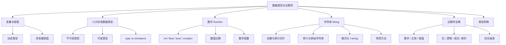

# 第2章 · 数据类型与运算符 — 掌握Python的基石

> **时长**：约 3 小时 ｜ **难度**：⭐ ｜ **类型**：讲解+动手
>
> **目标**：深入理解 Python 的变量机制、六大标准数据类型及其操作，熟练掌握各类运算符的使用规则与优先级。

---

## 学习目标

学完本章后，你将能够：
- 理解 Python 动态类型的概念，掌握多变量赋值语法
- 区分不可变类型（Number / String / Tuple）与可变类型（List / Dict / Set）
- 使用 `type()` 和 `isinstance()` 判断数据类型
- 熟练操作数字类型，理解 `/` 与 `//` 的区别
- 掌握字符串索引、切片、格式化和常用方法
- 完整掌握算术、比较、赋值、位、逻辑、成员、身份七大运算符
- 理解运算符优先级并能用括号控制运算顺序
- 使用 `int()` / `float()` / `str()` 等函数进行显式类型转换

---

## 知识地图



---

## 1、变量与赋值

**概念定义**：变量是用于存储数据的"命名容器"。在 Python 中，变量不需要事先声明类型，赋值时解释器会自动推断数据类型——这就是**动态类型**。

**核心价值**：变量让程序能够保存和复用数据，是程序状态管理的基石。Python 的动态类型让代码编写更加灵活快速。

### 动态类型

```python
# 同一个变量可以先后指向不同类型的值
x = 10          # x 是整数
print(type(x))  # <class 'int'>

x = "Hello"     # x 现在是字符串
print(type(x))  # <class 'str'>

x = 3.14        # x 现在是浮点数
print(type(x))  # <class 'float'>
```

> 在 Python 中，变量更像是"标签"而非"盒子"。它只是贴在对象上的名字，同一个对象可以有多个名字（标签）。

### 多变量赋值

```python
# 同时给多个变量赋值
a, b, c = 1, 2, 3
print(a, b, c)  # 1 2 3

# 交换两个变量（Python 特色语法）
a, b = b, a
print(a, b)     # 2 1

# 相同值赋给多个变量
x = y = z = 0
print(x, y, z)  # 0 0 0

# 结合拆包
name, age, city = "Alice", 20, "北京"
print(f"{name}, {age}岁, 来自{city}")
```

### 变量命名规范

```python
# 推荐的命名风格
user_name = "Alice"       # 蛇形命名法（snake_case）—— 变量和函数
MAX_RETRIES = 5           # 全大写 —— 常量
userName = "Bob"          # 驼峰命名法（camelCase）—— 少用于 Python

# 不推荐的命名
# userName  = "Alice"     # Python 社区更倾向 snake_case
# u = "Alice"             # 无意义缩写在长生命期变量中应避免
```

### ▶ 代码案例

```powershell
cd code/02-数据类型与运算符-代码案例
python variables_demo.py
```

---

## 2、六个标准数据类型

**概念定义**：Python 有六个标准数据类型，按可变性分为两大类。**不可变类型**：Number（数字）、String（字符串）、Tuple（元组）；**可变类型**：List（列表）、Dict（字典）、Set（集合）。

**核心价值**：区分可变与不可变是理解 Python 内存模型的关键。不可变对象一旦创建就不能修改，任何"修改"都会创建新对象；可变对象可以就地修改。这一区别会影响到代码的性能、安全性和调试难度。

```python
# 不可变类型：修改会创建新对象
s = "hello"
print(id(s))        # 内存地址（每次运行不同）
s = s + " world"
print(id(s))        # 地址变了——创建了新字符串

# 可变类型：就地修改
lst = [1, 2, 3]
print(id(lst))      # 初始地址
lst.append(4)
print(id(lst))      # 地址不变——原对象被修改
```

### type() 与 isinstance()

```python
# type() —— 返回对象的类型
print(type(123))         # <class 'int'>
print(type("abc"))       # <class 'str'>
print(type([1, 2]))      # <class 'list'>

# isinstance() —— 判断对象是否为指定类型（推荐）
print(isinstance(123, int))      # True
print(isinstance("abc", str))    # True
print(isinstance([1, 2], list))  # True

# isinstance 支持元组类型检查
print(isinstance(123, (int, float, str)))  # True（是 int 之一）
print(isinstance("abc", (int, float)))      # False（不在元组中）

# type() 和 isinstance() 的区别
class A:
    pass

class B(A):
    pass

obj = B()
print(type(obj) == A)          # False（type 不考虑继承）
print(isinstance(obj, A))      # True（isinstance 考虑继承）
```

### ▶ 代码案例

```powershell
cd code/02-数据类型与运算符-代码案例
python types_overview.py
```

---

## 3、数字（Number）

**概念定义**：Python 的数字类型包括 `int`（整数，无限精度）、`float`（浮点数）、`bool`（布尔值）、`complex`（复数）。它们是程序中进行数学计算的基础。

**核心价值**：理解 Python 数字类型的特性和运算符行为，可以避免数值计算中的常见错误。

### 类型详解

```python
# int —— 无限精度整数
a = 42
b = 2 ** 100        # 大整数毫无压力
print(b)            # 1267650600228229401496703205376

# float —— 双精度浮点数
pi = 3.14159
sci = 1.5e-4        # 科学计数法，即 0.00015

# bool —— 布尔值（int 的子类）
print(True == 1)    # True
print(False == 0)   # True
print(True + True)  # 2（布尔值可直接参与算术运算）

# complex —— 复数
c = 3 + 4j
print(c.real)       # 3.0
print(c.imag)       # 4.0
```

### 数值运算

```python
# 基本运算符
print(10 + 3)       # 13 加法
print(10 - 3)       # 7  减法
print(10 * 3)       # 30 乘法

# 除法 —— 注意两个不同的除法运算符
print(10 / 3)       # 3.3333333333333335  （真除法，永远返回 float）
print(10 // 3)      # 3                   （整除，向下取整）
print(-10 // 3)     # -4                  （向下取整！注意不是 -3）
print(10 % 3)       # 1                   （取模/余数）

# 乘方
print(2 ** 10)      # 1024
print(9 ** 0.5)     # 3.0                 （平方根）

# 混合类型运算 —— 自动提升为更宽类型
print(1 + 2.0)      # 3.0  （int + float → float）
print(True + 1)     # 2    （bool + int → int）
```

### 数学函数

```python
# 内置数学函数
print(abs(-5))         # 5    绝对值
print(round(3.14159, 2))  # 3.14  四舍五入到指定小数位
print(pow(2, 10))      # 1024  乘方，等价于 2 ** 10
print(divmod(13, 4))   # (3, 1)  返回 (商, 余数)

# 导入 math 模块获得更多函数
import math
print(math.floor(3.7))   # 3    向下取整
print(math.ceil(3.2))    # 4    向上取整
print(math.sqrt(16))     # 4.0  平方根
print(math.sin(math.pi / 2))  # 1.0  三角函数
```

### ▶ 代码案例

```powershell
cd code/02-数据类型与运算符-代码案例
python numbers_demo.py
```

---

## 4、字符串（String）

**概念定义**：字符串是由字符组成的不可变序列，用单引号 `'`、双引号 `"` 或三引号 `'''` / `"""` 包裹。字符串是 Python 中使用最频繁的数据类型之一。

**核心价值**：文本处理是编程中最常见的任务之一。熟练掌握字符串的操作方法（索引、切片、格式化、搜索替换等）是每个 Python 开发者的基本功。

### 4.1 创建字符串

```python
# 三种创建方式
s1 = '单引号字符串'
s2 = "双引号字符串"
s3 = """三引号字符串
可以跨越多行
保留换行格式"""

# 引号嵌套
s4 = "I'm learning Python"        # 双引号内含单引号
s5 = '他说："你好"'                # 单引号内含双引号
```

### 4.2 索引和切片

```python
s = "Hello, Python"

# 正索引（从 0 开始）
print(s[0])      # H
print(s[7])      # P

# 负索引（从 -1 开始，从右向左）
print(s[-1])     # n
print(s[-6])     # P

# 切片 [start:end:step]
print(s[0:5])        # Hello    （从索引0到5，不包含5）
print(s[7:])         # Python   （从索引7到末尾）
print(s[:5])         # Hello    （从开头到索引5）
print(s[::2])        # Hlo yhn （步长为2）
print(s[::-1])       # nohtyP ,olleH（反转字符串！）
print(s[7:13:2])     # Pto     （步长为2的区间切片）
```

> 切片返回的是**新字符串**，原字符串不变（因为字符串不可变）。切片的结束索引始终是**不包含**的（左闭右开）。

### 4.3 转义字符与原始字符串

```python
# 常用转义字符
print("第一行\n第二行")       # \n 换行
print("Tab\t缩进")            # \t 制表符
print("她说：\"你好\"")       # \" 双引号转义
print("反斜杠：\\")           # \\ 反斜杠本身

# 原始字符串 r"" —— 取消转义
path = r"C:\Users\new_folder\data"
print(path)          # C:\Users\new_folder\data（不会把 \n 解析为换行）

# 应用：正则表达式
import re
pattern = r"\d{3}-\d{4}"   # 原始字符串让正则更清晰
```

### 4.4 字符串运算符

```python
# 拼接和重复
print("Hello" + " " + "World")   # Hello World  拼接
print("Ha" * 3)                  # HaHaHa       重复

# 成员检测
print("Py" in "Python")          # True
print("xyz" not in "Python")     # True

# 比较运算（基于字典序）
print("apple" < "banana")        # True   （a < b）
print("Python" == "python")      # False  （大小写敏感）
```

### 4.5 字符串格式化

```python
name = "Alice"
age = 20
score = 95.5

# 方式一：% 格式化（旧式）
print("姓名：%s，年龄：%d，分数：%.1f" % (name, age, score))
# 姓名：Alice，年龄：20，分数：95.5

# 方式二：str.format()
print("姓名：{}，年龄：{}，分数：{}".format(name, age, score))
print("姓名：{0}，年龄：{1}，分数：{2}".format(name, age, score))
print("姓名：{n}，年龄：{a}，分数：{s}".format(n=name, a=age, s=score))

# 方式三：f-string（Python 3.6+，推荐）
print(f"姓名：{name}，年龄：{age}，分数：{score}")
print(f"明年 {age + 1} 岁")                    # {} 内可写表达式
print(f"圆周率前两位：{3.14159:.2f}")           # 格式化控制
```

### 4.6 常用字符串方法

```python
text = "  Hello, Python World!  "

print(len(text))                 # 24  字符串长度
print(text.lower())              # "  hello, python world!  "
print(text.upper())              # "  HELLO, PYTHON WORLD!  "
print(text.strip())              # "Hello, Python World!"  去除两端空白
print(text.replace("Python", "Java"))  # "  Hello, Java World!  "

# 分割与连接
csv_line = "apple,banana,orange"
fruits = csv_line.split(",")     # ['apple', 'banana', 'orange']
joined = " | ".join(fruits)      # 'apple | banana | orange'

# 查找
s = "Hello, Python"
print(s.find("Python"))          # 7   返回起始索引
print(s.find("Java"))            # -1  未找到
print(s.startswith("Hello"))     # True
print(s.endswith("thon"))        # True
print(s.count("o"))              # 2   子串出现次数
```

### ▶ 代码案例

```powershell
cd code/02-数据类型与运算符-代码案例
python strings_demo.py
```

---

## 5、运算符全解

**概念定义**：运算符是执行特定操作的符号，它们对操作数（变量或值）进行运算并返回结果。Python 提供了七大类运算符，覆盖从算术到身份判断的完整需求。

**核心价值**：运算符是构造表达式的"黏合剂"。透彻理解每类运算符的行为和优先级，对写出正确、高效的表达式至关重要。

### 5.1 算术运算符

```python
a, b = 17, 5

print(a + b)    # 22  加法
print(a - b)    # 12  减法
print(a * b)    # 85  乘法
print(a / b)    # 3.4 真除法（返回浮点数）
print(a // b)   # 3   整除（向下取整）
print(a % b)    # 2   取模（余数）
print(a ** b)   # 1419857  乘方
```

### 5.2 比较运算符

```python
a, b = 5, 10
print(a == b)    # False  等于
print(a != b)    # True   不等于
print(a > b)     # False  大于
print(a < b)     # True   小于
print(a >= b)    # False  大于等于
print(a <= b)    # True   小于等于

# 链式比较（Python 特色）
age = 25
print(18 <= age <= 60)   # True  （等价于 18 <= age and age <= 60）
```

### 5.3 赋值运算符

```python
x = 10          # 基本赋值
x += 3          # x = x + 3 → 13
x -= 2          # x = x - 2 → 11
x *= 2          # x = x * 2 → 22
x /= 4          # x = x / 4 → 5.5
x //= 2         # x = x // 2 → 2.0
x %= 3          # x = x % 3 → 2.0
x **= 3         # x = x ** 3 → 8.0

# 海象运算符（Python 3.8+）
# 赋值表达式，在表达式中同时赋值
if (n := len("Hello")) > 4:
    print(f"字符串长度为 {n}，超过 4")  # 直接使用了 n
```

### 5.4 位运算符

```python
a, b = 6, 2          # 6 = 0b110, 2 = 0b010

print(a & b)   # 2  按位与    0b110 & 0b010 = 0b010
print(a | b)   # 6  按位或    0b110 | 0b010 = 0b110
print(a ^ b)   # 4  按位异或  0b110 ^ 0b010 = 0b100
print(~a)      # -7 按位取反  ~0b110 = -(0b110+1)
print(a << 1)  # 12 左移      0b110 << 1 = 0b1100
print(a >> 1)  # 3  右移      0b110 >> 1 = 0b011
```

### 5.5 逻辑运算符

```python
a, b = True, False

print(a and b)   # False  逻辑与：两者为真才真
print(a or b)    # True   逻辑或：一个为真即为真
print(not a)     # False  逻辑非：取反

# 短路求值（重要概念）
def get_true():
    print("get_true 被调用了")
    return True

def get_false():
    print("get_false 被调用了")
    return False

# and 短路：左为 False 时，右不执行
result = get_false() and get_true()   # 只输出 "get_false 被调用了"

# or 短路：左为 True 时，右不执行
result = get_true() or get_false()    # 只输出 "get_true 被调用了"

# 短路求值的实用场景
name = input("输入名字：") or "匿名用户"  # 如果用户输入空字符串，使用默认值
print(f"你好，{name}")
```

### 5.6 成员运算符

```python
fruits = ["apple", "banana", "orange"]
print("apple" in fruits)           # True
print("grape" not in fruits)       # True

text = "Hello, Python"
print("Python" in text)            # True （字符串也支持 in）

scores = {"Alice": 95, "Bob": 87}
print("Alice" in scores)           # True （字典成员检测的是键）
```

### 5.7 身份运算符

```python
a = [1, 2, 3]
b = [1, 2, 3]
c = a

print(a is c)        # True  （c 和 a 指向同一个对象）
print(a is b)        # False （a 和 b 内容相同但是不同对象）
print(a == b)        # True  （== 比较的是值，不是身份）

# is 通常用于 None 比较
x = None
if x is None:
    print("x 是 None")

# 小整数缓存（CPython 实现细节）
x = 256
y = 256
print(x is y)        # True  （小整数 -5 到 256 被缓存）

x = 257
y = 257
print(x is y)        # False （超出缓存范围）
```

### ▶ 代码案例

```powershell
cd code/02-数据类型与运算符-代码案例
python operators_demo.py
```

---

## 6、运算符优先级

**概念定义**：运算符优先级决定了在复杂的表达式中，哪个运算先执行。优先级高的运算符先被求值。

**核心价值**：理解优先级能让你写出正确的表达式而无需过度使用括号。但最佳实践是：**用括号明确表达意图**，让代码更加清晰可读。

### 完整优先级表（从高到低）

| 优先级 | 运算符 | 说明 |
|--------|--------|------|
| 1（最高） | `(...)` `[...]` `{...}` | 括号/列表/字典 |
| 2 | `x[index]` `x[index:index]` | 索引、切片 |
| 3 | `**` | 乘方（右结合） |
| 4 | `+x` `-x` `~x` | 一元正/负/按位取反 |
| 5 | `*` `/` `//` `%` | 乘、除、整除、取模 |
| 6 | `+` `-` | 加、减 |
| 7 | `<<` `>>` | 移位 |
| 8 | `&` | 按位与 |
| 9 | `^` | 按位异或 |
| 10 | `|` | 按位或 |
| 11 | `in` `not in` `is` `is not` `<` `<=` `>` `>=` `!=` `==` | 比较/成员/身份 |
| 12 | `not x` | 逻辑非 |
| 13 | `and` | 逻辑与 |
| 14（最低） | `or` | 逻辑或 |

```python
# 优先级示例
x = 2 + 3 * 4        # 14    （乘法优先于加法）
x = (2 + 3) * 4      # 20    （括号改变优先级）

# 链式 vs 优先级
print(True or False and False)   # True   （and 优先级高于 or）
print((True or False) and False) # False  （括号改变逻辑）

# 乘方是右结合
print(2 ** 3 ** 2)   # 512   等价于 2 ** (3 ** 2) = 2 ** 9 = 512
print((2 ** 3) ** 2) # 64    括号改变结合顺序

# 实际建议：用括号让代码意图一目了然
# 不推荐
if a and not b or c:
    pass
# 推荐
if (a and (not b)) or c:
    pass
```

### ▶ 代码案例

```powershell
cd code/02-数据类型与运算符-代码案例
python precedence_demo.py
```

---

## 7、类型转换

**概念定义**：类型转换是将一个数据类型的值转换为另一个数据类型的过程。Python 支持**隐式类型转换**（自动提升）和**显式类型转换**（使用转换函数）。

**核心价值**：显式类型转换是控制数据类型的可靠手段，尤其在处理用户输入、文件读写和跨系统数据交换时至关重要。

### 隐式转换

```python
# Python 自动将窄类型提升为宽类型
print(10 + 3.14)    # 13.14   int → float
print(True + 5)     # 6       bool → int
```

### 显式转换

```python
# int() —— 转换为整数
print(int(3.14))        # 3      （截断，不四舍五入）
print(int("42"))        # 42     （字符串 → 整数）
# print(int("3.14"))    # ValueError！字符串格式必须为整数

# float() —— 转换为浮点数
print(float(3))         # 3.0
print(float("3.14"))    # 3.14

# str() —— 转换为字符串
print(str(42))          # "42"
print(str(3.14))        # "3.14"
print(str(True))        # "True"

# bool() —— 转换为布尔值
# 以下值转换为 False，其余为 True
print(bool(0))          # False
print(bool(0.0))        # False
print(bool(""))         # False（空字符串）
print(bool([]))         # False（空列表）
print(bool(None))       # False
print(bool(42))         # True

# list() / tuple() / set() —— 转换为集合类型
print(list("hello"))    # ['h', 'e', 'l', 'l', 'o']
print(tuple([1, 2, 3]))  # (1, 2, 3)
print(set([1, 2, 2, 3])) # {1, 2, 3}（自动去重）
```

### 类型安全转换实践

```python
def safe_int(value, default=0):
    """安全地将值转换为整数，失败时返回默认值"""
    try:
        return int(value)
    except (ValueError, TypeError):
        return default

print(safe_int("42"))       # 42
print(safe_int("abc"))      # 0 （默认值）
print(safe_int("3.14", -1)) # -1 （无法转换）
```

### ▶ 代码案例

```powershell
cd code/02-数据类型与运算符-代码案例
python type_conversion.py
```

---

## 常见踩坑

1. **混淆 `/` 与 `//`**：`5 / 2` 得到 `2.5`，但 `5 // 2` 得到 `2`。坑在于 `-5 // 2` 得 `-3`（向下取整），而不是 `-2`。如果只需截断向零取整，用 `int(-5 / 2)` 得到 `-2`。

2. **`is` 与 `==` 混用**：`is` 比较对象身份（内存地址），`==` 比较值。`[1, 2] is [1, 2]` 为 `False`（两个不同的列表对象），但 `==` 为 `True`。只有比较 `None` 时推荐用 `is`。

3. **输入忘记类型转换**：`age = input("年龄：")` 得到的是字符串，直接 `age + 1` 会报 `TypeError`。必须显式用 `int()` 转换。

4. **字符串不可变性误解**：`s = "hello"; s[0] = "H"` 报错。字符串不可变，需要重新赋值：`s = "H" + s[1:]`。

5. **整数除法的类型陷阱**：`10 / 2` 返回 `5.0`（float），即使整除。如果需要整数结果，用 `10 // 2` 得 `5`。

6. **浮点数精度问题**：`0.1 + 0.2 == 0.3` 结果是 `False`。这是因为浮点数的二进制表示不精确。比较浮点数时使用 `round()` 或 `math.isclose()`。

---

---

## 本节小结

- ✅ Python 是动态类型语言，变量是对象的"标签"而非"容器"
- ✅ 六大标准类型：Number、String、Tuple（不可变）和 List、Dict、Set（可变）
- ✅ 数字类型包含 int（无限精度）、float、bool、complex
- ✅ 字符串支持索引、切片、格式化和丰富内建方法
- ✅ `/` 是真除法返回 float，`//` 是整除（向下取整）
- ✅ 七类运算符各有用途，逻辑运算符有短路求值特性
- ✅ 用括号控制优先级是良好的编程习惯
- ✅ 使用 `int()` / `float()` / `str()` 等进行显式类型转换
- ✅ `is` 比较对象身份，`==` 比较值

---

> **下一章**：[第3章 · 容器类型深度 — 列表、元组、字典、集合](./第3章%20·%20容器类型深度%20—%20列表、元组、字典、集合.md)——深入四大容器类型，掌握推导式、拆包与集合运算。
