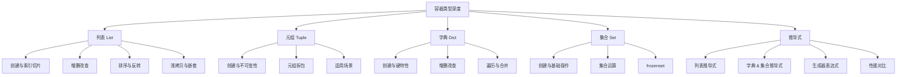

# 第3章 · 容器类型深度 — 列表、元组、字典、集合

> **时长**：约 3.5 小时 ｜ **难度**：⭐⭐ ｜ **类型**：讲解+动手
>
> **目标**：深入掌握 Python 四大容器类型（列表、元组、字典、集合）的创建、操作、方法及高级用法，熟练运用推导式编写简洁高效的代码。

---

## 学习目标

学完本章后，你将能够：
- 熟练操作列表：增删改查、排序、反转、嵌套、浅拷贝与深拷贝
- 理解元组的不可变特性及其典型应用场景（函数多返回值、字典 key）
- 掌握元组拆包语法，包括带 `*` 的扩展拆包
- 灵活使用字典进行键值对管理，区分 `d[key]` 与 `d.get(key)` 的差异
- 使用集合进行高效的成员检测和数学集合运算
- 熟练编写列表、字典、集合推导式及生成器表达式
- 理解推导式与传统循环的性能差异

---

## 知识地图



---

## 1、列表（List）

**概念定义**：列表是 Python 中最灵活的有序可变容器，用方括号 `[]` 表示，元素之间用逗号分隔。列表可以容纳任意类型的数据，并且支持就地修改。

**核心价值**：列表是 Python 中使用频率最高的数据结构之一。它的灵活性（可变、可嵌套、可混合类型）使其适用于绝大多数需要有序集合的场景。

### 1.1 创建列表

```python
# 多种创建方式
empty_list = []
numbers = [1, 2, 3, 4, 5]
mixed = [1, "hello", 3.14, True, None]
nested = [[1, 2], [3, 4], [5, 6]]   # 嵌套列表（矩阵）

# 使用 list() 构造函数
chars = list("hello")               # ['h', 'e', 'l', 'l', 'o']
range_list = list(range(5))         # [0, 1, 2, 3, 4]

# 列表可以动态增长
dynamic = []
dynamic.append(1)
dynamic.append("two")
dynamic.append([3, 4])
print(dynamic)  # [1, 'two', [3, 4]]
```

### 1.2 索引与切片

```python
fruits = ["apple", "banana", "orange", "grape", "kiwi"]

# 正索引（0 开始）
print(fruits[0])   # apple
print(fruits[2])   # orange

# 负索引（-1 开始）
print(fruits[-1])  # kiwi
print(fruits[-2])  # grape

# 切片 [start:end:step]
print(fruits[1:4])        # ['banana', 'orange', 'grape']
print(fruits[:3])         # ['apple', 'banana', 'orange']
print(fruits[2:])         # ['orange', 'grape', 'kiwi']
print(fruits[::2])        # ['apple', 'orange', 'kiwi']
print(fruits[::-1])       # ['kiwi', 'grape', 'orange', 'banana', 'apple']

# 切片可用于赋值（修改部分元素）
fruits[1:3] = ["blueberry", "cherry"]
print(fruits)  # ['apple', 'blueberry', 'cherry', 'grape', 'kiwi']
```

### 1.3 增删改查

```python
items = [1, 2, 3]

# --- 增加元素 ---
items.append(4)               # 末尾追加     [1, 2, 3, 4]
items.insert(0, 0)            # 指定位置插入 [0, 1, 2, 3, 4]
items.extend([5, 6, 7])       # 扩展列表     [0, 1, 2, 3, 4, 5, 6, 7]

# --- 删除元素 ---
items.pop()                   # 删除并返回末尾元素 → 7
items.pop(0)                  # 删除并返回索引0元素 → 0
items.remove(3)               # 删除第一个值为3的元素
# del 语句
del items[0]                  # 删除索引0元素
del items[1:3]                # 切片删除
# del items                  # 删除整个列表对象

# --- 改与查 ---
items = [10, 20, 30, 40, 20]
items[1] = 25                 # 修改索引1 → [10, 25, 30, 40, 20]
print(items.index(30))        # 2            查找元素索引
print(items.count(20))        # 2            统计出现次数
print(40 in items)            # True         成员检测
```

### 1.4 排序与反转

```python
numbers = [3, 1, 4, 1, 5, 9, 2, 6]

# sort() —— 就地排序（修改原列表）
numbers.sort()                # 升序 [1, 1, 2, 3, 4, 5, 6, 9]
numbers.sort(reverse=True)    # 降序 [9, 6, 5, 4, 3, 2, 1, 1]

# sorted() —— 返回新列表（原列表不变）
nums = [3, 1, 4, 1, 5]
sorted_nums = sorted(nums)    # [1, 1, 3, 4, 5]
print(nums)                   # [3, 1, 4, 1, 5]  原列表未变

# sort() / sorted() 的 key 参数
words = ["banana", "apple", "cherry", "date"]
words.sort(key=len)           # 按字符串长度排序
print(words)                  # ['date', 'apple', 'banana', 'cherry']

words.sort(key=lambda x: x[-1])  # 按最后一个字母排序
print(words)                  # ['banana', 'date', 'apple', 'cherry']

# reverse() —— 就地反转
numbers = [1, 2, 3, 4, 5]
numbers.reverse()
print(numbers)                # [5, 4, 3, 2, 1]

# reversed() —— 返回反向迭代器
for n in reversed([1, 2, 3]):
    print(n, end=" ")         # 3 2 1
```

### 1.5 复制与浅拷贝问题

```python
# 直接赋值不是复制——只是给同一对象贴了新标签
original = [1, 2, 3]
alias = original
alias[0] = 99
print(original)               # [99, 2, 3]  原列表也被改了！

# 正确复制方式
# 方式一：copy() 方法
original = [1, 2, 3]
shallow = original.copy()
shallow[0] = 99
print(original)               # [1, 2, 3]   原列表不受影响
print(shallow)                # [99, 2, 3]

# 方式二：list() 构造函数
shallow2 = list(original)

# 方式三：切片
shallow3 = original[:]

# 浅拷贝的局限性——嵌套列表
matrix = [[1, 2], [3, 4]]
shallow = matrix.copy()
shallow[0][0] = 99
print(matrix)                 # [[99, 2], [3, 4]]  原列表也被改了！

# 深拷贝——递归复制所有嵌套对象
import copy
matrix = [[1, 2], [3, 4]]
deep = copy.deepcopy(matrix)
deep[0][0] = 99
print(matrix)                 # [[1, 2], [3, 4]]   不受影响
print(deep)                   # [[99, 2], [3, 4]]
```

### 1.6 列表脚本操作符

```python
# 拼接 +
a = [1, 2, 3]
b = [4, 5, 6]
print(a + b)                  # [1, 2, 3, 4, 5, 6]

# 重复 *
print(a * 3)                  # [1, 2, 3, 1, 2, 3, 1, 2, 3]

# 成员检测 in
print(2 in a)                 # True
print(10 not in a)            # True

# 长度、最大、最小、求和
print(len(a))                 # 3
print(max(a))                 # 3
print(min(a))                 # 1
print(sum(a))                 # 6
```

### ▶ 代码案例

```powershell
cd code/03-容器类型-代码案例
python list_demo.py
```

---

## 2、元组（Tuple）

**概念定义**：元组是不可变的有序序列，用圆括号 `()` 表示。元组创建后不能修改（不能增、删、改元素），这种不可变性使元组更安全、更轻量。

**核心价值**：元组的不可变性使其可以作为字典的键，也可以安全地在多线程/多函数间传递而不用担心被意外修改。同时，元组拆包是 Python 优雅代码的重要特征之一。

### 2.1 创建元组

```python
# 基本创建
empty = ()                     # 空元组
single = (1,)                  # 单元素元组——逗号不能省略！
not_tuple = (1)                # 这是整数 1，不是元组！

# 省略括号（逗号创建元组）
t = 1, 2, 3                    # (1, 2, 3)
print(type(t))                 # <class 'tuple'>

# tuple() 构造函数
t = tuple([1, 2, 3])           # (1, 2, 3)  从列表转换
t = tuple("abc")               # ('a', 'b', 'c')
```

### 2.2 元组的不可变性

```python
t = (1, 2, 3, [4, 5])

# 元组本身不可变——以下操作都会报错
# t[0] = 10          # TypeError: 'tuple' object does not support item assignment
# t.append(6)        # AttributeError: 'tuple' object has no attribute 'append'
# del t[0]           # TypeError

# 但如果元组包含可变对象，该对象内部可以修改
t[3].append(6)       # 元组的第4个元素（列表）可以修改
print(t)             # (1, 2, 3, [4, 5, 6])
```

### 2.3 元组拆包

```python
# 基础拆包
point = (3, 4)
x, y = point
print(x, y)                   # 3 4

# 交换变量（本质就是元组拆包）
a, b = 10, 20
a, b = b, a
print(a, b)                   # 20 10

# 函数返回多个值（本质是返回元组）
def min_max(lst):
    return min(lst), max(lst)

result = min_max([3, 1, 7, 2, 9])
print(result)                 # (1, 9)
low, high = min_max([3, 1, 7, 2, 9])
print(low, high)              # 1 9

# 扩展拆包（Python 3+）
first, second, *rest = (1, 2, 3, 4, 5)
print(first)                  # 1
print(second)                 # 2
print(rest)                   # [3, 4, 5]  （rest 永远是列表）

first, *middle, last = (1, 2, 3, 4, 5)
print(first)                  # 1
print(middle)                 # [2, 3, 4]
print(last)                   # 5

*_, last_two = (1, 2, 3, 4, 5, 6)
print(last_two)               # 6   （_ 用于忽略不需要的值）

# 拆包在循环中的应用
students = [("Alice", 20), ("Bob", 22), ("Charlie", 21)]
for name, age in students:
    print(f"{name} 今年 {age} 岁")
```

### 2.4 元组内置函数

```python
t = (3, 1, 4, 1, 5, 9, 2)

print(len(t))                 # 7
print(max(t))                 # 9
print(min(t))                 # 1
print(sum(t))                 # 25
print(t.count(1))             # 2   元素 1 出现了几次
print(t.index(4))             # 2   元素 4 的索引
```

### 2.5 元组的适用场景

```python
# 场景一：函数返回多个值
def get_user_info(user_id):
    # 模拟数据库查询
    return ("Alice", 20, "alice@example.com")

name, age, email = get_user_info(1)

# 场景二：作为字典的键
# 列表不能作为字典键，但元组可以
locations = {
    (40.7128, -74.0060): "纽约",
    (31.2304, 121.4737): "上海",
    (35.6762, 139.6503): "东京",
}
print(locations[(40.7128, -74.0060)])  # 纽约

# 场景三：需要保证数据不被修改
# 比如一周的天数应该是常量
DAYS_OF_WEEK = ("Mon", "Tue", "Wed", "Thu", "Fri", "Sat", "Sun")

# 场景四：比列表更节省内存
import sys
lst = [1, 2, 3, 4, 5]
tup = (1, 2, 3, 4, 5)
print(sys.getsizeof(lst))     # ~120 字节
print(sys.getsizeof(tup))     # ~80  字节（更小）
```

### ▶ 代码案例

```powershell
cd code/03-容器类型-代码案例
python tuple_demo.py
```

---

## 3、字典（Dict）

**概念定义**：字典是无序的键值对（key-value）集合，用花括号 `{}` 表示。键必须是不可变类型（hashable），且唯一；值可以是任意类型。Python 3.7+ 中字典保持插入顺序。

**核心价值**：字典是 Python 最高效的数据结构之一——它的哈希表实现使得查找、插入、删除的平均时间复杂度均为 O(1)。字典是构建映射关系、缓存、配置管理和 JSON 数据处理的核心工具。

### 3.1 创建字典

```python
# 方式一：花括号
empty = {}
scores = {"Alice": 95, "Bob": 87, "Charlie": 92}

# 方式二：dict() 构造函数
d = dict(name="Alice", age=20, city="北京")
print(d)                      # {'name': 'Alice', 'age': 20, 'city': '北京'}

# 方式三：从可迭代对象创建
pairs = [("a", 1), ("b", 2), ("c", 3)]
d = dict(pairs)
print(d)                      # {'a': 1, 'b': 2, 'c': 3}

# 方式四：字典推导式（详见推导式章节）
squares = {x: x**2 for x in range(5)}
print(squares)                # {0: 0, 1: 1, 2: 4, 3: 9, 4: 16}
```

### 3.2 键的特性

```python
# 键必须可哈希（hashable）——即不可变类型
valid_dict = {
    42: "整数 key",               # int 可哈希
    3.14: "浮点数 key",           # float 可哈希  
    "name": "字符串 key",         # str 可哈希
    (1, 2): "元组 key",          # tuple 可哈希
    True: "布尔 key",            # bool 可哈希
}

# 不可哈希的类型不能作为键
# invalid_dict = {
#     [1, 2]: "列表 key",        # TypeError: unhashable type: 'list'
#     {"a": 1}: "字典 key",      # TypeError: unhashable type: 'dict'
#     {1, 2}: "集合 key",        # TypeError: unhashable type: 'set'
# }

# 键必须唯一——重复键后面的值会覆盖前面的
d = {"a": 1, "b": 2, "a": 100}
print(d)                      # {'a': 100, 'b': 2}
```

### 3.3 增删改查

```python
user = {"name": "Alice", "age": 20}

# --- 查 ---
print(user["name"])           # Alice      直接用键访问
print(user.get("age"))        # 20         get() 安全访问
print(user.get("gender", "未知"))  # 未知   键不存在时返回默认值
# print(user["gender"])        # KeyError! 不存在的键直接报错

# --- 增 ---
user["email"] = "alice@example.com"
print(user)

# --- 改 ---
user["age"] = 21
print(user)

# --- 删 ---
del user["email"]             # 删除指定键
# del user["nonexistent"]      # KeyError!
removed_age = user.pop("age") # 删除并返回值
print(removed_age)            # 21
last_item = user.popitem()    # 删除并返回最后一个键值对 (Python 3.7+)
user.clear()                  # 清空字典
print(user)                   # {}
```

### 3.4 字典遍历

```python
scores = {"Alice": 95, "Bob": 87, "Charlie": 92, "Diana": 78}

# 遍历键
for name in scores:
    print(name, end=" ")      # Alice Bob Charlie Diana

print()

for name in scores.keys():
    print(name, end=" ")      # Alice Bob Charlie Diana

# 遍历值
for score in scores.values():
    print(score, end=" ")     # 95 87 92 78

print()

# 遍历键值对
for name, score in scores.items():
    print(f"{name}: {score}")

# 按值筛选
high_scorers = {name: score for name, score in scores.items() if score >= 90}
print(high_scorers)           # {'Alice': 95, 'Charlie': 92}
```

### 3.5 常用方法

```python
d = {"a": 1, "b": 2}

# setdefault —— 键不存在时设置默认值
d.setdefault("c", 0)          # "c" 不存在，设为 0
d.setdefault("a", 99)         # "a" 已存在，不做任何操作
print(d)                      # {'a': 1, 'b': 2, 'c': 0}

# update —— 合并字典
d.update({"d": 4, "e": 5})
print(d)                      # {'a': 1, 'b': 2, 'c': 0, 'd': 4, 'e': 5}

d.update({"a": 100})          # 更新已有键
print(d)                      # {'a': 100, 'b': 2, 'c': 0, 'd': 4, 'e': 5}

# fromkeys —— 从键序列创建字典
keys = ["name", "age", "city"]
default_dict = dict.fromkeys(keys, "未知")
print(default_dict)           # {'name': '未知', 'age': '未知', 'city': '未知'}

# copy —— 浅拷贝（与列表浅拷贝同理）
original = {"nested": {"value": 1}}
shallow = original.copy()
shallow["nested"]["value"] = 99
print(original["nested"]["value"])  # 99  被影响了！
```

### 3.6 嵌套字典

```python
# 实际项目中的常见结构——用户信息数据库
users = {
    "u001": {
        "name": "Alice",
        "age": 20,
        "scores": {"math": 95, "english": 88, "python": 92},
        "tags": ["优秀学生", "编程爱好者"]
    },
    "u002": {
        "name": "Bob",
        "age": 22,
        "scores": {"math": 78, "english": 85, "python": 80},
        "tags": ["进步较快"]
    }
}

# 访问嵌套数据
print(users["u001"]["name"])              # Alice
print(users["u001"]["scores"]["python"])  # 92
print(users["u002"]["tags"][0])           # 进步较快

# 遍历嵌套数据
for uid, info in users.items():
    avg_score = sum(info["scores"].values()) / len(info["scores"])
    print(f"{info['name']} 平均分：{avg_score:.1f}")
```

### 3.7 字典合并

```python
d1 = {"a": 1, "b": 2}
d2 = {"c": 3, "d": 4}

# 方式一：update() 方法
merged = d1.copy()
merged.update(d2)
print(merged)                 # {'a': 1, 'b': 2, 'c': 3, 'd': 4}

# 方式二：| 运算符（Python 3.9+）
merged = d1 | d2
print(merged)                 # {'a': 1, 'b': 2, 'c': 3, 'd': 4}

# 合并时键冲突的规则（右侧覆盖左侧）
d1 = {"a": 1, "b": 2}
d2 = {"b": 99, "c": 3}
print(d1 | d2)                # {'a': 1, 'b': 99, 'c': 3}  d2 的 "b" 覆盖了 d1 的

# |= 就地合并
d1 |= d2
print(d1)                     # {'a': 1, 'b': 99, 'c': 3}
```

### ▶ 代码案例

```powershell
cd code/03-容器类型-代码案例
python dict_demo.py
```

---

## 4、集合（Set）

**概念定义**：集合是无序的、不重复元素的容器，用花括号 `{}` 表示。集合基于哈希表实现，主要用途是去重和数学集合运算（交集、并集、差集等）。

**核心价值**：当需要快速检测某个元素是否存在、去除重复项、或进行数学集合操作时，集合是 Python 中最优选择。集合的成员检测时间复杂度为平均 O(1)，远优于列表的 O(n)。

### 4.1 创建集合

```python
# 直接使用花括号（不能创建空集合）
fruits = {"apple", "banana", "orange", "apple"}  # 重复的 "apple" 会被自动去重
print(fruits)                 # {'orange', 'banana', 'apple'}

# set() 构造函数
empty_set = set()             # 空集合——不能用 {}（那是空字典！）
chars = set("hello")          # {'h', 'e', 'l', 'o'}  去重且无序
numbers = set([1, 2, 2, 3])   # {1, 2, 3}  从列表创建
```

### 4.2 添加与删除

```python
s = {1, 2, 3}

# 添加
s.add(4)                      # {1, 2, 3, 4}
s.add(2)                      # 已存在，无变化（不会报错）
print(s)                      # {1, 2, 3, 4}

s.update([5, 6, 7])           # 批量添加 {1, 2, 3, 4, 5, 6, 7}
s.update({8, 9}, (10, 11))    # 可以传入多个可迭代对象
print(s)                      # {1, 2, 3, 4, 5, 6, 7, 8, 9, 10, 11}

# 删除
s.remove(11)                  # 删除元素，不存在则报 KeyError
s.discard(100)                # 删除元素，不存在也**不报错**（安全删除）
x = s.pop()                   # 删除并返回任意一个元素（集合无序）
print(f"被 pop 的元素：{x}")

s.clear()                     # 清空集合
print(s)                      # set()
```

### 4.3 集合运算

```python
a = {1, 2, 3, 4, 5}
b = {4, 5, 6, 7, 8}

# 交集 —— 同时属于 a 和 b
print(a & b)                  # {4, 5}
print(a.intersection(b))      # {4, 5}  方法形式

# 并集 —— 属于 a 或 b（或两者）
print(a | b)                  # {1, 2, 3, 4, 5, 6, 7, 8}
print(a.union(b))             # {1, 2, 3, 4, 5, 6, 7, 8}

# 差集 —— 属于 a 但不属于 b
print(a - b)                  # {1, 2, 3}
print(a.difference(b))        # {1, 2, 3}
print(b - a)                  # {8, 6, 7}

# 对称差集 —— 属于 a 或 b 但不同时属于两者
print(a ^ b)                  # {1, 2, 3, 6, 7, 8}
print(a.symmetric_difference(b))

# 子集 / 超集判断
x = {1, 2, 3}
y = {1, 2, 3, 4, 5}
print(x <= y)                 # True   x 是 y 的子集
print(x.issubset(y))          # True
print(y >= x)                 # True   y 是 x 的超集
print(y.issuperset(x))        # True

# 真子集（严格子集——不等于）
print(x < y)                  # True   x 是 y 的真子集
print({1, 2, 3} < {1, 2, 3})  # False  相等不是真子集

# 不相交判断
print({1, 2}.isdisjoint({3, 4}))  # True   两个集合没有共同元素
print({1, 2}.isdisjoint({1, 3}))  # False  有共同元素
```

### 4.4 集合的实际应用

```python
# 应用一：列表去重
names = ["Alice", "Bob", "Alice", "Charlie", "Bob", "Diana"]
unique_names = list(set(names))
print(unique_names)           # ['Diana', 'Bob', 'Alice', 'Charlie']（顺序不保证）

# 保持顺序的去重
def unique_ordered(items):
    seen = set()
    result = []
    for item in items:
        if item not in seen:
            seen.add(item)
            result.append(item)
    return result

print(unique_ordered(names))  # ['Alice', 'Bob', 'Charlie', 'Diana']

# 应用二：共同元素查找
user_a_books = {"Python入门", "数据结构", "算法导论", "设计模式"}
user_b_books = {"Python入门", "机器学习", "算法导论", "深度学习"}

common = user_a_books & user_b_books
print(f"共同拥有的书：{common}")

recommend = user_a_books - user_b_books
print(f"推荐给B的书：{recommend}")

# 应用三：数据验证
valid_statuses = {"active", "inactive", "pending", "suspended"}
input_status = "deleted"
if input_status not in valid_statuses:
    print(f"错误：'{input_status}' 不是有效的状态值")
```

### 4.5 frozenset —— 不可变集合

```python
# frozenset 是不可变的集合，可以作为字典的键或集合的元素
immutable = frozenset([1, 2, 3])
print(immutable)              # frozenset({1, 2, 3})

# frozenset 可以作为字典的键
group_members = {
    frozenset(["Alice", "Bob"]): "小组A",
    frozenset(["Charlie", "Diana"]): "小组B",
}
print(group_members[frozenset(["Bob", "Alice"])])  # 小组A（顺序不重要）

# frozenset 可以作为集合的元素
s = set()
s.add(frozenset([1, 2]))
s.add(frozenset([3, 4]))
print(s)                      # {frozenset({1, 2}), frozenset({3, 4})}
# s.add({1, 2})              # TypeError: unhashable type: 'set'
```

### ▶ 代码案例

```powershell
cd code/03-容器类型-代码案例
python set_demo.py
```

---

## 5、推导式

**概念定义**：推导式（Comprehensions）是 Python 提供的一种从现有可迭代对象创建新容器的简洁语法。它通过单行表达式替代传统的 for 循环构造，使代码更加简洁、优雅、可读。

**核心价值**：推导式体现了 Python "简洁优雅"的设计哲学。熟练使用推导式可以显著减少代码行数，同时保持可读性。在性能上，推导式通常比等价的 for 循环更快。

### 5.1 列表推导式

```python
# 基本形式：[表达式 for 变量 in 可迭代对象 if 条件]

# 示例一：生成平方数列表
squares = [x ** 2 for x in range(10)]
print(squares)                # [0, 1, 4, 9, 16, 25, 36, 49, 64, 81]

# 等价传统循环
squares_loop = []
for x in range(10):
    squares_loop.append(x ** 2)
# 推导式更简洁！

# 示例二：带条件的推导式
evens = [x for x in range(20) if x % 2 == 0]
print(evens)                  # [0, 2, 4, 6, 8, 10, 12, 14, 16, 18]

# 示例三：同时使用 if-else（注意语法位置不同）
labels = ["even" if x % 2 == 0 else "odd" for x in range(5)]
print(labels)                 # ['even', 'odd', 'even', 'odd', 'even']

# 示例四：操作字符串
words = ["hello", "world", "python", "list"]
upper_words = [w.upper() for w in words]
print(upper_words)            # ['HELLO', 'WORLD', 'PYTHON', 'LIST']

# 示例五：嵌套循环的推导式
matrix = [[1, 2, 3], [4, 5, 6], [7, 8, 9]]
flattened = [num for row in matrix for num in row]
print(flattened)              # [1, 2, 3, 4, 5, 6, 7, 8, 9]

# 等价于：
flattened_loop = []
for row in matrix:
    for num in row:
        flattened_loop.append(num)
```

### 5.2 字典推导式

```python
# 基本形式：{键表达式: 值表达式 for 变量 in 可迭代对象 if 条件}

# 示例一：生成数字平方映射
squares = {x: x ** 2 for x in range(5)}
print(squares)                # {0: 0, 1: 1, 2: 4, 3: 9, 4: 4}

# 示例二：过滤并变换
scores = {"Alice": 95, "Bob": 87, "Charlie": 92, "Diana": 78}
passed = {name: score for name, score in scores.items() if score >= 80}
print(passed)                 # {'Alice': 95, 'Bob': 87, 'Charlie': 92}

# 示例三：键值互换
inverted = {score: name for name, score in scores.items()}
print(inverted)               # {95: 'Alice', 87: 'Bob', 92: 'Charlie', 78: 'Diana'}

# 示例四：字符串处理
text = "hello world"
char_count = {char: text.count(char) for char in set(text) if char != " "}
print(char_count)             # {'h': 1, 'w': 1, 'l': 3, 'r': 1, 'd': 1, 'e': 1, 'o': 2}
```

### 5.3 集合推导式

```python
# 基本形式：{表达式 for 变量 in 可迭代对象 if 条件}

# 示例一：字符串中的唯一字符长度
words = ["apple", "banana", "apple", "cherry"]
unique_lengths = {len(w) for w in words}
print(unique_lengths)         # {5, 6}  （自动去重）

# 示例二：简单数学变换
evens_set = {x for x in range(20) if x % 2 == 0}
print(evens_set)              # {0, 2, 4, 6, 8, 10, 12, 14, 16, 18}

# 示例三：类型过滤
mixed = [1, "hello", 2.5, "world", 3, 4.0, "python"]
strings = {item for item in mixed if isinstance(item, str)}
print(strings)                # {'hello', 'world', 'python'}
```

### 5.4 生成器表达式

**概念定义**：生成器表达式使用圆括号 `()`，语法与列表推导式相同，但它不会一次性构建整个列表，而是返回一个生成器对象，按需惰性求值。这不是"元组推导式"（Python 没有元组推导式）。

**核心价值**：当处理大量数据时，生成器表达式可以大幅节省内存。它一次只产生一个元素，而非将整个序列加载到内存中。

```python
# 生成器表达式 vs 列表推导式

# 列表推导式——立即计算所有元素
list_squares = [x ** 2 for x in range(10)]
print(list_squares)           # [0, 1, 4, 9, ...]  内存中已有所有值
print(type(list_squares))     # <class 'list'>

# 生成器表达式——惰性计算
gen_squares = (x ** 2 for x in range(10))
print(gen_squares)            # <generator object <genexpr> at 0x...>
print(type(gen_squares))      # <class 'generator'>

# 逐个获取值
print(next(gen_squares))      # 0
print(next(gen_squares))      # 1
print(next(gen_squares))      # 4
# ... 或者用循环遍历
for val in gen_squares:
    print(val, end=" ")       # 9 16 25 36 49 64 81
print()

# 生成器表达式常用于函数参数
total = sum(x ** 2 for x in range(1000000))  # 巨大的数据量也不占内存
print(total)

# 内存对比
import sys
list_comp = [x for x in range(100000)]
gen_expr = (x for x in range(100000))
print(f"列表推导式内存：{sys.getsizeof(list_comp)} 字节")
print(f"生成器表达式内存：{sys.getsizeof(gen_expr)} 字节")
# 列表内存远大于生成器！
```

### 5.5 嵌套推导式

```python
# 矩阵转置
matrix = [
    [1, 2, 3],
    [4, 5, 6],
    [7, 8, 9],
]

transposed = [[row[i] for row in matrix] for i in range(3)]
print(transposed)             # [[1, 4, 7], [2, 5, 8], [3, 6, 9]]

# 等价于：
transposed_loop = []
for i in range(3):
    col = []
    for row in matrix:
        col.append(row[i])
    transposed_loop.append(col)

# 扁平化二维列表
matrix = [[1, 2], [3, 4], [5, 6]]
flat = [x for row in matrix for x in row]
print(flat)                   # [1, 2, 3, 4, 5, 6]
```

### 5.6 推导式 vs 传统循环：性能对比

```python
import time

def test_list_comp():
    return [x ** 2 for x in range(1000000)]

def test_for_loop():
    result = []
    for x in range(1000000):
        result.append(x ** 2)
    return result

# 性能测试
start = time.time()
list_comp_result = test_list_comp()
print(f"列表推导式：{time.time() - start:.4f} 秒")

start = time.time()
loop_result = test_for_loop()
print(f"for 循环：{time.time() - start:.4f} 秒")

# 推导式通常比 for 循环快 10-30%
```

### ▶ 代码案例

```powershell
cd code/03-容器类型-代码案例
python comprehensions_demo.py
```

---

## 常见踩坑

1. **列表作为函数默认参数**：`def add_item(item, lst=[])` 中的默认列表是**同一个对象**，多次调用会累积元素。正确做法是 `def add_item(item, lst=None)`，内部用 `if lst is None: lst = []`。

2. **集合去重丢失顺序**：`list(set([3, 1, 2, 1, 4]))` 结果可能是 `[1, 2, 3, 4]`（顺序不可预测）。如果需要去重且保持顺序，用 `dict.fromkeys()`（Python 3.7+ 字典有序）或自定义 `unique_ordered` 函数。

3. **字典访问用 `[]` 时 KeyError**：不确定键是否存在时，用 `d.get(key, default)` 替代 `d[key]`，避免程序崩溃。

4. **元组单元素忘加逗号**：`(1)` 是整数 1，不是元组。正确写法：`(1,)`。当函数返回 `(result)` 时也可能踩坑。

5. **浅拷贝误改嵌套结构**：`list2 = list1.copy()` 后，修改 `list2` 中的嵌套列表（如 `list2[0].append(x)`）会同时影响 `list1`。用 `copy.deepcopy()` 解决。

6. **字典推导式键冲突**：当多个键映射到同一个值时，`inverted = {v: k for k, v in d.items()}` 会丢失部分数据（后来的覆盖前面的）。注意值是否唯一。

7. **生成器只能遍历一次**：生成器是一次性的，遍历完后再用 `for` 循环就不会有输出了。如果需要多次使用数据，请用列表推导式。

---

---

## 本节小结

- ✅ 列表是有序可变容器，支持增删改查、排序、反转、嵌套和丰富切片操作
- ✅ 浅拷贝只复制一层，嵌套可变对象需用 `copy.deepcopy()` 深拷贝
- ✅ 元组是不可变序列，单元素元组必须加逗号，可用做字典键
- ✅ 拆包语法极大提升代码优雅度，`*rest` 扩展拆包处理不定长度
- ✅ 字典是键值对容器，键必须可哈希，`get()` 比 `[]` 更安全
- ✅ 字典合并可用 `|` 运算符（Python 3.9+）
- ✅ 集合自动去重，支持完整的数学集合运算（交、并、差、对称差）
- ✅ 推导式是 Python 特色的简洁语法，列表/字典/集合各有一套
- ✅ 生成器表达式使用圆括号，惰性求值，节省内存

---

> **下一章**：第4章 · 流程控制与函数 — 逻辑、循环与代码复用——掌握条件分支、循环结构以及函数的定义与调用，编写结构化程序。
