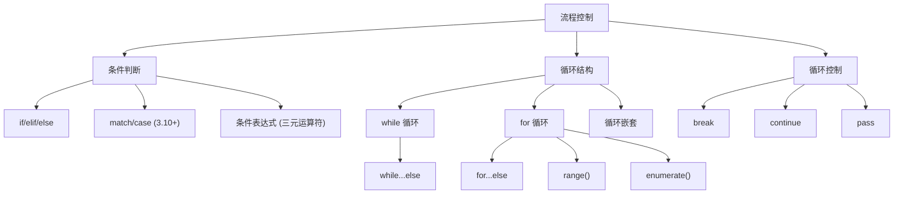

# 第4章 · 流程控制 — 条件判断与循环

> **时长**：约 2.5 小时 ｜ **难度**：⭐⭐ ｜ **类型**：讲解+动手
>
> **目标**：掌握 Python 的条件判断与循环控制机制，能够用 if/match/while/for 结构编写逻辑清晰的流程控制代码。

---

## 学习目标

学完本章后，你将能够：
- 熟练使用 if/elif/else 进行条件分支判断，理解真值测试规则
- 使用 Python 3.10+ 的 match/case 语句进行模式匹配
- 掌握 while 和 for 循环的语法及 else 子句的用法
- 灵活运用 break、continue、pass 控制循环流程
- 编写循环嵌套代码（如九九乘法表）并理解 break 的作用域规则

---

## 知识地图



---

## 1、条件判断 if/elif/else

**概念定义**：条件判断语句根据布尔表达式的结果（True 或 False）决定程序执行哪一条分支路径。Python 使用 `if`、`elif`、`else` 关键字构成完整的条件分支结构，每个分支通过缩进（4个空格）标识代码块。

**核心价值**：条件判断是所有程序逻辑的基础。无论是用户输入校验、业务规则判断、还是 AI 模型输出的后处理，都需要依赖条件分支来决定程序的走向。

```python
# 基本语法结构
score = 85

if score >= 90:
    grade = "A"
elif score >= 80:
    grade = "B"
elif score >= 70:
    grade = "C"
elif score >= 60:
    grade = "D"
else:
    grade = "F"

print(f"成绩等级：{grade}")  # 输出：成绩等级：B
```

**缩进规则**：Python 使用缩进（通常为 4 个空格）表示代码块的归属。同一代码块内的所有语句必须保持相同的缩进级别。

```python
# 正确的缩进
age = 20
if age >= 18:
    print("你已经成年了")      # 这行属于 if 块
    print("可以考驾照了")      # 这行也属于 if 块
# 缩进结束，回到外层
print("程序结束")

# 错误的缩进（会引发 IndentationError）
# if age >= 18:
#     print("你已经成年了")
#    print("这行缩进不一致")  # IndentationError
```

**布尔值与真值测试**：在 Python 中，任何对象都可以用于条件判断。以下值会被视为 `False`，其余都被视为 `True`：

```python
# 以下所有值在条件判断中均为 False
bool(False)      # False
bool(None)       # False
bool(0)          # False
bool(0.0)        # False
bool("")         # False（空字符串）
bool([])         # False（空列表）
bool({})         # False（空字典）
bool(())         # False（空元组）
bool(set())      # False（空集合）

# 实际应用：简化判空检查
data = []
if not data:                     # 等价于 if len(data) == 0:
    print("列表为空，无需处理")

name = input("请输入姓名：") or "匿名用户"   # 空字符串回退
print(f"你好，{name}")
```

**条件表达式（三元运算符）**：Python 通过 `x if condition else y` 语法实现单行的条件赋值。

```python
# 条件表达式语法
age = 19
status = "成年" if age >= 18 else "未成年"
print(status)  # 输出：成年

# 嵌套使用（不推荐，可读性差）
x = 10
result = "正数" if x > 0 else "零" if x == 0 else "负数"
# 等价于：
if x > 0:
    result = "正数"
elif x == 0:
    result = "零"
else:
    result = "负数"

# 实用场景：列表解析中的条件表达式
scores = [85, 42, 73, 91, 58]
results = ["及格" if s >= 60 else "不及格" for s in scores]
print(results)  # 输出：['及格', '不及格', '及格', '及格', '不及格']
```

**嵌套 if**：在一个条件分支内部再嵌入完整的条件判断结构。

```python
# 嵌套 if 示例
x = 15

if x > 0:
    print("x 是正数")
    if x % 2 == 0:
        print("x 是偶数")
    else:
        print("x 是奇数")
else:
    print("x 不是正数")

# 注意：深层嵌套会降低可读性，建议用逻辑运算符简化
# 不推荐（深层嵌套）：
# if condition_a:
#     if condition_b:
#         if condition_c:
#             do_something()

# 推荐（扁平化）：
# if condition_a and condition_b and condition_c:
#     do_something()
```

### ▶ 代码案例

```powershell
cd code/04-流程控制-代码案例
python if_demo.py
```

---

## 2、match/case 语句（Python 3.10+）

**概念定义**：`match/case` 是 Python 3.10 引入的结构化模式匹配语句，类似于其他语言的 switch/case，但功能远不止于此。它可以根据值的结构、类型和内容进行多维度匹配。

**核心价值**：match/case 让多分支判断的代码更加清晰易读，特别适合处理多种数据形态的解构匹配，是函数式编程风格的重要补充。

```python
# 基本语法：匹配字面量
def describe_number(n):
    match n:
        case 0:
            return "零"
        case 1:
            return "一"
        case 2:
            return "二"
        case _:          # 通配符，匹配任意值（类似 default）
            return "其他数字"

print(describe_number(1))  # 输出：一
print(describe_number(5))  # 输出：其他数字
```

**匹配序列**：可以解构匹配列表、元组等序列类型。

```python
# 匹配序列
def process_point(point):
    match point:
        case [0, 0]:
            return "原点"
        case [0, y]:
            return f"Y 轴上的点，y={y}"
        case [x, 0]:
            return f"X 轴上的点，x={x}"
        case [x, y]:
            return f"坐标为 ({x}, {y})"
        case _:
            return "不是二维坐标点"

print(process_point([3, 5]))   # 输出：坐标为 (3, 5)
print(process_point([0, 7]))   # 输出：Y 轴上的点，y=7

# 匹配带剩余元素的序列
def analyze_list(data):
    match data:
        case [first, *rest]:
            return f"第一个元素：{first}，剩余 {len(rest)} 个元素"
        case []:
            return "空列表"

print(analyze_list([10, 20, 30]))  # 输出：第一个元素：10，剩余 2 个元素
```

**匹配映射**：可以按字典的键结构进行匹配。

```python
# 匹配映射（字典）
def handle_request(request):
    match request:
        case {"method": "GET", "path": path}:
            return f"处理 GET 请求，路径：{path}"
        case {"method": "POST", "path": path, "data": data}:
            return f"处理 POST 请求，路径：{path}，数据：{data}"
        case {"method": method, "path": path}:
            return f"处理 {method} 请求，路径：{path}"
        case _:
            return "未知请求格式"

print(handle_request({"method": "GET", "path": "/api/users"}))
# 输出：处理 GET 请求，路径：/api/users

print(handle_request({"method": "POST", "path": "/api/users", "data": {"name": "Alice"}}))
# 输出：处理 POST 请求，路径：/api/users，数据：{'name': 'Alice'}
```

**守卫条件**：在 `case` 后面附加 `if` 条件来增加额外的判断逻辑。

```python
# 守卫条件（case + if）
def classify_number(n):
    match n:
        case x if x < 0:
            return f"{x} 是负数"
        case x if x == 0:
            return "零"
        case x if x % 2 == 0:
            return f"{x} 是正偶数"
        case x:
            return f"{x} 是正奇数"

print(classify_number(-5))  # 输出：-5 是负数
print(classify_number(8))   # 输出：8 是正偶数
```

**match/case 与 if/elif 的对比**：

```python
# if/elif 版本
def parse_command_if(cmd):
    parts = cmd.split()
    if not parts:
        return "空命令"
    elif parts[0] == "quit":
        return "退出程序"
    elif parts[0] == "hello" and len(parts) > 1:
        return f"你好，{parts[1]}！"
    elif parts[0] == "add":
        try:
            return sum(int(x) for x in parts[1:])
        except ValueError:
            return "参数必须是数字"
    else:
        return f"未知命令：{parts[0]}"

# match/case 版本 —— 逻辑更清晰
def parse_command_match(cmd):
    match cmd.split():
        case []:
            return "空命令"
        case ["quit"]:
            return "退出程序"
        case ["hello", name]:
            return f"你好，{name}！"
        case ["add", *nums]:
            try:
                return sum(int(n) for n in nums)
            except ValueError:
                return "参数必须是数字"
        case _:
            return f"未知命令"
```

### ▶ 代码案例

```powershell
cd code/04-流程控制-代码案例
python match_case_demo.py
```

---

## 3、while 循环

**概念定义**：`while` 循环在给定条件为 `True` 时重复执行代码块，每次执行后重新评估条件，直到条件变为 `False` 为止。

**核心价值**：while 循环适用于不知道具体迭代次数、需要根据运行时条件决定何时终止的场景，如用户输入验证、轮询等待、状态机等。

```python
# 基本语法
count = 0
while count < 5:
    print(f"当前计数：{count}")
    count += 1
# 输出：
# 当前计数：0
# 当前计数：1
# 当前计数：2
# 当前计数：3
# 当前计数：4
```

**while...else**：当循环正常结束（条件变为 `False`）时，执行 `else` 子句；如果循环被 `break` 终止，则 `else` 子句不会执行。

```python
# while...else 示例
def find_target(numbers, target):
    i = 0
    while i < len(numbers):
        if numbers[i] == target:
            print(f"找到目标 {target}，位置索引 {i}")
            break
        i += 1
    else:
        # 循环正常结束（未执行 break）时进入
        print(f"未找到目标 {target}")
    # 注意：else 属于 while 结构，不是 if

find_target([1, 3, 5, 7, 9], 5)
# 输出：找到目标 5，位置索引 2

find_target([1, 3, 5, 7, 9], 4)
# 输出：未找到目标 4
```

**无限循环与 break**：使用 `while True` 创建无限循环，配合 `break` 在满足条件时退出。

```python
# 无限循环 + break —— 用户输入验证
while True:
    user_input = input("请输入一个正整数（输入 q 退出）：")
    if user_input.lower() == "q":
        print("再见！")
        break
    if not user_input.isdigit() or int(user_input) <= 0:
        print("输入无效，请重试。")
        continue
    number = int(user_input)
    print(f"你输入了 {number}，它的平方是 {number ** 2}")

# 计数器模式
total = 0
i = 1
while i <= 100:
    total += i
    i += 1
print(f"1 到 100 的和为：{total}")  # 输出：5050
```

### ▶ 代码案例

```powershell
cd code/04-流程控制-代码案例
python while_demo.py
```

---

## 4、for 循环

**概念定义**：`for` 循环用于遍历任何可迭代对象（列表、字符串、元组、字典、集合、文件等），依次取出每个元素执行代码块。

**核心价值**：for 循环是 Python 中使用最广泛的循环结构，优雅地封装了迭代器协议，让遍历操作简洁而直观。

```python
# 遍历序列
fruits = ["苹果", "香蕉", "橘子", "葡萄"]
for fruit in fruits:
    print(f"我喜欢吃{fruit}")
# 输出：
# 我喜欢吃苹果
# 我喜欢吃香蕉
# 我喜欢吃橘子
# 我喜欢吃葡萄

# 遍历字符串
for char in "Python":
    print(char, end=" ")  # 输出：P y t h o n
```

**for...else**：与 while...else 类似，循环正常结束（未被 break 中断）时执行 else 子句。

```python
# for...else 示例：检查列表是否包含偶数
numbers = [1, 3, 5, 7, 9]
for n in numbers:
    if n % 2 == 0:
        print("找到偶数：", n)
        break
else:
    print("列表中没有偶数")  # 输出这行（因为循环未被 break）

numbers2 = [1, 2, 3, 5, 7]
for n in numbers2:
    if n % 2 == 0:
        print("找到偶数：", n)  # 输出：找到偶数：2
        break
else:
    print("列表中没有偶数")  # 不执行
```

**range() 函数详解**：`range(start, stop, step)` 生成一个等差数列的不可变序列，常用于 for 循环中的数值迭代。

```python
# range 的三种使用方式
# 1. range(stop) —— 从 0 到 stop-1
for i in range(5):
    print(i, end=" ")  # 输出：0 1 2 3 4
print()

# 2. range(start, stop) —— 从 start 到 stop-1
for i in range(2, 7):
    print(i, end=" ")  # 输出：2 3 4 5 6
print()

# 3. range(start, stop, step) —— 指定步长
for i in range(0, 20, 3):
    print(i, end=" ")  # 输出：0 3 6 9 12 15 18
print()

# 步长为负数 —— 反向遍历
for i in range(10, 0, -2):
    print(i, end=" ")  # 输出：10 8 6 4 2
print()

# 注意：range 是惰性序列（不占用大量内存）
r = range(10_000_000)
print(len(r))          # 输出：10000000
print(5_000_000 in r)  # 输出：True（快速成员检测）
print(r[::2])          # 支持切片操作
```

**enumerate() 同时获取索引和值**：

```python
# 不优雅的方式：手动维护索引
i = 0
for fruit in ["苹果", "香蕉", "橘子"]:
    print(f"{i}: {fruit}")
    i += 1

# 优雅的方式：使用 enumerate()
for i, fruit in enumerate(["苹果", "香蕉", "橘子"]):
    print(f"{i}: {fruit}")

# 指定起始索引
for i, fruit in enumerate(["苹果", "香蕉", "橘子"], start=1):
    print(f"第{i}个水果是{fruit}")
# 输出：
# 第1个水果是苹果
# 第2个水果是香蕉
# 第3个水果是橘子
```

### ▶ 代码案例

```powershell
cd code/04-流程控制-代码案例
python for_demo.py
```

---

## 5、循环控制 — break、continue、pass

**概念定义**：Python 提供三个关键字用于精确控制循环的执行流程：`break` 终止整个循环，`continue` 跳过当前迭代进入下一轮，`pass` 是空操作占位符。

**核心价值**：循环控制语句让你能够处理各种非线性的执行需求，比如提前退出、跳过特定条件、或在语法要求的位置预留代码。

```python
# break —— 终止整个循环
print("break 示例：找到第一个偶数")
numbers = [1, 3, 5, 8, 7, 9, 2]
for n in numbers:
    if n % 2 == 0:
        print(f"找到偶数 {n}，终止循环")
        break
    print(f"  {n} 是奇数，继续查找")
# 输出：
#   1 是奇数，继续查找
#   3 是奇数，继续查找
#   5 是奇数，继续查找
# 找到偶数 8，终止循环
```

```python
# continue —— 跳过当前迭代，进入下一轮
print("continue 示例：只打印偶数")
for n in range(1, 11):
    if n % 2 != 0:
        continue   # 奇数跳过，不执行后续打印
    print(n, end=" ")  # 输出：2 4 6 8 10
print()

# 实用场景：过滤无效数据
data = ["Alice", "", "Bob", None, "Charlie", "  ", "David"]
valid = []
for name in data:
    if not name or name.strip() == "":
        continue   # 跳过空值和空白字符
    valid.append(name.strip())
print(valid)  # 输出：['Alice', 'Bob', 'Charlie', 'David']
```

```python
# pass —— 占位符，什么都不做
# 场景1：预留函数体
def not_implemented_yet():
    pass  # TODO: 后续实现

# 场景2：在条件分支中占位
if True:
    pass  # 语法要求必须有代码块

# 场景3：在异常处理中静默忽略特定异常
try:
    risky_operation()
except ValueError:
    pass  # 故意忽略 ValueError

# 与 continue 的区别：pass 只是保持语法完整，继续执行后续代码
for i in range(5):
    if i == 2:
        pass      # 仍然执行后续 print
    print(i, end=" ")  # 输出：0 1 2 3 4
print()

for i in range(5):
    if i == 2:
        continue  # 跳过后续 print
    print(i, end=" ")  # 输出：0 1 3 4
print()
```

```python
# 综合示例：猜数字游戏
import random

target = random.randint(1, 100)
print("猜数字游戏（1-100），输入 0 退出")

while True:
    try:
        guess = int(input("请输入你猜的数字："))
    except ValueError:
        print("请输入有效的数字！")
        continue

    if guess == 0:
        print(f"退出游戏，答案是 {target}")
        break

    if guess < 1 or guess > 100:
        print("数字必须在 1-100 之间！")
        continue

    if guess == target:
        print(f"恭喜你猜对了！答案是 {target}")
        break
    elif guess < target:
        print("猜小了，再大一点")
    else:
        print("猜大了，再小一点")
```

### ▶ 代码案例

```powershell
cd code/04-流程控制-代码案例
python loop_control_demo.py
```

---

## 6、循环嵌套

**概念定义**：循环嵌套指一个循环体内部包含另一个完整的循环结构。外层循环每执行一次，内层循环会完整执行一轮。

**核心价值**：循环嵌套用于处理多维数据结构（如二维列表、矩阵运算）、生成多层次的组合输出，是算法设计中的基础模式。

```python
# 九九乘法表示例
print("九九乘法表")
print("=" * 50)

for i in range(1, 10):        # 外层循环：控制行数（1~9）
    for j in range(1, i + 1):  # 内层循环：控制列数（1~i）
        print(f"{j}×{i}={i*j:2d}", end="  ")
    print()  # 换行
# 输出：
# 1×1= 1
# 1×2= 2  2×2= 4
# 1×3= 3  2×3= 6  3×3= 9
# ...
```

```python
# 嵌套循环的 break 只跳出最近一层
print("内层 break 示例")
for i in range(1, 6):
    print(f"外层循环 i={i}：", end="")
    for j in range(1, 10):
        if j > i:
            break   # 只跳出内层 for 循环
        print(f"{j}", end=" ")
    print()  # 外层循环继续执行
# 输出：
# 外层循环 i=1：1
# 外层循环 i=2：1 2
# 外层循环 i=3：1 2 3
# 外层循环 i=4：1 2 3 4
# 外层循环 i=5：1 2 3 4 5

# 如果要同时跳出多层循环，需要用标志变量或封装为函数
print("\n同时跳出多层循环的几种方法：")

# 方法1：使用标志变量
found = False
matrix = [[1, 2, 3], [4, 5, 6], [7, 8, 9]]
target = 5
for row in matrix:
    for val in row:
        if val == target:
            found = True
            break
    if found:
        break
print(f"方法1 - 找到 {target}：{found}")

# 方法2：封装为函数 + return
def find_in_matrix(matrix, target):
    for row in matrix:
        for val in row:
            if val == target:
                return True
    return False

print(f"方法2 - 找到 {target}：{find_in_matrix(matrix, target)}")

# 方法3：使用 for...else（只适用于 for 循环）
def find_in_matrix_v2(matrix, target):
    for row in matrix:
        for val in row:
            if val == target:
                print(f"找到目标！")
                break
        else:
            continue  # 内层未 break，继续外层下一轮
        break  # 内层 break 了，外层也 break

find_in_matrix_v2(matrix, 5)
```

```python
# 实用示例：打印直角三角形图案
def print_triangle(n, char="*"):
    """打印 n 行的直角三角形"""
    for i in range(1, n + 1):
        print(char * i)

print_triangle(5)
# 输出：
# *
# **
# ***
# ****
# *****

# 实用示例：二维列表遍历
student_scores = [
    ["Alice", 85, 92, 78],
    ["Bob", 73, 88, 91],
    ["Charlie", 95, 89, 84],
]

print(f"{'姓名':<10}{'语文':<8}{'数学':<8}{'英语':<8}{'平均分':<8}")
print("-" * 42)
for student in student_scores:
    name = student[0]
    scores = student[1:]
    avg = sum(scores) / len(scores)
    print(f"{name:<10}{scores[0]:<8}{scores[1]:<8}{scores[2]:<8}{avg:<8.1f}")
```

### ▶ 代码案例

```powershell
cd code/04-流程控制-代码案例
python nested_loop_demo.py
```

---

## 常见踩坑

1. **缩进错误导致逻辑异常**：错误做法是将 if/for/while 的代码块缩进搞混，导致代码执行的逻辑不是你想要的。Python 对缩进极其敏感，务必统一使用 4 个空格，不要混用 Tab 和空格。建议编辑器配置"将 Tab 转换为空格"。

2. **误用 is 代替 == 做值比较**：`is` 比较的是对象身份（内存地址），`==` 比较的是值是否相等。判断条件应始终使用 `==`，`is` 只用于 `is None`、`is True`、`is False`。

3. **在 for 循环中修改正在遍历的列表**：错误做法是直接修改列表元素导致跳过或重复处理。正确做法是遍历副本 `for item in lst[:]` 或创建新列表。

   ```python
   # 错误做法
   lst = [1, 2, 3, 4, 5]
   for x in lst:
       if x % 2 == 0:
           lst.remove(x)  # 导致行为异常！
   print(lst)  # 输出：[1, 3, 5] —— 看起来对了但巧合

   # 正确做法
   lst = [1, 2, 3, 4, 5]
   lst[:] = [x for x in lst if x % 2 != 0]  # 列表解析创建新列表
   ```

4. **无限循环忘记更新条件变量**：`while` 循环体内忘记更新计数器或条件变量，导致循环永远无法终止。

   ```python
   # 错误做法
   i = 0
   while i < 10:
       print(i)
       # 忘了 i += 1 —— 无限循环！

   # 正确做法
   i = 0
   while i < 10:
       print(i)
       i += 1
   ```

5. **误以为 switch/case 存在**：Python 3.10 之前没有 switch 语句。3.10+ 虽然有 `match/case`，但语法和语义与传统 switch 差异很大，不要望文生义。如果只是简单的值匹配，用 `if/elif` 或字典映射更简单。

---

---

## 本节小结

- ✅ 条件判断 if/elif/else 支持任意布尔表达式，真值测试将 None/0/空容器/False 视为假，其余视为真
- ✅ 条件表达式 `x if condition else y` 实现了简洁的单行条件赋值
- ✅ match/case（Python 3.10+）支持字面量、序列解构、映射匹配和守卫条件，是强大的模式匹配工具
- ✅ while 循环适用于条件驱动的重复执行，while...else 在循环正常结束时触发
- ✅ for 循环遍历任意可迭代对象，常搭配 range() 和 enumerate() 使用
- ✅ break 终止当前循环，continue 跳过本次迭代，pass 是空操作占位符
- ✅ 嵌套循环中 break 只跳出最近一层，跳出多层需用标志变量或封装为函数

> **下一章**：[第5章 · 函数 — 从基础到进阶](./第5章%20·%20函数%20—%20从基础到进阶.md)——系统学习函数的定义、参数传递、作用域、lambda 和递归等核心知识
