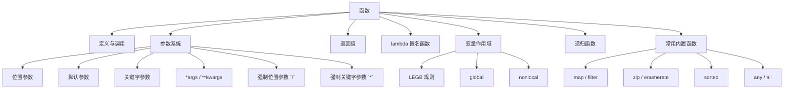

# 第5章 · 函数 — 从基础到进阶

> **时长**：约 3.5 小时 ｜ **难度**：⭐⭐⭐ ｜ **类型**：讲解+动手
>
> **目标**：系统掌握 Python 函数的完整知识体系，从定义调用到参数传递、作用域规则、lambda 匿名函数和递归，能够编写结构清晰、复用性强的函数代码。

---

## 学习目标

学完本章后，你将能够：
- 熟练定义和调用函数，编写规范的 docstring 文档字符串
- 透彻理解 Python 的参数传递机制（传值 vs 传引用）及其陷阱
- 掌握全部参数类型：位置参数、默认参数、关键字参数、`*args`/`**kwargs` 等
- 使用 lambda 表达式编写匿名函数并用于 sorted/map/filter 等场景
- 理解 LEGB 作用域规则，正确使用 global 和 nonlocal
- 编写安全的递归函数并理解递归深度限制
- 熟练运用 map、filter、zip、sorted、enumerate 等内置函数

---

## 知识地图



---

## 1、函数定义与调用

**概念定义**：函数是组织好的、可重复使用的代码块，用于执行特定任务。Python 使用 `def` 关键字定义函数，后跟函数名、参数列表和冒号，函数体通过缩进表示。

**核心价值**：函数是代码复用的基本单位，它让程序模块化、可读性更高、易于测试和维护。Python 标准库和第三方库的几乎所有功能都以函数（或方法）的形式提供。

```python
# 基本函数定义
def greet(name):
    """向指定的人打招呼。"""
    return f"你好，{name}！"

print(greet("Alice"))  # 输出：你好，Alice！

# 函数命名规范
# - 使用小写字母和下划线（snake_case）
# - 名称应当能清晰表达函数的功能
# - 避免使用保留关键字和内置函数名

# 好的命名
def calculate_average(scores): ...
def load_config_from_file(): ...
def is_valid_email(email): ...

# 不好的命名
# def func(): ...          # 太笼统
# def calc(): ...          # 缩写不清晰
# def process_data(): ...  # 不够具体
```

**docstring 文档字符串**：函数定义后的第一个字符串字面量，用于描述函数的功能、参数和返回值。

```python
def calculate_bmi(weight_kg: float, height_m: float) -> float:
    """
    计算体质指数 (BMI)。

    BMI = 体重(kg) / 身高(m)^2

    参数:
        weight_kg: 体重，单位为千克
        height_m: 身高，单位为米

    返回:
        计算得到的 BMI 值

    示例:
        >>> calculate_bmi(70, 1.75)
        22.857142857142858
    """
    return weight_kg / (height_m ** 2)

# 通过 __doc__ 访问文档字符串
print(calculate_bmi.__doc__)

# 在交互环境中使用 help() 查看
# help(calculate_bmi)
```

**空函数用 pass**：

```python
# 预留函数结构，后续实现
def process_user_data(user):
    """处理用户数据（TODO）"""
    pass  # 防止 syntax error

def validate_input(data):
    """校验输入数据（TODO）"""
    pass
```

### ▶ 代码案例

```powershell
cd code/05-函数-代码案例
python function_basics.py
```

---

## 2、参数传递机制

**概念定义**：Python 的参数传递本质上是"对象引用传递"——函数接收的是变量所引用对象的副本引用。对于不可变对象（int、str、tuple），函数内部无法修改外部变量；对于可变对象（list、dict），函数内部可以修改对象内容。

**核心价值**：理解参数传递机制是避免隐蔽 Bug 的关键。许多 Python 新手因为不理解传值和传引用的区别，写出了意想不到的代码。

```python
# 不可变对象（int/str/tuple）—— 传值效果
def modify_int(x):
    x = 100  # 重新绑定了新的 int 对象
    print(f"函数内部：x = {x}")

a = 10
modify_int(a)
print(f"函数外部：a = {a}")
# 输出：
# 函数内部：x = 100
# 函数外部：a = 10    ← 外部变量没有改变！
```

```python
# 可变对象（list/dict）—— 传引用效果
def modify_list(lst):
    lst.append(4)      # 修改了传入的列表对象
    lst[0] = 99        # 修改了列表中的元素
    print(f"函数内部：lst = {lst}")

my_list = [1, 2, 3]
modify_list(my_list)
print(f"函数外部：my_list = {my_list}")
# 输出：
# 函数内部：lst = [99, 2, 3, 4]
# 函数外部：my_list = [99, 2, 3, 4]  ← 外部变量也被修改了！
```

```python
# 重点陷阱：重新绑定 vs 修改
def confused(lst):
    lst = lst + [100]   # 创建了新列表，重新绑定局部变量 lst
    print(f"函数内部：lst = {lst}")

def clear_confused(lst):
    lst += [100]        # 原地修改列表（+= 对于可变对象是就地操作）
    print(f"函数内部：lst = {lst}")

data1 = [1, 2, 3]
confused(data1)
print(f"confused 外部：{data1}")        # 输出：[1, 2, 3]（未改变）

data2 = [1, 2, 3]
clear_confused(data2)
print(f"clear_confused 外部：{data2}")  # 输出：[1, 2, 3, 100]（改变了！）

# 保护可变参数不被修改 —— 传入副本
def safe_process(items):
    items = items[:]   # 创建副本
    items.append("processed")
    return items

original = ["a", "b"]
result = safe_process(original)
print(f"原始：{original}")   # 输出：['a', 'b']
print(f"结果：{result}")     # 输出：['a', 'b', 'processed']
```

### ▶ 代码案例

```powershell
cd code/05-函数-代码案例
python parameter_passing.py
```

---

## 3、参数类型全解

**概念定义**：Python 函数支持丰富的参数声明方式，包括位置参数、默认参数、关键字参数、强制位置参数、强制关键字参数和不定长参数。这些机制让函数调用更加灵活。

**核心价值**：掌握参数类型可以设计出 API 友好、调用方式灵活的函数，提高代码的可读性和健壮性。

```python
# 位置参数 —— 按定义的顺序传入
def register_user(name, age, email):
    print(f"注册用户：{name}，年龄：{age}，邮箱：{email}")

register_user("Alice", 25, "alice@example.com")
# register_user("Alice", "alice@example.com", 25)  # 顺序错误！

# 默认参数 —— 调用时可省略
def create_profile(name, city="北京", age=None):
    profile = {"name": name, "city": city}
    if age is not None:
        profile["age"] = age
    return profile

print(create_profile("Bob"))                    # {'name': 'Bob', 'city': '北京'}
print(create_profile("Bob", city="上海"))        # {'name': 'Bob', 'city': '上海'}
print(create_profile("Bob", "广州", 30))         # {'name': 'Bob', 'city': '广州', 'age': 30}
```

```python
# ⚠️ 默认值陷阱：不要用可变对象作为默认值
def add_item_wrong(item, target_list=[]):   # 默认列表在定义时创建一次！
    target_list.append(item)
    return target_list

print(add_item_wrong(1))  # 输出：[1]
print(add_item_wrong(2))  # 输出：[1, 2]  ← 预期 [2]，但保留了上一次的结果
print(add_item_wrong(3))  # 输出：[1, 2, 3] ← Bug！

# 正确做法：使用 None 作为默认值，内部初始化
def add_item_correct(item, target_list=None):
    if target_list is None:
        target_list = []
    target_list.append(item)
    return target_list

print(add_item_correct(1))  # 输出：[1]
print(add_item_correct(2))  # 输出：[2]  ← 每次都创建新的列表
```

```python
# 关键字参数 —— 明确指定参数名调用
def describe_pet(animal_type, pet_name):
    print(f"我有一只 {animal_type}，名叫 {pet_name}")

describe_pet(animal_type="猫", pet_name="咪咪")
describe_pet(pet_name="旺财", animal_type="狗")  # 顺序可以任意

# 强制位置参数 `/`（Python 3.8+）
# 在 `/` 之前的参数只能通过位置传入，不能使用关键字
def divide(a, b, /):
    return a / b

print(divide(10, 3))     # 正确：3.333...
# print(divide(a=10, b=3))  # TypeError: 不允许使用关键字参数

# 强制关键字参数 `*`
# 在 `*` 之后的参数必须使用关键字传入
def send_email(recipient, *, subject, body):
    print(f"发送邮件给 {recipient}")
    print(f"主题：{subject}")

send_email("alice@example.com", subject="会议邀请", body="请参加下午2点的会议")
# send_email("alice@example.com", "会议邀请", "body")  # TypeError：必须使用关键字
```

```python
# 不定长参数 *args —— 收集多余的位置参数（打包为元组）
def sum_all(*args):
    print(f"接收到 {len(args)} 个参数：{args}")
    return sum(args)

print(sum_all(1, 2, 3, 4, 5))  # 输出：15

# 不定长参数 **kwargs —— 收集多余的关键字参数（打包为字典）
def print_config(**kwargs):
    for key, value in kwargs.items():
        print(f"{key} = {value}")

print_config(host="localhost", port=8080, debug=True)
# 输出：
# host = localhost
# port = 8080
# debug = True
```

```python
# 参数顺序规则（必须遵守）
# def func(位置参数, *args, 默认参数, **kwargs):      # ❌ 错误
# def func(位置参数, 默认参数, *args, **kwargs):        # ✅ 正确
# def func(强制位置/, 位置或关键字, *强制关键字, **kwargs): # ✅ 完整形式

def comprehensive_func(a, b, /, c, d=10, *args, e, f=20, **kwargs):
    """综合示例：展示所有参数类型"""
    print(f"a={a}, b={b}")       # 强制位置参数
    print(f"c={c}, d={d}")       # 位置或关键字参数（d 有默认值）
    print(f"args={args}")        # 多余位置参数
    print(f"e={e}, f={f}")       # 强制关键字参数（e 必须提供，f 有默认值）
    print(f"kwargs={kwargs}")    # 多余关键字参数

# 调用示例
comprehensive_func(1, 2, 3, 4, 5, 6, e=7, g=8, h=9)
# 输出：
# a=1, b=2
# c=3, d=4
# args=(5, 6)
# e=7, f=20
# kwargs={'g': 8, 'h': 9}

# 解包技巧：将序列/字典解包为参数
def point(x, y, z):
    print(f"点坐标：({x}, {y}, {z})")

coordinates = [3, 7, 2]
point(*coordinates)          # 列表解包为位置参数

config = {"x": 1, "y": 5, "z": 9}
point(**config)              # 字典解包为关键字参数
```

### ▶ 代码案例

```powershell
cd code/05-函数-代码案例
python parameter_types.py
```

---

## 4、return 语句

**概念定义**：`return` 语句用于从函数中返回一个值并终止函数的执行。如果函数没有 `return` 语句，或者执行了不带值的 `return`，则返回 `None`。

**核心价值**：return 是函数与调用方通信的桥梁。良好的 return 设计让函数职责清晰、可预测，是实现函数式编程风格的基础。

```python
# 返回单个值
def square(x):
    return x ** 2

result = square(5)
print(result)  # 输出：25

# 返回多个值（实际是返回元组）
def get_min_max(numbers):
    return min(numbers), max(numbers)

result = get_min_max([3, 7, 1, 9, 4])
print(result)          # 输出：(1, 9)
print(type(result))    # 输出：<class 'tuple'>

# 解包多个返回值
min_val, max_val = get_min_max([3, 7, 1, 9, 4])
print(f"最小值：{min_val}，最大值：{max_val}")  # 输出：最小值：1，最大值：9

# 无 return 返回 None
def print_message(msg):
    print(msg)  # 只有打印，没有 return

result = print_message("你好")
print(result)  # 输出：None

# return 终止函数执行
def check_positive(n):
    if n <= 0:
        return False  # 提前返回
    print(f"{n} 是正数")
    return True

check_positive(-5)  # 没有任何输出（在 return False 处就结束了）
check_positive(10)  # 输出：10 是正数
```

### ▶ 代码案例

```powershell
cd code/05-函数-代码案例
python return_demo.py
```

---

## 5、lambda 匿名函数

**概念定义**：lambda 表达式创建小型匿名函数，语法为 `lambda args: expression`。它只能包含一个表达式，不能包含语句或多行代码。

**核心价值**：lambda 在需要简单函数作为参数传递的场景中特别有用，避免为一次性逻辑定义命名函数，使代码更加紧凑。

```python
# 基本语法
add = lambda x, y: x + y      # 不推荐赋值给变量（失去了 lambda 的意义）
print(add(3, 5))              # 输出：8

# 推荐的用法：直接作为参数传递
# 用于 sorted 的 key 参数
students = [
    {"name": "Alice", "grade": 88},
    {"name": "Bob", "grade": 72},
    {"name": "Charlie", "grade": 95},
]

# 按成绩排序
sorted_students = sorted(students, key=lambda s: s["grade"])
print([s["name"] for s in sorted_students])  # 输出：['Bob', 'Alice', 'Charlie']

# 按成绩降序
sorted_students_desc = sorted(students, key=lambda s: s["grade"], reverse=True)
print([s["name"] for s in sorted_students_desc])  # 输出：['Charlie', 'Alice', 'Bob']

# 用于 max/min 的 key 参数
youngest = min(students, key=lambda s: s["grade"])
print(youngest)  # 输出：{'name': 'Bob', 'grade': 72}
```

```python
# 用于 map —— 对每个元素应用函数
numbers = [1, 2, 3, 4, 5]
squared = list(map(lambda x: x ** 2, numbers))
print(squared)  # 输出：[1, 4, 9, 16, 25]

# 用于 filter —— 筛选满足条件的元素
evens = list(filter(lambda x: x % 2 == 0, numbers))
print(evens)  # 输出：[2, 4]

# 结合使用
result = list(map(lambda x: x * 2, filter(lambda x: x > 2, numbers)))
print(result)  # 输出：[6, 8, 10]

# 与列表解析对比（列表解析通常更易读）
result2 = [x * 2 for x in numbers if x > 2]
print(result2)  # 输出：[6, 8, 10]
```

```python
# lambda 的限制
# 1. 不能包含语句（不能使用 if/for/while 等）
# lambda x: if x > 0: return x  # SyntaxError!

# 2. 不能有类型注解
# lambda x: int: x + 1  # SyntaxError!

# 3. 只能包含单个表达式
# lambda x: x + 1; x + 2  # 不能多行

# 技巧：用条件表达式模拟 if
sign = lambda x: "正数" if x > 0 else "负数" if x < 0 else "零"
print(sign(5))    # 输出：正数
print(sign(-3))   # 输出：负数
print(sign(0))    # 输出：零
```

### ▶ 代码案例

```powershell
cd code/05-函数-代码案例
python lambda_demo.py
```

---

## 6、变量作用域

**概念定义**：作用域决定了变量的可见范围。Python 遵循 LEGB 规则：Local（局部）→ Enclosing（外层）→ Global（全局）→ Built-in（内置）。变量查找按此顺序逐级向上。

**核心价值**：理解作用域规则让你能预测变量的访问和修改行为，避免意外的变量覆盖或修改错误。

```python
# LEGB 规则示例
built_in_func = print  # 保存原始的 print

# Built-in 作用域
print("这是内置函数的 print")

# Global 作用域
x = "全局变量"

def outer():
    # Enclosing 作用域
    x = "外层变量"

    def inner():
        # Local 作用域
        x = "局部变量"
        print(f"inner 中的 x：{x}")

    inner()
    print(f"outer 中的 x：{x}")

outer()
print(f"全局中的 x：{x}")
# 输出：
# inner 中的 x：局部变量
# outer 中的 x：外层变量
# 全局中的 x：全局变量
```

```python
# global 关键字 —— 修改全局变量
count = 0

def increment():
    global count  # 声明要修改全局变量
    count += 1
    print(f"内部：count = {count}")

increment()       # 输出：内部：count = 1
increment()       # 输出：内部：count = 2
print(f"外部：count = {count}")  # 输出：外部：count = 2

# 如果不使用 global：
def increment_wrong():
    # count += 1  # UnboundLocalError！Python 认为 count 是局部变量
    pass

# 全局变量的最佳实践：用函数封装，避免直接修改全局
_config = {"debug": False}

def set_debug_mode(enabled: bool):
    global _config
    _config["debug"] = enabled  # 注意：这是修改字典内容，不是重新绑定
```

```python
# nonlocal 关键字 —— 修改外层（非全局）变量
def make_counter():
    count = 0  # outer 函数的局部变量

    def counter():
        nonlocal count  # 声明要修改外层变量
        count += 1
        return count

    return counter

# 闭包示例
counter_a = make_counter()
print(counter_a())  # 输出：1
print(counter_a())  # 输出：2
print(counter_a())  # 输出：3

counter_b = make_counter()
print(counter_b())  # 输出：1（新的独立闭包）
```

```python
# 闭包的形成条件
# 条件1：存在嵌套函数
# 条件2：内层函数引用了外层函数的变量
# 条件3：外层函数将内层函数作为返回值返回

def make_multiplier(factor):
    """创建一个将数字乘以 factor 的函数。"""
    def multiplier(x):
        return x * factor
    return multiplier

double = make_multiplier(2)
triple = make_multiplier(3)

print(double(5))   # 输出：10
print(triple(5))   # 输出：15

# 闭包保存了外层函数的变量环境
# 即使 make_multiplier 已经执行完毕，factor 的值仍然可用
print(double.__closure__[0].cell_contents)  # 输出：2
```

### ▶ 代码案例

```powershell
cd code/05-函数-代码案例
python scope_demo.py
```

---

## 7、递归函数

**概念定义**：递归函数是在函数体内调用自身的函数。递归解决问题的三要素是：基准条件（停止递归）、递归调用（缩小问题规模）、向基准收敛（确保最终能满足基准条件）。

**核心价值**：递归提供了一种优雅的方式解决具有自相似结构的问题（如树形遍历、分治算法、数学归纳定义），代码通常比迭代版本更简洁。

```python
# 递归三要素示例：阶乘
# 基准条件：n <= 1 时返回 1
# 递归调用：n * factorial(n - 1)
# 向基准收敛：n 每次减 1
def factorial(n):
    """计算 n 的阶乘。"""
    if n <= 1:        # 基准条件
        return 1
    return n * factorial(n - 1)  # 递归调用

print(factorial(5))  # 输出：120（5×4×3×2×1）

# 追踪递归过程
# factorial(5)
# → 5 * factorial(4)
# → 5 * 4 * factorial(3)
# → 5 * 4 * 3 * factorial(2)
# → 5 * 4 * 3 * 2 * factorial(1)
# → 5 * 4 * 3 * 2 * 1 = 120
```

```python
# 斐波那契数列
def fibonacci(n):
    """返回第 n 个斐波那契数（n 从 0 开始）。"""
    if n <= 1:        # 基准条件：F(0)=0, F(1)=1
        return n
    return fibonacci(n - 1) + fibonacci(n - 2)  # 递归调用

# 打印前 10 个斐波那契数
for i in range(10):
    print(f"F({i}) = {fibonacci(i)}", end="  ")
# 输出：F(0)=0  F(1)=1  F(2)=1  F(3)=2  F(4)=3  F(5)=5  F(6)=8  F(7)=13  F(8)=21  F(9)=34

# ⚠️ 上面的 naive 递归有大量重复计算，性能很差
# 优化：使用记忆化（memoization）
from functools import lru_cache

@lru_cache(maxsize=128)
def fibonacci_fast(n):
    if n <= 1:
        return n
    return fibonacci_fast(n - 1) + fibonacci_fast(n - 2)

print(fibonacci_fast(50))  # 瞬间输出：12586269025
```

```python
# 递归深度限制
import sys

def recurse(n):
    print(f"深度：{n}")
    return recurse(n + 1)

# sys.setrecursionlimit(2000)   # 可以修改默认限制（通常为 1000）
# 
# try:
#     recurse(1)
# except RecursionError as e:
#     print(f"递归溢出：{e}")

# 查看当前递归深度限制
print(f"默认递归深度限制：{sys.getrecursionlimit()}")

# 递归 vs 迭代的选择
# 递归适合：树形遍历、分治算法（快速排序）、数学定义（阶乘、斐波那契）
# 迭代适合：简单循环、性能敏感场景、深度超过限制的情况

# 迭代版本（尾递归优化 —— Python 不支持尾递归优化）
def factorial_iter(n):
    result = 1
    for i in range(2, n + 1):
        result *= i
    return result

print(factorial_iter(5))  # 输出：120
```

### ▶ 代码案例

```powershell
cd code/05-函数-代码案例
python recursion_demo.py
```

---

## 8、常用内置函数

**概念定义**：Python 提供了大量内置函数用于常见的数据处理任务，如 `map()`、`filter()`、`zip()`、`sorted()`、`any()`、`all()` 和 `enumerate()` 等。

**核心价值**：熟练使用这些内置函数可以大幅简化代码，让常见的迭代和转换操作更加高效和易读。

```python
# map() —— 对可迭代对象中的每个元素应用函数
numbers = [1, 2, 3, 4, 5]
doubled = list(map(lambda x: x * 2, numbers))
print(doubled)  # 输出：[2, 4, 6, 8, 10]

# 多序列的 map
a = [1, 2, 3]
b = [4, 5, 6]
sums = list(map(lambda x, y: x + y, a, b))
print(sums)  # 输出：[5, 7, 9]
```

```python
# filter() —— 筛选满足条件的元素
numbers = [1, 2, 3, 4, 5, 6, 7, 8]
evens = list(filter(lambda x: x % 2 == 0, numbers))
print(evens)  # 输出：[2, 4, 6, 8]

# 过滤掉 None 和空值
data = ["Alice", "", None, "Bob", " ", "Charlie"]
cleaned = list(filter(None, [s.strip() if s else "" for s in data]))
print(cleaned)  # 输出：['Alice', 'Bob', 'Charlie']
```

```python
# zip() —— 将多个可迭代对象打包为元组迭代器
names = ["Alice", "Bob", "Charlie"]
scores = [88, 72, 95]
grades = ["A", "C", "A"]

for name, score, grade in zip(names, scores, grades):
    print(f"{name}: {score}分 ({grade})")
# 输出：
# Alice: 88分 (A)
# Bob: 72分 (C)
# Charlie: 95分 (A)

# 解压（unzip）
pairs = [(1, 'a'), (2, 'b'), (3, 'c')]
numbers, letters = zip(*pairs)
print(numbers)  # 输出：(1, 2, 3)
print(letters)  # 输出：('a', 'b', 'c')
```

```python
# sorted() —— 返回排序后的新列表
numbers = [3, 1, 4, 1, 5, 9, 2, 6]
print(sorted(numbers))           # 输出：[1, 1, 2, 3, 4, 5, 6, 9]
print(sorted(numbers, reverse=True))  # 输出：[9, 6, 5, 4, 3, 2, 1, 1]

# 使用 key 参数自定义排序规则
words = ["apple", "banana", "cherry", "date"]
print(sorted(words, key=len))  # 按长度排序：['date', 'apple', 'banana', 'cherry']
print(sorted(words, key=lambda w: w[-1]))  # 按最后一个字母排序

# 复杂对象排序
students = [
    ("Alice", 88), ("Bob", 72), ("Charlie", 95), ("David", 88)
]
# 先按成绩降序，再按姓名升序
sorted_students = sorted(students, key=lambda s: (-s[1], s[0]))
print(sorted_students)
# 输出：[('Charlie', 95), ('Alice', 88), ('David', 88), ('Bob', 72)]
```

```python
# any() / all() —— 检查可迭代对象的真值
numbers = [0, 1, 2, 3, 4]
print(any(numbers))   # 输出：True（至少有一个为 True）
print(all(numbers))   # 输出：False（不是所有值都为 True，因为 0 为假）

# 实用场景
def has_even(numbers):
    return any(x % 2 == 0 for x in numbers)

def all_positive(numbers):
    return all(x > 0 for x in numbers)

print(has_even([1, 3, 5]))     # 输出：False
print(has_even([1, 2, 3]))     # 输出：True
print(all_positive([1, 2, 3])) # 输出：True
print(all_positive([1, -2]))   # 输出：False

# enumerate() —— 同时获取索引和值
seasons = ["春", "夏", "秋", "冬"]
for i, season in enumerate(seasons):
    print(f"{i}: {season}")
# 输出：
# 0: 春
# 1: 夏
# 2: 秋
# 3: 冬

for i, season in enumerate(seasons, start=1):
    print(f"第{i}季：{season}")
```

### ▶ 代码案例

```powershell
cd code/05-函数-代码案例
python builtin_functions.py
```

---

## 9、数据结构技巧

**概念定义**：利用 Python 内置函数和标准库，可以实现常见数据结构的优雅操作，如并行遍历、反向迭代、去重、队列操作等。

**核心价值**：掌握这些技巧可以写出更 Pythonic、更高效的代码，避免手写冗余的循环逻辑。

```python
# 用 zip() 并行遍历多个序列
names = ["Alice", "Bob", "Charlie"]
ages = [25, 30, 35]
cities = ["北京", "上海", "广州"]

for name, age, city in zip(names, ages, cities):
    print(f"{name}，{age}岁，来自{city}")

# 构建字典
user_dict = dict(zip(names, ages))
print(user_dict)  # 输出：{'Alice': 25, 'Bob': 30, 'Charlie': 35}

# 处理不等长序列（默认以最短为准）
a = [1, 2, 3, 4]
b = [10, 20, 30]
print(list(zip(a, b)))     # 输出：[(1, 10), (2, 20), (3, 30)]
print(list(zip(a, b, strict=True)))  # 3.10+ strict=True 会在不等长时抛出 ValueError
```

```python
# reversed() —— 反向迭代（不修改原对象）
numbers = [1, 2, 3, 4, 5]
for n in reversed(numbers):
    print(n, end=" ")      # 输出：5 4 3 2 1
print()

# 反向遍历的另一种方式
for n in numbers[::-1]:
    print(n, end=" ")      # 输出：5 4 3 2 1 （但会创建新列表）
print()

# reversed() 更高效（返回迭代器，不复制数据）
print(list(reversed(numbers)))  # 输出：[5, 4, 3, 2, 1]
```

```python
# 用 set() 去重
fruits = ["apple", "banana", "apple", "orange", "banana", "grape"]
unique_fruits = list(set(fruits))
print(unique_fruits)  # 输出（顺序不定）：['grape', 'orange', 'banana', 'apple']

# 保持顺序的去重（Python 3.7+ 字典有序）
unique_ordered = list(dict.fromkeys(fruits))
print(unique_ordered)  # 输出：['apple', 'banana', 'orange', 'grape']

# collections.deque 做双端队列
from collections import deque

# 队列（FIFO）
queue = deque(["Alice", "Bob", "Charlie"])
queue.append("David")        # 入队（右侧）
next_person = queue.popleft()  # 出队（左侧）
print(f"下一位：{next_person}")  # 输出：下一位：Alice
print(list(queue))           # 输出：['Bob', 'Charlie', 'David']

# 栈（LIFO）
stack = deque()
stack.append("第一页")        # 压栈
stack.append("第二页")
stack.append("第三页")
last_page = stack.pop()      # 出栈
print(f"返回上一页：{last_page}")  # 输出：返回上一页：第三页

# 限制最大长度（自动丢弃旧元素）
recent = deque(maxlen=3)
for i in range(10):
    recent.append(f"log-{i}")
print(list(recent))  # 输出：['log-7', 'log-8', 'log-9']
```

```python
# 综合运用：数据分析小案例
data = [
    {"name": "Alice", "age": 25, "salary": 12000},
    {"name": "Bob", "age": 30, "salary": 15000},
    {"name": "Charlie", "age": 35, "salary": 9000},
    {"name": "David", "age": 28, "salary": 18000},
    {"name": "Eve", "age": 22, "salary": 11000},
]

# 找出薪资最高的人
richest = max(data, key=lambda d: d["salary"])
print(f"薪资最高：{richest['name']}，{richest['salary']}元")

# 薪资高于平均的人
avg_salary = sum(d["salary"] for d in data) / len(data)
high_earners = [d["name"] for d in data if d["salary"] > avg_salary]
print(f"高于平均薪资的：{high_earners}")

# 按年龄排序
sorted_by_age = sorted(data, key=lambda d: d["age"])
print("按年龄排序：")
for d in sorted_by_age:
    print(f"  {d['name']}: {d['age']}岁")

# 分组（按薪资区间）
groups = {"低薪（<10000）": [], "中薪（10000-15000）": [], "高薪（>15000）": []}
for d in data:
    if d["salary"] < 10000:
        groups["低薪（<10000）"].append(d["name"])
    elif d["salary"] <= 15000:
        groups["中薪（10000-15000）"].append(d["name"])
    else:
        groups["高薪（>15000）"].append(d["name"])

for group, members in groups.items():
    print(f"{group}: {members}")
```

### ▶ 代码案例

```powershell
cd code/05-函数-代码案例
python data_structure_tips.py
```

---

## 常见踩坑

1. **默认参数的可变对象陷阱**：错误做法是使用可变对象（`[]`、`{}`）作为函数默认参数。默认值在函数定义时只创建一次，所有调用共享同一个对象。正确做法是用 `None` 作为默认值，函数内部再创建。

2. **在循环中创建 lambda 的闭包陷阱**：lambda 中引用的变量在调用时才查找，而非定义时。如果在循环中创建 lambda，所有 lambda 都捕获了同一个变量的最终值。

   ```python
   # 错误做法
   funcs = []
   for i in range(5):
       funcs.append(lambda: i)  # 所有函数都返回 4！
   print([f() for f in funcs])  # 输出：[4, 4, 4, 4, 4]

   # 正确做法：用默认参数绑定当前值
   funcs = []
   for i in range(5):
       funcs.append(lambda x=i: x)  # 将当前 i 作为默认值绑定
   print([f() for f in funcs])      # 输出：[0, 1, 2, 3, 4]
   ```

3. **忘记 return 导致返回 None**：函数体内执行了逻辑但没有写 `return` 语句，导致函数返回 `None`，而不是预期的计算结果。

4. **递归没有基准条件或基准条件不收敛**：导致无限递归，最终抛出 `RecursionError`。写递归时务必确认：基准条件是否存在、每次递归是否向基准条件靠近。

5. **在函数内部意外修改全局可变对象**：虽然没有使用 `global` 关键字，但通过方法调用（如 `list.append()`）修改了函数外部的可变对象。如果意图是只读操作，请先创建副本。

6. **混淆 `*args` 和 `**kwargs` 的传递方式**：解包时用 `func(*args)` 传递列表/元组，用 `func(**kwargs)` 传递字典。反之用错会导致 TypeError。

---

---

## 本节小结

- ✅ 函数用 `def` 定义，docstring 提供文档说明，空函数用 `pass` 占位
- ✅ Python 参数传递本质是对象引用传递——不可变对象传值效果，可变对象传引用效果
- ✅ 参数类型包括位置参数、默认参数、关键字参数、`*args`/`**kwargs`、强制位置 `/`、强制关键字 `*`
- ✅ 默认值陷阱：永远不要用可变对象作为默认参数，使用 `None` 替代
- ✅ lambda 语法 `lambda args: expression`，常用于 sorted/max/min/filter 的 key 参数
- ✅ LEGB 作用域规则：Local → Enclosing → Global → Built-in
- ✅ `global` 修改全局变量，`nonlocal` 修改外层变量，闭包由嵌套函数+引用外层变量构成
- ✅ 递归三要素：基准条件 + 递归调用 + 向基准收敛；注意递归深度限制
- ✅ 熟练使用 map、filter、zip、sorted、any、all、enumerate 等内置函数简化代码

> **下一章**：[第6章 · 迭代器、生成器与模块 — 代码复用的艺术](./第6章%20·%20迭代器、生成器与模块%20—%20代码复用的艺术.md)——理解迭代器协议、用生成器实现惰性求值、掌握模块化编程
