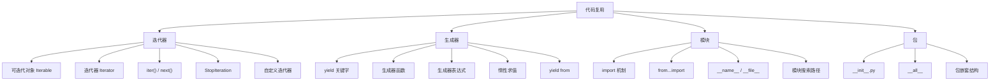

# 第6章 · 迭代器、生成器与模块 — 代码复用的艺术

> **时长**：约 2.5 小时 ｜ **难度**：⭐⭐⭐ ｜ **类型**：讲解+动手
>
> **目标**：深入理解 Python 的迭代器协议和生成器机制，掌握模块化编程的完整知识体系，能够编写可复用、可维护的 Python 代码。

---

## 学习目标

学完本章后，你将能够：
- 区分可迭代对象和迭代器的概念，理解 `for` 循环背后的迭代器协议
- 通过实现 `__iter__()` 和 `__next__()` 编写自定义迭代器
- 使用 `yield` 关键字编写生成器函数，理解惰性求值的优势
- 掌握模块导入的各种方式及其执行过程
- 理解 `__name__`、`__file__` 等模块属性的用途
- 使用 `__init__.py` 和 `__all__` 构建和管理 Python 包
- 理解 `sys.path` 模块搜索路径的构成与配置方法

---

## 知识地图



---

## 1、可迭代对象与迭代器

**概念定义**：可迭代对象（Iterable）是实现了 `__iter__()` 方法的对象，该方法返回一个迭代器。迭代器（Iterator）是同时实现了 `__iter__()` 和 `__next__()` 方法的对象，`__next__()` 每次返回下一个元素，无元素时抛出 `StopIteration`。

**核心价值**：迭代器协议是 Python 中所有循环和遍历操作的基础。理解它你才能真正掌握 `for` 循环、列表解析、生成器等机制，并能创建自己的可迭代数据结构。

```python
# Iterable vs Iterator 概念演示
# 列表是可迭代对象，但不是迭代器
my_list = [1, 2, 3]
print(hasattr(my_list, "__iter__"))   # True —— 是可迭代对象
print(hasattr(my_list, "__next__"))   # False —— 但不是迭代器

# 通过 iter() 获取迭代器
list_iterator = iter(my_list)
print(hasattr(list_iterator, "__iter__"))  # True
print(hasattr(list_iterator, "__next__"))  # True
```

```python
# 使用 iter() 和 next() 手动迭代
fruits = ["苹果", "香蕉", "橘子"]
fruit_iter = iter(fruits)

print(next(fruit_iter))  # 输出：苹果
print(next(fruit_iter))  # 输出：香蕉
print(next(fruit_iter))  # 输出：橘子
# print(next(fruit_iter))  # StopIteration！没有更多元素了

# 常用的可迭代对象
print(isinstance("hello", str))      # 字符串
print(isinstance([1, 2, 3], list))   # 列表
print(isinstance((1, 2), tuple))     # 元组
print(isinstance({1, 2}, set))       # 集合
print(isinstance({"a": 1}, dict))    # 字典（迭代键）
print(isinstance(range(5), range))   # range 对象

# 字典的迭代行为
d = {"name": "Alice", "age": 25, "city": "北京"}
for key in d:
    print(key, end=" ")      # 输出：name age city（遍历键）
print()

for value in d.values():
    print(value, end=" ")    # 输出：Alice 25 北京
print()

for key, value in d.items():
    print(f"{key}={value}", end="  ")
print()
```

```python
# for 循环背后的迭代器机制
# 下面两段代码完全等价：

# 你写的代码
print("for 循环版本：")
for x in [10, 20, 30]:
    print(x)

# Python 实际执行的代码
print("迭代器协议版本：")
_iter = iter([10, 20, 30])   # 1. 调用 iter() 获取迭代器
while True:
    try:
        x = next(_iter)       # 2. 反复调用 next()
        print(x)              # 3. 执行循环体
    except StopIteration:     # 4. 捕获 StopIteration 结束循环
        break

# 理解这个机制后，你会发现：
# - 任何实现了 __iter__() 的对象都可以用于 for 循环
# - for 循环本质上就是 while + try/except 的语法糖
```

### ▶ 代码案例

```powershell
cd code/06-迭代器与模块-代码案例
python iterable_iterator.py
```

---

## 2、自定义迭代器

**概念定义**：通过定义一个类，实现 `__iter__()` 和 `__next__()` 两个方法，就可以创建自定义迭代器。`__iter__()` 返回迭代器自身，`__next__()` 返回下一个元素，无元素时抛出 `StopIteration`。

**核心价值**：自定义迭代器让你能把复杂的数据生成逻辑封装在类中，在使用 `for` 循环或需要惰性取值的场景中提供简洁高效的接口。

```python
# 倒计时迭代器示例
class Countdown:
    """从 n 倒数到 1 的迭代器。"""

    def __init__(self, start):
        self.current = start

    def __iter__(self):
        # 返回迭代器本身
        return self

    def __next__(self):
        if self.current <= 0:
            raise StopIteration  # 终止迭代
        value = self.current
        self.current -= 1
        return value

# 使用自定义迭代器
print("倒计时：")
for num in Countdown(5):
    print(num, end=" ")   # 输出：5 4 3 2 1
print()

# 也可以手动迭代
counter = Countdown(3)
print(next(counter))  # 输出：3
print(next(counter))  # 输出：2
print(next(counter))  # 输出：1
# print(next(counter))  # StopIteration
```

```python
# 斐波那契数列迭代器
class Fibonacci:
    """生成斐波那契数列的迭代器，最多生成 n 个数字。"""

    def __init__(self, n):
        self.n = n
        self.a, self.b = 0, 1
        self.count = 0

    def __iter__(self):
        return self

    def __next__(self):
        if self.count >= self.n:
            raise StopIteration
        value = self.a
        self.a, self.b = self.b, self.a + self.b
        self.count += 1
        return value

# 打印前 10 个斐波那契数
fib = Fibonacci(10)
for f in fib:
    print(f, end=" ")  # 输出：0 1 1 2 3 5 8 13 21 34
print()

# 注意：迭代器是"一次性"的
print(list(Fibonacci(5)))   # 输出：[0, 1, 1, 2, 3]
print(list(Fibonacci(5)))   # 输出：[0, 1, 1, 2, 3]（再次创建新的迭代器）
```

```python
# 可迭代对象 vs 迭代器：分别实现
# 有时我们希望迭代器可以被多次使用（每次重新开始）
# 这时应该将容器对象和迭代器分开

class MyRange:
    """可迭代对象（每次 for 循环都返回新的迭代器）。"""

    def __init__(self, start, end):
        self.start = start
        self.end = end

    def __iter__(self):
        # 每次调用都返回一个新的迭代器实例
        return MyRangeIterator(self.start, self.end)


class MyRangeIterator:
    """MyRange 对应的迭代器。"""

    def __init__(self, start, end):
        self.current = start
        self.end = end

    def __iter__(self):
        return self

    def __next__(self):
        if self.current >= self.end:
            raise StopIteration
        value = self.current
        self.current += 1
        return value


# 测试：可以被多次遍历
r = MyRange(1, 5)
print(list(r))  # 输出：[1, 2, 3, 4]
print(list(r))  # 输出：[1, 2, 3, 4]（再次遍历，得到新迭代器）
```

### ▶ 代码案例

```powershell
cd code/06-迭代器与模块-代码案例
python custom_iterator.py
```

---

## 3、生成器（Generator）

**概念定义**：生成器是使用 `yield` 关键字的函数，它返回一个生成器迭代器。生成器函数在执行到 `yield` 时会暂停并返回一个值，下次调用 `next()` 时从暂停处继续执行。生成器表达式是类似列表解析的语法，但使用圆括号，返回生成器对象。

**核心价值**：生成器是 Python 最优雅的特性之一。它让你能够以函数的形式编写迭代器，利用惰性求值节省内存。对于处理大数据集、无限序列或管道式数据处理，生成器是不可替代的工具。

```python
# yield 关键字 —— 生成器函数基础
def simple_generator():
    """最简单的生成器。"""
    yield 1
    yield 2
    yield 3

gen = simple_generator()
print(type(gen))  # 输出：<class 'generator'>
print(next(gen))  # 输出：1
print(next(gen))  # 输出：2
print(next(gen))  # 输出：3
# print(next(gen))  # StopIteration

# 生成器函数 vs 普通函数
# 普通函数：执行到 return 就结束，返回一个值
# 生成器函数：执行到 yield 暂停，返回一个值，下次从暂停处继续
```

```python
# 生成器函数的状态挂起与恢复
def count_up_to(max_value):
    """演示生成器的暂停和恢复。"""
    count = 1
    while count <= max_value:
        print(f"  [生成器] 准备 yield {count}")
        yield count
        print(f"  [生成器] 从 yield {count} 恢复执行")
        count += 1
    print("  [生成器] 完成")

print("开始遍历：")
for value in count_up_to(3):
    print(f"[主程序] 收到 {value}")
    print(f"[主程序] 继续循环")
# 输出：
# 开始遍历：
#   [生成器] 准备 yield 1
# [主程序] 收到 1
# [主程序] 继续循环
#   [生成器] 从 yield 1 恢复执行
#   [生成器] 准备 yield 2
# [主程序] 收到 2
# ...
```

```python
# 生成器表达式
# 语法：(expression for item in iterable if condition)

# 列表解析 vs 生成器表达式
list_comp = [x ** 2 for x in range(10)]      # 立即创建完整列表
gen_expr = (x ** 2 for x in range(10))        # 生成器对象（惰性）

print(type(list_comp))  # <class 'list'>
print(type(gen_expr))   # <class 'generator'>

print(list_comp)        # [0, 1, 4, 9, 16, 25, 36, 49, 64, 81]
print(list(gen_expr))   # [0, 1, 4, 9, 16, 25, 36, 49, 64, 81]

# 生成器表达式的内存优势
import sys
big_list = [x for x in range(100_000)]      # 列表：约 800KB
big_gen = (x for x in range(100_000))        # 生成器：约 112 字节
print(f"列表大小：{sys.getsizeof(big_list)} 字节")
print(f"生成器大小：{sys.getsizeof(big_gen)} 字节")

# 惰性求值 —— 生成器只在需要时才计算
numbers = (x for x in range(10))
print(3 in numbers)   # 输出：True（计算到 3 就停了）
print(5 in numbers)   # 输出：True（从 4 开始继续，到 5 停）
print(1 in numbers)   # 输出：False（6..9 中没有 1，因为前面的已被消费）
```

```python
# 生成器的实际应用场景

# 场景1：逐行读取大文件（内存友好）
def read_large_file(file_path):
    """逐行读取大文件，每次只保留一行在内存中。"""
    with open(file_path, "r", encoding="utf-8") as f:
        for line in f:
            yield line.strip()

# 使用示例（假设文件存在）
# for line in read_large_file("huge_log.txt"):
#     process(line)

# 场景2：生成无限序列
def fibonacci_infinite():
    """无限斐波那契数列生成器。"""
    a, b = 0, 1
    while True:            # 无限循环
        yield a
        a, b = b, a + b

# 取前 10 个
fib = fibonacci_infinite()
first_10 = [next(fib) for _ in range(10)]
print(first_10)  # 输出：[0, 1, 1, 2, 3, 5, 8, 13, 21, 34]

# 取第 20 到 30 个
fib = fibonacci_infinite()
for _ in range(20):
    next(fib)              # 跳过前 20 个
next_10 = [next(fib) for _ in range(10)]
print(next_10)  # 输出：[6765, 10946, 17711, 28657, 46368, 75025, 121393, 196418, 317811, 514229]
```

```python
# yield from —— 委托子生成器
# 用于在一个生成器中委托另一个生成器/可迭代对象

def sub_gen():
    """子生成器。"""
    yield "子生成器 - A"
    yield "子生成器 - B"
    yield "子生成器 - C"

def main_gen():
    """主生成器。"""
    yield "主生成器 - 开始"
    yield from sub_gen()      # 委托给子生成器
    yield from [1, 2, 3]      # 委托给可迭代对象
    yield "主生成器 - 结束"

print(list(main_gen()))
# 输出：['主生成器 - 开始', '子生成器 - A', '子生成器 - B', '子生成器 - C', 1, 2, 3, '主生成器 - 结束']

# 不使用 yield from 的等价写法
def main_gen_without_yield_from():
    yield "主生成器 - 开始"
    for value in sub_gen():
        yield value
    for value in [1, 2, 3]:
        yield value
    yield "主生成器 - 结束"
```

```python
# 生成器管道示例：数据流处理
def read_numbers():
    """生成一系列数字（模拟数据源）。"""
    for i in range(1, 11):
        yield i

def filter_even(numbers):
    """筛选偶数。"""
    for n in numbers:
        if n % 2 == 0:
            yield n

def square(numbers):
    """计算平方。"""
    for n in numbers:
        yield n ** 2

def negate(numbers):
    """取负数。"""
    for n in numbers:
        yield -n

# 搭建处理管道（注意：没有任何计算发生，只是搭建）
pipeline = negate(square(filter_even(read_numbers())))

# 数据按需流过管道
print(list(pipeline))
# 输出：[-4, -16, -36, -64, -100]

# 每个数字的流向：
# read_numbers → filter_even → square → negate → 输出
# 1 被 filter_even 过滤掉了
# 2 → 平方 4 → 取反 -4
# 3 被过滤
# 4 → 平方 16 → 取反 -16
# ...
```

### ▶ 代码案例

```powershell
cd code/06-迭代器与模块-代码案例
python generator_demo.py
```

---

## 4、模块导入

**概念定义**：模块是包含 Python 定义和语句的 `.py` 文件。`import` 语句用于导入模块，执行过程包括：搜索模块、编译字节码、执行模块代码、创建模块对象并绑定到命名空间。

**核心价值**：模块化是代码复用的基石。通过将代码组织到不同的模块中，你可以实现关注点分离、命名空间隔离，并在不同项目间共享功能。

```python
# import 语句的执行过程
# 1. 在 sys.path 中搜索模块
# 2. 找到模块后，编译为字节码（如已缓存则跳过）
# 3. 执行模块代码
# 4. 创建模块对象并绑定到当前命名空间

# 方式1：import 模块名
import math
print(math.sqrt(16))  # 输出：4.0
# 使用 math.xxx 访问模块内容

# 方式2：from...import 导入特定内容
from math import pi, sin
print(pi)             # 输出：3.141592653589793
print(sin(pi / 2))    # 输出：1.0
# 可以直接使用 pi 和 sin，不需要 math. 前缀

# 方式3：import...as 别名
import numpy as np     # 通常给第三方库取别名
import pandas as pd

# 方式4：from...import *（不推荐）
# from math import *   # 污染命名空间，可能意外覆盖现有变量

# 方式5：相对导入（在包内部使用）
# from . import sibling_module    # 从当前包导入兄弟模块
# from ..parent import something  # 从上级包导入
```

```python
# 导入时模块代码只执行一次
# Python 会缓存已导入的模块，后续 import 使用缓存的对象
import sys
print("math" in sys.modules)  # 查看模块是否已被缓存

# 查看已加载的所有模块
print(len(sys.modules))       # 输出当前会话中已加载的模块数

# 重新加载模块（开发调试时使用）
import importlib
# importlib.reload(some_module)  # 强制重新加载模块
```

```python
# 创建并使用自定义模块

# 假设有一个文件 my_utils.py：
# """
# 我的工具模块。
# """
#
# def add(a, b):
#     return a + b
#
# def multiply(a, b):
#     return a * b
#
# PI = 3.14159

# 在另一个文件中导入：
# import my_utils
# print(my_utils.add(3, 5))       # 输出：8
# print(my_utils.PI)              # 输出：3.14159

# 或者：
# from my_utils import add, PI
# print(add(3, 5))                # 输出：8
```

```python
# dir() 查看模块内容
import math

# 列出 math 模块中定义的所有名称
math_names = [name for name in dir(math) if not name.startswith("_")]
print(math_names[:10])  # 显示前 10 个

# 查看特定名称的详细信息
print(dir(math.sqrt))   # 显示 sqrt 函数的属性

# 查看自定义模块内容
# import my_utils
# print(dir(my_utils))  # 列出 my_utils 模块中的名称
```

### ▶ 代码案例

```powershell
cd code/06-迭代器与模块-代码案例
python module_import.py
```

---

## 5、模块属性

**概念定义**：每个 Python 模块都有一组内置属性，如 `__name__`、`__file__`、`__doc__` 等。其中 `__name__` 在模块直接运行时为 `"__main__"`，在被导入时为模块的文件名（不含 `.py`）。

**核心价值**：模块属性让你能区分模块是作为脚本直接运行还是被其他模块导入，从而实现既可作为独立脚本又可作为可导入模块的双重用途代码。

```python
# __name__ 属性的核心用法
# 假设文件名为 demo.py，内容如下：

def main():
    print("执行主程序逻辑...")
    print(f"__name__ = {__name__}")

if __name__ == "__main__":
    # 仅在直接运行时执行
    print("文件被作为脚本直接运行")
    main()
else:
    # 在被导入时执行
    print("文件被作为模块导入")
    print(f"模块名：{__name__}")

# 直接运行：python demo.py
# 输出：
# 文件被作为脚本直接运行
# 执行主程序逻辑...
# __name__ = __main__

# 被导入：from demo import main
# 输出：
# 文件被作为模块导入
# 模块名：demo
```

```python
# __file__ 属性 —— 模块的文件路径
import os

print(f"当前模块 __file__: {__file__}")

# 获取模块所在的目录
module_dir = os.path.dirname(__file__)
print(f"模块所在目录: {module_dir}")

# 获取模块文件名的各种形式
print(f"完整路径: {os.path.abspath(__file__)}")
print(f"文件名: {os.path.basename(__file__)}")

# 在 __init__.py 中常用于定位资源文件
# 示例：获取包内数据文件的路径
def get_data_path(filename):
    """获取包内数据文件的绝对路径。"""
    package_dir = os.path.dirname(__file__)
    return os.path.join(package_dir, "data", filename)
```

```python
# 其他常用模块属性
import json

# __doc__ —— 模块文档字符串
print(json.__doc__[:200])  # 打印前 200 个字符

# __dict__ —— 模块的命名空间字典
print(list(math.__dict__.keys())[:5])  # 显示前 5 个键

# __builtins__ —— 内置函数和异常
import builtins
print(dir(builtins)[:10])  # 显示前 10 个内置名称

# __package__ —— 模块所属包
print(json.__package__)  # 输出：json（顶级包）

# 完整示例：模块信息查看函数
def inspect_module(module):
    """打印模块的关键信息。"""
    print(f"模块名：{module.__name__}")
    print(f"文件路径：{getattr(module, '__file__', '内置模块')}")
    print(f"所属包：{module.__package__}")
    if module.__doc__:
        print(f"文档摘要：{module.__doc__.strip()[:50]}...")

import sys
inspect_module(sys)
```

### ▶ 代码案例

```powershell
cd code/06-迭代器与模块-代码案例
python module_attributes.py
```

---

## 6、包（Package）

**概念定义**：包是一个包含 `__init__.py` 文件的目录，用于组织相关模块。`__init__.py` 在包被导入时执行，用于初始化包、控制导出内容、或提供便捷的导入接口。

**核心价值**：包是 Python 模块化的高级形式，它提供了层次化的命名空间，让你能够组织大型项目的代码结构，避免模块名冲突，并提供清晰的 API 边界。

```python
# 包的目录结构示例
# my_package/
# ├── __init__.py         # 包的初始化文件
# ├── module_a.py         # 子模块 A
# ├── module_b.py         # 子模块 B
# └── sub_package/        # 子包
#     ├── __init__.py
#     └── module_c.py
```

```python
# __init__.py 的典型用途

# 1. 包初始化时的自动执行代码
# __init__.py 内容：
# print(f"正在加载 my_package 包...")
# VERSION = "1.0.0"

# 2. 控制包的导出接口
# __init__.py 内容：
# from .module_a import useful_function
# from .module_b import HelperClass
#
# __all__ = ["useful_function", "HelperClass"]
#
# 这样用户可以直接：
# from my_package import useful_function
# 而不需要：
# from my_package.module_a import useful_function

# 3. 延迟导入（按需加载）
# __init__.py 内容：
# def get_heavy_module():
#     from .heavy_module import HeavyClass
#     return HeavyClass
```

```python
# __all__ 变量 —— 控制 from package import *
# 在 __init__.py 中定义：

# __all__ = ["public_function", "PublicClass"]
# 这样 from my_package import * 只导入列出的名称

# __all__ 在模块级别也有效
# 在 module_a.py 中：
# __all__ = ["func_a", "CONSTANT"]
# def func_a(): ...
# def _private_func(): ...  # 单下划线前缀是"内部使用"约定
# CONSTANT = 42

# 示例：没有 __all__ 时，from module import * 会导入所有非下划线开头的名称
# 有 __all__ 时，只导入 __all__ 中列出的名称
```

```python
# 包的嵌套结构

# 示例：一个 Web 应用的包结构
# web_app/
# ├── __init__.py              # 顶层初始化
# ├── config/
# │   ├── __init__.py
# │   ├── settings.py          # 配置管理
# │   └── routes.py            # 路由配置
# ├── models/
# │   ├── __init__.py
# │   ├── user.py              # 用户模型
# │   └── article.py           # 文章模型
# ├── views/
# │   ├── __init__.py
# │   ├── auth.py              # 认证视图
# │   └── blog.py              # 博客视图
# └── utils/
#     ├── __init__.py
#     ├── validators.py        # 输入验证
#     └── helpers.py           # 辅助函数

# 模块间的导入方式
# 在 views/auth.py 中导入 models/user.py：
# from web_app.models.user import User    # 绝对导入
# from ..models.user import User          # 相对导入

# 相对导入的注意事项
# - . 表示当前包
# - .. 表示上级包
# - ... 表示上上级包
# - 相对导入只能在包内部使用
# - 直接运行的脚本不能使用相对导入（__name__ == "__main__"）
```

```python
# 包的快速实践：创建临时包结构

# 方式1：以包的形式运行
# python -m my_package.module_a
# 这会以包的形式执行 module_a.py，支持相对导入

# 方式2：包的 __init__.py 中统一导出
# 设计良好的包应该提供简洁的顶层 API：

# __init__.py:
# """
# Web 应用工具包。
# """
# from .config.settings import load_config, save_config
# from .models.user import User, create_user
# from .utils.validators import validate_email, validate_phone
#
# __all__ = [
#     "load_config", "save_config",
#     "User", "create_user",
#     "validate_email", "validate_phone",
# ]
#
# VERSION = "0.1.0"
```

### ▶ 代码案例

```powershell
cd code/06-迭代器与模块-代码案例
python package_demo.py
```

---

## 7、模块搜索路径

**概念定义**：Python 在导入模块时按照 `sys.path` 中定义的路径列表依次搜索。`sys.path` 的构成包括：当前脚本所在目录、PYTHONPATH 环境变量、标准库目录和 site-packages 目录。

**核心价值**：理解模块搜索路径机制，可以帮助你诊断导入错误、正确安装第三方包、以及在开发环境中灵活配置自定义模块的导入。

```python
# sys.path 的构成
import sys
import pprint

print("模块搜索路径（sys.path）：")
for i, path in enumerate(sys.path, 1):
    print(f"  {i}. {path}")

# sys.path 的典型构成：
# 1. 入口脚本所在目录（或者当前目录）
# 2. PYTHONPATH 环境变量中指定的路径
# 3. Python 标准库目录
# 4. 第三方包安装目录（site-packages）
```

```python
# 如何添加自定义路径

# 方法1：在代码中动态添加（临时）
import sys

# 将自定义目录添加到搜索路径
sys.path.append("D:/my_project/libs")
# 现在可以直接导入该目录下的模块：
# import my_custom_lib

# 更安全的方式：添加到前面，优先搜索
sys.path.insert(0, "D:/my_project/libs")

# 方法2：设置 PYTHONPATH 环境变量
# Windows: set PYTHONPATH=D:\my_project\libs
# Linux/Mac: export PYTHONPATH=/home/user/my_project/libs

# 方法3：使用 .pth 文件（永久添加）
# 在 site-packages 目录下创建 my_paths.pth 文件
# 每行一个路径，Python 启动时会自动添加

# 查看 site-packages 目录位置
import site
print(f"site-packages 目录：{site.getsitepackages()}")
```

```python
# 第三方包安装位置（site-packages）
import sys
import os

# 找到 site-packages 目录
site_packages = [p for p in sys.path if "site-packages" in p]
print("site-packages 目录：")
for sp in site_packages:
    print(f"  {sp}")

# 查看已安装的第三方包
try:
    import pip
    installed_packages = pip.get_installed_distributions()
    print(f"\n已安装的第三方包数量：{len(list(installed_packages))}")
except Exception:
    # 也可以直接列出 site-packages 目录
    if site_packages:
        packages = [d for d in os.listdir(site_packages[0])
                    if not d.startswith("_") and os.path.isdir(os.path.join(site_packages[0], d))]
        print(f"\nsite-packages 中的包目录（前 10 个）：{packages[:10]}")
```

```python
# 模块搜索的完整过程

def trace_import(module_name):
    """模拟 Python 搜索模块的过程。"""
    import sys
    import os

    print(f"搜索模块：{module_name}")

    # 1. 检查模块缓存
    if module_name in sys.modules:
        print(f"  已在缓存中：{sys.modules[module_name]}")
        return sys.modules[module_name]

    # 2. 遍历 sys.path
    for path in sys.path:
        # 可能的文件形式
        candidates = [
            os.path.join(path, f"{module_name}.py"),        # 普通模块
            os.path.join(path, module_name, "__init__.py"), # 包
            os.path.join(path, f"{module_name}.pyc"),       # 编译缓存
        ]
        for candidate in candidates:
            if os.path.exists(candidate):
                print(f"  找到：{candidate}")
                return candidate

    print(f"  未找到模块：{module_name}")
    return None

# 测试
trace_import("json")
trace_import("nonexistent_module")
```

```python
# 模块导入常见问题与解决

# 问题1：ModuleNotFoundError
# 原因：模块不在 sys.path 中
# 解决：
# - 检查模块名是否正确（大小写）
# - 检查模块是否已安装（pip list）
# - 手动添加路径（sys.path.append）

# 问题2：循环导入
# 原因：模块 A 导入模块 B，模块 B 又导入模块 A
# 解决：
# - 将公共代码提取到第三个模块
# - 将导入移到函数内部（延迟导入）
# - 重新设计模块结构

# 示例：延迟导入解决循环导入
# module_a.py:
# def func_a():
#     from .module_b import func_b  # 函数内部导入
#     return func_b()
#
# module_b.py:
# from .module_a import func_a  # 这不会导致循环，因为 func_a 在调用时才导入 module_b
# 但实际上这样也会循环...

# 更好的方式：
# module_a.py:
# def func_a():
#     import module_b
#     return module_b.func_b()
```

### ▶ 代码案例

```powershell
cd code/06-迭代器与模块-代码案例
python search_path.py
```

---

## 常见踩坑

1. **混淆可迭代对象和迭代器**：列表、字符串等是可迭代对象（可以调用 `iter()`），但不是迭代器（不能直接调用 `next()`）。迭代器是"一次性"的，遍历完后不能再次使用。

2. **生成器只能遍历一次**：生成器在遍历完全后会耗尽，再次遍历不会产生任何元素。如果需要重复使用，可以将结果转换为列表（但牺牲了惰性求值的内存优势）或重新创建生成器。

   ```python
   gen = (x for x in range(5))
   print(list(gen))  # 输出：[0, 1, 2, 3, 4]
   print(list(gen))  # 输出：[] —— 生成器已耗尽！
   ```

3. **`__init__.py` 被遗忘**：在 Python 3.3+ 中，命名空间包（namespace package）允许没有 `__init__.py` 的目录作为包。但这通常不是你想要的行为——显式添加 `__init__.py`（即使为空）更加可靠和惯用。

4. **循环导入（Circular Import）**：模块 A 和 B 相互导入会导致 `ImportError` 或 `AttributeError`。解决方案包括：重新设计模块结构、将导入移到函数内部（延迟导入）、使用 `import` 而非 `from...import`。

5. **`if __name__ == "__main__"` 被误用**：有些代码被放在 `if __name__` 块外部，导致被导入时意外执行。应该将"仅供直接运行"的代码放在该块内部，可复用的函数定义放在块外部。

6. **相对导入在直接运行时失败**：使用 `from . import something` 在直接运行脚本时会报错，因为 `__name__` 为 `"__main__"`，没有包层级概念。用 `python -m package.module` 的方式运行可以解决。

7. **生成器表达式的括号容易被误解**：`(x for x in range(5))` 是生成器表达式，而 `[x for x in range(5)]` 是列表解析。当生成器表达式作为唯一的函数参数时，可以省略外层括号：`sum(x for x in range(10))`。

---

---

## 本节小结

- ✅ 可迭代对象实现 `__iter__()`，迭代器实现 `__iter__()` + `__next__()`
- ✅ `for` 循环本质上是调用 `iter()` 获取迭代器，然后反复调用 `next()` 直到 `StopIteration`
- ✅ 自定义迭代器通过实现 `__iter__()` 和 `__next__()` 方法实现
- ✅ 生成器函数使用 `yield` 暂停和恢复执行状态，支持惰性求值，节省内存
- ✅ 生成器表达式 `(x for x in ...)` 是列表解析的惰性版本
- ✅ `yield from` 委托子生成器，简化生成器组合
- ✅ `import` 执行模块代码并缓存到 `sys.modules`，多次导入使用相同对象
- ✅ `if __name__ == "__main__"` 模式让模块可导入也可直接运行
- ✅ 包通过 `__init__.py` 组织模块，`__all__` 控制导出内容
- ✅ `sys.path` 决定模块搜索路径，可动态添加或通过 PYTHONPATH 环境变量配置

> **下一章**：[第7章 · 异常处理与容错机制 — 构建稳健的AI应用](第7章%20·%20异常处理与容错机制.md)——学习异常处理、上下文管理器、断言和日志记录
