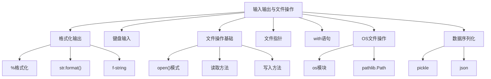

# 第7章 · 文件操作与输入输出 — 连接外部世界

> **时长**：约 3 小时 ｜ **难度**：⭐⭐ ｜ **类型**：讲解+动手
>
> **目标**：掌握 Python 与外部交互的核心能力——格式化输出、键盘输入、文件读写、指针操作、序列化存储，以及现代推荐的文件与路径管理方式。

---

## 学习目标

学完本章后，你将能够：
- 使用 `%`、`str.format()`、f-string 三种方式格式化输出，并能控制对齐、精度、填充等格式
- 正确处理键盘输入并进行类型转换与多值解析
- 熟练使用 `open()` 及多种模式读写文本文件和二进制文件
- 利用 `tell()`、`seek()` 精确控制文件指针位置
- 使用 `with` 语句自动管理资源，避免资源泄漏
- 运用 `os` 模块和 `pathlib.Path` 完成文件和目录的增删改查
- 使用 `pickle` 和 `json` 模块实现数据序列化与反序列化

---

## 知识地图



---

## 1、格式化输出

**概念定义**：格式化输出是指按照指定的模板将变量嵌入到字符串中，生成易于阅读或结构化的文本结果。

**核心价值**：无论是日志记录、报表生成还是用户界面展示，清晰美观的格式化输出都直接提升程序的专业性和可读性。

### 1.1 `%` 格式化（旧式风格）

类似于 C 语言的 `printf`，使用 `%` 作为占位符：

```python
name = "Alice"
age = 25
print("Name: %s, Age: %d" % (name, age))

# 常用占位符: %s(字符串), %d(整数), %f(浮点数), %x(十六进制)
pi = 3.1415926
print("Pi = %.2f" % pi)          # 保留两位小数: Pi = 3.14
print("Pi = %7.3f" % pi)         # 总宽度7, 小数3位: Pi =   3.142
```

| 占位符 | 说明     | 示例              |
|--------|----------|-------------------|
| `%s`   | 字符串   | `"hello %s" % "world"` |
| `%d`   | 十进制整数 | `"age %d" % 25`     |
| `%f`   | 浮点数   | `"pi %.2f" % 3.14`  |
| `%x`   | 十六进制 | `"255 = 0x%x" % 255` |

### 1.2 `str.format()` 方法

更强大且可读性更好的格式化方式，支持位置参数和关键字参数：

```python
# 位置参数
print("{} is {} years old".format("Bob", 30))

# 索引位置
print("{1} is {0} years old".format(30, "Bob"))

# 关键字参数
print("{name} is {age} years old".format(name="Bob", age=30))

# 格式说明符
print("{:.2f}".format(3.14159))          # 3.14
print("{:>10}".format("hello"))          # 右对齐，总宽10: "     hello"
print("{:<10}".format("hello"))          # 左对齐: "hello     "
print("{:^10}".format("hello"))          # 居中对齐: "  hello   "
print("{:,}".format(1000000))            # 千位分隔: 1,000,000
print("{:.2%}".format(0.125))            # 百分比: 12.50%
```

### 1.3 f-string（Python 3.6+，最推荐）

直接在字符串内嵌表达式，语法简洁、性能最优：

```python
name = "Charlie"
age = 28
score = 92.5678

print(f"Name: {name}, Age: {age}")
print(f"Score: {score:.1f}")          # 92.6
print(f"{name:=^20}")                 # 居中对齐，填充=: =======Charlie=======
print(f"{1000000:,}")                 # 1,000,000

# 支持任意表达式
print(f"2 + 3 = {2 + 3}")
print(f"name upper: {name.upper()}")

# 调用函数
def greet(n):
    return f"Hello, {n}!"
print(f"{greet(name)}")
```

### 1.4 `repr()` vs `str()`

```python
from datetime import datetime

now = datetime.now()
print(str(now))    # 用户友好: 2026-06-14 10:30:00
print(repr(now))   # 开发者友好: datetime.datetime(2026, 6, 14, 10, 30)

# f-string 中可用 !r 调用 repr()
val = "hello\nworld"
print(f"{val!r}")  # 'hello\nworld'  含转义字符原文显示
```

### ▶ 代码案例

```powershell
cd code/07-文件与IO-代码案例
python format_demo.py
```

---

## 2、键盘输入

**概念定义**：`input(prompt)` 函数从标准输入读取一行文本，始终返回字符串类型。

**核心价值**：输入是程序与用户交互的基本方式，是命令行工具和交互式脚本的基础。

```python
# 基本输入
name = input("请输入您的名字: ")
print(f"您好, {name}!")

# 类型转换
age = int(input("请输入年龄: "))       # 字符串→整数
height = float(input("请输入身高(m): "))  # 字符串→浮点数

# 多值输入（split 分割）
x, y = input("请输入两个数字（空格分隔）: ").split()
x, y = int(x), int(y)
print(f"和: {x + y}, 积: {x * y}")

# 连续输入直到特定条件
total = 0
while True:
    line = input("输入数字（输入 quit 退出）: ")
    if line == "quit":
        break
    total += float(line)
print(f"总和: {total}")
```

**注意事项**：
- `input()` 在 Python 3 中始终返回字符串，不会像 Python 2 那样自动 `eval`
- 多值输入时注意异常处理（用户可能不按约定格式输入）
- 敏感信息输入建议使用 `getpass` 模块

### ▶ 代码案例

```powershell
cd code/07-文件与IO-代码案例
python input_demo.py
```

---

## 3、文件操作基础

**概念定义**：文件操作是指通过 Python 内置的 `open()` 函数打开文件并获得文件对象，进而执行读写操作。

**核心价值**：数据的持久化存储是程序的重要能力——程序重启后数据不丢失，使得数据可以跨会话共享和积累。

### 3.1 `open()` 函数与模式

```python
# 基本语法: open(file, mode='r', encoding=None)
f = open("data.txt", "r", encoding="utf-8")
# ... 操作文件 ...
f.close()
```

| 模式 | 含义                         | 文件存在时     | 文件不存在时 |
|------|------------------------------|----------------|--------------|
| `r`  | 只读（默认）                 | 正常打开       | 抛出异常     |
| `w`  | 只写                         | 清空内容       | 创建新文件   |
| `a`  | 追加                         | 指针移到末尾   | 创建新文件   |
| `x`  | 独占创建                     | 抛出异常       | 创建新文件   |
| `b`  | 二进制模式（与其他模式组合） | -              | -            |
| `t`  | 文本模式（默认）             | -              | -            |
| `+`  | 读写模式（与其他模式组合）   | -              | -            |

```python
# 组合示例
f = open("data.bin", "rb")          # 二进制只读
f = open("data.txt", "w+")          # 读写，清空原内容
f = open("data.txt", "a+")          # 读写，追加模式
```

### 3.2 文本模式 vs 二进制模式

```python
# 文本模式 (默认): 按字符读写, 自动处理换行符(\n)的跨平台转换
with open("text.txt", "r", encoding="utf-8") as f:
    content = f.read()

# 二进制模式: 按字节读写, 不转换换行符, 适用于图片/视频等
with open("image.jpg", "rb") as f:
    data = f.read()
```

### 3.3 编码指定

```python
# 务必指定 encoding, 避免跨平台编码问题
with open("data.txt", "r", encoding="utf-8") as f:
    text = f.read()

# 常见编码: utf-8, gbk, latin-1, utf-16
with open("data_gbk.txt", "r", encoding="gbk") as f:
    text = f.read()
```

### ▶ 代码案例

```powershell
cd code/07-文件与IO-代码案例
python file_open_demo.py
```

---

## 4、文件读取

**概念定义**：从文件对象中读取数据到程序内存中，支持按字节/字符数、按行、或一次性全部读取。

**核心价值**：根据文件大小和使用场景选择合适的读取方式，直接影响程序的内存效率和运行速度。

### 4.1 读取方法对比

```python
# read(size): 读取指定字符数（不指定则读取全部）
with open("data.txt", "r", encoding="utf-8") as f:
    content = f.read()          # 读取全部 → 适合小文件
    chunk = f.read(100)         # 读取100个字符

# readline(): 读取一行（包括换行符）
with open("data.txt", "r", encoding="utf-8") as f:
    line1 = f.readline()        # 读取第一行
    line2 = f.readline()        # 读取第二行

# readlines(): 读取所有行，返回列表
with open("data.txt", "r", encoding="utf-8") as f:
    lines = f.readlines()       # ['line1\n', 'line2\n', ...]
```

### 4.2 逐行读取（最优方式）

```python
# 使用 for 循环逐行读取 —— 内存友好，推荐！
with open("data.txt", "r", encoding="utf-8") as f:
    for line in f:
        line = line.rstrip("\n")   # 去掉末尾换行符
        print(line)
```

### 4.3 大文件分块读取策略

```python
# 大文件不能一次性 read(), 应按块读取
def read_in_chunks(file_path, chunk_size=1024):
    """逐块读取大文件，每次处理固定大小"""
    with open(file_path, "r", encoding="utf-8") as f:
        while True:
            chunk = f.read(chunk_size)
            if not chunk:
                break
            # 处理当前块
            yield chunk

# 使用生成器逐块处理
for chunk in read_in_chunks("large_file.txt", 8192):
    process(chunk)  # 自定义处理函数
```

### ▶ 代码案例

```powershell
cd code/07-文件与IO-代码案例
python file_read_demo.py
```

---

## 5、文件写入

**概念定义**：将程序内存中的数据写入到文件对象中，实现数据的持久化保存。

**核心价值**：写入是程序的输出通道，让计算结果、日志信息、用户数据等能被永久保存。

```python
# write(): 写入字符串（文本模式）
with open("output.txt", "w", encoding="utf-8") as f:
    f.write("Hello, World!\n")
    f.write("第二行内容\n")

# writelines(): 写入字符串列表（不会自动添加换行符）
lines = ["line1\n", "line2\n", "line3\n"]
with open("lines.txt", "w", encoding="utf-8") as f:
    f.writelines(lines)

# flush(): 强制刷新缓冲区（立即写入磁盘）
with open("log.txt", "w", encoding="utf-8") as f:
    f.write("重要日志\n")
    f.flush()                   # 确保数据立即落盘
    # 即使程序随后崩溃，数据已写入

# 追加模式 'a': 在文件末尾追加内容
with open("log.txt", "a", encoding="utf-8") as f:
    f.write("追加的新日志行\n")
```

### ▶ 代码案例

```powershell
cd code/07-文件与IO-代码案例
python file_write_demo.py
```

---

## 6、文件指针

**概念定义**：文件指针是一个内部位置标记，指示当前读写操作在文件中的位置（以字节/字符为单位）。

**核心价值**：精确控制文件指针可以实现随机访问——跳转到文件任意位置读写，而不必从头到尾顺序处理。

```python
# tell(): 返回当前指针位置
with open("data.txt", "r", encoding="utf-8") as f:
    print(f.tell())      # 0 (文件开头)
    f.read(10)
    print(f.tell())      # 10 (已读10个字符)

# seek(offset, whence): 移动指针
# whence=0: 从文件开头计算（默认）
# whence=1: 从当前位置计算
# whence=2: 从文件末尾计算
with open("data.txt", "r", encoding="utf-8") as f:
    f.seek(0)            # 移动到文件开头
    f.seek(10, 0)        # 移动到第10个字符
    f.seek(0, 2)         # 移动到文件末尾

# 注意: 文本模式下 seek 有限制（只能 seek(0) 或 seek(0,2)）
# 二进制模式 seek 完全自由
with open("data.bin", "rb") as f:
    f.seek(-5, 2)        # 从末尾向前5字节
    last_5_bytes = f.read()

# truncate(size): 截断文件到指定大小
with open("data.txt", "a", encoding="utf-8") as f:
    f.truncate(0)        # 清空文件（保留文件本身）
    f.truncate(100)      # 只保留前100个字符
```

### ▶ 代码案例

```powershell
cd code/07-文件与IO-代码案例
python seek_tell_demo.py
```

---

## 7、with 语句

**概念定义**：`with` 语句是上下文管理器协议的实现，确保代码块执行完毕后自动调用资源的清理方法（如关闭文件）。

**核心价值**：避免因忘记调用 `close()` 导致资源泄漏、数据丢失或文件锁问题，是 Python 中管理外部资源的推荐方式。

```python
# 传统方式（容易忘记 close）
f = open("data.txt", "r", encoding="utf-8")
content = f.read()
f.close()                # 忘记这行会导致资源泄漏

# with 语句（推荐，自动 close）
with open("data.txt", "r", encoding="utf-8") as f:
    content = f.read()
# 缩进块结束后，自动调用 f.close()

# 同时管理多个文件
with open("source.txt", "r") as src, open("dest.txt", "w") as dst:
    for line in src:
        dst.write(line)
```

**`__enter__` 和 `__exit__` 原理**：

```python
class ManagedFile:
    def __enter__(self):
        print("进入 with 块，获取资源")
        return self

    def __exit__(self, exc_type, exc_val, exc_tb):
        print("退出 with 块，释放资源")
        # 返回 True 表示异常已处理，不会向外传播
        return False

with ManagedFile() as mf:
    print("执行操作中...")
```

### ▶ 代码案例

```powershell
cd code/07-文件与IO-代码案例
python with_demo.py
```

---

## 8、OS 文件操作

**概念定义**：Python 的 `os` 模块和 `pathlib` 模块提供了与操作系统交互的接口，用于文件和目录的创建、删除、重命名、路径拼接等操作。

**核心价值**：程序运行时需要管理自身的文件结构、检查资源是否存在、创建必要的目录，这些能力是构建实用的桌面应用和脚本的必备技能。

### 8.1 `os` 模块基础操作

```python
import os

# 获取和切换工作目录
cwd = os.getcwd()          # 获取当前工作目录
os.chdir("/path/to/dir")   # 切换工作目录

# 列出目录内容和创建目录
files = os.listdir(".")    # 列出当前目录所有文件和文件夹
os.mkdir("new_folder")     # 创建单级目录
os.makedirs("a/b/c")       # 创建多级目录（递归）

# 删除和重命名
os.remove("file.txt")      # 删除文件
os.rmdir("empty_dir")      # 删除空目录
os.rename("old.txt", "new.txt")  # 重命名文件/目录
```

### 8.2 `os.path` 子模块（路径处理）

```python
import os

path = "data/subdir/file.txt"

print(os.path.join("data", "subdir", "file.txt"))
# data\subdir\file.txt (Windows) / data/subdir/file.txt (Linux)

print(os.path.exists(path))       # 文件/目录是否存在
print(os.path.isfile(path))       # 是否是文件
print(os.path.isdir(path))        # 是否是目录
print(os.path.splitext(path))     # ('data/subdir/file', '.txt')
print(os.path.basename(path))     # 'file.txt'
print(os.path.dirname(path))      # 'data/subdir'
print(os.path.getsize(path))      # 文件大小（字节）
```

### 8.3 `pathlib.Path`（面向对象，现代推荐）

```python
from pathlib import Path

# 创建路径对象
p = Path("data/subdir/file.txt")

# 路径拼接（/ 运算符重载）
base = Path("data")
full = base / "subdir" / "file.txt"   # 简洁直观！

# 属性
print(full.name)          # 'file.txt'
print(full.stem)          # 'file'
print(full.suffix)        # '.txt'
print(full.parent)        # 'data/subdir'
print(full.parts)         # ('data', 'subdir', 'file.txt')

# 检查
print(full.exists())
print(full.is_file())
print(full.is_dir())

# 创建目录
Path("new_folder").mkdir(exist_ok=True)          # 创建单级
Path("a/b/c").mkdir(parents=True, exist_ok=True) # 创建多级

# 遍历目录
for child in Path(".").iterdir():
    if child.is_file():
        print(f"文件: {child.name}")

# 递归查找
for py_file in Path(".").rglob("*.py"):
    print(py_file)

# 读写文本（便捷方法）
Path("hello.txt").write_text("Hello, World!", encoding="utf-8")
text = Path("hello.txt").read_text(encoding="utf-8")
```

| 操作              | `os` 方式                      | `pathlib` 方式                  |
|-------------------|--------------------------------|---------------------------------|
| 路径拼接          | `os.path.join("a", "b")`       | `Path("a") / "b"`               |
| 检查是否存在      | `os.path.exists(p)`            | `Path(p).exists()`              |
| 递归遍历          | `os.walk(".")`                 | `Path(".").rglob("*")`          |
| 创建目录          | `os.makedirs("a/b")`           | `Path("a/b").mkdir(parents=True)` |

> **推荐**：新项目优先使用 `pathlib`，它更直观、面向对象、跨平台。

### ▶ 代码案例

```powershell
cd code/07-文件与IO-代码案例
python os_path_demo.py
```

---

## 9、数据序列化

**概念定义**：序列化是将内存中的数据结构（字典、列表、对象等）转换为可存储或传输的格式；反序列化是逆向过程。

**核心价值**：序列化使得复杂数据可以持久化到文件、通过网络传输、与其他语言交换数据，是分布式系统和数据存储的基石。

### 9.1 `pickle` 模块（Python 原生二进制格式）

```python
import pickle

data = {
    "name": "Alice",
    "scores": [95, 87, 92],
    "active": True,
    "metadata": None
}

# 序列化：Python 对象 → 字节流
with open("data.pkl", "wb") as f:
    pickle.dump(data, f)

# 反序列化：字节流 → Python 对象
with open("data.pkl", "rb") as f:
    loaded = pickle.load(f)

print(loaded)  # {'name': 'Alice', 'scores': [95, 87, 92], 'active': True, 'metadata': None}
```

> **注意**：`pickle` 仅用于 Python 内部数据交换，不要加载不可信的 pickle 数据（存在安全风险）。

### 9.2 `json` 模块（通用文本格式）

```python
import json

data = {
    "name": "Alice",
    "scores": [95, 87, 92],
    "active": True,
    "metadata": None
}

# Python 对象 → JSON 字符串
json_str = json.dumps(data, ensure_ascii=False, indent=2)
print(json_str)

# Python 对象 → JSON 文件
with open("data.json", "w", encoding="utf-8") as f:
    json.dump(data, f, ensure_ascii=False, indent=2)

# JSON 字符串 → Python 对象
parsed = json.loads(json_str)

# JSON 文件 → Python 对象
with open("data.json", "r", encoding="utf-8") as f:
    parsed = json.load(f)
```

### JSON 与 Python 类型映射表

| JSON 类型 | Python 类型  |
|-----------|-------------|
| `object`  | `dict`      |
| `array`   | `list`      |
| `string`  | `str`       |
| `number` (整数) | `int`     |
| `number` (实数) | `float`   |
| `true`/`false` | `bool`     |
| `null`    | `None`      |

`json.dumps()` 常用参数：

```python
json.dumps(data,
    ensure_ascii=False,   # 不转义非 ASCII 字符（如中文）
    indent=2,             # 缩进2空格，美化输出
    sort_keys=True,       # 按键排序
    separators=(",", ":"),# 自定义分隔符，减少空格
    skipkeys=True         # 跳过非字符串键
)
```

### ▶ 代码案例

```powershell
cd code/07-文件与IO-代码案例
python serialize_demo.py
```

---

## 常见踩坑

1. **忘记指定 `encoding='utf-8'`**：Windows 默认使用 `gbk`，不同平台打开含中文文件会乱码。每次 `open()` 都加上 `encoding='utf-8'`。

2. **忘记 `close()` 导致文件未写入**：写入操作可能缓存在内存中，未 `close()` 或 `flush()` 就退出程序会导致数据丢失。始终使用 `with` 语句。

3. **`w` 模式误清空原文件**：`open("f.txt", "w")` 会直接清空已有文件内容。如果只是想追加请用 `"a"` 模式。

4. **`readlines()` 加载超大文件导致内存溢出**：大文件应该用 `for line in f` 逐行读取，而不是一次性 `readlines()`。

5. **`pickle` 反序列化不可信数据**：`pickle.loads()` 会执行任意代码，绝不要加载来源不明的 pickle 数据。

6. **路径拼接忘记跨平台**：不要用字符串直接拼接路径（`"a" + "/" + "b"`），Linux 和 Windows 分隔符不同。始终用 `os.path.join()` 或 `pathlib.Path` 的 `/` 运算符。

---

---

## 本节小结

- ✅ 三种格式化输出方式：`%`（旧式）、`str.format()`、f-string（推荐），f-string 支持内嵌表达式
- ✅ `input()` 获取键盘输入，需自行类型转换和多值拆分
- ✅ `open(file, mode, encoding)` 打开文件，`r/w/a/x/b/t/+` 多种模式组合
- ✅ 文件读取：`read(size)`、`readline()`、`readlines()`、`for line in f` 逐行（最优）
- ✅ 文件写入：`write()`、`writelines()`、`flush()` 强制刷新
- ✅ 文件指针：`tell()` 查询位置、`seek(offset, whence)` 移动指针
- ✅ `with open(...) as f:` 自动管理资源，避免资源泄漏
- ✅ `os` 模块和 `pathlib.Path`（现代推荐）处理文件和目录
- ✅ `pickle`（Python 原生二进制）和 `json`（通用文本格式）序列化数据

> **下一章**：[第8章 · 错误与异常处理 — 编写健壮的代码](./第8章%20·%20错误与异常处理%20—%20编写健壮的代码.md)——学习如何通过异常处理让程序在面对错误时依然稳健运行。
