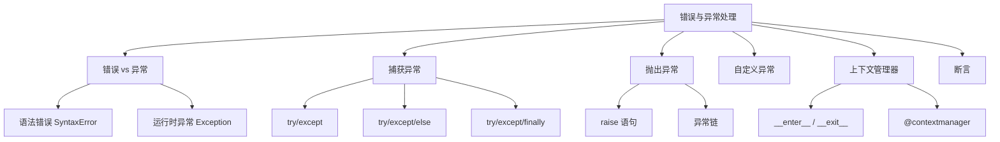

# 第8章 · 错误与异常处理 — 编写健壮的代码

> **时长**：约 2 小时 ｜ **难度**：⭐⭐ ｜ **类型**：讲解+动手
>
> **目标**：系统掌握 Python 的异常处理机制——从捕获和处理异常、抛出异常、自定义异常，到上下文管理器和断言，编写在任何场景下都能稳健运行的代码。

---

## 学习目标

学完本章后，你将能够：
- 区分语法错误和运行时异常，了解常见内置异常类型及继承层次
- 使用 `try/except/else/finally` 完整结构精准捕获和处理异常
- 使用 `raise` 主动抛出异常，并利用异常链传递上下文
- 自定义异常类，为项目提供语义明确的错误类型
- 理解 `with` 语句的上下文管理器协议，并能自定义上下文管理器
- 使用 `assert` 进行调试期断言检查

---

## 知识地图



---

## 1、错误 vs 异常

**概念定义**：语法错误（SyntaxError）是代码不符合 Python 语法规则，在编译阶段被检测到，程序无法运行；异常（Exception）是语法正确但在运行时发生的意外情况，程序可以被捕获并恢复。

**核心价值**：理解两者的区别有助于正确诊断问题——语法错误需要修改代码本身，异常则可以通过异常处理机制优雅地恢复。

```python
# 语法错误：代码根本无法执行
# if True
#     print("hello")   # SyntaxError: expected ':'

# 异常：语法正确，运行时出错
result = 10 / 0   # ZeroDivisionError: division by zero
```

---

## 2、常见异常类型与继承层次

**概念定义**：Python 的异常组织成一棵继承树，所有异常都继承自 `BaseException`，用户应捕获的异常继承自 `Exception`。

**核心价值**：了解异常层次可以精确捕获特定异常，避免过度捕获掩盖真正的 bug，同时知道 `except Exception` 和裸 `except:` 的区别。

```
BaseException
├── SystemExit         # sys.exit() 触发
├── KeyboardInterrupt  # Ctrl+C 触发
└── Exception          # ← 所有常规异常基类
    ├── NameError           # 使用未定义的变量
    ├── TypeError           # 操作或函数应用于不适当类型
    ├── ValueError          # 操作对象类型正确但值不合法
    ├── IndexError          # 序列索引超出范围
    ├── KeyError            # 字典键不存在
    ├── AttributeError      # 对象没有该属性
    ├── ZeroDivisionError   # 除零错误
    ├── FileNotFoundError   # 文件不存在
    └── ImportError         # 导入模块失败
        └── ModuleNotFoundError
```

```python
# 常见异常示例
# NameError
print(undefined_var)

# TypeError
"hello" + 123

# ValueError
int("abc")

# IndexError
lst = [1, 2, 3]
print(lst[10])

# KeyError
d = {"a": 1}
print(d["b"])

# AttributeError
None.upper()

# ZeroDivisionError
1 / 0

# FileNotFoundError
open("nonexistent.txt")
```

### ▶ 代码案例

```powershell
cd code/08-异常处理-代码案例
python exception_basics.py
```

---

## 3、try/except 捕获异常

**概念定义**：`try` 块中放置可能引发异常的代码，`except` 块定义当指定异常发生时的处理逻辑。

**核心价值**：异常捕获让程序不会因单个错误而崩溃，可以实现降级处理、重试、日志记录等恢复策略。

### 3.1 基本语法与捕获单个异常

```python
try:
    num = int(input("请输入一个数字: "))
    result = 100 / num
    print(f"结果是: {result}")
except ValueError:
    print("输入的不是有效数字！")
```

### 3.2 捕获多个异常

```python
# 方式一：多个 except 块（推荐，可分别处理）
try:
    num = int(input("请输入数字: "))
    result = 100 / num
except ValueError:
    print("请输入有效数字！")
except ZeroDivisionError:
    print("不能输入 0！")

# 方式二：元组捕获多个异常（统一处理）
try:
    data = open("data.txt").read()
    num = int(data)
except (FileNotFoundError, ValueError, PermissionError) as e:
    print(f"操作失败: {e}")
```

### 3.3 捕获所有异常（谨慎使用）

```python
# 推荐：明确指定 Exception 基类（不会捕获 SystemExit / KeyboardInterrupt）
try:
    risky_operation()
except Exception as e:
    print(f"发生错误: {type(e).__name__}: {e}")

# 不推荐：裸 except 会捕获所有异常包括 SystemExit，干扰程序退出
try:
    risky_operation()
except:                     # 裸 except，不推荐
    print("出错了")
```

### 3.4 获取异常信息

```python
try:
    1 / 0
except ZeroDivisionError as e:
    print(f"异常类型: {type(e).__name__}")
    print(f"异常信息: {str(e)}")
    print(f"异常详情: {e.args}")
```

### ▶ 代码案例

```powershell
cd code/08-异常处理-代码案例
python exception_basics.py
```

---

## 4、try/except/else

**概念定义**：`else` 块在 `try` 块没有抛出任何异常时执行，用于处理"成功"的逻辑分支。

**核心价值**：将"正常流程"代码放在 `else` 中，与异常处理逻辑分离，避免在 `try` 块中意外捕获本不属于保护范围的异常。

```python
try:
    num = int(input("请输入数字: "))
except ValueError:
    print("输入无效！")
else:
    # 仅当转换成功时执行
    print(f"你输入的数字平方是: {num ** 2}")
```

**`else` 与把代码放在 `try` 末尾的区别**：

```python
# 错误示例：如果平方操作也放在 try 中，ValueError 也会被捕获
try:
    num = int(input("请输入数字: "))
    print(f"平方: {num ** 2}")   # 这里的逻辑错误会被错误地归为输入错误
except ValueError:
    print("输入无效！")

# 正确示例：else 明确属于"成功分支"
try:
    num = int(input("请输入数字: "))
except ValueError:
    print("输入无效！")
else:
    print(f"平方: {num ** 2}")   # 只与"转换成功"相关
```

### ▶ 代码案例

```powershell
cd code/08-异常处理-代码案例
python exception_basics.py
```

---

## 5、try/except/finally

**概念定义**：`finally` 块中的代码无论是否发生异常都会被执行，通常用于资源清理操作。

**核心价值**：确保释放锁、关闭文件、关闭网络连接等清理操作一定被执行，即使异常导致提前退出或 `return` 也是如此。

```python
# finally 确保资源释放
f = None
try:
    f = open("data.txt", "r", encoding="utf-8")
    content = f.read()
    result = 100 / len(content)   # 可能抛出异常
except ZeroDivisionError:
    print("文件内容为空！")
finally:
    if f is not None:
        f.close()                 # 一定会执行！
        print("文件已关闭")

# finally 在 return 之后仍会执行
def demo():
    try:
        print("try 执行")
        return "返回值"
    finally:
        print("finally 一定会执行！")

result = demo()   # 先打印 "finally 一定会执行！"，再返回 "返回值"
print(result)
```

### ▶ 代码案例

```powershell
cd code/08-异常处理-代码案例
python exception_basics.py
```

---

## 6、raise 抛出异常

**概念定义**：`raise` 语句主动触发一个异常，用于在检测到不满足前置条件或业务规则时中断当前流程。

**核心价值**：主动抛出异常是防御式编程的重要手段——"快速失败"原则让错误在最早的时刻被发现，而不是静默传播导致更难调试的后果。

```python
# 基本用法
def divide(a, b):
    if b == 0:
        raise ValueError("除数不能为零！")
    return a / b

# 调用方可以捕获
try:
    result = divide(10, 0)
except ValueError as e:
    print(e)

# 重新抛出当前异常（仅在 except 块中）
try:
    divide(10, 0)
except ValueError:
    print("记录日志...")
    raise    # 重新抛出，让上层调用者继续处理
```

### 异常链 `raise ... from ...`

```python
# 保留原始异常上下文
def load_config(path):
    try:
        with open(path, "r") as f:
            return json.load(f)
    except FileNotFoundError as e:
        raise ValueError(f"配置文件 {path} 不存在") from e
    except json.JSONDecodeError as e:
        raise ValueError(f"配置文件 {path} 格式错误") from e

try:
    config = load_config("config.json")
except ValueError as e:
    print(f"加载失败: {e}")
    print(f"原始原因: {e.__cause__}")  # 原始 FileNotFoundError
```

### ▶ 代码案例

```powershell
cd code/08-异常处理-代码案例
python raise_demo.py
```

---

## 7、自定义异常

**概念定义**：通过继承 `Exception` 类创建自己的异常类型，携带项目特定的错误信息。

**核心价值**：自定义异常让 API 的调用者可以精确捕获你的模块中定义的错误，而不是依赖通用的异常类型，提升了代码的可读性和可维护性。

```python
class ValidationError(Exception):
    """数据验证错误的基础异常"""
    pass

class AgeError(ValidationError):
    """年龄验证错误"""
    def __init__(self, age, message="年龄不合法"):
        self.age = age
        self.message = message
        super().__init__(f"{message}: {age}")

class EmailError(ValidationError):
    """邮箱验证错误"""
    def __init__(self, email, message="邮箱格式错误"):
        self.email = email
        self.message = message
        super().__init__(f"{message}: {email}")

# 使用自定义异常
def validate_user(name, age, email):
    if not name:
        raise ValidationError("姓名不能为空")
    if age < 0 or age > 150:
        raise AgeError(age)
    if "@" not in email:
        raise EmailError(email)

# 调用方可以精确捕获
try:
    validate_user("Alice", -5, "invalid-email")
except AgeError as e:
    print(f"年龄问题: {e}，输入值: {e.age}")
except EmailError as e:
    print(f"邮箱问题: {e}，输入值: {e.email}")
except ValidationError as e:
    print(f"其他验证错误: {e}")
```

**命名约定**：自定义异常类名应以 `Error` 结尾（如 `ConfigError`、`APIError`）。

### ▶ 代码案例

```powershell
cd code/08-异常处理-代码案例
python raise_demo.py
```

---

## 8、with 上下文管理器

**概念定义**：上下文管理器是实现了 `__enter__` 和 `__exit__` 协议的对象，可以通过 `with` 语句自动执行进入和退出时的资源管理逻辑。

**核心价值**：上下文管理器消除重复的资源清理代码（如关闭文件、释放锁、提交/回滚事务），使代码更简洁、更安全。

### 8.1 `__enter__` / `__exit__` 协议

```python
class DatabaseConnection:
    def __enter__(self):
        print("连接数据库...")
        # self.conn = psycopg2.connect(...)
        return self   # as 子句接收的值

    def __exit__(self, exc_type, exc_val, exc_tb):
        print("关闭数据库连接...")
        # self.conn.close()
        if exc_type is not None:
            print(f"发生异常: {exc_type.__name__}: {exc_val}")
        # 返回 False 或 None → 异常继续传播
        # 返回 True → 异常被抑制（谨慎使用）
        return False

with DatabaseConnection() as db:
    print("执行数据库操作...")
    # raise RuntimeError("模拟错误")  # 即使出错也会执行 __exit__
```

### 8.2 `contextlib.contextmanager` 装饰器

```python
from contextlib import contextmanager

@contextmanager
def timer(description):
    """计时上下文管理器"""
    import time
    start = time.perf_counter()
    print(f"{description}...开始")
    try:
        yield    # 这里是 with 块内容执行的位置
    finally:
        elapsed = time.perf_counter() - start
        print(f"{description}...完成，耗时: {elapsed:.3f}秒")

# 使用
with timer("数据处理"):
    total = sum(range(1_000_000))
    print(f"总和: {total}")
```

### 8.3 嵌套 with

```python
# 方式一：多个 with 嵌套
with open("src.txt", "r") as src:
    with open("dst.txt", "w") as dst:
        dst.write(src.read())

# 方式二：一个 with 逗号分隔（推荐，等效）
with open("src.txt", "r") as src, open("dst.txt", "w") as dst:
    dst.write(src.read())
```

### ▶ 代码案例

```powershell
cd code/08-异常处理-代码案例
python context_manager.py
```

---

## 9、assert 断言

**概念定义**：`assert condition, message` 在条件为 `False` 时抛出 `AssertionError`，用于在开发阶段验证程序内部状态是否符合预期。

**核心价值**：断言是一种"契约式编程"工具——它声明了"这里我确信 X 为真"，如果条件不满足说明程序有 bug，而不是发生了可恢复的运行时错误。

```python
# 基本语法
def withdraw(balance, amount):
    assert amount > 0, "取款金额必须为正数"
    assert balance >= amount, "余额不足"
    return balance - amount

# 断言用于检查前置条件/后置条件/不变式
def sort_numbers(nums):
    assert isinstance(nums, list), "输入必须是列表"
    sorted_nums = sorted(nums)
    assert len(sorted_nums) == len(nums), "元素数量不应变化"  # 后置条件
    assert all(sorted_nums[i] <= sorted_nums[i+1] for i in range(len(sorted_nums)-1)), "结果必须有序"
    return sorted_nums
```

### 断言 vs 异常的应用场景

```python
# 断言：检查代码内部的 bug（永远不应发生的状态）
def divide(a, b):
    assert b != 0, "除数不应为零——调用者应已确保"  # 这是调用者的 bug
    return a / b

# 异常：检查可恢复的运行时错误（如用户输入）
def get_user_input():
    try:
        return int(input("请输入数字: "))
    except ValueError:
        print("输入不合法，请重试")
        return get_user_input()
```

**重要**：Python 可以 `-O`（优化）模式运行，此时所有 `assert` 被禁用：

```bash
python -O script.py    # assert 语句被跳过
```

因此断言绝不能用于：
- 程序关键逻辑的正确性保障
- 安全验证（权限检查等）
- 必须有副作用的表达式（如 `assert db.update(x)`）

### ▶ 代码案例

```powershell
cd code/08-异常处理-代码案例
python assert_demo.py
```

---

## 常见踩坑

1. **裸 `except:` 捕获了不该捕获的异常**：`except:` 会捕获 `SystemExit` 和 `KeyboardInterrupt`，导致 Ctrl+C 无法退出程序。始终用 `except Exception as e:`。

2. **`try` 块范围过大**：将大量代码放在 try 中，可能捕获了非预期的异常，掩盖了真正的问题。try 块应该只包含最少量的可能抛出特定异常的代码。

3. **`assert` 用于生产环境数据校验**：因为 `python -O` 会禁用 `assert`，生产环境的数据校验应该使用显式的 `if/raise`。

4. **`finally` 中有 `return` 会抑制异常**：如果 `finally` 中有 `return` 语句，它会覆盖 `try` 块中的异常或 `return`。

```python
def bad():
    try:
        raise ValueError("错误")
    finally:
        return "覆盖"   # 异常被丢弃！

print(bad())  # 输出 "覆盖"，异常消失！
```

5. **捕获 `Exception` 后没有日志或提示**：静默捕获异常（`except Exception: pass`）会让程序完全失去调试线索，是最糟糕的实践之一。至少应该 `logging.exception()` 记录日志。

---

---

## 本节小结

- ✅ 语法错误（SyntaxError）编译时发现，异常（Exception）运行时发生
- ✅ 异常的继承层次：`BaseException` → `Exception` → 具体异常
- ✅ `try/except` 捕获异常，支持单异常、多异常（元组或多个 except）、全部异常
- ✅ `else` 在无异常时执行，`finally` 无论是否异常都执行
- ✅ `raise` 主动抛出异常，`raise ... from ...` 保留异常链
- ✅ 自定义异常继承 `Exception`，命名以 `Error` 结尾
- ✅ 上下文管理器通过 `__enter__`/`__exit__` 协议实现资源自动管理
- ✅ `@contextmanager` 装饰器简化上下文管理器实现
- ✅ `assert` 用于调试期验证，生产环境可能被 `-O` 禁用

> **下一章**：[第9章 · 面向对象编程 — 组织大规模代码](./第9章%20·%20面向对象编程%20—%20组织大规模代码.md)——深入学习 Python 的面向对象编程，掌握类、继承、多态、特殊方法等核心概念。
