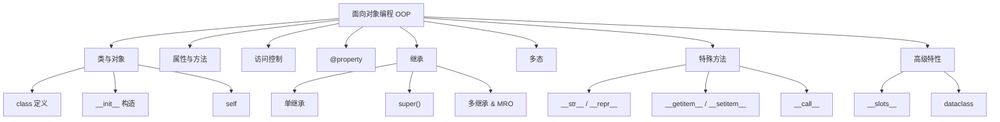

# 第9章 · 面向对象编程 — 组织大规模代码

> **时长**：约 3.5 小时 ｜ **难度**：⭐⭐⭐ ｜ **类型**：讲解+动手
>
> **目标**：系统掌握 Python 面向对象编程的核心机制——类定义、属性方法、访问控制、继承、多态、特殊方法及高级特性，能够用 OOP 组织大规模代码。

---

## 学习目标

学完本章后，你将能够：
- 使用 `class` 定义类和 `__init__` 构造方法，理解 `self` 的含义
- 区分实例属性、类变量、实例方法、类方法和静态方法
- 运用 `_name` 约定和 `__name` 名称改写实现访问控制
- 使用 `@property` 装饰器实现计算属性和属性验证
- 掌握单继承、多继承及 MRO 方法解析顺序
- 理解鸭子类型多态，使用 `isinstance()` / `issubclass()` 检查类型
- 实现 `__str__`、`__len__`、`__getitem__`、`__call__` 等常用特殊方法
- 使用 `__slots__` 节省内存、`dataclass` 简化数据类定义

---

## 知识地图



---

## 1、类与对象

**概念定义**：类（Class）是对象的蓝图和模板，定义了对象的属性（数据）和方法（行为）；对象（Object）是类的实例，拥有独立的状态。

**核心价值**：面向对象编程让代码的组织方式更贴近现实世界的建模方式，将数据和行为封装在一起，实现高内聚、低耦合，便于大型项目的分工协作和维护。

### 1.1 定义类与创建对象

```python
class Student:
    """学生类"""
    def __init__(self, name, age, score):
        self.name = name      # 实例属性
        self.age = age
        self.score = score

    def introduce(self):      # 实例方法
        return f"我叫{self.name}，今年{self.age}岁"

# 创建实例
s1 = Student("张三", 20, 95)
s2 = Student("李四", 22, 88)

print(s1.introduce())   # 我叫张三，今年20岁
print(s2.introduce())   # 我叫李四，今年22岁
```

### 1.2 `self` 的含义

`self` 指向实例本身，是实例方法的第一个参数。调用时 Python 自动传入：

```python
s1.introduce()          # Python 自动转为 Student.introduce(s1)
# 等价于：
Student.introduce(s1)   # 手动传入 self
```

### ▶ 代码案例

```powershell
cd code/09-面向对象-代码案例
python class_basics.py
```

---

## 2、属性与方法

**概念定义**：属性是对象持有的数据，方法是对象的行为函数。Python 通过实例变量、类变量和不同类型的方法提供了灵活的成员定义方式。

**核心价值**：正确区分实例级和类级成员，能够合理规划数据归属——实例数据各自独立、类数据共享复用。

### 2.1 实例属性与类变量

```python
class Dog:
    # 类变量（所有实例共享）
    species = "Canis familiaris"
    count = 0

    def __init__(self, name, age):
        # 实例属性（每个实例独立）
        self.name = name
        self.age = age
        Dog.count += 1  # 每创建一个实例，计数+1

dog1 = Dog("旺财", 3)
dog2 = Dog("来福", 5)

print(dog1.name)          # 旺财（实例属性）
print(dog1.species)       # Canis familiaris（类变量，通过实例访问）
print(Dog.species)        # Canis familiaris（通过类访问）
print(Dog.count)          # 2（跟踪实例总数）

# 修改类变量要通过类名
Dog.species = "Canis lupus"
print(dog2.species)       # Canis lupus（所有实例生效）
```

### 2.2 实例方法、类方法与静态方法

```python
class MathUtils:
    pi = 3.14159

    # 实例方法：需要 self，可访问实例和类
    def instance_method(self):
        return f"实例方法，pi = {self.pi}"

    # 类方法：需要 cls，只能访问类，不能访问实例
    @classmethod
    def circle_area(cls, radius):
        return cls.pi * radius ** 2

    # 静态方法：不需要 self/cls，纯粹工具函数
    @staticmethod
    def add(a, b):
        return a + b

# 实例方法 → 通过实例调用
mu = MathUtils()
print(mu.instance_method())

# 类方法 → 通过类或实例调用
print(MathUtils.circle_area(5))
print(mu.circle_area(5))

# 静态方法 → 通过类或实例调用
print(MathUtils.add(3, 4))
print(mu.add(3, 4))
```

| 方法类型       | 装饰器         | 第一个参数 | 能访问实例 | 能访问类 |
|----------------|----------------|------------|------------|----------|
| 实例方法       | 无             | `self`     | 是         | 是       |
| 类方法         | `@classmethod` | `cls`      | 否         | 是       |
| 静态方法       | `@staticmethod`| 无         | 否         | 否       |

### ▶ 代码案例

```powershell
cd code/09-面向对象-代码案例
python methods.py
```

---

## 3、访问控制

**概念定义**：Python 没有严格的访问控制关键字，而是通过命名约定和名称改写机制来实现属性的可见性管理。

**核心价值**：访问控制是封装性的基础——隐藏内部实现细节，仅暴露安全的公共接口，降低模块间的耦合度。

```python
class BankAccount:
    def __init__(self, owner, balance):
        self.owner = owner           # 公有属性：外部可随意访问
        self._branch_code = "001"    # 单下划线：内部使用（约定，非强制）
        self.__balance = balance     # 双下划线：名称改写（name mangling）

    def deposit(self, amount):
        if amount > 0:
            self.__balance += amount

    def get_balance(self):           # 提供受控的访问接口
        return self.__balance

account = BankAccount("Alice", 1000)

# 公有属性：直接访问
print(account.owner)                # Alice

# 单下划线：可以访问，但约定不应直接访问
print(account._branch_code)         # 001（Python 不会阻止）

# 双下划线：名称改写，不能直接访问
# print(account.__balance)          # AttributeError!

# 通过名称改写后的名字访问（知道原理但不建议这样做）
print(account._BankAccount__balance) # 1000（名称改写为 _ClassName__attr）
```

**名称改写原理**：`__name` 在类定义内部被自动替换为 `_ClassName__name`，目的是防止子类意外覆写父类的属性。

### ▶ 代码案例

```powershell
cd code/09-面向对象-代码案例
python class_basics.py
```

---

## 4、@property 装饰器

**概念定义**：`@property` 将方法"伪装"成属性访问，同时提供 getter、setter、deleter 的控制逻辑。

**核心价值**：在不破坏外部调用方式的前提下，将直接属性访问升级为带有验证、计算、日志等逻辑的受控访问，实现"优雅的封装"。

```python
class Temperature:
    def __init__(self, celsius=0):
        self._celsius = celsius

    # getter：获取属性值
    @property
    def celsius(self):
        return self._celsius

    # setter：设置属性值（含验证）
    @celsius.setter
    def celsius(self, value):
        if value < -273.15:
            raise ValueError("温度不能低于绝对零度！")
        self._celsius = value

    # deleter：删除属性
    @celsius.deleter
    def celsius(self):
        print("删除温度数据")
        del self._celsius

    # 计算属性（只读，无 setter）
    @property
    def fahrenheit(self):
        return self._celsius * 9 / 5 + 32

t = Temperature(25)
print(t.celsius)       # 25（像属性一样访问，实则是 getter 方法）
t.celsius = 30         # 像属性一样赋值，实则是 setter 方法
print(t.fahrenheit)    # 86.0（计算属性）

# t.celsius = -300     # ValueError: 温度不能低于绝对零度！
```

### ▶ 代码案例

```powershell
cd code/09-面向对象-代码案例
python property_demo.py
```

---

## 5、继承

**概念定义**：继承允许一个类（子类）从另一个类（父类）获得属性和方法，并在此基础上扩展或修改。

**核心价值**：继承实现代码复用——公共逻辑放在父类，子类专注差异化实现；同时建立概念层次关系，使代码结构更清晰。

### 5.1 单继承

```python
class Animal:
    def __init__(self, name):
        self.name = name

    def speak(self):
        return "...（沉默）"

    def move(self):
        return f"{self.name} 在移动"

class Dog(Animal):
    def __init__(self, name, breed):
        super().__init__(name)      # 调用父类构造方法
        self.breed = breed

    def speak(self):                # 方法重写（override）
        return "汪汪！"

class Cat(Animal):
    def speak(self):
        return "喵喵～"

dog = Dog("旺财", "金毛")
cat = Cat("小花")

print(dog.speak())       # 汪汪！
print(cat.speak())       # 喵喵～
print(dog.move())        # 旺财 在移动（继承自父类）
```

### 5.2 `super()` 详解

```python
class Base:
    def __init__(self):
        self.value = "base"

class Middle(Base):
    def __init__(self):
        super().__init__()          # 调用 Base.__init__
        self.middle_value = "middle"

class Derived(Middle):
    def __init__(self):
        super().__init__()          # 调用 Middle.__init__
        self.derived_value = "derived"

d = Derived()
print(d.value)          # base（来自 Base）
print(d.middle_value)   # middle（来自 Middle）
print(d.derived_value)  # derived（来自 Derived）
```

### 5.3 多继承与 MRO

**概念定义**：MRO（方法解析顺序，Method Resolution Order）决定了多继承时从哪个父类查找方法。Python 使用 C3 线性化算法保证每个父类只被访问一次。

**核心价值**：理解 MRO 可以正确预测多继承场景下的方法调用路径，避免菱形继承中的二义性问题。

```python
class A:
    def method(self):
        return "A"

class B(A):
    def method(self):
        return "B"

class C(A):
    def method(self):
        return "C"

class D(B, C):          # 多继承
    pass

d = D()
print(d.method())       # 哪个父类的方法？

# 查看 MRO
print(D.__mro__)
# (<class '__main__.D'>, <class '__main__.B'>, <class '__main__.C'>, <class '__main__.A'>, <class 'object'>)
print(D.mro())          # 等同 __mro__

# C3 线性化: D → B → C → A → object
# 因此 d.method() 调用 B.method()
```

### ▶ 代码案例

```powershell
cd code/09-面向对象-代码案例
python inheritance.py
```

---

## 6、多态

**概念定义**：多态是指不同类的对象对同一消息作出各自不同的响应。Python 的多态本质上是"鸭子类型"——不关心对象的类型，只关心对象有没有所需的方法。

**核心价值**：多态让代码可以通过统一的接口操作不同类型的对象，无需为每种类型编写单独的处理分支，极大提升代码的灵活性和扩展性。

```python
# 鸭子类型：如果它像鸭子一样走路、像鸭子一样叫，那它就是鸭子
class Duck:
    def speak(self):
        return "嘎嘎嘎"

class Person:
    def speak(self):
        return "你好"

class Robot:
    def speak(self):
        return "哔哔——系统启动"

# 多态函数：不关心参数类型，只要有 speak 方法即可
def make_sound(entity):
    return entity.speak()

# 同一接口，不同实现
for obj in [Duck(), Person(), Robot()]:
    print(make_sound(obj))
# 嘎嘎嘎
# 你好
# 哔哔——系统启动
```

### `isinstance()` 和 `issubclass()`

```python
class Animal: pass
class Dog(Animal): pass

d = Dog()

print(isinstance(d, Dog))       # True
print(isinstance(d, Animal))    # True
print(isinstance(d, object))    # True（所有类都继承自 object）
print(isinstance("hello", (str, int)))  # True（元组中的任一类型匹配即可）

print(issubclass(Dog, Animal))  # True
print(issubclass(Dog, object))  # True
```

### ▶ 代码案例

```powershell
cd code/09-面向对象-代码案例
python inheritance.py
```

---

## 7、特殊方法

**概念定义**：特殊方法（Magic Methods / Dunder Methods）是名称以双下划线开头和结尾的方法（如 `__str__`），由 Python 解释器在特定操作时自动调用。

**核心价值**：特殊方法让自定义类的行为与内置类型一致——支持 `len()`、`str()`、`[]` 索引、`()` 调用、运算符重载等，实现真正的"Pythonic"风格。

### 7.1 字符串表示：`__str__` 和 `__repr__`

```python
class Point:
    def __init__(self, x, y):
        self.x = x
        self.y = y

    # 用户友好的字符串表示
    def __str__(self):
        return f"({self.x}, {self.y})"

    # 开发者友好的字符串表示（应能重建对象）
    def __repr__(self):
        return f"Point({self.x!r}, {self.y!r})"

p = Point(3, 4)

print(str(p))        # (3, 4)    → __str__
print(repr(p))       # Point(3, 4) → __repr__
print(p)             # (3, 4)    → print 调用 __str__
```

### 7.2 容器相关：`__len__`、`__getitem__`、`__setitem__`

```python
class MyList:
    def __init__(self, items=None):
        self._items = list(items) if items else []

    def __len__(self):            # len(obj) 支持
        return len(self._items)

    def __getitem__(self, index): # obj[key] 读取
        return self._items[index]

    def __setitem__(self, index, value):  # obj[key] = value
        self._items[index] = value

    def __contains__(self, item):  # item in obj 支持
        return item in self._items

ml = MyList([10, 20, 30])
print(len(ml))          # 3
print(ml[1])            # 20
ml[1] = 25
print(25 in ml)         # True
```

### 7.3 可调用对象：`__call__`

```python
class Counter:
    def __init__(self):
        self.count = 0

    def __call__(self):
        self.count += 1
        return self.count

c = Counter()
print(c())   # 1（像函数一样调用实例）
print(c())   # 2
print(c())   # 3
```

### 7.4 比较运算符

```python
class Person:
    def __init__(self, name, age):
        self.name = name
        self.age = age

    def __eq__(self, other):         # ==
        if not isinstance(other, Person):
            return NotImplemented
        return self.name == other.name and self.age == other.age

    def __lt__(self, other):         # <
        return self.age < other.age

    def __hash__(self):              # 使对象可放入集合/dict键
        return hash((self.name, self.age))

p1 = Person("A", 25)
p2 = Person("A", 25)
p3 = Person("B", 30)

print(p1 == p2)      # True
print(p1 < p3)       # True (25 < 30)

# 用于集合
people = {p1, p3}
print(p2 in people)  # True（因为 p1 == p2）
```

### 7.5 算术运算符

```python
class Vector:
    def __init__(self, x, y):
        self.x = x
        self.y = y

    def __add__(self, other):       # +
        return Vector(self.x + other.x, self.y + other.y)

    def __sub__(self, other):       # -
        return Vector(self.x - other.x, self.y - other.y)

    def __mul__(self, scalar):      # *
        return Vector(self.x * scalar, self.y * scalar)

    def __repr__(self):
        return f"Vector({self.x}, {self.y})"

v1 = Vector(1, 2)
v2 = Vector(3, 4)

print(v1 + v2)          # Vector(4, 6)
print(v2 - v1)          # Vector(2, 2)
print(v1 * 3)           # Vector(3, 6)
```

### 7.6 特殊方法速查表

| 类别       | 特殊方法                          | 对应操作              |
|------------|-----------------------------------|-----------------------|
| 字符串     | `__str__`、`__repr__`             | `str()`、`repr()`     |
| 容器       | `__len__`、`__getitem__`、`__setitem__`、`__contains__` | `len()`、`[]`、`in` |
| 调用       | `__call__`                        | 实例作为函数调用      |
| 比较       | `__eq__`、`__ne__`、`__lt__`、`__le__`、`__gt__`、`__ge__` | `==`、`!=`、`<`、`<=`、`>`、`>=` |
| 算术       | `__add__`、`__sub__`、`__mul__`、`__truediv__` 等 | `+`、`-`、`*`、`/` 等 |
| 上下文     | `__enter__`、`__exit__`           | `with` 语句           |
| 迭代       | `__iter__`、`__next__`            | `for ... in`          |

### ▶ 代码案例

```powershell
cd code/09-面向对象-代码案例
python special_methods.py
```

---

## 8、高级特性

### 8.1 `__slots__`：限制实例属性，节省内存

**概念定义**：`__slots__` 声明实例允许的属性名称列表，禁止动态添加新属性，并避免为每个实例创建 `__dict__`。

**核心价值**：当有大量实例（百万级）时，`__slots__` 显著减少内存占用（每实例节省约 50% 内存）。

```python
class PointWithDict:
    def __init__(self, x, y):
        self.x = x
        self.y = y

class PointWithSlots:
    __slots__ = ("x", "y")   # 仅允许 x 和 y 属性
    def __init__(self, x, y):
        self.x = x
        self.y = y

p1 = PointWithDict(1, 2)
p2 = PointWithSlots(1, 2)

p1.z = 3     # 可以（普通实例有 __dict__）
# p2.z = 3   # AttributeError!（__slots__ 限制）

# 查看内存差异
print(p1.__dict__)   # {'x': 1, 'y': 2, 'z': 3}
# print(p2.__dict__) # AttributeError! 没有 __dict__
```

### 8.2 `__dict__`：属性字典

```python
class User:
    def __init__(self, name, email):
        self.name = name
        self.email = email

u = User("Alice", "alice@example.com")
print(u.__dict__)
# {'name': 'Alice', 'email': 'alice@example.com'}

# 动态添加属性
u.__dict__["role"] = "admin"
print(u.role)  # admin
```

### 8.3 `type()` 动态创建类

```python
# type(类名, 父类元组, 属性字典)
MyClass = type("MyClass", (object,), {"x": 10, "greet": lambda self: "Hello"})

obj = MyClass()
print(obj.x)       # 10
print(obj.greet()) # Hello
```

### 8.4 `dataclass` 装饰器（Python 3.7+）

**概念定义**：`@dataclass` 自动生成 `__init__`、`__repr__`、`__eq__` 等方法，极大简化数据类的定义。

**核心价值**：消除大量重复的样板代码，让类定义专注于数据结构本身，而非方法实现。

```python
from dataclasses import dataclass, field

@dataclass
class Student:
    name: str
    age: int
    scores: list = field(default_factory=list)  # 可变默认值需用 field
    grade: str = "未知"

# 自动生成：
#   - __init__(self, name, age, scores, grade)
#   - __repr__
#   - __eq__
#   - __hash__（若 frozen=True）

s1 = Student("张三", 20, [95, 87])
s2 = Student("张三", 20, [95, 87])

print(s1)               # Student(name='张三', age=20, scores=[95, 87], grade='未知')
print(s1 == s2)         # True（自动生成 __eq__）

# 不可变数据类
@dataclass(frozen=True)
class Point:
    x: float
    y: float

p = Point(1.0, 2.0)
# p.x = 3.0  # FrozenInstanceError!

# 对比传统方式
class StudentTraditional:
    """手动编写所有方法，大量样板代码"""
    def __init__(self, name, age):
        self.name = name
        self.age = age

    def __repr__(self):
        return f"StudentTraditional(name={self.name!r}, age={self.age!r})"

    def __eq__(self, other):
        if not isinstance(other, StudentTraditional):
            return NotImplemented
        return self.name == other.name and self.age == other.age

# dataclass 自动完成上述所有，推荐用于纯数据存储场景
```

### ▶ 代码案例

```powershell
cd code/09-面向对象-代码案例
python advanced_oop.py
```

---

## 常见踩坑

1. **可变对象作为默认参数**：`def __init__(self, items=[])` 会导致所有实例共享同一个列表。应该用 `items=None` 然后在方法体内 `if items is None: items = []`，或使用 `dataclass` + `field(default_factory=list)`。

2. **在 `__init__` 之外定义实例属性**：Python 允许在任何地方添加实例属性，但这容易导致不同代码路径创建不同属性集，引发 `AttributeError`。所有实例属性都在 `__init__` 中定义。

3. **忘记调用 `super().__init__()`**：子类如果定义了 `__init__` 但不调用父类的初始化方法，父类属性不会被初始化。

4. **误用类变量作为实例变量**：修改实例的类变量（如 `dog1.species = "xxx"`）会创建同名的实例属性，不再影响类变量，也不会影响其他实例。理解属性查找顺序：实例属性 → 类变量。

5. **`@staticmethod` 滥用**：如果一个方法不访问类也不访问实例，它应该被定义为模块级函数而不是静态方法。只在逻辑上确实属于该类的命名空间时才使用 `@staticmethod`。

6. **多继承的菱形问题**：多继承容易导致不可预期的 MRO。尽量使用组合（has-a）代替继承（is-a），或使用 Mixin 类模式来控制复杂度。

---

---

## 本节小结

- ✅ `class` 定义类，`__init__` 构造方法，`self` 指向实例
- ✅ 实例属性独立于实例，类变量共享于所有实例
- ✅ 实例方法、`@classmethod`、`@staticmethod` 三者的区别和适用场景
- ✅ 访问控制：`name`（公有）、`_name`（约定内部）、`__name`（名称改写）
- ✅ `@property` 将方法伪装为属性，支持 getter/setter/deleter
- ✅ 单继承（`super()`）、多继承（MRO/C3 线性化）
- ✅ 鸭子类型多态——只要有相同方法即可
- ✅ 特殊方法让自定义类拥有内置类型的行为
- ✅ `__slots__` 节省内存、`dataclass` 消除样板代码

> **下一章**：[第10章 · 标准库与综合实战 — 学以致用](./第10章%20·%20标准库与综合实战%20—%20学以致用.md)——综合运用前九章所学知识，结合常用标准库模块，完成一个完整的命令行项目。
