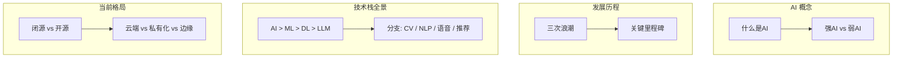
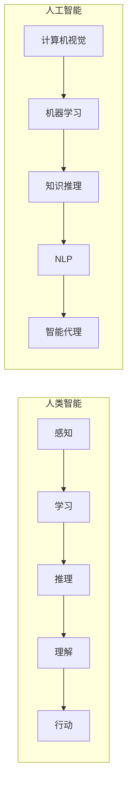
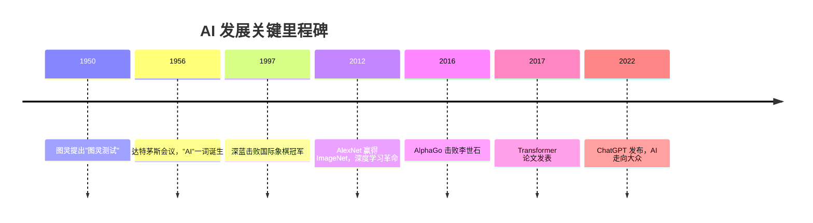
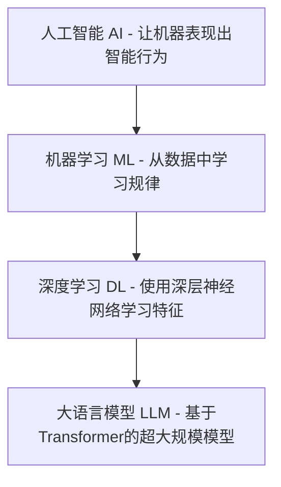
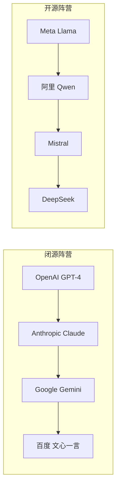
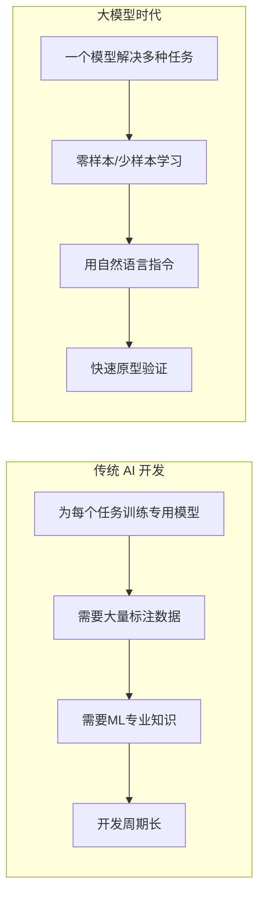

# 第1章 · AI 发展简史与技术图谱

> **时长**：约 2 小时 ｜ **难度**：⭐ ｜ **类型**：概念理解
>
> **目标**：了解 AI 发展历程，理解技术栈全景图，建立领域整体认知

---

## 学习目标

学完本章后，你将能够：
- 解释 AI、机器学习、深度学习、大语言模型之间的层级关系
- 描述 AI 发展的三次浪潮和关键里程碑
- 区分强 AI 与弱 AI，理解当前大模型的定位
- 了解闭源 vs 开源、云端 vs 私有化的产业格局
- 理解大模型时代的范式转变

---

## 知识地图

---

## 1、什么是人工智能

**概念定义**：人工智能（Artificial Intelligence, AI）是让机器模拟人类智能行为的技术，涵盖感知、学习、推理、理解和行动五个维度。

**核心定位**：当前的大语言模型属于弱 AI（专用 AI），但在通用性上已有重大突破——一个模型可解决多种任务，这是以往 AI 系统无法做到的。

### 强 AI vs 弱 AI

| 类型 | 说明 | 现状 |
|------|------|------|
| **弱 AI（专用 AI）** | 在特定任务上超越人类 | 已实现（围棋、图像识别） |
| **强 AI（通用 AI）** | 具备人类级别的通用智能 | 尚未实现 |
| **超级 AI** | 远超人类的智能 | 假想阶段 |

---

## 2、AI 发展历程

**概念定义**：AI 发展经历了三次浪潮（符号主义、专家系统、深度学习）和两次寒冬（期望过高→资金撤离→研究停滞），当前处于第三次浪潮的爆发期。

### 关键里程碑

| 年代 | 事件 | 意义 |
|------|------|------|
| 1950 | 图灵提出"图灵测试" | AI 概念萌芽 |
| 1956 | 达特茅斯会议 | "人工智能"一词诞生 |
| 1997 | 深蓝击败国际象棋冠军 | 专用 AI 的胜利 |
| 2012 | AlexNet 赢得 ImageNet | 深度学习革命开始 |
| 2016 | AlphaGo 击败李世石 | 强化学习突破 |
| 2017 | Transformer 论文发表 | 现代大模型基础 |
| 2022 | ChatGPT 发布 | AI 走向大众 |

---

## 3、AI 技术栈全景图

**概念定义**：AI 技术栈是四层同心圆结构——人工智能（AI）包含机器学习（ML），机器学习包含深度学习（DL），深度学习包含大语言模型（LLM）。外层是内层的父集。

### AI 技术分支

| 分支 | 任务 | 代表技术 |
|------|------|---------|
| **计算机视觉 (CV)** | 图像识别、目标检测 | CNN、YOLO、SAM |
| **自然语言处理 (NLP)** | 文本理解、对话生成 | Transformer、GPT |
| **语音技术** | 语音识别、语音合成 | Whisper、TTS |
| **推荐系统** | 个性化推荐 | 协同过滤、深度推荐 |
| **强化学习** | 决策与控制 | DQN、PPO |

---

## 4、当前 AI 格局

### 闭源 vs 开源

### 部署方式对比

| 方式 | 优点 | 缺点 | 适用场景 |
|------|------|------|---------|
| **云端 API** | 即开即用、免维护 | 数据安全、成本累积 | 快速验证、中小规模 |
| **私有化部署** | 数据可控、定制化 | 成本高、需要运维 | 企业核心业务 |
| **边缘部署** | 低延迟、离线可用 | 能力受限 | 端侧智能 |

---

## 5、大模型为什么改变了一切

**概念定义**：大模型时代发生了范式转变——从"为每个任务训练专用模型"到"一个通用模型解决多种任务"。这是 AI 工程化方式的根本变革。

**核心定位**：传统 AI 开发需要 ML 专业知识、大量标注数据、长周期开发；大模型时代用自然语言指令即可快速原型验证，零样本/少样本学习大幅降低数据门槛。

### 为什么大模型能力涌现

1. **规模效应**：参数量从百万到万亿，量变引起质变
2. **海量数据**：互联网级别的文本训练
3. **Transformer 架构**：高效处理长距离依赖
4. **算力突破**：GPU/TPU 集群训练

---

## 常见踩坑

1. **混淆 AI 层级关系**：将机器学习等同于 AI 全部，或以为 ChatGPT 就是 AI 的全部。正确理解：AI > ML > DL > LLM，大模型只是 AI 的一个子领域。
2. **认为大模型是强 AI**：ChatGPT 虽然通用性强，但仍属于弱 AI——它没有意识、没有真正的理解，只是基于统计模式的文本生成。
3. **忽视传统方法的价值**：不是所有问题都需要大模型。传统机器学习在表格数据、结构化预测等任务上可能更高效、更可解释。
4. **对"涌现能力"过度解读**：大模型的能力涌现是真实的，但并非魔法——它是规模、数据、架构三者共同作用的结果，不能脱离这些基础谈涌现。

---

## 课后练习

1. 画出 AI 技术栈的四层同心圆结构，为每一层写出 2 个代表性技术或应用
2. 选择一个 AI 历史里程碑事件（如图灵测试、AlphaGo、ChatGPT），写 200 字分析其对行业的影响
3. 调研你所在行业/公司目前使用的 AI 技术属于四层中的哪一层，写一个简短的现状分析
4. 对比至少 3 个闭源大模型和 3 个开源大模型，整理它们的核心参数（参数量、上下文长度、价格）

---

## 本章小结

- ✅ AI 是让机器模拟人类智能的技术，当前处于弱 AI 阶段
- ✅ AI 经历了三次浪潮和两次寒冬，ChatGPT 标志着 AI 走向大众
- ✅ AI > ML > DL > LLM 的层级关系是理解技术栈的关键
- ✅ 大模型时代发生了从"专用模型"到"通用模型"的范式转变

---

> **下一章**：第2章 · 机器学习核心概念速览
