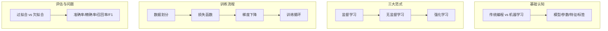
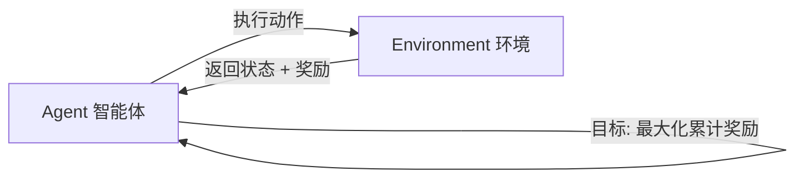
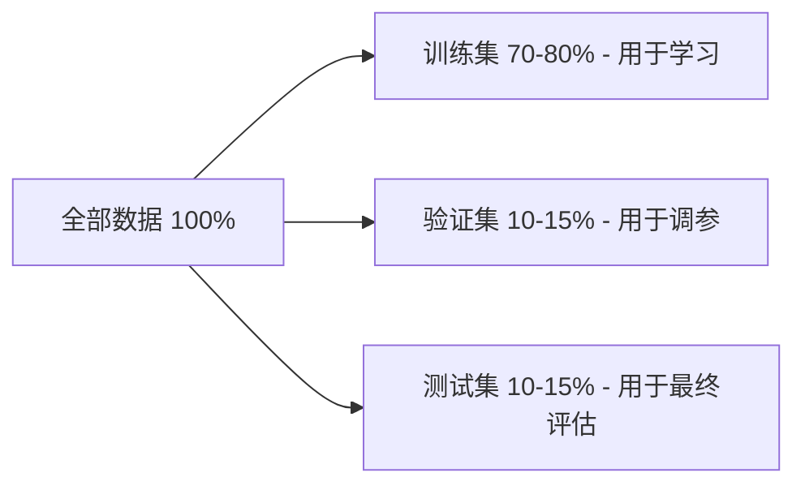
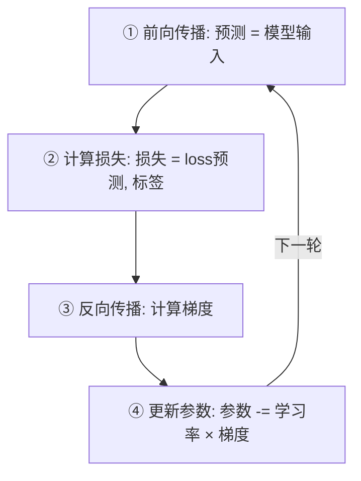
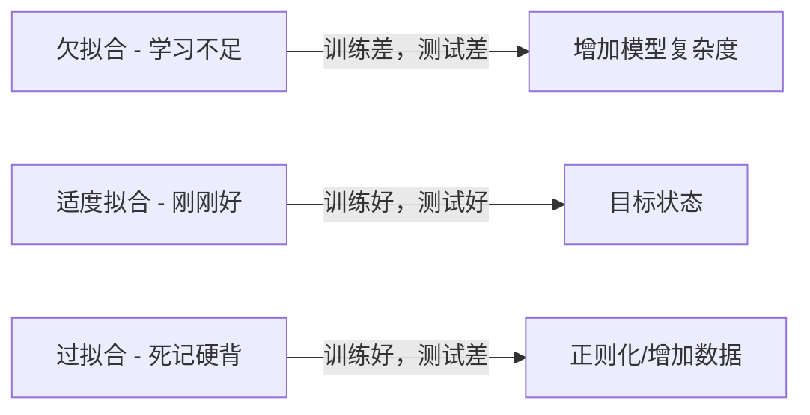

# 第2章 · 机器学习核心概念速览

> **时长**：约 2.5 小时 ｜ **难度**：⭐⭐ ｜ **类型**：概念理解
>
> **目标**：理解机器学习的基本范式和核心概念，建立训练流程的直觉

---

## 学习目标

学完本章后，你将能够：
- 区分传统编程与机器学习的本质差异
- 描述监督学习、无监督学习、强化学习三大范式
- 解释训练集/验证集/测试集的划分原则
- 理解损失函数和梯度下降的作用
- 识别过拟合与欠拟合的表现和解决方案

---

## 知识地图



---

## 1、什么是机器学习

**概念定义**：机器学习是从数据中学习模式，用于预测或决策——输入数据 + 结果，输出规则（模型）。这和传统编程（输入数据 + 规则，输出结果）的范式完全相反。

**核心定位**：传统编程需要人工编写规则（如"包含'中奖'关键词→垃圾邮件"），机器学习让模型从大量样本中自己学习规律，能发现人无法用规则描述的模式。

### 关键术语

| 术语 | 含义 | 示例 |
|------|------|------|
| **模型** | 从数据中学到的数学函数 | y = wx + b |
| **参数** | 模型内部学习的值 | w 和 b |
| **超参数** | 人为设定的配置 | 学习率、层数 |
| **特征** | 描述数据的属性 | 邮件长度、关键词数 |
| **标签** | 数据的正确答案 | 垃圾/正常 |

```python
# 概念性代码——机器学习的本质
def 机器学习(数据, 标签):
    模型 = 初始化()
    for 轮次 in range(训练轮数):
        预测 = 模型(数据)
        损失 = 计算误差(预测, 标签)
        模型 = 更新参数(模型, 损失)
    return 模型
```

---

## 2、三大学习范式

### 2.1 监督学习 — 有标签的师徒制

**概念定义**：监督学习使用带标签的数据，学习从输入到输出的映射关系。模型知道"正确答案"，通过对比预测与标签来调整参数。

| 任务类型 | 输出 | 示例 |
|---------|------|------|
| **分类** | 离散类别 | 垃圾邮件识别、图片分类 |
| **回归** | 连续数值 | 房价预测、销量预测 |

### 2.2 无监督学习 — 自主发现规律

**概念定义**：无监督学习使用无标签数据，目标是发现数据内在的结构和模式——不需要"正确答案"，模型自己找规律。

| 任务类型 | 目的 | 示例 |
|---------|------|------|
| **聚类** | 发现群组 | 用户分群、图像分割 |
| **降维** | 压缩特征 | 数据可视化、去噪 |

### 2.3 强化学习 — 试错中学习

**概念定义**：强化学习中 Agent 通过与环境交互，根据奖励信号学习最优策略。目标是在不断试错中最大化累计奖励。



---

## 3、模型训练基础

### 3.1 数据集划分

**概念定义**：数据集必须划分为训练集（70-80%）、验证集（10-15%）、测试集（10-15%）三部分，分别用于学习、调参和最终评估。

**核心定位**：训练集和测试集必须严格分离——用测试集的数据来训练是"考试前偷看答案"，模型在真实场景中会表现很差。



### 3.2 损失函数

**概念定义**：损失函数衡量模型预测值与真实值之间的差距。训练的目标就是最小化损失函数的值。

| 损失函数 | 适用任务 |
|---------|---------|
| MSE (均方误差) | 回归 |
| Cross Entropy | 多分类 |
| Binary Cross Entropy | 二分类 |

### 3.3 梯度下降

**概念定义**：梯度下降是找到损失最小参数值的优化算法。沿损失函数的梯度方向逐步更新参数，就像蒙着眼睛走下坡路——每次只走一小步（学习率），最终到达山谷。

**更新规则**：`参数 = 参数 - 学习率 × 梯度`

### 3.4 训练循环



---

## 4、模型评估与问题

### 4.1 过拟合与欠拟合

**概念定义**：欠拟合是模型太简单，训练和测试都差（没学会）。过拟合是模型太复杂，训练好但测试差（死记硬背，不会泛化）。



| 问题 | 表现 | 原因 | 解决 |
|------|------|------|------|
| **欠拟合** | 训练和测试都差 | 模型太简单 | 增加模型复杂度 |
| **过拟合** | 训练好测试差 | 模型太复杂 | 正则化、增加数据 |

### 4.2 常见评估指标

**分类任务的混淆矩阵**：

| | 预测为正 | 预测为负 |
|------|---------|---------|
| **实际为正** | TP（真阳性） | FN（假阴性） |
| **实际为负** | FP（假阳性） | TN（真阴性） |

- **准确率** = (TP + TN) / 全部
- **精确率** = TP / (TP + FP) — 预测为正的中有多少是对的
- **召回率** = TP / (TP + FN) — 所有正例中找出多少
- **F1** = 2 × 精确率 × 召回率 / (精确率 + 召回率)

---

## 常见踩坑

1. **用测试集调参**：每次用测试集验证效果再回头改模型，测试集实际上变成了验证集。正确做法是只用验证集调参，测试集仅在最终评估时用一次。
2. **数据泄露**：训练数据中间接包含了测试数据的信息（如先对整个数据集做标准化再划分）。始终先划分再预处理。
3. **只看准确率**：在类别不均衡时（如 99% 正常 / 1% 欺诈），模型全猜"正常"就有 99% 准确率——但没有任何实用价值。必须关注精确率、召回率、F1。
4. **忽视过拟合信号**：训练损失持续下降但验证损失开始上升——这是过拟合的明显信号，应及时加正则化或 Early Stopping。
5. **认为更多数据一定更好**：低质量、有偏的数据只会让模型学到错误的模式。数据质量比数量更重要。

---

## 课后练习

1. 找一个你熟悉的业务场景，判断它属于分类还是回归问题，列出可能的特征和标签
2. 思考垃圾邮件识别场景：如果精确率低会有什么后果？如果召回率低又会有什么后果？哪个更重要？
3. 用 sklearn 加载一个内置数据集（如 iris），划分训练/测试集，训练一个简单的分类模型
4. 画出一个包含输入层、2 个隐藏层、输出层的 MLP 结构图，标注每层的输入输出维度

---

## 本章小结

- ✅ 机器学习是从数据中学习模式，范式与传统编程相反
- ✅ 三大范式：监督学习（有标签）、无监督学习（无标签）、强化学习（有奖励）
- ✅ 训练流程：前向传播 → 计算损失 → 反向传播 → 更新参数
- ✅ 过拟合 = 死记硬背（训练好测试差），欠拟合 = 学习不足（训练测试都差）

---

> **下一章**：第3章 · 深度学习原理入门 — 从感知机到Transformer
