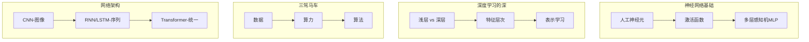
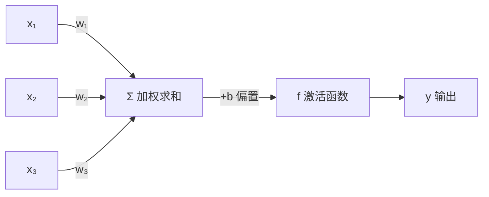
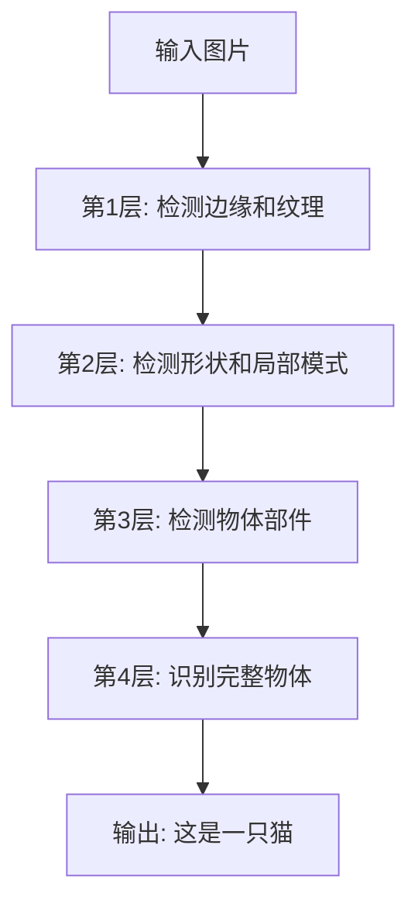
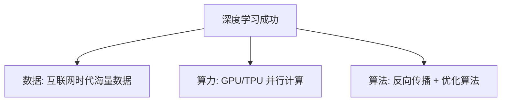
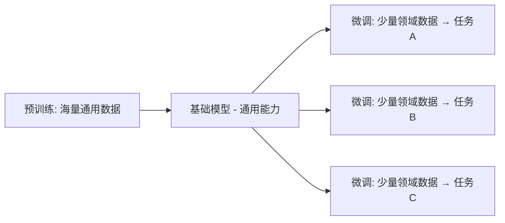
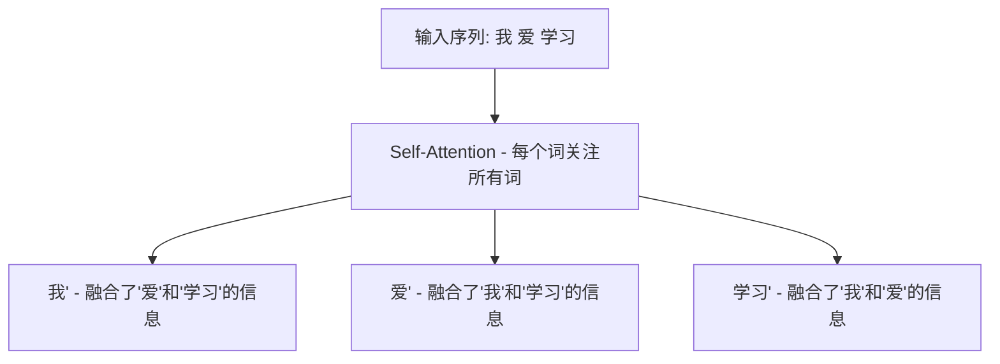

# 第3章 · 深度学习直觉建立

> **时长**：约 2.5 小时 ｜ **难度**：⭐⭐ ｜ **类型**：概念理解
>
> **目标**：理解神经网络原理，建立深度学习直觉，认识主要网络架构

---

## 学习目标

学完本章后，你将能够：
- 解释从生物神经元到人工神经元的映射
- 理解激活函数的作用（为什么需要非线性）
- 描述深度网络如何学习层次化的特征表示
- 区分 CNN、RNN/LSTM、Transformer 的适用场景
- 理解"预训练 + 微调"范式的价值

---

## 知识地图



---

## 1、神经网络基础

### 1.1 从生物神经元到人工神经元

**概念定义**：人工神经元模拟生物神经元的工作方式——接收多个输入信号，加权求和后通过激活函数进行非线性变换，产生输出。数学表达为 `y = f(W·X + b)`。



```python
# 单个神经元的计算
def 神经元(输入, 权重, 偏置):
    加权和 = sum(x * w for x, w in zip(输入, 权重)) + 偏置
    输出 = 激活函数(加权和)
    return 输出
```

### 1.2 激活函数 — 引入非线性

**概念定义**：激活函数为神经网络引入非线性变换能力。没有激活函数，多层网络等价于单层（线性变换的组合仍是线性），深度就失去了意义。

**核心定位**：ReLU (`f(x)=max(0,x)`) 是现代网络最常用的激活函数——计算简单、缓解梯度消失，是深度学习成功的隐性功臣。

| 函数 | 公式 | 特点 |
|------|------|------|
| Sigmoid | 1/(1+e⁻ˣ) | 输出 0~1，用于概率 |
| ReLU | max(0, x) | 计算简单，现代网络首选 |

### 1.3 多层感知机（MLP）

**概念定义**：MLP 由输入层、隐藏层、输出层组成，每层神经元与下一层全连接。信息从输入逐层向前传播，最终产生预测。

---

## 2、深度学习的"深"

### 2.1 浅层 vs 深层

**概念定义**：深度学习的"深"指网络层数多（数十到数百层）。深层网络能学习层次化的特征表示——从低级模式（边缘、纹理）逐步组合为高级概念（物体、场景）。

### 2.2 特征层次



### 2.3 表示学习

**概念定义**：表示学习是深度学习的核心能力——自动从原始数据中学习有效的特征表示，无需人工设计特征。这取代了传统机器学习的"特征工程"环节。

**核心定位**：传统方法需要领域专家手工设计特征（如 SIFT、HOG），深度学习的端到端学习让模型同时学习特征和决策，大幅降低了应用门槛。

---

## 3、为什么深度学习能工作

### 3.1 三驾马车



| 时代 | 数据量 | 效果 |
|------|--------|------|
| 2000 年前 | MB 级 | 简单任务 |
| 2010 年代 | GB 级 | 图像分类突破 |
| 2020 年代 | TB-PB 级 | 大语言模型涌现 |

### 3.2 预训练 + 微调范式

**概念定义**：预训练 + 微调是当前 AI 开发的主流范式——先在大规模通用数据上预训练（学习通用能力），再在少量领域数据上微调（适配具体任务）。

**核心定位**：这个范式解决了"每个任务都需要大量标注数据"的瓶颈——预训练模型已经学会基础能力，微调只需少量样本即可适配新任务。



---

## 4、主要网络架构一览

### 4.1 CNN — 图像处理之王

**概念定义**：CNN（卷积神经网络）通过卷积核在图像上滑动检测局部特征，配合池化层降维。核心特点是局部连接、权重共享、平移不变性。

**核心定位**：CNN 通过"卷积 → 池化 → 卷积 → 池化 → 全连接"的层级结构，逐步从边缘检测到物体识别，是图像领域的标准架构。

### 4.2 RNN/LSTM — 序列数据处理

**概念定义**：RNN（循环神经网络）通过隐藏状态在时间步之间传递信息，天然适合处理序列数据。LSTM 通过门控机制解决 RNN 长距离依赖难以学习的问题。

**核心定位**：RNN 必须顺序处理（无法并行），且长距离依赖时梯度消失。这两个短板直接导致了 Transformer 的崛起。

### 4.3 Transformer — 统一各领域

**概念定义**：Transformer 完全基于 Self-Attention 机制，抛弃了 RNN 的循环结构。每个位置都能直接关注序列中所有其他位置，实现了真正的并行计算和长距离依赖建模。

**核心定位**：Transformer 是 2017 年以来最重要的架构突破——它不仅统治了 NLP，还扩展到 CV（ViT）、多模态等领域，成为现代大模型的统一基础架构。



### 架构选型速查

| 数据类型 | 推荐架构 | 示例应用 |
|---------|---------|---------|
| 图像 | CNN / ViT | 图像分类、目标检测 |
| 序列（短） | RNN/LSTM | 情感分析、时序预测 |
| 文本（长） | Transformer | 语言模型、翻译 |
| 多模态 | Transformer | GPT-4o、Gemini |

---

## 常见踩坑

1. **认为层数越多越好**：层数增加可能带来梯度消失、过拟合、训练成本激增。先从小网络开始，验证数据量足够后再逐步加深。
2. **忽略激活函数的选择**：隐藏层用 Sigmoid 容易导致梯度消失，默认用 ReLU。输出层根据任务选择——二分类用 Sigmoid，多分类用 Softmax，回归不用激活。
3. **不理解归一化的必要性**：不同特征的数值范围差异巨大（如年龄 0-100、收入 0-100000），不做归一化会导致梯度下降震荡甚至不收敛。
4. **混淆 CNN/RNN/Transformer 的适用场景**：图像任务用 RNN、长文本用 CNN 都会事倍功半。选对架构比调参更重要。

---

## 课后练习

1. 手算一个简单神经元的输出：输入 [2, 3]，权重 [0.5, -0.2]，偏置 0.1，激活函数为 ReLU
2. 找一张图片，思考 CNN 的底层、中层、高层分别能检测到什么特征，写出你的推断
3. 用一个预训练模型（如 ResNet）对你自己的图片进行分类，观察预测结果和置信度
4. 对比 RNN 和 Transformer 在处理"100 个词的句子"时的效率差异，从并行性和长距离依赖两个角度分析

---

## 本章小结

- ✅ 神经元 = 加权求和 + 激活函数，多层组成 MLP
- ✅ 深度网络通过层次化特征学习：边缘 → 形状 → 部件 → 物体
- ✅ 深度学习成功三要素：数据 + 算力 + 算法
- ✅ CNN 处理图像，RNN 处理序列，Transformer 统一各领域

---

> **下一章**：第4章 · 自然语言处理演进 — 从词袋模型到BERT与GPT
