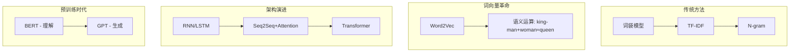
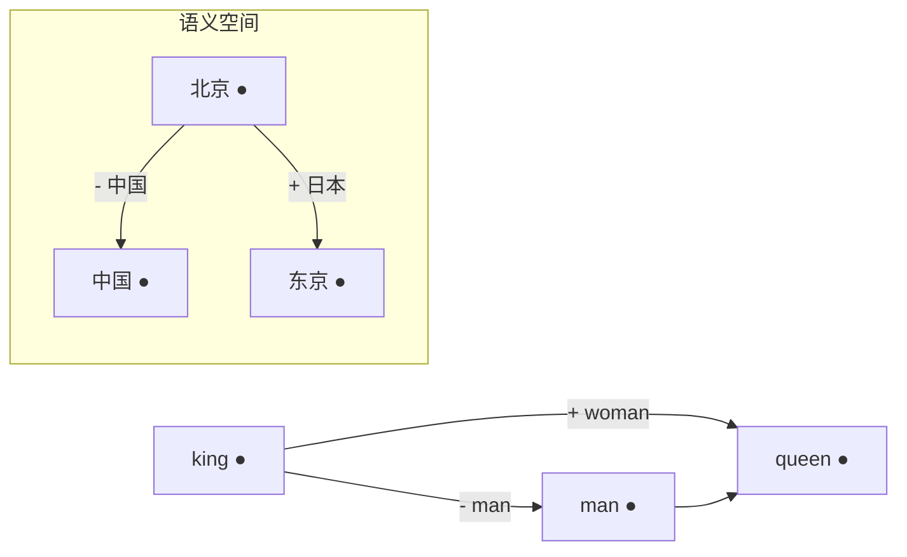
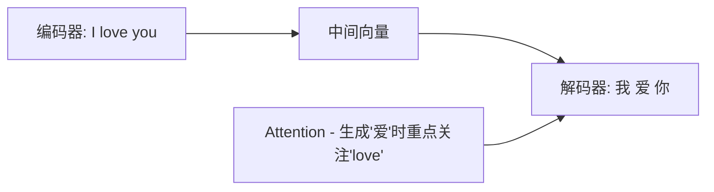
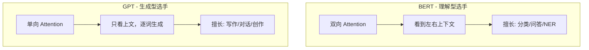

# 第4章 · 自然语言处理演进

> **时长**：约 2.5 小时 ｜ **难度**：⭐⭐ ｜ **类型**：概念理解
>
> **目标**：了解 NLP 发展历程，理解从词袋模型到 Transformer 的技术演进

---

## 学习目标

学完本章后，你将能够：
- 描述 NLP 的核心任务和主要难点
- 解释词向量（Word2Vec）的原理和语义运算
- 对比传统 NLP 方法与现代深度学习方法
- 理解从 RNN → Seq2Seq+Attention → Transformer 的演进逻辑
- 区分 BERT（理解型）和 GPT（生成型）的设计差异

---

## 知识地图

---

## 1、NLP 任务概览

**概念定义**：NLP（Natural Language Processing）是让计算机理解和生成人类语言的技术。核心难点在于语言的歧义性、上下文依赖和常识推理需求。

### 核心任务

| 任务 | 说明 | 示例 |
|------|------|------|
| **文本分类** | 判断文本类别 | 垃圾邮件识别、情感分析 |
| **命名实体识别 (NER)** | 识别人名、地名等 | "马云在杭州" → 马云(人名), 杭州(地名) |
| **机器翻译** | 语言转换 | 英文 → 中文 |
| **问答系统** | 回答问题 | "中国首都是？" → "北京" |
| **文本生成** | 生成文本 | 写作、对话 |

### 为什么 NLP 很难

**核心定位**：NLP 的三大挑战——歧义（"我看到了他用望远镜"有两种含义）、上下文依赖（"苹果"在"很好吃"和"发布会"中含义不同）、常识推理（人类默认的背景知识计算机完全不具备）。

---

## 2、传统 NLP 方法

### 2.1 词袋模型（Bag of Words）

**概念定义**：词袋模型将文本看作词的集合，完全忽略词序。核心问题："狗咬人"和"人咬狗"在词袋中表示完全相同——这显然与语义不符。

### 2.2 TF-IDF

**概念定义**：TF-IDF 用词频（TF）× 逆文档频率（IDF）来衡量词的重要性。高频但无区分度的词（如"的"、"是"）得分低，出现少但有区分度的词得分高。

**核心定位**：TF-IDF 解决了"每个词同等重要"的问题，但仍无法捕捉语义相似性——"狗"和"犬"被当作完全不同的词。

### 2.3 传统方法的局限

| 问题 | 说明 |
|------|------|
| **稀疏性** | 词表巨大，大多数组合未见过 |
| **无语义** | "狗"和"犬"被当作完全不同的词 |
| **无上下文** | 同一个词在不同语境中含义不同 |

---

## 3、词向量革命

### 3.1 Word2Vec — 词的分布式表示

**概念定义**：Word2Vec 的核心思想是"一个词的含义由它的上下文决定"——将词映射为稠密的数值向量，语义相近的词向量距离也近。

**核心定位**：词向量是 NLP 从"符号主义"到"连续表示"的范式转换——每个词不再是孤立的符号，而是语义空间中的一个点。

### 3.2 词向量的魔力

**概念定义**：词向量支持语义运算——`king - man + woman ≈ queen`。这表明向量空间编码了词之间的语义关系，而非仅仅是表面形式。

### 3.3 静态词向量的局限

**概念定义**：静态词向量（如 Word2Vec）给每个词分配唯一的向量，无法处理一词多义——"苹果"在"很好吃"和"发布会"中被映射到同一个向量。这催生了后来的动态词表示（ELMo、BERT）。

---

## 4、从 RNN 到 Transformer

### 4.1 RNN/LSTM — 处理序列

**概念定义**：RNN 通过隐藏状态在时间步之间传递信息，每一步都"记住"了之前的内容。LSTM 用门控机制（输入门、遗忘门、输出门）解决了 RNN 的梯度消失问题。

**核心定位**：RNN 的两大致命短板——必须顺序处理（无法并行，训练慢）和长距离依赖困难（梯度消失/爆炸）——直接成为 Transformer 要解决的核心问题。

### 4.2 Seq2Seq + Attention

**概念定义**：Seq2Seq 模型用编码器将输入序列压缩为固定向量，解码器再从中生成输出序列。Attention 机制让解码器在生成每个词时"关注"编码器不同位置的输出，解决了信息瓶颈问题。

### 4.3 Transformer 诞生

**概念定义**：2017 年 Google 论文 "Attention Is All You Need" 提出了完全基于 Self-Attention 的 Transformer 架构，抛弃了 RNN 的循环结构。

**核心定位**：Transformer 的三大优势——并行计算（所有位置同时处理）、长距离依赖（任意两个位置直接交互）、可扩展（参数量越大效果越好）——使其成为现代大模型的统一基础架构。

| 对比维度 | RNN | Transformer |
|---------|-----|-------------|
| 计算方式 | 必须顺序处理 | 完全并行 |
| 长距离依赖 | 梯度消失/爆炸 | 直接建模任意距离 |
| 训练速度 | 慢 | 快 |
| 扩展性 | 受限 | 参数量越大越好 |

---

## 5、预训练语言模型时代

### 5.1 BERT — 双向理解

**概念定义**：BERT 通过"掩码语言模型"预训练——随机遮住输入中的词，让模型根据上下文双向预测被遮住的词。这让 BERT 获得了深度的语言理解能力。

**核心定位**：BERT 是"理解型选手"，擅长分类、NER、问答等理解任务，但无法做文本生成（因为它是双向的，不是自回归的）。

### 5.2 GPT — 生成式预训练

**概念定义**：GPT 通过"自回归语言模型"预训练——根据前面的词预测下一个词，单向、从左到右。这让 GPT 天然适合文本生成任务。

**核心定位**：GPT 是"生成型选手"，擅长写作、对话、代码生成等创作任务。ChatGPT 的惊人能力证明了：把生成式预训练做到极致，理解能力也会涌现出来。

### 5.3 BERT vs GPT

### 5.4 关键里程碑

| 时间 | 事件 | 意义 |
|------|------|------|
| 2018 | BERT 发布 | 预训练革命，理解任务 SOTA |
| 2019 | GPT-2 | 规模扩大，零样本能力初现 |
| 2020 | GPT-3（175B） | 涌现能力，Few-shot 学习 |
| 2022 | ChatGPT | RLHF 对齐，AI 走向大众 |
| 2023 | GPT-4 | 多模态，推理增强 |

---

## 常见踩坑

1. **认为 BERT 已被 GPT 淘汰**：BERT 在分类、NER、语义匹配等理解任务上仍然高效且成本低。不是所有场景都需要 GPT，选择匹配任务类型的模型。
2. **混淆词向量和上下文向量**：静态词向量（Word2Vec）一词一向量，无法区分多义。现代 LLM 用动态上下文向量，同一个词在不同上下文中的表示是不同的。
3. **忽视分词的影响**：不同语言的分词策略差异大，中英文混用场景分词不当会严重影响模型效果。注意选择与模型匹配的 tokenizer。
4. **低估传统方法的价值**：对于小规模、高精度的文本匹配任务，TF-IDF + 余弦相似度可能比 LLM 方案更快、更准、更省成本。

---

## 课后练习

1. 找一个 NLP 应用（如搜索引擎、智能音箱、翻译软件），分析它可能涉及了哪些 NLP 核心任务
2. 用 Word2Vec 或在线词向量工具探索语义运算：找一个"king - man + woman"式的中文例子
3. 找两个包含"苹果"的句子（一个指水果，一个指公司），思考为什么静态词向量无法区分而 BERT 可以
4. 整理一个时序图：从 Word2Vec（2013）到 GPT-4（2023），标注每个关键节点解决了什么问题

---

## 本章小结

- ✅ NLP 让计算机理解和生成人类语言，核心挑战是歧义和上下文
- ✅ 词向量让词有了语义表示：`king - man + woman ≈ queen`
- ✅ Transformer 通过 Self-Attention 解决了 RNN 的两大短板
- ✅ BERT 擅长理解，GPT 擅长生成，现代 LLM 融合了两者

---

## 模块2总结

完成本模块学习后，你已经：

1. **建立全局视野** — 理解 AI 发展历程和技术栈四层结构
2. **掌握核心概念** — 机器学习三大范式、训练流程、评估方法
3. **理解深度学习** — 神经网络原理、特征学习、三大网络架构
4. **了解 NLP 演进** — 从词袋模型到 Transformer 的技术发展脉络

---

> **下一步**：模块3 · 大模型原理与架构 — 深入理解 Transformer 和 GPT
