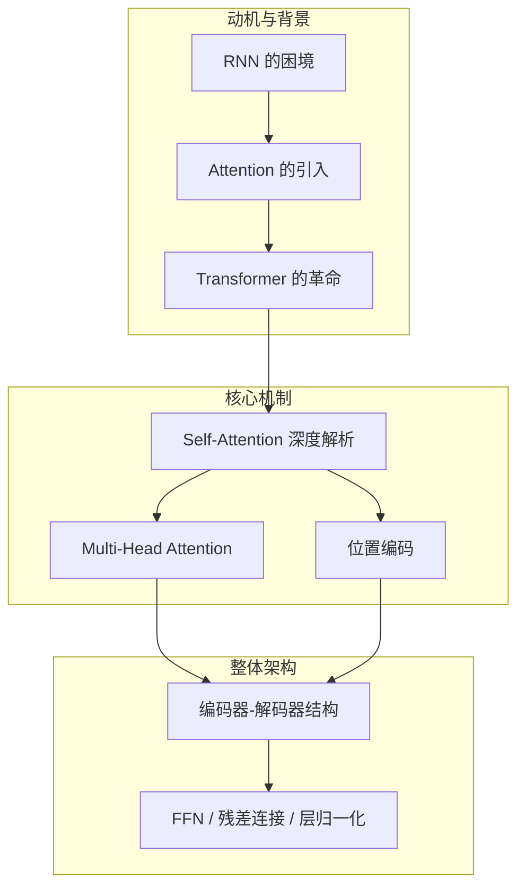
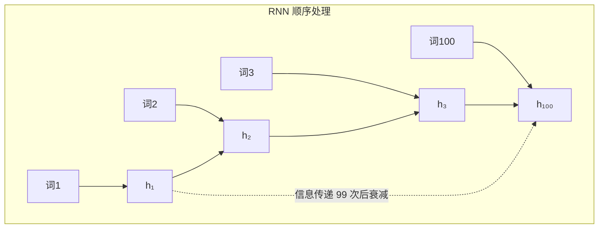
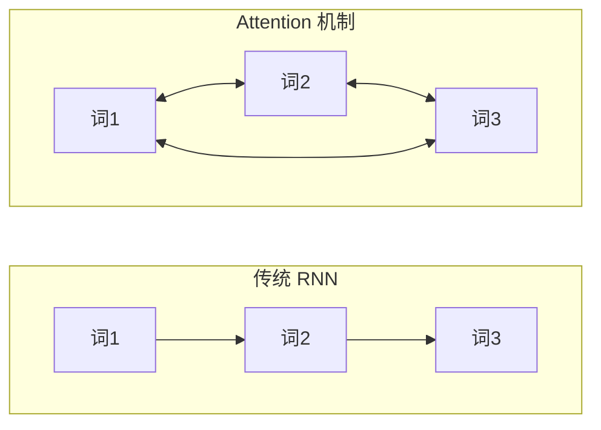
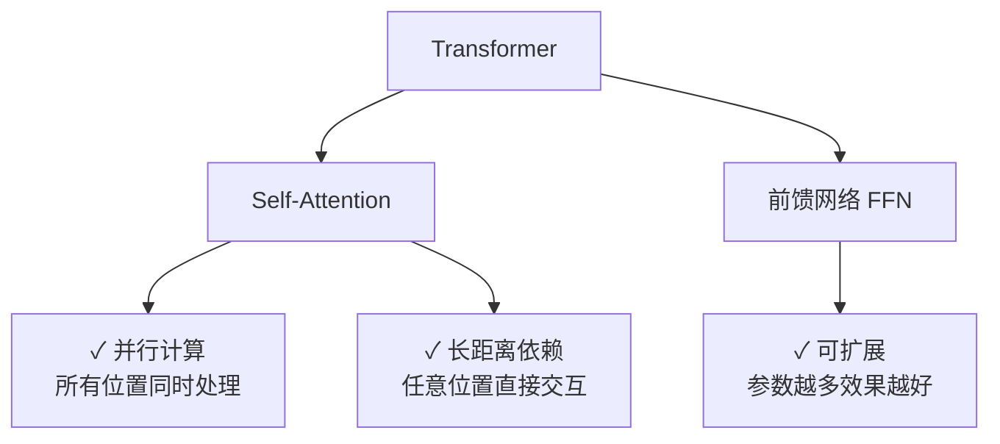
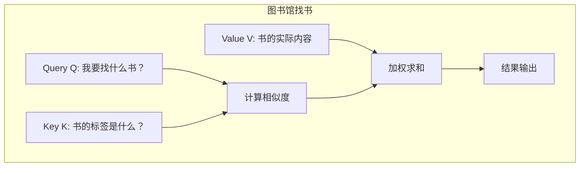
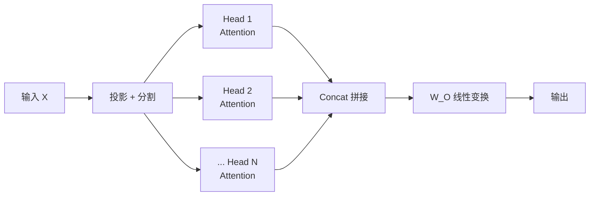
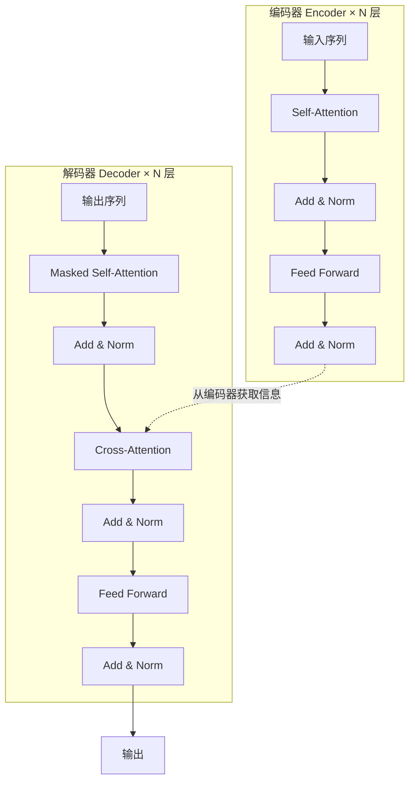

# 第1章 · Transformer 架构详解

> **时长**：约 3 小时 ｜ **难度**：⭐⭐⭐ ｜ **类型**：原理理解
>
> **目标**：深入理解 Self-Attention 和 Transformer 架构

---

## 学习目标

学完本章后，你将能够：
- 理解为什么 Transformer 取代了 RNN 成为主流序列模型架构
- 掌握 Self-Attention 的 QKV 计算流程与数学原理
- 理解 Multi-Head Attention 的设计动机和工作方式
- 解释位置编码为什么必要以及不同实现方案的差异
- 梳理 Transformer 编码器-解码器的完整结构及各组件作用
- 具备阅读和理解现代大模型架构论文所需的基础知识

---

## 知识地图



---

## 1、为什么需要 Transformer

### 1.1 RNN 的困境

在 Transformer 出现之前，RNN（循环神经网络）是处理序列数据（文本、语音、时间序列）的主流方案。但 RNN 有两个根本性的缺陷。



**问题1：长距离依赖** — 词100 想"记住"词1 的信息，需要经过 99 次传递。信息在传递中逐渐丢失（梯度消失），模型难以捕获长期依赖。

**问题2：无法并行** — RNN 必须等前一个词处理完才能处理下一个词，训练速度受序列长度限制，无法利用 GPU 并行计算。

### 1.2 Attention 的引入

> **核心思想：直接关注重要的部分，而不是顺序传递**



传统 RNN 信息沿着序列逐级传递，而 Attention 机制让任意两个位置直接交互，不受距离限制。这一思想来源于机器翻译中的"对齐"概念——生成目标语言某个词时，只关注源语言中相关的词。

### 1.3 Transformer 的革命

**概念定义**：Transformer 是 2017 年 Google 在论文《Attention Is All You Need》中提出的架构，完全基于 Attention 机制，彻底抛弃了 RNN 的循环结构。

**核心定位**：Transformer = Self-Attention + 前馈网络 + 残差连接 + 层归一化。它是现代所有大语言模型（GPT、BERT、LLaMA、Qwen 等）的奠基性架构。



---

## 2、Self-Attention 机制深度解析

### 2.1 直觉理解

**概念定义**：Self-Attention（自注意力）是一种让序列中每个位置都能关注所有其他位置，并自动学习各位置之间相关权重的机制。

**场景：理解句子 "小明把书还给了图书馆"**

处理"还"这个词时，模型需要知道：
- "小明" — 谁在还？
- "书" — 还什么？
- "图书馆" — 还给谁？

Self-Attention 让每个词都能"看到"其他所有词，并自动学习该关注哪些词、关注程度多大。

### 2.2 Query、Key、Value

**核心定位**：QKV 是 Self-Attention 的三个核心要素，类比图书馆找书系统。



| 角色 | 类比 | 数学含义 |
|------|------|---------|
| Query (Q) | 读者查找的关键词 | 当前词发出的"查询"向量 |
| Key (K) | 每本书的标签 | 其他词提供的"索引"向量 |
| Value (V) | 书的实际内容 | 其他词的"实际信息"向量 |

流程：用 Query 和所有 Key 计算相似度 → 相似度高的 Key 对应的 Value 权重大 → 加权求和得到最终结果。

### 2.3 计算流程

**核心定位**：Self-Attention 的计算可分解为 5 个步骤，每一步都有明确的数学含义。

```
输入: X (序列中每个词的向量)

Step 1: 生成 Q, K, V
  Q = X × W_Q    (查询)
  K = X × W_K    (键)
  V = X × W_V    (值)

Step 2: 计算注意力分数
  Score = Q × K^T    (点积衡量相似度)

Step 3: 缩放
  Score = Score / √d_k    (d_k 是维度，防止数值过大)

Step 4: Softmax 归一化
  Attention = softmax(Score)    (转换为概率分布)

Step 5: 加权求和
  Output = Attention × V    (用注意力权重加权 Value)
```

### 2.4 注意力权重可视化

输入 "我 爱 北京"，模型计算的注意力权重矩阵示意（每行表示当前词对其他词的关注程度）：

| 当前词 | 我 | 爱 | 北京 | 关注重点 |
|-------|------|------|------|---------|
| **我** | 0.5 | 0.2 | 0.3 | 最关注自身 |
| **爱** | 0.3 | 0.3 | 0.4 | 对"北京"关注稍高 |
| **北京** | 0.2 | 0.3 | 0.5 | 最关注自身 |

权重值越高，表示该位置对对应位置的"关注"越强。通过分析这些权重矩阵，我们可以理解模型在做决策时关注了哪些信息。

### 2.5 为什么要除以 √d_k

**概念定义**：缩放因子 √d_k 用于防止点积结果随维度增大而过大，避免 softmax 进入饱和区导致梯度消失。

```
问题：点积的值会随维度增大而增大

  d_k = 64 时，点积均值 ≈ 64
  d_k = 512 时，点积均值 ≈ 512

  大值 → softmax 饱和 → 梯度消失

解决：除以 √d_k 让分布稳定，梯度正常传播
```

---

## 3、Multi-Head Attention

### 3.1 为什么需要多头

**概念定义**：Multi-Head Attention（多头注意力）是并行运行多个 Self-Attention，每个头学习不同的关注模式，然后将结果拼接融合。

```
单头 Attention：只能学习一种关注模式

多头 Attention：同时学习多种关注模式
  - 头1：关注语法关系（主谓宾）
  - 头2：关注语义关系（同义词、反义词）
  - 头3：关注指代关系（代词指向哪个名词）
  - 头4：关注位置关系（相邻词、远距离词）
  - ...
```

### 3.2 计算方式



每个头拥有独立的 W_Q, W_K, W_V 投影矩阵，最后将所有头的输出拼接并做线性变换。

### 3.3 代码示意

```python
class MultiHeadAttention:
    def __init__(self, d_model, num_heads):
        self.num_heads = num_heads
        self.d_k = d_model // num_heads
        
        # 每个头的投影矩阵
        self.W_Q = Linear(d_model, d_model)
        self.W_K = Linear(d_model, d_model)
        self.W_V = Linear(d_model, d_model)
        self.W_O = Linear(d_model, d_model)
    
    def forward(self, Q, K, V):
        # 1. 线性投影
        Q = self.W_Q(Q)  # [batch, seq, d_model]
        K = self.W_K(K)
        V = self.W_V(V)
        
        # 2. 分割成多头
        Q = split_heads(Q, self.num_heads)  # [batch, heads, seq, d_k]
        K = split_heads(K, self.num_heads)
        V = split_heads(V, self.num_heads)
        
        # 3. 计算注意力
        attn = scaled_dot_product_attention(Q, K, V)
        
        # 4. 拼接并输出
        output = concat_heads(attn)
        return self.W_O(output)
```

**注意**：d_model 必须能被 num_heads 整除，每个头的维度 d_k = d_model / num_heads。

---

## 4、位置编码

### 4.1 为什么需要位置信息

**概念定义**：位置编码（Position Encoding）是为 Self-Attention 注入序列顺序信息的技术。

```
Self-Attention 的问题：对顺序不敏感（置换不变性）

"我 爱 你" 和 "你 爱 我" 
在纯 Attention 看来，词与词之间的关系一样（只是位置标签不同）
但这两句话含义完全不同！

→ 需要额外注入位置信息来区分不同顺序
```

### 4.2 正弦余弦位置编码（原始方案）

```python
PE(pos, 2i)   = sin(pos / 10000^(2i/d_model))
PE(pos, 2i+1) = cos(pos / 10000^(2i/d_model))

pos: 位置索引 (0, 1, 2, ...)
i:   维度索引
d_model: 模型维度

特点：
- 不同位置有唯一的编码模式
- 可以泛化到训练时未见过的更长序列
- 相对位置信息可以通过线性变换获得
```

### 4.3 RoPE（旋转位置编码）

**现代大模型的主流方案**

**核心定位**：RoPE（Rotary Position Embedding，旋转位置编码）通过旋转变换将位置信息融入 Attention 计算，比正弦余弦方案有更好的长序列泛化能力。

```
优势：
- 更好的长序列泛化能力
- 相对位置信息的表达更自然
- 被 LLaMA、Qwen、GPT-4 等主流模型广泛采用
```

---

## 5、Transformer 完整架构

### 5.1 编码器-解码器结构



### 5.2 关键组件

| 组件 | 作用 |
|------|------|
| **Self-Attention** | 捕获序列内部各位置之间的关系 |
| **Masked Self-Attention** | 解码器中每个位置只能看到之前的词，防止信息泄露 |
| **Cross-Attention** | 解码器关注编码器的输出，实现编码信息到解码的传递 |
| **FFN（前馈网络）** | 非线性变换，增加模型的表达能力 |
| **Add & Norm** | 残差连接 + 层归一化，稳定深层网络训练 |

### 5.3 前馈网络（FFN）

```python
FFN(x) = ReLU(x × W1 + b1) × W2 + b2

# 通常 W1 将维度放大 4 倍，W2 再缩回来
# d_model=512 → d_ff=2048 → d_model=512
```

每一层 Self-Attention 之后都跟一个 FFN，对每个位置独立做非线性变换，增强模型的表达能力。

### 5.4 残差连接与层归一化

**概念定义**：残差连接（Residual Connection）让输入直接绕过子层加到输出上；层归一化（Layer Normalization）对每个样本独立做均值和方差归一化，稳定训练。

```
残差连接：Output = LayerNorm(x + SubLayer(x))

作用：
- 残差连接：让梯度直接穿过深层网络，避免梯度消失
- 层归一化：稳定每层输出分布，加速收敛
```

---

## 常见踩坑

1. **注意力分数未缩放**：实现 Self-Attention 时忘记除以 √d_k，导致 softmax 在维度较大时饱和，梯度消失无法训练
2. **d_model 与 num_heads 不匹配**：d_model 必须能被 num_heads 整除，否则无法将特征均匀分割给每个注意力头
3. **解码器 Mask 遗漏**：在解码器的 Self-Attention 中未使用因果掩码（causal mask），导致模型"偷看"到未来的词
4. **混淆编码器与解码器**：原始 Transformer 是编码器-解码器结构，但 GPT 系列只用解码器（Decoder-Only），BERT 只用编码器（Encoder-Only），不同架构适用于不同任务
5. **位置编码的作用范围误解**：正弦余弦编码在训练长度外可能泛化不佳，RoPE 虽好但不同模型的实现细节有差异，不能一概而论

---

## 课后练习

1. 使用 NumPy 手动实现单头 Self-Attention 的完整前向传播（包含 QKV 投影、注意力分数计算、缩放、Softmax、加权求和）
2. 用 PyTorch 实现一个 Multi-Head Attention 层，分别用 1 头和 8 头处理同一输入，观察注意力权重矩阵的差异
3. 从 Hugging Face 加载一个小型 Transformer 模型（如 distilbert），可视化某层的注意力权重矩阵，分析不同注意力头关注了什么
4. 编写代码对比 Transformer（并行计算）和 RNN（串行计算）在处理同样长度序列时的训练速度差异

---

## 本章小结

- ✅ Self-Attention 通过 Q、K、V 三元组让每个位置关注所有其他位置，从根本上解决了长距离依赖问题
- ✅ Multi-Head Attention 并行运行多个 Self-Attention，同时学习不同类型的关系模式
- ✅ 位置编码为 Attention 注入顺序信息，解决了置换不变性问题
- ✅ Transformer = Self-Attention + FFN + 残差连接 + 层归一化，各组件缺一不可
- ✅ 编码器-解码器是原始设计，现代大模型根据任务需求选择 Decoder-Only 或 Encoder-Only 变体

---

> **下一章**：第2章 · GPT 系列模型演进——从 GPT-1 到 GPT-4，预训练范式到多模态的进化之路
