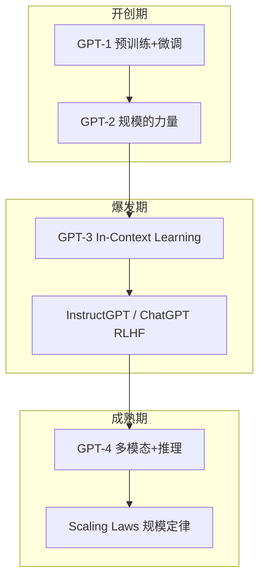
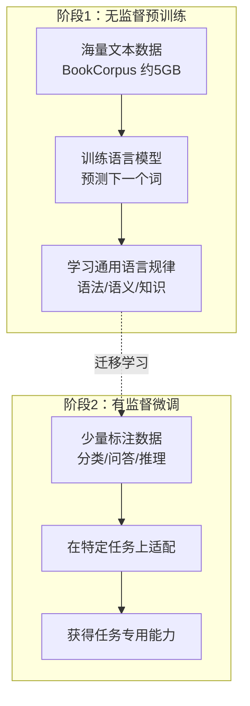
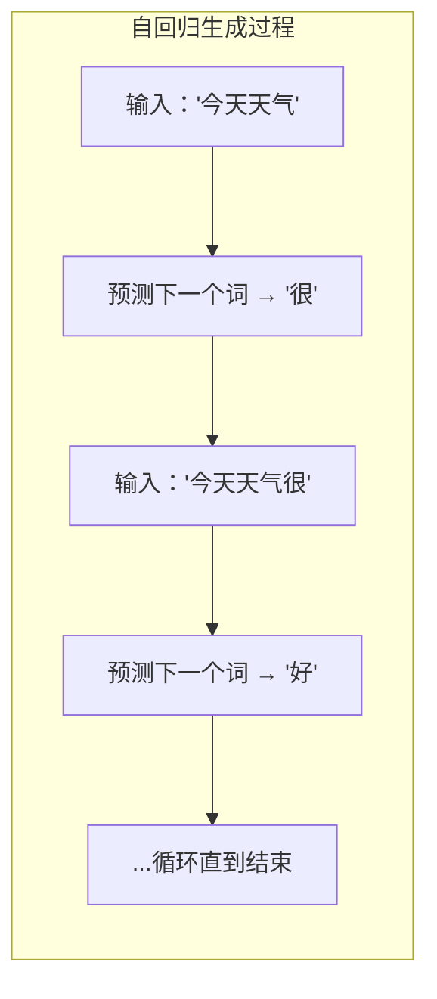
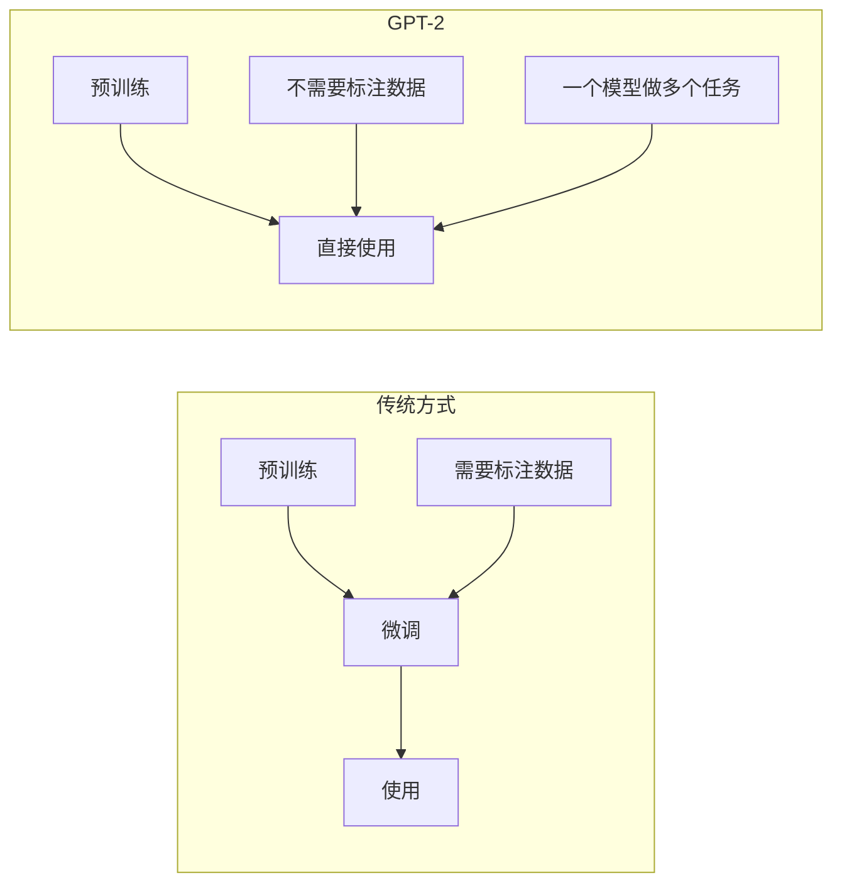
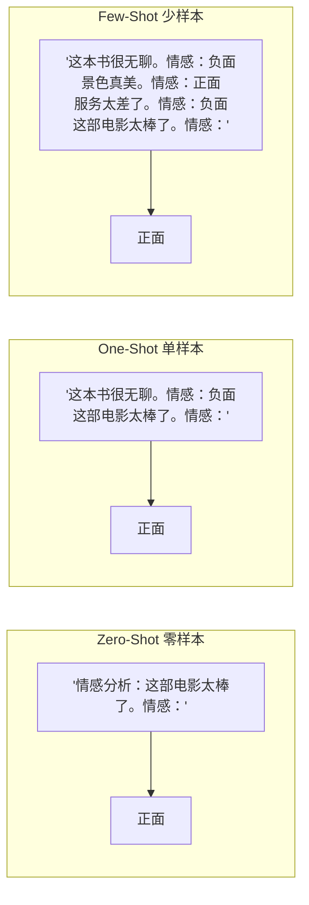
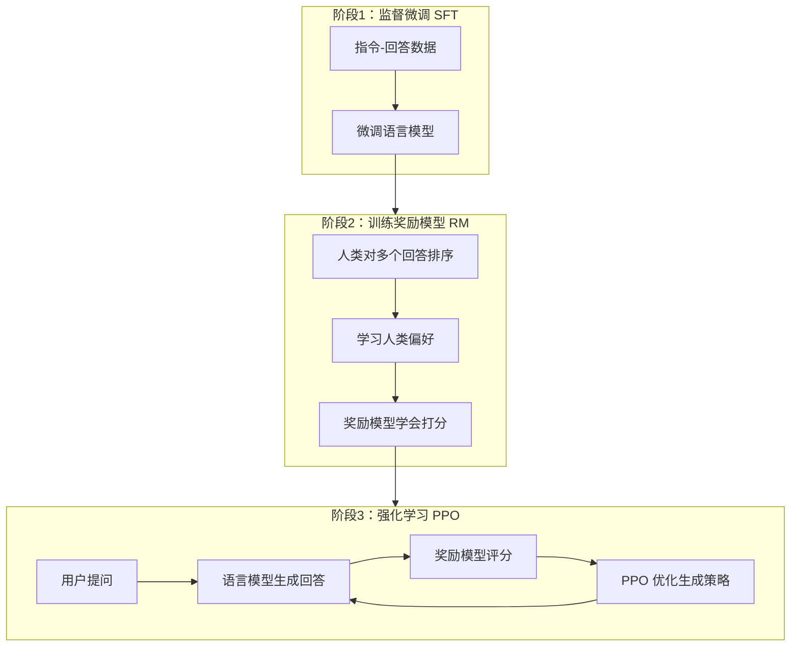
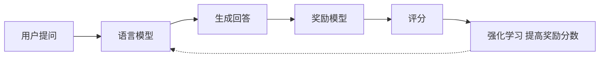
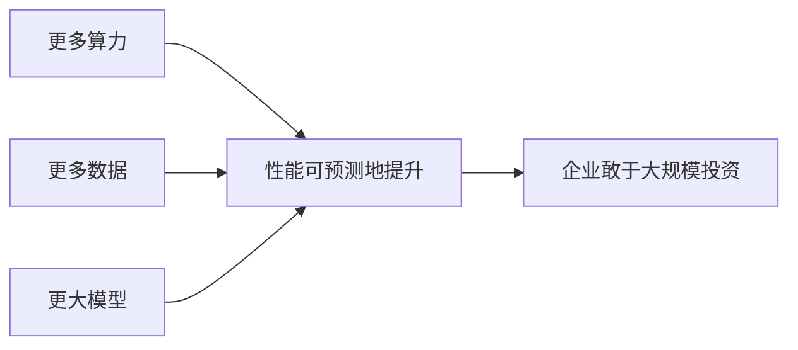

# 第2章 · GPT 系列模型演进

> **时长**：约 2.5 小时 ｜ **难度**：⭐⭐⭐ ｜ **类型**：原理理解
>
> **目标**：理解 GPT 家族的发展历程和技术突破

---

## 学习目标

学完本章后，你将能够：
- 理解 GPT-1 "预训练 + 微调"范式的开创性意义
- 掌握 GPT-2 规模扩展带来 Zero-Shot 能力的发现
- 解释 GPT-3 的 In-Context Learning 及其工作原理
- 理解 RLHF 如何让模型从"生成文本"进化为"遵循指令"
- 了解 GPT-4 的多模态能力和推理增强
- 掌握 Scaling Laws 对大模型发展的指导意义

---

## 知识地图



---

## 1、GPT-1：预训练 + 微调范式的开创

### 1.1 核心创新

**概念定义**：GPT-1（2018 年，OpenAI）开创了"无监督预训练 + 有监督微调"的两阶段训练范式，极大降低了对标注数据的依赖。



### 1.2 Decoder-Only 架构

**核心定位**：GPT 选择 Decoder-Only（仅解码器）架构而非 BERT 的 Encoder-Only，根本原因在于 GPT 的目标是"生成"而非"理解"。

| 维度 | Encoder（BERT 风格） | Decoder（GPT 风格） |
|------|---------------------|-------------------|
| 注意力方式 | 双向注意力 | 单向注意力（只看左侧） |
| 擅长任务 | 理解、分类、完形填空 | 生成、续写、创作 |
| 训练目标 | 掩码语言模型（MLM） | 自回归语言模型 |



每次只预测一个词，将预测结果追加到输入中继续预测，循环直到生成结束标记或达到最大长度。

### 1.3 参数规模

| 指标 | GPT-1 |
|------|-------|
| 参数量 | 1.17亿 (117M) |
| 层数 | 12 |
| 隐藏维度 | 768 |
| 注意力头 | 12 |

---

## 2、GPT-2：规模的力量

### 2.1 关键升级

**概念定义**：GPT-2（2019 年）将参数量从 117M 扩大到 1.5B（13 倍），发现规模扩大带来了质变——不微调也能做下游任务（Zero-Shot）。

```
GPT-2 (2019年)

参数量: 117M → 1.5B (扩大 13 倍)

发现：规模扩大带来质变
  - 不微调也能做下游任务（Zero-Shot）
  - 生成的文本更加连贯
  - 出现了"理解"的迹象
```

### 2.2 Zero-Shot 能力涌现



示例：
```
输入: "Translate English to French: Hello →"
GPT-2: "Bonjour"

没有见过翻译训练数据，却能翻译！
```

### 2.3 WebText 数据集

```
数据来源：Reddit 高赞链接的网页内容
数据量：约 40GB
特点：
  - 质量高（经过社区筛选）
  - 多样性好（各种话题）
  - 排除了恶意内容
```

### 2.4 "太危险而不敢发布"

```
OpenAI 的顾虑：
  - 生成的假新闻可能被滥用
  - 钓鱼邮件、虚假评论
  - 冒充他人写作

最终分阶段发布：小模型 → 中模型 → 大模型 → 完整版
```

GPT-2 的发布策略引发了 AI 安全领域的重要讨论，也开启了关于"负责任的发布"的持续 debate。

---

## 3、GPT-3：In-Context Learning 的发现

### 3.1 参数量跃升

**概念定义**：GPT-3（2020 年）参数量达到 1750 亿（175B），比 GPT-2 大 100 倍以上，是当时规模最大的语言模型。

| 模型 | 参数量 | 相对大小 |
|------|--------|---------|
| GPT-1 | 117M | ▪ |
| GPT-2 | 1.5B | ▪▪▪▪▪▪▪▪▪▪▪▪▪ |
| GPT-3 | 175B | ▪▪▪▪▪▪▪▪▪▪ 的 100 倍以上 |

### 3.2 Few-Shot Learning：无需微调

**概念定义**：GPT-3 最重要的发现是 In-Context Learning（上下文学习）——在不更新模型参数的前提下，仅通过 Prompt 中的示例就能让模型学习新任务。



给几个示例，模型就能学会！无需标注数据、无需额外训练、无需更新参数。

### 3.3 涌现能力


**核心定位**：在 GPT-3 之前，人们认为"更大的模型只是更流畅"。GPT-3 证明，规模足够大时，模型会涌现出质的飞跃——小模型做不了的任务，大模型突然就能做了。

### 3.4 Prompt 成为新的编程方式

```
传统编程: 写代码告诉计算机怎么做
Prompt:  用自然语言告诉模型要做什么

示例：
Prompt: "你是一个Python专家。请写一个函数计算斐波那契数列。"
GPT-3 输出: 完整的代码

改变了人机交互的方式
```

---

## 4、InstructGPT 与 ChatGPT：RLHF 的突破

### 4.1 问题：GPT-3 并不"听话"

```
GPT-3 的问题：
  - 不遵循指令（答非所问）
  - 生成有害内容
  - 编造虚假信息
  - 不符合人类期望

原因：预训练目标是"预测下一个词"
     不是"给出有帮助的回答"
```

### 4.2 指令微调（Instruction Tuning）

**概念定义**：指令微调（Instruction Tuning）是使用人工标注的"指令-回答"数据对模型进行有监督微调，让模型学会遵循指令。

```
第一步：收集指令-回答数据

人类标注员编写：
  指令: "解释什么是机器学习"
  回答: "机器学习是一种让计算机从数据中学习的技术..."

用这些数据微调模型，让它学会"遵循指令"
```

### 4.3 RLHF：人类反馈强化学习

**概念定义**：RLHF（Reinforcement Learning from Human Feedback，人类反馈强化学习）通过人类偏好数据训练奖励模型，再用强化学习优化语言模型，使其生成更符合人类期望的回答。





### 4.4 为什么 RLHF 有效

| 方面 | 改进 |
|------|------|
| **有帮助** | 直接回答问题，不绕圈子 |
| **真实性** | 减少编造，承认不知道 |
| **无害性** | 拒绝有害请求 |

---

## 5、GPT-4：多模态与推理增强

### 5.1 多模态能力

**概念定义**：GPT-4（2023 年）在 GPT-3 纯文本能力的基础上，增加了图像理解能力，实现了多模态输入。

```
GPT-3: 只能处理文本
GPT-4: 可以处理图像 + 文本

示例:
输入: [一张梗图] + "解释这个图为什么好笑"
输出: 对图片的理解和幽默解读
```

### 5.2 推理能力提升

```
GPT-3.5 vs GPT-4 在复杂推理上的差距

数学问题准确率:
  GPT-3.5: ~60%
  GPT-4:   ~90%

代码能力:
  GPT-3.5: 基础代码
  GPT-4:   复杂算法、调试、优化

考试成绩:
  GPT-4 能通过律师资格考试、医学考试等
```

### 5.3 上下文窗口扩展

| 模型 | 上下文窗口 |
|------|-----------|
| GPT-3 | 4K tokens |
| GPT-4 | 8K / 32K tokens |
| GPT-4 Turbo | 128K tokens |

更长的上下文 = 更多信息 = 更好的理解。上下文窗口的不断扩展是大模型工程优化的重要方向。

---

## 6、规模定律（Scaling Laws）

### 6.1 Kaplan 定律

**概念定义**：Scaling Laws（规模定律）描述了模型性能与参数量、数据量、计算量之间的幂律关系，为大模型投资提供了理论依据。

```
OpenAI 2020年发现：

性能 ∝ 参数量^0.076 × 数据量^0.095 × 计算量^0.050

含义：
- 参数量、数据量、计算量都重要
- 三者同时扩大效果最好
- 存在幂律关系，进步是可预测的
```

### 6.2 Chinchilla 定律

```
DeepMind 2022年发现：

最优训练策略：
  参数量 和 数据量 应该同比例扩大

Chinchilla (70B) 用更多数据训练
效果超过 Gopher (280B)

结论：之前的模型普遍"训练不足"
```

### 6.3 Scaling Laws 的意义

**核心定位**：Scaling Laws 让大模型开发从"经验试错"变成了"可预测的工程"——投入更多资源，性能可预期地提升。



这让各大公司敢于投入数亿美元训练大模型，因为效果增长曲线是"可预期"的。

---

## 常见踩坑

1. **混淆预训练和微调**：认为微调能教会模型全新知识，实际上微调主要是改变模型的"行为方式"而非注入新知识
2. **模型越大越好**：大模型在简单任务上可能过杀，且推理成本高。GPT-4o-mini 在多数日常任务上不输大模型
3. **忽略 RLHF 的副作用**：RLHF 会让模型变得更"讨好"人类，但也可能导致模型过于保守或回避复杂问题
4. **误认为 In-Context Learning 等同于微调**：ICL 不更新参数，对示例格式敏感，效果不如充分微调稳定
5. **忽视 Scaling Laws 的边际效益递减**：当数据质量跟不上规模时，继续扩大参数的效果会越来越弱

---

## 课后练习

1. 使用 Hugging Face 加载 GPT-2 模型，编写一个简单的文本生成程序，观察不同参数设置下的生成效果
2. 对比 GPT-2 和 GPT-3（通过 API）对同一任务的 Zero-Shot 表现，分析规模差异带来的能力变化
3. 设计一个 Prompt 实验：用 0、1、3、5 个示例（Few-Shot）做情感分类，观察示例数量对输出质量的影响
4. 分析 LLM 的 Token 成本：计算 100 万 Token 在不同模型（GPT-4o / GPT-4o-mini / DeepSeek）下的成本，按日活 1000 用户、每人日均 5000 Token 估算月支出

---

## 本章小结

- ✅ GPT-1 开创了"预训练 + 微调"范式，降低了对标注数据的依赖
- ✅ GPT-2 展示了规模扩展带来 Zero-Shot 能力，引发 AI 安全讨论
- ✅ GPT-3 发现 In-Context Learning，Prompt 成为新的编程方式
- ✅ ChatGPT 通过 RLHF 实现了从"补全模型"到"对话模型"的进化
- ✅ GPT-4 实现多模态输入和更强推理能力
- ✅ Scaling Laws 为大模型发展提供了可预测的理论指导

---

> **下一章**：第3章 · 主流大模型对比分析——掌握 GPT/Claude/Gemini/开源/国产模型的特点与选型
