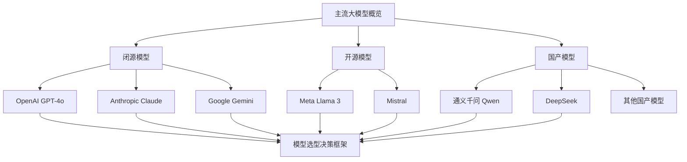
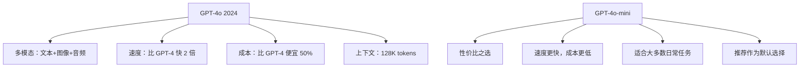
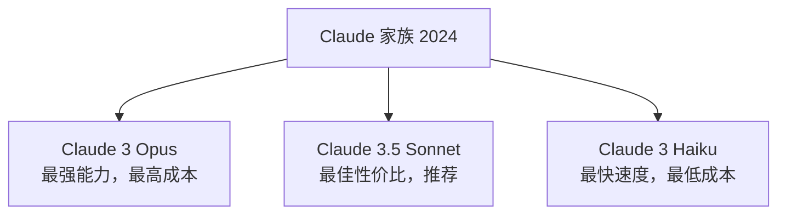
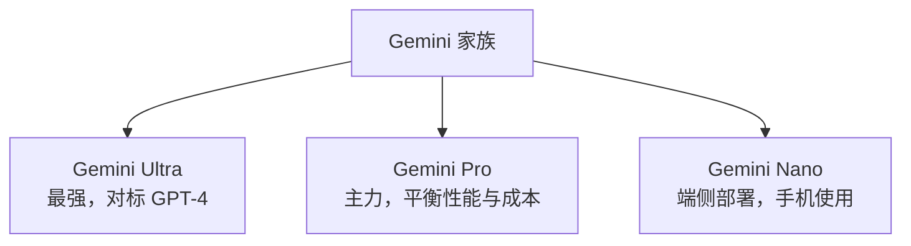
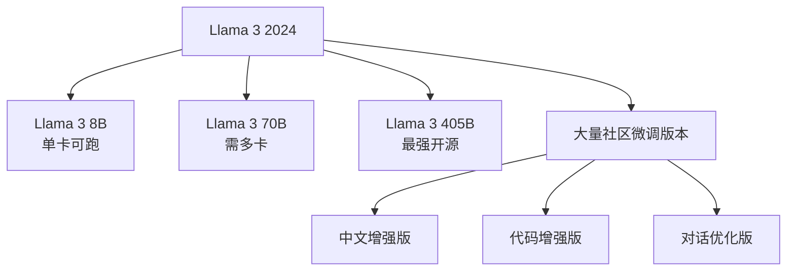
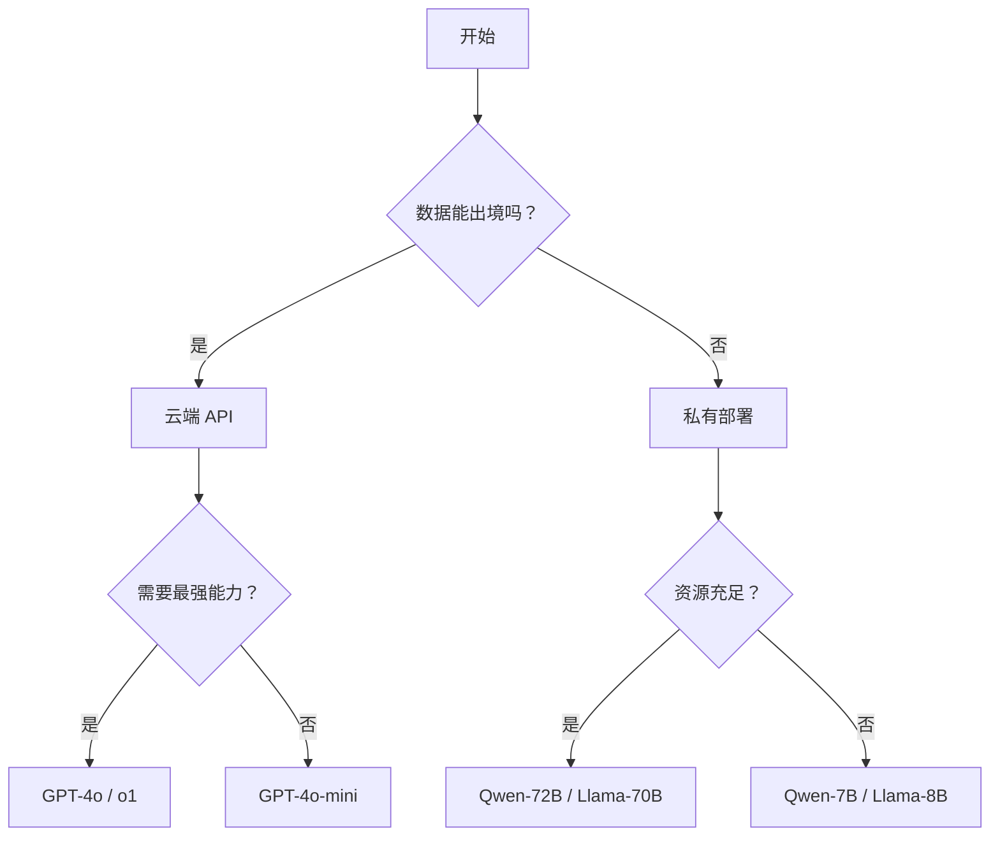

# 第3章 · 主流大模型对比分析

> **时长**：约 2.5 小时 ｜ **难度**：⭐⭐ ｜ **类型**：实用知识
>
> **目标**：了解主流大模型特点，掌握选型决策

---

## 学习目标

学完本章后，你将能够：
- 了解 OpenAI、Anthropic、Google 等主流闭源模型的核心特点
- 掌握开源模型阵营（Llama、Mistral 等）的优势与局限
- 熟悉国产大模型（Qwen、DeepSeek 等）的能力和适用场景
- 根据任务类型、预算和部署需求做出合理的模型选型决策
- 理解开源与闭源模型在数据安全、成本、定制化方面的权衡

---

## 知识地图



---

## 1、OpenAI 系列

### 1.1 GPT-4o / GPT-4o-mini

**概念定义**：GPT-4o（2024 年发布）是 OpenAI 的旗舰多模态模型，"o" 代表 "omni"（全能），支持文本、图像、音频输入。



### 1.2 o1 / o1-mini（推理模型）

```
o1 系列特点：
├── 专为复杂推理设计
├── 内置思维链（Chain-of-Thought）
├── 数学、编程、科学问题更强
└── 响应时间较长（在"思考"）

适用场景：
├── 复杂数学证明
├── 代码架构设计
├── 科学问题分析
└── 需要深度推理的任务
```

### 1.3 定价参考（2024）

| 模型 | 输入 ($/1M tokens) | 输出 ($/1M tokens) |
|------|-------------------|-------------------|
| GPT-4o | $2.50 | $10.00 |
| GPT-4o-mini | $0.15 | $0.60 |
| o1 | $15.00 | $60.00 |
| o1-mini | $3.00 | $12.00 |

---

## 2、Anthropic Claude 系列

### 2.1 Claude 3.5 Sonnet / Claude 3 Opus

**核心定位**：Claude 系列以超长上下文（200K tokens）、强代码能力和高安全性著称，适合长文档处理和编程任务。



### 2.2 核心特点

| 特点 | 说明 |
|------|------|
| **超长上下文** | 200K tokens（约15万字） |
| **代码能力强** | 编程任务表现优秀 |
| **安全性高** | Constitutional AI 设计 |
| **逻辑性强** | 推理任务准确 |

### 2.3 Constitutional AI

```
Claude 的安全设计

传统方式：人工标注"什么是有害的"
Claude：让 AI 自己基于一套"宪法"判断

宪法原则示例：
- 不帮助伤害他人
- 诚实回答，承认不确定
- 尊重用户隐私
- 不产生误导信息
```

### 2.4 Claude vs GPT 如何选择

| 场景 | 推荐 |
|------|------|
| 长文档处理 | Claude（上下文更长） |
| 代码生成 | 两者都优秀 |
| 创意写作 | Claude 更自然 |
| 多模态任务 | GPT-4o 更成熟 |
| 成本敏感 | GPT-4o-mini |

---

## 3、Google Gemini 系列

### 3.1 模型层级

**概念定义**：Gemini 是 Google 推出的原生多模态模型系列，从设计之初就支持文本、图像、音频、视频的混合理解。



### 3.2 特点

| 特点 | 说明 |
|------|------|
| **原生多模态** | 从设计上就支持图文音视频 |
| **Google 生态** | 与 Search、Docs 等深度整合 |
| **长上下文** | 1M tokens（实验性） |

---

## 4、开源模型阵营

### 4.1 Meta Llama 3 系列

**核心定位**：Llama 3 是 Meta 推出的开源大模型系列，覆盖 8B 到 405B 参数，支持商用，拥有最活跃的社区微调生态。



### 4.2 Mistral 系列

```
Mistral AI (法国)

特点：
├── 小模型高性能（7B 媲美更大模型）
├── Mixtral MoE：稀疏激活，效率高
└── 开源友好

Mixtral 8x7B:
├── 8 个专家网络
├── 每次只激活 2 个
├── 参数量大但推理成本低
```

### 4.3 开源 vs 闭源

| 维度 | 开源模型 | 闭源模型 |
|------|---------|---------|
| **数据安全** | ✅ 本地部署，数据不出域 | ⚠️ 数据需上传云端 |
| **定制化** | ✅ 可微调，自有数据训练 | ❌ 只能用 API，无法定制 |
| **成本结构** | GPU 算力成本（固定投入） | API 调用费（随用量增长） |
| **能力上限** | 略低于顶级闭源 | 更强（顶尖算力 + 数据） |
| **维护成本** | 需要运维、监控、更新 | 无需维护，即开即用 |

---

## 5、国产大模型

### 5.1 阿里通义千问（Qwen）

**核心定位**：Qwen 2.5 系列以完全开源（Apache 2.0）、中文能力优秀、覆盖全尺寸（0.5B~72B）著称，是本地部署和中文本地化场景的首选。

```
Qwen 2.5 系列 (2024)

版本：0.5B / 1.5B / 3B / 7B / 14B / 32B / 72B
特点：
├── 完全开源（Apache 2.0）
├── 中文能力优秀
├── 代码和数学能力强
└── 支持多种语言

推荐：
├── 本地部署首选
├── 中文场景优先考虑
└── 性价比极高
```

### 5.2 DeepSeek 系列

**概念定义**：DeepSeek（深度求索）以极致性价比著称，DeepSeek-V2 采用 MoE 架构，成本约为 GPT-4 的 1/100。

```
DeepSeek (深度求索)

DeepSeek-V2:
├── MoE 架构（236B 参数，21B 激活）
├── 成本极低（约 GPT-4 的 1/100）
└── 中文能力强

DeepSeek-Coder:
├── 代码专用模型
├── 33B 版本能力接近 GPT-4
└── 完全开源

优势：极致性价比
```

### 5.3 其他国产模型

| 模型 | 厂商 | 特点 |
|------|------|------|
| 文心一言 | 百度 | 中文理解强，百度生态 |
| GLM | 智谱 | 学术背景，开源友好 |
| 讯飞星火 | 科大讯飞 | 语音交互强 |
| 豆包 | 字节 | 创作能力强 |

### 5.4 国产模型选型

| 场景 | 推荐 |
|------|------|
| 中文对话 / 创作 | 文心一言、豆包 |
| 代码开发 | DeepSeek-Coder、Qwen-Coder |
| 本地部署 | Qwen、DeepSeek |
| 学术研究 | GLM |
| 预算有限 | DeepSeek-V2 |

---

## 6、模型选型决策框架

### 6.1 按任务类型选

| 任务类型 | 推荐模型 |
|---------|---------|
| 通用对话 | GPT-4o-mini / Claude 3.5 Sonnet |
| 复杂推理 | o1 / Claude 3 Opus |
| 代码开发 | GPT-4o / Claude / DeepSeek-Coder |
| 长文档处理 | Claude（200K）/ Gemini |
| 中文场景 | Qwen / 文心一言 |
| 创意写作 | Claude / GPT-4o |

### 6.2 按成本预算选

| 预算级别 | 推荐方案 |
|---------|---------|
| 免费 / 极低 | 开源模型本地部署 (Qwen-7B) |
| 低预算 | DeepSeek API / GPT-4o-mini |
| 中等预算 | GPT-4o / Claude 3.5 Sonnet |
| 充足预算 | GPT-4o / o1（按需） |

### 6.3 按部署方式选

| 部署需求 | 推荐方案 |
|---------|---------|
| 快速验证 | 云端 API（GPT / Claude） |
| 生产环境 | 根据数据敏感度选择 |
| 数据敏感 | 私有化部署（Qwen / Llama） |
| 边缘设备 | Llama 3 8B / Qwen 1.5B |

### 6.4 决策流程图

**核心定位**：模型选型没有"银弹"，需要根据数据出境限制、能力需求、资源预算三个维度综合决策。



---

## 常见踩坑

1. **只根据 Benchmark 选模型**：榜单分数不能代表实际场景表现，关键要测试你的具体任务数据
2. **低估 Token 成本**：中文场景 token 消耗是英文的 2~3 倍，千万级月活的应用成本差异可达数万美元
3. **混淆开源模型商用许可**：Llama 3 月活超 7 亿需 Meta 授权，部分开源模型禁止商用，务必核实协议
4. **忽视国产模型 API 稳定性**：国产模型的 API 可用性和延迟波动较大，生产环境需要做好降级和容错
5. **不考虑上下文窗口限制**：你的任务需要的最大输入长度必须低于模型上下文窗口，否则需要分块或 RAG

---

## 课后练习

1. 注册 2~3 个不同厂商的 API（如 DeepSeek、智谱 GLM、GPT-4o-mini），对同一组 5 个问题测试回复质量和速度
2. 针对"长文档摘要"任务，用 GPT-4o-mini 和 Claude 分别测试，对比在 5000 字文档上的效果差异
3. 评估开源模型本地部署的成本：计算运行 Qwen-7B 所需的 GPU 配置、每小时电费和推理吞吐量
4. 设计一个选型方案：假设你为一个"中文客服系统"选模型，需考虑预算（月 1000 元）、数据不能出境、实时响应，给出完整推荐

---

## 本章小结

- ✅ OpenAI：GPT-4o-mini 性价比高，o1 推理强，适合不同层级的任务
- ✅ Claude：上下文长（200K），代码强，安全性高，适合长文档和编程
- ✅ Gemini：原生多模态，Google 生态整合，实验性长上下文 1M
- ✅ 开源：Llama、Qwen 可本地部署，数据可控，但需运维成本
- ✅ 国产：DeepSeek 性价比极高（约 GPT-4 的 1/100），Qwen 开源友好
- ✅ 选型需综合评估：任务类型 × 预算 × 部署约束 × 上下文需求

---

> **下一章**：第4章 · Token化与上下文窗口——理解 Token 原理，掌握上下文管理策略
