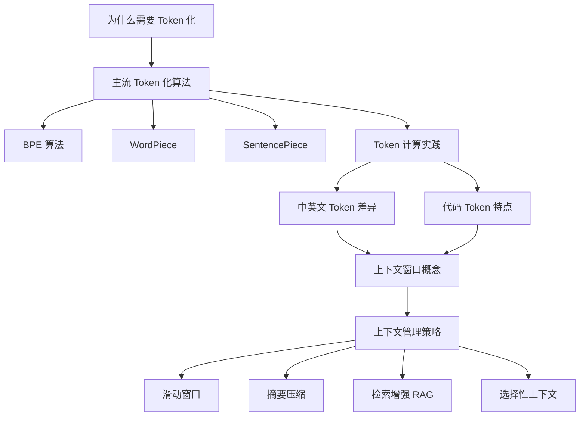
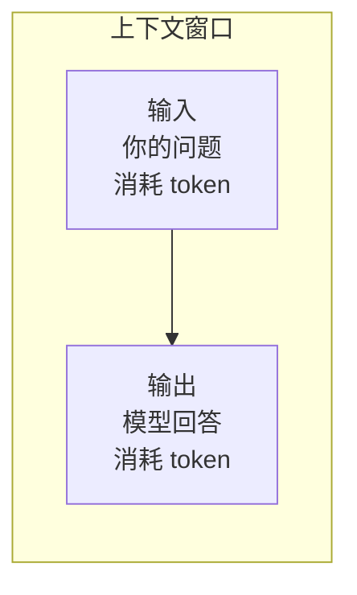
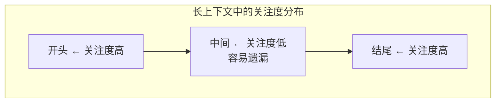
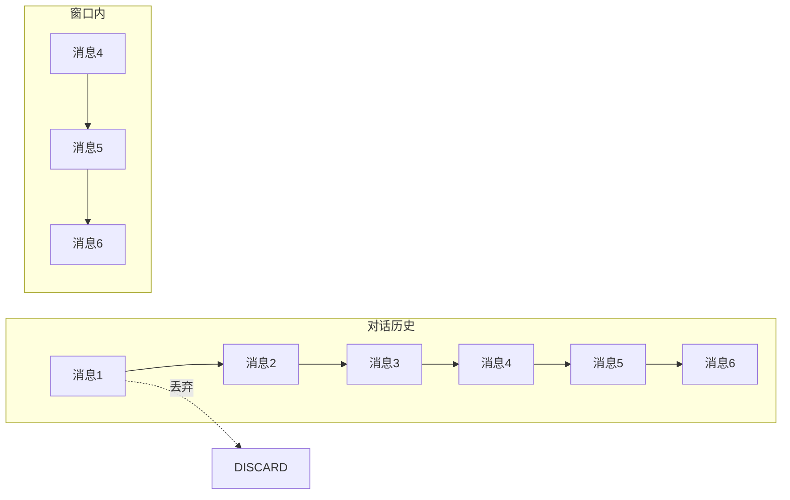
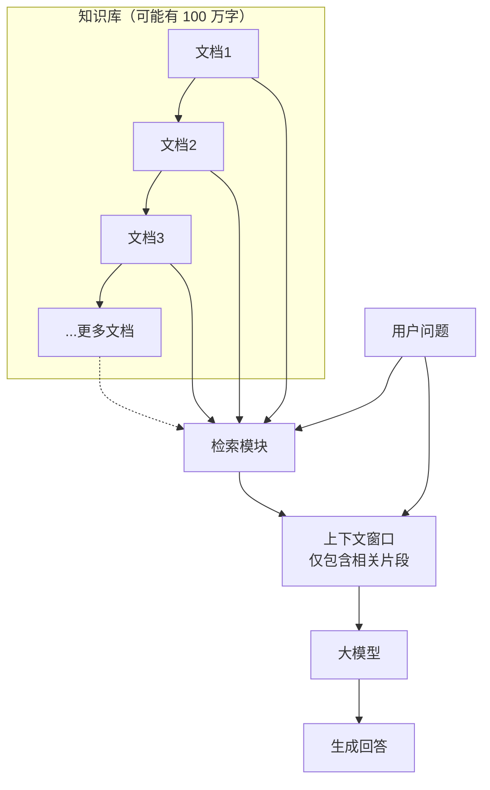

# 第4章 · Token化与上下文窗口

> **时长**：约 2 小时 ｜ **难度**：⭐⭐ ｜ **类型**：实用知识
>
> **目标**：理解 Token 化原理，掌握上下文管理策略

---

## 学习目标

学完本章后，你将能够：
- 理解为什么需要 Token 化以及三种主流切分方案的优缺点
- 掌握 BPE、WordPiece、SentencePiece 等 Token 化算法的核心原理
- 使用 tiktoken 等工具计算和分析 Token 消耗
- 理解上下文窗口对模型输入输出的限制
- 掌握滑动窗口、摘要压缩、RAG 等上下文管理策略

---

## 知识地图



---

## 1、为什么需要 Token 化

### 1.1 文本到数字的桥梁

**概念定义**：Token 化（Tokenization）是将自然语言文本切分成模型可处理的基本单元（Token）的过程，是实现"文本 → 数字"的第一步。

```
模型只能处理数字，不能直接处理文本

"你好世界" 
    ↓ Token化
[token_1, token_2, token_3, ...]
    ↓ 查词表
[8876, 1234, 5678, ...]
    ↓ Embedding
[[0.1, 0.2, ...], [0.3, 0.1, ...], ...]

模型处理的是向量，不是文字
```

### 1.2 词汇表与 OOV 问题

**核心定位**：子词切分（Subword Tokenization）在词表大小和序列长度之间取得了最佳平衡，是当前大模型的标配方案。

```
方案1：以词为单位
  词表: ["你好", "世界", "中国", ...]
  问题: 遇到新词怎么办？（OOV: Out of Vocabulary）
  
方案2：以字符为单位
  词表: ["a", "b", "c", ..., "你", "好", ...]
  问题: 序列太长，丢失语义

方案3：子词切分（现代方案）
  词表: ["你", "好", "世", "界", "##ing", ...]
  优点: 平衡词表大小和序列长度
```

| 方案 | 优点 | 缺点 |
|------|------|------|
| 以词为单位 | 语义完整 | OOV 问题，词表无限 |
| 以字符为单位 | 无 OOV | 序列过长，语义破碎 |
| 子词切分 | 平衡词表与长度 | 算法相对复杂 |

---

## 2、主流 Token 化算法

### 2.1 BPE（Byte Pair Encoding）

**概念定义**：BPE（字节对编码）是一种数据驱动的子词切分算法，从单个字符开始，反复合并出现频率最高的相邻字符对，直到达到目标词表大小。GPT 系列模型使用 BPE。

```
BPE 训练过程

初始: ["l", "o", "w", "e", "r", ...]（单字符）

统计最频繁的相邻对，合并：
Step 1: "lo" 出现最多 → 合并为 "lo"
Step 2: "low" 出现最多 → 合并为 "low"
Step 3: "er" 出现最多 → 合并为 "er"
...
重复直到达到目标词表大小

结果: ["low", "er", "low", "est", ...]
```

### 2.2 WordPiece

```
与 BPE 类似，但合并策略不同

BPE: 选择频率最高的相邻对
WordPiece: 选择能最大化语言模型概率的相邻对

使用 "##" 标记非词首子词:
  "playing" → ["play", "##ing"]

BERT 使用 WordPiece
```

### 2.3 SentencePiece

```
特点：语言无关的分词

不需要预分词（空格切分）
可以处理任何语言

Llama、Qwen 等使用 SentencePiece
```

### 2.4 不同 Tokenizer 对比

```python
# 同一句话，不同 Tokenizer 的结果

text = "Hello, 你好世界!"

GPT-4 (tiktoken):
  ["Hello", ",", " 你好", "世界", "!"]
  → 5 tokens

Llama (SentencePiece):
  ["Hello", ",", "▁你", "好", "世", "界", "!"]
  → 7 tokens

中文通常消耗更多 tokens
```

| 算法 | 代表模型 | 核心策略 |
|------|---------|---------|
| BPE | GPT 系列 | 合并频率最高的相邻字符对 |
| WordPiece | BERT | 合并能最大化语言模型概率的相邻对 |
| SentencePiece | Llama、Qwen | 语言无关，无需预分词 |

---

## 3、Token 计算实践

### 3.1 使用 tiktoken

```python
import tiktoken

# GPT-4 使用的编码
enc = tiktoken.encoding_for_model("gpt-4")

text = "Hello, 你好世界！"
tokens = enc.encode(text)

print(f"文本: {text}")
print(f"Tokens: {tokens}")
print(f"Token数: {len(tokens)}")

# 解码回文本
decoded = enc.decode(tokens)
print(f"解码: {decoded}")
```

### 3.2 中英文 Token 差异

```
英文: 1 token ≈ 4 字符 ≈ 0.75 词
中文: 1 token ≈ 1.5 汉字

示例:
"The quick brown fox"     → 4 tokens
"敏捷的棕色狐狸"          → 7 tokens

中文消耗的 token 约为英文的 2-3 倍！
成本和上下文窗口都要注意
```

### 3.3 Token 估算经验法则

| 内容类型 | 估算规则 |
|---------|---------|
| 英文文本 | 1 token ≈ 4 字符 |
| 中文文本 | 1 token ≈ 1.5 汉字 |
| 代码 | 变化大，符号多 |
| 1000 中文字 | ≈ 650-800 tokens |
| 1000 英文词 | ≈ 1300 tokens |

### 3.4 代码的 Token 特点

```python
# 代码符号会产生额外 tokens

def hello():      # "def", " hello", "(", "):"
    print("Hi")   # "   ", " print", "(", '"Hi"', ")"

# 缩进、括号、引号都是独立 token
# 代码通常比同长度文本消耗更多 token
```

---

## 4、上下文窗口

### 4.1 什么是上下文窗口

**概念定义**：上下文窗口（Context Window）是模型能"看到"的最大 Token 数量，输入（Prompt）和输出（回答）的总和必须在窗口内。



### 4.2 各模型上下文长度

| 模型 | 上下文窗口 | 约等于（汉字） |
|------|-----------|--------------|
| GPT-3.5 | 16K | 12K 汉字 |
| GPT-4o | 128K | 100K 汉字 |
| Claude 3 | 200K | 150K 汉字 |
| Gemini 1.5 | 1M+ | 750K+ 汉字 |
| Llama 3 | 8K | 6K 汉字 |

### 4.3 长上下文的挑战

**概念定义**："Lost in the Middle"（中间丢失）现象指模型对长上下文中间部分的关注度显著低于开头和结尾，导致关键信息可能被忽略。



```
问题1: 计算复杂度
  Attention 复杂度 = O(n²)
  上下文翻倍 → 计算量翻 4 倍

问题2: 中间内容丢失 (Lost in the Middle)
  开头和结尾关注度高，中间内容容易被忽略

问题3: 成本
  更多 token = 更高费用
```

### 4.4 长上下文最佳实践

```
1. 重要信息放开头或结尾
2. 不要塞入无关内容
3. 考虑使用摘要压缩
4. 必要时用 RAG 替代长上下文
```

---

## 5、上下文窗口管理策略

### 5.1 滑动窗口

**概念定义**：滑动窗口（Sliding Window）策略保留最近的 N 条消息，丢弃超出窗口的早期内容，是对话系统中最简单的上下文管理方式。



优点：实现简单，计算开销低。
缺点：会丢失早期重要信息。

### 5.2 摘要压缩

**概念定义**：摘要压缩（Summarization Compression）利用模型自身将长历史内容压缩为简短摘要，保留关键信息同时节省 Token。

```
原始 (1000 tokens):
  "会议讨论了项目进度，张三汇报了前端开发完成80%，
   李四说后端API已全部完成，王五提出需要增加测试..."

摘要 (100 tokens):
  "会议要点：前端80%，后端完成，需增加测试"

节省 token 同时保留关键信息
```

### 5.3 检索增强（RAG）

**核心定位**：RAG（Retrieval-Augmented Generation，检索增强生成）不把全部知识塞入上下文，而是根据问题实时检索最相关的片段放入上下文。当知识库超过上下文窗口限制时，RAG 是最优解。



### 5.4 选择性上下文

```
根据任务选择性地包含信息

写代码时：只包含相关函数定义
写总结时：只包含核心段落
多轮对话：只保留与当前话题相关的历史

原则：只给模型需要的信息
```

**核心定位**：选择性子上下文的核心理念是"质量优于数量"——给模型喂再多的噪声信息也不会带来更好效果，反而会稀释注意力。

---

## 常见踩坑

1. **低估中英文 Token 差异**：中文文本的 Token 消耗是英文的 2~3 倍，做中文应用时常出现预算超标或上下文不足
2. **假设上下文窗口全可用**：长上下文中中间部分会被"忽略"（Lost in the Middle），不是所有窗口内的信息都被模型同等关注
3. **长对话不管理上下文**：多轮对话中不主动压缩或丢弃旧消息，导致 Token 持续增长超出窗口限制
4. **混淆 Token 与字符**：1 个 Token ≠ 1 个汉字/单词，不同模型 Token 化方式不同，依赖直觉估算容易出错
5. **对代码 Token 消耗准备不足**：缩进、括号、引号等符号都会产生额外 Token，代码输入的实际成本可能比纯文本高 30~50%

---

## 课后练习

1. 使用 tiktoken 分析三段不同文本（英文新闻、中文文章、Python 代码）的 Token 消耗，对比差异
2. 设计一个实验验证 "Lost in the Middle"：在长文本的不同位置插入关键信息，测试模型是否能正确提取
3. 实现一个简单的滑动窗口对话管理类，支持设置窗口大小 N，自动丢弃超出窗口的早期消息
4. 为一个 10 万字的文档设计 RAG 方案：说明如何进行文档分块、如何建立索引、如何检索相关片段

---

## 本章小结

- ✅ Token 是模型处理文本的基本单位，子词切分是主流方案
- ✅ BPE/WordPiece/SentencePiece 是三大 Token 化算法，不同模型各有选择
- ✅ 中文 Token 消耗约为英文的 2~3 倍，做中文应用时需要特别注意成本估算
- ✅ 上下文窗口 = 输入 + 输出 Token 上限，并非所有窗口内信息都被同等关注
- ✅ 长上下文面临 "Lost in the Middle" 问题，滑动窗口 / 摘要压缩 / RAG 是三种核心管理策略

---

> **下一章**：第5章 · 大模型的涌现能力——理解涌现、In-Context Learning 和思维链
