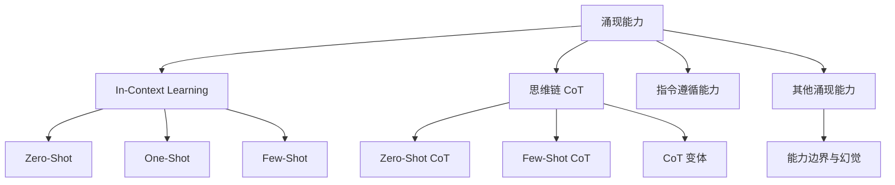
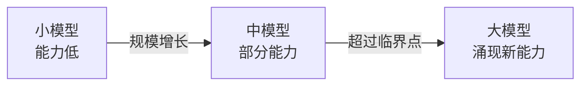
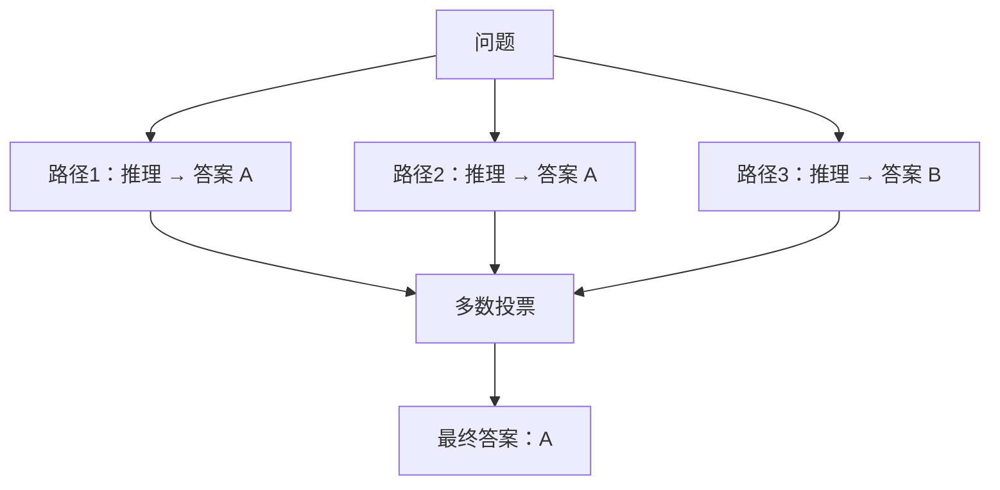
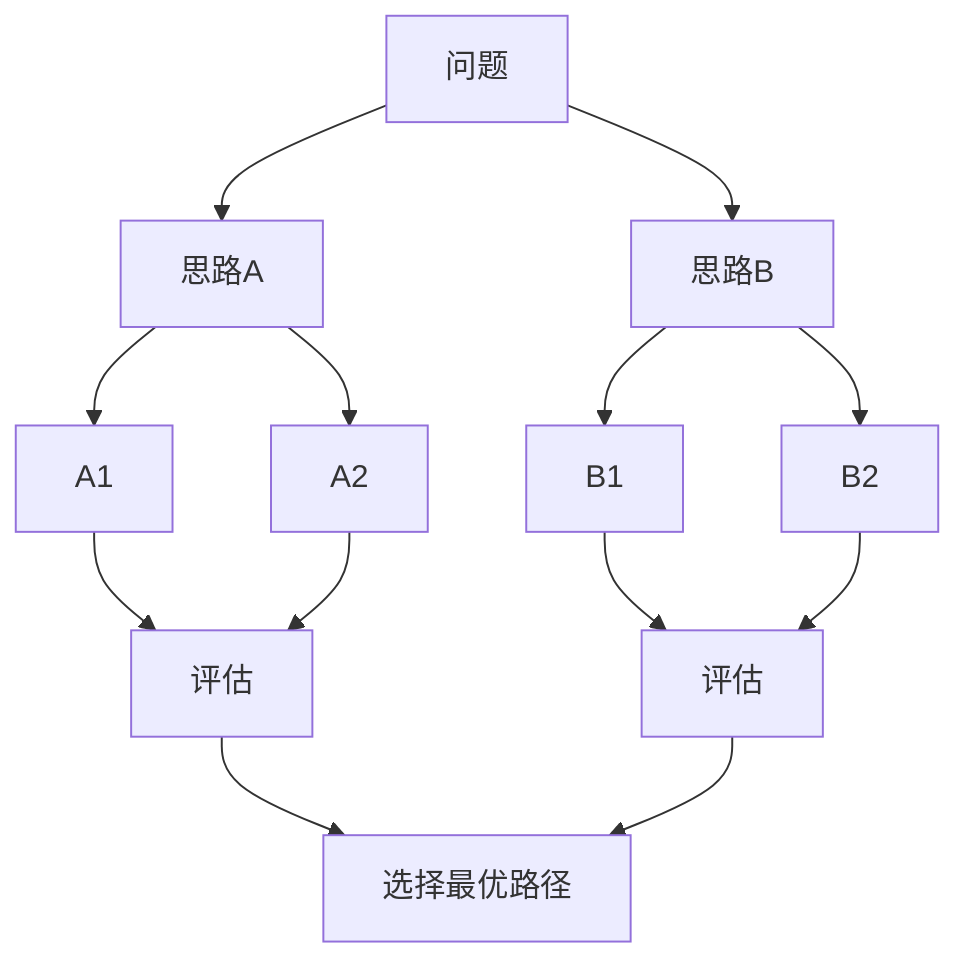
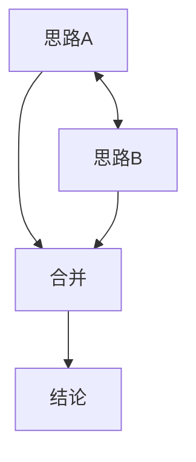

# 第5章 · 大模型的涌现能力

> **时长**：约 2.5 小时 ｜ **难度**：⭐⭐⭐ ｜ **类型**：原理理解
>
> **目标**：理解涌现能力、In-Context Learning 和思维链

---

## 学习目标

学完本章后，你将能够：
- 理解涌现能力的定义及其产生原因
- 掌握 In-Context Learning（Zero-Shot / One-Shot / Few-Shot）的工作原理
- 理解 Chain-of-Thought 如何提升模型推理能力
- 解释指令遵循能力如何让模型从"补全"进化为"对话"
- 了解大模型的现有能力边界（幻觉、时效性等）

---

## 知识地图



---

## 1、什么是涌现能力

### 1.1 定义

**概念定义**：涌现能力（Emergent Ability）是指小模型不具备、但当模型规模超过某一临界点后突然获得的能力——它不是渐进式的改进，而是质的飞跃。

> **涌现（Emergence）= 小模型不具备，但大模型突然获得的能力**



### 1.2 涌现能力的例子

| 能力 | 小模型 | 大模型 |
|------|--------|--------|
| 简单算术 | ✅ 可以 | ✅ 可以 |
| 多位数乘法 | ❌ 不行 | ✅ 涌现 |
| 逻辑推理 | ❌ 不行 | ✅ 涌现 |
| 代码生成 | ❌ 不行 | ✅ 涌现 |
| 语言翻译 | ❌ 差 | ✅ 涌现 |

### 1.3 为什么会涌现

```
假说1: 能力一直在，只是测量方式的问题
  - 小模型有50%正确率，被判为"不会"
  - 大模型有90%正确率，被判为"会"

假说2: 组合爆炸需要足够参数
  - 复杂任务需要多种基础能力组合
  - 参数不够时，组合能力不足

假说3: 相变现象
  - 类似水到冰的相变
  - 量变积累到一定程度产生质变
```

### 1.4 涌现是否真实存在

```
争议观点：

支持派:
  "确实存在质的飞跃，不只是量变"

质疑派:
  "可能只是评估方式的问题"
  "换一种评估方式，曲线就平滑了"

当前共识:
  某些能力确实在特定规模后突然提升
  但"涌现"的定义和边界仍有争议
```

---

## 2、In-Context Learning（上下文学习）

### 2.1 核心概念

**概念定义**：In-Context Learning（上下文学习）是指在不更新模型参数的前提下，仅通过在 Prompt 中提供输入-输出示例，让模型学会执行新任务。

```
传统机器学习              In-Context Learning
───────────────────────────────────────────────
训练数据 → 更新参数       示例放入 Prompt
                        不更新参数
需要大量数据              几个示例就够
需要重新训练              即用即改
```

### 2.2 Zero-Shot

**概念定义**：Zero-Shot（零样本学习）是不给任何示例，直接用自然语言指令让模型执行任务。

```
Prompt:
"""
判断以下句子的情感是正面还是负面：
"这部电影太精彩了！"
情感：
"""

模型输出: "正面"

模型从未专门学过情感分析，但能直接做
```

### 2.3 One-Shot

```
给一个示例

Prompt:
"""
判断情感：
"这本书很无聊" → 负面

"这部电影太精彩了！" →
"""

模型输出: "正面"

一个示例帮助模型理解任务格式
```

### 2.4 Few-Shot

```
给几个示例

Prompt:
"""
判断情感：
"这本书很无聊" → 负面
"景色真美" → 正面
"服务太差了" → 负面

"这部电影太精彩了！" →
"""

模型输出: "正面"

更多示例 = 更稳定的输出
```

### 2.5 ICL 的最佳实践

```
1. 示例要有代表性
   ✓ 包含各种类别
   ✗ 只有一种类别

2. 格式要一致
   ✓ 输入 → 输出（统一格式）
   ✗ 格式混乱

3. 示例数量
   - 3-5个通常足够
   - 太多会占用上下文

4. 示例顺序可能有影响
   - 相关的示例放前面
   - 可以尝试不同顺序
```

---

## 3、思维链（Chain-of-Thought）

### 3.1 CoT 的发现

**概念定义**：Chain-of-Thought（思维链，CoT）是在 Prompt 中要求模型展示中间推理步骤的技术，由 Google 在 2022 年发现能显著提升模型的复杂推理能力。

```
普通 Prompt                    Chain-of-Thought
─────────────────────────────────────────────────────
问: 小明有5个苹果，             问: 小明有5个苹果，
    给了小红2个，                   给了小红2个，
    还剩几个？                      还剩几个？
                               
答: 3                          答: 让我一步步思考。
                                   小明原来有5个苹果。
    (直接给答案，                   他给了小红2个。
     容易出错)                      5 - 2 = 3
                                   所以还剩3个苹果。
                               
                                   (展示推理过程，
                                    正确率更高)
```

### 3.2 为什么 CoT 有效

```
假说1: 分解复杂问题
  复杂问题 → 多个简单步骤 → 逐步求解

假说2: 激活相关知识
  推理过程帮助模型"想起"相关知识

假说3: 减少"跳跃"
  直接答案需要跳过中间步骤
  CoT 让每一步都简单
```

### 3.3 Zero-Shot CoT

**核心定位**：Zero-Shot CoT 是最简单高效的 Prompt 技巧——只需在问题后追加一句"Let's think step by step"，即可显著提升推理准确率。

```
Prompt:
"""
问: 一个农场有35只鸡和28只鸭，
    卖掉了17只鸡后，还有多少只家禽？

Let's think step by step.
"""

模型输出:
"""
1. 原来有35只鸡和28只鸭
2. 家禽总数 = 35 + 28 = 63只
3. 卖掉17只鸡后，鸡 = 35 - 17 = 18只
4. 现在家禽 = 18只鸡 + 28只鸭 = 46只
答案: 46只
"""
```

### 3.4 Few-Shot CoT

```
给出带推理过程的示例

Prompt:
"""
问: 小明有10元，买了3元的笔，还剩多少？
答: 小明原来有10元。买笔花了3元。
    10 - 3 = 7元。还剩7元。

问: 一个农场有35只鸡和28只鸭，
    卖掉了17只鸡后，还有多少只家禽？
答:
"""
```

### 3.5 CoT 的变体

**Self-Consistency（自我一致性）**



多次生成推理路径，取出现次数最多的答案，犧牲计算量换取更稳定的结果。

**Tree of Thoughts（思维树）**



探索多个推理分支，评估后选择最优路径。

**Graph of Thoughts（思维图）**



允许分支合并、循环，比思维树更灵活。

### 3.6 CoT 的局限性

```
1. 对简单任务可能适得其反
   - 增加计算量
   - 可能引入错误步骤

2. 对某些任务无效
   - 创意生成
   - 主观判断

3. 推理步骤可能是"自圆其说"
   - 先想到答案
   - 再编造推理过程
```

---

## 4、指令遵循能力

### 4.1 从补全到对话

```
GPT-3（补全模型）              ChatGPT（对话模型）
──────────────────────────────────────────────────
输入: "天空是"                 输入: "天空是什么颜色？"
输出: "蓝色的..."              输出: "天空通常呈现蓝色，
                                    这是因为..."
                              
续写模式                       对话模式
不一定遵循指令                 理解并遵循指令
```

### 4.2 指令微调的作用

```
指令微调前                    指令微调后
──────────────────────────────────────────────────
"写一首诗"                    "写一首诗"
→ "写一首诗是很..."           → "春风拂柳绿，
   (继续补全)                     细雨润花红..."
                                  (真的写诗)

"翻译成英文: 你好"            "翻译成英文: 你好"
→ "翻译成英文: 你好，         → "Hello"
   这是中文常用语..."            (直接翻译)
   (解释这句话)
```

### 4.3 系统提示词的力量

```python
# 系统提示词定义模型的"人设"

messages = [
    {
        "role": "system", 
        "content": "你是一位专业的Python程序员。"
    },
    {
        "role": "user",
        "content": "写一个排序函数"
    }
]

# 模型会以Python专家的角色回答
```

### 4.4 指令设计原则

```
✅ 好的指令:
- 具体明确: "用3句话总结" vs "总结一下"
- 角色设定: "你是一位经验丰富的医生"
- 格式要求: "以JSON格式输出"
- 示例引导: "例如:..."

❌ 差的指令:
- 模糊不清: "帮我处理一下"
- 过于复杂: 一次给太多要求
- 自相矛盾: 要求既简短又详细
```

---

## 5、其他涌现能力与能力边界

### 5.1 代码生成与理解

```
能力进化:

GPT-3: 简单代码片段
GPT-4: 复杂算法、完整项目
       调试代码、解释代码
       理解代码意图
```

### 5.2 数学推理

```
逐步提升:

简单算术 → 多步计算 → 代数 → 复杂数学问题

GPT-4 + 思维链 可以解决一些数学竞赛题
但仍有局限（复杂证明、高等数学）
```

### 5.3 多语言能力

```
特点:
- 在英文为主的数据上训练
- 却能处理多种语言
- 甚至能进行跨语言推理

英文问题 → 中文回答 → 日文总结
```

### 5.4 常识推理

```
示例:
问: "把大象放进冰箱需要几步？"
答: "这是个经典笑话。字面上需要三步:
     1. 打开冰箱
     2. 把大象放进去
     3. 关上冰箱
     但现实中大象太大放不进去。"

理解了字面意思和潜在的幽默
```

### 5.5 能力边界与幻觉

```
当前局限:

1. 幻觉 (Hallucination)
   - 编造不存在的信息
   - 自信地说错误的内容

2. 时效性
   - 知识有截止日期
   - 不知道最新事件

3. 复杂推理
   - 多步推理仍易出错
   - 需要验证关键结果

4. 数学计算
   - 复杂计算不可靠
   - 建议用代码执行
```

---

## 常见踩坑

1. **认为所有任务都会涌现**：涌现能力只在特定任务上出现且需要足够的规模，误以为小模型也能达到同样效果会导致实际应用效果落差
2. **混淆 ICL 与微调**：In-Context Learning 不更新参数、依赖示例质量和格式，不能替代微调在特定任务上的稳定性
3. **滥用 Chain-of-Thought**：简单任务（如"1+1=?"）不需要 CoT，强行使用反而增加开销和可能引入错误步骤
4. **忽视大模型幻觉问题**：大模型生成的内容"看起来正确"不等于"事实正确"，生产环境必须建立验证机制
5. **过度依赖系统提示词**：系统提示词能约束行为但无法彻底消除安全风险，模型在多轮对话中可能被"越狱"

---

## 课后练习

1. 分别用一个小模型（如 GPT-3.5）和一个大模型（如 GPT-4o）对同一组推理题（数学题、逻辑题）测试，观察能力差异
2. 设计一组 Few-Shot 示例做情感分类：从 0 个示例逐步增加到 5 个示例，记录准确率变化曲线
3. 对同一道数学题，分别用"直接回答"和"Let's think step by step"两种 Prompt 方式访问 API，对比正确率和回答耗时
4. 分析三个不同系统提示词对模型回答风格的影响：分别设置"专业导师"、"幽默朋友"、"严格考官"三种角色，对同一个问题比较输出差异

---

## 本章小结

- ✅ 涌现能力 = 规模达到一定程度后突然出现的能力，而不是渐进式改进
- ✅ In-Context Learning 让模型通过 Prompt 中的示例学习新任务，无需更新参数
- ✅ Chain-of-Thought 通过展示中间推理步骤显著提升复杂任务的准确率
- ✅ 指令遵循能力让模型从"文本补全"进化为"对话助手"
- ✅ 大模型仍有明确的能力边界：幻觉、时效性、复杂推理不可靠

---

## 模块3总结

完成本模块学习后，你已经：

1. **深入理解 Transformer** — Self-Attention、Multi-Head、位置编码，掌握了大模型的底层架构原理
2. **掌握 GPT 发展脉络** — 从 GPT-1 到 GPT-4 的关键突破，理解了预训练、微调、RLHF 的技术演进
3. **具备模型选型能力** — 了解闭源/开源/国产主流模型的特点和适用场景，能根据任务和预算做出合理选择
4. **理解核心机制** — Token 化原理、上下文窗口管理、涌现能力，建立了大模型使用的底层直觉
5. **建立技术直觉** — 知道为什么这些技术能工作、有哪些局限，具备独立学习和探索更前沿技术的基础

---

> **下一步**：模块4 · 大模型 API 调用实战 — 动手实践调用各种大模型 API
