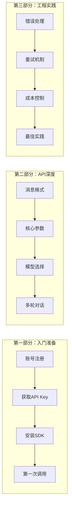
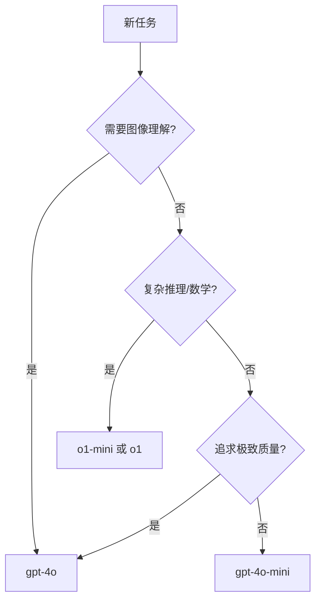

# 第1章 · OpenAI API 完全指南 — 从注册到精通

> **时长**：约 4 小时 ｜ **难度**：⭐⭐ ｜ **类型**：动手实操
>
> **目标**：掌握 OpenAI Chat Completions API 的完整用法，理解核心参数，能够独立开发基于 GPT 的应用

---

## 学习目标

学完本章后，你将能够：
- 注册 OpenAI 账号并获取 API Key
- 理解 Chat Completions API 的请求/响应结构
- 掌握 temperature、top_p、max_tokens 等核心参数的作用
- 正确选择 GPT-4o、GPT-4o-mini、o1 等不同模型
- 实现多轮对话的消息管理
- 处理 API 错误并实现重试机制

---

## 知识地图



---

# 第一部分：入门准备

## 1、OpenAI 平台概述

**OpenAI** 是 GPT 系列模型的开发商，提供业界最强大的语言模型 API。

**核心产品线**（2024-2025）：

| 模型系列 | 代表模型 | 定位 | 特点 |
|---------|---------|------|------|
| GPT-4o | gpt-4o, gpt-4o-mini | 旗舰多模态 | 速度快、支持图像、性价比高 |
| o1 | o1, o1-mini, o1-pro | 推理增强 | 复杂推理、数学、编程 |
| GPT-4 | gpt-4-turbo | 上一代旗舰 | 128K 上下文 |
| GPT-3.5 | gpt-3.5-turbo | 入门级 | 便宜、速度快 |

**核心价值**：OpenAI API 是大模型应用开发的"黄金标准"，几乎所有其他厂商的 API 都兼容 OpenAI 格式。学会 OpenAI API，等于学会了 80% 厂商的 API。

---

## 2、账号注册与 API Key 获取

### 2.1 注册流程

1. 访问 [platform.openai.com](https://platform.openai.com)
2. 点击 "Sign up" 注册账号
3. 验证邮箱和手机号
4. 绑定支付方式（信用卡/借记卡）

> ⚠️ **国内用户注意**：需要海外手机号验证，可使用接码平台或海外手机卡。

### 2.2 获取 API Key

1. 登录后进入 [API Keys 页面](https://platform.openai.com/api-keys)
2. 点击 "Create new secret key"
3. 设置名称和权限范围
4. **立即复制保存**——关闭后无法再次查看！

```ini
# 保存到 .env 文件
OPENAI_API_KEY=sk-proj-xxxxxxxxxxxxxxxxxxxxxxxxxxxx
```

### 2.3 API Key 安全最佳实践

| 做法 | 说明 |
|------|------|
| ✅ 存入 .env 文件 | 代码与密钥分离 |
| ✅ 加入 .gitignore | 防止误提交到 Git |
| ✅ 设置用量限制 | 防止意外高额账单 |
| ✅ 定期轮换密钥 | 降低泄露风险 |
| ❌ 硬编码到代码中 | 绝对禁止！ |
| ❌ 提交到公开仓库 | 会被扫描盗用 |

---

## 3、安装 SDK 与环境配置

### 3.1 安装 OpenAI Python SDK

```bash
pip install openai python-dotenv
```

### 3.2 验证安装

```bash
python -c "import openai; print(f'OpenAI SDK {openai.__version__} 安装成功')"
```

### 3.3 环境配置

在项目根目录创建 `.env` 文件：

```ini
# .env
OPENAI_API_KEY=sk-proj-your-api-key-here
OPENAI_BASE_URL=https://api.openai.com/v1
```

**概念定义**：`OPENAI_BASE_URL` 是 API 的基础地址。默认是 OpenAI 官方地址，也可以改为代理地址或兼容服务地址。

---

## 4、第一次 API 调用

### ▶ 执行代码

```bash
cd code/01-OpenAI-API
python 01_hello_openai.py
```

### 代码解读

```python
"""
01_hello_openai.py
第一个 OpenAI API 调用示例
"""
import os
from dotenv import load_dotenv
from openai import OpenAI

# 加载环境变量
load_dotenv()

# 创建客户端
client = OpenAI(
    api_key=os.getenv("OPENAI_API_KEY"),
    base_url=os.getenv("OPENAI_BASE_URL", "https://api.openai.com/v1")
)

# 发起请求
response = client.chat.completions.create(
    model="gpt-4o-mini",           # 模型名称
    messages=[
        {"role": "user", "content": "用一句话介绍什么是 API"}
    ]
)

# 提取回复
print(response.choices[0].message.content)
print(f"\n--- Token 用量 ---")
print(f"输入 Token: {response.usage.prompt_tokens}")
print(f"输出 Token: {response.usage.completion_tokens}")
print(f"总计 Token: {response.usage.total_tokens}")
```

**输出示例**：
```
API（应用程序编程接口）是一组定义软件组件之间如何交互的协议和工具，允许不同的程序相互通信和共享数据。

--- Token 用量 ---
输入 Token: 14
输出 Token: 42
总计 Token: 56
```

---

# 第二部分：API 深度解析

## 5、消息格式详解

**概念定义**：Chat Completions API 使用**消息列表**作为输入。每条消息包含 `role`（角色）和 `content`（内容）。

### 5.1 三种消息角色

| 角色 | 作用 | 示例 |
|------|------|------|
| `system` | 设定 AI 的身份和行为规则 | "你是一个专业的翻译官" |
| `user` | 用户的输入 | "请翻译：今天天气真好" |
| `assistant` | AI 的回复（历史记录） | "The weather is nice today." |

### 5.2 消息结构示例

```python
messages = [
    {
        "role": "system",
        "content": "你是一个专业的Python程序员，回答简洁准确。"
    },
    {
        "role": "user",
        "content": "什么是列表推导式？"
    }
]
```

### 5.3 System Prompt 的最佳实践

```python
# ✅ 好的 System Prompt
system_prompt = """你是一个资深的Python开发工程师。
请遵循以下规则：
1. 回答简洁，代码示例不超过10行
2. 优先使用Python 3.10+的新特性
3. 对于复杂问题，先给出结论再解释
4. 如果问题不清楚，先确认需求"""

# ❌ 差的 System Prompt
system_prompt = "你是助手"  # 太简单，没有约束
```

---

## 6、核心参数详解

### ▶ 执行代码

```bash
python 02_parameters_demo.py
```

### 6.1 temperature — 控制随机性

**概念定义**：`temperature` 控制输出的随机性。值越低输出越确定，值越高越多样。范围 0-2。

```python
# temperature=0：每次输出几乎相同
response = client.chat.completions.create(
    model="gpt-4o-mini",
    messages=[{"role": "user", "content": "1+1等于几？"}],
    temperature=0
)

# temperature=1.5：输出富有创意但可能不稳定
response = client.chat.completions.create(
    model="gpt-4o-mini",
    messages=[{"role": "user", "content": "写一句关于春天的诗"}],
    temperature=1.5
)
```

| temperature | 行为 | 适用场景 |
|-------------|------|---------|
| 0 | 输出高度一致 | 翻译、数据提取、代码生成 |
| 0.3-0.5 | 轻微变化 | 摘要、改写 |
| 0.7-1.0 | 有创意但可控 | 对话、内容创作 |
| 1.0-1.5 | 高度随机 | 头脑风暴、创意写作 |

### 6.2 top_p — 核采样

**概念定义**：`top_p`（核采样）只从概率最高的 Token 中采样，直到累积概率达到 p 值。

```python
response = client.chat.completions.create(
    model="gpt-4o-mini",
    messages=[{"role": "user", "content": "写一首诗"}],
    top_p=0.9  # 只考虑累积概率前90%的Token
)
```

> ⚠️ **建议**：`temperature` 和 `top_p` 通常只调一个，同时调可能产生不可预测的效果。

### 6.3 max_tokens — 输出长度限制

**概念定义**：`max_tokens` 限制模型输出的最大 Token 数。超过限制会被截断。

```python
# 限制输出最多100个Token
response = client.chat.completions.create(
    model="gpt-4o-mini",
    messages=[{"role": "user", "content": "详细介绍Python语言"}],
    max_tokens=100  # 防止长篇大论
)
```

**关键点**：
- 不设置时使用模型默认最大值
- 设置过小会导致回答被截断
- Token ≠ 字符（中文1字≈1-2Token，英文1词≈1Token）

### 6.4 stop — 停止序列

**概念定义**：当模型输出包含 `stop` 中的任意字符串时，立即停止生成。

```python
response = client.chat.completions.create(
    model="gpt-4o-mini",
    messages=[{"role": "user", "content": "列出三种水果："}],
    stop=["\n\n", "4."]  # 遇到空行或"4."就停止
)
```

### 6.5 seed — 可复现输出

**概念定义**：设置相同的 `seed` 值，在相同输入下尽可能产生相同输出（不保证100%相同）。

```python
response = client.chat.completions.create(
    model="gpt-4o-mini",
    messages=[{"role": "user", "content": "生成一个随机名字"}],
    seed=42,         # 固定种子
    temperature=0    # 配合低温度效果更好
)
```

### 6.6 参数速查表

| 参数 | 类型 | 默认值 | 说明 |
|------|------|--------|------|
| `model` | string | 必填 | 模型名称 |
| `messages` | array | 必填 | 消息列表 |
| `temperature` | float | 1 | 随机性 0-2 |
| `top_p` | float | 1 | 核采样 0-1 |
| `max_tokens` | int | 模型上限 | 最大输出Token |
| `stop` | array | null | 停止序列 |
| `seed` | int | null | 随机种子 |
| `n` | int | 1 | 生成几个回复 |
| `presence_penalty` | float | 0 | 话题新鲜度 -2~2 |
| `frequency_penalty` | float | 0 | 减少重复 -2~2 |

---

## 7、模型选择指南

### 7.1 GPT-4o 系列（推荐首选）

| 模型 | 上下文 | 输入价格 | 输出价格 | 特点 |
|------|--------|---------|---------|------|
| `gpt-4o` | 128K | $2.5/M | $10/M | 旗舰模型，多模态 |
| `gpt-4o-mini` | 128K | $0.15/M | $0.6/M | 性价比之王，日常首选 |

**核心定位**：`gpt-4o-mini` 是日常开发的首选——便宜、快、够聪明。只有复杂任务才需要 `gpt-4o`。

### 7.2 o1 推理系列

| 模型 | 特点 | 适用场景 |
|------|------|---------|
| `o1` | 深度推理，最强 | 复杂数学、科学问题 |
| `o1-mini` | 推理增强，更快 | 代码、逻辑推理 |
| `o1-pro` | 最强推理 | 顶级难题 |

**核心定位**：推理模型会"思考"更长时间，适合需要多步推理的复杂问题，但成本高、速度慢。

### 7.3 模型选择决策树



### ▶ 执行代码

```bash
python 03_model_comparison.py
```

---

## 8、多轮对话实现

### 8.1 对话历史管理

**概念定义**：模型本身无状态，每次请求都是独立的。要实现多轮对话，需要把历史消息全部传给 API。

```python
"""
03_multi_turn_chat.py
多轮对话示例
"""
from openai import OpenAI

client = OpenAI()

# 维护对话历史
conversation = [
    {"role": "system", "content": "你是一个友好的助手，回答简洁。"}
]

def chat(user_input: str) -> str:
    # 添加用户消息
    conversation.append({"role": "user", "content": user_input})
    
    # 调用API（传入完整历史）
    response = client.chat.completions.create(
        model="gpt-4o-mini",
        messages=conversation
    )
    
    # 提取回复
    assistant_message = response.choices[0].message.content
    
    # 将回复加入历史
    conversation.append({"role": "assistant", "content": assistant_message})
    
    return assistant_message

# 模拟多轮对话
print("用户: 我叫小明")
print("AI:", chat("我叫小明"))

print("\n用户: 我刚才说我叫什么？")
print("AI:", chat("我刚才说我叫什么？"))  # AI能记住上文
```

### 8.2 上下文长度管理

当对话过长时，需要裁剪历史消息：

```python
def manage_context(messages: list, max_tokens: int = 4000) -> list:
    """保留系统提示 + 最近的消息"""
    # 始终保留系统提示
    system_msg = [m for m in messages if m["role"] == "system"]
    other_msgs = [m for m in messages if m["role"] != "system"]
    
    # 粗略估算Token（实际应用中用tiktoken精确计算）
    while len(str(other_msgs)) > max_tokens * 2 and len(other_msgs) > 2:
        other_msgs.pop(0)  # 移除最早的消息
    
    return system_msg + other_msgs
```

---

# 第三部分：工程实践

## 9、错误处理

### 9.1 常见错误类型

| 错误类型 | HTTP状态码 | 原因 | 解决方案 |
|---------|-----------|------|---------|
| `AuthenticationError` | 401 | API Key 无效 | 检查密钥 |
| `RateLimitError` | 429 | 请求太频繁 | 等待后重试 |
| `BadRequestError` | 400 | 请求格式错误 | 检查参数 |
| `APIConnectionError` | - | 网络问题 | 检查网络/重试 |
| `InternalServerError` | 500 | OpenAI 服务器问题 | 稍后重试 |

### 9.2 错误处理代码

### ▶ 执行代码

```bash
python 04_error_handling.py
```

```python
"""
04_error_handling.py
错误处理示例
"""
import time
from openai import OpenAI, APIError, RateLimitError, APIConnectionError

client = OpenAI()

def safe_chat(messages: list, max_retries: int = 3) -> str:
    """带错误处理的 API 调用"""
    for attempt in range(max_retries):
        try:
            response = client.chat.completions.create(
                model="gpt-4o-mini",
                messages=messages,
                timeout=30  # 设置超时
            )
            return response.choices[0].message.content
            
        except RateLimitError as e:
            wait_time = 2 ** attempt  # 指数退避：1, 2, 4秒
            print(f"触发限流，{wait_time}秒后重试...")
            time.sleep(wait_time)
            
        except APIConnectionError as e:
            print(f"网络错误: {e}，重试中...")
            time.sleep(1)
            
        except APIError as e:
            print(f"API错误: {e.status_code} - {e.message}")
            if e.status_code >= 500:  # 服务器错误可重试
                time.sleep(2)
            else:
                raise  # 客户端错误直接抛出
                
    raise Exception(f"重试{max_retries}次后仍失败")

# 使用示例
result = safe_chat([{"role": "user", "content": "你好"}])
print(result)
```

---

## 10、成本控制

### 10.1 Token 计算

```bash
pip install tiktoken
```

```python
"""
05_token_counting.py
Token 计算示例
"""
import tiktoken

def count_tokens(text: str, model: str = "gpt-4o-mini") -> int:
    """计算文本的 Token 数量"""
    encoding = tiktoken.encoding_for_model(model)
    return len(encoding.encode(text))

# 示例
text = "你好，世界！Hello, World!"
tokens = count_tokens(text)
print(f"文本: {text}")
print(f"Token数: {tokens}")

# 估算成本（gpt-4o-mini 价格）
input_cost = tokens * 0.15 / 1_000_000  # $0.15/M tokens
print(f"输入成本: ${input_cost:.6f}")
```

### 10.2 成本优化策略

| 策略 | 说明 | 节省比例 |
|------|------|---------|
| 选对模型 | 简单任务用 mini | 90%+ |
| 限制输出 | 设置 max_tokens | 50%+ |
| 精简提示 | 去除冗余描述 | 20-30% |
| 批量处理 | 合并多个请求 | 减少开销 |
| 缓存响应 | 相同问题复用结果 | 100%（命中时） |

---

## 11、完整实践案例

### ▶ 执行代码

```bash
python 06_complete_example.py
```

```python
"""
06_complete_example.py
完整的对话应用示例
"""
import os
from dotenv import load_dotenv
from openai import OpenAI

load_dotenv()

class ChatBot:
    def __init__(self, system_prompt: str = "你是一个有帮助的助手"):
        self.client = OpenAI()
        self.conversation = [{"role": "system", "content": system_prompt}]
        self.model = "gpt-4o-mini"
    
    def chat(self, user_input: str) -> str:
        self.conversation.append({"role": "user", "content": user_input})
        
        response = self.client.chat.completions.create(
            model=self.model,
            messages=self.conversation,
            temperature=0.7,
            max_tokens=500
        )
        
        reply = response.choices[0].message.content
        self.conversation.append({"role": "assistant", "content": reply})
        
        return reply
    
    def clear_history(self):
        """清空对话历史，保留系统提示"""
        self.conversation = [self.conversation[0]]

# 使用示例
if __name__ == "__main__":
    bot = ChatBot("你是一个Python编程专家，回答简洁专业。")
    
    print("=== Python 助手 ===")
    print("输入 'quit' 退出, 'clear' 清空历史\n")
    
    while True:
        user_input = input("你: ").strip()
        
        if user_input.lower() == 'quit':
            break
        elif user_input.lower() == 'clear':
            bot.clear_history()
            print("对话历史已清空\n")
            continue
        elif not user_input:
            continue
            
        response = bot.chat(user_input)
        print(f"AI: {response}\n")
```

---

## 常见踩坑

1. **API Key 泄露**：千万不要把 Key 提交到 GitHub，会被扫描盗用
2. **忘记加载 .env**：运行前确保调用了 `load_dotenv()`
3. **Token 超限**：输入+输出不能超过模型上限，注意裁剪历史
4. **temperature 设置不当**：翻译/提取用 0，创作用 0.7-1.0
5. **没有错误处理**：生产环境必须处理限流和网络错误
6. **同步调用阻塞**：大量请求时应使用异步调用

---

## 课后练习

1. **基础练习**：用 gpt-4o-mini 实现一个简单的翻译函数，支持中英互译
2. **参数实验**：对同一个创意写作任务，对比 temperature=0.3 和 temperature=1.2 的效果
3. **成本计算**：计算翻译 1000 篇文章（每篇平均 500 字）的预估成本
4. **工程实践**：实现一个带有指数退避重试的 API 调用封装
5. **综合应用**：开发一个命令行聊天机器人，支持多轮对话和历史清空

---

## 本节小结

- ✅ 掌握了 OpenAI 账号注册和 API Key 获取
- ✅ 理解了 Chat Completions API 的消息格式（system/user/assistant）
- ✅ 掌握了核心参数：temperature、top_p、max_tokens、stop、seed
- ✅ 学会了根据任务选择合适的模型（gpt-4o-mini 日常首选）
- ✅ 实现了多轮对话的历史管理
- ✅ 掌握了错误处理和重试机制
- ✅ 了解了成本计算和优化策略

---

> **下一章**：第2章 · Claude API 深度实践 — Anthropic 模型的独特优势
