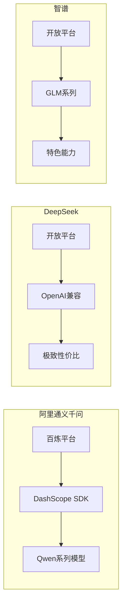
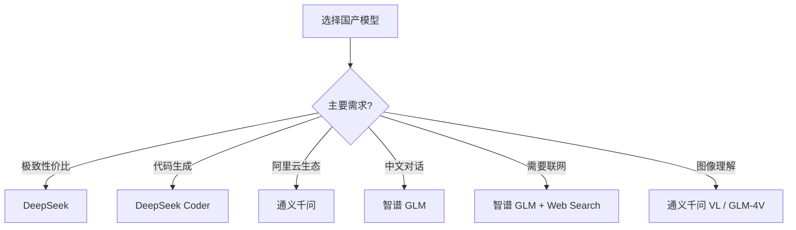

# 第3章 · 国产大模型 API 接入 — 通义千问、DeepSeek、智谱全解析

> **时长**：约 4 小时 ｜ **难度**：⭐⭐ ｜ **类型**：动手实操
>
> **目标**：掌握主流国产大模型的 API 调用方法，理解各平台的特点和差异

---

## 学习目标

学完本章后，你将能够：
- 接入阿里通义千问（Qwen）API
- 接入 DeepSeek API（极致性价比）
- 接入智谱 GLM API
- 了解百度文心一言、讯飞星火等其他平台
- 根据需求选择合适的国产模型

---

## 知识地图



---

# 第一部分：阿里通义千问（Qwen）

## 1、平台介绍

**通义千问**是阿里巴巴推出的大语言模型，通过**阿里云百炼平台**提供 API 服务。

**Qwen 模型系列**（2024-2025）：

| 模型 | 定位 | 上下文 | 特点 |
|------|------|--------|------|
| qwen-turbo | 快速响应 | 128K | 速度快、成本低 |
| qwen-plus | 均衡之选 | 128K | 能力与成本平衡 |
| qwen-max | 旗舰模型 | 32K | 最强能力 |
| qwen-max-longcontext | 长文本 | 28K | 处理长文档 |
| qwen-vl-plus | 多模态 | - | 图像理解 |
| qwen-coder-turbo | 代码专家 | 128K | 代码生成优化 |

**核心优势**：
- 中文能力强
- 开源版本可私有部署
- 与阿里云生态深度整合
- 价格相对便宜

---

## 2、账号注册与 API Key 获取

### 2.1 注册流程

1. 访问 [阿里云百炼平台](https://bailian.console.aliyun.com/)
2. 使用阿里云账号登录（或注册新账号）
3. 开通模型服务

### 2.2 获取 API Key

1. 进入百炼控制台
2. 点击右上角头像 → API-KEY 管理
3. 创建新的 API Key

```ini
# 保存到 .env 文件
DASHSCOPE_API_KEY=sk-xxxxxxxxxxxxxxxxxxxxxxxx
```

---

## 3、DashScope SDK 使用

### 3.1 安装 SDK

```bash
pip install dashscope
```

### 3.2 第一次调用

### ▶ 执行代码

```bash
cd code/03-国产大模型API
python 01_qwen_basic.py
```

```python
"""
01_qwen_basic.py
通义千问基础调用示例
"""
import os
from dotenv import load_dotenv
import dashscope
from dashscope import Generation

load_dotenv()

# 设置 API Key
dashscope.api_key = os.getenv("DASHSCOPE_API_KEY")

# 调用模型
response = Generation.call(
    model="qwen-turbo",
    messages=[
        {"role": "user", "content": "用一句话介绍通义千问"}
    ]
)

# 提取回复
if response.status_code == 200:
    print(response.output.text)
    print(f"\nToken 用量: {response.usage}")
else:
    print(f"错误: {response.code} - {response.message}")
```

### 3.3 OpenAI 兼容模式

**重点**：百炼平台提供 OpenAI 兼容接口，可以用 OpenAI SDK 调用！

```python
"""
02_qwen_openai_compatible.py
使用 OpenAI SDK 调用通义千问
"""
from openai import OpenAI

client = OpenAI(
    api_key=os.getenv("DASHSCOPE_API_KEY"),
    base_url="https://dashscope.aliyuncs.com/compatible-mode/v1"
)

response = client.chat.completions.create(
    model="qwen-turbo",
    messages=[
        {"role": "user", "content": "你好，介绍一下自己"}
    ]
)

print(response.choices[0].message.content)
```

### 3.4 多模态能力

```python
"""
03_qwen_vision.py
通义千问视觉能力示例
"""
from dashscope import MultiModalConversation

response = MultiModalConversation.call(
    model="qwen-vl-plus",
    messages=[
        {
            "role": "user",
            "content": [
                {"image": "https://example.com/image.jpg"},
                {"text": "描述这张图片"}
            ]
        }
    ]
)

print(response.output.choices[0].message.content[0]["text"])
```

---

# 第二部分：DeepSeek

## 4、平台介绍

**DeepSeek** 是一家专注于 AGI 研究的中国 AI 公司，以**极致的性价比**著称。

**DeepSeek 模型系列**：

| 模型 | 定位 | 价格 | 特点 |
|------|------|------|------|
| deepseek-chat | 通用对话 | 输入¥1/M，输出¥2/M | 综合能力强 |
| deepseek-coder | 代码专家 | 同上 | 代码能力出色 |
| deepseek-reasoner | 推理增强 | 较高 | 复杂推理任务 |

**核心优势**：
- **极致性价比**：价格仅为 GPT-4 的 1/50
- **OpenAI 兼容**：完全兼容 OpenAI API 格式
- 代码能力出色
- 支持 FIM（Fill-in-the-Middle）代码补全

---

## 5、DeepSeek API 接入

### 5.1 注册与获取 API Key

1. 访问 [DeepSeek 开放平台](https://platform.deepseek.com/)
2. 注册账号并实名认证
3. 获取 API Key

```ini
# 保存到 .env 文件
DEEPSEEK_API_KEY=sk-xxxxxxxxxxxxxxxxxxxxxxxx
DEEPSEEK_BASE_URL=https://api.deepseek.com
```

### 5.2 使用 OpenAI SDK 调用

**重点**：DeepSeek 完全兼容 OpenAI API，直接用 OpenAI SDK！

### ▶ 执行代码

```bash
python 04_deepseek_basic.py
```

```python
"""
04_deepseek_basic.py
DeepSeek 基础调用示例
"""
import os
from dotenv import load_dotenv
from openai import OpenAI

load_dotenv()

# 创建客户端（使用 OpenAI SDK）
client = OpenAI(
    api_key=os.getenv("DEEPSEEK_API_KEY"),
    base_url=os.getenv("DEEPSEEK_BASE_URL", "https://api.deepseek.com")
)

# 调用模型
response = client.chat.completions.create(
    model="deepseek-chat",
    messages=[
        {"role": "system", "content": "你是一个有帮助的助手"},
        {"role": "user", "content": "用一句话介绍 DeepSeek"}
    ],
    temperature=0.7
)

print(response.choices[0].message.content)
print(f"\nToken 用量: {response.usage}")
```

### 5.3 DeepSeek Coder

```python
"""
05_deepseek_coder.py
DeepSeek 代码能力示例
"""
from openai import OpenAI

client = OpenAI(
    api_key=os.getenv("DEEPSEEK_API_KEY"),
    base_url="https://api.deepseek.com"
)

response = client.chat.completions.create(
    model="deepseek-coder",
    messages=[
        {
            "role": "system",
            "content": "你是一个专业的 Python 程序员，编写高质量、有注释的代码。"
        },
        {
            "role": "user",
            "content": "实现一个 LRU 缓存类，支持 get 和 put 操作，时间复杂度 O(1)"
        }
    ],
    temperature=0
)

print(response.choices[0].message.content)
```

### 5.4 FIM 代码补全

**概念定义**：FIM（Fill-in-the-Middle）是一种特殊的代码补全模式，可以在代码中间插入内容。

```python
"""
06_deepseek_fim.py
DeepSeek FIM 代码补全示例
"""
from openai import OpenAI

client = OpenAI(
    api_key=os.getenv("DEEPSEEK_API_KEY"),
    base_url="https://api.deepseek.com/beta"  # 注意使用 beta 端点
)

# FIM 格式：<｜fim▁begin｜>前缀<｜fim▁hole｜>后缀<｜fim▁end｜>
prompt = """<｜fim▁begin｜>def fibonacci(n):
    if n <= 1:
        return n
    <｜fim▁hole｜>
    return fibonacci(n-1) + fibonacci(n-2)<｜fim▁end｜>"""

response = client.completions.create(
    model="deepseek-coder",
    prompt=prompt,
    max_tokens=100
)

print("补全结果:")
print(response.choices[0].text)
```

---

# 第三部分：智谱 GLM

## 6、平台介绍

**智谱 AI** 是清华大学孵化的 AI 公司，其 **GLM** 系列模型在中文场景表现优秀。

**GLM 模型系列**：

| 模型 | 定位 | 特点 |
|------|------|------|
| glm-4-plus | 旗舰模型 | 最强能力 |
| glm-4 | 标准模型 | 均衡之选 |
| glm-4-flash | 快速模型 | 速度快、成本低 |
| glm-4-air | 轻量模型 | 简单任务 |
| glm-4v-plus | 多模态 | 图像理解 |

**核心优势**：
- 中文理解能力强
- 学术背景深厚
- 支持联网搜索
- 代码能力不错

---

## 7、智谱 API 接入

### 7.1 注册与获取 API Key

1. 访问 [智谱开放平台](https://open.bigmodel.cn/)
2. 注册账号
3. 获取 API Key

```ini
# 保存到 .env 文件
ZHIPU_API_KEY=xxxxxxxxxxxxxxxxxxxxxxxx.xxxxxxxxxxxxxxxx
```

### 7.2 使用智谱 SDK

```bash
pip install zhipuai
```

### ▶ 执行代码

```bash
python 07_glm_basic.py
```

```python
"""
07_glm_basic.py
智谱 GLM 基础调用示例
"""
import os
from dotenv import load_dotenv
from zhipuai import ZhipuAI

load_dotenv()

client = ZhipuAI(api_key=os.getenv("ZHIPU_API_KEY"))

response = client.chat.completions.create(
    model="glm-4-flash",  # 免费模型
    messages=[
        {"role": "user", "content": "用一句话介绍智谱GLM"}
    ]
)

print(response.choices[0].message.content)
print(f"\nToken 用量: {response.usage}")
```

### 7.3 OpenAI 兼容模式

```python
"""
08_glm_openai_compatible.py
使用 OpenAI SDK 调用智谱 GLM
"""
from openai import OpenAI

client = OpenAI(
    api_key=os.getenv("ZHIPU_API_KEY"),
    base_url="https://open.bigmodel.cn/api/paas/v4/"
)

response = client.chat.completions.create(
    model="glm-4-flash",
    messages=[
        {"role": "user", "content": "你好"}
    ]
)

print(response.choices[0].message.content)
```

### 7.4 联网搜索能力

```python
"""
09_glm_web_search.py
智谱 GLM 联网搜索示例
"""
from zhipuai import ZhipuAI

client = ZhipuAI(api_key=os.getenv("ZHIPU_API_KEY"))

response = client.chat.completions.create(
    model="glm-4-plus",
    messages=[
        {"role": "user", "content": "今天的科技新闻有哪些？"}
    ],
    tools=[
        {
            "type": "web_search",
            "web_search": {
                "enable": True  # 启用联网搜索
            }
        }
    ]
)

print(response.choices[0].message.content)
```

---

# 第四部分：其他国产模型

## 8、百度文心一言

**文心一言** 是百度的大语言模型，通过百度智能云千帆平台提供服务。

```python
"""
10_ernie_basic.py
文心一言调用示例（需要先获取 Access Token）
"""
import requests

def get_access_token(api_key: str, secret_key: str) -> str:
    """获取 Access Token"""
    url = f"https://aip.baidubce.com/oauth/2.0/token?grant_type=client_credentials&client_id={api_key}&client_secret={secret_key}"
    response = requests.post(url)
    return response.json()["access_token"]

def chat_with_ernie(access_token: str, message: str) -> str:
    """调用文心一言"""
    url = f"https://aip.baidubce.com/rpc/2.0/ai_custom/v1/wenxinworkshop/chat/completions_pro?access_token={access_token}"
    
    response = requests.post(url, json={
        "messages": [{"role": "user", "content": message}]
    })
    
    return response.json()["result"]

# 使用示例
# token = get_access_token("your_api_key", "your_secret_key")
# result = chat_with_ernie(token, "你好")
```

## 9、讯飞星火

**星火大模型** 是科大讯飞的产品，在语音相关任务上有优势。

## 10、腾讯混元

**混元大模型** 是腾讯的产品，与腾讯云生态深度整合。

---

# 第五部分：选型指南

## 11、国产模型选型对比

| 维度 | 通义千问 | DeepSeek | 智谱 GLM |
|------|---------|----------|---------|
| **价格** | 中等 | 最低 | 中等 |
| **速度** | 快 | 快 | 中等 |
| **中文能力** | 强 | 强 | 很强 |
| **代码能力** | 强 | 很强 | 强 |
| **开源版本** | Qwen 开源 | DeepSeek 开源 | GLM 开源 |
| **生态整合** | 阿里云 | 独立 | 独立 |
| **特色功能** | 多模态 | FIM补全 | 联网搜索 |

## 12、场景推荐



---

## 常见踩坑

1. **API Key 格式不同**：智谱的 Key 格式是 `xxx.xxx`，有个点
2. **请求频率限制**：免费账户有 QPM 限制，注意处理 429 错误
3. **Token 计算差异**：各平台对中文的 Token 计算方式略有不同
4. **模型名称变化**：各平台经常更新模型版本，注意检查最新文档
5. **实名认证**：大部分平台需要实名认证才能使用

---

## 课后练习

1. **接入练习**：分别接入通义千问、DeepSeek、智谱，实现相同的翻译功能
2. **价格对比**：翻译同一段文本，对比三个平台的实际成本
3. **质量对比**：让三个模型回答同一个复杂问题，评估回答质量
4. **代码生成**：用 DeepSeek Coder 实现一个实用的小工具

---

## 本节小结

- ✅ 掌握了通义千问（Qwen）的 DashScope SDK 和 OpenAI 兼容调用
- ✅ 掌握了 DeepSeek 的极致性价比用法和 FIM 代码补全
- ✅ 掌握了智谱 GLM 的调用方式和联网搜索能力
- ✅ 了解了文心一言、星火等其他平台
- ✅ 学会了根据场景选择合适的国产模型

---

> **下一章**：第4章 · API 统一封装与切换 — 多模型适配层设计
