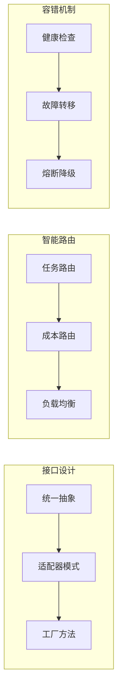

# 第4章 · API 统一封装与切换 — 多模型适配层设计

> **时长**：约 3 小时 ｜ **难度**：⭐⭐⭐ ｜ **类型**：工程实践
>
> **目标**：设计并实现多模型适配层，实现一套代码透明切换不同厂商的模型

---

## 学习目标

学完本章后，你将能够：
- 设计统一的 LLM 调用接口
- 实现多模型适配器模式
- 构建智能模型路由策略
- 实现故障转移和降级机制
- 建立成本监控体系

---

## 知识地图



---

## 1、为什么需要统一封装

### 1.1 多模型并存的现实

在实际项目中，往往需要同时使用多个模型：

| 场景 | 可能的选择 |
|------|-----------|
| 开发测试 | DeepSeek（便宜） |
| 简单任务 | gpt-4o-mini / qwen-turbo |
| 复杂任务 | gpt-4o / claude-3.5-sonnet |
| 代码生成 | deepseek-coder |
| 国内部署 | 通义千问 / 智谱GLM |

### 1.2 直接调用的痛点

```python
# ❌ 问题：散落的模型调用代码
if provider == "openai":
    from openai import OpenAI
    client = OpenAI()
    response = client.chat.completions.create(...)
    result = response.choices[0].message.content
elif provider == "claude":
    import anthropic
    client = anthropic.Anthropic()
    message = client.messages.create(...)
    result = message.content[0].text
elif provider == "qwen":
    # 又一套不同的代码...
```

**痛点**：
- 代码重复，维护困难
- 切换模型需要改业务代码
- 无法统一处理错误和监控
- 难以实现故障转移

---

## 2、统一接口设计

### ▶ 执行代码

```bash
cd code/04-统一封装
python 01_unified_interface.py
```

### 2.1 定义统一接口

```python
"""
01_unified_interface.py
统一 LLM 调用接口
"""
from abc import ABC, abstractmethod
from dataclasses import dataclass
from typing import List, Optional, Iterator


@dataclass
class Message:
    """统一消息格式"""
    role: str  # "system" | "user" | "assistant"
    content: str


@dataclass
class ChatResponse:
    """统一响应格式"""
    content: str
    model: str
    usage: dict  # {"input_tokens": int, "output_tokens": int}
    raw_response: any = None  # 原始响应（调试用）


class BaseLLM(ABC):
    """LLM 基类 - 定义统一接口"""

    @abstractmethod
    def chat(
        self,
        messages: List[Message],
        temperature: float = 0.7,
        max_tokens: int = 1000,
        **kwargs
    ) -> ChatResponse:
        """同步调用"""
        pass

    @abstractmethod
    def stream(
        self,
        messages: List[Message],
        temperature: float = 0.7,
        max_tokens: int = 1000,
        **kwargs
    ) -> Iterator[str]:
        """流式调用"""
        pass

    @property
    @abstractmethod
    def model_name(self) -> str:
        """模型名称"""
        pass
```

### 2.2 OpenAI 适配器

```python
class OpenAIAdapter(BaseLLM):
    """OpenAI 适配器"""

    def __init__(
        self,
        model: str = "gpt-4o-mini",
        api_key: str = None,
        base_url: str = None
    ):
        from openai import OpenAI
        self.model = model
        self.client = OpenAI(
            api_key=api_key or os.getenv("OPENAI_API_KEY"),
            base_url=base_url
        )

    @property
    def model_name(self) -> str:
        return self.model

    def chat(
        self,
        messages: List[Message],
        temperature: float = 0.7,
        max_tokens: int = 1000,
        **kwargs
    ) -> ChatResponse:
        # 转换消息格式
        openai_messages = [
            {"role": m.role, "content": m.content}
            for m in messages
        ]

        response = self.client.chat.completions.create(
            model=self.model,
            messages=openai_messages,
            temperature=temperature,
            max_tokens=max_tokens,
            **kwargs
        )

        return ChatResponse(
            content=response.choices[0].message.content,
            model=response.model,
            usage={
                "input_tokens": response.usage.prompt_tokens,
                "output_tokens": response.usage.completion_tokens
            },
            raw_response=response
        )

    def stream(
        self,
        messages: List[Message],
        temperature: float = 0.7,
        max_tokens: int = 1000,
        **kwargs
    ) -> Iterator[str]:
        openai_messages = [
            {"role": m.role, "content": m.content}
            for m in messages
        ]

        stream = self.client.chat.completions.create(
            model=self.model,
            messages=openai_messages,
            temperature=temperature,
            max_tokens=max_tokens,
            stream=True,
            **kwargs
        )

        for chunk in stream:
            if chunk.choices[0].delta.content:
                yield chunk.choices[0].delta.content
```

### 2.3 Claude 适配器

```python
class ClaudeAdapter(BaseLLM):
    """Claude 适配器"""

    def __init__(
        self,
        model: str = "claude-3-5-sonnet-20241022",
        api_key: str = None
    ):
        import anthropic
        self.model = model
        self.client = anthropic.Anthropic(
            api_key=api_key or os.getenv("ANTHROPIC_API_KEY")
        )

    @property
    def model_name(self) -> str:
        return self.model

    def chat(
        self,
        messages: List[Message],
        temperature: float = 0.7,
        max_tokens: int = 1000,
        **kwargs
    ) -> ChatResponse:
        # 分离 system 消息（Claude 特殊处理）
        system_content = None
        other_messages = []

        for m in messages:
            if m.role == "system":
                system_content = m.content
            else:
                other_messages.append({"role": m.role, "content": m.content})

        response = self.client.messages.create(
            model=self.model,
            max_tokens=max_tokens,
            temperature=temperature,
            system=system_content,
            messages=other_messages,
            **kwargs
        )

        return ChatResponse(
            content=response.content[0].text,
            model=response.model,
            usage={
                "input_tokens": response.usage.input_tokens,
                "output_tokens": response.usage.output_tokens
            },
            raw_response=response
        )

    def stream(
        self,
        messages: List[Message],
        temperature: float = 0.7,
        max_tokens: int = 1000,
        **kwargs
    ) -> Iterator[str]:
        system_content = None
        other_messages = []

        for m in messages:
            if m.role == "system":
                system_content = m.content
            else:
                other_messages.append({"role": m.role, "content": m.content})

        with self.client.messages.stream(
            model=self.model,
            max_tokens=max_tokens,
            temperature=temperature,
            system=system_content,
            messages=other_messages,
            **kwargs
        ) as stream:
            for text in stream.text_stream:
                yield text
```

---

## 3、工厂方法创建实例

### ▶ 执行代码

```bash
python 02_llm_factory.py
```

```python
"""
02_llm_factory.py
LLM 工厂 - 统一创建入口
"""

class LLMFactory:
    """LLM 工厂类"""

    # 预定义的模型配置
    PRESETS = {
        # OpenAI 系列
        "gpt-4o": {"provider": "openai", "model": "gpt-4o"},
        "gpt-4o-mini": {"provider": "openai", "model": "gpt-4o-mini"},

        # Claude 系列
        "claude-sonnet": {"provider": "claude", "model": "claude-3-5-sonnet-20241022"},
        "claude-haiku": {"provider": "claude", "model": "claude-3-haiku-20240307"},

        # DeepSeek（使用 OpenAI 适配器）
        "deepseek": {
            "provider": "openai",
            "model": "deepseek-chat",
            "base_url": "https://api.deepseek.com",
            "api_key_env": "DEEPSEEK_API_KEY"
        },
        "deepseek-coder": {
            "provider": "openai",
            "model": "deepseek-coder",
            "base_url": "https://api.deepseek.com",
            "api_key_env": "DEEPSEEK_API_KEY"
        },

        # 通义千问
        "qwen-turbo": {
            "provider": "openai",
            "model": "qwen-turbo",
            "base_url": "https://dashscope.aliyuncs.com/compatible-mode/v1",
            "api_key_env": "DASHSCOPE_API_KEY"
        },

        # 智谱
        "glm-4-flash": {
            "provider": "openai",
            "model": "glm-4-flash",
            "base_url": "https://open.bigmodel.cn/api/paas/v4/",
            "api_key_env": "ZHIPU_API_KEY"
        },
    }

    @classmethod
    def create(cls, name_or_config: str | dict) -> BaseLLM:
        """
        创建 LLM 实例

        Args:
            name_or_config: 预设名称（如 "gpt-4o-mini"）或配置字典

        Returns:
            BaseLLM 实例
        """
        if isinstance(name_or_config, str):
            if name_or_config not in cls.PRESETS:
                raise ValueError(f"未知的预设: {name_or_config}")
            config = cls.PRESETS[name_or_config]
        else:
            config = name_or_config

        provider = config["provider"]
        model = config["model"]

        if provider == "openai":
            return OpenAIAdapter(
                model=model,
                api_key=os.getenv(config.get("api_key_env", "OPENAI_API_KEY")),
                base_url=config.get("base_url")
            )
        elif provider == "claude":
            return ClaudeAdapter(
                model=model,
                api_key=os.getenv(config.get("api_key_env", "ANTHROPIC_API_KEY"))
            )
        else:
            raise ValueError(f"未知的提供商: {provider}")


# 使用示例
if __name__ == "__main__":
    # 创建不同的 LLM 实例
    llm_mini = LLMFactory.create("gpt-4o-mini")
    llm_deepseek = LLMFactory.create("deepseek")
    llm_qwen = LLMFactory.create("qwen-turbo")

    # 统一的调用方式！
    messages = [Message(role="user", content="你好，介绍一下自己")]

    for llm in [llm_mini, llm_deepseek, llm_qwen]:
        print(f"\n--- {llm.model_name} ---")
        response = llm.chat(messages)
        print(response.content[:100] + "...")
```

---

## 4、智能模型路由

### ▶ 执行代码

```bash
python 03_model_router.py
```

```python
"""
03_model_router.py
智能模型路由器
"""

class ModelRouter:
    """根据任务特征选择最佳模型"""

    def __init__(self):
        self.llms = {
            "fast": LLMFactory.create("gpt-4o-mini"),
            "smart": LLMFactory.create("gpt-4o"),
            "code": LLMFactory.create("deepseek-coder"),
            "cheap": LLMFactory.create("deepseek"),
            "chinese": LLMFactory.create("qwen-turbo"),
        }

    def route(
        self,
        messages: List[Message],
        task_type: str = "general",
        priority: str = "balanced"
    ) -> BaseLLM:
        """
        根据任务类型和优先级选择模型

        Args:
            messages: 消息列表
            task_type: 任务类型 (general/code/chinese/complex)
            priority: 优先级 (speed/quality/cost)
        """
        # 基于任务类型的路由
        if task_type == "code":
            return self.llms["code"]
        elif task_type == "chinese":
            return self.llms["chinese"]
        elif task_type == "complex":
            return self.llms["smart"]

        # 基于优先级的路由
        if priority == "speed":
            return self.llms["fast"]
        elif priority == "cost":
            return self.llms["cheap"]
        elif priority == "quality":
            return self.llms["smart"]

        # 默认返回性价比最高的
        return self.llms["fast"]

    def chat(
        self,
        messages: List[Message],
        task_type: str = "general",
        priority: str = "balanced",
        **kwargs
    ) -> ChatResponse:
        """智能路由并调用"""
        llm = self.route(messages, task_type, priority)
        return llm.chat(messages, **kwargs)


# 使用示例
router = ModelRouter()

# 代码任务自动路由到 deepseek-coder
code_response = router.chat(
    [Message("user", "实现快速排序")],
    task_type="code"
)

# 追求速度路由到 gpt-4o-mini
fast_response = router.chat(
    [Message("user", "你好")],
    priority="speed"
)
```

---

## 5、故障转移机制

### ▶ 执行代码

```bash
python 04_fallback_chain.py
```

```python
"""
04_fallback_chain.py
故障转移链
"""
import time
from typing import List


class FallbackChain:
    """故障转移链 - 主模型失败时自动切换到备用模型"""

    def __init__(self, llms: List[BaseLLM], max_retries: int = 2):
        self.llms = llms
        self.max_retries = max_retries
        self.health_status = {llm.model_name: True for llm in llms}

    def chat(self, messages: List[Message], **kwargs) -> ChatResponse:
        """带故障转移的调用"""
        last_error = None

        for llm in self.llms:
            # 跳过不健康的模型
            if not self.health_status.get(llm.model_name, True):
                continue

            for attempt in range(self.max_retries):
                try:
                    response = llm.chat(messages, **kwargs)
                    # 成功，标记为健康
                    self.health_status[llm.model_name] = True
                    return response

                except Exception as e:
                    last_error = e
                    print(f"⚠️ {llm.model_name} 调用失败 (第{attempt+1}次): {e}")

                    if attempt < self.max_retries - 1:
                        time.sleep(2 ** attempt)  # 指数退避

            # 该模型重试失败，标记为不健康
            print(f"❌ {llm.model_name} 标记为不健康，切换到下一个模型")
            self.health_status[llm.model_name] = False

        # 所有模型都失败
        raise Exception(f"所有模型都失败: {last_error}")


# 使用示例
fallback = FallbackChain([
    LLMFactory.create("gpt-4o-mini"),  # 首选
    LLMFactory.create("deepseek"),      # 备选1
    LLMFactory.create("qwen-turbo"),    # 备选2
])

# 自动处理故障转移
response = fallback.chat([Message("user", "你好")])
```

---

## 6、成本监控

```python
"""
05_cost_tracker.py
成本追踪器
"""
from datetime import datetime


class CostTracker:
    """API 调用成本追踪"""

    # 价格配置（美元/1M tokens）
    PRICING = {
        "gpt-4o": {"input": 2.5, "output": 10},
        "gpt-4o-mini": {"input": 0.15, "output": 0.6},
        "claude-3-5-sonnet-20241022": {"input": 3, "output": 15},
        "deepseek-chat": {"input": 0.14, "output": 0.28},
        "qwen-turbo": {"input": 0.3, "output": 0.6},
    }

    def __init__(self):
        self.records = []
        self.total_cost = 0

    def record(self, response: ChatResponse):
        """记录一次调用"""
        pricing = self.PRICING.get(response.model, {"input": 1, "output": 2})

        input_cost = response.usage["input_tokens"] * pricing["input"] / 1_000_000
        output_cost = response.usage["output_tokens"] * pricing["output"] / 1_000_000
        total = input_cost + output_cost

        record = {
            "timestamp": datetime.now(),
            "model": response.model,
            "input_tokens": response.usage["input_tokens"],
            "output_tokens": response.usage["output_tokens"],
            "cost": total
        }

        self.records.append(record)
        self.total_cost += total

        return record

    def summary(self) -> dict:
        """生成统计摘要"""
        by_model = {}
        for r in self.records:
            model = r["model"]
            if model not in by_model:
                by_model[model] = {"calls": 0, "cost": 0}
            by_model[model]["calls"] += 1
            by_model[model]["cost"] += r["cost"]

        return {
            "total_calls": len(self.records),
            "total_cost": self.total_cost,
            "by_model": by_model
        }
```

---

## 常见踩坑

1. **API Key 环境变量名不一致**：统一管理环境变量命名
2. **响应格式差异**：注意 OpenAI 和 Claude 的响应结构不同
3. **超时设置**：不同模型响应时间差异大，设置合理的超时
4. **并发限制**：各平台有不同的 QPM 限制
5. **错误类型不同**：需要捕获各平台特定的异常类型

---

## 本节小结

- ✅ 设计了统一的 LLM 调用接口（BaseLLM）
- ✅ 实现了 OpenAI、Claude 等适配器
- ✅ 构建了工厂方法，支持预设配置
- ✅ 实现了智能模型路由（按任务/优先级）
- ✅ 实现了故障转移链机制
- ✅ 建立了成本监控体系

---

> **下一章**：第5章 · 流式输出与实时响应 — SSE 协议深度实践
