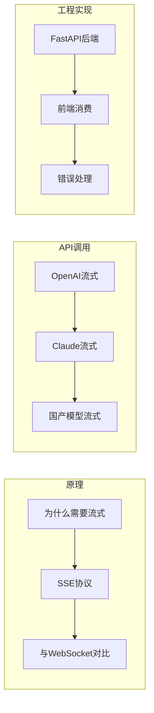

# 第5章 · 流式输出与实时响应 — SSE 协议深度实践

> **时长**：约 3 小时 ｜ **难度**：⭐⭐⭐ ｜ **类型**：工程实践
>
> **目标**：掌握流式输出的原理和实现，构建实时响应的 AI 应用

---

## 学习目标

学完本章后，你将能够：
- 理解流式输出的原理和价值
- 使用 OpenAI/Claude/国产模型的流式 API
- 理解 SSE（Server-Sent Events）协议
- 用 FastAPI 构建流式响应后端
- 在前端实现打字机效果

---

## 知识地图



---

## 1、为什么需要流式输出

### 1.1 用户体验对比

| 方式 | 用户感受 | 适用场景 |
|------|---------|---------|
| 同步（invoke） | 请求后白屏等待 5-10 秒 | 后台任务、批处理 |
| 流式（stream） | 立即看到文字逐渐出现 | 对话界面、实时交互 |

**核心价值**：模型生成 500 字需要约 10 秒。同步调用让用户干等，流式输出让用户边看边等，感知等待时间大大缩短。

### 1.2 时间分解

```
同步调用时间线：
[------- 10秒 -------][显示]
用户视角：等了10秒才看到结果

流式调用时间线：
[字][字][字][字][字]...[字][完成]
用户视角：立即开始看到内容，心理上只"等"了1秒
```

---

## 2、流式 API 调用

### ▶ 执行代码

```bash
cd code/05-流式输出
python 01_stream_basic.py
```

### 2.1 OpenAI 流式调用

```python
"""
01_stream_basic.py
各平台流式输出基础示例
"""
from openai import OpenAI

client = OpenAI()

# 流式调用
stream = client.chat.completions.create(
    model="gpt-4o-mini",
    messages=[{"role": "user", "content": "写一首关于春天的诗"}],
    stream=True  # 开启流式
)

# 逐块读取
print("回复: ", end="")
for chunk in stream:
    # 每个 chunk 只包含一小段文本
    content = chunk.choices[0].delta.content
    if content:
        print(content, end="", flush=True)

print("\n[完成]")
```

### 2.2 Claude 流式调用

```python
import anthropic

client = anthropic.Anthropic()

# 方式1：使用 with 语句
with client.messages.stream(
    model="claude-3-5-sonnet-20241022",
    max_tokens=1000,
    messages=[{"role": "user", "content": "写一首关于春天的诗"}]
) as stream:
    for text in stream.text_stream:
        print(text, end="", flush=True)

# 方式2：手动处理事件
stream = client.messages.create(
    model="claude-3-5-sonnet-20241022",
    max_tokens=1000,
    messages=[{"role": "user", "content": "你好"}],
    stream=True
)

for event in stream:
    if event.type == "content_block_delta":
        print(event.delta.text, end="", flush=True)
```

### 2.3 流式响应结构

**OpenAI 流式数据格式**：
```json
{"id":"chatcmpl-xxx","choices":[{"delta":{"content":"你"},"index":0}]}
{"id":"chatcmpl-xxx","choices":[{"delta":{"content":"好"},"index":0}]}
{"id":"chatcmpl-xxx","choices":[{"delta":{},"finish_reason":"stop"}]}
```

**关键点**：
- 每个 chunk 的 `delta.content` 只包含增量内容
- 最后一个 chunk 的 `finish_reason` 指示结束原因
- 需要自己拼接完整内容

---

## 3、SSE 协议详解

### 3.1 什么是 SSE

**概念定义**：SSE（Server-Sent Events）是 HTTP 协议上的单向服务器推送技术。服务器可以持续向客户端推送数据。

### 3.2 SSE vs WebSocket

| 特性 | SSE | WebSocket |
|------|-----|-----------|
| 方向 | 单向（服务器→客户端） | 双向 |
| 协议 | HTTP | 独立协议(ws://) |
| 复杂度 | 简单 | 较复杂 |
| 自动重连 | 内置 | 需自己实现 |
| 适用场景 | 服务器推送、流式响应 | 实时聊天、游戏 |

**结论**：LLM 流式输出选 SSE，因为只需要服务器单向推送。

### 3.3 SSE 数据格式

```
event: message
data: {"content": "你好"}

event: message
data: {"content": "世界"}

event: done
data: [DONE]
```

**规则**：
- 每条消息以 `\n\n` 分隔
- `event:` 指定事件类型（可选）
- `data:` 包含实际数据
- `id:` 消息ID（可选，用于重连）

---

## 4、FastAPI 流式后端

### ▶ 执行代码

```bash
python 02_fastapi_stream.py
# 然后访问 http://localhost:8000/docs 测试
```

```python
"""
02_fastapi_stream.py
FastAPI 流式响应服务
"""
from fastapi import FastAPI
from fastapi.responses import StreamingResponse
from pydantic import BaseModel
from openai import OpenAI
import json

app = FastAPI()
client = OpenAI()


class ChatRequest(BaseModel):
    message: str
    model: str = "gpt-4o-mini"


def generate_stream(message: str, model: str):
    """生成器函数 - 产生 SSE 格式数据"""
    stream = client.chat.completions.create(
        model=model,
        messages=[{"role": "user", "content": message}],
        stream=True
    )

    for chunk in stream:
        content = chunk.choices[0].delta.content
        if content:
            # SSE 格式：data: {json}\n\n
            yield f"data: {json.dumps({'content': content})}\n\n"

    # 结束标记
    yield "data: [DONE]\n\n"


@app.post("/chat/stream")
async def chat_stream(request: ChatRequest):
    """流式聊天接口"""
    return StreamingResponse(
        generate_stream(request.message, request.model),
        media_type="text/event-stream",
        headers={
            "Cache-Control": "no-cache",
            "Connection": "keep-alive",
        }
    )


@app.get("/")
async def root():
    return {"message": "流式 API 服务已启动，访问 /docs 查看接口文档"}


if __name__ == "__main__":
    import uvicorn
    uvicorn.run(app, host="0.0.0.0", port=8000)
```

---

## 5、前端流式消费

### 5.1 使用 fetch + ReadableStream

```html
<!-- 03_frontend_stream.html -->
<!DOCTYPE html>
<html>
<head>
    <title>流式聊天演示</title>
    <style>
        #output {
            white-space: pre-wrap;
            border: 1px solid #ccc;
            padding: 10px;
            min-height: 200px;
            font-family: monospace;
        }
        .cursor {
            animation: blink 1s infinite;
        }
        @keyframes blink {
            50% { opacity: 0; }
        }
    </style>
</head>
<body>
    <h1>流式输出演示</h1>
    <input type="text" id="input" placeholder="输入消息..." style="width: 300px;">
    <button onclick="sendMessage()">发送</button>
    <div id="output"></div>

    <script>
    async function sendMessage() {
        const input = document.getElementById('input').value;
        const output = document.getElementById('output');
        output.textContent = '';

        try {
            const response = await fetch('/chat/stream', {
                method: 'POST',
                headers: { 'Content-Type': 'application/json' },
                body: JSON.stringify({ message: input })
            });

            const reader = response.body.getReader();
            const decoder = new TextDecoder();

            while (true) {
                const { done, value } = await reader.read();
                if (done) break;

                const text = decoder.decode(value);
                const lines = text.split('\n');

                for (const line of lines) {
                    if (line.startsWith('data: ')) {
                        const data = line.slice(6);
                        if (data === '[DONE]') {
                            output.textContent += '\n[完成]';
                        } else {
                            try {
                                const json = JSON.parse(data);
                                output.textContent += json.content;
                            } catch (e) {}
                        }
                    }
                }
            }
        } catch (error) {
            output.textContent = '错误: ' + error.message;
        }
    }
    </script>
</body>
</html>
```

### 5.2 使用 EventSource（原生 SSE）

```javascript
// EventSource 方式（仅支持 GET 请求）
const eventSource = new EventSource('/chat/stream?message=' + encodeURIComponent(input));

eventSource.onmessage = (event) => {
    if (event.data === '[DONE]') {
        eventSource.close();
    } else {
        const data = JSON.parse(event.data);
        output.textContent += data.content;
    }
};

eventSource.onerror = (error) => {
    console.error('SSE 错误:', error);
    eventSource.close();
};
```

---

## 6、流式输出的错误处理

```python
"""
04_stream_error_handling.py
流式输出错误处理
"""
from openai import OpenAI, APIError


def stream_with_error_handling(message: str):
    """带错误处理的流式调用"""
    client = OpenAI()
    full_content = ""

    try:
        stream = client.chat.completions.create(
            model="gpt-4o-mini",
            messages=[{"role": "user", "content": message}],
            stream=True,
            timeout=30
        )

        for chunk in stream:
            content = chunk.choices[0].delta.content
            if content:
                full_content += content
                yield content

    except APIError as e:
        # API 错误
        yield f"\n[错误: {e.message}]"

    except Exception as e:
        # 其他错误（网络中断等）
        yield f"\n[连接中断: {str(e)}]"

    finally:
        # 返回完整内容（可用于日志记录）
        print(f"\n[完整内容长度: {len(full_content)}字]")
```

---

## 7、流式输出的中断处理

```python
"""
05_stream_cancellation.py
流式输出中断处理
"""
import asyncio
from openai import AsyncOpenAI


async def stream_with_cancellation(message: str, cancel_event: asyncio.Event):
    """支持中断的异步流式调用"""
    client = AsyncOpenAI()

    stream = await client.chat.completions.create(
        model="gpt-4o-mini",
        messages=[{"role": "user", "content": message}],
        stream=True
    )

    async for chunk in stream:
        # 检查是否需要取消
        if cancel_event.is_set():
            print("\n[用户取消]")
            break

        content = chunk.choices[0].delta.content
        if content:
            yield content


# FastAPI 中处理取消
@app.post("/chat/stream/cancellable")
async def chat_stream_cancellable(request: ChatRequest):
    async def generate():
        async for chunk in stream_with_cancellation(request.message, cancel_event):
            yield f"data: {json.dumps({'content': chunk})}\n\n"
        yield "data: [DONE]\n\n"

    return StreamingResponse(generate(), media_type="text/event-stream")
```

---

## 常见踩坑

1. **忘记 flush**：`print(content, end="", flush=True)` 必须加 `flush=True`
2. **SSE 格式错误**：每条消息必须以 `\n\n` 结尾
3. **CORS 问题**：跨域需要配置 `Access-Control-Allow-Origin`
4. **超时问题**：流式响应需要设置更长的超时时间
5. **代理问题**：某些代理/CDN 会缓冲 SSE，需要配置 `X-Accel-Buffering: no`

---

## 本节小结

- ✅ 理解了流式输出的价值（用户体验）
- ✅ 掌握了 OpenAI/Claude 的流式 API
- ✅ 理解了 SSE 协议及其数据格式
- ✅ 学会用 FastAPI 构建流式响应后端
- ✅ 实现了前端的流式消费和打字机效果
- ✅ 掌握了错误处理和中断机制

---

> **下一章**：第6章 · Function Calling 机制 — 让 LLM 调用外部工具
