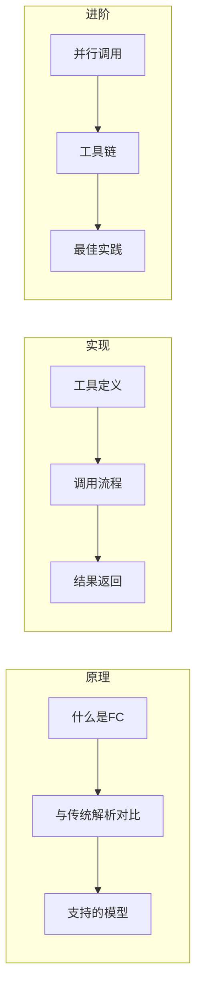
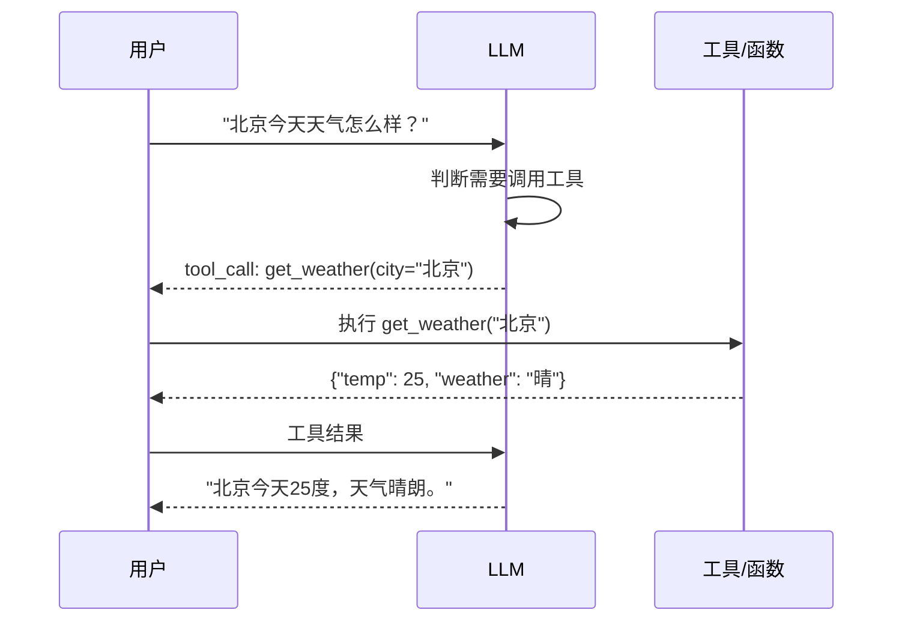

# 第6章 · Function Calling 机制 — 让 LLM 调用外部工具

> **时长**：约 4 小时 ｜ **难度**：⭐⭐⭐ ｜ **类型**：动手实操
>
> **目标**：深入理解 Function Calling 机制，学会定义工具并实现完整的调用循环

---

## 学习目标

学完本章后，你将能够：
- 理解 Function Calling 的工作原理
- 使用 JSON Schema 定义工具参数
- 实现完整的工具调用循环
- 处理并行工具调用
- 设计高质量的工具描述

---

## 知识地图



---

## 1、Function Calling 概述

### 1.1 什么是 Function Calling

**概念定义**：Function Calling（函数调用/工具调用）是一种让 LLM 决定何时调用外部函数、并生成调用参数的机制。



### 1.2 与传统解析方式对比

| 方式 | 实现 | 问题 |
|------|------|------|
| 关键词匹配 | `if "天气" in text` | 不灵活，容易误判 |
| 正则提取 | 正则表达式解析 | 复杂，难维护 |
| Prompt 约定 | 让LLM输出JSON | 格式不稳定 |
| **Function Calling** | 原生支持 | ✅ 可靠、结构化 |

**核心优势**：
- 模型原生支持，参数格式保证正确
- 模型自动判断何时需要调用工具
- 支持多工具选择和并行调用

### 1.3 支持 Function Calling 的模型

| 厂商 | 模型 | 支持程度 |
|------|------|---------|
| OpenAI | gpt-4o, gpt-4o-mini | ✅ 完整支持 |
| Anthropic | claude-3 系列 | ✅ 完整支持 |
| DeepSeek | deepseek-chat | ✅ 支持 |
| 阿里 | qwen 系列 | ✅ 支持 |
| 智谱 | glm-4 系列 | ✅ 支持 |

---

## 2、工具定义规范

### 2.1 JSON Schema 基础

工具参数使用 JSON Schema 定义：

```python
{
    "type": "function",
    "function": {
        "name": "get_weather",                    # 函数名
        "description": "获取指定城市的天气信息",    # 描述（重要！）
        "parameters": {                           # 参数 Schema
            "type": "object",
            "properties": {
                "city": {
                    "type": "string",
                    "description": "城市名称，如：北京"
                },
                "unit": {
                    "type": "string",
                    "enum": ["celsius", "fahrenheit"],
                    "description": "温度单位"
                }
            },
            "required": ["city"]                  # 必填参数
        }
    }
}
```

### 2.2 参数类型详解

| 类型 | 说明 | 示例 |
|------|------|------|
| `string` | 字符串 | `"北京"` |
| `number` | 数字 | `25.5` |
| `integer` | 整数 | `100` |
| `boolean` | 布尔值 | `true` |
| `array` | 数组 | `["a", "b"]` |
| `object` | 嵌套对象 | `{"key": "value"}` |
| `enum` | 枚举值 | 限定可选值 |

### ▶ 执行代码

```bash
cd code/06-Function-Calling
python 01_tool_definition.py
```

```python
"""
01_tool_definition.py
工具定义示例
"""

# 示例1：简单工具
weather_tool = {
    "type": "function",
    "function": {
        "name": "get_weather",
        "description": "获取指定城市的当前天气信息。当用户询问天气相关问题时使用此工具。",
        "parameters": {
            "type": "object",
            "properties": {
                "city": {
                    "type": "string",
                    "description": "城市名称，如：北京、上海、广州"
                }
            },
            "required": ["city"]
        }
    }
}

# 示例2：带枚举的工具
search_tool = {
    "type": "function",
    "function": {
        "name": "search_web",
        "description": "搜索互联网获取实时信息。当用户询问新闻、时事或需要最新数据时使用。",
        "parameters": {
            "type": "object",
            "properties": {
                "query": {
                    "type": "string",
                    "description": "搜索关键词"
                },
                "search_type": {
                    "type": "string",
                    "enum": ["web", "news", "images"],
                    "description": "搜索类型"
                },
                "max_results": {
                    "type": "integer",
                    "description": "返回结果数量，默认5",
                    "default": 5
                }
            },
            "required": ["query"]
        }
    }
}

# 示例3：复杂嵌套参数
create_event_tool = {
    "type": "function",
    "function": {
        "name": "create_calendar_event",
        "description": "创建日历事件",
        "parameters": {
            "type": "object",
            "properties": {
                "title": {"type": "string", "description": "事件标题"},
                "start_time": {"type": "string", "description": "开始时间，ISO格式"},
                "end_time": {"type": "string", "description": "结束时间，ISO格式"},
                "attendees": {
                    "type": "array",
                    "items": {"type": "string"},
                    "description": "参与者邮箱列表"
                },
                "location": {
                    "type": "object",
                    "properties": {
                        "name": {"type": "string"},
                        "address": {"type": "string"}
                    },
                    "description": "地点信息"
                }
            },
            "required": ["title", "start_time"]
        }
    }
}
```

---

## 3、完整调用流程

### ▶ 执行代码

```bash
python 02_function_calling_basic.py
```

```python
"""
02_function_calling_basic.py
Function Calling 完整流程
"""
import json
from openai import OpenAI

client = OpenAI()

# 1. 定义工具
tools = [
    {
        "type": "function",
        "function": {
            "name": "get_weather",
            "description": "获取指定城市的天气",
            "parameters": {
                "type": "object",
                "properties": {
                    "city": {"type": "string", "description": "城市名"}
                },
                "required": ["city"]
            }
        }
    }
]

# 2. 实现工具函数
def get_weather(city: str) -> dict:
    """实际的天气查询函数（模拟）"""
    # 实际应用中这里调用真实的天气 API
    weather_data = {
        "北京": {"temp": 22, "weather": "晴", "humidity": 45},
        "上海": {"temp": 26, "weather": "多云", "humidity": 60},
        "广州": {"temp": 30, "weather": "雨", "humidity": 80},
    }
    return weather_data.get(city, {"error": f"未找到城市: {city}"})


def process_tool_call(tool_call) -> str:
    """处理工具调用"""
    name = tool_call.function.name
    args = json.loads(tool_call.function.arguments)

    if name == "get_weather":
        result = get_weather(args["city"])
    else:
        result = {"error": f"未知工具: {name}"}

    return json.dumps(result, ensure_ascii=False)


# 3. 完整调用流程
def chat_with_tools(user_message: str):
    messages = [{"role": "user", "content": user_message}]

    # 第一次调用：让模型决定是否使用工具
    response = client.chat.completions.create(
        model="gpt-4o-mini",
        messages=messages,
        tools=tools
    )

    assistant_message = response.choices[0].message

    # 检查是否需要调用工具
    if assistant_message.tool_calls:
        print(f"[模型决定调用工具]")

        # 将助手消息加入历史
        messages.append(assistant_message)

        # 处理每个工具调用
        for tool_call in assistant_message.tool_calls:
            print(f"  工具: {tool_call.function.name}")
            print(f"  参数: {tool_call.function.arguments}")

            # 执行工具
            result = process_tool_call(tool_call)
            print(f"  结果: {result}")

            # 将工具结果加入消息
            messages.append({
                "role": "tool",
                "tool_call_id": tool_call.id,
                "content": result
            })

        # 第二次调用：让模型基于工具结果生成最终回复
        final_response = client.chat.completions.create(
            model="gpt-4o-mini",
            messages=messages,
            tools=tools
        )

        return final_response.choices[0].message.content
    else:
        # 不需要工具，直接返回
        return assistant_message.content


# 测试
if __name__ == "__main__":
    # 需要工具的问题
    print("用户: 北京今天天气怎么样？")
    print("AI:", chat_with_tools("北京今天天气怎么样？"))

    print("\n" + "="*50 + "\n")

    # 不需要工具的问题
    print("用户: 你好")
    print("AI:", chat_with_tools("你好"))
```

---

## 4、并行工具调用

当模型同时需要多个工具时，会返回多个 tool_calls：

### ▶ 执行代码

```bash
python 03_parallel_tool_calls.py
```

```python
"""
03_parallel_tool_calls.py
并行工具调用示例
"""
import json
from openai import OpenAI

client = OpenAI()

tools = [
    {
        "type": "function",
        "function": {
            "name": "get_weather",
            "description": "获取城市天气",
            "parameters": {
                "type": "object",
                "properties": {
                    "city": {"type": "string"}
                },
                "required": ["city"]
            }
        }
    },
    {
        "type": "function",
        "function": {
            "name": "get_time",
            "description": "获取城市当前时间",
            "parameters": {
                "type": "object",
                "properties": {
                    "city": {"type": "string"}
                },
                "required": ["city"]
            }
        }
    }
]


def execute_tool(name: str, args: dict) -> str:
    if name == "get_weather":
        return json.dumps({"temp": 25, "weather": "晴"})
    elif name == "get_time":
        return json.dumps({"time": "14:30", "timezone": "UTC+8"})
    return json.dumps({"error": "未知工具"})


def chat_with_parallel_tools(user_message: str):
    messages = [{"role": "user", "content": user_message}]

    response = client.chat.completions.create(
        model="gpt-4o-mini",
        messages=messages,
        tools=tools,
        parallel_tool_calls=True  # 允许并行调用（默认开启）
    )

    assistant_message = response.choices[0].message

    if assistant_message.tool_calls:
        print(f"[并行调用 {len(assistant_message.tool_calls)} 个工具]")
        messages.append(assistant_message)

        # 处理所有工具调用
        for tool_call in assistant_message.tool_calls:
            name = tool_call.function.name
            args = json.loads(tool_call.function.arguments)
            print(f"  - {name}({args})")

            result = execute_tool(name, args)
            messages.append({
                "role": "tool",
                "tool_call_id": tool_call.id,
                "content": result
            })

        # 生成最终回复
        final = client.chat.completions.create(
            model="gpt-4o-mini",
            messages=messages,
            tools=tools
        )
        return final.choices[0].message.content

    return assistant_message.content


# 测试并行调用
print("用户: 北京现在几点了？天气怎么样？")
print("AI:", chat_with_parallel_tools("北京现在几点了？天气怎么样？"))
```

---

## 5、强制工具调用

使用 `tool_choice` 参数控制工具调用行为：

```python
# 自动决定（默认）
response = client.chat.completions.create(
    model="gpt-4o-mini",
    messages=messages,
    tools=tools,
    tool_choice="auto"  # 模型自己决定
)

# 强制不使用工具
response = client.chat.completions.create(
    model="gpt-4o-mini",
    messages=messages,
    tools=tools,
    tool_choice="none"  # 禁止使用工具
)

# 强制使用特定工具
response = client.chat.completions.create(
    model="gpt-4o-mini",
    messages=messages,
    tools=tools,
    tool_choice={
        "type": "function",
        "function": {"name": "get_weather"}  # 强制调用这个工具
    }
)

# 强制必须使用某个工具（任意一个）
response = client.chat.completions.create(
    model="gpt-4o-mini",
    messages=messages,
    tools=tools,
    tool_choice="required"  # 必须调用工具
)
```

---

## 6、工具描述最佳实践

### 6.1 好的工具描述

```python
# ✅ 好的描述
{
    "name": "search_products",
    "description": """搜索商品数据库。

使用场景：
- 用户询问某类商品
- 用户想比较不同商品
- 用户需要商品推荐

不适用：
- 用户询问订单状态（使用 get_order_status）
- 用户想退货（使用 create_return）""",
    "parameters": {
        "type": "object",
        "properties": {
            "query": {
                "type": "string",
                "description": "搜索关键词，如：'红色连衣裙'、'苹果手机'"
            },
            "category": {
                "type": "string",
                "enum": ["服装", "电子", "食品", "家居"],
                "description": "商品类别，可选"
            },
            "price_max": {
                "type": "number",
                "description": "最高价格（元），可选"
            }
        },
        "required": ["query"]
    }
}
```

### 6.2 描述写作原则

| 原则 | 说明 |
|------|------|
| 说明**何时使用** | 列出适用场景 |
| 说明**何时不用** | 避免误调用 |
| 参数给示例 | 让模型知道格式 |
| 用中文描述 | 与用户语言一致 |

---

## 7、实战案例：多工具 Agent

### ▶ 执行代码

```bash
python 04_multi_tool_agent.py
```

```python
"""
04_multi_tool_agent.py
多工具 Agent 实战
"""
import json
from datetime import datetime
from openai import OpenAI

client = OpenAI()

# 定义多个工具
tools = [
    {
        "type": "function",
        "function": {
            "name": "get_current_time",
            "description": "获取当前时间",
            "parameters": {"type": "object", "properties": {}}
        }
    },
    {
        "type": "function",
        "function": {
            "name": "calculate",
            "description": "执行数学计算",
            "parameters": {
                "type": "object",
                "properties": {
                    "expression": {
                        "type": "string",
                        "description": "数学表达式，如：2+3*4"
                    }
                },
                "required": ["expression"]
            }
        }
    },
    {
        "type": "function",
        "function": {
            "name": "search_knowledge",
            "description": "搜索知识库",
            "parameters": {
                "type": "object",
                "properties": {
                    "query": {"type": "string", "description": "搜索词"}
                },
                "required": ["query"]
            }
        }
    }
]


def execute_function(name: str, args: dict) -> str:
    """执行工具函数"""
    if name == "get_current_time":
        return json.dumps({
            "time": datetime.now().strftime("%Y-%m-%d %H:%M:%S"),
            "timezone": "UTC+8"
        })

    elif name == "calculate":
        try:
            # 安全执行数学表达式
            result = eval(args["expression"], {"__builtins__": {}})
            return json.dumps({"result": result})
        except Exception as e:
            return json.dumps({"error": str(e)})

    elif name == "search_knowledge":
        # 模拟知识库搜索
        return json.dumps({
            "results": [
                {"title": "Python 教程", "snippet": "Python 是一种编程语言..."},
                {"title": "机器学习入门", "snippet": "机器学习是 AI 的子领域..."}
            ]
        })

    return json.dumps({"error": "未知工具"})


class MultiToolAgent:
    """多工具 Agent"""

    def __init__(self):
        self.messages = [
            {"role": "system", "content": "你是一个有多种能力的助手。可以查时间、计算和搜索知识。"}
        ]

    def chat(self, user_input: str) -> str:
        self.messages.append({"role": "user", "content": user_input})

        # 可能需要多轮工具调用
        while True:
            response = client.chat.completions.create(
                model="gpt-4o-mini",
                messages=self.messages,
                tools=tools
            )

            assistant_message = response.choices[0].message

            if assistant_message.tool_calls:
                self.messages.append(assistant_message)

                for tool_call in assistant_message.tool_calls:
                    name = tool_call.function.name
                    args = json.loads(tool_call.function.arguments)
                    result = execute_function(name, args)

                    self.messages.append({
                        "role": "tool",
                        "tool_call_id": tool_call.id,
                        "content": result
                    })
            else:
                # 没有工具调用，返回最终结果
                self.messages.append(assistant_message)
                return assistant_message.content


# 测试
if __name__ == "__main__":
    agent = MultiToolAgent()

    questions = [
        "现在几点了？",
        "计算 (15 + 27) * 3",
        "帮我搜索一下 Python 相关的知识"
    ]

    for q in questions:
        print(f"用户: {q}")
        print(f"AI: {agent.chat(q)}")
        print()
```

---

## 常见踩坑

1. **忘记返回 tool_call_id**：每个工具结果必须对应一个 tool_call_id
2. **参数解析失败**：`function.arguments` 是字符串，需要 `json.loads()`
3. **工具描述太简单**：描述不清会导致模型误调用
4. **没有处理工具错误**：工具执行失败时要返回错误信息
5. **循环调用**：设置最大工具调用次数，防止无限循环

---

## 本节小结

- ✅ 理解了 Function Calling 的工作原理
- ✅ 掌握了 JSON Schema 定义工具参数
- ✅ 实现了完整的工具调用循环
- ✅ 学会了并行工具调用和强制调用
- ✅ 掌握了工具描述的最佳实践
- ✅ 实现了多工具 Agent

---

## 模块总结

恭喜完成 **模块4：大模型 API 调用实战**！

你已经掌握了：
- ✅ OpenAI API 完整使用
- ✅ Claude API 及其独特优势
- ✅ 国产大模型（通义千问、DeepSeek、智谱）接入
- ✅ 多模型统一封装与智能路由
- ✅ 流式输出与 SSE 协议
- ✅ Function Calling 工具调用机制

---

> **下一模块**：模块5 · Prompt Engineering 提示词工程 — 与大模型高效沟通的艺术
