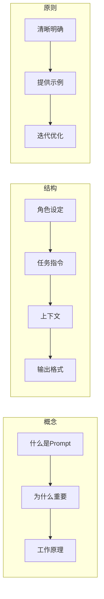
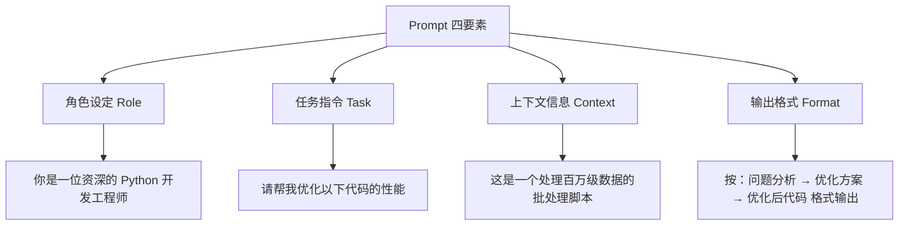

# 第1章 · Prompt 基础与原理 — 理解大模型的输入艺术

> **时长**：约 3 小时 ｜ **难度**：⭐⭐ ｜ **类型**：理论 + 实践
>
> **目标**：理解 Prompt 的本质，掌握提示词的基本构成和设计原则

---

## 学习目标

学完本章后，你将能够：
- 理解 Prompt 在大模型中的核心作用
- 掌握 Prompt 的基本结构和组成部分
- 了解 Prompt 与模型交互的底层原理
- 编写清晰、有效的基础 Prompt

---

## 知识地图



---

## 1、什么是 Prompt

### 1.1 定义

**概念定义**：Prompt（提示词）是你发送给大语言模型的输入文本，用于引导模型生成你期望的输出。

**核心定位**：Prompt 是与 AI 沟通的唯一接口——同样的模型，不同的 Prompt，输出质量天差地别。Prompt Engineering 不是"调参"，而是与 AI 高效沟通的核心技能。

```
┌─────────────────────────────────────────────────────────┐
│                        Prompt                            │
│  "请用简洁的语言解释什么是机器学习，适合初学者理解"          │
└─────────────────────────────────────────────────────────┘
                            ↓
┌─────────────────────────────────────────────────────────┐
│                      大语言模型                          │
│                    (GPT-4, Claude等)                    │
└─────────────────────────────────────────────────────────┘
                            ↓
┌─────────────────────────────────────────────────────────┐
│                        输出                              │
│  "机器学习是让计算机通过数据自动学习和改进的技术..."        │
└─────────────────────────────────────────────────────────┘
```

### 1.2 Prompt 的重要性

**同样的模型，不同的 Prompt，结果天差地别：**

| Prompt | 输出质量 |
|--------|---------|
| "写代码" | ❌ 模糊，不知道写什么 |
| "用 Python 写一个函数" | ⚠️ 稍好，但缺少具体需求 |
| "用 Python 写一个计算斐波那契数列的函数，要求使用递归实现，并添加注释" | ✅ 清晰具体，输出高质量 |

**关键认知**：Prompt Engineering 不是"调参"，而是与 AI 高效沟通的技能。

### 1.3 Prompt 的工作原理

**概念定义**：大语言模型本质上是**下一个 Token 预测器**——根据前文预测后文。你的 Prompt 就是"前文"，前文越清晰，后文预测越准确。

```python
# 模型看到的是 Token 序列
输入: ["请", "解释", "什么", "是", "Python"]
预测: ["Python", "是", "一种", "编程", "语言", "..."]
```

**理解这个原理很重要**：
- 模型根据前文预测后文
- 你的 Prompt 就是"前文"
- 前文越清晰，预测越准确

---

## 2、Prompt 的基本结构

一个完整的 Prompt 通常包含以下部分：

### 2.1 四要素模型

**概念定义**：一个完整的 Prompt 由四个要素组成——角色设定（Role）、任务指令（Task）、上下文信息（Context）、输出格式（Format）。四要素越完整，模型输出越精准。



### 2.2 各要素详解

#### 角色设定 (Role)

设定角色可以激活模型特定领域的知识：

```python
# 不设定角色
prompt = "解释量子计算"

# 设定角色
prompt = """你是一位量子物理学教授，擅长用通俗易懂的比喻解释复杂概念。
请解释量子计算的基本原理。"""
```

**常用角色设定**：
- 技术专家：`你是一位有10年经验的后端架构师`
- 教育者：`你是一位耐心的编程老师，擅长用简单的例子解释复杂概念`
- 审核者：`你是一位严格的代码审查员，专注于发现潜在问题`

#### 任务指令 (Task)

使用**动词开头**，明确指出要做什么：

| 动词 | 适用场景 |
|------|---------|
| 解释/说明 | 概念讲解 |
| 分析/评估 | 内容分析 |
| 生成/创建/编写 | 内容创作 |
| 总结/概括 | 信息压缩 |
| 比较/对比 | 差异分析 |
| 转换/翻译 | 格式转换 |
| 优化/改进 | 内容增强 |

#### 上下文信息 (Context)

提供背景信息帮助模型理解：

```python
# 缺少上下文
prompt = "这段代码有什么问题？"

# 提供上下文
prompt = """背景：这是一个高并发的订单处理系统，每秒处理约1000个请求。
目前遇到的问题：CPU 使用率过高。

请分析以下代码可能存在的性能问题：
[代码]"""
```

#### 输出格式 (Format)

明确指定期望的输出格式：

```python
prompt = """请分析这段代码的问题。

输出格式要求：
1. 问题列表：以编号列出所有发现的问题
2. 严重程度：每个问题标注（高/中/低）
3. 修复建议：每个问题给出具体的修复方案
4. 修复后代码：提供完整的修复后代码"""
```

---

## 3、Prompt 设计原则

### 3.1 清晰明确原则

**避免模糊表述**：

```python
# ❌ 模糊
"帮我改改这个代码"

# ✅ 明确
"请将这段 Python 代码重构为符合 PEP8 规范的格式，并添加类型注解"
```

### 3.2 具体详细原则

**提供足够的细节**：

```python
# ❌ 过于简单
"写一个排序函数"

# ✅ 具体详细
"""编写一个 Python 排序函数，要求：
1. 使用快速排序算法
2. 支持自定义比较函数
3. 处理空列表的边界情况
4. 添加类型注解
5. 包含单元测试用例"""
```

### 3.3 结构化原则

**使用清晰的结构组织内容**：

```python
prompt = """
## 任务
将以下英文技术文档翻译成中文。

## 要求
- 保持专业术语的准确性
- 代码块不翻译
- 保持原文的格式结构

## 原文
{text}

## 输出
请直接输出翻译结果，不需要额外解释。
"""
```

### 3.4 渐进式原则

**复杂任务分步骤处理**：

```python
# ❌ 一步到位（容易出错）
"分析这份报告并生成一份完整的改进方案"

# ✅ 分步骤
"""请按以下步骤处理：

Step 1: 首先阅读报告，列出其中的关键数据点
Step 2: 分析数据反映的问题
Step 3: 针对每个问题提出改进建议
Step 4: 整合成完整的改进方案

请一步一步来。"""
```

---

## 4、实践示例

### ▶ 执行代码

```bash
cd code/01-基础原理
python 01_basic_prompt.py
```

```python
"""
01_basic_prompt.py
Prompt 基础示例
"""
import os
from openai import OpenAI
from dotenv import load_dotenv

load_dotenv()

client = OpenAI()


def compare_prompts():
    """对比不同 Prompt 的效果"""

    # 模糊的 Prompt
    vague_prompt = "写个函数"

    # 清晰的 Prompt
    clear_prompt = """请用 Python 编写一个函数，要求：
1. 功能：计算列表中所有偶数的和
2. 参数：接收一个整数列表
3. 返回：偶数之和
4. 处理：空列表返回 0
5. 添加函数文档字符串"""

    print("=" * 60)
    print("【模糊 Prompt】")
    print("=" * 60)
    print(f"Prompt: {vague_prompt}\n")

    response1 = client.chat.completions.create(
        model="gpt-4o-mini",
        messages=[{"role": "user", "content": vague_prompt}],
        max_tokens=200
    )
    print(f"回复:\n{response1.choices[0].message.content}\n")

    print("=" * 60)
    print("【清晰 Prompt】")
    print("=" * 60)
    print(f"Prompt: {clear_prompt}\n")

    response2 = client.chat.completions.create(
        model="gpt-4o-mini",
        messages=[{"role": "user", "content": clear_prompt}],
        max_tokens=500
    )
    print(f"回复:\n{response2.choices[0].message.content}")


def role_demo():
    """演示角色设定的效果"""
    question = "什么是递归？"

    roles = [
        ("无角色", None),
        ("技术专家", "你是一位资深软件工程师，善于用精准的技术语言解释概念。"),
        ("启蒙老师", "你是一位幼儿园老师，擅长用小朋友能理解的方式解释任何概念。"),
    ]

    print("\n" + "=" * 60)
    print("【角色设定对比】")
    print("=" * 60)
    print(f"问题: {question}\n")

    for role_name, system_prompt in roles:
        messages = []
        if system_prompt:
            messages.append({"role": "system", "content": system_prompt})
        messages.append({"role": "user", "content": question})

        response = client.chat.completions.create(
            model="gpt-4o-mini",
            messages=messages,
            max_tokens=150
        )

        print(f"--- {role_name} ---")
        print(f"{response.choices[0].message.content}\n")


if __name__ == "__main__":
    if not os.getenv("OPENAI_API_KEY"):
        print("请设置 OPENAI_API_KEY 环境变量")
        exit()

    compare_prompts()
    role_demo()
```

---

## 常见踩坑

1. **过度简化**：像"代码"、"帮帮我"、"这个怎么弄"这类 Prompt 太模糊，模型猜不到你要什么。正确做法是提供足够信息，如"请用 Python 实现一个读取 CSV 文件并计算每列平均值的脚本"。
2. **过度复杂**：一次塞太多要求（如"写一个完整的电商系统…"），模型难以全面覆盖。正确做法是将大任务拆解为小任务，逐步推进。
3. **假设模型知道上下文**：像"把它改成异步的"——模型不知道"它"指什么。必须明确指代，提供完整上下文。
4. **忽略输出格式**：不指定格式，模型可能输出冗长的解释而非简洁结果。始终明确期望的输出格式。
5. **温度设置不当**：创意任务用低温（如 0.1），确定性任务用高温（如 0.9）——这会导致输出质量严重下降。创意任务用高温，确定性任务用低温。

---

## 课后练习

1. 分别用"模糊 Prompt"和"清晰 Prompt"让 LLM 完成同一个任务，对比输出质量差异
2. 尝试不同的角色设定（技术专家 vs 幼儿园老师），让 LLM 解释同一个概念，观察差异
3. 按四要素模型（角色 + 任务 + 上下文 + 格式）编写一个完整的 Prompt，评估效果
4. 找一个你之前用过的不够好的 Prompt，用本章学到的原则进行优化

---

## 本节小结

- ✅ 理解了 Prompt 是与大模型沟通的核心
- ✅ 掌握了 Prompt 的四要素：角色、任务、上下文、格式
- ✅ 学会了清晰、具体、结构化、渐进式的设计原则
- ✅ 了解了常见的 Prompt 编写误区

---

> **下一章**：第2章 · 提示词设计模式 — 经典模式与最佳实践
