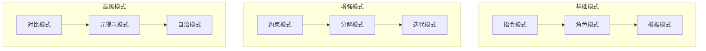

# 第2章 · 提示词设计模式 — 经典模式与最佳实践

> **时长**：约 4 小时 ｜ **难度**：⭐⭐⭐ ｜ **类型**：实践
>
> **目标**：掌握常用的提示词设计模式，形成可复用的 Prompt 模板库

---

## 学习目标

学完本章后，你将能够：
- 掌握 10+ 种经典 Prompt 设计模式
- 根据任务类型选择合适的模式
- 组合多种模式解决复杂问题
- 建立自己的 Prompt 模板库

---

## 知识地图



---

## 1、指令模式 (Instruction Pattern)

### 1.1 模式说明

**概念定义**：指令模式是最基础的 Prompt 模式，直接给出明确的动作指令。格式为 `[动词] + [对象] + [条件/约束]`。

**核心定位**：适用于大部分简单任务，是 Prompt Engineering 的基本功。指令越具体、约束越明确，输出越符合预期。

### 1.2 示例

```python
# 基础形式
"总结以下文章的要点"

# 增强形式
"总结以下文章的要点，使用3-5个要点，每个要点不超过20字"

# 完整形式
"""请总结以下文章的要点。

要求：
- 提取 3-5 个核心要点
- 每个要点不超过 20 字
- 使用编号列表格式
- 按重要性排序

文章内容：
{article}"""
```

### 1.3 适用场景

- 简单的生成任务
- 翻译、总结、改写
- 格式转换

---

## 2、角色扮演模式 (Persona Pattern)

### 2.1 模式说明

**概念定义**：角色扮演模式让模型扮演特定角色，以激活相关领域的知识和语言风格。格式为 `你是 [角色]，你的特点是 [特征]，你擅长 [能力]`。

**核心定位**：不同角色会调用模型训练数据中不同领域的知识——同样是解释"递归"，幼儿园老师和技术专家的输出完全不同。

### 2.2 示例

```python
# 技术专家
"""你是一位有 15 年经验的 Python 架构师。
你的代码风格简洁高效，注重可维护性。
你习惯用设计模式解决复杂问题。

请审查以下代码并提出改进建议：
{code}"""

# 产品经理
"""你是一位经验丰富的产品经理，擅长用户需求分析。
你总是从用户价值角度思考问题。

请分析以下功能需求的合理性：
{requirement}"""

# 面试官
"""你是一位严格的技术面试官，专注于考察候选人的编程基础。
你会追问细节，不放过任何模糊的回答。

请评估以下面试答案的质量：
{answer}"""
```

### 2.3 角色组合

```python
"""在这次讨论中，你需要同时扮演两个角色：

角色A - 产品经理：关注用户价值和业务目标
角色B - 技术负责人：关注技术可行性和成本

请从这两个角度分析以下需求，并给出综合建议：
{requirement}"""
```

---

## 3、模板填充模式 (Template Pattern)

### 3.1 模式说明

提供一个结构化模板，让模型按模板填充内容。

### 3.2 示例

```python
# 代码文档生成模板
"""请为以下函数生成文档，按照此模板填充：

## 函数名
{自动填充}

## 功能描述
{一句话描述函数的功能}

## 参数说明
| 参数名 | 类型 | 必填 | 说明 |
|--------|------|------|------|
{填充参数表格}

## 返回值
{描述返回值}

## 使用示例
```python
{生成示例代码}
```

## 注意事项
{列出使用时需要注意的点}

---
待生成文档的函数：
{function_code}"""
```

```python
# 周报模板
"""请根据我提供的工作内容，按以下模板生成周报：

# 本周工作总结

## 完成的工作
- [ ] {工作项1}
- [ ] {工作项2}

## 遇到的问题
{问题描述}

## 下周计划
1. {计划1}
2. {计划2}

## 需要的支持
{如有需要协调的事项}

---
本周工作内容：
{my_work}"""
```

---

## 4、约束模式 (Constraint Pattern)

### 4.1 模式说明

通过添加约束条件来限定输出范围和格式。

### 4.2 约束类型

| 约束类型 | 示例 |
|---------|------|
| 长度约束 | "回答不超过100字" |
| 格式约束 | "以 JSON 格式输出" |
| 内容约束 | "只讨论技术问题" |
| 语言约束 | "使用中文回答" |
| 风格约束 | "使用正式的商务语言" |
| 禁止约束 | "不要使用代码示例" |

### 4.3 示例

```python
"""请回答以下问题。

约束条件：
1. 回答长度：100-200字
2. 语言风格：专业但易懂
3. 必须包含：具体数据或案例
4. 禁止：使用"可能"、"也许"等模糊词
5. 格式：分点列出

问题：{question}"""
```

```python
# 代码生成的约束
"""请生成代码，遵守以下约束：

✅ 必须：
- 使用 Python 3.10+ 语法
- 添加类型注解
- 包含错误处理
- 添加日志记录

❌ 禁止：
- 不使用全局变量
- 不使用 eval/exec
- 不硬编码配置

需求：{requirement}"""
```

---

## 5、分解模式 (Decomposition Pattern)

### 5.1 模式说明

将复杂任务分解为多个简单步骤。

### 5.2 示例

```python
"""请按以下步骤完成任务：

Step 1: 理解需求
- 阅读需求描述
- 列出功能点

Step 2: 设计方案
- 确定技术选型
- 设计数据结构

Step 3: 编写代码
- 实现核心逻辑
- 添加错误处理

Step 4: 测试验证
- 编写测试用例
- 验证边界情况

请一步一步完成，每步完成后显示结果。

任务：{task}"""
```

```python
# 分析任务的分解
"""请分析这个系统设计问题，按以下框架回答：

1. 需求澄清（5个关键问题）
2. 高层设计（系统架构图）
3. 核心组件（详细设计）
4. 数据模型（表结构/Schema）
5. 扩展性考虑（如何支持10倍流量）

问题：设计一个短链接服务"""
```

---

## 6、对比模式 (Comparison Pattern)

### 6.1 模式说明

让模型对比分析多个选项或方案。

### 6.2 示例

```python
"""请对比以下两种技术方案：

方案A：使用 Redis 做缓存
方案B：使用本地缓存

对比维度：
1. 性能（响应时间、吞吐量）
2. 可靠性（故障恢复、数据一致性）
3. 成本（运维成本、硬件成本）
4. 复杂度（实现难度、学习成本）

输出格式：
| 维度 | 方案A | 方案B | 推荐 |
|------|-------|-------|------|
请填充表格并给出最终推荐。"""
```

```python
# 代码对比
"""对比以下两段代码的优劣：

代码A：
{code_a}

代码B：
{code_b}

请从以下角度分析：
- 可读性
- 性能
- 可维护性
- 安全性

并给出改进建议。"""
```

---

## 7、迭代优化模式 (Iterative Pattern)

### 7.1 模式说明

通过多轮对话逐步完善输出。

### 7.2 示例

```python
# 第一轮：生成初稿
"""请写一段产品介绍文案，产品是一款 AI 编程助手。
先写一个初稿，不需要太完美。"""

# 第二轮：指出问题
"""这个初稿不错，但有以下问题：
1. 开头不够吸引人
2. 没有突出核心卖点
3. 缺少行动号召

请针对这些问题进行修改。"""

# 第三轮：精细调整
"""现在好多了。请再做以下调整：
- 把"提升效率"换成具体数字"提升50%效率"
- 结尾加上限时优惠信息"""
```

### 7.3 自动迭代

```python
"""请生成一段代码，然后自我审查并改进。

任务：实现一个 LRU 缓存

流程：
1. 先写出第一版代码
2. 审查代码，列出3个可改进的点
3. 根据改进点重写代码
4. 确认最终版本

请执行完整流程。"""
```

---

## 8、元提示模式 (Meta-Prompt Pattern)

### 8.1 模式说明

**概念定义**：元提示模式让 LLM 帮你优化或生成 Prompt——用 AI 来提升你与 AI 沟通的效率。这是 Prompt Engineering 的"元技能"。

### 8.2 示例

```python
"""你是一位 Prompt Engineering 专家。

我想让 AI 帮我写技术博客，但不知道怎么写提示词。

请帮我设计一个高质量的 Prompt，需要：
1. 能生成结构清晰的技术文章
2. 适合初中级开发者阅读
3. 包含代码示例
4. 有实际应用场景

请直接给出可用的 Prompt 模板。"""
```

```python
# 改进现有 Prompt
"""请评估并改进以下 Prompt：

原始 Prompt：
"帮我写个 Python 脚本"

请从以下角度改进：
1. 明确性
2. 具体性
3. 可执行性

输出改进后的 Prompt 并解释改进点。"""
```

---

## 9、自洽检验模式 (Self-Consistency Pattern)

### 9.1 模式说明

让模型验证自己的输出是否正确。

### 9.2 示例

```python
"""请完成以下任务，并进行自我验证：

任务：计算 1+2+3+...+100 的和

要求：
1. 先给出答案
2. 用不同方法验证（公式法、编程法）
3. 如果结果不一致，找出错误并修正
4. 给出最终确认的答案"""
```

```python
# 代码验证
"""请编写代码并验证其正确性：

任务：实现二分查找

要求：
1. 编写函数代码
2. 设计测试用例（至少5个）
3. 执行测试并检查结果
4. 如有问题，修复并重新测试
5. 确认所有测试通过后输出最终代码"""
```

---

## 10、链式组合模式

### 10.1 模式组合示例

```python
"""
【角色设定】
你是一位资深的代码审查专家。

【任务分解】
请按以下步骤审查代码：

Step 1: 快速浏览，了解代码功能
Step 2: 检查代码规范和风格
Step 3: 分析潜在的 bug 和安全问题
Step 4: 评估性能和可维护性
Step 5: 给出综合评分和改进建议

【输出模板】
## 代码概述
{一句话描述代码功能}

## 问题列表
| 行号 | 问题类型 | 严重程度 | 描述 |
|------|---------|---------|------|

## 改进建议
1. ...
2. ...

## 综合评分
- 功能正确性：?/10
- 代码规范：?/10
- 安全性：?/10
- 总分：?/10

【约束条件】
- 每个问题必须指出具体行号
- 严重程度分为：高/中/低
- 给出具体的修复代码示例

【待审查代码】
{code}
"""
```

---

## 常见踩坑

1. **模式生搬硬套**：根据任务选择合适模式，不要为了用模式而用
2. **约束过多**：太多约束会限制模型发挥，保持平衡
3. **模板太死板**：给模型一定的发挥空间
4. **忽略迭代**：复杂任务需要多轮优化，一步到位很难

---

## 课后练习

1. 选择一个你日常工作中的常见任务，分别用指令模式、角色模式、模板模式编写 Prompt，对比效果
2. 用分解模式将一个复杂任务拆解为 4-5 个子步骤，观察 LLM 每步的输出质量
3. 用元提示模式让 LLM 帮你优化一个你之前写过的 Prompt，对比优化前后的差异
4. 将至少两种模式组合使用（如角色 + 约束 + 模板），形成一个可复用的 Prompt 模板

---

## 本节小结

- ✅ 掌握了指令、角色、模板等基础模式
- ✅ 学会了约束、分解、对比等增强模式
- ✅ 了解了元提示、自洽检验等高级模式
- ✅ 学会组合多种模式解决复杂问题

---

> **下一章**：第3章 · 少样本学习 — Few-shot Prompting 的艺术
