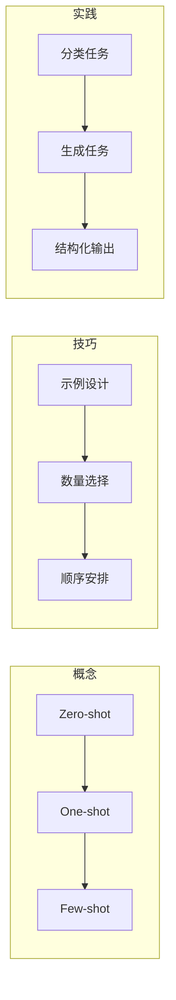

# 第3章 · 少样本学习 — Few-shot Prompting 的艺术

> **时长**：约 3 小时 ｜ **难度**：⭐⭐⭐ ｜ **类型**：实践
>
> **目标**：掌握 Few-shot Learning，学会通过示例引导模型

---

## 学习目标

学完本章后，你将能够：
- 理解 Zero-shot、One-shot、Few-shot 的区别
- 掌握高质量示例的设计原则
- 学会选择最佳的示例数量和顺序
- 解决 Few-shot 常见的失效问题

---

## 知识地图



---

## 1、理解 Few-shot Learning

### 1.1 三种模式对比

**概念定义**：Few-shot Learning（少样本学习）通过在 Prompt 中提供示例来引导模型理解任务格式和期望输出。根据示例数量分为 Zero-shot（0个）、One-shot（1个）、Few-shot（2-10个）。

| 模式 | 示例数量 | 特点 | 适用场景 |
|------|---------|------|---------|
| Zero-shot | 0 | 直接提问，依赖模型通用能力 | 简单任务 |
| One-shot | 1 | 一个示例，快速展示格式 | 格式明确的任务 |
| Few-shot | 2-10 | 多个示例，充分引导 | 复杂任务、特定风格 |

### 1.2 图解说明

```
Zero-shot（零样本）
┌─────────────────────────────────────┐
│  任务描述                            │
│  "将以下句子翻译成英文：你好世界"     │
└─────────────────────────────────────┘

One-shot（单样本）
┌─────────────────────────────────────┐
│  任务描述 + 1个示例                  │
│  示例：你好 → Hello                  │
│  任务：你好世界 → ?                  │
└─────────────────────────────────────┘

Few-shot（少样本）
┌─────────────────────────────────────┐
│  任务描述 + 多个示例                  │
│  示例1：你好 → Hello                 │
│  示例2：谢谢 → Thank you             │
│  示例3：再见 → Goodbye               │
│  任务：你好世界 → ?                   │
└─────────────────────────────────────┘
```

### 1.3 为什么 Few-shot 有效

**In-Context Learning（上下文学习）**：

模型在"阅读"示例时，学会了：
1. 输入的格式
2. 输出的格式
3. 输入到输出的转换规则
4. 任务的风格和特点

---

## 2、Few-shot 示例设计

### 2.1 示例格式

**标准格式**：

```python
prompt = """任务：判断评论的情感是正面还是负面。

示例1：
评论：这个产品太棒了，强烈推荐！
情感：正面

示例2：
评论：质量太差，用了一天就坏了。
情感：负面

示例3：
评论：价格还行，但包装有点简陋。
情感：负面

现在请判断：
评论：{user_review}
情感："""
```

**JSON 格式**：

```python
prompt = """任务：从文本中提取实体信息。

示例1：
输入：张三在北京大学学习计算机科学。
输出：{"人名": "张三", "地点": "北京大学", "专业": "计算机科学"}

示例2：
输入：李四是腾讯的软件工程师。
输出：{"人名": "李四", "公司": "腾讯", "职位": "软件工程师"}

现在请处理：
输入：{user_text}
输出："""
```

### 2.2 示例选择原则

**1. 代表性**：覆盖常见情况

```python
# ❌ 示例不够代表性
示例1：我很开心 → 正面
示例2：我很高兴 → 正面
示例3：我很快乐 → 正面
# 全是正面示例，模型学不到什么是负面

# ✅ 有代表性的示例
示例1：产品很好用 → 正面
示例2：质量太差了 → 负面
示例3：一般般吧 → 中性
```

**2. 多样性**：覆盖不同类型

```python
# 文本分类任务，确保各类别都有示例
类别分布：
- 正面：2个示例
- 负面：2个示例
- 中性：2个示例
```

**3. 相关性**：与目标任务相似

```python
# ❌ 示例与任务不相关
任务：分析技术博客的质量
示例1：美食评论分析
示例2：电影评论分析

# ✅ 示例与任务相关
任务：分析技术博客的质量
示例1：一篇好的 Python 教程分析
示例2：一篇差的 API 文档分析
```

### 2.3 示例数量选择

| 示例数量 | 优点 | 缺点 | 建议场景 |
|---------|------|------|---------|
| 1-2 | 节省 Token，快速 | 引导不足 | 简单格式任务 |
| 3-5 | 平衡效果和成本 | - | 大多数任务 |
| 6-10 | 引导充分 | 消耗 Token，可能过拟合 | 复杂任务 |
| 10+ | - | 过于冗长 | 很少使用 |

---

## 3、Few-shot 实战

### ▶ 执行代码

```bash
cd code/03-Few-shot
python 01_few_shot_classification.py
```

```python
"""
01_few_shot_classification.py
Few-shot 分类任务示例
"""
import os
from openai import OpenAI
from dotenv import load_dotenv

load_dotenv()

client = OpenAI()


def zero_shot_vs_few_shot():
    """对比 Zero-shot 和 Few-shot 效果"""

    # 测试用例（一些边界情况）
    test_cases = [
        "还行吧，不太满意也不太失望",  # 中性
        "便宜是便宜，但质量一般",     # 偏负面
        "包装精美，送货也快",         # 正面
    ]

    # Zero-shot Prompt
    zero_shot_prompt = """判断以下评论的情感倾向（正面/负面/中性）：

评论：{review}
情感："""

    # Few-shot Prompt
    few_shot_prompt = """判断评论的情感倾向。

示例1：
评论：非常满意，下次还会购买！
情感：正面

示例2：
评论：质量太差，申请退款了
情感：负面

示例3：
评论：一般般，没有惊喜也没有失望
情感：中性

示例4：
评论：性价比还可以，但包装有待提高
情感：中性

现在请判断：
评论：{review}
情感："""

    print("=" * 60)
    print("【Zero-shot vs Few-shot 效果对比】")
    print("=" * 60)

    for review in test_cases:
        print(f"\n评论: {review}")

        # Zero-shot
        r1 = client.chat.completions.create(
            model="gpt-4o-mini",
            messages=[{"role": "user", "content": zero_shot_prompt.format(review=review)}],
            max_tokens=10
        )
        print(f"  Zero-shot: {r1.choices[0].message.content.strip()}")

        # Few-shot
        r2 = client.chat.completions.create(
            model="gpt-4o-mini",
            messages=[{"role": "user", "content": few_shot_prompt.format(review=review)}],
            max_tokens=10
        )
        print(f"  Few-shot:  {r2.choices[0].message.content.strip()}")


def few_shot_entity_extraction():
    """Few-shot 实体提取"""

    prompt = """从文本中提取人名、地点和组织。

示例1：
文本：马云在杭州创立了阿里巴巴。
结果：人名=马云, 地点=杭州, 组织=阿里巴巴

示例2：
文本：雷军是小米公司的创始人，总部在北京。
结果：人名=雷军, 地点=北京, 组织=小米公司

示例3：
文本：昨天天气很好。
结果：人名=无, 地点=无, 组织=无

现在请提取：
文本：{text}
结果："""

    test_texts = [
        "张一鸣在北京创办了字节跳动。",
        "上海是中国最大的城市。",
        "任正非领导的华为公司总部在深圳。",
    ]

    print("\n" + "=" * 60)
    print("【Few-shot 实体提取】")
    print("=" * 60)

    for text in test_texts:
        response = client.chat.completions.create(
            model="gpt-4o-mini",
            messages=[{"role": "user", "content": prompt.format(text=text)}],
            max_tokens=50
        )
        print(f"\n文本: {text}")
        print(f"结果: {response.choices[0].message.content.strip()}")


if __name__ == "__main__":
    if not os.getenv("OPENAI_API_KEY"):
        print("请设置 OPENAI_API_KEY")
        exit()

    zero_shot_vs_few_shot()
    few_shot_entity_extraction()
```

---

## 4、高级技巧

### 4.1 示例顺序的影响

研究表明，示例顺序会影响效果：

```python
# 建议：将与目标最相似的示例放在最后
prompt = """
示例1：（较远的例子）
示例2：（中等相关）
示例3：（最相似的例子）← 放在最后

实际任务：{task}
"""
```

### 4.2 动态示例选择

根据输入动态选择最相关的示例：

```python
"""
02_dynamic_few_shot.py
动态选择示例
"""

# 预定义的示例库
EXAMPLES = {
    "tech": [
        {"input": "这个API设计得真好", "output": "正面"},
        {"input": "代码太乱了", "output": "负面"},
    ],
    "product": [
        {"input": "产品质量不错", "output": "正面"},
        {"input": "性价比太低", "output": "负面"},
    ],
    "service": [
        {"input": "客服态度很好", "output": "正面"},
        {"input": "等了半小时没人理", "output": "负面"},
    ],
}


def select_examples(user_input: str) -> list:
    """根据输入选择相关示例"""
    # 简单的关键词匹配（实际可用向量相似度）
    if any(kw in user_input for kw in ["代码", "API", "bug", "功能"]):
        return EXAMPLES["tech"]
    elif any(kw in user_input for kw in ["产品", "质量", "包装"]):
        return EXAMPLES["product"]
    else:
        return EXAMPLES["service"]


def build_prompt(user_input: str) -> str:
    """构建动态 Few-shot Prompt"""
    examples = select_examples(user_input)

    prompt = "判断评论情感。\n\n"
    for i, ex in enumerate(examples, 1):
        prompt += f"示例{i}：\n评论：{ex['input']}\n情感：{ex['output']}\n\n"

    prompt += f"现在判断：\n评论：{user_input}\n情感："
    return prompt
```

### 4.3 Few-shot + 思维链

结合 CoT 提升推理能力：

```python
prompt = """判断数学题的答案是否正确。

示例1：
题目：15 + 28 = 43
分析：15 + 28 = 15 + 28 = 43，计算正确
答案：正确

示例2：
题目：47 - 19 = 38
分析：47 - 19 = 47 - 19 = 28，不是38
答案：错误

现在判断：
题目：{question}
分析："""
```

---

## 常见踩坑

1. **示例过拟合**：示例太相似会导致模型只会模仿，不能泛化。解决方法是增加示例多样性，用不同措辞覆盖不同角度。
2. **格式不稳定**：模型输出格式不一致时，一是在 Prompt 中强调格式要求，二是使用结构化输出（如 JSON 格式）。
3. **Token 限制**：示例太多超出上下文限制时，精简到 3-5 个最具代表性的示例，或使用动态示例选择根据任务类型只选相关示例。
4. **示例与任务不相关**：用美食评论示例来引导技术博客分析效果会很差——确保示例与目标任务高度相关。
5. **忽略示例顺序**：研究表明，与目标最相似的示例放在最后效果最好。

---

## 课后练习

1. 对同一个分类任务，分别用 Zero-shot、One-shot、Few-shot（3个示例）进行测试，对比准确率
2. 设计 3 个具有代表性、多样性、相关性的 Few-shot 示例，完成一个结构化提取任务
3. 实现一个动态示例选择器：根据用户输入的关键词从示例库中选择最相关的示例
4. 尝试将 Few-shot 与 CoT 结合，让模型在示例中展示推理过程后再给出答案

---

## 本节小结

- ✅ 理解了 Zero-shot、One-shot、Few-shot 的区别
- ✅ 掌握了示例设计的代表性、多样性、相关性原则
- ✅ 学会了动态示例选择和高级技巧
- ✅ 了解了常见问题的解决方案

---

> **下一章**：第4章 · 思维链提示 — Chain-of-Thought 推理增强
