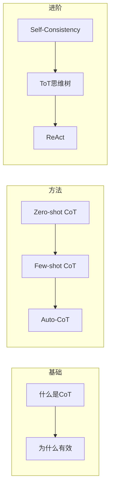

# 第4章 · 思维链提示 — Chain-of-Thought 推理增强

> **时长**：约 4 小时 ｜ **难度**：⭐⭐⭐ ｜ **类型**：核心技术
>
> **目标**：掌握 CoT 思维链技术，显著提升模型的推理能力

---

## 学习目标

学完本章后，你将能够：
- 理解思维链（CoT）的工作原理
- 掌握 Zero-shot CoT 和 Few-shot CoT
- 学会 Self-Consistency 等高级技术
- 在复杂推理任务中正确应用 CoT

---

## 知识地图



---

## 1、什么是思维链（Chain-of-Thought）

### 1.1 核心概念

**概念定义**：思维链（Chain-of-Thought，CoT）是一种提示技术，让模型在给出最终答案前，先展示逐步推理过程。

**核心定位**：CoT 是提升 LLM 推理能力最有效的方法之一——将复杂问题拆解为简单步骤，每步都可验证，显著减少推理错误。

```
普通提问：
Q：一个商店有 23 个苹果，卖掉 17 个后又进货 12 个，现在有多少个？
A：18 个

思维链提问：
Q：一个商店有 23 个苹果，卖掉 17 个后又进货 12 个，现在有多少个？
A：让我一步一步思考：
   1. 初始：23 个苹果
   2. 卖掉 17 个：23 - 17 = 6 个
   3. 进货 12 个：6 + 12 = 18 个
   所以现在有 18 个苹果。
```

### 1.2 为什么 CoT 有效

**关键洞察**：

1. **降低任务难度**：将复杂问题分解为简单步骤
2. **激活相关知识**：逐步推理帮助模型调用正确知识
3. **减少错误传播**：每步都可验证，错误更容易被发现
4. **利用序列生成**：模型在生成过程中"思考"

### 1.3 适用场景

| 场景 | CoT 效果 |
|------|---------|
| 数学计算 | ✅ 显著提升 |
| 逻辑推理 | ✅ 显著提升 |
| 常识推理 | ✅ 有效提升 |
| 简单问答 | ⚠️ 可能不需要 |
| 创意写作 | ❌ 不适用 |

---

## 2、Zero-shot CoT

### 2.1 最简单的魔法词

只需在问题后加一句：**"让我们一步一步思考"**（Let's think step by step）

```python
# 普通 Prompt
prompt = "Roger 有 5 个网球。他又买了 2 罐网球，每罐有 3 个球。他现在有多少个球？"

# Zero-shot CoT
prompt = """Roger 有 5 个网球。他又买了 2 罐网球，每罐有 3 个球。他现在有多少个球？

让我们一步一步思考。"""
```

### 2.2 其他触发词

| 触发词 | 适用场景 |
|--------|---------|
| "让我们一步一步思考" | 通用 |
| "请展示你的推理过程" | 逻辑问题 |
| "请解释你的计算步骤" | 数学问题 |
| "让我们分析一下" | 分析问题 |
| "First, let's..." | 英文场景 |

### ▶ 执行代码

```bash
cd code/04-CoT思维链
python 01_zero_shot_cot.py
```

```python
"""
01_zero_shot_cot.py
Zero-shot CoT 示例
"""
import os
from openai import OpenAI
from dotenv import load_dotenv

load_dotenv()

client = OpenAI()


def compare_with_and_without_cot():
    """对比有无 CoT 的效果"""

    problems = [
        # 数学问题
        "一个农场有 15 只鸡和 12 只鸭。农夫卖掉了 7 只鸡，又买入 5 只鸭。现在农场有多少只家禽？",

        # 逻辑问题
        "小明比小红高，小红比小华高，小华比小刚矮。请问谁最高？",

        # 常识推理
        "张三周一上班迟到了，被扣了 50 元。周二到周五他都准时到达。这周他因迟到被扣了多少钱？",
    ]

    for i, problem in enumerate(problems, 1):
        print(f"\n{'='*60}")
        print(f"问题 {i}: {problem}")
        print("="*60)

        # 无 CoT
        response1 = client.chat.completions.create(
            model="gpt-4o-mini",
            messages=[{"role": "user", "content": problem}],
            max_tokens=100
        )
        print(f"\n【无 CoT】\n{response1.choices[0].message.content}")

        # 有 CoT
        cot_prompt = f"{problem}\n\n让我们一步一步思考。"
        response2 = client.chat.completions.create(
            model="gpt-4o-mini",
            messages=[{"role": "user", "content": cot_prompt}],
            max_tokens=300
        )
        print(f"\n【有 CoT】\n{response2.choices[0].message.content}")


if __name__ == "__main__":
    if not os.getenv("OPENAI_API_KEY"):
        print("请设置 OPENAI_API_KEY")
        exit()

    compare_with_and_without_cot()
```

---

## 3、Few-shot CoT

### 3.1 提供推理示例

通过示例展示"如何思考"：

```python
prompt = """问题：食堂有 32 个苹果。如果用掉 20 个做果汁，又买入 15 个，现在有多少个？
思考：
1. 初始数量：32 个
2. 做果汁用掉：32 - 20 = 12 个
3. 买入新的：12 + 15 = 27 个
答案：27 个

问题：停车场有 12 辆车。开走 5 辆，又来了 8 辆，现在有多少辆？
思考：
1. 初始数量：12 辆
2. 开走：12 - 5 = 7 辆
3. 新来：7 + 8 = 15 辆
答案：15 辆

问题：{new_problem}
思考："""
```

### 3.2 示例质量的重要性

**高质量示例特征**：
- 推理步骤清晰
- 每步有明确的计算/推导
- 逻辑连贯，无跳跃
- 格式统一

```python
# ❌ 差的示例
"""
问题：5 + 3 = ?
答案：因为5加3等于8，所以是8。
"""

# ✅ 好的示例
"""
问题：5 + 3 = ?
思考：
- 第一个数是 5
- 第二个数是 3
- 5 + 3 = 8
答案：8
"""
```

---

## 4、Self-Consistency（自洽性）

### 4.1 核心思想

**多次采样，投票选最优**：

```
问题 → [多次独立推理] → [多个答案] → [投票/选择]
                ↓
        路径1 → 答案A
        路径2 → 答案A
        路径3 → 答案B
        路径4 → 答案A
                ↓
        最终答案：A（出现3次，最多）
```

### 4.2 实现方式

```python
"""
02_self_consistency.py
Self-Consistency 实现
"""

def self_consistency(problem: str, num_samples: int = 5) -> str:
    """
    使用自洽性方法求解

    Args:
        problem: 问题
        num_samples: 采样次数

    Returns:
        最终答案
    """
    from collections import Counter

    cot_prompt = f"{problem}\n\n让我们一步一步思考。"
    answers = []

    for _ in range(num_samples):
        response = client.chat.completions.create(
            model="gpt-4o-mini",
            messages=[{"role": "user", "content": cot_prompt}],
            temperature=0.7,  # 增加随机性以获得不同推理路径
            max_tokens=300
        )

        # 提取最终答案（简化处理）
        text = response.choices[0].message.content
        # 假设答案在最后一行或特定标记后
        answer = extract_answer(text)
        answers.append(answer)
        print(f"路径 {len(answers)}: {answer}")

    # 投票选择最常见的答案
    answer_counts = Counter(answers)
    most_common = answer_counts.most_common(1)[0][0]

    print(f"\n所有答案: {answers}")
    print(f"答案分布: {dict(answer_counts)}")
    print(f"最终答案: {most_common}")

    return most_common


def extract_answer(text: str) -> str:
    """从推理文本中提取答案"""
    import re
    # 尝试匹配常见的答案格式
    patterns = [
        r'答案[：:]\s*(\d+)',
        r'所以[，,]?\s*(?:答案是|结果是|有)?\s*(\d+)',
        r'(\d+)\s*[个只辆]',
    ]
    for pattern in patterns:
        match = re.search(pattern, text)
        if match:
            return match.group(1)
    # 返回最后一个数字
    numbers = re.findall(r'\d+', text)
    return numbers[-1] if numbers else "unknown"
```

---

## 5、思维树（Tree of Thoughts）

### 5.1 概念

**ToT** 是 CoT 的扩展，允许模型探索多个推理分支：

```
            问题
              │
    ┌─────────┼─────────┐
    ↓         ↓         ↓
  思路A     思路B     思路C
    │         │         │
    ↓         ↓         ↓
  评估      评估      评估
    │         │         │
    ↓         ×         ↓
  继续      剪枝      继续
    │                   │
    ↓                   ↓
  答案A               答案C
```

### 5.2 简化实现

```python
"""
03_tree_of_thoughts.py
简化版思维树
"""

def tree_of_thoughts(problem: str) -> str:
    """简化版思维树实现"""

    # 第一步：生成多个初始思路
    brainstorm_prompt = f"""问题：{problem}

请从3个不同角度思考这个问题，给出3个不同的解题思路：

思路1：
思路2：
思路3："""

    thoughts_response = client.chat.completions.create(
        model="gpt-4o-mini",
        messages=[{"role": "user", "content": brainstorm_prompt}],
        max_tokens=500
    )
    thoughts = thoughts_response.choices[0].message.content
    print("【生成思路】")
    print(thoughts)

    # 第二步：评估并选择最佳思路
    evaluate_prompt = f"""问题：{problem}

以下是3个解题思路：
{thoughts}

请评估每个思路的可行性，选择最可能正确的一个，并给出完整解答。

评估和解答："""

    final_response = client.chat.completions.create(
        model="gpt-4o-mini",
        messages=[{"role": "user", "content": evaluate_prompt}],
        max_tokens=500
    )

    print("\n【评估与解答】")
    print(final_response.choices[0].message.content)

    return final_response.choices[0].message.content
```

---

## 6、ReAct 模式

### 6.1 概念

**ReAct = Reasoning + Acting**，交替进行推理和行动：

```
问题：北京今天天气怎么样，需要带伞吗？

Thought 1: 我需要查询北京今天的天气
Action 1: search("北京今天天气")
Observation 1: 北京今天多云转晴，气温 15-23℃

Thought 2: 没有雨，温度适中
Action 2: conclude
Answer: 北京今天多云转晴，不需要带伞。
```

### 6.2 简化实现

```python
react_prompt = """回答问题时，请使用以下格式：

Thought: 思考当前需要做什么
Action: 选择一个动作 [search/calculate/conclude]
Observation: 动作的结果
... (重复直到得出结论)
Answer: 最终答案

问题：{question}

Thought 1:"""
```

---

## 7、最佳实践

### 7.1 何时使用 CoT

| 使用 CoT | 不需要 CoT |
|---------|----------|
| 多步计算 | 简单问答 |
| 逻辑推理 | 信息检索 |
| 决策分析 | 翻译任务 |
| 代码调试 | 文本生成 |

### 7.2 组合使用

```python
# CoT + Few-shot + 约束
prompt = """请解决数学问题。展示完整的推理过程。

示例：
问题：书架上有 15 本书，借走 6 本，又放回 4 本，现在有多少本？
推理：
1. 初始：15 本
2. 借走：15 - 6 = 9 本
3. 放回：9 + 4 = 13 本
答案：13 本

问题：{problem}

推理要求：
- 每步列出计算过程
- 注明中间结果
- 最后用"答案：X"的格式给出答案

推理："""
```

---

## 常见踩坑

1. **简单任务滥用 CoT**：翻译、简单问答等任务不需要 CoT，加了反而浪费 Token 和响应时间
2. **CoT 触发词被忽略**：仅靠"让我们一步一步思考"不够时，换用更具体的引导语如"请展示你的计算过程"
3. **推理链太长导致模型迷路**：复杂推理时模型可能在中间步骤跑偏，使用 Self-Consistency 多次采样投票可缓解
4. **ToT 过度复杂化简单问题**：思维树适合多分支探索的复杂问题，简单计算用 ToT 是杀鸡用牛刀
5. **温度设置与 CoT 不匹配**：CoT 需要确定性推理（用低温 0~0.3），Self-Consistency 需要采样多样性（用 0.7）

---

## 课后练习

1. 找 3 道数学题，分别用无 CoT 和有 CoT 的方式让 LLM 求解，对比准确率
2. 尝试不同的 CoT 触发词（"让我们一步一步思考"、"请展示推理过程"、"先分析再回答"），观察效果差异
3. 用 Self-Consistency 方法对一道复杂推理题采样 5 次，观察不同推理路径和投票结果
4. 找一个你工作中有多步推理需求的场景，设计一个 CoT + Few-shot 的组合 Prompt

---

## 本节小结

- ✅ 理解了思维链的工作原理和适用场景
- ✅ 掌握了 Zero-shot CoT 的魔法词技巧
- ✅ 学会了 Few-shot CoT 的示例设计
- ✅ 了解了 Self-Consistency、ToT、ReAct 等进阶技术

---

> **下一章**：第5章 · Prompt 优化与调试 — 系统化提升 Prompt 质量
