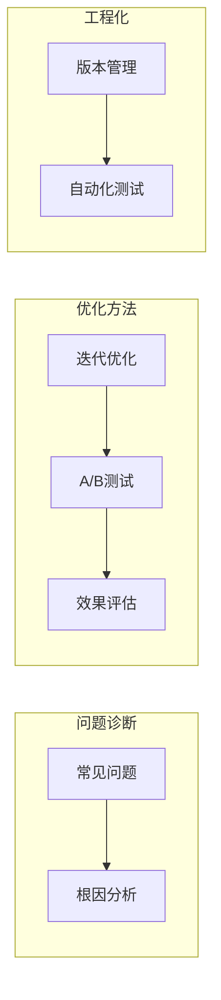

# 第5章 · Prompt 优化与调试 — 系统化提升 Prompt 质量

> **时长**：约 3 小时 ｜ **难度**：⭐⭐⭐ ｜ **类型**：工程实践
>
> **目标**：掌握 Prompt 调试方法论，学会系统化优化 Prompt 质量

---

## 学习目标

学完本章后，你将能够：
- 建立 Prompt 优化的方法论
- 掌握常见问题的诊断与修复
- 学会 A/B 测试和效果评估
- 建立 Prompt 版本管理体系

---

## 知识地图



---

## 1、常见问题诊断

### 1.1 问题分类

| 问题类型 | 表现 | 常见原因 |
|---------|------|---------|
| 格式问题 | 输出格式不符合预期 | 格式说明不清晰 |
| 内容问题 | 答案错误或不完整 | 指令不明确、缺少上下文 |
| 风格问题 | 语气/风格不对 | 缺少风格约束 |
| 稳定性问题 | 同样问题不同答案 | 温度过高、指令模糊 |
| 幻觉问题 | 生成虚假信息 | 缺少事实约束 |

### 1.2 诊断清单

```python
"""
Prompt 问题诊断清单

□ 1. 指令是否明确？
   - 是否使用了具体的动词？
   - 是否指定了具体要求？

□ 2. 上下文是否充分？
   - 模型是否有足够信息完成任务？
   - 是否提供了必要的背景？

□ 3. 格式是否清晰？
   - 是否明确指定了输出格式？
   - 是否给出了格式示例？

□ 4. 约束是否合理？
   - 约束是否太多/太少？
   - 约束是否相互冲突？

□ 5. 示例是否恰当？
   - 示例数量是否合适？
   - 示例是否具有代表性？
"""
```

---

## 2、优化方法论

### 2.1 迭代优化流程

```
┌─────────────────────────────────────────────────┐
│  Step 1: 基线 Prompt                            │
│  编写最简单的版本，建立基准                      │
└─────────────────────────────────────────────────┘
                    ↓
┌─────────────────────────────────────────────────┐
│  Step 2: 测试                                   │
│  用测试用例评估效果                             │
└─────────────────────────────────────────────────┘
                    ↓
┌─────────────────────────────────────────────────┐
│  Step 3: 分析                                   │
│  找出失败案例，分析原因                         │
└─────────────────────────────────────────────────┘
                    ↓
┌─────────────────────────────────────────────────┐
│  Step 4: 改进                                   │
│  针对性修改 Prompt                              │
└─────────────────────────────────────────────────┘
                    ↓
              [重复 2-4]
```

### 2.2 优化案例演示

**原始 Prompt（v1）**：

```python
prompt_v1 = "帮我分析这段代码"
# 问题：不知道分析什么，输出不可控
```

**改进版（v2）**：

```python
prompt_v2 = """请分析以下 Python 代码，指出潜在问题：

代码：
{code}"""
# 改进：明确了任务目标
# 问题：输出格式不确定
```

**改进版（v3）**：

```python
prompt_v3 = """请分析以下 Python 代码的质量。

代码：
{code}

请按以下格式输出：
1. 代码功能：{一句话描述}
2. 发现的问题：（按严重程度排序）
   - 问题1
   - 问题2
3. 改进建议：
   - 建议1
   - 建议2"""
# 改进：明确了输出格式
```

**最终版（v4）**：

```python
prompt_v4 = """你是一位资深 Python 代码审查员。

请审查以下代码，重点关注：
- 代码规范性
- 潜在 bug
- 性能问题
- 安全隐患

代码：
```python
{code}
```

请按以下格式输出审查报告：

## 代码概述
{一句话描述代码功能}

## 问题列表
| 行号 | 问题类型 | 严重程度 | 描述 |
|------|---------|---------|------|
| | | | |

## 改进建议
1. ...

## 修改后的代码
```python
{修改后的代码}
```
"""
```

---

## 3、A/B 测试框架

**概念定义**：A/B 测试框架通过同时运行两个 Prompt 版本并对同一批测试用例评估效果，用数据而非直觉判断哪个版本更好。

### ▶ 执行代码

```bash
cd code/05-优化调试
python 01_ab_testing.py
```

```python
"""
01_ab_testing.py
Prompt A/B 测试框架
"""
import os
import json
from typing import List, Dict, Callable
from dataclasses import dataclass
from openai import OpenAI
from dotenv import load_dotenv

load_dotenv()

client = OpenAI()


@dataclass
class TestCase:
    """测试用例"""
    input: str
    expected: str
    tags: List[str] = None


@dataclass
class TestResult:
    """测试结果"""
    prompt_name: str
    test_case: TestCase
    output: str
    is_correct: bool
    latency_ms: float


class PromptTester:
    """Prompt 测试器"""

    def __init__(self, model: str = "gpt-4o-mini"):
        self.model = model
        self.results: List[TestResult] = []

    def test_prompt(
        self,
        prompt_template: str,
        prompt_name: str,
        test_cases: List[TestCase],
        evaluator: Callable[[str, str], bool] = None
    ) -> Dict:
        """
        测试单个 Prompt

        Args:
            prompt_template: Prompt 模板，使用 {input} 占位
            prompt_name: Prompt 名称
            test_cases: 测试用例列表
            evaluator: 评估函数，判断输出是否正确

        Returns:
            测试统计结果
        """
        import time

        if evaluator is None:
            evaluator = lambda output, expected: expected.lower() in output.lower()

        correct = 0
        total_latency = 0

        print(f"\n测试 Prompt: {prompt_name}")
        print("-" * 40)

        for case in test_cases:
            prompt = prompt_template.format(input=case.input)

            start = time.time()
            response = client.chat.completions.create(
                model=self.model,
                messages=[{"role": "user", "content": prompt}],
                max_tokens=100
            )
            latency = (time.time() - start) * 1000

            output = response.choices[0].message.content.strip()
            is_correct = evaluator(output, case.expected)

            if is_correct:
                correct += 1
                status = "✓"
            else:
                status = "✗"

            print(f"{status} 输入: {case.input[:30]}... | 预期: {case.expected} | 输出: {output[:30]}...")

            result = TestResult(
                prompt_name=prompt_name,
                test_case=case,
                output=output,
                is_correct=is_correct,
                latency_ms=latency
            )
            self.results.append(result)
            total_latency += latency

        accuracy = correct / len(test_cases)
        avg_latency = total_latency / len(test_cases)

        print(f"\n准确率: {accuracy:.1%} ({correct}/{len(test_cases)})")
        print(f"平均延迟: {avg_latency:.0f}ms")

        return {
            "prompt_name": prompt_name,
            "accuracy": accuracy,
            "correct": correct,
            "total": len(test_cases),
            "avg_latency_ms": avg_latency
        }

    def compare_prompts(
        self,
        prompts: Dict[str, str],
        test_cases: List[TestCase],
        evaluator: Callable = None
    ) -> Dict:
        """对比多个 Prompt"""
        results = {}

        for name, template in prompts.items():
            results[name] = self.test_prompt(
                template, name, test_cases, evaluator
            )

        # 打印对比结果
        print("\n" + "=" * 60)
        print("【A/B 测试结果对比】")
        print("=" * 60)
        print(f"{'Prompt':<20} {'准确率':<10} {'延迟(ms)':<10}")
        print("-" * 40)

        for name, stats in sorted(results.items(), key=lambda x: -x[1]['accuracy']):
            print(f"{name:<20} {stats['accuracy']:.1%}      {stats['avg_latency_ms']:.0f}")

        return results


# 示例：情感分析 A/B 测试
if __name__ == "__main__":
    if not os.getenv("OPENAI_API_KEY"):
        print("请设置 OPENAI_API_KEY")
        exit()

    # 定义测试用例
    test_cases = [
        TestCase("这个产品太棒了！", "正面"),
        TestCase("质量差，不推荐", "负面"),
        TestCase("还行吧，一般般", "中性"),
        TestCase("超出预期，非常满意", "正面"),
        TestCase("浪费钱，后悔购买", "负面"),
        TestCase("性价比还可以", "中性"),
    ]

    # 定义要对比的 Prompt
    prompts = {
        "baseline": "判断情感：{input}",

        "with_options": """判断以下文本的情感（正面/负面/中性）：
{input}
情感：""",

        "few_shot": """判断情感。

示例：
"非常好用" → 正面
"太差了" → 负面
"一般" → 中性

判断："{input}" →""",
    }

    # 运行测试
    tester = PromptTester()
    results = tester.compare_prompts(prompts, test_cases)
```

---

## 4、效果评估指标

### 4.1 常用指标

| 指标 | 说明 | 适用场景 |
|------|------|---------|
| 准确率 | 正确输出占比 | 分类任务 |
| BLEU | 与参考文本的相似度 | 翻译、生成 |
| ROUGE | 召回率导向的相似度 | 摘要 |
| 人工评分 | 人类评判质量 | 开放式任务 |
| 延迟 | 响应时间 | 性能要求 |
| Token 消耗 | 输入输出 Token 数 | 成本优化 |

### 4.2 自动评估实现

```python
"""
02_auto_evaluation.py
自动评估方法
"""

def exact_match(output: str, expected: str) -> bool:
    """精确匹配"""
    return output.strip().lower() == expected.strip().lower()


def contains_match(output: str, expected: str) -> bool:
    """包含匹配"""
    return expected.lower() in output.lower()


def llm_judge(output: str, expected: str, criteria: str = None) -> bool:
    """使用 LLM 作为评判者"""
    judge_prompt = f"""评估以下输出是否满足预期。

预期答案：{expected}
实际输出：{output}

评估标准：{criteria or "输出是否包含预期答案的核心内容"}

请只回答"正确"或"错误"，不需要解释。"""

    response = client.chat.completions.create(
        model="gpt-4o-mini",
        messages=[{"role": "user", "content": judge_prompt}],
        max_tokens=10
    )

    return "正确" in response.choices[0].message.content


def calculate_metrics(results: List[TestResult]) -> Dict:
    """计算综合指标"""
    correct = sum(1 for r in results if r.is_correct)
    total = len(results)

    return {
        "accuracy": correct / total,
        "correct": correct,
        "total": total,
        "avg_latency_ms": sum(r.latency_ms for r in results) / total,
    }
```

---

## 5、版本管理

### 5.1 Prompt 版本化

```python
"""
03_prompt_versioning.py
Prompt 版本管理
"""
import json
from datetime import datetime
from pathlib import Path


class PromptManager:
    """Prompt 版本管理器"""

    def __init__(self, storage_dir: str = "./prompts"):
        self.storage_dir = Path(storage_dir)
        self.storage_dir.mkdir(exist_ok=True)

    def save(self, name: str, prompt: str, metadata: dict = None) -> str:
        """保存 Prompt 版本"""
        version = datetime.now().strftime("%Y%m%d_%H%M%S")
        filename = f"{name}_v{version}.json"

        data = {
            "name": name,
            "version": version,
            "prompt": prompt,
            "metadata": metadata or {},
            "created_at": datetime.now().isoformat()
        }

        filepath = self.storage_dir / filename
        filepath.write_text(json.dumps(data, ensure_ascii=False, indent=2))

        print(f"已保存: {filename}")
        return version

    def load(self, name: str, version: str = None) -> dict:
        """加载 Prompt（默认最新版本）"""
        pattern = f"{name}_v*.json"
        files = sorted(self.storage_dir.glob(pattern), reverse=True)

        if not files:
            raise FileNotFoundError(f"未找到 Prompt: {name}")

        if version:
            for f in files:
                if f"_v{version}" in f.name:
                    return json.loads(f.read_text())
            raise FileNotFoundError(f"未找到版本: {version}")

        # 返回最新版本
        return json.loads(files[0].read_text())

    def list_versions(self, name: str) -> List[str]:
        """列出所有版本"""
        pattern = f"{name}_v*.json"
        files = sorted(self.storage_dir.glob(pattern), reverse=True)
        return [f.stem for f in files]

    def compare(self, name: str, v1: str, v2: str) -> dict:
        """对比两个版本"""
        p1 = self.load(name, v1)
        p2 = self.load(name, v2)

        return {
            "v1": {"version": v1, "prompt": p1["prompt"]},
            "v2": {"version": v2, "prompt": p2["prompt"]},
        }


# 使用示例
if __name__ == "__main__":
    manager = PromptManager()

    # 保存 Prompt
    prompt_v1 = "判断情感：{input}"
    manager.save("sentiment", prompt_v1, {"author": "test", "accuracy": 0.6})

    prompt_v2 = "判断以下文本的情感（正面/负面/中性）：\n{input}"
    manager.save("sentiment", prompt_v2, {"author": "test", "accuracy": 0.8})

    # 列出版本
    print("所有版本:", manager.list_versions("sentiment"))

    # 加载最新版本
    latest = manager.load("sentiment")
    print("最新版本:", latest["version"])
```

---

## 6、调试技巧

### 6.1 观察中间过程

```python
# 让模型展示思考过程
debug_prompt = """请完成任务并展示你的思考过程。

任务：{task}

请按以下格式回答：
【理解】我理解这个任务是要...
【思考】我的解决思路是...
【执行】具体步骤...
【结果】最终答案是...
"""
```

### 6.2 逐步简化

```python
# 当 Prompt 太复杂出问题时，逐步简化定位问题

# Step 1: 最简版本
simple = "分析这段代码"

# Step 2: 加一个条件
step2 = "分析这段代码，列出问题"

# Step 3: 再加一个条件
step3 = "分析这段代码，列出问题，按严重程度排序"

# ... 逐步添加，找到导致问题的条件
```

### 6.3 边界测试

```python
# 测试边界情况
edge_cases = [
    "",                    # 空输入
    "a" * 10000,          # 超长输入
    "!@#$%^&*()",         # 特殊字符
    "SELECT * FROM",       # SQL 注入
    "<script>alert(1)",    # XSS
]
```

---

## 常见踩坑

1. **一次性改太多**：同时修改角色、格式、示例、约束——出问题后无法确定是哪个改动导致的。正确做法是每次只改一个变量，用 A/B 测试验证。
2. **没有建立测试用例集**：每次手动测几个例子就上线，导致回归问题。应该建立 10+ 个覆盖各种边界情况的测试用例。
3. **只测 happy path**：测试用例全部是"标准"输入，上线后遇到边界/异常输入时 Prompt 崩溃。必须包含边界测试。
4. **忽略延迟和成本**：过度优化 Prompt 导致 Token 数激增，每次调用成本翻倍。优化时要同时关注效果、延迟、成本三项指标。
5. **把模型当评测官**：用 LLM 评估 LLM 的输出有偏差（同模型更倾向认可自己的输出）。关键任务仍需要人工抽检。

---

## 课后练习

1. 找一个你常用的 Prompt，按迭代优化流程（基线 → 测试 → 分析 → 改进）进行 3 轮优化
2. 编写 10 个测试用例（含正常、边界、异常输入），运行 A/B 测试对比两个 Prompt 版本的效果
3. 用 PromptManager 类将你的 Prompt 进行版本化管理，保存至少 3 个版本，对比差异
4. 使用 LLM-as-Judge 方法评估一批输出，然后人工复核 10%，观察 LLM 评估与人工评估的一致性

---

## 本节小结

- ✅ 掌握了常见 Prompt 问题的诊断方法
- ✅ 学会了迭代优化的流程
- ✅ 建立了 A/B 测试框架
- ✅ 了解了版本管理和自动化测试

---

> **下一章**：第6章 · 企业级 Prompt 管理 — 构建可维护的 Prompt 体系
