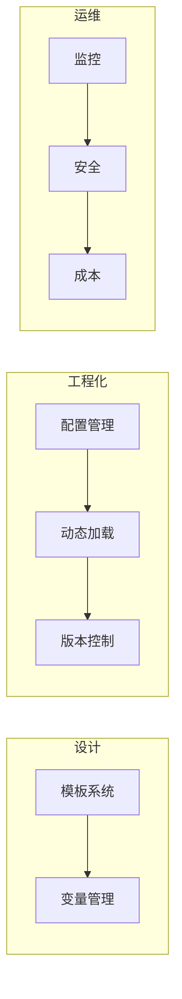

# 第6章 · 企业级 Prompt 管理 — 构建可维护的 Prompt 体系

> **时长**：约 3 小时 ｜ **难度**：⭐⭐⭐ ｜ **类型**：工程实践
>
> **目标**：学会在企业环境中管理和维护 Prompt，建立可扩展的 Prompt 体系

---

## 学习目标

学完本章后，你将能够：
- 设计 Prompt 模板系统
- 建立 Prompt 配置管理体系
- 实现 Prompt 的动态加载和热更新
- 掌握安全性和成本控制

---

## 知识地图



---

## 1、Prompt 模板系统

### 1.1 模板设计原则

```
┌─────────────────────────────────────────────────────┐
│                    Prompt 模板                       │
├─────────────────────────────────────────────────────┤
│  [固定部分] 角色设定、任务说明、输出格式              │
├─────────────────────────────────────────────────────┤
│  [可变部分] 用户输入、上下文、参数                    │
├─────────────────────────────────────────────────────┤
│  [可选部分] Few-shot 示例、额外约束                  │
└─────────────────────────────────────────────────────┘
```

### 1.2 模板实现

```python
"""
01_prompt_template.py
Prompt 模板系统
"""
from typing import Dict, List, Optional
from dataclasses import dataclass, field
import re


@dataclass
class PromptTemplate:
    """Prompt 模板"""
    name: str
    template: str
    description: str = ""
    variables: List[str] = field(default_factory=list)
    defaults: Dict[str, str] = field(default_factory=dict)
    examples: List[Dict] = field(default_factory=list)

    def __post_init__(self):
        # 自动提取变量
        if not self.variables:
            self.variables = re.findall(r'\{(\w+)\}', self.template)

    def format(self, **kwargs) -> str:
        """填充模板"""
        # 合并默认值和传入参数
        params = {**self.defaults, **kwargs}

        # 检查必需参数
        missing = set(self.variables) - set(params.keys())
        if missing:
            raise ValueError(f"缺少参数: {missing}")

        return self.template.format(**params)

    def with_examples(self, num_examples: int = None) -> str:
        """生成带示例的模板"""
        if not self.examples:
            return self.template

        examples_text = ""
        selected = self.examples[:num_examples] if num_examples else self.examples

        for i, ex in enumerate(selected, 1):
            examples_text += f"\n示例{i}：\n"
            for k, v in ex.items():
                examples_text += f"{k}：{v}\n"

        # 在模板中插入示例
        return self.template.replace("{examples}", examples_text)


# 预定义模板库
class PromptLibrary:
    """Prompt 模板库"""

    templates = {
        "sentiment_analysis": PromptTemplate(
            name="sentiment_analysis",
            description="情感分析模板",
            template="""你是一个情感分析专家。

请分析以下文本的情感倾向。
{examples}
文本：{text}

请输出：
- 情感：正面/负面/中性
- 置信度：高/中/低
- 理由：简要说明""",
            defaults={"examples": ""},
            examples=[
                {"文本": "这个产品太棒了", "情感": "正面", "置信度": "高"},
                {"文本": "质量一般般", "情感": "中性", "置信度": "中"},
            ]
        ),

        "code_review": PromptTemplate(
            name="code_review",
            description="代码审查模板",
            template="""你是一位资深的 {language} 开发工程师。

请审查以下代码：
```{language}
{code}
```

审查要点：
{review_points}

请按以下格式输出：
## 问题列表
| 行号 | 严重程度 | 问题描述 | 修复建议 |
|------|---------|---------|---------|

## 总体评价
{overall_template}""",
            defaults={
                "language": "python",
                "review_points": "- 代码规范\n- 潜在 bug\n- 性能问题",
                "overall_template": "（1-10分）"
            }
        ),

        "summarize": PromptTemplate(
            name="summarize",
            description="文本摘要模板",
            template="""请将以下{content_type}总结为{length}的摘要。

要求：
- 保留核心观点
- 使用{style}的语言风格
{extra_requirements}

原文：
{content}

摘要：""",
            defaults={
                "content_type": "文章",
                "length": "100字左右",
                "style": "专业",
                "extra_requirements": ""
            }
        ),
    }

    @classmethod
    def get(cls, name: str) -> PromptTemplate:
        """获取模板"""
        if name not in cls.templates:
            raise KeyError(f"未找到模板: {name}")
        return cls.templates[name]

    @classmethod
    def list(cls) -> List[str]:
        """列出所有模板"""
        return list(cls.templates.keys())


# 使用示例
if __name__ == "__main__":
    # 获取模板
    template = PromptLibrary.get("sentiment_analysis")

    # 使用模板
    prompt = template.format(text="这家餐厅的服务态度非常好")
    print(prompt)

    # 带示例的模板
    prompt_with_examples = template.with_examples(num_examples=2)
    print("\n带示例的模板：")
    print(prompt_with_examples)
```

---

## 2、配置管理

### 2.1 YAML 配置文件

```yaml
# prompts/config.yaml
prompts:
  sentiment_analysis:
    version: "1.2.0"
    model: "gpt-4o-mini"
    temperature: 0.3
    max_tokens: 200
    template_file: "templates/sentiment.txt"
    enabled: true
    tags: ["classification", "sentiment"]

  code_review:
    version: "2.0.0"
    model: "gpt-4o"
    temperature: 0.2
    max_tokens: 1000
    template_file: "templates/code_review.txt"
    enabled: true
    tags: ["code", "review"]

defaults:
  model: "gpt-4o-mini"
  temperature: 0.7
  max_tokens: 500

environments:
  development:
    model: "gpt-4o-mini"
    debug: true

  production:
    model: "gpt-4o"
    debug: false
    rate_limit: 100  # 每分钟请求数
```

### 2.2 配置加载器

```python
"""
02_config_manager.py
Prompt 配置管理
"""
import yaml
from pathlib import Path
from typing import Dict, Any, Optional
from dataclasses import dataclass


@dataclass
class PromptConfig:
    """Prompt 配置"""
    name: str
    version: str
    model: str
    temperature: float
    max_tokens: int
    template: str
    enabled: bool = True
    tags: list = None


class ConfigManager:
    """配置管理器"""

    def __init__(self, config_path: str, env: str = "development"):
        self.config_path = Path(config_path)
        self.env = env
        self.config = self._load_config()

    def _load_config(self) -> Dict:
        """加载配置文件"""
        with open(self.config_path) as f:
            return yaml.safe_load(f)

    def get_prompt_config(self, name: str) -> PromptConfig:
        """获取 Prompt 配置"""
        prompts = self.config.get("prompts", {})

        if name not in prompts:
            raise KeyError(f"未找到 Prompt 配置: {name}")

        prompt_conf = prompts[name]
        defaults = self.config.get("defaults", {})
        env_conf = self.config.get("environments", {}).get(self.env, {})

        # 合并配置（优先级：prompt > env > defaults）
        merged = {**defaults, **env_conf, **prompt_conf}

        # 加载模板文件
        template_file = merged.get("template_file")
        if template_file:
            template_path = self.config_path.parent / template_file
            merged["template"] = template_path.read_text()

        return PromptConfig(
            name=name,
            version=merged.get("version", "1.0.0"),
            model=merged.get("model"),
            temperature=merged.get("temperature"),
            max_tokens=merged.get("max_tokens"),
            template=merged.get("template", ""),
            enabled=merged.get("enabled", True),
            tags=merged.get("tags", [])
        )

    def list_prompts(self, tag: str = None) -> list:
        """列出 Prompt（可按标签过滤）"""
        prompts = self.config.get("prompts", {})
        result = []

        for name, conf in prompts.items():
            if tag is None or tag in conf.get("tags", []):
                result.append(name)

        return result

    def reload(self):
        """重新加载配置"""
        self.config = self._load_config()
        print("配置已重新加载")
```

---

## 3、动态加载与热更新

### 3.1 Prompt 注册中心

```python
"""
03_prompt_registry.py
Prompt 注册中心（支持热更新）
"""
import threading
from typing import Dict, Callable
from pathlib import Path
import time


class PromptRegistry:
    """Prompt 注册中心"""

    _instance = None
    _lock = threading.Lock()

    def __new__(cls):
        if cls._instance is None:
            with cls._lock:
                if cls._instance is None:
                    cls._instance = super().__new__(cls)
                    cls._instance._prompts = {}
                    cls._instance._watchers = []
        return cls._instance

    def register(self, name: str, template: str, metadata: dict = None):
        """注册 Prompt"""
        self._prompts[name] = {
            "template": template,
            "metadata": metadata or {},
            "updated_at": time.time()
        }
        self._notify_watchers(name, "registered")

    def get(self, name: str) -> str:
        """获取 Prompt"""
        if name not in self._prompts:
            raise KeyError(f"未注册的 Prompt: {name}")
        return self._prompts[name]["template"]

    def update(self, name: str, template: str):
        """更新 Prompt（热更新）"""
        if name not in self._prompts:
            raise KeyError(f"未注册的 Prompt: {name}")

        self._prompts[name]["template"] = template
        self._prompts[name]["updated_at"] = time.time()
        self._notify_watchers(name, "updated")
        print(f"Prompt '{name}' 已热更新")

    def watch(self, callback: Callable):
        """注册变更监听器"""
        self._watchers.append(callback)

    def _notify_watchers(self, name: str, action: str):
        """通知监听器"""
        for watcher in self._watchers:
            try:
                watcher(name, action)
            except Exception as e:
                print(f"监听器错误: {e}")

    def list_all(self) -> Dict:
        """列出所有 Prompt"""
        return {
            name: {
                "updated_at": info["updated_at"],
                "metadata": info["metadata"]
            }
            for name, info in self._prompts.items()
        }


# 文件监控器（热更新）
class FileWatcher:
    """文件变更监控"""

    def __init__(self, directory: str, registry: PromptRegistry):
        self.directory = Path(directory)
        self.registry = registry
        self._file_times = {}

    def check_updates(self):
        """检查文件更新"""
        for file_path in self.directory.glob("*.txt"):
            mtime = file_path.stat().st_mtime
            name = file_path.stem

            if name not in self._file_times:
                # 新文件
                self._file_times[name] = mtime
                template = file_path.read_text()
                self.registry.register(name, template)

            elif mtime > self._file_times[name]:
                # 文件已更新
                self._file_times[name] = mtime
                template = file_path.read_text()
                self.registry.update(name, template)

    def start(self, interval: int = 5):
        """启动监控"""
        def run():
            while True:
                self.check_updates()
                time.sleep(interval)

        thread = threading.Thread(target=run, daemon=True)
        thread.start()
        print(f"文件监控已启动，目录: {self.directory}")


# 使用示例
if __name__ == "__main__":
    registry = PromptRegistry()

    # 注册变更监听
    registry.watch(lambda name, action: print(f"[Event] {name} - {action}"))

    # 注册 Prompt
    registry.register("greeting", "你好，{name}！")
    registry.register("farewell", "再见，{name}！")

    # 获取并使用
    template = registry.get("greeting")
    print(template.format(name="世界"))

    # 热更新
    registry.update("greeting", "你好呀，{name}！欢迎回来！")
    print(registry.get("greeting").format(name="世界"))
```

---

## 4、安全性考虑

### 4.1 输入验证

```python
"""
04_security.py
Prompt 安全性处理
"""
import re
from typing import List


class PromptSanitizer:
    """Prompt 输入清洗器"""

    # 危险模式
    DANGEROUS_PATTERNS = [
        r"ignore.*previous.*instructions",
        r"disregard.*above",
        r"forget.*everything",
        r"you are now",
        r"new instructions",
        r"system prompt",
    ]

    # 敏感词
    SENSITIVE_WORDS = [
        "password", "secret", "api_key", "token",
        "credit card", "ssn", "社保", "密码", "密钥"
    ]

    @classmethod
    def sanitize(cls, text: str) -> str:
        """清洗输入文本"""
        # 移除潜在的注入攻击
        for pattern in cls.DANGEROUS_PATTERNS:
            text = re.sub(pattern, "[FILTERED]", text, flags=re.IGNORECASE)

        return text

    @classmethod
    def check_sensitive(cls, text: str) -> List[str]:
        """检查敏感信息"""
        found = []
        text_lower = text.lower()

        for word in cls.SENSITIVE_WORDS:
            if word.lower() in text_lower:
                found.append(word)

        return found

    @classmethod
    def validate_length(cls, text: str, max_length: int = 10000) -> bool:
        """验证长度"""
        return len(text) <= max_length


class SecurePromptExecutor:
    """安全的 Prompt 执行器"""

    def __init__(self, client, max_input_length: int = 10000):
        self.client = client
        self.max_input_length = max_input_length

    def execute(self, prompt: str, user_input: str, **kwargs) -> str:
        """安全执行 Prompt"""
        # 1. 长度验证
        if not PromptSanitizer.validate_length(user_input, self.max_input_length):
            raise ValueError(f"输入超过最大长度限制 ({self.max_input_length})")

        # 2. 清洗输入
        clean_input = PromptSanitizer.sanitize(user_input)

        # 3. 敏感信息检查（记录日志，但不阻止）
        sensitive = PromptSanitizer.check_sensitive(clean_input)
        if sensitive:
            print(f"[警告] 输入包含敏感词: {sensitive}")

        # 4. 执行
        final_prompt = prompt.format(input=clean_input)
        response = self.client.chat.completions.create(
            model=kwargs.get("model", "gpt-4o-mini"),
            messages=[{"role": "user", "content": final_prompt}],
            max_tokens=kwargs.get("max_tokens", 500)
        )

        return response.choices[0].message.content
```

---

## 5、成本控制

### 5.1 Token 预估与限制

```python
"""
05_cost_control.py
成本控制
"""
import tiktoken
from typing import Dict


class CostController:
    """成本控制器"""

    # 价格配置（每百万 Token，美元）
    PRICING = {
        "gpt-4o": {"input": 2.5, "output": 10},
        "gpt-4o-mini": {"input": 0.15, "output": 0.6},
        "claude-3-5-sonnet": {"input": 3, "output": 15},
    }

    def __init__(self, budget_limit: float = 10.0):
        self.budget_limit = budget_limit
        self.total_cost = 0.0
        self.encoding = tiktoken.get_encoding("cl100k_base")

    def estimate_tokens(self, text: str) -> int:
        """估算 Token 数量"""
        return len(self.encoding.encode(text))

    def estimate_cost(
        self,
        prompt: str,
        estimated_output_tokens: int,
        model: str = "gpt-4o-mini"
    ) -> float:
        """预估成本"""
        input_tokens = self.estimate_tokens(prompt)
        pricing = self.PRICING.get(model, self.PRICING["gpt-4o-mini"])

        input_cost = input_tokens * pricing["input"] / 1_000_000
        output_cost = estimated_output_tokens * pricing["output"] / 1_000_000

        return input_cost + output_cost

    def check_budget(self, estimated_cost: float) -> bool:
        """检查预算"""
        return self.total_cost + estimated_cost <= self.budget_limit

    def record_cost(self, cost: float):
        """记录成本"""
        self.total_cost += cost

    def get_summary(self) -> Dict:
        """获取成本摘要"""
        return {
            "total_cost": self.total_cost,
            "budget_limit": self.budget_limit,
            "remaining": self.budget_limit - self.total_cost,
            "usage_percent": (self.total_cost / self.budget_limit) * 100
        }


# 装饰器：成本控制
def cost_limited(controller: CostController, max_cost: float = 0.1):
    """成本限制装饰器"""
    def decorator(func):
        def wrapper(*args, **kwargs):
            # 预估成本
            prompt = kwargs.get("prompt", args[0] if args else "")
            estimated = controller.estimate_cost(prompt, 500)

            if estimated > max_cost:
                raise ValueError(f"预估成本 ${estimated:.4f} 超过限制 ${max_cost}")

            if not controller.check_budget(estimated):
                raise ValueError("超出预算限制")

            result = func(*args, **kwargs)
            controller.record_cost(estimated)

            return result
        return wrapper
    return decorator
```

---

## 6、监控与告警

```python
"""
06_monitoring.py
Prompt 监控
"""
from datetime import datetime
from collections import defaultdict
from typing import Dict, List


class PromptMonitor:
    """Prompt 监控器"""

    def __init__(self):
        self.metrics = defaultdict(lambda: {
            "call_count": 0,
            "total_latency": 0,
            "errors": 0,
            "token_usage": 0
        })
        self.alerts = []

    def record(
        self,
        prompt_name: str,
        latency_ms: float,
        tokens: int,
        success: bool
    ):
        """记录调用指标"""
        m = self.metrics[prompt_name]
        m["call_count"] += 1
        m["total_latency"] += latency_ms
        m["token_usage"] += tokens

        if not success:
            m["errors"] += 1

        # 检查告警条件
        self._check_alerts(prompt_name, latency_ms, success)

    def _check_alerts(self, name: str, latency: float, success: bool):
        """检查告警"""
        # 延迟告警
        if latency > 5000:  # 5秒
            self.alerts.append({
                "time": datetime.now(),
                "type": "high_latency",
                "prompt": name,
                "value": latency
            })

        # 错误率告警
        m = self.metrics[name]
        if m["call_count"] > 10:
            error_rate = m["errors"] / m["call_count"]
            if error_rate > 0.1:  # 10%
                self.alerts.append({
                    "time": datetime.now(),
                    "type": "high_error_rate",
                    "prompt": name,
                    "value": error_rate
                })

    def get_stats(self, prompt_name: str = None) -> Dict:
        """获取统计信息"""
        if prompt_name:
            m = self.metrics[prompt_name]
            return {
                "call_count": m["call_count"],
                "avg_latency_ms": m["total_latency"] / max(m["call_count"], 1),
                "error_rate": m["errors"] / max(m["call_count"], 1),
                "total_tokens": m["token_usage"]
            }

        return {name: self.get_stats(name) for name in self.metrics}

    def get_alerts(self, limit: int = 10) -> List[Dict]:
        """获取告警"""
        return self.alerts[-limit:]
```

---

## 常见踩坑

1. **模板变量未校验**：模板中的 `{变量}` 未传入时直接报错，生产环境应做变量校验和默认值兜底
2. **热更新未做灰度**：直接全量切换 Prompt 版本，一旦新版本效果差会影响所有用户。应先在 10% 流量上验证
3. **Prompt 注入攻击被忽视**：用户输入中包含"ignore previous instructions"等指令，可能劫持模型行为。必须对用户输入做清洗
4. **成本失控**：没有 Token 预算和限制机制，某天 Prompt 被改长后成本翻倍而不自知。应设预算告警和上限
5. **监控指标单一**：只监控调用量，不关注错误率、延迟、空响应率。全面监控才能在问题发生时快速定位

---

## 课后练习

1. 用 PromptTemplate 类将你常用的 3 个 Prompt 模板化，包含变量、默认值和示例
2. 搭建一个简单的 YAML 配置文件管理至少 2 个 Prompt，实现按环境（dev/prod）加载不同配置
3. 为你的 Prompt 添加基础的安全清洗：过滤常见的 Prompt 注入关键词
4. 用 tiktoken 估算你常用 Prompt 的 Token 消耗，计算日调用 1000 次的成本

---

## 本节小结

- ✅ 设计了 Prompt 模板系统
- ✅ 建立了配置管理体系
- ✅ 实现了动态加载和热更新
- ✅ 掌握了安全性和成本控制
- ✅ 了解了监控与告警机制

---

## 模块总结

恭喜完成 **模块5：Prompt Engineering 提示词工程**！

你已经掌握了：
- ✅ Prompt 基础原理和四要素模型
- ✅ 10+ 种提示词设计模式
- ✅ Few-shot Learning 少样本学习
- ✅ Chain-of-Thought 思维链技术
- ✅ Prompt 优化、调试和 A/B 测试
- ✅ 企业级 Prompt 管理体系

---

> **下一模块**：模块6 · LangChain 框架 — AI 应用开发框架（已完成，可继续学习）
