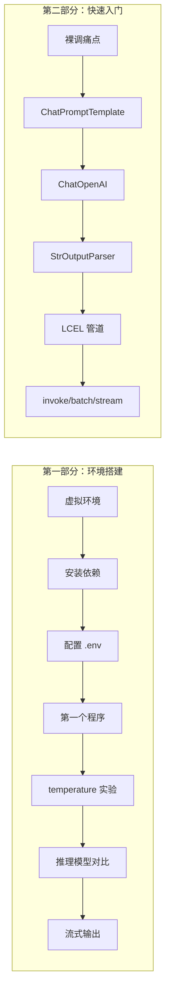
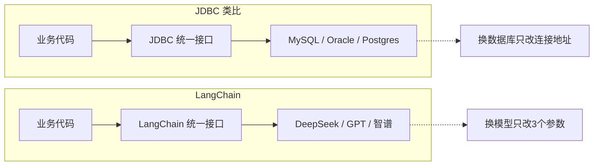
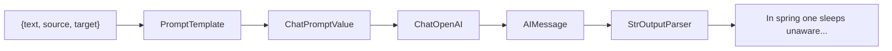
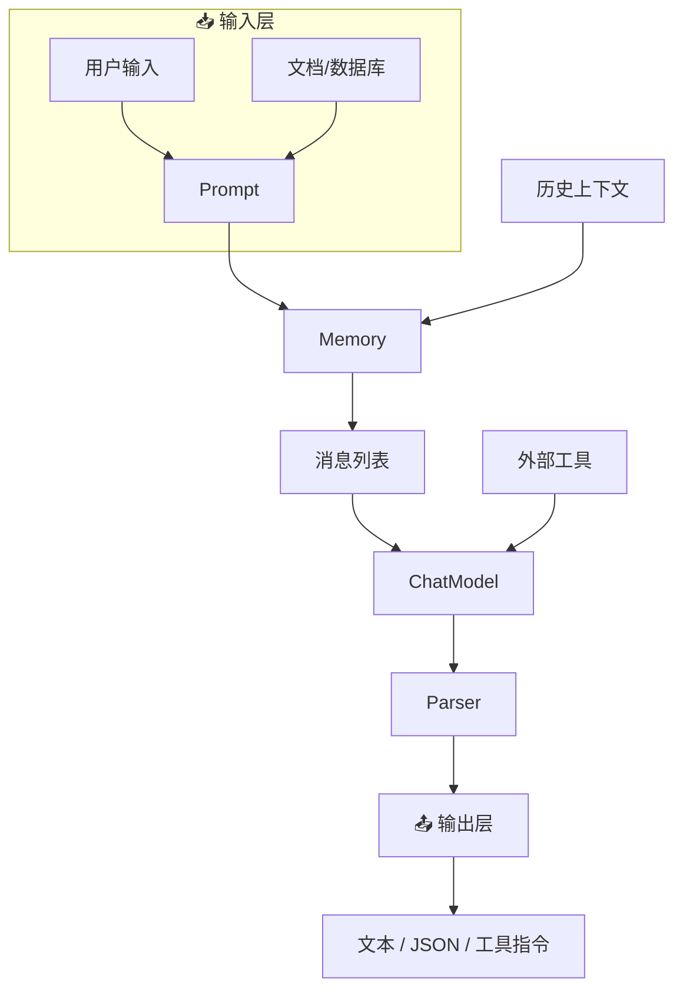

# 第1章 · 快速上手 — 从环境搭建到第一个 AI 应用

> **时长**：约 3 小时 ｜ **难度**：⭐ ｜ **类型**：动手实操
>
> **目标**：搭建开发环境，跑通入门程序，理解三大核心组件，用 LCEL 管道构建第一个 Chain

---

## 学习目标

学完本章后，你将能够：
- 创建虚拟环境并安装 LangChain 全家桶
- 用 `ChatOpenAI` 适配器切换不同厂商的大模型
- 理解 temperature 的作用并正确选值
- 区分通用模型和推理模型的使用场景
- 用 `ChatPromptTemplate` + `StrOutputParser` + LCEL 管道构建完整 Chain
- 用 `invoke` / `batch` / `stream` 三种方式调用 Chain

---

## 知识地图



---

# 第一部分：环境搭建与入门实验

## 1、LangChain 是什么

LangChain 是 2022 年 10 月由 Harrison Chase 发起的开源框架，用于开发由大语言模型（LLM）驱动的应用程序。

**核心定位**：LangChain 之于大模型应用，就像 JDBC 之于数据库应用——统一接口，屏蔽差异。



**六大核心能力**：

| 能力 | 对应场景 | 对应章节 |
|------|---------|---------|
| 文本生成 | 翻译、摘要、文案 | 第1章 |
| 结构化提取 | 简历解析、合同要素抽取 | 第2章 |
| 知识检索 (RAG) | 企业文档智能问答 | 第4章 |
| 工具调用 (Agent) | 自主查数据库、调 API | 第5章 |
| 多轮对话 | 上下文记忆、持续对话 | 第6章 |
| 复杂编排 | 业务审批流程、多 Agent 协作 | 第3章 |

---

## 2、环境准备

### 2.1 创建虚拟环境

```powershell
python --version  # 应 >= 3.10.0
python -m venv venv

# Windows 激活
venv\Scripts\activate
# macOS / Linux 激活
source venv/bin/activate
```

虚拟环境是 Python 的隔离运行空间，让每个项目有独立的依赖包，互不干扰。

### 2.2 安装依赖

```powershell
pip install langchain langchain-openai langchain-community python-dotenv
# 后续章节按需补充：langchain-chroma chromadb langgraph
```

### 2.3 验证安装

```powershell
python -c "import langchain; print(f'LangChain {langchain.__version__} 安装成功')"
```

---

## 3、配置 API Key

**概念定义**：`.env` 文件存放敏感配置（密钥、连接地址）。`python-dotenv` 的 `load_dotenv()` 读取 `.env` 注入到 `os.environ`。

**核心价值**：密钥与代码分离——换环境只换 `.env`，代码零改动，且不会误提交到 Git。

在项目根目录创建 `.env`：

```ini
# .env（请替换为你自己的 API Key）
DEEPSEEK_API_KEY=YOUR_DEEPSEEK_API_KEY_HERE
DEEPSEEK_BASE_URL=https://api.deepseek.com
ZHIPU_API_KEY=YOUR_ZHIPU_API_KEY_HERE
ZHIPU_BASE_URL=https://open.bigmodel.cn/api/paas/v4/
```

> ⚠️ `.env` 文件必须加入 `.gitignore`，绝不能提交到 Git！

代码中读取：

```python
from dotenv import load_dotenv
load_dotenv()  # 自动读取 .env，注入到 os.environ
```

---

## 4、第一个 LangChain 程序

**概念定义**：`ChatOpenAI` 是模型适配器。传入 `model`、`base_url`、`api_key` 三个参数，统一调用不同厂商的模型。

### ▶ 执行代码

```powershell
cd code/00-环境搭建-代码案例
python 01_hello_langchain.py
```

### 代码解读

```python
import os
from dotenv import load_dotenv
from langchain_openai import ChatOpenAI

load_dotenv()

llm = ChatOpenAI(
    model="deepseek-chat",
    base_url=os.getenv("DEEPSEEK_BASE_URL"),
    api_key=os.getenv("DEEPSEEK_API_KEY"),
    temperature=0.7,
)

response = llm.invoke("用一句话介绍 LangChain 是什么")
print(response.content)                    # 模型回复文本
print(response.response_metadata)          # Token 用量
```

**换模型只需改 3 个参数**：

```python
# 切换到智谱 GLM-4-Flash（免费模型）
llm = ChatOpenAI(
    model="glm-4-flash",
    base_url=os.getenv("ZHIPU_BASE_URL"),
    api_key=os.getenv("ZHIPU_API_KEY"),
)
# response = llm.invoke(...)  业务代码完全一样！
```

---

## 5、temperature 参数实验

**概念定义**：`temperature` 控制输出随机性。值越低越确定，值越高越多样。范围 0~2。

| temperature | 行为 | 典型场景 |
|------------|------|---------|
| 0 ~ 0.3 | 输出高度一致 | 翻译、数据提取、代码生成 |
| 0.4 ~ 0.7 | 有一定变化，整体可控 | 对话、摘要、改写 |
| 0.8 ~ 1.5 | 输出多样有创意 | 创意写作、头脑风暴 |

### ▶ 执行代码

```powershell
python 02_temperature_comparison.py
```

> 对同一个问题分别用 temperature=0、0.5、1.0 各生成 3 次回答。temperature=0 时高度一致，temperature=1 时措辞各异。

---

## 6、推理模型 vs 通用模型

| 对比维度 | 通用模型 (deepseek-chat) | 推理模型 (deepseek-reasoner) |
|---------|------------------------|---------------------------|
| 回答方式 | 直接输出答案 | 先展示推理过程，再给答案 |
| 响应速度 | 快（秒级） | 慢（数十秒） |
| 适合任务 | 对话、翻译、摘要 | 数学题、逻辑推理、复杂分析 |

**核心定位**：简单对话用推理模型又慢又贵，复杂数学题用通用模型可能出错。为任务匹配对的模型。

### ▶ 执行代码

```powershell
python 03_reasoner_comparison.py
```

---

## 7、流式输出

**概念定义**：`invoke()` 等模型生成完一次性返回；`stream()` 模型每生成一个词就立即返回，打字机效果。

**核心价值**：模型生成 200 字需要 5~10 秒。`invoke()` 白屏干等，`stream()` 逐字出现，感知等待几乎为零。

### ▶ 执行代码

```powershell
python 04_streaming_output.py
```

```python
llm = ChatOpenAI(model="deepseek-chat", temperature=0.7, ...)

for chunk in llm.stream("写一首关于编程的五言绝句"):
    print(chunk.content, end="", flush=True)
```

---

# 第二部分：构建你的第一个 Chain

## 8、裸调 LLM 的痛点

```python
# ❌ 裸调用——字符串拼接，难维护难复用
response = client.chat.completions.create(
    model="deepseek-chat",
    messages=[{"role": "user", "content": "翻译成英文：" + user_text}]
)
result = response.choices[0].message.content
```

| 痛点 | 表现 | LangChain 解法 |
|------|------|---------------|
| 提示词散落 | 每次拼接字符串，无法复用 | `ChatPromptTemplate` 模板化管理 |
| 输出不可控 | 返回 "好的，以下是翻译：xxx" | `StrOutputParser` 提取纯文本 |
| 无法组合 | 翻译→润色要写两遍 API 调用 | LCEL `\|` 管道串联 |
| 难以测试 | 散落的字符串无法单元测试 | 每个组件独立可测 |

---

## 9、三大核心组件

### 9.1 ChatPromptTemplate — 提示词模板

```python
from langchain_core.prompts import ChatPromptTemplate

prompt = ChatPromptTemplate.from_messages([
    ("system", "你是一个{role}，用{style}的风格回答问题。"),
    ("human", "{question}")
])

messages = prompt.invoke({
    "role": "幼儿园老师", "style": "童趣可爱",
    "question": "为什么天是蓝色的？"
})
# → [SystemMessage(...), HumanMessage(...)]
```

### 9.2 ChatOpenAI — 模型适配器

```python
from langchain_openai import ChatOpenAI

llm = ChatOpenAI(
    model="deepseek-chat",
    base_url=os.getenv("DEEPSEEK_BASE_URL"),
    api_key=os.getenv("DEEPSEEK_API_KEY"),
    temperature=0.7,
)
response = llm.invoke(messages)   # 传入消息列表 → AIMessage
print(response.content)           # 模型的实际回答
```

### 9.3 StrOutputParser — 输出解析器

```python
from langchain_core.output_parsers import StrOutputParser

parser = StrOutputParser()
text = parser.invoke(response)  # AIMessage → 纯字符串
```

---

## 10、LCEL 管道：串联一切

**概念定义**：LCEL（LangChain Expression Language）用 `|` 管道符串联组件。`prompt | llm | parser`——数据从左到右自动流转，前一个的输出自动成为后一个的输入。

**关键是每个组件都实现了同一个 Runnable 接口**，所以能像乐高一样任意组合。



### ▶ 执行代码

```powershell
cd code/01-快速入门-代码案例
python 01_translator_chain.py
```

```python
# 完整翻译 Chain——一行串联
chain = prompt | llm | StrOutputParser()

result = chain.invoke({
    "source": "中文", "target": "英文",
    "text": "春眠不觉晓，处处闻啼鸟。"
})
print(result)  # "In spring one sleeps unaware..."
```

---

## 11、三种调用方式

每个 Chain 都实现了 Runnable 协议，一个 Chain 三种用法：

| 方式 | 输入 | 返回 | 适用场景 |
|------|------|------|---------|
| `invoke()` | 单个 dict | 单个结果 | 单次请求、调试 |
| `batch()` | dict 列表 | 结果列表 | 批量独立任务（并行） |
| `stream()` | 单个 dict | 迭代器 | 实时交互、聊天 UI |

### ▶ 执行代码

```powershell
python 02_batch_and_stream.py
```

### invoke() — 单次同步

```python
result = chain.invoke({"text": "今天天气真好", "source": "中文", "target": "英文"})
```

### batch() — 批量并行

翻译 20 句话，`invoke()` 串行 = 每句等一次网络往返，总耗时 = N × 单次。`batch()` 并行 = 同时发出，总耗时 ≈ 最慢那条的耗时。

```python
texts = ["今天天气真好", "我明天去出差", "这道菜怎么做的？"]
inputs = [{"text": t, "source": "中文", "target": "英文"} for t in texts]
results = chain.batch(inputs)  # 3 个请求同时发出
```

### stream() — 打字机效果

```python
for chunk in chain.stream({"text": "春眠不觉晓", "source": "中文", "target": "英文"}):
    print(chunk, end="", flush=True)
```

---

## 组件全景图



后续章节将逐一深入这六大组件。

---

## 常见踩坑

1. **虚拟环境未激活**：运行前确认终端有 `(venv)` 标记
2. **`.env` 位置不对**：必须放在代码执行的工作目录
3. **API Key 无效**：确认 `.env` 中没有多余空格或引号
4. **模板变量不匹配**：`invoke` 的 dict key 必须覆盖模板中所有 `{变量}`
5. **temperature 对翻译任务的影响**：翻译用 0~0.3，不要用默认的 0.7

---

## 课后练习

1. 分别用 DeepSeek 和智谱回答同一个问题，对比质量和速度
2. 用 temperature=0 和 temperature=1.5 让 LLM 写诗，观察差异
3. 写一个"代码解释 Chain"：输入一段代码，输出中文解释
4. 用 `batch()` 批量翻译 5 句中文，对比 `for+invoke` 的耗时差异

---

## 本节小结

- ✅ 安装了 LangChain 环境，跑通了第一个程序
- ✅ 理解了 `ChatOpenAI` 统一适配器的 3 参数切换模型
- ✅ 掌握了 temperature 的作用和选值依据
- ✅ 对比了通用模型和推理模型的使用场景
- ✅ 掌握了三大核心组件：ChatPromptTemplate / ChatOpenAI / StrOutputParser
- ✅ 掌握了 LCEL 管道语法 `|` 及 invoke / batch / stream 三种调用方式

---

> **下一章**：第2章 · ChatModel 与提示词工程——消息体系深入、Few-Shot Prompting、结构化输出
