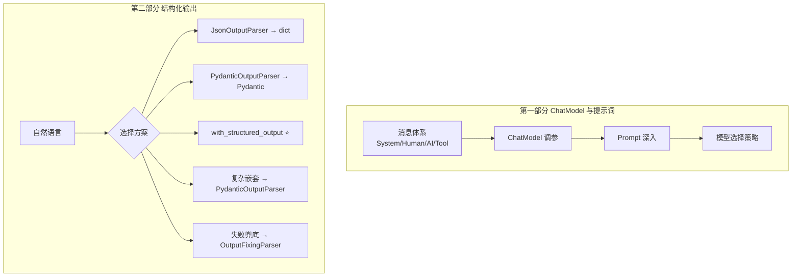
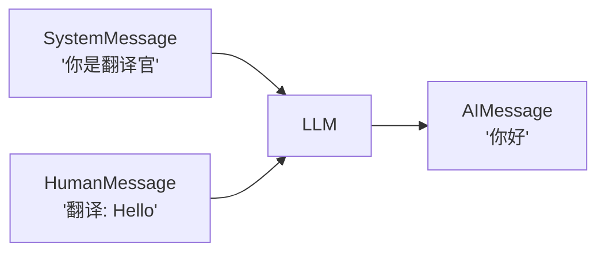
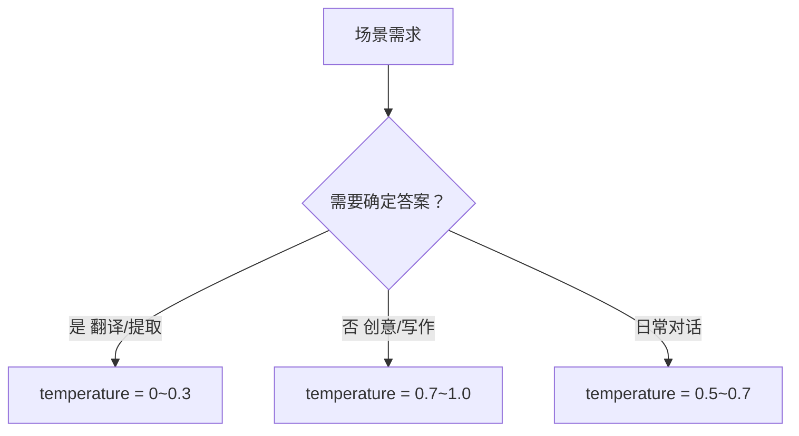
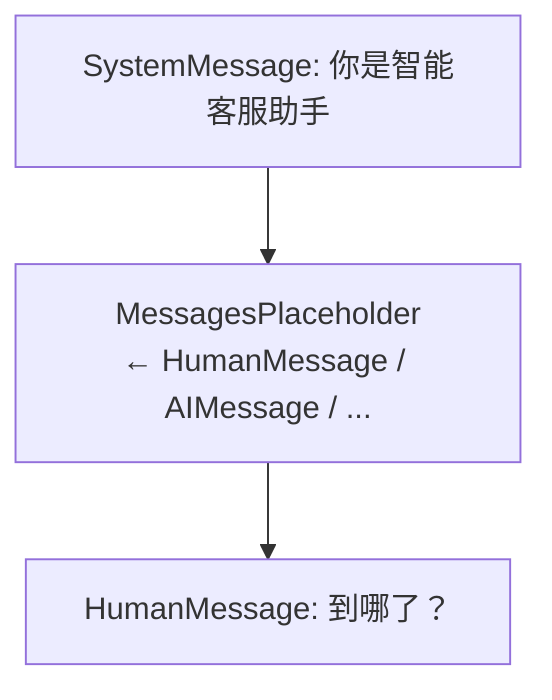
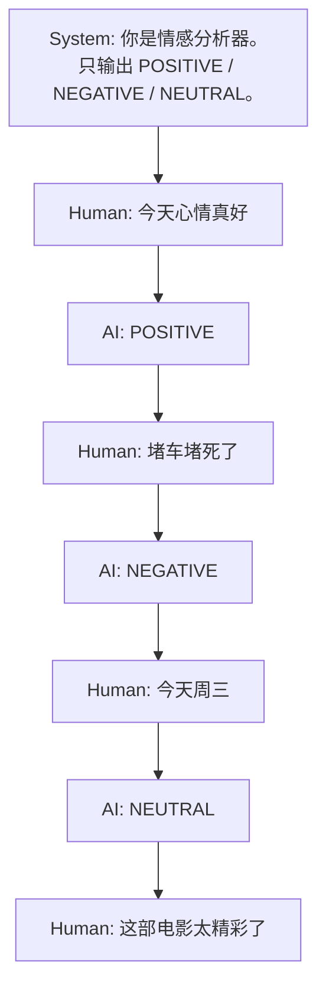
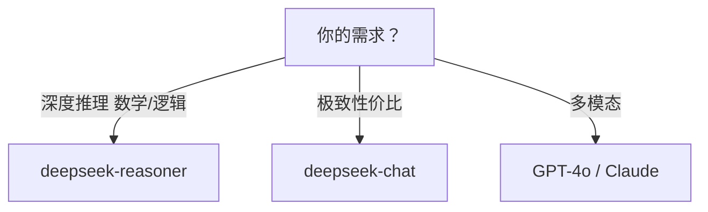
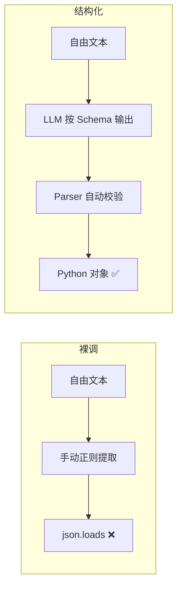
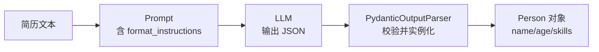
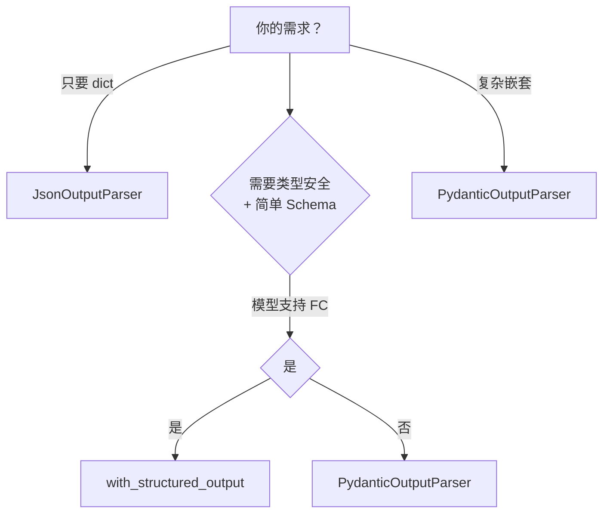

# 第2章 · ChatModel 与结构化输出 — 精准控制 LLM 输入输出

> **时长**：约 2.5 小时 ｜ **难度**：⭐⭐ ｜ **类型**：讲解 + 动手
>
> **目标**：精通消息体系与 Prompt 工程，掌握三种结构化输出方式，让 LLM 返回类型安全的数据

---

## 学习目标

学完本章后，你将能够：
- 用 4 种消息类型精准控制 LLM 的行为
- 根据任务类型正确选择 temperature 和模型
- 用 `ChatPromptTemplate` + `MessagesPlaceholder` 构建动态提示词
- 用 Few-Shot Prompting 通过范例引导 LLM 输出
- 用 `JsonOutputParser` / `PydanticOutputParser` / `with_structured_output` 实现结构化提取
- 处理复杂嵌套 Schema（如简历中的工作经历列表）
- 用 `with_fallbacks()` 实现多模型容错切换

---

## 知识地图


---

# 第一部分：ChatModel 与提示词工程

## 1、消息体系 — LLM 对话的数据协议

**概念定义**：消息（Message）是 LangChain 的数据传输单元，每种消息有明确的角色语义：

| 消息类型 | 角色 | 用途 |
|---------|------|------|
| `SystemMessage` | 系统指令 | 设定 AI 的行为规则（"你是翻译官"） |
| `HumanMessage` | 用户输入 | 用户说的自然语言 |
| `AIMessage` | AI 回复 | AI 的回复（可能含 `tool_calls`） |
| `ToolMessage` | 工具结果 | 工具调用的返回结果 |

**核心定位**：裸调 API 时用 `{"role": "user", "content": "..."}` 裸字典——没有类型安全，容易写错 role 字符串。消息对象提供了类型检查和 IDE 自动补全。

```python
from langchain_core.messages import SystemMessage, HumanMessage, AIMessage, ToolMessage

system_msg = SystemMessage(content="你是专业翻译官")
human_msg = HumanMessage(content="翻译：Hello World")
ai_msg = AIMessage(content="你好世界")
# ToolMessage 在 Agent 章节会用到
```

**消息列表传给 LLM**：

```python
messages = [system_msg, human_msg]
response = llm.invoke(messages)  # → AIMessage
print(response.content)          # "你好世界"（或其他翻译）
```

### 消息流



---

## 2、ChatModel 核心参数

### 2.1 temperature — 创造性的旋钮

**概念定义**：`temperature` 控制 LLM 输出概率分布的"平滑程度"。值为 0 时模型每次都选概率最高的词（确定性）；值为 1 时低概率词也有机会被选中（随机性）。范围通常 0~2。

**选参指南**：



| 场景 | temperature | 原因 |
|------|------------|------|
| 翻译、事实问答、代码生成 | 0 ~ 0.3 | 需要确定性 |
| 日常对话、摘要 | 0.5 ~ 0.7 | 自然但不离谱 |
| 创意写作、头脑风暴 | 0.7 ~ 1.0 | 需要多样性和惊喜 |

### ▶ 执行代码

```powershell
cd code/02-ChatModel与提示词-代码案例
python 01_temperature_demo.py
```

### 2.2 Token 用量

**概念定义**：Token（令牌）是 LLM 计费的基本单位。中文约 1 汉字 ≈ 1.5~2 token，英文 1 单词 ≈ 1.3 token。API 每次调用收取 `prompt_tokens`（输入）+ `completion_tokens`（输出）的费用。

```python
response = llm.invoke("你好")
meta = response.response_metadata
print(meta["token_usage"])
# {"completion_tokens": 5, "prompt_tokens": 8, "total_tokens": 13}
```

**常见模型 Token 单价参考**（2026年6月，每百万 token）：

| 模型 | 输入价格 | 输出价格 | 上下文窗口 |
|------|---------|---------|-----------|
| deepseek-chat | ¥0.14 | ¥0.28 | 128K |
| deepseek-reasoner | ¥0.55 | ¥2.19 | 128K |
| glm-4-flash | 免费 | 免费 | 128K |
| GPT-4o | $2.50 | $10.00 | 128K |

---

## 3、ChatPromptTemplate 深入

### 3.1 基础用法回顾

```python
from langchain_core.prompts import ChatPromptTemplate

prompt = ChatPromptTemplate.from_messages([
    ("system", "你是{expert_role}。用{language}回答，限制{max_words}字以内。"),
    ("human", "{question}"),
])

# 一行调用即可填入所有变量
messages = prompt.invoke({
    "expert_role": "Python 专家",
    "language": "中文",
    "max_words": "50",
    "question": "装饰器是什么？",
})
```

### ▶ 执行代码

```powershell
python 02_chat_prompt_template.py
```

### 3.2 MessagesPlaceholder — 动态消息插槽

**概念定义**：`MessagesPlaceholder` 是 ChatPromptTemplate 中的**动态插槽**。它不在模板中写死内容，而是运行时接收一个消息列表插入到指定位置。这是实现"多轮对话记忆"的关键机制。

**核心定位**：模板是静态的，但对话历史是动态增长的。MessagesPlaceholder 让你在固定模板中留一个"活口"。

```python
from langchain_core.prompts import ChatPromptTemplate, MessagesPlaceholder

prompt = ChatPromptTemplate.from_messages([
    ("system", "你是智能客服助手。"),
    MessagesPlaceholder(variable_name="history"),  # ← 历史消息插在这里
    ("human", "{question}"),
])

# 运行时注入任意历史
result = prompt.invoke({
    "history": [
        HumanMessage(content="我的订单号是 12345"),
        AIMessage(content="好的，正在为您查询..."),
    ],
    "question": "到哪了？",
})
```

**模板结构可视化**：



### ▶ 执行代码

```powershell
python 04_messages_placeholder.py
```

### 3.3 Few-Shot Prompting — 给 LLM 看范例

**概念定义**：Few-Shot Prompting 是在 prompt 中预先放置几个"输入→正确输出"范例，让 LLM 通过"看例子"来理解任务格式和期望风格。

**核心定位**：有些任务很难用话描述清楚（"翻译成商务正式风格"到底是什么风格？），给 3 个例子比写 300 字说明更有效。

```python
from langchain_core.prompts import FewShotChatMessagePromptTemplate

# 1. 定义范例
examples = [
    {"input": "今天心情真好", "output": "POSITIVE"},
    {"input": "堵车堵死了", "output": "NEGATIVE"},
    {"input": "今天周三", "output": "NEUTRAL"},
]

# 2. 范例的格式模板
example_prompt = ChatPromptTemplate.from_messages([
    ("human", "{input}"),
    ("ai", "{output}"),
])

# 3. 创建 Few-Shot 模板
few_shot_prompt = FewShotChatMessagePromptTemplate(
    examples=examples,
    example_prompt=example_prompt,
    input_variables=["input"],
)

# 4. 拼到正式 prompt 中
final_prompt = ChatPromptTemplate.from_messages([
    ("system", "你是情感分析器。只输出 POSITIVE / NEGATIVE / NEUTRAL。"),
    few_shot_prompt,  # ← 范例自动插入到这里
    ("human", "{input}"),
])

chain = final_prompt | llm | StrOutputParser()
result = chain.invoke({"input": "这部电影太精彩了"})
print(result)  # → POSITIVE
```

**组装后的 Prompt 结构**：



### ▶ 执行代码

```powershell
python 03_few_shot_sentiment.py
```

---

## 4、模型选择策略

### 4.1 通用模型 vs 推理模型



| 判断维度 | 选 chat 通用模型 | 选 reasoner 推理模型 |
|---------|----------------|-------------------|
| 任务特征 | 对话、翻译、摘要、写作 | 数学证明、复杂逻辑、多步推理 |
| 速度要求 | 需要秒级响应 | 可接受等待数十秒 |
| 成本敏感 | 预算有限 | 正确性优先于成本 |

### 4.2 多模型回退 — with_fallbacks()

**概念定义**：`with_fallbacks()` 是 Runnable 协议的容错机制。主模型失败时自动按顺序尝试备选模型，对调用者完全透明。

**核心定位**：生产环境中 API 不总是可用——DeepSeek 可能限流、智谱可能超时。没有 fallback 时用户看到报错堆栈，有 fallback 时自动切换，用户无感知。

```python
# 定义主模型和备用模型
primary = ChatOpenAI(
    model="deepseek-chat",
    base_url=os.getenv("DEEPSEEK_BASE_URL"),
    api_key=os.getenv("DEEPSEEK_API_KEY"),
    temperature=0,
)
backup = ChatOpenAI(
    model="glm-4-flash",
    base_url=os.getenv("ZHIPU_BASE_URL"),
    api_key=os.getenv("ZHIPU_API_KEY"),
    temperature=0,
)

# 一行设置回退
resilient_llm = primary.with_fallbacks([backup])

# 使用方式和普通调用完全一样
response = resilient_llm.invoke("介绍一下量子计算")
```

**四种回退场景**：

| 场景 | 主模型 | 备用模型 | 原因 |
|------|--------|---------|------|
| 成本优先 | deepseek-chat | glm-4-flash | 主备都便宜的 |
| 质量优先 | deepseek-reasoner | deepseek-chat | 推理失败给快答 |
| 跨厂商容灾 | DeepSeek | 智谱 | 某厂商全站故障 |
| Chain 级别 | 完整 RAG Chain | 简化直答 Chain | 检索挂了至少能答 |

**执行顺序**：先调 `primary` → 失败则 `backup` → 全部失败才抛异常。

### ▶ 执行代码

```powershell
python 05_model_fallback.py
```

---

# 第二部分：结构化输出

## 5、裸调 LLM 的 "JSON 噩梦"

LLM 返回 JSON 时经常出现以下问题：

```python
# 你期望的：
{"name": "张三", "age": 25, "skills": ["Python", "React"]}

# LLM 实际可能返回：
# 1. "好的，以下是提取结果：\n```json\n{...}\n```"
# 2. "{\"nmae\": \"张三\", ...}"   ← 字段名拼错
# 3. "{\"name\": \"张三\",}"      ← 多了逗号
# 4. "{\"name\"：\"张三\"}"       ← 中文引号
```

**核心痛点**：LLM 是概率模型，输出格式不完全可控。手工 `json.loads()` 在生产环境中是定时炸弹。



---

## 6、JsonOutputParser — 最轻量的起点

**概念定义**：指示 LLM 输出纯 JSON，对返回字符串执行 `json.loads()`。零配置，但不做类型校验。

**适用场景**：快速原型、内部脚本、字段结构简单的场景。

### ▶ 执行代码

```powershell
cd code/04-结构化输出-代码案例
python 01_json_output_parser.py
```

### 代码实现

```python
from langchain_core.output_parsers import JsonOutputParser
from langchain_core.prompts import ChatPromptTemplate
from langchain_openai import ChatOpenAI
from dotenv import load_dotenv
import os

load_dotenv()

llm = ChatOpenAI(
    model="deepseek-chat",
    base_url=os.getenv("DEEPSEEK_BASE_URL"),
    api_key=os.getenv("DEEPSEEK_API_KEY"),
    temperature=0,  # 结构化提取务必用 0
)

parser = JsonOutputParser()

prompt = ChatPromptTemplate.from_messages([
    ("system", "你是一个信息提取助手。请按以下格式输出：\n{format_instructions}"),
    ("human", "{description}"),
])

# 关键：将 format_instructions 注入 prompt
prompt = prompt.partial(format_instructions=parser.get_format_instructions())

chain = prompt | llm | parser

result = chain.invoke({"description": "我叫李四，电话13800138000，住北京朝阳区"})
print(result)       # {'name': '李四', 'phone': '13800138000', 'address': '北京朝阳区'}
print(type(result)) # <class 'dict'>
```

### format_instructions 的作用

`parser.get_format_instructions()` 返回类似这样的文字注入 prompt：
```
The output should be a JSON object.
Output only the JSON, no markdown code blocks, no explanations.
```

这是让 LLM "听话"的关键——明确要求只输出纯 JSON。

### 局限性

- 返回的是 dict，没有类型校验——字段类型错了不会报错
- LLM 可能仍然不按期望的字段名输出
- IDE 无法自动补全 `result.xxx`

---

## 7、PydanticOutputParser — 类型安全的进阶

**概念定义**：将 Pydantic Model 的定义自动转为 format_instructions 注入 prompt，并在解析时做严格类型校验。

**适用场景**：需要类型安全、IDE 自动补全、字段校验的生产场景。

### ▶ 执行代码

```powershell
python 02_pydantic_output_parser.py
```

### 代码实现

```python
from pydantic import BaseModel, Field
from langchain_core.output_parsers import PydanticOutputParser

# 1. 定义 Schema——这就是你和 LLM 之间的"合同"
class Person(BaseModel):
    name: str = Field(description="姓名")
    age: int = Field(description="年龄")
    skills: list[str] = Field(description="技能列表")

parser = PydanticOutputParser(pydantic_object=Person)

# 2. format_instructions 自动生成了完整的字段描述
# LLM 看到的是：
# {"name": "姓名（string）", "age": "年龄（integer）", "skills": "技能列表（array of strings）"}

prompt = ChatPromptTemplate.from_messages([
    ("system", "从简历中提取个人信息。\n{format_instructions}"),
    ("human", "{resume}"),
])
prompt = prompt.partial(format_instructions=parser.get_format_instructions())

chain = prompt | llm | parser

result = chain.invoke({"resume": "王五，25岁，精通 Python 和 React，3年后端经验"})
print(result.name)    # 王五（IDE 自动补全！）
print(result.age)     # 25
print(result.skills)  # ['Python', 'React']
print(type(result))   # <class '__main__.Person'>
```

### 数据流



### PydanticOutputParser 的优势

- **编译期**：IDE 自动补全 `.name` `.age`
- **运行时**：字段类型不符自动报错
- **可组合**：嵌套 Pydantic Model 轻松处理复杂结构

---

## 8、with_structured_output — ⭐ 推荐方式

**概念定义**：利用模型**原生的 Function Calling / JSON Mode 能力**在 API 层面约束输出格式。不需要 Parser，不需要 format_instructions。

**核心区别**：
- PydanticOutputParser：依赖 prompt 工程（在 prompt 里描述格式）→ 模型仍可能不听话
- with_structured_output：依赖 API 层面的约束（`response_format` / `tools` 参数）→ 模型必须遵守

### ▶ 执行代码

```powershell
python 03_structured_output.py
```

### 三种 Schema 定义方式

```python
from pydantic import BaseModel, Field
from typing import Literal

# === 方式 A：Pydantic Model ===
class Person(BaseModel):
    name: str = Field(description="姓名")
    age: int = Field(description="年龄")
    skills: list[str] = Field(description="技能列表")

# DeepSeek 需要用 method="json_mode"
structured_llm = llm.with_structured_output(Person, method="json_mode")

prompt = ChatPromptTemplate.from_messages([
    ("system", "你是一个信息提取助手。请将用户描述提取为 JSON 对象。"),
    ("human", "{text}"),
])

chain = prompt | structured_llm
result = chain.invoke({"text": "王五，25岁，精通 Python 和 React"})
# → Person(name='王五', age=25, skills=['Python', 'React'])

# === 方式 B：TypedDict（Python 原生类型提示，无需 Pydantic） ===
from typing import TypedDict

class MovieReview(TypedDict):
    title: str
    rating: float
    summary: str

review_llm = llm.with_structured_output(MovieReview, method="json_mode")
review_prompt = ChatPromptTemplate.from_messages([
    ("system", "你是一个影评分析助手。请将分析结果输出为 JSON 对象。"),
    ("human", "分析这部电影：{text}"),
])
review_chain = review_prompt | review_llm
review = review_chain.invoke({"text": "《流浪地球3》视觉效果震撼，我给8.5分"})
# → {'title': '流浪地球3', 'rating': 8.5, 'summary': '视觉效果震撼'}

# === 方式 C：纯 JSON Schema 字典（最灵活，不需要任何库） ===
json_schema = {
    "title": "Book",
    "type": "object",
    "properties": {
        "title": {"type": "string"},
        "author": {"type": "string"},
        "year": {"type": "integer"},
    },
    "required": ["title", "author", "year"],
}

book_llm = llm.with_structured_output(json_schema, method="json_mode")
book_chain = book_prompt | book_llm
book = book_chain.invoke({"text": "《三体》是刘慈欣写的，2008年出版"})
# → {'title': '三体', 'author': '刘慈欣', 'year': 2008}
```

> **注意**：DeepSeek 目前需要使用 `method="json_mode"`，且 prompt 中需包含 "JSON" 关键词。

---

## 9、复杂嵌套 Schema 提取

对于包含嵌套对象列表的复杂结构，推荐用 `PydanticOutputParser`——它的 format_instructions 完整包含嵌套字段定义。

### ▶ 执行代码

```powershell
python 04_complex_extraction.py
```

```python
from langchain_core.output_parsers import PydanticOutputParser

# 嵌套结构定义
class WorkExperience(BaseModel):
    company: str = Field(description="公司名称")
    position: str = Field(description="职位")
    duration_years: float = Field(description="工作年限")
    highlights: list[str] = Field(description="关键成就")

class Resume(BaseModel):
    name: str = Field(description="姓名")
    age: int = Field(description="年龄")
    education: str = Field(description="最高学历")
    experiences: list[WorkExperience] = Field(description="工作经历列表")
    skills: list[str] = Field(description="技能列表")

parser = PydanticOutputParser(pydantic_object=Resume)
prompt = ChatPromptTemplate.from_messages([
    ("system", "从简历中提取信息。\n{format_instructions}"),
    ("human", "{text}"),
])
prompt = prompt.partial(format_instructions=parser.get_format_instructions())

chain = prompt | llm | parser

resume_text = """
张三，30岁，清华大学计算机硕士。
2019-2021 在阿里巴巴任高级工程师，负责双11架构优化，将系统QPS提升3倍。
2021-至今 在字节跳动任技术专家，带领5人团队，主导推荐系统重构。
技能：Python、Go、分布式系统、机器学习。
"""

result = chain.invoke({"text": resume_text})
print(result.name)         # 张三
for exp in result.experiences:
    print(f"  {exp.company} - {exp.position}")
# 阿里巴巴 - 高级工程师
# 字节跳动 - 技术专家
```

---

## 10、三种方式对比与选择

| 对比维度 | JsonOutputParser | PydanticOutputParser | with_structured_output |
|---------|-----------------|---------------------|----------------------|
| 类型安全 | 无（返回 dict） | 编译 + 运行双保险 | 视 Schema 而定 |
| 代码量 | 最少 | 需定义 Pydantic Model | 最简洁 |
| 可靠性 | 中（依赖 prompt） | 中高（prompt + 校验） | **高**（API 层约束） |
| 跨模型兼容 | 最好 | 好 | 需模型支持 FC/JSON Mode |
| 嵌套结构 | 不可控 | **最好** | 好 |
| 推荐场景 | 简单 JSON / 原型 | 复杂 Schema / 跨模型 | **生产环境首选** |

### 选择决策树



---

## 11、OutputFixingParser — 纠错兜底

当 Parser 解析失败时，`OutputFixingParser` 将错误信息和原始输出一起发给 LLM，让 LLM **自己修复格式问题**后重新解析：

```python
from langchain_core.output_parsers import OutputFixingParser

# 包装原有 Parser，解析失败时自动调用 LLM 修复
fixing_parser = OutputFixingParser.from_llm(
    parser=PydanticOutputParser(pydantic_object=Person),
    llm=llm,
)

# 即使 LLM 输出格式有问题，也会自动修复后重试
result = fixing_parser.invoke(malformed_output)  # 仍然返回 Person 对象
```

---

## 常见踩坑

1. **temperature 必须为 0**：结构化提取是确定性任务，temperature > 0 会导致字段名随机变化
2. **Few-Shot 范例的顺序很重要**：把最典型的范例放前面；3~5 个范例最佳，超过 10 个可能让模型"过拟合"
3. **`with_fallbacks` 的失败判断**：只有网络错误、超时、5xx 才会触发回退，4xx（如参数错误）不会
4. **DeepSeek 需用 `method="json_mode"`**：默认 function_calling 模式暂不支持
5. **json_mode 需 prompt 包含 "JSON"**：DeepSeek 检测到 "JSON" 关键词才会触发 JSON 模式
6. **字段描述用中文**：LLM 对中文 `Field(description="...")` 的理解通常比英文更好
7. **嵌套太深可能失败**：3 层以上的嵌套，考虑拆分为多次调用

---

## 课后练习

1. 设计一个 Few-Shot Prompt，让 LLM 将中文口语转为正式的商务邮件（给 3 个范例）
2. 对比 temperature=0 和 temperature=0.7 在同一段文本的情感分析中的表现差异
3. 配置两个不同厂商的模型，用 `with_fallbacks()` 实现容灾切换
4. 写一个 Chain，从一段中文新闻中提取：标题、日期、关键人物、事件摘要（用 PydanticOutputParser）
5. 用 `with_structured_output` 实现情感分析：输入评论，输出 `{sentiment, confidence, keywords}`
6. 对比 JsonOutputParser 和 with_structured_output 对同一段文本的提取效果

---

## 本节小结

- ✅ 理解了 4 种消息类型的角色语义（System / Human / AI / Tool）
- ✅ 掌握了 temperature 的调参逻辑和选参指南
- ✅ 能写出 ChatPromptTemplate + MessagesPlaceholder + Few-Shot 的复杂 Prompt
- ✅ 理解了结构化输出解决的核心问题：告别 `json.loads()` 失败
- ✅ 掌握了三种结构化输出方式：JsonOutputParser / PydanticOutputParser / with_structured_output
- ✅ 能处理嵌套对象列表的复杂 Schema
- ✅ 会用 `with_fallbacks()` 实现多模型容错切换

---

> **下一章**：第3章 · LCEL 链式编排深度——掌握 Runnable 协议，实现并行、分支、路由等复杂编排
