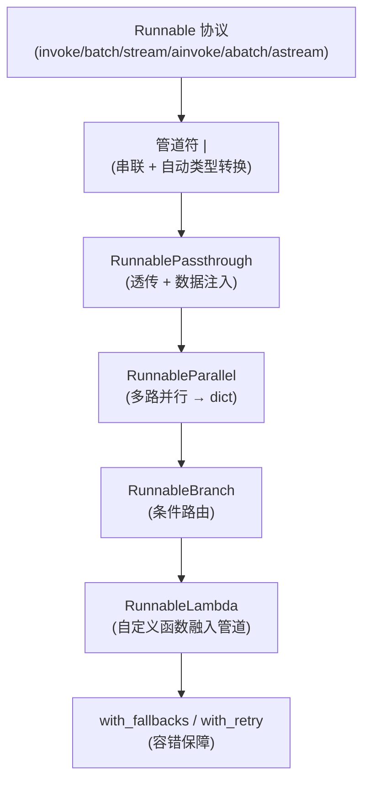
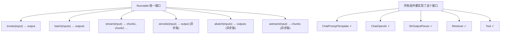
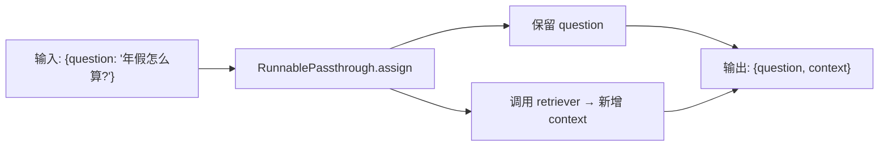
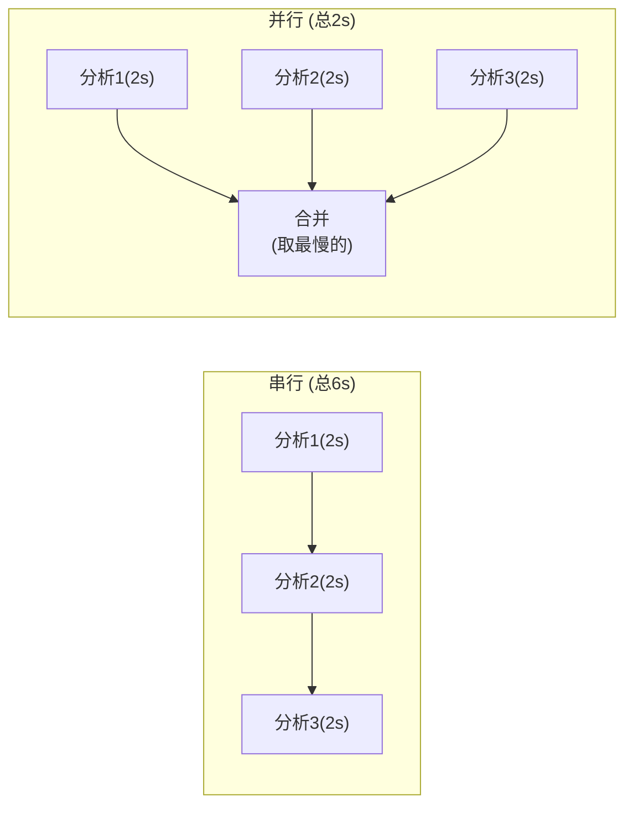
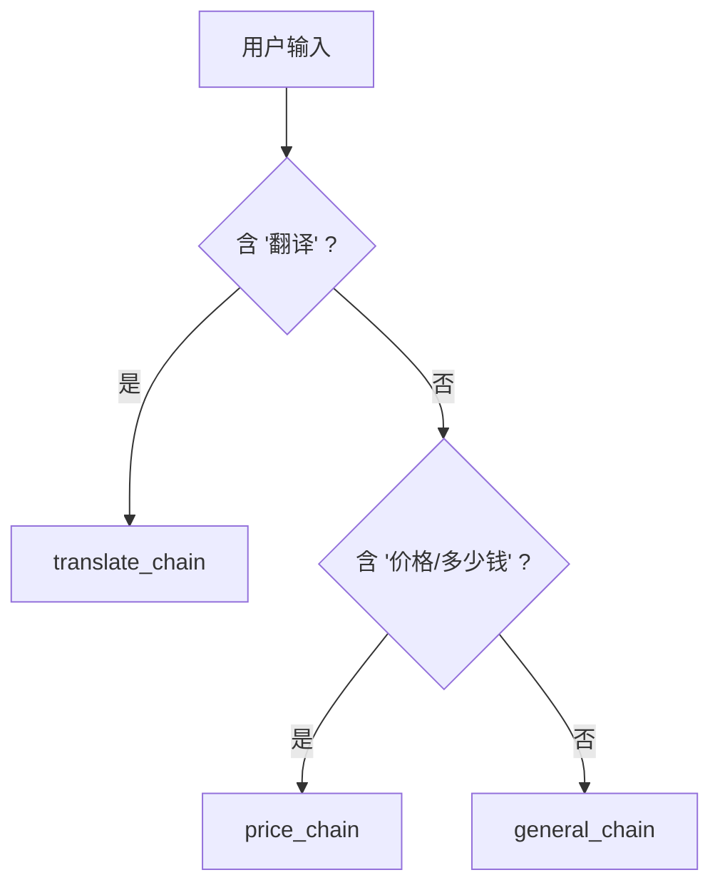

# 第3章 · LCEL 链式编排深度 — 乐高式组装 AI 能力

> **时长**：约 2 小时 ｜ **难度**：⭐⭐⭐ ｜ **类型**：讲解 + 动手
>
> **目标**：精通 Runnable 协议和 LCEL 各类组件，实现并行、分支、路由等复杂编排

---

## 学习目标

学完本章后，你将能够：
- 理解 Runnable 协议的统一接口设计
- 用 `RunnablePassthrough.assign()` 在数据流中注入新字段
- 用 `RunnableParallel` 实现多路并行调用，成倍提升速度
- 用 `RunnableBranch` 实现智能路由，一个入口分发多种意图
- 用 `RunnableLambda` 将任意 Python 函数融入管道
- 用 `with_fallbacks()` + `with_retry()` 保障生产稳定性

---

## 知识地图



---

## 1、Runnable 协议 — 统一接口

**概念定义**：Runnable 协议是 LangChain 的**统一组件接口**。所有组件（Prompt、ChatModel、Parser、Retriever、Tool）都实现了 `Runnable`，拥有完全相同的方法签名。

**核心价值**：
- 学会一个组件，全部通用——学习成本趋近于零
- 组件可以任意互换——把 Prompt 换成自定义函数，管道照样工作
- 同步/异步切换只需换方法名——`invoke` → `ainvoke`



### bind() — 预绑定参数

```python
from langchain_openai import ChatOpenAI

model = ChatOpenAI(model="deepseek-chat", temperature=0)

# 绑定 stop 词：遇到句号停止生成
model_short = model.bind(stop=["。"])
response = model_short.invoke("用一句话介绍东星斑")
print(response.content)  # 只到第一个句号就停
```

---

## 2、管道符 `|` 的完整语义

**概念定义**：`|` 不仅表示"串联"，它做了两件事：
1. 左边输出传给右边输入
2. 如果类型不匹配，**自动做格式转换**（coercion）

```python
# 这两行等价：
chain = prompt | llm | parser
chain = prompt.__or__(llm).__or__(parser)
```

**自动类型转换规则**：

| 左边输出 | 右边期望 | 转换方式 |
|---------|---------|---------|
| `dict` | `ChatPromptValue` | 调用 `prompt.invoke(dict)` |
| `ChatPromptValue` | `list[BaseMessage]` | 转为消息列表 |
| `AIMessage` | `str` | 提取 `.content` |

**核心价值**：不同组件的数据格式不同（dict / Value / Message / str），手动转换又臭又长。管道符的自动 coercion 让你忽略中间格式差异。

---

## 3、RunnablePassthrough — 透传与数据注入

**概念定义**：`RunnablePassthrough` 输入什么就输出什么。它的真正价值在 `.assign()` 方法：在原输入上**附加新字段**而不改动已有字段。

**核心定位**：RAG 场景的核心矛盾——Prompt 需要 `{context, question}` 两个字段，但用户只输入了 `{question}`。`RunnablePassthrough.assign(context=...)` 保留用户输入的同时注入检索结果。

### ▶ 执行代码

```powershell
cd code/03-LCEL深度-代码案例
python 01_runnable_passthrough.py
```

### 使用示例

```python
from langchain_core.runnables import RunnablePassthrough

# 方式1：assign() —— 追加字段（最常用）
chain = RunnablePassthrough.assign(
    total=lambda x: sum(x["prices"]),
    count=lambda x: len(x["prices"])
)

result = chain.invoke({"prices": [388, 268, 158], "customer": "张先生"})
# → {'prices': [388, 268, 158], 'customer': '张先生', 'total': 814, 'count': 3}

# 方式2：RAG 数据注入（核心模式）
rag_chain = (
    RunnablePassthrough.assign(
        context=lambda x: retriever.invoke(x["question"])  # 检索注入
    )
    | prompt
    | llm
    | parser
)
# 输入 {"question": "年假怎么算?"}
# → 自动变成 {"question": "年假怎么算?", "context": "入职满1年享5天..."}
```

**数据流可视化**：



---

## 4、RunnableParallel — 并行执行

**概念定义**：让多个分支**同时并行执行**，结果合并到一个 dict 中。

**核心价值**：一个输入需要做多项分析（情感 + 关键词 + 摘要），顺序调用耗时长，并行调用 3 者同时进行——总耗时从 T1+T2+T3 降为 max(T1, T2, T3)。

### ▶ 执行代码

```powershell
python 02_runnable_parallel.py
```

### 使用示例

```python
from langchain_core.runnables import RunnableParallel
from langchain_core.prompts import ChatPromptTemplate
from langchain_openai import ChatOpenAI
from langchain_core.output_parsers import StrOutputParser

model = ChatOpenAI(model="deepseek-chat", temperature=0)
parser = StrOutputParser()

# 三个独立的分析链
price_chain = ChatPromptTemplate.from_template(
    "老码头餐厅{dish}的价格？只回答数字"
) | model | parser

feature_chain = ChatPromptTemplate.from_template(
    "老码头餐厅{dish}的特点？10字内"
) | model | parser

pairing_chain = ChatPromptTemplate.from_template(
    "{dish}适合搭配什么菜？推荐一道"
) | model | parser

# 并行执行——3 个请求同时发出
parallel = RunnableParallel(
    price=price_chain,
    feature=feature_chain,
    pairing=pairing_chain,
)
# 简写语法：parallel = {"price": price_chain, "feature": feature_chain}

result = parallel.invoke({"dish": "清蒸东星斑"})
print(f"价格: {result['price']}")
print(f"特点: {result['feature']}")
print(f"搭配: {result['pairing']}")
```

**并行 vs 串行**：



---

## 5、RunnableBranch — 条件路由

**概念定义**：接收一系列 `(条件函数, 执行链)` 对，按顺序匹配：第一个为真就执行对应链，都不匹配则走默认链。本质是 if-elif-else 的 LCEL 版本。

**核心定位**：用户输入千变万化——翻译请求 / 价格查询 / 闲聊——不可能一个 Chain 处理所有。用 Branch 实现"一句话路由"。

### ▶ 执行代码

```powershell
python 03_runnable_branch.py
```

### 使用示例

```python
from langchain_core.runnables import RunnableBranch

# 不同意图的处理链
translate_chain = prompt_translate | model | parser
price_chain = prompt_price | model | parser
general_chain = prompt_general | model | parser

# 条件路由
router = RunnableBranch(
    (lambda x: "翻译" in x["query"], translate_chain),
    (lambda x: any(kw in x["query"] for kw in ["价格", "多少钱"]), price_chain),
    general_chain,  # 默认链（不带条件的最后一个参数）
)

# 测试
print(router.invoke({"query": "翻译成英文：你好"}))       # → translate_chain
print(router.invoke({"query": "东星斑多少钱"}))           # → price_chain
print(router.invoke({"query": "你们几点关门"}))           # → general_chain
```

**路由流程**：



---

## 6、RunnableLambda — 自定义函数融入管道

**概念定义**：把任意 Python 函数包装成 Runnable，融入 LCEL 管道。只要函数签名是 `(input) → output`。

**核心定位**：LLM 生成的结果往往需要后处理（清洗格式、加时间戳、计算逻辑）。用 `RunnableLambda` 把处理逻辑也纳入管道，保持代码统一。

### ▶ 执行代码

```powershell
python 04_runnable_lambda.py
```

### 使用示例

```python
from langchain_core.runnables import RunnableLambda

# 数据处理函数
MENU = {"清蒸东星斑": 388, "避风塘炒蟹": 268, "金牌烧鹅": 158}

def calculate_order(order: dict) -> dict:
    """计算订单总价"""
    dishes = order.get("dishes", [])
    total = sum(MENU.get(d, 0) for d in dishes)
    return {**order, "total": total}

def format_order(data: dict) -> str:
    """格式化输出"""
    lines = ["订单确认："]
    for dish in data["dishes"]:
        lines.append(f"  - {dish}: {MENU.get(dish, 0)}元")
    lines.append(f"  总计: {data['total']}元")
    return "\n".join(lines)

# 融入管道
order_chain = RunnableLambda(calculate_order) | RunnableLambda(format_order)

result = order_chain.invoke({"dishes": ["清蒸东星斑", "金牌烧鹅"]})
print(result)
# 订单确认：
#   - 清蒸东星斑: 388元
#   - 金牌烧鹅: 158元
#   总计: 546元
```

### 与 LLM 管道组合

```python
from datetime import datetime

chain = (
    RunnableLambda(lambda x: x.strip().lower())      # 预处理：清洗输入
    | prompt
    | llm
    | StrOutputParser()
    | RunnableLambda(lambda x: f"[{datetime.now()}] {x}")  # 后处理：加时间戳
)
```

---

## 7、完整示例：智能路由客服

```python
"""老码头餐厅智能客服 — 意图路由 + 并行分析"""
from langchain_core.runnables import RunnableBranch, RunnablePassthrough, RunnableParallel
from langchain_core.prompts import ChatPromptTemplate
from langchain_openai import ChatOpenAI
from langchain_core.output_parsers import StrOutputParser
from dotenv import load_dotenv

load_dotenv()

MENU = {
    "清蒸东星斑": 388, "避风塘炒蟹": 268, "金牌烧鹅": 158,
    "蜜汁叉烧": 88, "花胶炖鸡汤": 188, "杨枝甘露": 32
}

model = ChatOpenAI(model="deepseek-chat", temperature=0)
parser = StrOutputParser()

# 意图检测
def detect_intent(query: str) -> str:
    if any(kw in query for kw in ["多少钱", "价格"]):
        return "price"
    elif any(kw in query for kw in ["推荐", "什么好"]):
        return "recommend"
    elif any(kw in query for kw in ["预订", "订位"]):
        return "booking"
    return "general"

# 四个意图处理链
price_chain = ChatPromptTemplate.from_messages([
    ("system", f"你是客服小码。菜单：{MENU}"),
    ("human", "{query}")
]) | model | parser

recommend_chain = ChatPromptTemplate.from_messages([
    ("system", f"你是客服小码，根据预算推荐。菜单：{MENU}"),
    ("human", "{query}")
]) | model | parser

booking_chain = ChatPromptTemplate.from_messages([
    ("system", "你是客服小码，处理预订，需确认人数、时间、电话。"),
    ("human", "{query}")
]) | model | parser

general_chain = ChatPromptTemplate.from_messages([
    ("system", "你是客服小码，热情回答问题。"),
    ("human", "{query}")
]) | model | parser

# 路由
router = RunnableBranch(
    (lambda x: x["intent"] == "price", price_chain),
    (lambda x: x["intent"] == "recommend", recommend_chain),
    (lambda x: x["intent"] == "booking", booking_chain),
    general_chain,
)

# 完整链：检测意图 → 路由 → 返回结果
full_chain = (
    RunnablePassthrough.assign(intent=lambda x: detect_intent(x["query"]))
    | RunnableParallel(response=router, intent=lambda x: x["intent"])
)

# 测试
for q in ["东星斑多少钱？", "预算200推荐什么？", "我要预订明天2人", "你们几点关门？"]:
    result = full_chain.invoke({"query": q})
    print(f"[{result['intent']}] Q: {q}")
    print(f"A: {result['response']}\n")
```

---

## 8、Runnable 组件速查

| 组件 | 作用 | 典型场景 |
|------|------|---------|
| `RunnablePassthrough` | 透传输入 | RAG 中保留原始问题 |
| `.assign()` | 在原输入上追加字段 | 注入检索结果、意图分类 |
| `RunnableParallel` | 多路并行，结果合并到 dict | 同时分析情感+关键词+摘要 |
| `RunnableBranch` | if-elif-else 条件路由 | 意图识别、智能分流 |
| `RunnableLambda` | 普通函数 → Runnable | 数据清洗、格式转换、业务逻辑 |
| `.bind()` | 预绑定参数 | 设置 stop 词、固定参数 |
| `.with_fallbacks()` | 失败时自动切换备选 | 主模型挂了切换备用 |
| `.with_retry()` | 失败后自动重试 | 网络抖动时的容错 |

---

## 常见踩坑

1. **RunnableBranch 的条件顺序很重要**：第一个匹配的就执行，把最具体的条件放前面
2. **Parallel 中的链必须互相独立**：有数据依赖的不能并行
3. **Lambda 函数要保持简单**：复杂的业务逻辑应该封装为独立函数再包装
4. **管道中类型不匹配时**：加上 `RunnableLambda` 手动转换

---

## 课后练习

1. 将你之前写的"翻译 + 摘要 + 情感分析"三个独立 Chain，用 `RunnableParallel` 组合为并行调用
2. 用 `RunnableBranch` 实现一个意图路由器：输入包含"翻译"→翻译链，"总结"→摘要链，"分析"→情感链，其他→通用对话链
3. 写一个 Chain，将用户输入清洗（去空格、截断过长文本）→ 调 LLM → 给结果加上时间戳

---

## 本节小结

- ✅ 理解了 Runnable 协议及其 6 个标准方法
- ✅ 掌握了 `RunnablePassthrough.assign()` — RAG 场景的核心数据注入模式
- ✅ 能使用 `RunnableParallel`（并行提速）和 `RunnableBranch`（条件路由）
- ✅ 会用 `RunnableLambda` 把任意函数融入 LCEL 管道
- ✅ 了解 `with_fallbacks` + `with_retry` 的容错保障机制

---

> **下一章**：第4章 · RAG 检索增强生成——给 LLM 装上你的私有知识库
