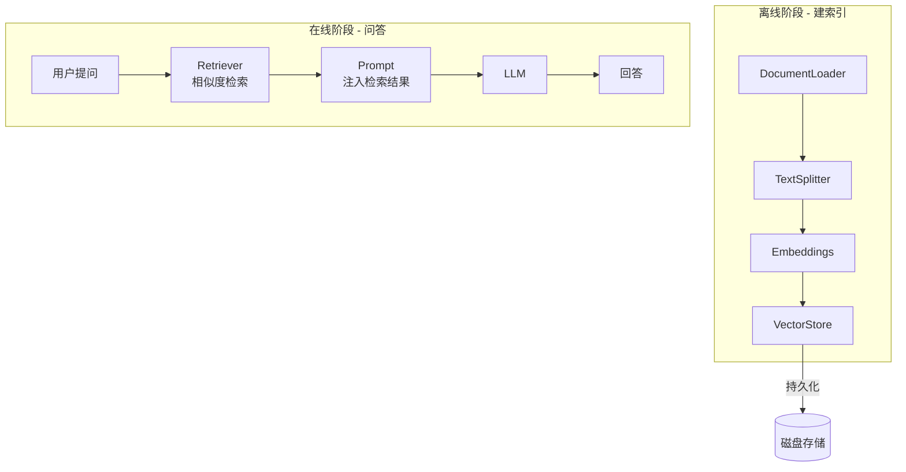
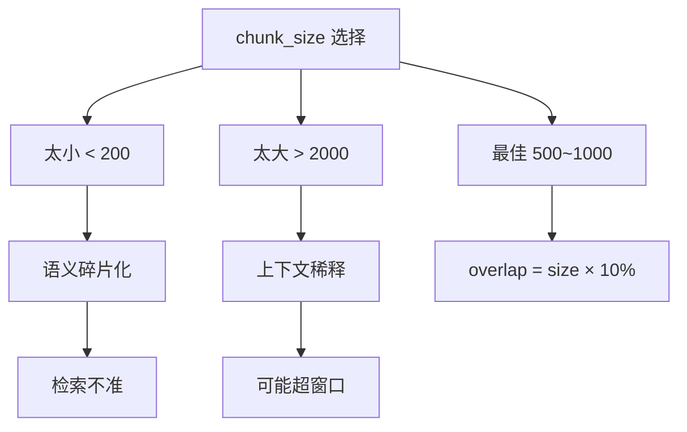
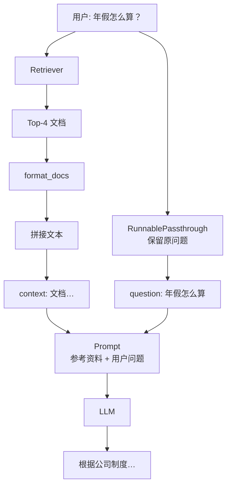

# 第4章 · RAG 检索增强生成 — 企业私有知识库的高效落地

> **时长**：约 2.5 小时 ｜ **难度**：⭐⭐⭐ ｜ **类型**：项目实战
>
> **目标**：掌握 RAG 全流程，构建基于私有文档的智能问答系统

---

## 学习目标

学完本章后，你将能够：
- 解释 RAG 的核心架构：先检索、再生成
- 用 Document Loader 加载不同格式的文档
- 用 Text Splitter 按策略切分文档为适当大小的 chunk
- 用 Embeddings 将文本转为语义向量
- 用 VectorStore 存储向量并提供相似度检索
- 构建完整的 RAG Chain（含来源引用）
- 使用 MMR 和阈值过滤优化检索质量

---

## 知识地图



---

## 1、RAG 核心概念

**概念定义**：RAG（Retrieval-Augmented Generation，检索增强生成）是先检索、再生成的技术架构。用户提问时，先从文档库中检索最相关的内容片段，将这些片段作为"参考资料"发给 LLM，让 LLM 基于真实文档回答。

**核心定位**：LLM 有三大缺陷，RAG 逐一解决：
- LLM 训练数据有截止日期 → RAG 检索最新文档
- LLM 会产生"幻觉"（编造事实）→ RAG 基于真实文档回答
- 私有文档 LLM 无法直接访问 → RAG 检索本地知识库

**RAG 数据流**：


**典型应用场景**：

| 场景 | 文档类型 | 典型问题 |
|------|---------|---------|
| 企业制度问答 | 员工手册、HR政策 | "年假怎么算？" |
| 技术文档问答 | API 文档、运维手册 | "这个接口怎么调？" |
| 法律合规检索 | 合同条款、法规条文 | "这条款什么意思？" |
| 教学知识库 | 课程资料、题库 | "这道题怎么做？" |
| 医疗知识库 | 药品说明、诊疗指南 | "这个药有什么副作用？" |

---

## 2、Document Loader — 加载文档

**概念定义**：Document Loader 从各种来源读取原始内容并转为 LangChain 的 `Document` 对象。每个 Document 包含 `page_content`（文本）和 `metadata`（来源信息）。

**核心定位**：不同格式需要不同读取方式，Loader 统一为 `.load() → list[Document]`。

### ▶ 执行代码

```powershell
cd code/05-RAG检索增强生成-代码案例
python 01_document_loader.py
```

### 代码实现

```python
from langchain_community.document_loaders import TextLoader

loader = TextLoader("./data/employee_handbook.txt", encoding="utf-8")
docs = loader.load()
print(docs[0].page_content[:200])  # 文档内容
# Document(page_content="员工手册...", metadata={"source": "./data/..."})
```

### 常用 Loader

| Loader | 用途 | 额外依赖 |
|--------|------|---------|
| `TextLoader` | 纯文本 | 内置 |
| `PyPDFLoader` | PDF 文档 | `pip install pypdf` |
| `CSVLoader` | CSV 表格 | 内置 |
| `Docx2txtLoader` | Word 文档 | `pip install docx2txt` |
| `WebBaseLoader` | 网页内容 | `pip install beautifulsoup4` |
| `UnstructuredMarkdownLoader` | Markdown | `pip install unstructured` |

---

## 3、Text Splitter — 切分文档

**概念定义**：将长文档按策略切分为固定大小的 chunk（片段）。核心参数：
- `chunk_size`：每块最大长度
- `chunk_overlap`：相邻块的重叠长度（防止在语义边界切断）

**核心定位**：LLM 上下文窗口有限，送整本书会超限；太长的文本稀释检索精度；在段落/句子边界切断避免语义碎片化。

### ▶ 执行代码

```powershell
python 02_text_splitter.py
```

### 代码实现

```python
from langchain_text_splitters import RecursiveCharacterTextSplitter

splitter = RecursiveCharacterTextSplitter(
    chunk_size=500,        # 每块最大 500 字符
    chunk_overlap=50,      # 相邻块重叠 50 字符（避免切断语义）
    separators=["\n\n", "\n", "。", "，", " ", ""],  # 优先在段落边界切
)
chunks = splitter.split_documents(docs)
print(f"原文档被切分为 {len(chunks)} 个 chunk")
```

**chunk_size 选择指南**：



---

## 4、Embeddings — 文本转向量

**概念定义**：Embeddings 将文本映射为高维空间中的数值向量。语义相近的文本，向量距离也近。

**核心定位**：关键词搜索只能精确匹配（"年假"搜不到"带薪休假"）。向量搜索按语义相似度匹配——用户问"怎么请假"能检索到"年假申请流程"。

### ▶ 执行代码

```powershell
python 03_embedding_vectorstore.py
```

### 代码实现

```python
from langchain_openai import OpenAIEmbeddings
import os

embeddings = OpenAIEmbeddings(
    model="embedding-2",
    base_url=os.getenv("ZHIPU_BASE_URL"),
    api_key=os.getenv("ZHIPU_API_KEY"),
)

# 将文本转为向量
vector = embeddings.embed_query("年假政策")
print(len(vector))  # → 1024（1024维浮点数向量）
```

### Embedding 模型对比

| 模型 | 维度 | 中文能力 | 部署方式 |
|------|------|---------|---------|
| 智谱 embedding-2 | 1024 | 优秀 | API 调用 |
| 智谱 embedding-3 | 2048 | 最优 | API 调用 |
| OpenAI text-embedding-3-small | 1536 | 中等 | API 调用 |
| bge-small-zh-v1.5 | 512 | 优秀 | 本地 CPU |

---

## 5、VectorStore — 存储与检索

**概念定义**：向量数据库存储文档的向量表示并提供相似度搜索。计算查询向量与库中所有向量的距离，返回最相近的 Top-K 个文档。

**核心定位**：向量是浮点数数组，不能直接用 `==` 比较。VectorStore 提供高效的 ANN（近似最近邻）搜索算法，百万级向量中毫秒级检索。

### 代码实现

```python
from langchain_chroma import Chroma

# 从文档创建向量数据库
vectorstore = Chroma.from_documents(
    documents=chunks,
    embedding=embeddings,
    persist_directory="./chroma_db",  # 持久化到磁盘
)

# 转为检索器
retriever = vectorstore.as_retriever(search_kwargs={"k": 4})

# 检索
docs = retriever.invoke("公司年假怎么算？")
for doc in docs:
    print(doc.page_content[:100])
```

### 常用 VectorStore

| VectorStore | 特点 | 适用场景 |
|-------------|------|---------|
| **Chroma** | 轻量，零配置 | 原型/小项目 |
| **FAISS** | Meta 开源，高性能 | 单机生产 |
| **Milvus** | 分布式，十亿级 | 大规模生产 |
| **Qdrant** | Rust 实现，高性能 | 中大型项目 |

---

## 6、完整 RAG Chain

这是整个模块的核心——把前面五个环节串起来。

### ▶ 执行代码

```powershell
python 04_rag_chain.py
```

### 代码实现

```python
from langchain_core.runnables import RunnablePassthrough
from langchain_core.output_parsers import StrOutputParser
from langchain_core.prompts import ChatPromptTemplate

def format_docs(docs) -> str:
    """将检索到的文档拼接为一个字符串"""
    return "\n\n".join(doc.page_content for doc in docs)

# RAG Prompt 模板
prompt = ChatPromptTemplate.from_messages([
    ("system", """你是一个知识问答助手。请仅根据以下参考资料回答问题。
如果参考资料中没有相关信息，请诚实地说"根据现有资料，我无法回答这个问题"。
不要编造任何信息。

参考资料：
{context}"""),
    ("human", "{question}"),
])

# RAG Chain — 数据流：
# {"question": "用户问题"}
#   → retriever 检索 → format_docs 格式化
#   → {"context": "文档内容", "question": "用户问题"}
#   → prompt 模板 → LLM → 回答
rag_chain = (
    {
        "context": retriever | format_docs,   # 检索 → 格式化
        "question": RunnablePassthrough(),     # 保留原始问题
    }
    | prompt
    | llm
    | StrOutputParser()
)

# 测试
answer = rag_chain.invoke("公司年假怎么算？")
print(answer)
```

**RAG 数据流可视化**：



---

## 7、带来源引用的 RAG

### ▶ 执行代码

```powershell
python 05_rag_with_source.py
```

为检索结果加编号，让 LLM 注明引用来源：

```python
def format_docs_with_id(docs) -> str:
    result = []
    for i, doc in enumerate(docs):
        result.append(f"[文档{i+1}] {doc.page_content}")
    return "\n\n".join(result)

# Prompt 中要求引用来源
prompt = ChatPromptTemplate.from_messages([
    ("system", """根据参考资料回答问题，并在回答中注明引用的文档编号。
    
参考资料：
{context}"""),
    ("human", "{question}"),
])

# 输出示例：
# "根据[文档1]和[文档3]，入职满1年享5天年假..."
```

---

## 8、高级检索策略

### 8.1 MMR 检索（最大边际相关）

**概念定义**：MMR 在相似度和多样性之间取平衡。从大量候选中精选 K 个，优先选"和查询相关、但彼此之间尽量不重复"的段落。

**核心定位**：用户问"年假政策"，默认检索返回 4 段几乎一样的内容——浪费上下文空间。MMR 让 4 段覆盖不同方面：申请条件、天数计算、审批流程、特殊情况。

```python
retriever = vectorstore.as_retriever(
    search_type="mmr",
    search_kwargs={"k": 4, "fetch_k": 20, "lambda_mult": 0.5},
)
# fetch_k: 先取 20 个候选，再从中精选 4 个最多样的
# lambda_mult: 0=最大多样性，1=最大相似度
```

### 8.2 相似度阈值过滤

**概念定义**：设置最低相似度分数线，低于此分数的结果直接丢弃。

**核心定位**：如果知识库里根本没有相关政策，默认检索仍会返回 4 段"最相关"但不相关的内容。阈值过滤让检索器返回空列表，LLM 会诚实回答"未找到"。

```python
retriever = vectorstore.as_retriever(
    search_type="similarity_score_threshold",
    search_kwargs={"score_threshold": 0.3, "k": 4},
)
# 只返回相似度 > 0.3 的结果
```

### 策略对比

| 策略 | 解决痛点 | 适用场景 |
|------|---------|---------|
| MMR | 结果重复单一 | 需要覆盖多方面的问答 |
| 阈值过滤 | 返回无关内容 | 知识库内容混杂、质量不一 |

### ▶ 执行代码

```powershell
python 06_advanced_retrieval.py
```

---

## 常见踩坑

1. **chunk_size 太小导致语义碎片化**：从 500 开始试，根据文档类型调整
2. **Embedding 模型不匹配**：中文文档用英文 Embedding 模型效果很差
3. **检索结果无关**：检查 chunk 质量和 Splitter 的分隔符设置
4. **LLM 编造不在文档中的信息**：Prompt 中必须强调"只根据参考资料回答"
5. **向量库重复构建**：生产环境先判断持久化目录是否存在，避免每次重建

---

## 课后练习

1. 准备一份你自己的文档（PDF/Word/TXT 均可），构建完整的 RAG Chain 进行问答
2. 对比 MMR 和普通 Top-K 检索的结果差异
3. 在 Prompt 中加入来源引用要求，实现带引用的 RAG 问答
4. 故意问一个文档中没有的问题，验证 LLM 是否诚实回答"无法回答"

---

## 本节小结

- ✅ 理解了 RAG 的"先检索、再生成"架构及其解决的核心问题
- ✅ 掌握了 DocumentLoader → Splitter → Embeddings → VectorStore → Retriever 全链路
- ✅ 构建了完整的 RAG Chain（使用 `RunnablePassthrough.assign` 注入检索结果）
- ✅ 能实现带来源引用的 RAG 问答
- ✅ 了解了 MMR 和相似度阈值过滤等高级检索策略

---

> **下一章**：第5章 · Tool 与 Agent——让 LLM 学会使用工具，自主决策、自主行动
