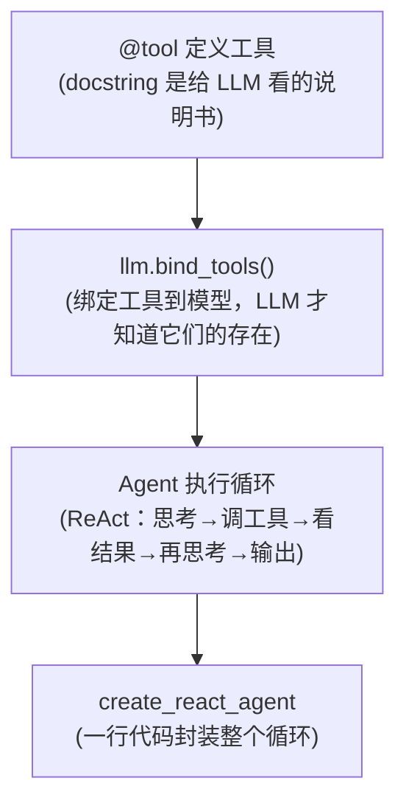
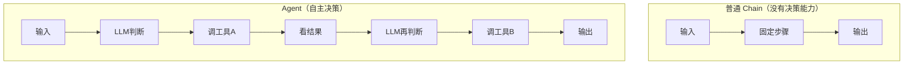
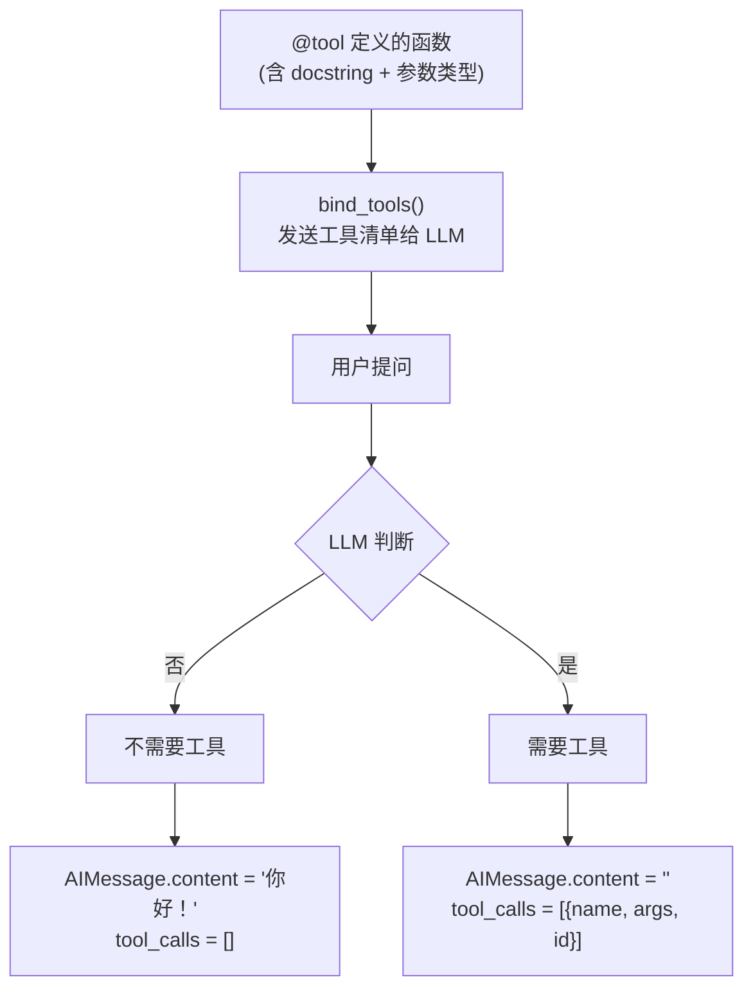
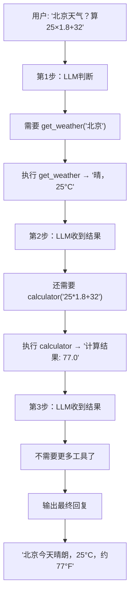
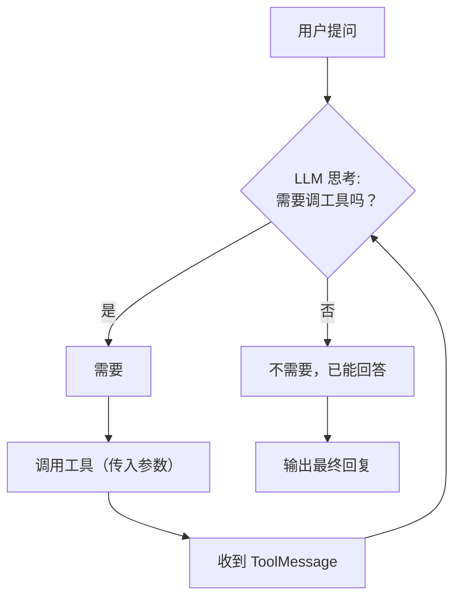

# 第5章 · Tool 与 Agent — 让 AI 拥有行动能力

> **时长**：约 2 小时 ｜ **难度**：⭐⭐⭐ ｜ **类型**：项目实战
>
> **目标**：让 LLM 能调用外部工具——查数据库、调 API、搜网页，实现自主决策和行动

---

## 学习目标

学完本章后，你将能够：
- 用 `@tool` 装饰器定义 LLM 可调用的工具
- 用 `llm.bind_tools()` 让模型知道有哪些工具可用
- 理解 Agent 的 ReAct 执行循环（思考 → 行动 → 观察）
- 用 `create_react_agent` 一行创建完整 Agent
- 处理工具调用的错误和异常

---

## 知识地图



---

## 1、Agent 核心概念

**概念定义**：Agent（智能体）是一个能自主决策调用哪些工具、调用多少次的 LLM 应用。与普通 Chain（固定流程）不同，Agent 的执行路径是动态的——LLM 根据当前情况判断下一步该做什么。

**核心定位**：普通 Chain 只能走预设流程。用户问"北京天气多少度？这个温度华氏是多少？"——需要先调天气工具，拿到摄氏温度，再调计算器转华氏。普通线性 Chain 做不到"根据中间结果决定下一步"。

**Agent vs 普通 Chain**：



**典型应用场景**：

| 场景 | 使用的工具 | 效果 |
|------|---------|------|
| 智能搜索助手 | 网页搜索 + 内容提取 | 搜索 → 读内容 → 总结 |
| 数据分析 Agent | SQL 执行 + 图表生成 | 写SQL → 查库 → 画图 |
| 办公自动化 | 日历 + 邮件 + 任务管理 | 查日程 → 发邮件 → 建任务 |
| 客服 Agent | 订单查询 + 库存 + 退款 | 查订单 → 验库存 → 处理 |
| 生活助手 | 天气 + 路况 + 餐厅推荐 | 组合多个 API |

---

## 2、定义 Tool

**概念定义**：Tool（工具）是被 `@tool` 装饰器包装的 Python 函数。与普通函数的区别：
1. 函数的 `docstring` 会作为工具描述发送给 LLM，LLM 据此判断何时调用
2. 参数类型和描述转为 JSON Schema，LLM 据此生成正确的调用参数

> ⚠️ **重要**：docstring 是 LLM 选择工具的"说明书"。写得越清楚（功能、参数含义、返回值），LLM 选对工具的概率越高。

### ▶ 执行代码

```powershell
cd code/06-Tool与Agent-代码案例
python define_tools.py
```

### 方式1：@tool 装饰器（推荐）

```python
from langchain_core.tools import tool

@tool
def get_weather(city: str) -> str:
    """查询指定城市的当前天气。

    Args:
        city: 城市名称，如 "北京"、"上海"
    """
    weather_data = {
        "北京": "晴，25°C，湿度40%",
        "上海": "阴，28°C，湿度70%",
        "深圳": "阵雨，30°C，湿度85%",
    }
    return weather_data.get(city, f"未找到 {city} 的天气信息")

@tool
def calculator(expression: str) -> str:
    """计算数学表达式。

    Args:
        expression: 数学表达式，如 "2 + 3 * 4"
    """
    try:
        result = eval(expression)
        return f"计算结果: {result}"
    except Exception as e:
        return f"计算失败: {e}"

@tool
def search_knowledge_base(query: str) -> str:
    """搜索公司知识库，查找相关文档和信息。

    Args:
        query: 搜索关键词，如 "年假"、"加班"、"报销"
    """
    kb = {
        "年假": "员工入职满1年享5天年假，满3年享10天年假。",
        "加班": "工作日加班1.5倍工资，周末2倍，法定假日3倍。",
        "报销": "差旅住宿一线城市400元/晚，其他300元/晚。",
    }
    for key, val in kb.items():
        if key in query:
            return val
    return f"未找到关于 '{query}' 的相关信息"

# 测试工具
print(get_weather.invoke({"city": "北京"}))
# → "晴，25°C，湿度40%"
```

### 方式2：StructuredTool（复杂参数）

当工具参数较多时，用 Pydantic Model 明确定义参数 Schema：

```python
from pydantic import BaseModel, Field
from langchain_core.tools import StructuredTool

class SendEmailInput(BaseModel):
    to: str = Field(description="收件人邮箱地址")
    subject: str = Field(description="邮件主题")
    body: str = Field(description="邮件正文")

def send_email_func(to: str, subject: str, body: str) -> str:
    """发送邮件（模拟）。"""
    return f"邮件已发送: 收件人={to}, 主题={subject}"

send_email = StructuredTool.from_function(
    func=send_email_func,
    name="send_email",
    description="发送电子邮件给指定收件人",
    args_schema=SendEmailInput,  # Pydantic 自动生成 LLM 可读的参数格式
)
```

---

## 3、bind_tools — 让 LLM 知道工具的存在

**概念定义**：`llm.bind_tools([tool1, tool2])` 在 API 调用时将工具的 name + description + 参数 Schema 注入请求。LLM 据此判断"当前该不该调工具、调哪个工具、传什么参数"。

**核心定位**：没有 `bind_tools`，你定义的工具只是普通 Python 函数——LLM 根本不知道它们存在。这是 Agent 区别于普通 Chain 的关键一步。

```python
# 绑定工具到模型
tools = [get_weather, calculator, search_knowledge_base]
llm_with_tools = llm.bind_tools(tools)

# 场景1：需要工具
response = llm_with_tools.invoke([HumanMessage(content="今天北京天气怎么样？")])
print(response.tool_calls)
# → [{"name": "get_weather", "args": {"city": "北京"}, "id": "call_xxx"}]
# 注意：此时 response.content 为空，tool_calls 有内容

# 场景2：不需要工具
response = llm_with_tools.invoke([HumanMessage(content="你好！")])
print(response.content)      # "你好！有什么可以帮助你的吗？"
print(response.tool_calls)   # [] —— 空的，LLM 判断不需要工具
```

**工作流程**：



---

## 4、手动工具调用流程 — 理解 Agent 内部原理

在学会"一句话创建 Agent"之前，先理解内部发生了什么。

### ▶ 执行代码

```powershell
python 03_manual_tool_call.py
```

### 完整手动循环

```python
tools_map = {t.name: t for t in tools}
llm_with_tools = llm.bind_tools(tools)

messages = [HumanMessage(content="北京天气怎么样？然后算 25*1.8+32")]

# Agent 循环：最多迭代 3 次
for step in range(3):
    # 1. LLM 思考：要不要调工具？
    ai_msg = llm_with_tools.invoke(messages)
    messages.append(ai_msg)

    # 2. 不需要工具 → 输出最终回复
    if not ai_msg.tool_calls:
        print(f"最终回复: {ai_msg.content}")
        break

    # 3. 需要工具 → 执行工具，拿到结果
    for tc in ai_msg.tool_calls:
        tool_result = tools_map[tc["name"]].invoke(tc["args"])
        # 4. 把工具结果以 ToolMessage 形式追加到对话中
        messages.append(ToolMessage(
            content=str(tool_result),
            tool_call_id=tc["id"]
        ))
```

**ReAct 循环可视化**：



---

## 5、create_react_agent — 一行创建 Agent

**概念定义**：`create_react_agent` 是 LangGraph 提供的一行式 Agent 创建方法。它内部实现了完整的 ReAct 循环——思考 → 调工具 → 看结果 → 再思考——你只需传入 model + tools + prompt。

> **注意**：需要先安装 `pip install langgraph`

```python
from langgraph.prebuilt import create_react_agent

agent = create_react_agent(
    model=llm,
    tools=[get_weather, calculator, search_knowledge_base],
    prompt="你是智能助手，可以查天气、计算、搜索公司知识库。请用中文回复。",
)

# 使用
result = agent.invoke({
    "messages": [HumanMessage(content="北京天气怎么样？摄氏转华氏多少度？")]
})
print(result["messages"][-1].content)
# → "北京今天晴朗，25°C。华氏温度约为 77°F。"
```

### ▶ 执行代码

```powershell
python 02_agent_basic.py
```

### 手动循环 vs create_react_agent

| 对比点 | 手动循环 | create_react_agent |
|--------|---------|-------------------|
| 代码量 | ~20 行 | ~5 行 |
| 终止条件 | 手动 break | 自动判断 |
| 最大迭代 | 硬编码 `for step in range(3)` | 可配置 `recursion_limit` |
| 错误处理 | 需要自己写 | 内置异常捕获 |
| 适用 | 理解原理、教学 | 实际开发 |

**ReAct 执行循环**：



> **说明**：`create_react_agent` 来自 `langgraph.prebuilt`。本课程演示其用法，LangGraph 底层原理在 LangGraph 独立课程中详解。

---

## 6、工具的错误处理

工具可能失败——网络超时、参数错误、数据不存在。需要捕获异常并返回可读的错误信息：

```python
@tool
def risky_api(query: str) -> str:
    """调用可能失败的外部 API。

    Args:
        query: 查询关键词
    """
    try:
        if "fail" in query.lower():
            raise ConnectionError("API 连接超时")
        return f"API 返回: 关于 '{query}' 的查询结果"
    except Exception as e:
        # 原则：不抛异常，返回字符串错误描述
        # LLM 看到错误信息后可以重试或给用户友好提示
        return f"调用失败: {e}。请稍后重试或换个方式提问。"
```

**原则**：工具内部捕获所有异常，返回字符串描述错误——LLM 看到错误信息后可以重试或给用户友好提示，不会让整个 Agent 崩溃。

### ▶ 执行代码

```powershell
python 04_error_handling_tools.py
```

---

## 7、完整的 Agent 服务示例

```python
"""智能助手 Agent —— 天气 + 计算 + 知识库 + 邮件"""
from langgraph.prebuilt import create_react_agent
from langchain_openai import ChatOpenAI
from langchain_core.messages import HumanMessage
from define_tools import get_weather, calculator, search_knowledge_base, send_email
from dotenv import load_dotenv
import os

load_dotenv()

llm = ChatOpenAI(
    model="deepseek-chat",
    base_url=os.getenv("DEEPSEEK_BASE_URL"),
    api_key=os.getenv("DEEPSEEK_API_KEY"),
    temperature=0,
)

tools = [get_weather, calculator, search_knowledge_base, send_email]

agent = create_react_agent(
    model=llm,
    tools=tools,
    prompt="""你是智能助手，可以：
1. 查询城市天气
2. 计算数学表达式
3. 搜索公司知识库（年假、加班、报销政策）
4. 发送邮件

请用中文回复用户。当需要多个工具时，请按顺序调用。""",
)

# 测试多工具协同
test_cases = [
    "今天北京天气怎么样？",
    "帮我算一下 15 * 8 + 27",
    "公司年假政策是什么？",
    "北京天气热还是上海天气热？比较一下",  # 需要调两次天气工具
]

for question in test_cases:
    print(f"\n{'='*50}")
    print(f"Q: {question}")
    result = agent.invoke({
        "messages": [HumanMessage(content=question)]
    })
    print(f"A: {result['messages'][-1].content}")
```

---

## 常见踩坑

1. **忘记 `pip install langgraph`**：`create_react_agent` 需要 langgraph 包
2. **docstring 写得模糊**：LLM 靠 docstring 理解工具用途，模糊的描述导致选错工具
3. **工具返回类型不规范**：始终返回 `str`，LLM 阅读文本格式的结果
4. **工具执行时间太长**：Agent 迭代有时间限制，单个工具最好在 30s 内返回
5. **`eval()` 的安全风险**：示例中的 `calculator` 用了 `eval()`，生产环境需替换为安全的表达式解析器

---

## 课后练习

1. 定义 3 个你自己的工具（可以是模拟的），用 `create_react_agent` 创建 Agent
2. 写一个需要多工具协作的测试问题，观察 Agent 的执行过程
3. 修改工具的 docstring，观察 LLM 选择工具的准确率变化

---

## 本节小结

- ✅ 理解 Agent = LLM + 工具调用 + 自主决策循环
- ✅ 能用 `@tool` 装饰器定义工具（docstring 是 LLM 的说明书）
- ✅ 掌握了 `llm.bind_tools()` → `AIMessage.tool_calls` → `ToolMessage` 的完整流程
- ✅ 能使用 `create_react_agent` 创建自动化 Agent
- ✅ 了解工具错误处理的重要性（内部捕获异常，返回字符串）

---

> **下一章**：第6章 · 对话记忆——让 LLM 记住聊过什么，实现连贯的多轮对话
