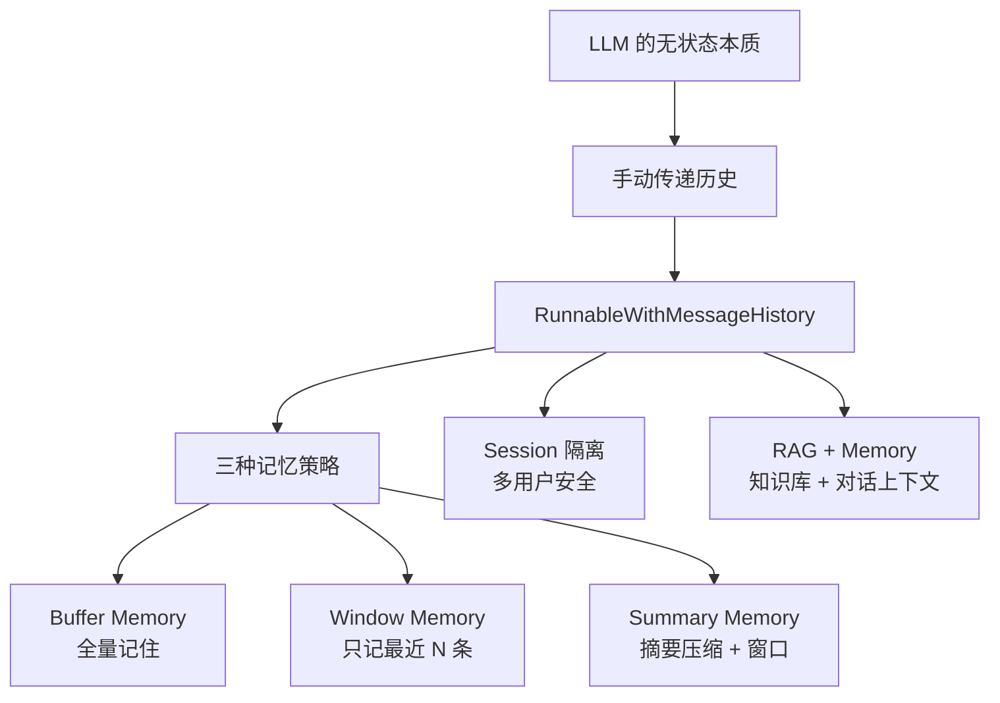
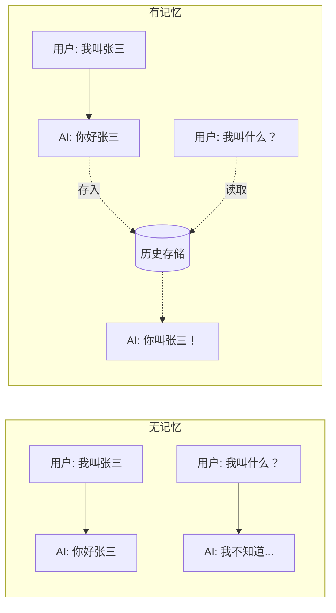
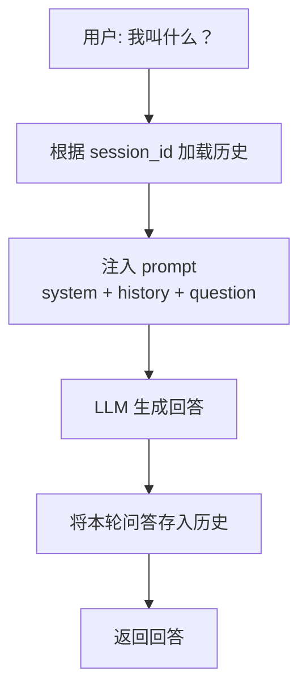
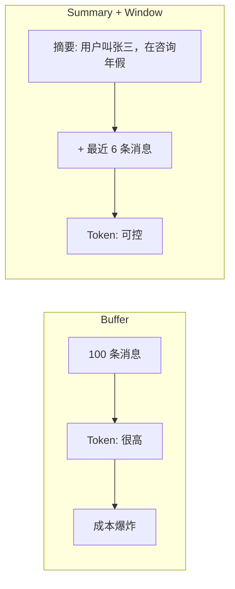
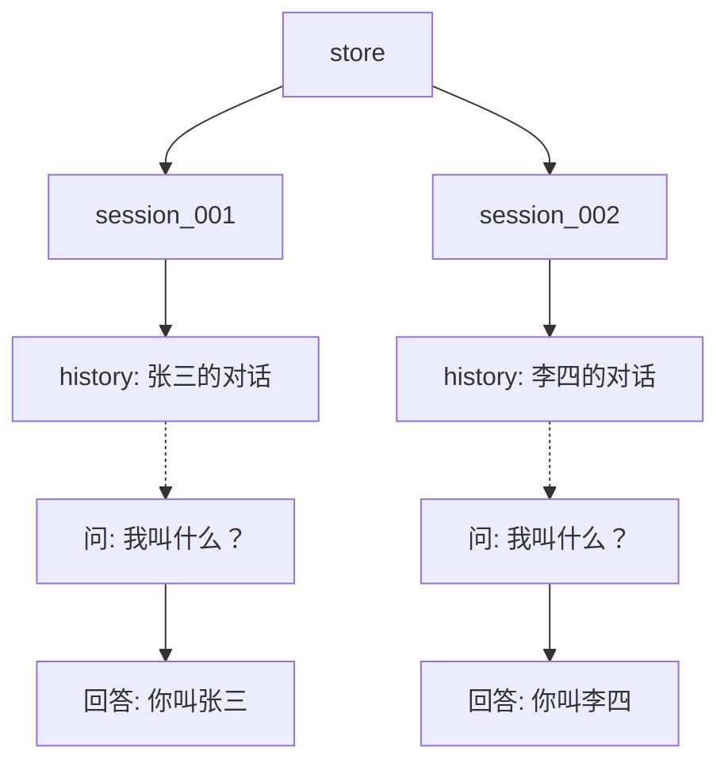
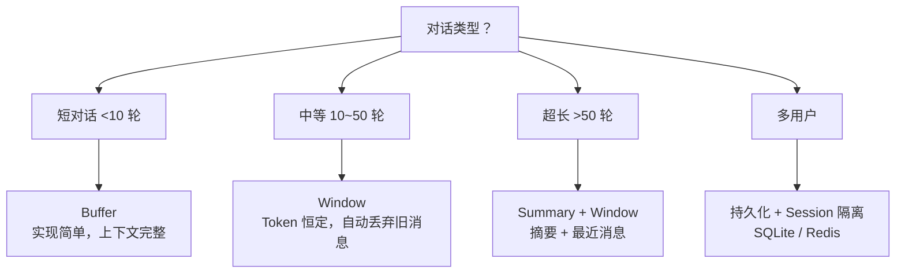

# 第6章 · 对话记忆 — 让 LLM 记住聊过什么

> **时长**：约 1.5 小时 ｜ **难度**：⭐⭐ ｜ **类型**：讲解 + 动手
>
> **目标**：管理 LLM 对话的上下文记忆，实现连贯的多轮对话

---

## 学习目标

学完本章后，你将能够：
- 解释 LLM "失忆症"的原因及记忆的实现原理
- 用 `RunnableWithMessageHistory` 自动管理对话历史
- 区分并选择三种记忆策略：Buffer / Window / Summary
- 用 `session_id` 实现多用户会话隔离
- 将记忆与 RAG 结合实现上下文感知问答

---

## 知识地图



---

## 1、LLM 的 "失忆症"

**概念定义**：LLM 本身是无状态函数——每次调用独立，不保留上一次的对话内容。对话记忆（Memory）是在 LLM 外部维护一个消息列表，每次调用时将历史消息一起发送给模型，让它"看起来"记得之前说过什么。

**核心定位**：



**典型应用**：

| 场景 | 需要记住什么 |
|------|------------|
| 聊天机器人 | 用户偏好、身份信息 |
| 问诊助手 | 症状描述、病史上下文 |
| 导购客服 | 商品偏好、预算范围 |
| 辅导老师 | 学生水平、薄弱知识点 |
| RAG 追问 | 上一轮检索的文档、上一轮的回答 |

---

## 2、手动传递历史 — 理解原理

先把原理搞懂——就是在消息列表里一直追加：

```python
from langchain_core.messages import HumanMessage

history = []  # 外部存储

def chat(question: str) -> str:
    # 1. 把用户消息加入历史
    history.append(HumanMessage(content=question))
    # 2. 把整个历史发给 LLM
    response = llm.invoke(history)
    # 3. 把 AI 回复也加入历史
    history.append(response)
    return response.content

# 测试
print(chat("我叫张三"))   # 你好张三
print(chat("我叫什么？")) # 你叫张三！（记得之前的对话）
```

**这个手动方式的问题**：每个对话都要手动管理列表、手动区分不同用户、手动注入到 prompt——生产环境这样做会非常繁琐。

---

## 3、RunnableWithMessageHistory — 自动管理

**概念定义**：`RunnableWithMessageHistory` 自动完成三件事：
1. 调用前从存储中加载历史消息并注入 prompt
2. 执行 Chain
3. 调用后将本轮消息自动存入历史

### ▶ 执行代码

```powershell
cd code/07-对话记忆-代码案例
python 01_buffer_memory.py
```

### 代码实现

```python
from langchain_core.runnables.history import RunnableWithMessageHistory
from langchain_community.chat_message_histories import ChatMessageHistory
from langchain_core.prompts import ChatPromptTemplate, MessagesPlaceholder

# 1. 带历史插槽的 Prompt
prompt = ChatPromptTemplate.from_messages([
    ("system", "你是智能客服助手，叫小码。"),
    MessagesPlaceholder(variable_name="history"),  # ← 历史消息自动插入
    ("human", "{question}"),
])

chain = prompt | llm | StrOutputParser()

# 2. 会话存储
store = {}

def get_history(session_id: str) -> ChatMessageHistory:
    """根据 session_id 获取对应的历史存储"""
    if session_id not in store:
        store[session_id] = ChatMessageHistory()
    return store[session_id]

# 3. 包装为带记忆的 Chain
chain_with_memory = RunnableWithMessageHistory(
    chain,
    get_history,                    # 获取历史的回调函数
    input_messages_key="question",  # 哪个字段是用户输入
    history_messages_key="history", # prompt 中的占位符名称
)

# 4. 使用——同一个 session_id 共享记忆
config = {"configurable": {"session_id": "user_001"}}

print(chain_with_memory.invoke({"question": "我叫张三"}, config))
# → "你好张三！有什么可以帮你的？"

print(chain_with_memory.invoke({"question": "我叫什么？"}, config))
# → "你叫张三！"（记得！）
```

**每次 invoke 的流程**：



---

## 4、三种记忆策略

### 4.1 Buffer Memory — 全量记住

**概念定义**：保留所有历史消息，不做截断。适合短对话（< 10 轮）。

**优点**：实现简单，上下文完整；**缺点**：长对话会撑爆上下文窗口，Token 成本持续增长。

### 4.2 Window Memory — 滑动窗口 ⭐

**概念定义**：只保留最近 N 条消息，旧消息自动丢弃。适合中长对话。

**核心定位**：Buffer 在 50 轮对话后上下文窗口会爆。Window 用固定预算换稳定性能。

### ▶ 执行代码

```powershell
python 02_window_memory.py
```

```python
from langchain_core.chat_history import BaseChatMessageHistory

class WindowedMemory(BaseChatMessageHistory):
    """只保留最近 max_messages 条消息的窗口记忆"""
    
    def __init__(self, max_messages: int = 6):  # 默认保留最近 3 轮（6条）
        self.messages = []
        self.max_messages = max_messages

    @property
    def messages(self):
        return self._messages

    @messages.setter
    def messages(self, value):
        self._messages = value

    def add_message(self, message):
        """追加消息后自动截断"""
        self._messages.append(message)
        self._messages = self._messages[-self.max_messages:]  # 只保留最后 N 条

    def clear(self):
        self._messages = []
```

### 4.3 Summary Memory — 摘要压缩

**概念定义**：当历史消息过多时，用 LLM 将旧消息总结为简短摘要，只保留摘要 + 最近几条消息。

**核心定位**：Buffer 在长对话中爆窗口；Window 丢了早期关键信息（"用户叫张三"丢了）。Summary 在两者之间平衡——摘要保留早期关键信息，窗口保留最近细节。



**完整可运行示例**（基于 LLM 自动摘要）：

```python
from langchain_core.messages import SystemMessage

class SummaryMemory(BaseChatMessageHistory):
    """自动摘要记忆：保留摘要 + 最近几条消息"""
    
    def __init__(self, llm, max_recent: int = 6, summary_threshold: int = 10):
        self._messages = []
        self.llm = llm
        self.max_recent = max_recent
        self.summary_threshold = summary_threshold
        self._summary = ""

    @property
    def messages(self):
        return self._messages

    @messages.setter
    def messages(self, value):
        self._messages = value

    def add_message(self, message):
        self._messages.append(message)
        
        # 当消息数超过阈值时触发摘要
        if len(self._messages) > self.summary_threshold:
            self._generate_summary()

    def _generate_summary(self):
        """调用 LLM 将旧消息压缩为摘要"""
        recent = self._messages[-self.max_recent:]  # 保留最近几条
        old = self._messages[:-self.max_recent]      # 需要摘要的旧消息
        
        # 用 LLM 生成摘要
        old_text = "\n".join([m.content for m in old])
        summary_prompt = f"将以下对话总结为一段简短摘要，保留所有关键信息:\n{old_text}"
        self._summary = self.llm.invoke(summary_prompt).content
        
        # 新消息列表 = 摘要（SystemMessage）+ 最近消息
        self._messages = [
            SystemMessage(content=f"[历史摘要] {self._summary}")
        ] + recent

    def clear(self):
        self._messages = []
        self._summary = ""
```

---

## 5、Session 隔离 — 多用户安全

**概念定义**：通过 `session_id` 区分不同用户/会话的历史存储。张三和李四的对话存在各自的空间里，互不可见。

**核心定位**：Web 服务同时服务多个用户，如果所有对话混在一个列表里，用户 A 会看到用户 B 的信息。Session 隔离是生产环境的安全底线。

### ▶ 执行代码

```powershell
python 03_session_isolation.py
```



---

## 6、RAG + Memory — 记住上下文的问答

将检索和记忆结合——用户能基于对话上下文追问知识库问题：

### ▶ 执行代码

```powershell
python 04_rag_with_memory.py
```

```python
# Prompt 中同时有 {context}（检索结果）和 {history}（对话历史）
prompt = ChatPromptTemplate.from_messages([
    ("system", "根据文档和对话历史回答。\n文档：{context}"),
    MessagesPlaceholder(variable_name="history"),
    ("human", "{question}"),
])

# RAG Chain 包装记忆
chain_with_memory = RunnableWithMessageHistory(
    rag_chain, get_history,
    input_messages_key="question",
    history_messages_key="history",
)

# 使用
config = {"configurable": {"session_id": "user_001"}}
print(chain_with_memory.invoke({"question": "年假怎么算？"}, config))
# → "入职满1年享5天年假..."

print(chain_with_memory.invoke({"question": "那如果入职不满1年呢？"}, config))
# → 记住上文在问年假，基于文档回答"不满1年没有年假"
```

---

## 7、策略选择指南



---

## 常见踩坑

1. **忘记传 config**：`invoke` 时必须传 `{"configurable": {"session_id": "..."}}`，否则无法加载历史
2. **session_id 硬编码**：每次测试用不同 session_id 以避免历史污染
3. **Buffer Memory 在对话过长时超 window**：及时切换到 Window 或 Summary 策略
4. **Prompt 中忘记 MessagesPlaceholder**：历史消息无位置可插入，记忆功能形同虚设

---

## 课后练习

1. 实现一个带 Window Memory 的聊天机器人，设置窗口大小为 6 条消息
2. 测试同一个 session_id 下的多轮对话，验证 LLM 是否正确记住上下文
3. 创建两个不同 session_id，验证对话隔离是否正确
4. （进阶）实现 Summary Memory，观察摘要生成的效果

---

## 本节小结

- ✅ 理解了 LLM 无状态的本质及"记忆"的实现原理
- ✅ 掌握了三种记忆策略：Buffer（全量）/ Window（滑动）/ Summary（压缩）
- ✅ 能使用 `RunnableWithMessageHistory` 自动管理对话历史
- ✅ 理解了 session_id 隔离的多用户安全机制
- ✅ 能将记忆与 RAG 结合实现上下文感知问答

---

> **下一章**：第7章 · 高级特性——流式输出、Callbacks、缓存、限流、LangSmith 追踪、成本控制，生产环境必备
