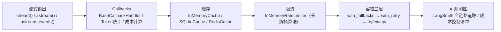
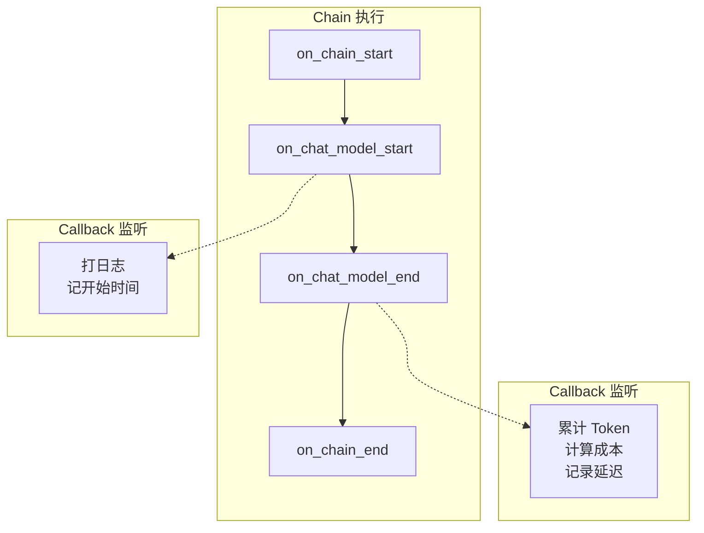
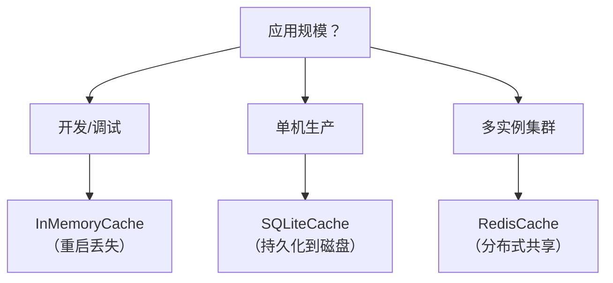
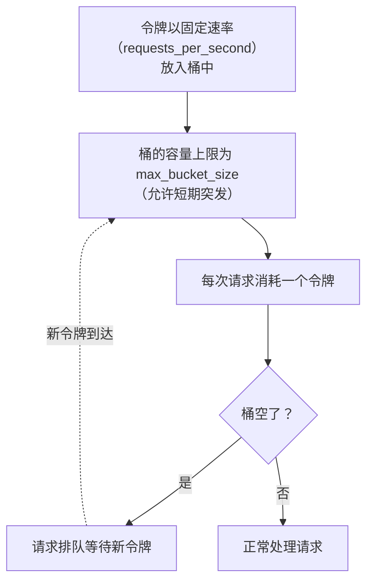
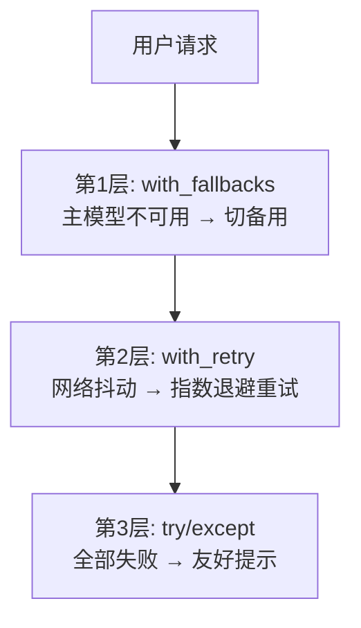
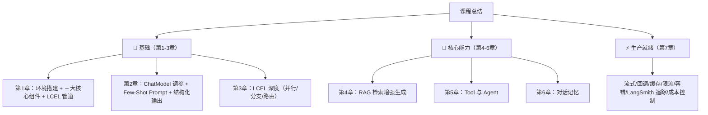

# 第7章 · 高级特性 — 流式、回调、缓存、限流

> **时长**：约 2.5 小时 ｜ **难度**：⭐⭐⭐ ｜ **类型**：讲解 + 动手
>
> **目标**：掌握 LangChain 高级特性，让应用更快、更省、更稳；学会追踪和成本控制

---

## 学习目标

学完本章后，你将能够：
- 用三种方式实现流式输出，提升用户体验
- 用 Callbacks 系统实现 Token 统计和成本监控
- 用缓存机制大幅降低 API 调用成本（30-70%）
- 用 Rate Limiter 控制并发，避免触发 API 限流
- 用 fallback + retry + try/except 三层防护保障生产稳定性
- 用 LangSmith 追踪生产环境的每次调用，定位瓶颈
- 制定成本控制策略，算清楚每分钱花在哪

---

## 知识地图



---

## 1、流式输出 — 让用户"看到"AI在思考

### 1.1 为什么需要流式

`invoke()` 的问题：模型生成 500 字需要 3-5 秒，用户盯着白屏干等。

`stream()` 的解决方案：模型每生成一个 token 就立即输出，用户看到回复逐字出现——感知延迟几乎为零。

### ▶ 执行代码

```powershell
cd code/08-高级特性-代码案例
python 01_streaming.py
```

### 1.2 stream() — 同步流式

```python
from langchain_core.prompts import ChatPromptTemplate
from langchain_core.output_parsers import StrOutputParser

prompt = ChatPromptTemplate.from_messages([
    ("system", "你是 Python 专家，用中文回答。"),
    ("human", "{question}"),
])

chain = prompt | llm | StrOutputParser()

# stream() 返回迭代器，逐 token 产出
for chunk in chain.stream({"question": "简单介绍什么是装饰器"}):
    print(chunk, end="", flush=True)  # end="" 不换行，flush=True 立即显示
print()
```

### 1.3 astream() — 异步流式

Web 框架（FastAPI）中必须用异步版本，否则阻塞事件循环：

```python
import asyncio

async def demo():
    async for chunk in chain.astream({"question": "Python 的 GIL 是什么？"}):
        print(chunk, end="", flush=True)

asyncio.run(demo())
```

### 1.4 astream_events() — 看到中间步骤

`stream()` 只能看到最终输出。`astream_events()` 能看到 Chain 内部每一步：

```python
async def stream_events_demo():
    async for event in chain.astream_events(
        {"question": "解释列表推导式"},
        version="v2",
    ):
        kind = event["event"]
        
        if kind == "on_chat_model_start":
            print(f"\n[开始生成...]")
        elif kind == "on_chat_model_stream":
            print(event["data"]["chunk"].content, end="", flush=True)
        elif kind == "on_chat_model_end":
            print(f"\n[生成完成]")

asyncio.run(stream_events_demo())
```

### 可监听的事件

| 事件名 | 触发时机 | 用途 |
|--------|---------|------|
| `on_chain_start` / `on_chain_end` | Chain 开始/结束 | 记录总耗时 |
| `on_chat_model_start` / `on_chat_model_end` | LLM 开始/结束 | 记录 Token 用量 |
| `on_chat_model_stream` | LLM 每生成一个 token | 流式输出 |
| `on_retriever_start` / `on_retriever_end` | 检索开始/结束 | 记录检索结果 |
| `on_tool_start` / `on_tool_end` | 工具开始/结束 | 记录工具调用 |

---

## 2、Callbacks — 横切关注点的优雅解耦

### 2.1 什么是 Callback

Callback 是 LangChain 的事件钩子系统。在 Chain 执行的关键节点注册监听函数——LLM 开始调用时、返回结果时、出错时——在这些节点执行自定义逻辑，而不修改 Chain 本身。

### ▶ 执行代码

```powershell
python 02_callbacks.py
```

### 2.2 Token 成本追踪器

```python
from langchain_core.callbacks import BaseCallbackHandler
from langchain_core.outputs import LLMResult

class TokenCostTracker(BaseCallbackHandler):
    """统计 Token 用量和成本"""
    
    def __init__(self):
        self.total_prompt_tokens = 0
        self.total_completion_tokens = 0
        self.total_cost = 0.0
        # DeepSeek 价格（元 / 百万 token）
        self.price_input = 0.14
        self.price_output = 0.28

    def on_llm_end(self, response: LLMResult, **kwargs):
        """每次 LLM 调用完成时自动触发"""
        for generation in response.generations:
            usage = generation[0].generation_info.get("token_usage", {})
            prompt_tokens = usage.get("prompt_tokens", 0)
            completion_tokens = usage.get("completion_tokens", 0)

            self.total_prompt_tokens += prompt_tokens
            self.total_completion_tokens += completion_tokens
            
            # 计算成本
            cost = (prompt_tokens / 1_000_000) * self.price_input \
                 + (completion_tokens / 1_000_000) * self.price_output
            self.total_cost += cost

    def report(self):
        print(f"📊 Token 统计报告")
        print(f"   输入: {self.total_prompt_tokens:,} tokens")
        print(f"   输出: {self.total_completion_tokens:,} tokens")
        print(f"   总计: {self.total_prompt_tokens + self.total_completion_tokens:,} tokens")
        print(f"   预估成本: ¥{self.total_cost:.4f}")

# 使用
tracker = TokenCostTracker()
chain_with_cb = chain.with_config(callbacks=[tracker])

result1 = chain_with_cb.invoke({"question": "什么是 RAG？"})
result2 = chain_with_cb.invoke({"question": "什么是 Agent？"})
tracker.report()
```

### Callback 事件流程



### 常用 Callback 场景

| 场景 | 钩子 | 做什么 |
|------|------|--------|
| Token 成本统计 | `on_llm_end` | 累加 token_usage |
| 慢请求告警 | `on_llm_end` | 检查耗时 > 阈值 |
| 调用日志 | `on_llm_start` + `on_llm_end` | 记录 prompt + response |
| 错误告警 | `on_llm_error` | 发送钉钉/企业微信消息 |

---

## 3、缓存 — 同样的请求不花两次钱

### 3.1 为什么需要缓存

同一个问题可能被多次问到——"公司年假怎么算？"每天可能有 100 人问。每次调 API = 每次花钱。用缓存，第 1 次真实调用，第 2~100 次直接返回结果，**几乎是零成本**。

### ▶ 执行代码

```powershell
python 03_cache_demo.py
```

### 3.2 三种缓存实现

```python
from langchain_core.globals import set_llm_cache

# 方式1：内存缓存（开发用，重启丢失）
from langchain_core.caches import InMemoryCache
set_llm_cache(InMemoryCache())

# 方式2：SQLite 持久化缓存（单机生产用）
from langchain_community.caches import SQLiteCache
set_llm_cache(SQLiteCache(database_path=".llm_cache.db"))

# 方式3：Redis 缓存（分布式多实例）
# pip install redis
from langchain_community.caches import RedisCache
import redis
set_llm_cache(RedisCache(redis_client=redis.Redis(host="localhost", port=6379)))
```

### 3.3 效果验证

```python
import time

set_llm_cache(InMemoryCache())

# 第 1 次调用：真实请求
start = time.time()
response1 = llm.invoke("用一句话介绍 Python")
print(f"第1次耗时: {time.time() - start:.2f}s")  # ~2s（真实 API 调用）

# 第 2 次调用：命中缓存
start = time.time()
response2 = llm.invoke("用一句话介绍 Python")
print(f"第2次耗时: {time.time() - start:.4f}s")  # < 0.001s（缓存命中）

print(f"结果相同: {response1.content == response2.content}")  # True
```

### 缓存选择



---

## 4、Rate Limiter — 给 API 调用装上 "水龙头"

### 4.1 为什么需要限流

DeepSeek / OpenAI 等 API 都有每分钟调用上限。短时间内大量并发请求会触发服务端限流报错——你的应用直接崩掉。

Rate Limiter 在**客户端**控制发送速率，不让请求超出限制。

### ▶ 执行代码

```powershell
python 04_rate_limiter.py
```

### 4.2 使用方式

```python
from langchain_core.rate_limiters import InMemoryRateLimiter
from langchain_openai import ChatOpenAI

llm = ChatOpenAI(
    model="deepseek-chat",
    base_url=os.getenv("DEEPSEEK_BASE_URL"),
    api_key=os.getenv("DEEPSEEK_API_KEY"),
    temperature=0,
    rate_limiter=InMemoryRateLimiter(
        requests_per_second=2,        # 每秒最多 2 次
        max_bucket_size=10,           # 允许短时突发 10 次（令牌桶）
        check_every_n_seconds=0.1,    # 每 0.1s 检查一次
    ),
)

# 批量请求——限流器自动控制速度，不会超限
results = []
for i in range(10):
    results.append(llm.invoke(f"说一个关于{i}的趣事"))
# 10次 / 2次每秒 ≈ 约5秒完成（限流器在控制节奏）
```

### 令牌桶算法原理



---

## 5、错误处理三层防护

### 5.1 三种失败场景

生产环境中 LLM 调用可能失败：
1. **模型宕机**：服务不可用（500 错误）
2. **网络抖动**：临时超时（几秒后恢复）
3. **限流**：并发过高被拒绝（429 错误）

单靠一种机制不够——需要三层防护。

### 5.2 三层防护架构



### 5.3 完整实现

```python
from langchain_openai import ChatOpenAI
from tenacity import retry, stop_after_attempt, wait_exponential_jitter
import logging

logger = logging.getLogger(__name__)

# --- 第1层：主模型 + 备用模型 ---
primary = ChatOpenAI(
    model="deepseek-chat",
    base_url=os.getenv("DEEPSEEK_BASE_URL"),
    api_key=os.getenv("DEEPSEEK_API_KEY"),
    temperature=0,
)
backup = ChatOpenAI(
    model="glm-4-flash",
    base_url=os.getenv("ZHIPU_BASE_URL"),
    api_key=os.getenv("ZHIPU_API_KEY"),
    temperature=0,
)
resilient_llm = primary.with_fallbacks([backup])

# --- 第2层：指数退避重试 ---
@retry(
    stop=stop_after_attempt(3),               # 最多重试 3 次
    wait=wait_exponential_jitter(             # 等待: 1s → 2s → 4s（随机抖动）
        initial=1, max=10, jitter=2
    ),
    reraise=True,
)
def call_llm_with_retry(chain, question: str):
    return chain.invoke({"question": question})

# --- 第3层：最终兜底 ---
def safe_chat(chain, question: str) -> str:
    try:
        return call_llm_with_retry(chain, question)
    except Exception as e:
        logger.error(f"LLM 调用失败: {e}，已尝试所有备用方案")
        return "抱歉，服务暂时不可用，请稍后重试。"

# 使用
answer = safe_chat(chain, "介绍一下量子计算")
print(answer)
```

### 三层防护对比

| 层次 | 机制 | 解决的失败类型 | 用户感知 |
|------|------|-------------|---------|
| 第1层 | `with_fallbacks` | 主模型宕机 | 无感知，自动切换 |
| 第2层 | `with_retry`（指数退避） | 网络瞬间抖动 | 毫秒级延迟，重试成功则无感知 |
| 第3层 | `try/except` | 全部不可用 | 看到友好提示，而非堆栈错误 |

---

## 6、LangSmith — 生产环境可观测性

### 6.1 为什么需要可观测性

生产环境中你会遇到的问题：

| 问题 | LangSmith 怎么帮你 |
|------|------------------|
| "为什么这次回答不对？" | 看 Trace：每步的输入输出一目了然 |
| "哪个步骤最慢？" | 时间线分析：定位到具体的环节 |
| "今天花了多少 Token？" | Token 面板：自动聚合统计 |
| "用户实际在问什么？" | 调用记录回放：查看真实请求 |

### 6.2 零代码开启追踪

在 smith.langchain.com 注册获取 API Key，只需在 `.env` 中配置 3 个环境变量：

```ini
# .env
LANGCHAIN_API_KEY=ls_xxxxxxxxxxxxxx
LANGCHAIN_TRACING_V2=true
LANGCHAIN_PROJECT=my-app
```

**完全不需要改代码**——LangChain 自动检测环境变量，开始追踪每一次 `invoke()` / `batch()` / `stream()` 调用。

### ▶ 执行代码

```powershell
cd code/09-生产部署-代码案例
python 03_langsmith_tracing.py
# 然后在浏览器打开 https://smith.langchain.com/ 查看追踪
```

### 6.3 自定义标签和元数据

在生产环境中，你需要知道每条请求来自哪个用户、哪个功能：

```python
# 方式1：通过 with_config
result = chain.with_config(
    tags=["production", "v1.3"],                      # 标签：可筛选
    metadata={"user_id": "123", "feature": "qa"},      # 元数据：可搜索
    run_name="customer_qa_request",                    # 运行名
).invoke({"question": "什么是 RAG？"})

# 方式2：通过 RunnableConfig（推荐，不修改 chain）
from langchain_core.runnables import RunnableConfig

config = RunnableConfig(
    tags=["production"],
    metadata={"user_id": "456"},
    run_name="api_translate_request",
)
result = chain.invoke({"text": "Hello"}, config)
```

在 LangSmith Web UI 中可：
- 按 `tags` 过滤：只看 `production` 的请求
- 按 `run_name` 搜索：找所有 `customer_qa_request`
- 按 `metadata.user_id` 定位：某个用户的完整调用链路

---

## 7、成本控制清单

这是生产环境省钱的实操清单：

| 措施 | 实现方式 | 预估节省 | 优先级 |
|------|---------|---------|--------|
| 启用缓存 | `set_llm_cache(SQLiteCache(...))` | 30-70% | ⭐⭐⭐ |
| 控制 max_tokens | `ChatOpenAI(max_tokens=1024)` | 10-30% | ⭐⭐⭐ |
| 限流 | `InMemoryRateLimiter(requests_per_second=5)` | 防超额罚款 | ⭐⭐⭐ |
| 模型降级 | 简单任务用 cheap model，复杂才用贵的 | 50-80% | ⭐⭐⭐ |
| 合理 chunk_size | RAG 用 500~800，减少无效上下文 | 10-20% | ⭐⭐ |
| 短期记忆 | Window 替代 Buffer Memory | Token 可控 | ⭐⭐ |
| 监控告警 | LangSmith + Callback 监控成本 | 防意外超支 | ⭐⭐ |

### 成本计算公式

```python
def estimate_cost(prompt_tokens: int, completion_tokens: int,
                  model="deepseek-chat") -> float:
    """估算每次调用的成本（单位：元）"""
    prices = {
        "deepseek-chat":     (0.14, 0.28),    # 输入/输出，元/百万token
        "deepseek-reasoner": (0.55, 2.19),
        "glm-4-flash":       (0, 0),           # 免费
    }
    input_price, output_price = prices.get(model, (0, 0))
    return (prompt_tokens / 1_000_000) * input_price + \
           (completion_tokens / 1_000_000) * output_price

# 示例：一次 RAG 问答（prompt=2000 tokens, completion=200 tokens）
cost = estimate_cost(2000, 200, "deepseek-chat")
print(f"单次: ¥{cost:.6f}")              # 约 ¥0.000336
print(f"每天1000次: ¥{cost*1000:.2f}")   # 约 ¥0.34/天
print(f"每月3万次: ¥{cost*30000:.2f}")   # 约 ¥10/月
```

**省钱思路**：启用 60% 缓存命中率 → 月成本从 ¥10 降到 ¥4；模型降级（非关键请求用 glm-4-flash 免费模型） → 再降 50%。

---

## 常见踩坑

1. **缓存 key 基于精确匹配**：prompt 中任何微小差异都会导致 cache miss
2. **RateLimiter 只在单进程有效**：多进程部署时每个进程独立计数，需用分布式限流
3. **Callback 中不能做耗时操作**：`on_llm_end` 中做网络请求会阻塞调用
4. **astream_events 需要 `version="v2"`**：v1 版本已废弃
5. **LangSmith 没有数据**：确认 `LANGCHAIN_TRACING_V2=true`，注意拼写

---

## 课后练习

1. 用 `astream_events` 实现带进度提示的流式输出：开始生成显示"🤔"，完成显示"✅"
2. 写一个 `CostAlertCallback`，当单次调用成本超过 ¥0.01 时打印警告
3. 配置 SQLiteCache，验证缓存命中后的零延迟效果
4. 测试三层防护：故意用一个错误的 API 地址，观察 fallback → retry → 友好提示的完整链路
5. 配置 LangSmith，追踪 5 次调用，在 Web UI 中找到最慢的一步
6. 计算你项目每天的预估 Token 消耗和成本

---

## 本节小结

- ✅ 掌握了三种流式输出：`stream()` / `astream()` / `astream_events()`
- ✅ 理解了 Callback 系统：用 `BaseCallbackHandler` 解耦 Token 统计和成本监控
- ✅ 能用缓存（InMemory / SQLite / Redis）避免重复 API 调用，降低成本 30-70%
- ✅ 掌握了 Rate Limiter 的令牌桶限流机制
- ✅ 建立了 fallback + retry + try/except 三层生产级防护体系
- ✅ 能用 LangSmith 追踪生产环境的每次调用，定位瓶颈
- ✅ 掌握了成本控制策略和计算公式

---

## 🎉 课程总结

经过 7 章的学习，你已经掌握了从零到生产的完整技能：



**你现在具备的能力**：
- 从零搭建 LangChain 应用
- 构建 RAG 企业私有知识库
- 开发 Agent 智能体，让 LLM 使用工具
- 实现连贯的多轮对话
- 优化性能、控制成本、追踪问题

**下一步**：LangServe 部署课程——将 Chain 部署为 REST API；LangGraph 课程——复杂 Agent 工作流、多 Agent 协作
