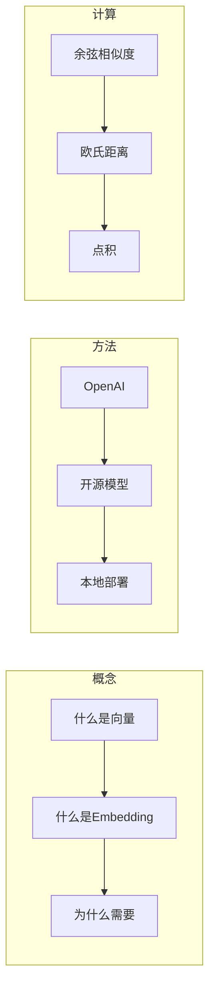

# 第1章 · 向量与 Embedding 基础 — 理解语义搜索的核心

> **时长**：约 3 小时 ｜ **难度**：⭐⭐ ｜ **类型**：理论 + 实践
>
> **目标**：理解向量和 Embedding 的核心概念，掌握文本向量化的基本方法

---

## 学习目标

学完本章后，你将能够：
- 理解什么是向量和 Embedding
- 掌握文本向量化的原理
- 使用 OpenAI 和开源模型生成 Embedding
- 理解向量相似度计算方法

---

## 知识地图



---

## 1、什么是向量

### 1.1 向量的直观理解

**向量**是一组有序的数字，可以表示空间中的一个点或方向。

```python
# 二维向量
point_2d = [3, 4]  # x=3, y=4

# 三维向量
point_3d = [1, 2, 3]  # x=1, y=2, z=3

# 高维向量（如文本 Embedding）
text_vector = [0.1, -0.2, 0.5, ..., 0.3]  # 1536维
```

### 1.2 向量的几何意义

```
二维空间中的向量：

    y
    │
  4 │     • (3,4)
    │    /
  2 │   /
    │  /
    │ /
    └──────────── x
       2   3   4

向量 [3, 4]：
- 从原点指向点 (3, 4)
- 长度（模）：√(3² + 4²) = 5
- 方向：与 x 轴夹角 arctan(4/3)
```

---

## 2、什么是 Embedding

### 2.1 定义

**Embedding（嵌入）** 是将离散的、高维的数据（如文字、图片）转换为连续的、低维的向量表示。

```
┌─────────────────────────────────────────────────────────┐
│  文本                                                    │
│  "我喜欢吃苹果"                                          │
└─────────────────────────────────────────────────────────┘
                          ↓
                    Embedding 模型
                          ↓
┌─────────────────────────────────────────────────────────┐
│  向量（1536维）                                          │
│  [0.012, -0.034, 0.056, ..., 0.078]                     │
└─────────────────────────────────────────────────────────┘
```

### 2.2 Embedding 的神奇之处

**语义相似的文本，向量也相似！**

```python
# 示例：语义相似的句子
text1 = "我喜欢吃苹果"
text2 = "我爱吃水果"
text3 = "今天天气真好"

# 假设生成的向量
vec1 = embed(text1)  # [0.1, 0.2, 0.3, ...]
vec2 = embed(text2)  # [0.11, 0.19, 0.31, ...]  ← 与 vec1 相似
vec3 = embed(text3)  # [0.8, -0.3, 0.1, ...]    ← 与 vec1 差异大

# 相似度
similarity(vec1, vec2) ≈ 0.92  # 高相似度
similarity(vec1, vec3) ≈ 0.23  # 低相似度
```

### 2.3 为什么需要 Embedding

| 传统搜索 | 向量搜索 |
|---------|---------|
| 关键词匹配 | 语义匹配 |
| "苹果" 只能匹配 "苹果" | "苹果" 能匹配 "水果"、"iPhone" |
| 无法理解同义词 | 自动理解语义 |
| 需要精确词汇 | 支持模糊查询 |

---

## 3、生成 Embedding

### 3.1 使用 OpenAI Embedding API

```python
"""
01_openai_embedding.py
使用 OpenAI 生成 Embedding
"""
import os
from openai import OpenAI
from dotenv import load_dotenv

load_dotenv()

client = OpenAI()


def get_embedding(text: str, model: str = "text-embedding-3-small") -> list:
    """获取文本的 Embedding 向量"""
    response = client.embeddings.create(
        input=text,
        model=model
    )
    return response.data[0].embedding


def batch_embedding(texts: list, model: str = "text-embedding-3-small") -> list:
    """批量获取 Embedding"""
    response = client.embeddings.create(
        input=texts,
        model=model
    )
    return [item.embedding for item in response.data]


if __name__ == "__main__":
    # 单个文本
    text = "人工智能正在改变世界"
    embedding = get_embedding(text)

    print(f"文本: {text}")
    print(f"向量维度: {len(embedding)}")
    print(f"向量前5个值: {embedding[:5]}")

    # 批量处理
    texts = [
        "机器学习是AI的子领域",
        "深度学习使用神经网络",
        "今天天气很好"
    ]
    embeddings = batch_embedding(texts)

    for t, e in zip(texts, embeddings):
        print(f"\n{t}")
        print(f"  维度: {len(e)}, 前3值: {e[:3]}")
```

### 3.2 OpenAI Embedding 模型对比

| 模型 | 维度 | 特点 | 价格 |
|------|------|------|------|
| text-embedding-3-small | 1536 | 性价比高 | $0.02/1M tokens |
| text-embedding-3-large | 3072 | 更高精度 | $0.13/1M tokens |
| text-embedding-ada-002 | 1536 | 旧版本 | $0.10/1M tokens |

### 3.3 使用开源模型

```python
"""
02_opensource_embedding.py
使用开源模型生成 Embedding
"""
from sentence_transformers import SentenceTransformer


def local_embedding():
    """使用本地开源模型"""
    # 加载模型（首次会下载）
    model = SentenceTransformer('all-MiniLM-L6-v2')

    texts = [
        "人工智能正在改变世界",
        "机器学习是AI的子领域",
        "今天天气很好"
    ]

    # 生成 Embedding
    embeddings = model.encode(texts)

    print(f"模型: all-MiniLM-L6-v2")
    print(f"向量维度: {embeddings.shape[1]}")

    for text, emb in zip(texts, embeddings):
        print(f"\n{text}")
        print(f"  向量前5值: {emb[:5].tolist()}")


def chinese_embedding():
    """使用中文优化模型"""
    # 中文模型推荐
    model = SentenceTransformer('shibing624/text2vec-base-chinese')

    texts = [
        "我喜欢吃苹果",
        "我爱吃水果",
        "今天天气真好"
    ]

    embeddings = model.encode(texts)

    print(f"\n中文模型: text2vec-base-chinese")
    print(f"向量维度: {embeddings.shape[1]}")


if __name__ == "__main__":
    print("=" * 60)
    print("【开源 Embedding 模型演示】")
    print("=" * 60)

    local_embedding()

    print("\n" + "-" * 40)
    # chinese_embedding()  # 需要下载中文模型
```

### 3.4 常用开源 Embedding 模型

| 模型 | 维度 | 语言 | 特点 |
|------|------|------|------|
| all-MiniLM-L6-v2 | 384 | 英文 | 轻量快速 |
| all-mpnet-base-v2 | 768 | 英文 | 效果更好 |
| text2vec-base-chinese | 768 | 中文 | 中文优化 |
| bge-base-zh-v1.5 | 768 | 中文 | 智源开源 |
| m3e-base | 768 | 中文 | Moka 开源 |

---

## 4、向量相似度计算

### 4.1 余弦相似度（最常用）

**原理**：计算两个向量夹角的余弦值

```python
import numpy as np


def cosine_similarity(vec1, vec2):
    """余弦相似度"""
    dot_product = np.dot(vec1, vec2)
    norm1 = np.linalg.norm(vec1)
    norm2 = np.linalg.norm(vec2)
    return dot_product / (norm1 * norm2)


# 示例
vec1 = np.array([1, 2, 3])
vec2 = np.array([1, 2, 3.1])  # 非常相似
vec3 = np.array([-1, -2, -3])  # 完全相反

print(f"vec1 vs vec2: {cosine_similarity(vec1, vec2):.4f}")  # ≈ 0.9999
print(f"vec1 vs vec3: {cosine_similarity(vec1, vec3):.4f}")  # = -1.0
```

**范围**：[-1, 1]
- 1：完全相同方向
- 0：正交（无关）
- -1：完全相反方向

### 4.2 欧氏距离

**原理**：计算两点间的直线距离

```python
def euclidean_distance(vec1, vec2):
    """欧氏距离"""
    return np.linalg.norm(np.array(vec1) - np.array(vec2))


# 距离越小越相似
dist = euclidean_distance([1, 2], [4, 6])
print(f"距离: {dist}")  # = 5.0
```

### 4.3 点积（内积）

```python
def dot_product(vec1, vec2):
    """点积"""
    return np.dot(vec1, vec2)


# 常用于归一化后的向量
vec1_norm = vec1 / np.linalg.norm(vec1)
vec2_norm = vec2 / np.linalg.norm(vec2)
similarity = dot_product(vec1_norm, vec2_norm)  # 等价于余弦相似度
```

### 4.4 选择建议

| 方法 | 适用场景 | 特点 |
|------|---------|------|
| 余弦相似度 | 文本相似度 | 忽略向量长度，只关注方向 |
| 欧氏距离 | 聚类、KNN | 考虑绝对位置 |
| 点积 | 归一化向量 | 计算快，需预处理 |

---

## 5、实战：语义搜索

### ▶ 执行代码

```bash
cd code/01-Embedding基础
python 03_semantic_search.py
```

```python
"""
03_semantic_search.py
简单的语义搜索实现
"""
import numpy as np
from openai import OpenAI
from dotenv import load_dotenv

load_dotenv()

client = OpenAI()


def get_embedding(text: str) -> list:
    """获取 Embedding"""
    response = client.embeddings.create(
        input=text,
        model="text-embedding-3-small"
    )
    return response.data[0].embedding


def cosine_similarity(vec1, vec2):
    """余弦相似度"""
    vec1 = np.array(vec1)
    vec2 = np.array(vec2)
    return np.dot(vec1, vec2) / (np.linalg.norm(vec1) * np.linalg.norm(vec2))


class SimpleSemanticSearch:
    """简单语义搜索"""

    def __init__(self):
        self.documents = []
        self.embeddings = []

    def add_documents(self, docs: list):
        """添加文档"""
        for doc in docs:
            embedding = get_embedding(doc)
            self.documents.append(doc)
            self.embeddings.append(embedding)
        print(f"已添加 {len(docs)} 个文档")

    def search(self, query: str, top_k: int = 3) -> list:
        """搜索"""
        query_embedding = get_embedding(query)

        # 计算相似度
        similarities = []
        for i, doc_emb in enumerate(self.embeddings):
            sim = cosine_similarity(query_embedding, doc_emb)
            similarities.append((i, sim))

        # 排序
        similarities.sort(key=lambda x: x[1], reverse=True)

        # 返回结果
        results = []
        for idx, sim in similarities[:top_k]:
            results.append({
                "document": self.documents[idx],
                "similarity": sim
            })

        return results


if __name__ == "__main__":
    print("=" * 60)
    print("【语义搜索演示】")
    print("=" * 60)

    # 创建搜索引擎
    search_engine = SimpleSemanticSearch()

    # 添加文档
    documents = [
        "Python 是一种流行的编程语言",
        "机器学习需要大量数据",
        "深度学习是机器学习的子集",
        "JavaScript 用于网页开发",
        "人工智能正在改变世界",
        "数据科学家需要掌握统计学",
    ]

    search_engine.add_documents(documents)

    # 搜索测试
    queries = [
        "AI 技术",
        "编程语言",
        "数据分析",
    ]

    for query in queries:
        print(f"\n查询: {query}")
        print("-" * 40)
        results = search_engine.search(query, top_k=3)
        for i, r in enumerate(results, 1):
            print(f"{i}. [{r['similarity']:.3f}] {r['document']}")
```

---

## 常见问题

1. **Embedding 维度太高**：使用降维技术（PCA）或选择更小的模型
2. **中英文混合**：使用多语言模型如 `multilingual-e5-base`
3. **长文本处理**：分块处理，或使用支持长文本的模型
4. **成本控制**：批量处理、缓存结果、使用开源模型

---

## 本节小结

- ✅ 理解了向量和 Embedding 的核心概念
- ✅ 学会使用 OpenAI 和开源模型生成 Embedding
- ✅ 掌握了余弦相似度等计算方法
- ✅ 实现了简单的语义搜索

---

> **下一章**：第2章 · Chroma 向量数据库 — 轻量级向量存储方案
