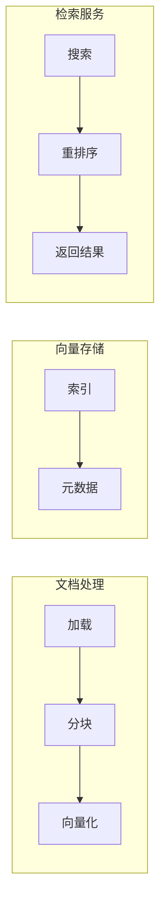

# 第5章 · 向量数据库实战应用 — 构建完整的语义搜索系统

> **时长**：约 4 小时 ｜ **难度**：⭐⭐⭐ ｜ **类型**：综合实战
>
> **目标**：综合运用所学知识，构建一个完整的语义搜索应用

---

## 学习目标

学完本章后，你将能够：
- 设计完整的语义搜索架构
- 实现文档处理和向量化流程
- 构建高效的检索服务
- 优化搜索质量和性能

---

## 知识地图



---

## 1、项目架构

### 1.1 整体架构

```
┌─────────────────────────────────────────────────────────────┐
│                      语义搜索系统                            │
├─────────────────────────────────────────────────────────────┤
│  ┌─────────────┐  ┌─────────────┐  ┌─────────────┐         │
│  │  文档加载器  │→│  文本分块器  │→│  向量化器    │         │
│  └─────────────┘  └─────────────┘  └─────────────┘         │
│                                            ↓                │
│  ┌─────────────┐  ┌─────────────┐  ┌─────────────┐         │
│  │  搜索接口   │←│  检索引擎   │←│  向量数据库  │         │
│  └─────────────┘  └─────────────┘  └─────────────┘         │
└─────────────────────────────────────────────────────────────┘
```

### 1.2 技术选型

| 组件 | 选择 | 备选 |
|------|------|------|
| 向量数据库 | Chroma | Milvus, FAISS |
| Embedding | OpenAI | 本地模型 |
| 分块策略 | 递归分块 | 语义分块 |
| 重排序 | Cross-Encoder | Cohere Rerank |

---

## 2、文档处理流程

### 2.1 文档加载器

```python
"""
01_document_loader.py
文档加载器
"""
from pathlib import Path
from typing import List
from dataclasses import dataclass


@dataclass
class Document:
    """文档类"""
    content: str
    metadata: dict


class DocumentLoader:
    """文档加载器"""

    @staticmethod
    def load_text(file_path: str) -> Document:
        """加载文本文件"""
        path = Path(file_path)
        content = path.read_text(encoding='utf-8')
        return Document(
            content=content,
            metadata={
                "source": str(path),
                "filename": path.name,
                "type": "text"
            }
        )

    @staticmethod
    def load_markdown(file_path: str) -> Document:
        """加载 Markdown 文件"""
        path = Path(file_path)
        content = path.read_text(encoding='utf-8')
        return Document(
            content=content,
            metadata={
                "source": str(path),
                "filename": path.name,
                "type": "markdown"
            }
        )

    @staticmethod
    def load_directory(dir_path: str, extensions: List[str] = None) -> List[Document]:
        """加载目录下所有文件"""
        if extensions is None:
            extensions = ['.txt', '.md']

        documents = []
        path = Path(dir_path)

        for ext in extensions:
            for file_path in path.glob(f'**/*{ext}'):
                if ext == '.md':
                    doc = DocumentLoader.load_markdown(str(file_path))
                else:
                    doc = DocumentLoader.load_text(str(file_path))
                documents.append(doc)

        return documents


if __name__ == "__main__":
    # 测试
    loader = DocumentLoader()

    # 创建测试文件
    test_content = "这是一个测试文档。\n包含多行内容。\n用于测试文档加载功能。"
    Path("test_doc.txt").write_text(test_content, encoding='utf-8')

    doc = loader.load_text("test_doc.txt")
    print(f"内容: {doc.content[:50]}...")
    print(f"元数据: {doc.metadata}")

    # 清理
    Path("test_doc.txt").unlink()
```

### 2.2 文本分块器

```python
"""
02_text_splitter.py
文本分块器
"""
from typing import List
from dataclasses import dataclass


@dataclass
class Chunk:
    """文本块"""
    content: str
    metadata: dict
    index: int


class TextSplitter:
    """文本分块器"""

    def __init__(
        self,
        chunk_size: int = 500,
        chunk_overlap: int = 50,
        separators: List[str] = None
    ):
        self.chunk_size = chunk_size
        self.chunk_overlap = chunk_overlap
        self.separators = separators or ["\n\n", "\n", "。", ".", " "]

    def split(self, text: str, metadata: dict = None) -> List[Chunk]:
        """分割文本"""
        chunks = []
        current_chunk = ""
        chunk_index = 0

        # 按句子分割
        sentences = self._split_to_sentences(text)

        for sentence in sentences:
            if len(current_chunk) + len(sentence) <= self.chunk_size:
                current_chunk += sentence
            else:
                if current_chunk:
                    chunks.append(Chunk(
                        content=current_chunk.strip(),
                        metadata={**(metadata or {}), "chunk_index": chunk_index},
                        index=chunk_index
                    ))
                    chunk_index += 1

                    # 保留重叠部分
                    overlap_text = current_chunk[-self.chunk_overlap:] if len(current_chunk) > self.chunk_overlap else ""
                    current_chunk = overlap_text + sentence
                else:
                    current_chunk = sentence

        # 处理最后一个块
        if current_chunk.strip():
            chunks.append(Chunk(
                content=current_chunk.strip(),
                metadata={**(metadata or {}), "chunk_index": chunk_index},
                index=chunk_index
            ))

        return chunks

    def _split_to_sentences(self, text: str) -> List[str]:
        """分割成句子"""
        sentences = []
        current = ""

        for char in text:
            current += char
            if char in ["。", ".", "!", "?", "\n"]:
                sentences.append(current)
                current = ""

        if current:
            sentences.append(current)

        return sentences


class RecursiveTextSplitter(TextSplitter):
    """递归文本分块器"""

    def split(self, text: str, metadata: dict = None) -> List[Chunk]:
        """递归分割"""
        return self._split_recursive(text, self.separators, metadata or {})

    def _split_recursive(self, text: str, separators: List[str], metadata: dict) -> List[Chunk]:
        """递归分割实现"""
        chunks = []

        if len(text) <= self.chunk_size:
            return [Chunk(content=text.strip(), metadata=metadata, index=0)]

        # 找到合适的分隔符
        separator = ""
        for sep in separators:
            if sep in text:
                separator = sep
                break

        if not separator:
            # 强制按长度分割
            for i in range(0, len(text), self.chunk_size - self.chunk_overlap):
                chunk_text = text[i:i + self.chunk_size]
                if chunk_text.strip():
                    chunks.append(Chunk(
                        content=chunk_text.strip(),
                        metadata={**metadata, "chunk_index": len(chunks)},
                        index=len(chunks)
                    ))
            return chunks

        # 按分隔符分割
        splits = text.split(separator)
        current = ""

        for split in splits:
            if len(current) + len(split) <= self.chunk_size:
                current += split + separator
            else:
                if current.strip():
                    chunks.append(Chunk(
                        content=current.strip(),
                        metadata={**metadata, "chunk_index": len(chunks)},
                        index=len(chunks)
                    ))
                current = split + separator

        if current.strip():
            chunks.append(Chunk(
                content=current.strip(),
                metadata={**metadata, "chunk_index": len(chunks)},
                index=len(chunks)
            ))

        return chunks


if __name__ == "__main__":
    text = """
    人工智能是计算机科学的一个重要分支。它致力于研究和开发能够模拟人类智能的系统。

    机器学习是人工智能的核心技术之一。通过大量数据的训练，机器可以自动学习和改进。

    深度学习是机器学习的一个子集。它使用多层神经网络来处理复杂的模式识别任务。

    自然语言处理让计算机能够理解和生成人类语言。这是实现人机交互的关键技术。
    """

    splitter = RecursiveTextSplitter(chunk_size=100, chunk_overlap=20)
    chunks = splitter.split(text, {"source": "test"})

    print(f"分割成 {len(chunks)} 个块:")
    for chunk in chunks:
        print(f"\n[{chunk.index}] {chunk.content[:50]}...")
```

---

## 3、完整搜索系统

### 3.1 搜索引擎实现

```python
"""
03_search_engine.py
完整的语义搜索引擎
"""
import os
from typing import List, Optional
from dataclasses import dataclass
import chromadb
from chromadb.utils import embedding_functions


@dataclass
class SearchResult:
    """搜索结果"""
    content: str
    score: float
    metadata: dict


class SemanticSearchEngine:
    """语义搜索引擎"""

    def __init__(
        self,
        collection_name: str = "documents",
        persist_directory: str = "./search_db",
        embedding_model: str = "text-embedding-3-small"
    ):
        # 创建持久化客户端
        self.client = chromadb.PersistentClient(path=persist_directory)

        # 创建 OpenAI Embedding 函数
        self.embedding_fn = embedding_functions.OpenAIEmbeddingFunction(
            api_key=os.getenv("OPENAI_API_KEY"),
            model_name=embedding_model
        )

        # 获取或创建集合
        self.collection = self.client.get_or_create_collection(
            name=collection_name,
            embedding_function=self.embedding_fn,
            metadata={"description": "语义搜索文档集合"}
        )

    def add_documents(
        self,
        documents: List[str],
        metadatas: List[dict] = None,
        ids: List[str] = None
    ):
        """添加文档"""
        if ids is None:
            # 生成唯一 ID
            start_id = self.collection.count()
            ids = [f"doc_{start_id + i}" for i in range(len(documents))]

        if metadatas is None:
            metadatas = [{}] * len(documents)

        self.collection.add(
            documents=documents,
            metadatas=metadatas,
            ids=ids
        )

        print(f"已添加 {len(documents)} 个文档，总数: {self.collection.count()}")

    def search(
        self,
        query: str,
        n_results: int = 5,
        where: dict = None,
        where_document: dict = None
    ) -> List[SearchResult]:
        """搜索文档"""
        results = self.collection.query(
            query_texts=[query],
            n_results=n_results,
            where=where,
            where_document=where_document
        )

        search_results = []
        for i in range(len(results['documents'][0])):
            search_results.append(SearchResult(
                content=results['documents'][0][i],
                score=1 - results['distances'][0][i],  # 转换为相似度
                metadata=results['metadatas'][0][i] if results['metadatas'] else {}
            ))

        return search_results

    def delete_documents(self, ids: List[str]):
        """删除文档"""
        self.collection.delete(ids=ids)
        print(f"已删除 {len(ids)} 个文档")

    def get_stats(self) -> dict:
        """获取统计信息"""
        return {
            "total_documents": self.collection.count(),
            "collection_name": self.collection.name
        }


def demo():
    """演示"""
    print("=" * 60)
    print("【语义搜索引擎演示】")
    print("=" * 60)

    # 创建搜索引擎
    engine = SemanticSearchEngine(
        collection_name="demo_docs",
        persist_directory="./demo_search_db"
    )

    # 添加示例文档
    documents = [
        "Python 是一种广泛使用的高级编程语言，以简洁易读著称",
        "机器学习是人工智能的核心技术，通过数据训练模型",
        "深度学习使用多层神经网络处理复杂任务",
        "自然语言处理让计算机理解人类语言",
        "向量数据库是实现语义搜索的关键基础设施",
        "大语言模型如 GPT 可以生成高质量的文本内容",
        "RAG 技术结合检索和生成，提升 AI 应用效果",
        "Transformer 架构是现代 NLP 模型的基础",
    ]

    metadatas = [
        {"category": "programming", "difficulty": "beginner"},
        {"category": "ai", "difficulty": "intermediate"},
        {"category": "ai", "difficulty": "advanced"},
        {"category": "ai", "difficulty": "intermediate"},
        {"category": "database", "difficulty": "intermediate"},
        {"category": "ai", "difficulty": "advanced"},
        {"category": "ai", "difficulty": "advanced"},
        {"category": "ai", "difficulty": "advanced"},
    ]

    # 只在集合为空时添加
    if engine.collection.count() == 0:
        engine.add_documents(documents, metadatas)

    # 搜索测试
    print("\n" + "-" * 40)
    print("搜索: '人工智能技术'")
    print("-" * 40)

    results = engine.search("人工智能技术", n_results=3)
    for i, r in enumerate(results, 1):
        print(f"\n{i}. [相似度: {r.score:.3f}]")
        print(f"   内容: {r.content}")
        print(f"   元数据: {r.metadata}")

    # 带过滤的搜索
    print("\n" + "-" * 40)
    print("搜索: '学习' (过滤: category='ai')")
    print("-" * 40)

    results = engine.search(
        "学习",
        n_results=3,
        where={"category": "ai"}
    )
    for i, r in enumerate(results, 1):
        print(f"{i}. [{r.score:.3f}] {r.content[:40]}...")

    # 统计信息
    print(f"\n统计: {engine.get_stats()}")


if __name__ == "__main__":
    if not os.getenv("OPENAI_API_KEY"):
        print("请设置 OPENAI_API_KEY")
        exit()

    demo()
```

---

## 4、搜索质量优化

### 4.1 结果重排序

```python
"""
04_reranker.py
搜索结果重排序
"""
from typing import List
from dataclasses import dataclass
from openai import OpenAI


@dataclass
class RerankResult:
    """重排序结果"""
    content: str
    original_score: float
    rerank_score: float


class LLMReranker:
    """使用 LLM 重排序"""

    def __init__(self):
        self.client = OpenAI()

    def rerank(
        self,
        query: str,
        documents: List[str],
        top_k: int = 3
    ) -> List[RerankResult]:
        """重排序文档"""

        # 构建评分 Prompt
        prompt = f"""给定查询和文档列表，为每个文档的相关性打分（0-10分）。

查询: {query}

文档列表:
"""
        for i, doc in enumerate(documents):
            prompt += f"\n{i+1}. {doc[:200]}"

        prompt += """

请以 JSON 格式返回每个文档的分数:
{{"scores": [分数1, 分数2, ...]}}

只返回 JSON，不要其他内容。"""

        response = self.client.chat.completions.create(
            model="gpt-4o-mini",
            messages=[{"role": "user", "content": prompt}],
            response_format={"type": "json_object"}
        )

        import json
        scores = json.loads(response.choices[0].message.content)["scores"]

        # 创建结果
        results = []
        for i, (doc, score) in enumerate(zip(documents, scores)):
            results.append(RerankResult(
                content=doc,
                original_score=1.0,  # 原始分数（可从搜索结果获取）
                rerank_score=score / 10.0
            ))

        # 按重排序分数排序
        results.sort(key=lambda x: x.rerank_score, reverse=True)

        return results[:top_k]


if __name__ == "__main__":
    import os
    if not os.getenv("OPENAI_API_KEY"):
        print("请设置 OPENAI_API_KEY")
        exit()

    reranker = LLMReranker()

    query = "如何学习机器学习"
    documents = [
        "Python 是一种编程语言",
        "机器学习需要掌握数学基础，包括线性代数和概率论",
        "深度学习是机器学习的一个分支",
        "推荐从 sklearn 开始学习机器学习",
    ]

    print("=" * 60)
    print("【搜索结果重排序】")
    print("=" * 60)
    print(f"查询: {query}\n")

    results = reranker.rerank(query, documents)

    print("重排序结果:")
    for i, r in enumerate(results, 1):
        print(f"{i}. [分数: {r.rerank_score:.2f}] {r.content}")
```

---

## 5、完整 API 服务

```python
"""
05_search_api.py
搜索 API 服务
"""
from fastapi import FastAPI, HTTPException
from pydantic import BaseModel
from typing import List, Optional
import os

# 导入搜索引擎（假设在同一目录）
# from search_engine import SemanticSearchEngine

app = FastAPI(title="语义搜索 API")


class AddDocumentsRequest(BaseModel):
    documents: List[str]
    metadatas: Optional[List[dict]] = None


class SearchRequest(BaseModel):
    query: str
    n_results: int = 5
    filter: Optional[dict] = None


class SearchResultResponse(BaseModel):
    content: str
    score: float
    metadata: dict


# 初始化搜索引擎（实际使用时导入）
# engine = SemanticSearchEngine()


@app.post("/documents")
async def add_documents(request: AddDocumentsRequest):
    """添加文档"""
    # engine.add_documents(request.documents, request.metadatas)
    return {"message": f"已添加 {len(request.documents)} 个文档"}


@app.post("/search", response_model=List[SearchResultResponse])
async def search(request: SearchRequest):
    """搜索文档"""
    # results = engine.search(request.query, request.n_results, request.filter)
    # return [SearchResultResponse(...) for r in results]

    # 模拟返回
    return [
        SearchResultResponse(
            content="示例搜索结果",
            score=0.95,
            metadata={"source": "demo"}
        )
    ]


@app.get("/stats")
async def get_stats():
    """获取统计信息"""
    # return engine.get_stats()
    return {"total_documents": 100, "collection_name": "documents"}


if __name__ == "__main__":
    import uvicorn
    uvicorn.run(app, host="0.0.0.0", port=8000)
```

---

## 本节小结

- ✅ 设计了完整的语义搜索架构
- ✅ 实现了文档加载和分块处理
- ✅ 构建了完整的搜索引擎
- ✅ 学会了搜索结果重排序
- ✅ 创建了 API 服务框架

---

## 模块总结

恭喜完成 **模块7：向量数据库**！

你已经掌握了：
- ✅ 向量与 Embedding 的核心概念
- ✅ Chroma 轻量级向量数据库
- ✅ Milvus 企业级向量检索
- ✅ FAISS 高性能检索库
- ✅ 完整语义搜索系统构建

---

> **下一模块**：模块8 · RAG 高级技术 — 检索增强生成深入实践
