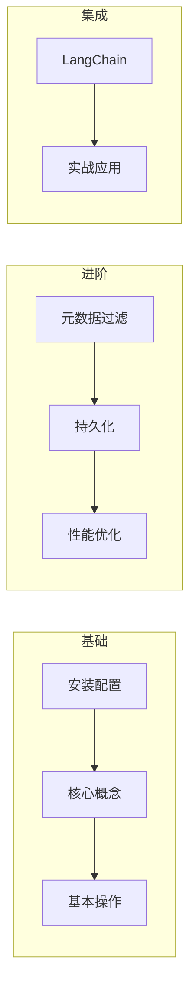
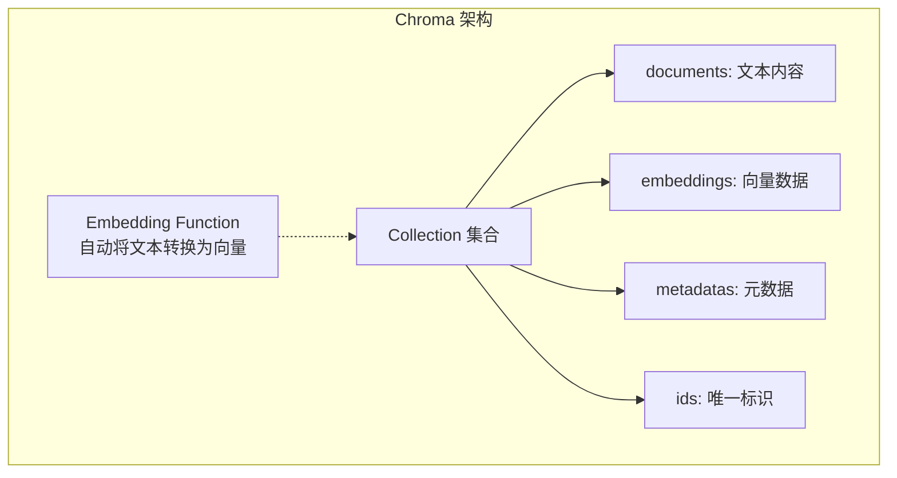

# 第2章 · Chroma 向量数据库 — 轻量级向量存储方案

> **时长**：约 4 小时 ｜ **难度**：⭐⭐ ｜ **类型**：实践
>
> **目标**：掌握 Chroma 的使用，快速搭建向量存储和检索系统

---

## 学习目标

学完本章后，你将能够：
- 安装和配置 Chroma
- 创建集合并管理向量数据
- 实现高效的相似度搜索
- 使用元数据过滤和持久化存储

---

## 知识地图



---

## 1、Chroma 简介

### 1.1 什么是 Chroma

**概念定义**：Chroma 是一个开源的向量数据库，专为 AI 应用设计，提供简洁的 API 接口用于向量的存储和相似度检索。

**核心定位**：构建语义搜索应用时，Embedding 生成的向量需要专门的存储和检索方案。Chroma 解决了"向量怎么存"和"向量怎么搜"两大问题，让开发者无需关注底层索引实现即可快速搭建检索系统。

| 特点 | 说明 |
|------|------|
| 轻量级 | 纯 Python，无需外部依赖 |
| 易用性 | API 简洁，快速上手 |
| 内置 Embedding | 支持自动向量化 |
| 持久化 | 支持本地存储 |
| 开源免费 | Apache 2.0 协议 |

### 1.2 适用场景

- ✅ 原型开发和测试
- ✅ 中小规模数据（< 100万向量）
- ✅ 本地部署
- ⚠️ 大规模生产环境建议使用 Milvus/Pinecone

### 1.3 安装

```bash
pip install chromadb
```

---

## 2、核心概念

### 2.1 架构



### 2.2 核心组件

| 组件 | 说明 |
|------|------|
| Client | 客户端，管理数据库连接 |
| Collection | 集合，类似数据库的表 |
| Document | 原始文本内容 |
| Embedding | 向量表示 |
| Metadata | 元数据，用于过滤 |
| ID | 唯一标识符 |

---

## 3、基本操作

### ▶ 执行代码

```bash
cd code/02-Chroma
python 01_chroma_basic.py
```

```python
"""
01_chroma_basic.py
Chroma 基本操作
"""
import chromadb
from chromadb.utils import embedding_functions


def basic_usage():
    """基本使用"""
    print("=" * 60)
    print("【Chroma 基本操作】")
    print("=" * 60)

    # 1. 创建客户端（内存模式）
    client = chromadb.Client()

    # 2. 创建集合
    collection = client.create_collection(
        name="my_collection",
        metadata={"description": "测试集合"}
    )

    print(f"创建集合: {collection.name}")

    # 3. 添加数据
    collection.add(
        documents=[
            "Python 是一种编程语言",
            "机器学习需要大量数据",
            "深度学习使用神经网络",
            "JavaScript 用于网页开发",
        ],
        metadatas=[
            {"category": "programming", "language": "python"},
            {"category": "ai", "topic": "ml"},
            {"category": "ai", "topic": "dl"},
            {"category": "programming", "language": "javascript"},
        ],
        ids=["doc1", "doc2", "doc3", "doc4"]
    )

    print(f"添加了 {collection.count()} 个文档")

    # 4. 查询
    results = collection.query(
        query_texts=["人工智能技术"],
        n_results=2
    )

    print("\n查询: 人工智能技术")
    print("-" * 40)
    for i, (doc, distance) in enumerate(zip(
        results['documents'][0],
        results['distances'][0]
    )):
        print(f"{i+1}. [{distance:.4f}] {doc}")

    # 5. 获取数据
    print("\n获取所有数据:")
    all_data = collection.get()
    for doc_id, doc in zip(all_data['ids'], all_data['documents']):
        print(f"  {doc_id}: {doc}")

    # 6. 更新数据
    collection.update(
        ids=["doc1"],
        documents=["Python 是最流行的编程语言之一"],
        metadatas=[{"category": "programming", "language": "python", "updated": True}]
    )
    print("\n已更新 doc1")

    # 7. 删除数据
    collection.delete(ids=["doc4"])
    print(f"删除后文档数: {collection.count()}")

    # 8. 删除集合
    client.delete_collection("my_collection")
    print("已删除集合")


def with_custom_embedding():
    """使用自定义 Embedding 函数"""
    print("\n" + "=" * 60)
    print("【使用 OpenAI Embedding】")
    print("=" * 60)

    import os

    # 创建 OpenAI Embedding 函数
    openai_ef = embedding_functions.OpenAIEmbeddingFunction(
        api_key=os.getenv("OPENAI_API_KEY"),
        model_name="text-embedding-3-small"
    )

    client = chromadb.Client()

    # 创建使用 OpenAI Embedding 的集合
    collection = client.create_collection(
        name="openai_collection",
        embedding_function=openai_ef
    )

    # 添加数据（自动使用 OpenAI 生成 Embedding）
    collection.add(
        documents=[
            "大语言模型可以理解和生成文本",
            "GPT 是一种流行的语言模型",
            "今天天气很好",
        ],
        ids=["1", "2", "3"]
    )

    # 查询
    results = collection.query(
        query_texts=["AI 模型"],
        n_results=2
    )

    print("查询: AI 模型")
    for doc, dist in zip(results['documents'][0], results['distances'][0]):
        print(f"  [{dist:.4f}] {doc}")


if __name__ == "__main__":
    basic_usage()

    import os
    if os.getenv("OPENAI_API_KEY"):
        with_custom_embedding()
```

---

## 4、元数据过滤

### 4.1 过滤语法

```python
"""
02_chroma_filter.py
元数据过滤
"""
import chromadb


def metadata_filter_demo():
    """元数据过滤演示"""
    client = chromadb.Client()
    collection = client.create_collection("filter_demo")

    # 添加带元数据的文档
    collection.add(
        documents=[
            "Python 基础教程",
            "Python 高级编程",
            "JavaScript 入门",
            "机器学习实战",
            "深度学习入门",
        ],
        metadatas=[
            {"category": "programming", "language": "python", "level": "beginner"},
            {"category": "programming", "language": "python", "level": "advanced"},
            {"category": "programming", "language": "javascript", "level": "beginner"},
            {"category": "ai", "topic": "ml", "level": "intermediate"},
            {"category": "ai", "topic": "dl", "level": "beginner"},
        ],
        ids=["1", "2", "3", "4", "5"]
    )

    print("=" * 60)
    print("【元数据过滤】")
    print("=" * 60)

    # 等值过滤
    print("\n1. 等值过滤 (category = 'ai'):")
    results = collection.query(
        query_texts=["学习"],
        n_results=5,
        where={"category": "ai"}
    )
    for doc in results['documents'][0]:
        print(f"  - {doc}")

    # AND 条件
    print("\n2. AND 条件 (category='programming' AND level='beginner'):")
    results = collection.query(
        query_texts=["教程"],
        n_results=5,
        where={
            "$and": [
                {"category": "programming"},
                {"level": "beginner"}
            ]
        }
    )
    for doc in results['documents'][0]:
        print(f"  - {doc}")

    # OR 条件
    print("\n3. OR 条件 (level='beginner' OR level='advanced'):")
    results = collection.query(
        query_texts=["Python"],
        n_results=5,
        where={
            "$or": [
                {"level": "beginner"},
                {"level": "advanced"}
            ]
        }
    )
    for doc in results['documents'][0]:
        print(f"  - {doc}")

    # 不等于
    print("\n4. 不等于 (language != 'python'):")
    results = collection.get(
        where={"language": {"$ne": "python"}}
    )
    for doc in results['documents']:
        print(f"  - {doc}")


if __name__ == "__main__":
    metadata_filter_demo()
```

### 4.2 过滤操作符

| 操作符 | 说明 | 示例 |
|--------|------|------|
| `$eq` | 等于（默认） | `{"key": "value"}` |
| `$ne` | 不等于 | `{"key": {"$ne": "value"}}` |
| `$gt` | 大于 | `{"count": {"$gt": 10}}` |
| `$gte` | 大于等于 | `{"count": {"$gte": 10}}` |
| `$lt` | 小于 | `{"count": {"$lt": 10}}` |
| `$lte` | 小于等于 | `{"count": {"$lte": 10}}` |
| `$in` | 包含于 | `{"key": {"$in": ["a", "b"]}}` |
| `$nin` | 不包含于 | `{"key": {"$nin": ["a", "b"]}}` |
| `$and` | 与 | `{"$and": [{...}, {...}]}` |
| `$or` | 或 | `{"$or": [{...}, {...}]}` |

---

## 5、持久化存储

### 5.1 本地持久化

```python
"""
03_chroma_persistent.py
持久化存储
"""
import chromadb
from chromadb.config import Settings


def persistent_storage():
    """持久化存储演示"""
    print("=" * 60)
    print("【持久化存储】")
    print("=" * 60)

    # 创建持久化客户端
    client = chromadb.PersistentClient(path="./chroma_db")

    # 创建或获取集合
    collection = client.get_or_create_collection("persistent_collection")

    # 检查是否已有数据
    if collection.count() == 0:
        print("首次运行，添加数据...")
        collection.add(
            documents=[
                "这是持久化存储的文档1",
                "这是持久化存储的文档2",
                "这是持久化存储的文档3",
            ],
            ids=["p1", "p2", "p3"]
        )
    else:
        print(f"已存在 {collection.count()} 个文档")

    # 查询
    results = collection.query(
        query_texts=["持久化"],
        n_results=2
    )

    print("\n查询结果:")
    for doc in results['documents'][0]:
        print(f"  - {doc}")

    print(f"\n数据已保存到: ./chroma_db")


def list_collections():
    """列出所有集合"""
    client = chromadb.PersistentClient(path="./chroma_db")

    collections = client.list_collections()
    print("\n所有集合:")
    for col in collections:
        print(f"  - {col.name}: {col.count()} 个文档")


if __name__ == "__main__":
    persistent_storage()
    list_collections()
```

---

## 6、与 LangChain 集成

```python
"""
04_chroma_langchain.py
Chroma 与 LangChain 集成
"""
from langchain_community.vectorstores import Chroma
from langchain_openai import OpenAIEmbeddings
from langchain.schema import Document


def langchain_integration():
    """LangChain 集成演示"""
    print("=" * 60)
    print("【Chroma + LangChain】")
    print("=" * 60)

    # 创建 Embedding 函数
    embeddings = OpenAIEmbeddings(model="text-embedding-3-small")

    # 准备文档
    documents = [
        Document(
            page_content="LangChain 是一个 AI 应用开发框架",
            metadata={"source": "langchain", "type": "intro"}
        ),
        Document(
            page_content="Chroma 是一个向量数据库",
            metadata={"source": "chroma", "type": "intro"}
        ),
        Document(
            page_content="向量搜索可以实现语义匹配",
            metadata={"source": "vector", "type": "concept"}
        ),
    ]

    # 创建 Chroma 向量存储
    vectorstore = Chroma.from_documents(
        documents=documents,
        embedding=embeddings,
        persist_directory="./chroma_langchain"
    )

    print(f"已添加 {len(documents)} 个文档")

    # 相似度搜索
    print("\n相似度搜索: 'AI 框架'")
    results = vectorstore.similarity_search("AI 框架", k=2)
    for doc in results:
        print(f"  - {doc.page_content}")
        print(f"    metadata: {doc.metadata}")

    # 带分数的搜索
    print("\n带分数的搜索:")
    results_with_scores = vectorstore.similarity_search_with_score("数据库", k=2)
    for doc, score in results_with_scores:
        print(f"  [{score:.4f}] {doc.page_content}")

    # 作为检索器使用
    retriever = vectorstore.as_retriever(
        search_type="similarity",
        search_kwargs={"k": 2}
    )

    docs = retriever.invoke("向量")
    print("\n使用 Retriever:")
    for doc in docs:
        print(f"  - {doc.page_content}")


if __name__ == "__main__":
    import os
    if not os.getenv("OPENAI_API_KEY"):
        print("请设置 OPENAI_API_KEY")
        exit()

    langchain_integration()
```

---

## 7、最佳实践

### 7.1 性能优化

```python
# 1. 批量添加（推荐）
collection.add(
    documents=large_doc_list,  # 一次添加多个
    ids=id_list
)

# 2. 只获取需要的字段
results = collection.query(
    query_texts=["query"],
    include=["documents", "distances"],  # 不获取 embeddings
    n_results=10
)

# 3. 使用元数据过滤减少搜索范围
results = collection.query(
    query_texts=["query"],
    where={"category": "specific"},
    n_results=10
)
```

### 7.2 常见问题

| 问题 | 解决方案 |
|------|---------|
| 数据量大时查询慢 | 使用元数据过滤、减少 n_results |
| 内存占用高 | 使用持久化存储 |
| Embedding 不一致 | 确保添加和查询使用相同的模型 |

---

## 常见踩坑

1. **持久化路径重复使用导致数据混乱**：多次运行程序使用同一个 persist_directory 会累积旧数据，导致检索结果混杂。建议在开发阶段每次清理目录，生产环境使用 get_or_create_collection 配合唯一集合名称。

2. **查询时 n_results 大于实际数据量**：当集合中数据少于请求的 n_results 时，Chroma 会报错或返回不足结果。建议先检查 collection.count()，再设置合理的 n_results。

3. **元数据过滤条件写错导致全量返回**：where 参数的语法严格区分操作符，如 `{"$and": [...]}` 不能简写为 `{..., ...}`。建议先在小数据集上验证过滤条件是否生效。

4. **Embedding 函数不匹配导致检索结果异常**：添加数据时用了 OpenAI Embedding，查询时却用了默认的 Sentence Transformer，两个模型生成的向量空间不同导致检索不相关。建议在创建 Collection 时固定 embedding_function，添加和查询使用同一实例。

5. **忽略批量操作的性能差异**：逐条 add() 10 万条数据比一次 add() 全部数据慢数十倍。建议始终使用批量添加，一次传入 document 列表而非逐条循环。

---

## 课后练习

1. 用 Chroma 构建一个个人知识库：收集 10 篇技术文章（.md 格式），存入 Chroma 集合，实现关键词和语义两种搜索方式并对比结果差异。

2. 在 Chroma 集合中添加 5 个带元数据的文档，分别练习 `$and`、`$or`、`$in` 三种过滤条件的写法，验证过滤后的搜索结果是否正确。

3. 创建一个持久化集合，写入 20 条数据后关闭程序，重新运行并验证数据是否成功加载，理解持久化存储的使用方式。

4. 将自己的 Chroma 集合通过 LangChain 的 Chroma 包装器集成到 RAG Chain 中，实现基于私有文档的问答功能。

---

## 本节小结

- ✅ 掌握了 Chroma 的安装和基本配置
- ✅ 学会了增删改查等基本操作
- ✅ 理解了元数据过滤的用法
- ✅ 实现了持久化存储
- ✅ 完成了与 LangChain 的集成

---

> **下一章**：第3章 · Milvus 向量数据库 — 企业级大规模向量检索
