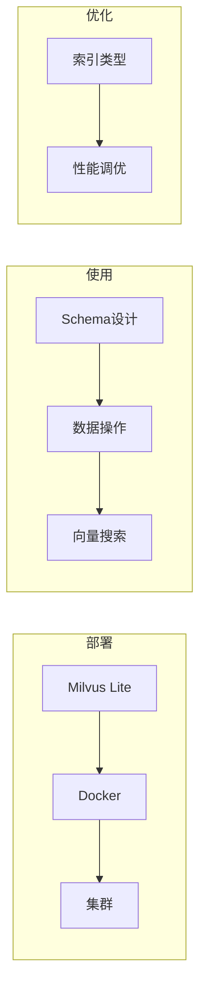

# 第3章 · Milvus 向量数据库 — 企业级大规模向量检索

> **时长**：约 4 小时 ｜ **难度**：⭐⭐⭐ ｜ **类型**：实践
>
> **目标**：掌握 Milvus 的部署和使用，构建大规模向量检索系统

---

## 学习目标

学完本章后，你将能够：
- 部署 Milvus 服务（Docker/Lite）
- 设计高效的 Collection Schema
- 实现百万级向量的高效检索
- 使用索引优化查询性能

---

## 知识地图



---

## 1、Milvus 简介

### 1.1 什么是 Milvus

**概念定义**：Milvus 是一个开源的向量数据库，专为大规模向量检索设计，支持十亿级向量的毫秒级检索。

**核心定位**：当数据规模从百万级增长到十亿级时，轻量级方案（如 Chroma、FAISS）无法满足性能和可用性需求。Milvus 通过分布式架构、多种索引算法和云原生部署解决大规模生产环境下的向量检索挑战。

| 特点 | 说明 |
|------|------|
| 高性能 | 支持十亿级向量毫秒级检索 |
| 高可用 | 支持分布式部署 |
| 多索引 | 支持多种 ANN 索引算法 |
| 云原生 | 支持 K8s 部署 |
| 开源 | Apache 2.0 协议 |

### 1.2 与 Chroma 对比

| 特性 | Chroma | Milvus |
|------|--------|--------|
| 定位 | 轻量级 | 企业级 |
| 数据规模 | 百万级 | 十亿级 |
| 部署方式 | 嵌入式 | 独立服务 |
| 索引支持 | 基础 | 丰富 |
| 学习曲线 | 简单 | 中等 |
| 适用场景 | 原型开发 | 生产环境 |

### 1.3 安装方式

```bash
# 方式1：Milvus Lite（最简单，适合开发）
pip install pymilvus

# 方式2：Docker（推荐生产环境）
# 见下文 Docker 部署

# 方式3：Milvus Cloud（托管服务）
# https://cloud.zilliz.com
```

---

## 2、快速开始：Milvus Lite

### 2.1 基本使用

```python
"""
01_milvus_lite.py
Milvus Lite 快速入门
"""
from pymilvus import MilvusClient


def milvus_lite_demo():
    """Milvus Lite 演示"""
    print("=" * 60)
    print("【Milvus Lite 快速入门】")
    print("=" * 60)

    # 创建客户端（本地文件存储）
    client = MilvusClient("./milvus_demo.db")

    # 创建集合（自动创建 Schema）
    if client.has_collection("demo_collection"):
        client.drop_collection("demo_collection")

    client.create_collection(
        collection_name="demo_collection",
        dimension=128  # 向量维度
    )

    print("已创建集合: demo_collection")

    # 准备数据
    import random
    data = [
        {
            "id": i,
            "vector": [random.random() for _ in range(128)],
            "text": f"这是第 {i} 个文档",
            "category": "A" if i % 2 == 0 else "B"
        }
        for i in range(100)
    ]

    # 插入数据
    client.insert(
        collection_name="demo_collection",
        data=data
    )
    print(f"已插入 {len(data)} 条数据")

    # 搜索
    query_vector = [random.random() for _ in range(128)]
    results = client.search(
        collection_name="demo_collection",
        data=[query_vector],
        limit=5,
        output_fields=["text", "category"]
    )

    print("\n搜索结果:")
    for result in results[0]:
        print(f"  ID: {result['id']}, 距离: {result['distance']:.4f}")
        print(f"      text: {result['entity']['text']}")

    # 带过滤的搜索
    print("\n带过滤的搜索 (category = 'A'):")
    results = client.search(
        collection_name="demo_collection",
        data=[query_vector],
        filter="category == 'A'",
        limit=3,
        output_fields=["text", "category"]
    )

    for result in results[0]:
        print(f"  ID: {result['id']}, category: {result['entity']['category']}")

    # 清理
    client.close()


if __name__ == "__main__":
    milvus_lite_demo()
```

---

## 3、Docker 部署

### 3.1 启动 Milvus

```bash
# 下载 docker-compose 配置
wget https://github.com/milvus-io/milvus/releases/download/v2.3.0/milvus-standalone-docker-compose.yml -O docker-compose.yml

# 启动服务
docker-compose up -d

# 检查状态
docker-compose ps
```

### 3.2 连接服务

```python
"""
02_milvus_docker.py
连接 Docker 部署的 Milvus
"""
from pymilvus import connections, Collection, FieldSchema, CollectionSchema, DataType, utility


def connect_milvus():
    """连接 Milvus 服务"""
    connections.connect(
        alias="default",
        host="localhost",
        port="19530"
    )
    print("已连接到 Milvus")


def disconnect_milvus():
    """断开连接"""
    connections.disconnect("default")
    print("已断开连接")


def create_collection_with_schema():
    """使用 Schema 创建集合"""
    print("\n" + "=" * 60)
    print("【使用 Schema 创建集合】")
    print("=" * 60)

    connect_milvus()

    # 定义字段
    fields = [
        FieldSchema(name="id", dtype=DataType.INT64, is_primary=True, auto_id=True),
        FieldSchema(name="text", dtype=DataType.VARCHAR, max_length=1000),
        FieldSchema(name="embedding", dtype=DataType.FLOAT_VECTOR, dim=1536),
        FieldSchema(name="category", dtype=DataType.VARCHAR, max_length=100),
        FieldSchema(name="timestamp", dtype=DataType.INT64),
    ]

    # 创建 Schema
    schema = CollectionSchema(
        fields=fields,
        description="文档向量集合"
    )

    # 删除已存在的集合
    if utility.has_collection("documents"):
        utility.drop_collection("documents")

    # 创建集合
    collection = Collection(
        name="documents",
        schema=schema
    )

    print(f"已创建集合: {collection.name}")
    print(f"字段: {[f.name for f in collection.schema.fields]}")

    disconnect_milvus()


if __name__ == "__main__":
    create_collection_with_schema()
```

---

## 4、数据操作

### 4.1 插入数据

```python
"""
03_milvus_crud.py
Milvus 数据操作
"""
from pymilvus import connections, Collection, utility
import numpy as np


def insert_data():
    """插入数据"""
    connections.connect(host="localhost", port="19530")

    collection = Collection("documents")

    # 准备数据
    num_entities = 1000

    data = [
        [f"文档内容 {i}" for i in range(num_entities)],  # text
        np.random.random((num_entities, 1536)).tolist(),  # embedding
        [f"category_{i % 5}" for i in range(num_entities)],  # category
        [1700000000 + i for i in range(num_entities)],  # timestamp
    ]

    # 插入
    insert_result = collection.insert(data)

    print(f"插入 {num_entities} 条数据")
    print(f"主键: {insert_result.primary_keys[:5]}...")

    # 刷新数据到磁盘
    collection.flush()
    print(f"数据已刷新，总数: {collection.num_entities}")

    connections.disconnect("default")


def query_data():
    """查询数据"""
    connections.connect(host="localhost", port="19530")

    collection = Collection("documents")
    collection.load()  # 加载到内存

    # 标量查询
    results = collection.query(
        expr="category == 'category_0'",
        output_fields=["text", "category"],
        limit=5
    )

    print("\n标量查询结果:")
    for r in results:
        print(f"  {r}")

    connections.disconnect("default")


def delete_data():
    """删除数据"""
    connections.connect(host="localhost", port="19530")

    collection = Collection("documents")

    # 按条件删除
    expr = "category == 'category_4'"
    collection.delete(expr)

    collection.flush()
    print(f"已删除 category_4 的数据")

    connections.disconnect("default")
```

---

## 5、向量搜索

### 5.1 基本搜索

```python
"""
04_milvus_search.py
Milvus 向量搜索
"""
from pymilvus import connections, Collection
import numpy as np


def basic_search():
    """基本向量搜索"""
    print("=" * 60)
    print("【向量搜索】")
    print("=" * 60)

    connections.connect(host="localhost", port="19530")

    collection = Collection("documents")
    collection.load()

    # 准备查询向量
    query_vectors = np.random.random((1, 1536)).tolist()

    # 搜索
    results = collection.search(
        data=query_vectors,
        anns_field="embedding",
        param={"metric_type": "L2", "params": {"nprobe": 10}},
        limit=5,
        output_fields=["text", "category"]
    )

    print("\n搜索结果:")
    for hits in results:
        for hit in hits:
            print(f"  ID: {hit.id}, 距离: {hit.distance:.4f}")
            print(f"      text: {hit.entity.get('text')[:30]}...")

    connections.disconnect("default")


def filtered_search():
    """带过滤的搜索"""
    print("\n" + "=" * 60)
    print("【带过滤的搜索】")
    print("=" * 60)

    connections.connect(host="localhost", port="19530")

    collection = Collection("documents")
    collection.load()

    query_vectors = np.random.random((1, 1536)).tolist()

    # 带过滤条件的搜索
    results = collection.search(
        data=query_vectors,
        anns_field="embedding",
        param={"metric_type": "L2", "params": {"nprobe": 10}},
        limit=5,
        expr="category in ['category_0', 'category_1']",  # 过滤条件
        output_fields=["text", "category"]
    )

    print("\n过滤后的搜索结果 (category_0 或 category_1):")
    for hits in results:
        for hit in hits:
            print(f"  ID: {hit.id}, category: {hit.entity.get('category')}")

    connections.disconnect("default")


def batch_search():
    """批量搜索"""
    print("\n" + "=" * 60)
    print("【批量搜索】")
    print("=" * 60)

    connections.connect(host="localhost", port="19530")

    collection = Collection("documents")
    collection.load()

    # 多个查询向量
    query_vectors = np.random.random((3, 1536)).tolist()

    results = collection.search(
        data=query_vectors,
        anns_field="embedding",
        param={"metric_type": "L2"},
        limit=2
    )

    print(f"\n批量搜索 {len(query_vectors)} 个向量:")
    for i, hits in enumerate(results):
        print(f"\n  查询 {i+1}:")
        for hit in hits:
            print(f"    ID: {hit.id}, 距离: {hit.distance:.4f}")

    connections.disconnect("default")


if __name__ == "__main__":
    basic_search()
    filtered_search()
    batch_search()
```

---

## 6、索引优化

### 6.1 索引类型

| 索引 | 特点 | 适用场景 |
|------|------|---------|
| FLAT | 暴力搜索，100%准确 | 小数据集 |
| IVF_FLAT | 倒排索引 | 百万级 |
| IVF_SQ8 | 标量量化 | 内存敏感 |
| IVF_PQ | 乘积量化 | 超大规模 |
| HNSW | 图索引，高召回 | 高精度要求 |
| ANNOY | 树索引 | 静态数据 |

### 6.2 创建索引

```python
"""
05_milvus_index.py
索引管理
"""
from pymilvus import connections, Collection


def create_index():
    """创建索引"""
    print("=" * 60)
    print("【创建索引】")
    print("=" * 60)

    connections.connect(host="localhost", port="19530")

    collection = Collection("documents")

    # IVF_FLAT 索引
    index_params = {
        "metric_type": "L2",
        "index_type": "IVF_FLAT",
        "params": {"nlist": 1024}
    }

    collection.create_index(
        field_name="embedding",
        index_params=index_params
    )

    print("已创建 IVF_FLAT 索引")
    print(f"索引信息: {collection.index().params}")

    connections.disconnect("default")


def create_hnsw_index():
    """创建 HNSW 索引（高召回）"""
    connections.connect(host="localhost", port="19530")

    collection = Collection("documents")

    # 删除旧索引
    collection.release()
    collection.drop_index()

    # HNSW 索引
    index_params = {
        "metric_type": "L2",
        "index_type": "HNSW",
        "params": {
            "M": 16,  # 每层连接数
            "efConstruction": 256  # 构建时搜索范围
        }
    }

    collection.create_index(
        field_name="embedding",
        index_params=index_params
    )

    print("已创建 HNSW 索引")

    connections.disconnect("default")


if __name__ == "__main__":
    create_index()
```

### 6.3 索引选择建议

| 数据规模 | 推荐索引 | 搜索参数 |
|---------|---------|---------|
| < 100万 | IVF_FLAT | nprobe=128 |
| 100万-1000万 | IVF_SQ8 | nprobe=64 |
| > 1000万 | HNSW | ef=128 |
| 内存受限 | IVF_PQ | nprobe=32 |

---

## 7、与 LangChain 集成

```python
"""
06_milvus_langchain.py
Milvus + LangChain
"""
from langchain_community.vectorstores import Milvus
from langchain_openai import OpenAIEmbeddings
from langchain.schema import Document


def langchain_milvus():
    """LangChain 集成示例"""
    print("=" * 60)
    print("【Milvus + LangChain】")
    print("=" * 60)

    embeddings = OpenAIEmbeddings(model="text-embedding-3-small")

    documents = [
        Document(page_content="Milvus 是高性能向量数据库", metadata={"source": "milvus"}),
        Document(page_content="LangChain 简化 AI 应用开发", metadata={"source": "langchain"}),
        Document(page_content="向量搜索实现语义匹配", metadata={"source": "vector"}),
    ]

    # 创建 Milvus 向量存储
    vectorstore = Milvus.from_documents(
        documents=documents,
        embedding=embeddings,
        connection_args={"host": "localhost", "port": "19530"},
        collection_name="langchain_milvus"
    )

    # 搜索
    results = vectorstore.similarity_search("数据库", k=2)

    print("\n搜索结果:")
    for doc in results:
        print(f"  - {doc.page_content}")


if __name__ == "__main__":
    import os
    if not os.getenv("OPENAI_API_KEY"):
        print("请设置 OPENAI_API_KEY")
        exit()

    langchain_milvus()
```

---

## 常见踩坑

1. **Milvus Lite 和 Docker 版的 API 差异**：Milvus Lite 使用 MilvusClient 简化 API，而 Docker 版使用 pymilvus 的 connections + Collection 的完整 API。两者混用会导致代码不兼容。建议开发阶段统一选一种方式，或者封装一层抽象接口。

2. **集合 Schema 定义后无法修改**：Milvus 的集合 Schema 在创建后不可修改，新增字段需要删集合重建。建议在创建前仔细规划字段结构，或者预留一些备用字段（如 extra_info VARCHAR）。

3. **搜索前忘记 load() 集合**：Milvus 执行 search 之前必须调用 collection.load() 将数据加载到内存，否则会报错或返回空结果。建议在搜索逻辑中先检查集合的加载状态。

4. **索引参数与数据规模不匹配**：小数据集（< 10 万向量）创建 IVF_FLAT 索引反而比暴力搜索更慢。建议根据数据量选择索引：小数据用 FLAT，百万级用 IVF_FLAT，超大规模用 HNSW。

5. **过滤条件 expr 语法写错导致搜索失败**：Milvus 的过滤表达式使用布尔表达式语法（如 `category == 'A'`），与 Chroma 的 JSON 语法不同。建议先在查询界面或测试脚本中验证 expr 表达式是否正确。

---

## 课后练习

1. 分别用 Milvus Lite 和 Docker 两种方式部署 Milvus，对比两种方式在 API 使用上的差异，总结各自的适用场景。

2. 设计一个包含标题、内容、分类、时间戳四个字段的集合 Schema，插入 1000 条模拟文档数据，并测试带分类过滤条件的向量搜索。

3. 在 10 万条随机向量数据上对比 FLAT、IVF_FLAT、HNSW 三种索引的搜索速度和召回率，绘制性能对比表格。

4. 将 Milvus 通过 LangChain 的 Milvus 包装器集成到 RAG 流程中，验证与 Chroma 集成方式的主要差异点。

---

## 本节小结

- ✅ 了解了 Milvus 的特点和适用场景
- ✅ 掌握了 Milvus Lite 和 Docker 部署
- ✅ 学会了 Schema 设计和数据操作
- ✅ 实现了各种向量搜索方式
- ✅ 理解了索引类型和优化策略

---

> **下一章**：第4章 · FAISS 向量检索库 — Facebook 高性能检索方案
