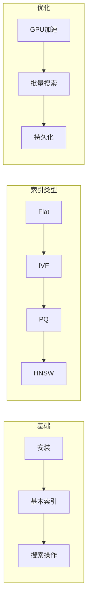

# 第4章 · FAISS 向量检索库 — Facebook 高性能检索方案

> **时长**：约 3 小时 ｜ **难度**：⭐⭐⭐ ｜ **类型**：实践
>
> **目标**：掌握 FAISS 的使用，实现高效的本地向量检索

---

## 学习目标

学完本章后，你将能够：
- 安装和使用 FAISS
- 理解不同索引类型的特点
- 实现高效的相似度搜索
- 优化大规模向量检索性能

---

## 知识地图



---

## 1、FAISS 简介

### 1.1 什么是 FAISS

**概念定义**：FAISS（Facebook AI Similarity Search）是 Facebook 开源的高效相似度搜索库，提供 C++ 实现的高性能向量索引和检索能力。

**核心定位**：与向量数据库不同，FAISS 是一个检索库而非数据库——它不提供数据持久化、元数据管理、分布式等能力，但在单机向量检索性能上达到极致（C++ 底层 + GPU 加速），适合嵌入到已有应用中作为检索内核。

| 特点 | 说明 |
|------|------|
| 高性能 | C++ 实现，支持 GPU |
| 多索引 | 支持多种 ANN 算法 |
| 可扩展 | 支持十亿级向量 |
| 轻量 | 纯库，无服务依赖 |

### 1.2 与向量数据库对比

| 特性 | FAISS | Milvus/Chroma |
|------|-------|---------------|
| 类型 | 检索库 | 数据库 |
| 持久化 | 手动 | 自动 |
| 元数据 | 不支持 | 支持 |
| 分布式 | 不支持 | 支持 |
| 适用场景 | 嵌入应用 | 独立服务 |

### 1.3 安装

```bash
# CPU 版本
pip install faiss-cpu

# GPU 版本（需要 CUDA）
pip install faiss-gpu
```

---

## 2、基本使用

### ▶ 执行代码

```bash
cd code/04-FAISS
python 01_faiss_basic.py
```

```python
"""
01_faiss_basic.py
FAISS 基本使用
"""
import numpy as np
import faiss


def basic_usage():
    """FAISS 基本操作"""
    print("=" * 60)
    print("【FAISS 基本使用】")
    print("=" * 60)

    # 1. 准备数据
    d = 128  # 向量维度
    nb = 10000  # 数据库大小
    nq = 5  # 查询数量

    np.random.seed(42)
    xb = np.random.random((nb, d)).astype('float32')  # 数据库向量
    xq = np.random.random((nq, d)).astype('float32')  # 查询向量

    print(f"数据库: {nb} 个 {d} 维向量")
    print(f"查询: {nq} 个向量")

    # 2. 创建索引（Flat = 暴力搜索）
    index = faiss.IndexFlatL2(d)  # L2 距离

    # 3. 添加向量
    index.add(xb)
    print(f"\n索引中向量数: {index.ntotal}")

    # 4. 搜索
    k = 4  # 返回最近的 k 个
    distances, indices = index.search(xq, k)

    print(f"\n搜索 top-{k} 结果:")
    for i in range(nq):
        print(f"  查询 {i}: 最近邻 = {indices[i]}, 距离 = {distances[i]}")

    # 5. 验证：查询向量本身
    print("\n验证（搜索数据库中的向量）:")
    distances, indices = index.search(xb[:3], k=1)
    print(f"  结果索引: {indices.flatten()}")  # 应该是 [0, 1, 2]
    print(f"  距离: {distances.flatten()}")  # 应该是 [0, 0, 0]


def different_metrics():
    """不同距离度量"""
    print("\n" + "=" * 60)
    print("【不同距离度量】")
    print("=" * 60)

    d = 64
    n = 1000

    np.random.seed(42)
    data = np.random.random((n, d)).astype('float32')
    query = np.random.random((1, d)).astype('float32')

    # L2 距离（欧氏距离）
    index_l2 = faiss.IndexFlatL2(d)
    index_l2.add(data)
    D_l2, I_l2 = index_l2.search(query, 3)

    # 内积（点积）- 需要归一化才等价于余弦相似度
    faiss.normalize_L2(data)
    faiss.normalize_L2(query)

    index_ip = faiss.IndexFlatIP(d)  # Inner Product
    index_ip.add(data)
    D_ip, I_ip = index_ip.search(query, 3)

    print("L2 距离结果:")
    print(f"  索引: {I_l2[0]}, 距离: {D_l2[0]}")

    print("\n内积结果（归一化后 = 余弦相似度）:")
    print(f"  索引: {I_ip[0]}, 相似度: {D_ip[0]}")


if __name__ == "__main__":
    basic_usage()
    different_metrics()
```

---

## 3、索引类型

### 3.1 Flat 索引（精确搜索）

```python
# L2 距离
index = faiss.IndexFlatL2(d)

# 内积（余弦相似度需先归一化）
index = faiss.IndexFlatIP(d)
```

**特点**：100% 准确，但速度慢

### 3.2 IVF 索引（倒排）

```python
"""
02_faiss_ivf.py
IVF 索引
"""
import numpy as np
import faiss


def ivf_index():
    """IVF 索引演示"""
    print("=" * 60)
    print("【IVF 索引】")
    print("=" * 60)

    d = 128
    nb = 100000

    np.random.seed(42)
    xb = np.random.random((nb, d)).astype('float32')
    xq = np.random.random((10, d)).astype('float32')

    # 创建 IVF 索引
    nlist = 100  # 聚类中心数
    quantizer = faiss.IndexFlatL2(d)  # 量化器
    index = faiss.IndexIVFFlat(quantizer, d, nlist)

    # 训练（IVF 需要训练）
    print("训练索引...")
    index.train(xb)

    # 添加数据
    index.add(xb)
    print(f"索引大小: {index.ntotal}")

    # 搜索
    index.nprobe = 10  # 搜索的聚类数（越大越准但越慢）

    import time
    start = time.time()
    D, I = index.search(xq, 5)
    print(f"搜索时间: {(time.time()-start)*1000:.2f}ms")

    # 对比 Flat 索引
    flat_index = faiss.IndexFlatL2(d)
    flat_index.add(xb)

    start = time.time()
    D_flat, I_flat = flat_index.search(xq, 5)
    print(f"Flat 搜索时间: {(time.time()-start)*1000:.2f}ms")

    # 计算召回率
    recall = np.mean([len(set(I[i]) & set(I_flat[i])) / 5 for i in range(len(xq))])
    print(f"召回率: {recall:.2%}")


if __name__ == "__main__":
    ivf_index()
```

### 3.3 PQ 索引（乘积量化）

```python
"""
03_faiss_pq.py
PQ 索引（压缩存储）
"""
import numpy as np
import faiss


def pq_index():
    """PQ 索引演示"""
    print("=" * 60)
    print("【PQ 索引 - 内存优化】")
    print("=" * 60)

    d = 128
    nb = 100000

    np.random.seed(42)
    xb = np.random.random((nb, d)).astype('float32')
    xq = np.random.random((10, d)).astype('float32')

    # IVF + PQ 组合
    nlist = 100
    m = 8  # 子向量数（d 必须能被 m 整除）

    quantizer = faiss.IndexFlatL2(d)
    index = faiss.IndexIVFPQ(quantizer, d, nlist, m, 8)  # 8 = 每个子向量的比特数

    # 训练
    index.train(xb)
    index.add(xb)

    # 内存对比
    flat_index = faiss.IndexFlatL2(d)
    flat_index.add(xb)

    print(f"Flat 索引内存: {nb * d * 4 / 1e6:.2f} MB")
    print(f"IVF-PQ 索引内存: 约 {nb * m / 1e6:.2f} MB")  # 大幅压缩

    # 搜索
    index.nprobe = 10
    D, I = index.search(xq, 5)
    print(f"\n搜索结果（第一个查询）: {I[0]}")


if __name__ == "__main__":
    pq_index()
```

### 3.4 HNSW 索引（图索引）

```python
"""
04_faiss_hnsw.py
HNSW 索引
"""
import numpy as np
import faiss


def hnsw_index():
    """HNSW 索引演示"""
    print("=" * 60)
    print("【HNSW 索引 - 高召回】")
    print("=" * 60)

    d = 128
    nb = 100000

    np.random.seed(42)
    xb = np.random.random((nb, d)).astype('float32')
    xq = np.random.random((10, d)).astype('float32')

    # 创建 HNSW 索引
    M = 32  # 每层连接数
    index = faiss.IndexHNSWFlat(d, M)
    index.hnsw.efConstruction = 40  # 构建时的搜索范围

    # 添加数据
    print("构建索引...")
    index.add(xb)

    # 搜索
    index.hnsw.efSearch = 64  # 搜索时的范围
    D, I = index.search(xq, 5)

    print(f"搜索结果: {I[0]}")

    # 对比 Flat
    flat_index = faiss.IndexFlatL2(d)
    flat_index.add(xb)
    D_flat, I_flat = flat_index.search(xq, 5)

    recall = np.mean([len(set(I[i]) & set(I_flat[i])) / 5 for i in range(len(xq))])
    print(f"召回率: {recall:.2%}")


if __name__ == "__main__":
    hnsw_index()
```

### 3.5 索引选择指南

| 索引 | 内存 | 速度 | 精度 | 适用场景 |
|------|------|------|------|---------|
| Flat | 高 | 慢 | 100% | 小数据集 |
| IVF | 中 | 快 | 95%+ | 通用场景 |
| IVF-PQ | 低 | 快 | 90%+ | 内存受限 |
| HNSW | 高 | 快 | 98%+ | 高精度要求 |

---

## 4、持久化与加载

```python
"""
05_faiss_persist.py
索引持久化
"""
import numpy as np
import faiss


def save_and_load():
    """保存和加载索引"""
    print("=" * 60)
    print("【索引持久化】")
    print("=" * 60)

    d = 128
    nb = 10000

    np.random.seed(42)
    xb = np.random.random((nb, d)).astype('float32')

    # 创建索引
    index = faiss.IndexFlatL2(d)
    index.add(xb)

    # 保存
    faiss.write_index(index, "my_index.faiss")
    print("索引已保存到 my_index.faiss")

    # 加载
    loaded_index = faiss.read_index("my_index.faiss")
    print(f"加载的索引大小: {loaded_index.ntotal}")

    # 验证
    xq = np.random.random((1, d)).astype('float32')
    D1, I1 = index.search(xq, 3)
    D2, I2 = loaded_index.search(xq, 3)

    print(f"原索引结果: {I1[0]}")
    print(f"加载索引结果: {I2[0]}")
    print(f"结果一致: {np.array_equal(I1, I2)}")


if __name__ == "__main__":
    save_and_load()
```

---

## 5、与 LangChain 集成

```python
"""
06_faiss_langchain.py
FAISS + LangChain
"""
from langchain_community.vectorstores import FAISS
from langchain_openai import OpenAIEmbeddings
from langchain.schema import Document


def langchain_faiss():
    """LangChain 集成"""
    print("=" * 60)
    print("【FAISS + LangChain】")
    print("=" * 60)

    embeddings = OpenAIEmbeddings(model="text-embedding-3-small")

    documents = [
        Document(page_content="FAISS 是 Facebook 的向量检索库"),
        Document(page_content="LangChain 简化 AI 应用开发"),
        Document(page_content="向量搜索实现语义匹配"),
        Document(page_content="Python 是流行的编程语言"),
    ]

    # 创建 FAISS 向量存储
    vectorstore = FAISS.from_documents(documents, embeddings)

    # 搜索
    results = vectorstore.similarity_search("AI 开发", k=2)

    print("\n搜索 'AI 开发':")
    for doc in results:
        print(f"  - {doc.page_content}")

    # 保存
    vectorstore.save_local("faiss_index")
    print("\n已保存到 faiss_index/")

    # 加载
    loaded_vs = FAISS.load_local(
        "faiss_index",
        embeddings,
        allow_dangerous_deserialization=True
    )
    print(f"加载成功，包含 {loaded_vs.index.ntotal} 个向量")


if __name__ == "__main__":
    import os
    if not os.getenv("OPENAI_API_KEY"):
        print("请设置 OPENAI_API_KEY")
        exit()

    langchain_faiss()
```

---

## 常见踩坑

1. **向量数据类型不匹配导致静默错误**：FAISS 要求向量数据为 float32 类型，传入 float64 或 int 类型会导致索引创建或搜索出错。建议在 add 和 search 前统一用 `np.array(..., dtype='float32')` 转换数据类型。

2. **IVF 索引使用前未调用 train()**：IVF 系列的索引（IVFFlat、IVFPQ 等）必须先调用 train() 进行聚类训练，然后才能 add() 数据。Flat 和 HNSW 不需要训练。建议仔细阅读索引文档，区分是否需要训练步骤。

3. **索引加载后 GPU/CPU 不匹配**：在 GPU 上训练的索引不能直接在 CPU 上加载使用。建议使用 `faiss.index_cpu_to_gpu()` 和 `faiss.index_gpu_to_cpu()` 进行显式转换，或者在项目中统一使用同一设备类型。

4. **IDMap 混淆导致搜索结果对应错误**：使用 IndexIDMap 时，add_with_ids 传入的 ID 类型必须为 int64，且搜索返回的 ID 需从 int64 转回原始类型。建议在封装层统一管理 ID 的编码和转换逻辑。

5. **忽视索引重建的必要性**：FAISS 索引不支持动态删除和更新，新增数据需要重建索引。在生产环境中建议设计定期重建策略（如每天凌晨重建一次），配合版本管理避免服务中断。

---

## 课后练习

1. 生成 10 万条 128 维随机向量，对比 Flat（精确搜索）、IVF（nlist=100）、HNSW（M=32）三种索引的建索引时间、搜索速度和召回率。

2. 用 FAISS 的 IndexIDMap 实现带 ID 映射的向量检索：构建一个包含 1 万条文档的索引，通过自定义 ID 检索文档内容，实现"向量 ID → 文档内容"的映射表。

3. 对比 CPU 和 GPU（如果有）上 FAISS 的性能差异：分别在 CPU 和 GPU 上使用相同的 50 万条向量数据集，记录搜索延迟和吞吐量。

4. 将 FAISS 通过 LangChain 的 FAISS 包装器集成到应用中，实现索引的保存、加载和增量更新流程。

---

## 本节小结

- ✅ 掌握了 FAISS 的安装和基本使用
- ✅ 理解了 Flat、IVF、PQ、HNSW 等索引类型
- ✅ 学会了索引的持久化和加载
- ✅ 完成了与 LangChain 的集成

---

> **下一章**：第5章 · 向量数据库实战应用 — 构建完整的语义搜索系统
