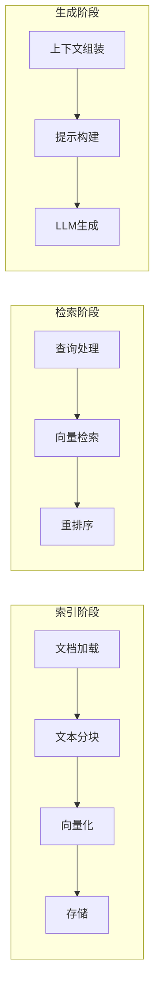
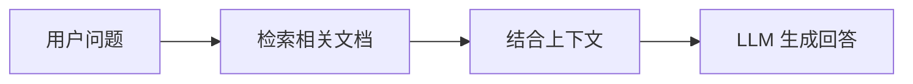
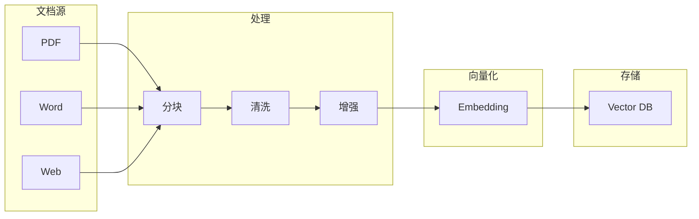
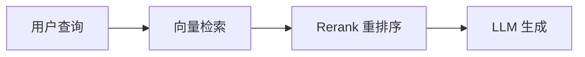
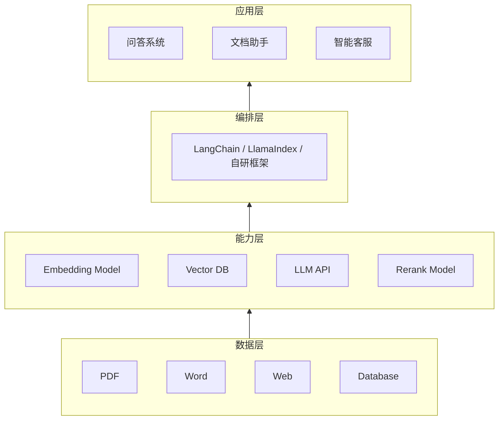

# 第1章 · RAG 系统架构 — 检索增强生成的完整设计

> **时长**：约 3 小时 ｜ **难度**：⭐⭐⭐ ｜ **类型**：理论 + 实践
>
> **目标**：理解 RAG 系统的完整架构与工作流程

---

## 学习目标

学完本章后，你将能够：
- 理解 RAG 系统的核心原理
- 掌握 RAG 的完整工作流程
- 了解各组件的职责与选型
- 设计适合业务场景的 RAG 架构

---

## 知识地图



---

## 1、什么是 RAG

### 1.1 RAG 定义

**RAG（Retrieval-Augmented Generation）** 检索增强生成，是一种将信息检索与文本生成相结合的技术架构。

**概念定义**：RAG（Retrieval-Augmented Generation）检索增强生成，是一种将信息检索与文本生成相结合的技术架构。其核心思想是在 LLM 生成回答之前，先从外部知识库中检索相关文档，将这些文档作为上下文提供给 LLM，从而生成更准确、更可靠的回答。

**核心定位**：RAG 定位为"LLM 的外部记忆系统"——弥补 LLM 知识截止、幻觉、缺乏专业知识三大短板。与 Fine-tuning 不同，RAG 不需要重新训练模型，通过动态检索注入实时知识，成本低、更新快、可解释性强。



### 1.2 为什么需要 RAG

| 问题 | 纯 LLM | RAG 方案 |
|------|--------|---------|
| 知识截止 | 训练数据有截止日期 | 实时检索最新数据 |
| 幻觉问题 | 可能编造信息 | 基于真实文档生成 |
| 专业知识 | 通用知识为主 | 可注入领域知识 |
| 可解释性 | 难以追溯来源 | 可引用原文 |
| 定制成本 | 微调成本高 | 只需更新知识库 |

### 1.3 RAG vs Fine-tuning

| 维度 | RAG | Fine-tuning |
|------|-----|-------------|
| 知识更新 | 实时 | 需重新训练 |
| 成本 | 低 | 高 |
| 可解释性 | 强 | 弱 |
| 专业深度 | 中 | 高 |
| 适用场景 | 知识问答 | 风格/格式定制 |

---

## 2、RAG 完整架构

### 2.1 离线索引阶段



### 2.2 在线检索阶段



### 2.3 核心组件

**概念定义**：RAG 系统由七大核心组件构成，分别负责文档加载、文本分块、向量化、存储检索、检索策略、重排序和生成回答。每个组件都有明确的职责边界和技术选型。

**核心定位**：组件化设计使 RAG 系统的每一层都可插拔替换——更换 Embedding 模型只需替换一个组件，切换向量数据库也只需换一个适配器，无需修改整体流程。

| 组件 | 职责 | 技术选型 |
|------|------|---------|
| Document Loader | 加载各种格式文档 | LangChain Loaders |
| Text Splitter | 文本分块 | 递归分割、语义分割 |
| Embedding Model | 向量化 | OpenAI、BGE |
| Vector Store | 向量存储检索 | Chroma、Milvus |
| Retriever | 检索策略 | 相似度、MMR |
| Reranker | 重排序 | Cohere、BGE-Reranker |
| LLM | 生成回答 | GPT-4、Claude |

---

## 3、基础 RAG 实现

### ▶ 执行代码

```bash
cd code/01-文档处理
python 01_basic_rag.py
```

```python
"""
01_basic_rag.py
基础 RAG 实现
"""
import os
from langchain_openai import ChatOpenAI, OpenAIEmbeddings
from langchain_community.vectorstores import Chroma
from langchain_core.prompts import ChatPromptTemplate
from langchain_core.output_parsers import StrOutputParser
from langchain_core.runnables import RunnablePassthrough


def basic_rag():
    """基础 RAG 示例"""
    print("=" * 60)
    print("【基础 RAG 实现】")
    print("=" * 60)

    # 准备示例文档
    documents = [
        "LangChain 是一个用于开发 LLM 应用的开源框架，由 Harrison Chase 于 2022 年创建。",
        "LangChain 的核心概念包括：Chain、Agent、Memory、Retriever 等。",
        "LCEL（LangChain Expression Language）是 LangChain 的声明式编排语法。",
        "RAG 是 Retrieval-Augmented Generation 的缩写，意为检索增强生成。",
        "向量数据库用于存储和检索高维向量，是 RAG 系统的核心组件。",
        "Chroma 是一个轻量级的向量数据库，适合本地开发和小规模应用。",
        "OpenAI 的 text-embedding-3-small 模型可以将文本转换为 1536 维向量。",
        "GPT-4 是 OpenAI 最强大的语言模型之一，支持 128K 上下文窗口。",
    ]

    # 创建向量存储
    embeddings = OpenAIEmbeddings(model="text-embedding-3-small")
    vectorstore = Chroma.from_texts(
        texts=documents,
        embedding=embeddings,
        collection_name="rag_demo"
    )

    # 创建检索器
    retriever = vectorstore.as_retriever(
        search_type="similarity",
        search_kwargs={"k": 3}
    )

    # 创建 LLM
    llm = ChatOpenAI(model="gpt-4o-mini", temperature=0)

    # RAG Prompt
    template = """基于以下上下文回答问题。如果上下文中没有相关信息，请说明无法回答。

上下文：
{context}

问题：{question}

回答："""

    prompt = ChatPromptTemplate.from_template(template)

    # 构建 RAG Chain
    def format_docs(docs):
        return "\n\n".join(doc.page_content for doc in docs)

    rag_chain = (
        {"context": retriever | format_docs, "question": RunnablePassthrough()}
        | prompt
        | llm
        | StrOutputParser()
    )

    # 测试问题
    questions = [
        "什么是 LangChain？",
        "RAG 是什么意思？",
        "有哪些向量数据库可以使用？",
    ]

    for q in questions:
        print(f"\n问题: {q}")
        print("-" * 40)

        # 先看检索到的文档
        docs = retriever.invoke(q)
        print("检索到的文档:")
        for i, doc in enumerate(docs, 1):
            print(f"  {i}. {doc.page_content[:60]}...")

        # 生成回答
        answer = rag_chain.invoke(q)
        print(f"\n回答: {answer}")


if __name__ == "__main__":
    if not os.getenv("OPENAI_API_KEY"):
        print("请设置 OPENAI_API_KEY")
        exit()

    basic_rag()
```

---

## 4、RAG 系统分层架构

**概念定义**：RAG 系统通常采用四层架构——数据层、能力层、编排层、应用层。数据层管理原始文档，能力层提供 Embedding、检索、LLM 等原子能力，编排层串联流程，应用层面向最终用户。



---

## 5、RAG 质量评估维度

| 维度 | 指标 | 说明 |
|------|------|------|
| 检索质量 | Recall@K | 召回的相关文档比例 |
| 检索质量 | Precision@K | 召回文档的准确率 |
| 检索质量 | MRR | 平均倒数排名 |
| 生成质量 | Faithfulness | 回答是否忠于上下文 |
| 生成质量 | Relevancy | 回答是否相关 |
| 生成质量 | Completeness | 回答是否完整 |

---

## 常见踩坑

1. **离线索引与在线检索混淆**：分不清索引阶段（文档加载→分块→向量化→存储）和检索阶段（查询→检索→重排序→生成）的边界，导致架构设计混乱。建议用泳道图清晰划分两个阶段的责任边界。

2. **Embedding 模型与检索语言不匹配**：中文文档用英文优化的 Embedding 模型，导致语义检索效果差。中文场景优先选择 BGE、m3e 等中文优化模型，或 OpenAI text-embedding-3-small 的多语言版本。

3. **向量数据库选型过度设计**：小团队或原型阶段直接上 Milvus、Elasticsearch 等重型方案，运维成本高。初期用 Chroma、FAISS 等轻量级方案即可，业务规模扩大后再迁移。

4. **top-k 参数一成不变**：所有问题都用固定数量的检索文档（如 k=3），简单问题多余信息干扰，复杂问题信息不足。应根据问题类型动态调整 top-k，或用重排序后按阈值截断。

5. **忽略 RAG 评估直接上线**：没有建立检索质量和生成质量的评估指标，上线后出现问题难以定位。任何 RAG 系统上线前至少应建立 Recall@K 和 Faithfulness 两个基础指标。

## 课后练习

1. 使用 LangChain 搭建一个基础 RAG 系统，包含文档加载、向量存储、检索和生成四个步骤，并用至少 3 个测试问题验证流程是否打通。

2. 对比两种不同的 Embedding 模型（如 OpenAI text-embedding-3-small 和 BGE），在同一个数据集中测试检索结果的差异，分析各自的优势和劣势。

3. 分析你所在业务场景的 RAG 需求，绘制一张分层架构图（数据层→能力层→编排层→应用层），标明每一层使用的技术栈。

4. 设计一个简单的 RAG 质量评估方案，包含至少 2 个检索指标和 2 个生成指标，并说明每个指标的评估方法和预期目标。

---

## 本节小结

- ✅ 理解了 RAG 的核心概念和价值
- ✅ 掌握了 RAG 的完整架构设计
- ✅ 实现了基础 RAG 流程
- ✅ 了解了 RAG 的评估维度

---

> **下一章**：第2章 · 文档处理与分块 — 构建高质量知识库的基础
