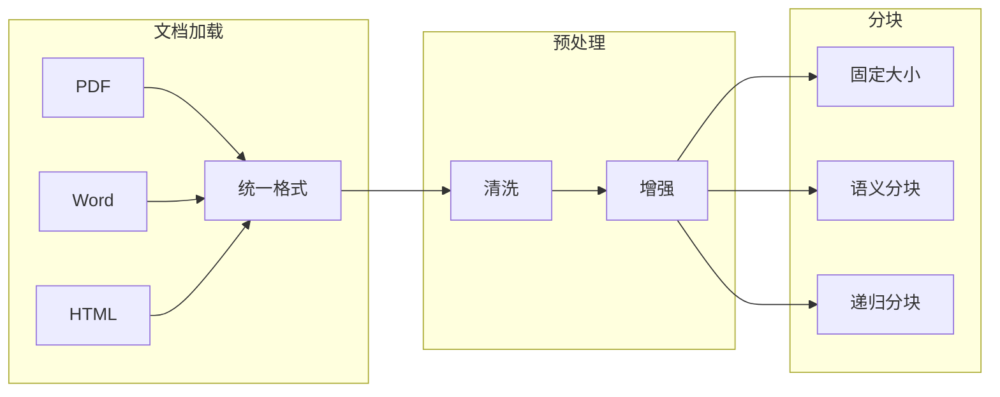
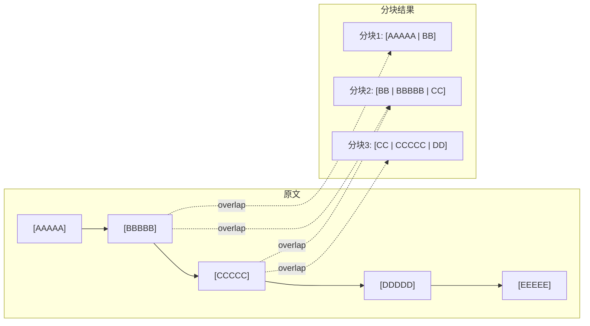

# 第2章 · 文档处理与分块 — 构建高质量知识库的基础

> **时长**：约 4 小时 ｜ **难度**：⭐⭐⭐ ｜ **类型**：实践
>
> **目标**：掌握文档处理和分块的最佳实践

---

## 学习目标

学完本章后，你将能够：
- 处理各种格式的文档（PDF、Word、HTML 等）
- 选择合适的分块策略
- 优化分块参数以提升检索质量
- 处理特殊内容（表格、代码、图片）

---

## 知识地图



---

## 1、文档加载

### 1.1 LangChain Document Loaders

**概念定义**：Document Loader 是 LangChain 中用于加载各种格式文档的标准接口。它将不同来源（PDF、Word、HTML、CSV 等）的文档统一转换为 LangChain 的 Document 对象（包含 page_content 和 metadata 两个字段），为后续处理提供统一的数据格式。

**核心定位**：Document Loader 处于 RAG 流程的最上游——文档格式千差万别，但 Loader 输出格式统一。上层的分块、向量化、检索等组件无需关心原始格式，只需处理标准 Document 对象。

```python
"""
01_document_loaders.py
文档加载器
"""
from langchain_community.document_loaders import (
    TextLoader,
    PyPDFLoader,
    Docx2txtLoader,
    UnstructuredHTMLLoader,
    CSVLoader,
    JSONLoader,
    DirectoryLoader,
)


def load_text():
    """加载文本文件"""
    loader = TextLoader("example.txt", encoding="utf-8")
    documents = loader.load()
    print(f"加载了 {len(documents)} 个文档")
    return documents


def load_pdf():
    """加载 PDF 文件"""
    loader = PyPDFLoader("example.pdf")
    # 按页加载
    pages = loader.load_and_split()
    print(f"PDF 共 {len(pages)} 页")
    return pages


def load_word():
    """加载 Word 文件"""
    loader = Docx2txtLoader("example.docx")
    documents = loader.load()
    return documents


def load_html():
    """加载 HTML 文件"""
    loader = UnstructuredHTMLLoader("example.html")
    documents = loader.load()
    return documents


def load_csv():
    """加载 CSV 文件"""
    loader = CSVLoader(
        file_path="data.csv",
        csv_args={"delimiter": ","},
        source_column="source"
    )
    documents = loader.load()
    return documents


def load_directory():
    """加载整个目录"""
    loader = DirectoryLoader(
        "./docs/",
        glob="**/*.txt",
        loader_cls=TextLoader,
        loader_kwargs={"encoding": "utf-8"}
    )
    documents = loader.load()
    print(f"从目录加载了 {len(documents)} 个文档")
    return documents
```

### 1.2 文档元数据

```python
"""
02_metadata.py
文档元数据处理
"""
from langchain.schema import Document
from datetime import datetime


def add_metadata(documents):
    """添加元数据"""
    enhanced_docs = []

    for doc in documents:
        # 添加自定义元数据
        doc.metadata.update({
            "indexed_at": datetime.now().isoformat(),
            "doc_type": "technical",
            "language": "zh-CN",
        })
        enhanced_docs.append(doc)

    return enhanced_docs


def filter_by_metadata(vectorstore, query):
    """基于元数据过滤"""
    results = vectorstore.similarity_search(
        query,
        k=5,
        filter={"doc_type": "technical"}
    )
    return results
```

---

## 2、文本分块策略

**概念定义**：文本分块（Text Chunking）是将长文档切分为若干较短片段的过程。分块是 RAG 系统的关键预处理步骤——分块质量直接决定了后续检索的精度和召回率。

**核心定位**：分块是检索精度的"天花板"——如果相关的内容被切碎或分散到不同块中，再好的检索算法也无法找回完整信息。好的分块策略需要平衡块大小（信息完整性）与块粒度（检索精确性）之间的矛盾。

### 2.1 为什么要分块

| 原因 | 说明 |
|------|------|
| LLM 上下文限制 | 单次能处理的 token 有上限 |
| 检索精度 | 小块更容易精确匹配 |
| 成本控制 | 减少每次调用的 token 数 |
| 相关性聚焦 | 避免无关内容干扰 |

### 2.2 分块参数

**概念定义**：`chunk_size` 控制每块的目标大小（字符数或 Token 数），`chunk_overlap` 控制相邻块之间的重叠字符数。重叠的目的是防止关键信息恰好落在分块边界上被截断。



### 2.3 分块策略对比

| 策略 | 特点 | 适用场景 |
|------|------|---------|
| 固定大小 | 简单、快速 | 结构化文本 |
| 递归分块 | 按语义边界 | 通用文档 |
| 语义分块 | 按主题聚合 | 长文档 |
| 代码分块 | 按函数/类 | 源代码 |

---

## 3、分块实现

### 3.1 递归字符分块

```python
"""
03_text_splitter.py
文本分块器
"""
from langchain.text_splitter import (
    RecursiveCharacterTextSplitter,
    CharacterTextSplitter,
    TokenTextSplitter,
)


def recursive_split():
    """递归字符分块（推荐）"""
    splitter = RecursiveCharacterTextSplitter(
        chunk_size=500,
        chunk_overlap=50,
        length_function=len,
        separators=["\n\n", "\n", "。", ".", " ", ""]
    )

    text = """
    人工智能是计算机科学的一个重要分支。它致力于研究和开发能够模拟人类智能的系统。

    机器学习是人工智能的核心技术之一。通过大量数据的训练，机器可以自动学习和改进。

    深度学习是机器学习的一个子集。它使用多层神经网络来处理复杂的模式识别任务。
    """

    chunks = splitter.split_text(text)

    print(f"分成 {len(chunks)} 个块:")
    for i, chunk in enumerate(chunks):
        print(f"\n[{i}] ({len(chunk)} 字符)")
        print(f"  {chunk[:100]}...")

    return chunks


def character_split():
    """固定字符分块"""
    splitter = CharacterTextSplitter(
        separator="\n\n",
        chunk_size=500,
        chunk_overlap=50
    )
    return splitter


def token_split():
    """按 Token 分块"""
    splitter = TokenTextSplitter(
        chunk_size=100,  # token 数
        chunk_overlap=10
    )
    return splitter


if __name__ == "__main__":
    recursive_split()
```

### 3.2 语义分块

```python
"""
04_semantic_split.py
语义分块
"""
from langchain_experimental.text_splitter import SemanticChunker
from langchain_openai import OpenAIEmbeddings


def semantic_split(text):
    """基于语义相似度分块"""
    embeddings = OpenAIEmbeddings(model="text-embedding-3-small")

    # 创建语义分块器
    splitter = SemanticChunker(
        embeddings=embeddings,
        breakpoint_threshold_type="percentile",
        breakpoint_threshold_amount=95
    )

    chunks = splitter.split_text(text)

    print(f"语义分块结果: {len(chunks)} 个块")
    for i, chunk in enumerate(chunks):
        print(f"\n[{i}] {chunk[:100]}...")

    return chunks
```

### 3.3 代码分块

```python
"""
05_code_split.py
代码分块
"""
from langchain.text_splitter import (
    RecursiveCharacterTextSplitter,
    Language
)


def split_python_code(code: str):
    """Python 代码分块"""
    splitter = RecursiveCharacterTextSplitter.from_language(
        language=Language.PYTHON,
        chunk_size=500,
        chunk_overlap=50
    )

    chunks = splitter.split_text(code)
    return chunks


def split_javascript_code(code: str):
    """JavaScript 代码分块"""
    splitter = RecursiveCharacterTextSplitter.from_language(
        language=Language.JS,
        chunk_size=500,
        chunk_overlap=50
    )

    chunks = splitter.split_text(code)
    return chunks


# 支持的语言
supported_languages = [
    Language.PYTHON,
    Language.JS,
    Language.JAVA,
    Language.GO,
    Language.RUST,
    Language.HTML,
    Language.MARKDOWN,
]
```

---

## 4、分块优化技巧

### 4.1 最佳实践

| 技巧 | 说明 |
|------|------|
| 保持语义完整 | 不在句子中间断开 |
| 适当重叠 | 10-20% 重叠防止信息丢失 |
| 添加上下文 | 在块中加入标题/章节信息 |
| 大小均衡 | 避免块大小差异过大 |

### 4.2 上下文增强

```python
"""
06_context_enhance.py
上下文增强
"""
from langchain.schema import Document


def add_context_to_chunks(chunks, metadata):
    """为分块添加上下文信息"""
    enhanced_chunks = []

    for i, chunk in enumerate(chunks):
        # 添加文档标题作为前缀
        enhanced_content = f"[文档: {metadata.get('title', '未知')}]\n\n{chunk}"

        # 添加章节信息
        if 'section' in metadata:
            enhanced_content = f"[章节: {metadata['section']}]\n{enhanced_content}"

        enhanced_chunks.append(Document(
            page_content=enhanced_content,
            metadata={
                **metadata,
                "chunk_index": i,
                "total_chunks": len(chunks)
            }
        ))

    return enhanced_chunks


def add_parent_reference(chunks):
    """添加父文档引用（Parent Document Retriever）"""
    # 创建父文档 ID
    parent_id = hash(str(chunks))

    for chunk in chunks:
        chunk.metadata["parent_id"] = parent_id

    return chunks
```

---

## 5、分块参数调优

### 5.1 参数选择指南

| 场景 | chunk_size | chunk_overlap | 原因 |
|------|------------|---------------|------|
| FAQ 问答 | 200-300 | 20-30 | 短小精确 |
| 文档检索 | 500-800 | 50-100 | 保持上下文 |
| 代码搜索 | 1000-2000 | 100-200 | 完整函数 |
| 法律合同 | 300-500 | 50 | 条款完整 |

### 5.2 评估分块质量

```python
"""
07_chunk_evaluation.py
分块质量评估
"""
import numpy as np
from typing import List


def evaluate_chunks(chunks: List[str]):
    """评估分块质量"""
    sizes = [len(c) for c in chunks]

    metrics = {
        "num_chunks": len(chunks),
        "avg_size": np.mean(sizes),
        "min_size": min(sizes),
        "max_size": max(sizes),
        "std_size": np.std(sizes),
        "size_ratio": max(sizes) / min(sizes) if min(sizes) > 0 else float('inf')
    }

    print("分块质量评估:")
    print(f"  块数量: {metrics['num_chunks']}")
    print(f"  平均大小: {metrics['avg_size']:.0f}")
    print(f"  大小范围: {metrics['min_size']} - {metrics['max_size']}")
    print(f"  标准差: {metrics['std_size']:.0f}")
    print(f"  大小比率: {metrics['size_ratio']:.2f}")

    # 质量判断
    if metrics['size_ratio'] > 5:
        print("⚠️ 警告: 块大小差异过大")
    if metrics['avg_size'] < 100:
        print("⚠️ 警告: 平均块大小过小")
    if metrics['avg_size'] > 2000:
        print("⚠️ 警告: 平均块大小过大")

    return metrics
```

---

## 常见踩坑

1. **chunk_size 过大导致上下文污染**：每个块包含太多无关信息，检索时命中但实际相关片段被淹没。例如将整份合同作为一个块，查询"违约责任"时返回整个合同文本。建议分块后每块聚焦一个主题或章节。

2. **chunk_overlap 过小或为 0**：关键信息恰好落在分块边界上被截断，导致检索永远无法找到该信息。例如"人工"在块 A 末尾，"智能"在块 B 开头，两块都无法匹配"人工智能"。重叠比例建议在 10%-20% 之间。

3. **表格和代码等特殊内容被切碎**：表格的行被分到不同块，代码的函数体被拆分。对于 Markdown 表格、HTML 表格、代码文件，应使用专门的分块器（如 `RecursiveCharacterTextSplitter.from_language` 按代码结构分块）。

4. **忽略文档元数据传递**：分块后没有保留原始文档的标题、章节、来源等信息，导致检索结果无法追溯来源。应在分块时将元数据逐块传递，并在生成回答时携带来源引用。

5. **所有文档使用统一分块参数**：FAQ 问答、技术文档、法律合同使用相同的 chunk_size 和 overlap。不同类型的文档应差异化配置——FAQ 用小块（200-300），技术文档用中块（500-800），代码用大块（1000-2000）。

## 课后练习

1. 下载一份 PDF 文档，依次使用固定大小分块、递归字符分块和语义分块三种策略进行处理，对比每种策略的块数、块大小分布和语义完整性。

2. 分别设置 chunk_size=200、chunk_size=500 和 chunk_size=1000，用同一个文档构建 RAG 系统，测试"同一问题在不同分块大小下的检索结果差异"，并分析原因。

3. 在一份含有表格和技术术语的文档上测试分块效果，观察表格行被切碎后的检索结果，并尝试用 `MarkdownHeaderTextSplitter` 或自定义分隔符来优化分块效果。

4. 编写一个分块质量评估函数，能够计算块数、平均大小、大小标准差、最大/最小比等指标，并用该函数评估你当前项目的分块配置是否合理。

---

## 本节小结

- ✅ 掌握了多种文档格式的加载方法
- ✅ 理解了不同分块策略的特点
- ✅ 学会了分块参数的调优技巧
- ✅ 了解了分块质量的评估方法

---

> **下一章**：第3章 · 检索策略优化 — 提升召回质量的关键技术
