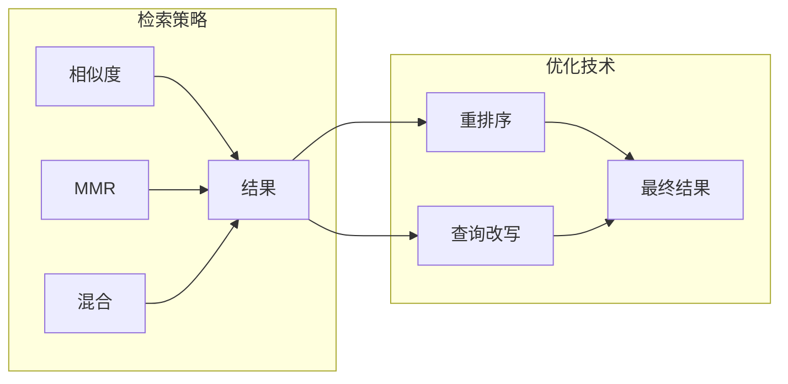

# 第3章 · 检索策略优化 — 提升召回质量的关键技术

> **时长**：约 4 小时 ｜ **难度**：⭐⭐⭐⭐ ｜ **类型**：实践
>
> **目标**：掌握多种检索优化技术，提升 RAG 系统的召回质量

---

## 学习目标

学完本章后，你将能够：
- 使用多种检索策略（相似度、MMR、多查询）
- 实现混合检索（稠密 + 稀疏）
- 应用重排序（Rerank）技术
- 优化查询以提升检索效果

---

## 知识地图



---

## 1、基础检索策略

### 1.1 相似度检索

**概念定义**：相似度检索（Similarity Search）通过计算查询向量与文档向量之间的余弦相似度或欧氏距离，找到与查询语义最接近的文档。这是 RAG 系统中最基础、最常用的检索方式。

**核心定位**：相似度检索追求"语义匹配"——不依赖关键词精确匹配，而是理解查询意图。缺点是结果可能高度重复（多个语义相似的文档），缺乏多样性。

```python
"""
01_similarity_search.py
相似度检索
"""
from langchain_community.vectorstores import Chroma
from langchain_openai import OpenAIEmbeddings


def similarity_search():
    """基本相似度搜索"""
    embeddings = OpenAIEmbeddings(model="text-embedding-3-small")

    # 创建示例向量存储
    texts = [
        "Python 是一种编程语言",
        "机器学习使用 Python 开发",
        "深度学习需要大量数据",
        "JavaScript 用于网页开发",
        "向量数据库存储嵌入向量",
    ]

    vectorstore = Chroma.from_texts(texts, embeddings)

    # 相似度搜索
    query = "Python 编程"
    results = vectorstore.similarity_search(query, k=3)

    print("相似度搜索结果:")
    for i, doc in enumerate(results, 1):
        print(f"  {i}. {doc.page_content}")

    # 带分数的搜索
    results_with_scores = vectorstore.similarity_search_with_score(query, k=3)

    print("\n带分数的结果:")
    for doc, score in results_with_scores:
        print(f"  [{score:.4f}] {doc.page_content}")


if __name__ == "__main__":
    import os
    if os.getenv("OPENAI_API_KEY"):
        similarity_search()
```

### 1.2 MMR 检索（最大边际相关性）

**概念定义**：MMR（Maximum Marginal Relevance）在相似度的基础上增加多样性约束——不仅要与查询相关，还要与已选中结果有差异。参数 lambda_mult（0~1）控制权重：趋近 0 时最大多样性，趋近 1 时近似纯相似度。

**核心定位**：MMR 解决相似度检索结果重复的问题。当知识库中同一话题有大量相似文档时，MMR 能覆盖更多信息角度。适合探索性搜索和需要全面了解场景的问题。

```python
"""
02_mmr_search.py
MMR 检索 - 平衡相关性和多样性
"""
from langchain_community.vectorstores import Chroma
from langchain_openai import OpenAIEmbeddings


def mmr_search():
    """MMR 搜索 - 增加结果多样性"""
    embeddings = OpenAIEmbeddings(model="text-embedding-3-small")

    texts = [
        "Python 是一种通用编程语言",
        "Python 语法简洁易读",
        "Python 适合初学者学习",
        "Java 是企业级开发语言",
        "JavaScript 是网页开发语言",
        "机器学习经常使用 Python",
    ]

    vectorstore = Chroma.from_texts(texts, embeddings)

    query = "Python"

    # 普通相似度搜索（可能返回很多相似的结果）
    print("普通相似度搜索:")
    results = vectorstore.similarity_search(query, k=4)
    for doc in results:
        print(f"  - {doc.page_content}")

    # MMR 搜索（增加多样性）
    print("\nMMR 搜索 (lambda=0.5):")
    results = vectorstore.max_marginal_relevance_search(
        query,
        k=4,
        fetch_k=10,  # 先获取更多候选
        lambda_mult=0.5  # 0=最大多样性, 1=纯相似度
    )
    for doc in results:
        print(f"  - {doc.page_content}")


if __name__ == "__main__":
    import os
    if os.getenv("OPENAI_API_KEY"):
        mmr_search()
```

---

## 2、混合检索

**概念定义**：混合检索（Hybrid Search）将稠密检索（向量相似度，语义匹配）与稀疏检索（BM25 关键词匹配）相结合。稠密检索理解语义但可能遗漏关键术语，稀疏检索精确匹配关键词但无法理解同义词，两者互补。

**核心定位**：混合检索是"语义理解 + 关键词精确"的双保险。专业术语（如"急性心肌梗死"）靠 BM25 精确命中，同义表达（如"心脏病发作"）靠向量语义召回，大幅提升召回率。

### 2.1 稠密 + 稀疏检索

```python
"""
03_hybrid_search.py
混合检索
"""
from langchain_community.vectorstores import Chroma
from langchain_openai import OpenAIEmbeddings
from langchain_community.retrievers import BM25Retriever
from langchain.retrievers import EnsembleRetriever
from langchain.schema import Document


def hybrid_search():
    """混合检索：向量 + BM25"""
    texts = [
        "LangChain 是一个开源的 LLM 应用框架",
        "RAG 是检索增强生成的缩写",
        "向量数据库用于语义搜索",
        "BM25 是经典的关键词检索算法",
        "混合检索结合了语义和关键词搜索",
    ]

    documents = [Document(page_content=t) for t in texts]

    # 创建向量检索器
    embeddings = OpenAIEmbeddings(model="text-embedding-3-small")
    vectorstore = Chroma.from_documents(documents, embeddings)
    vector_retriever = vectorstore.as_retriever(search_kwargs={"k": 3})

    # 创建 BM25 检索器
    bm25_retriever = BM25Retriever.from_documents(documents)
    bm25_retriever.k = 3

    # 创建混合检索器
    ensemble_retriever = EnsembleRetriever(
        retrievers=[vector_retriever, bm25_retriever],
        weights=[0.5, 0.5]  # 各占 50% 权重
    )

    query = "LangChain RAG"

    print("【混合检索结果】")
    print(f"查询: {query}\n")

    # 向量检索
    print("向量检索:")
    for doc in vector_retriever.invoke(query):
        print(f"  - {doc.page_content}")

    # BM25 检索
    print("\nBM25 检索:")
    for doc in bm25_retriever.invoke(query):
        print(f"  - {doc.page_content}")

    # 混合检索
    print("\n混合检索:")
    for doc in ensemble_retriever.invoke(query):
        print(f"  - {doc.page_content}")


if __name__ == "__main__":
    import os
    if os.getenv("OPENAI_API_KEY"):
        hybrid_search()
```

---

## 3、重排序（Rerank）

**概念定义**：重排序（Rerank）是在初次检索之后，用更精确但计算代价更高的模型对候选文档重新评分排序。典型的两阶段策略：第一阶段用向量检索快速召回 Top-K（如 20 个），第二阶段用 Cross-Encoder 或 LLM 精排取 Top-N（如 3 个）。

**核心定位**：Rerank 是"粗排 + 精排"的两阶段策略。向量检索速度优先（毫秒级），Rerank 精度优先（百毫秒级），两者结合在速度与精度之间找到最优平衡。尤其适合对回答质量要求高的场景。

### 3.1 使用 Cross-Encoder 重排序

```python
"""
04_reranker.py
重排序
"""
from typing import List
from langchain.schema import Document
from openai import OpenAI


class LLMReranker:
    """使用 LLM 重排序"""

    def __init__(self):
        self.client = OpenAI()

    def rerank(
        self,
        query: str,
        documents: List[Document],
        top_k: int = 3
    ) -> List[Document]:
        """重排序文档"""

        if not documents:
            return []

        # 构建评分提示
        prompt = f"""请为以下文档对查询的相关性打分（0-10分）。

查询: {query}

文档:
"""
        for i, doc in enumerate(documents):
            prompt += f"\n{i+1}. {doc.page_content[:200]}"

        prompt += """

请以 JSON 格式返回分数，例如: {"scores": [8, 5, 9, ...]}
只返回 JSON。"""

        response = self.client.chat.completions.create(
            model="gpt-4o-mini",
            messages=[{"role": "user", "content": prompt}],
            response_format={"type": "json_object"}
        )

        import json
        result = json.loads(response.choices[0].message.content)
        scores = result.get("scores", [0] * len(documents))

        # 按分数排序
        scored_docs = list(zip(documents, scores))
        scored_docs.sort(key=lambda x: x[1], reverse=True)

        return [doc for doc, _ in scored_docs[:top_k]]


def rerank_demo():
    """重排序演示"""
    documents = [
        Document(page_content="Python 是一种编程语言，广泛用于数据科学"),
        Document(page_content="今天天气很好，适合出去玩"),
        Document(page_content="机器学习是人工智能的核心技术"),
        Document(page_content="Python 的语法简洁，易于学习"),
    ]

    query = "Python 编程学习"

    reranker = LLMReranker()
    reranked = reranker.rerank(query, documents, top_k=2)

    print(f"查询: {query}\n")
    print("重排序后的结果:")
    for i, doc in enumerate(reranked, 1):
        print(f"  {i}. {doc.page_content}")


if __name__ == "__main__":
    import os
    if os.getenv("OPENAI_API_KEY"):
        rerank_demo()
```

---

## 4、查询优化

**概念定义**：查询优化（Query Optimization）通过改写、扩展或分解原始查询来提升检索命中率。常见手法包括多查询扩展（LLM 生成多个查询变体扩大覆盖）、查询改写（补全缩写、添加同义词）、查询分解（将复杂问题拆解为多个子问题分别检索）。

**核心定位**：查询优化是在不修改索引和检索器的情况下，通过"让问题提得更好"来提升召回率。相当于给每个问题配备了"翻译官"——把用户模糊的表达转成检索系统最擅长处理的精确查询。

### 4.1 多查询检索

```python
"""
05_multi_query.py
多查询检索
"""
from langchain.retrievers.multi_query import MultiQueryRetriever
from langchain_community.vectorstores import Chroma
from langchain_openai import ChatOpenAI, OpenAIEmbeddings


def multi_query_retrieval():
    """多查询检索 - 生成多个查询变体"""
    texts = [
        "LangChain 是构建 LLM 应用的框架",
        "LCEL 是 LangChain 的表达式语言",
        "Agent 可以自主决策和执行动作",
        "RAG 结合检索和生成",
        "向量数据库存储文档嵌入",
    ]

    embeddings = OpenAIEmbeddings(model="text-embedding-3-small")
    vectorstore = Chroma.from_texts(texts, embeddings)

    llm = ChatOpenAI(model="gpt-4o-mini", temperature=0)

    # 创建多查询检索器
    retriever = MultiQueryRetriever.from_llm(
        retriever=vectorstore.as_retriever(),
        llm=llm
    )

    query = "如何使用 LangChain"

    # 获取结果
    results = retriever.invoke(query)

    print(f"原始查询: {query}\n")
    print("检索结果:")
    for doc in results:
        print(f"  - {doc.page_content}")


if __name__ == "__main__":
    import os
    if os.getenv("OPENAI_API_KEY"):
        multi_query_retrieval()
```

### 4.2 查询改写

```python
"""
06_query_rewrite.py
查询改写
"""
from langchain_openai import ChatOpenAI
from langchain_core.prompts import ChatPromptTemplate


def rewrite_query(query: str) -> str:
    """改写查询以提升检索效果"""
    llm = ChatOpenAI(model="gpt-4o-mini", temperature=0)

    prompt = ChatPromptTemplate.from_template("""
你是一个搜索查询优化专家。请改写用户的查询，使其更适合语义搜索。

原始查询: {query}

改写规则:
1. 扩展缩写和专业术语
2. 添加同义词
3. 保持核心意图
4. 返回 3 个改写版本

请以 JSON 格式返回: {{"queries": ["改写1", "改写2", "改写3"]}}
""")

    chain = prompt | llm

    response = chain.invoke({"query": query})

    import json
    result = json.loads(response.content)
    return result.get("queries", [query])


def query_rewrite_demo():
    """查询改写演示"""
    queries = [
        "RAG 是什么",
        "如何用 LC 做 QA",
        "向量库选哪个好",
    ]

    for q in queries:
        print(f"\n原始: {q}")
        rewritten = rewrite_query(q)
        print("改写:")
        for r in rewritten:
            print(f"  - {r}")


if __name__ == "__main__":
    import os
    if os.getenv("OPENAI_API_KEY"):
        query_rewrite_demo()
```

---

## 5、检索策略选择

| 策略 | 优点 | 缺点 | 适用场景 |
|------|------|------|---------|
| 相似度 | 简单快速 | 可能重复 | 一般问答 |
| MMR | 多样性好 | 可能丢失最相关 | 探索性搜索 |
| 混合检索 | 兼顾语义+关键词 | 复杂度高 | 专业领域 |
| 多查询 | 覆盖面广 | 成本高 | 复杂问题 |
| 重排序 | 精度高 | 额外延迟 | 高要求场景 |

---

## 常见踩坑

1. **过度依赖向量检索，忽略关键词匹配**：纯向量的语义检索在专业术语、代码片段、产品型号等场景下召回率差。例如查询"iPhone 15 Pro Max"，向量检索可能返回"手机"相关文档但丢失精确型号。务必在专业领域加入 BM25 或 Elasticsearch 关键词检索。

2. **MMR 的 lambda_mult 调参不当**：lambda_mult 过小（趋近 0）导致检索结果与问题不相关，过大（趋近 1）退化为纯相似度失去多样性。建议从 0.5 开始调试，观察结果分布后逐步微调。

3. **Rerank 引入不可接受的延迟**：使用 LLM 做重排序虽然精度高，但每轮检索额外增加 1-3 秒延迟。高并发场景应改用专门的 Cross-Encoder 模型（如 BGE-Reranker），或将 Rerank 仅用于离线评估而非在线服务。

4. **多查询检索的成本失控**：Multi-Query 将 1 个查询扩展为 3-5 个，检索量和 LLM 调用量同步放大。复杂问题收益明显，简单问题纯属浪费。建议根据问题复杂度动态决定是否启用多查询策略。

5. **查询改写改变了用户原意**：查询改写可能引入模型幻觉——改写后的查询偏离用户真实意图。应在改写后增加"改写合理性校验"步骤，或限制改写幅度（仅扩展缩写和同义词，不重构句子）。

## 课后练习

1. 在同一个知识库上，分别用相似度检索、MMR 检索、混合检索三种策略搜索同一个问题，对比返回结果的数量、多样性和相关性差异。

2. 实现一个混合检索器：同时使用向量检索（Chroma）和 BM25 检索，用 `EnsembleRetriever` 将两者以 0.7:0.3 的权重合并，测试不同权重比例下的召回率变化。

3. 实现一个两阶段检索流程：先用向量检索召回 10 个候选文档，再用 LLM 对候选文档与查询的相关性打分，取前 3 个作为最终上下文。对比两阶段与单阶段的回答质量差异。

4. 对一个模糊的查询（如"那个框架怎么弄"），分别使用查询改写和多查询扩展两种技术处理后进行检索，对比优化前后的检索结果数量和质量。

---

## 本节小结

- ✅ 掌握了多种检索策略的使用
- ✅ 实现了混合检索（向量 + BM25）
- ✅ 学会了使用 Rerank 提升精度
- ✅ 了解了查询优化技术

---

> **下一章**：第4章 · 生成优化与上下文管理 — 提升回答质量
