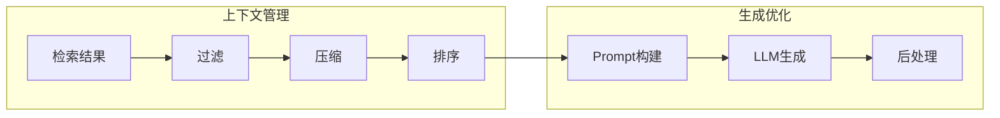

# 第4章 · 生成优化与上下文管理 — 提升回答质量

> **时长**：约 3 小时 ｜ **难度**：⭐⭐⭐ ｜ **类型**：实践
>
> **目标**：掌握 RAG 生成阶段的优化技术

---

## 学习目标

学完本章后，你将能够：
- 设计高效的 RAG Prompt 模板
- 实现上下文压缩和管理
- 处理长上下文和多轮对话
- 添加引用和来源追溯

---

## 知识地图



---

## 1、Prompt 设计

### 1.1 RAG Prompt 模板

```python
"""
01_rag_prompts.py
RAG Prompt 模板
"""
from langchain_core.prompts import ChatPromptTemplate, MessagesPlaceholder


# 基础 RAG Prompt
BASIC_RAG_PROMPT = """基于以下上下文回答问题。如果上下文中没有相关信息，请明确说明。

上下文：
{context}

问题：{question}

回答："""


# 带引用的 RAG Prompt
CITATION_RAG_PROMPT = """基于以下带编号的上下文回答问题。回答时请引用相关来源的编号。

上下文：
{context}

问题：{question}

请按以下格式回答：
1. 直接回答问题
2. 在答案中用 [1], [2] 等标注引用来源

回答："""


# 严格模式 RAG Prompt
STRICT_RAG_PROMPT = """你是一个严谨的问答助手。请仅根据提供的上下文回答问题。

规则：
1. 只使用上下文中的信息
2. 不要添加上下文中没有的内容
3. 如果上下文不足以回答，明确说明
4. 对于不确定的内容，表明不确定性

上下文：
{context}

问题：{question}

回答："""


def create_rag_prompt(style: str = "basic"):
    """创建 RAG Prompt"""
    templates = {
        "basic": BASIC_RAG_PROMPT,
        "citation": CITATION_RAG_PROMPT,
        "strict": STRICT_RAG_PROMPT,
    }

    template = templates.get(style, BASIC_RAG_PROMPT)
    return ChatPromptTemplate.from_template(template)


# 对话式 RAG Prompt
def create_conversational_prompt():
    """创建对话式 RAG Prompt"""
    return ChatPromptTemplate.from_messages([
        ("system", """你是一个知识问答助手。基于提供的上下文回答问题。
如果上下文不足以回答，可以说明需要更多信息。

上下文：
{context}"""),
        MessagesPlaceholder(variable_name="chat_history"),
        ("human", "{question}")
    ])
```

### 1.2 上下文格式化

```python
"""
02_context_format.py
上下文格式化
"""
from typing import List
from langchain.schema import Document


def format_documents_basic(docs: List[Document]) -> str:
    """基础格式化"""
    return "\n\n".join(doc.page_content for doc in docs)


def format_documents_numbered(docs: List[Document]) -> str:
    """带编号格式化（支持引用）"""
    formatted = []
    for i, doc in enumerate(docs, 1):
        source = doc.metadata.get("source", "未知来源")
        formatted.append(f"[{i}] {doc.page_content}\n    来源: {source}")
    return "\n\n".join(formatted)


def format_documents_structured(docs: List[Document]) -> str:
    """结构化格式"""
    formatted = []
    for i, doc in enumerate(docs, 1):
        formatted.append(f"""
<document index="{i}">
<source>{doc.metadata.get('source', '未知')}</source>
<content>{doc.page_content}</content>
</document>
""".strip())
    return "\n\n".join(formatted)


def format_with_relevance(docs_with_scores: List[tuple]) -> str:
    """带相关性分数格式化"""
    formatted = []
    for doc, score in docs_with_scores:
        relevance = "高" if score > 0.8 else "中" if score > 0.5 else "低"
        formatted.append(f"[相关性: {relevance}] {doc.page_content}")
    return "\n\n".join(formatted)
```

---

## 2、上下文压缩

### 2.1 上下文压缩器

```python
"""
03_context_compression.py
上下文压缩
"""
from langchain.retrievers import ContextualCompressionRetriever
from langchain.retrievers.document_compressors import LLMChainExtractor
from langchain_openai import ChatOpenAI, OpenAIEmbeddings
from langchain_community.vectorstores import Chroma


def compressed_retrieval():
    """压缩检索结果"""
    # 创建基础组件
    embeddings = OpenAIEmbeddings(model="text-embedding-3-small")
    llm = ChatOpenAI(model="gpt-4o-mini", temperature=0)

    texts = [
        "LangChain 是一个用于开发 LLM 应用的框架。它提供了很多有用的组件，包括文档加载器、向量存储、提示模板等。LangChain 由 Harrison Chase 创建。",
        "Python 是一种广泛使用的编程语言。它语法简洁，适合初学者学习。Python 在数据科学、机器学习领域应用广泛。",
        "向量数据库是存储和检索高维向量的专用数据库。常见的向量数据库有 Chroma、Milvus、Pinecone 等。",
    ]

    vectorstore = Chroma.from_texts(texts, embeddings)
    base_retriever = vectorstore.as_retriever(search_kwargs={"k": 3})

    # 创建压缩器
    compressor = LLMChainExtractor.from_llm(llm)

    # 创建压缩检索器
    compression_retriever = ContextualCompressionRetriever(
        base_compressor=compressor,
        base_retriever=base_retriever
    )

    query = "LangChain 是什么"

    # 对比结果
    print("【原始检索】")
    docs = base_retriever.invoke(query)
    for doc in docs:
        print(f"  {doc.page_content[:80]}...")

    print("\n【压缩后检索】")
    compressed_docs = compression_retriever.invoke(query)
    for doc in compressed_docs:
        print(f"  {doc.page_content}")


if __name__ == "__main__":
    import os
    if os.getenv("OPENAI_API_KEY"):
        compressed_retrieval()
```

### 2.2 相关性过滤

```python
"""
04_relevance_filter.py
相关性过滤
"""
from langchain.retrievers.document_compressors import EmbeddingsFilter
from langchain_openai import OpenAIEmbeddings


def create_relevance_filter(threshold: float = 0.75):
    """创建相关性过滤器"""
    embeddings = OpenAIEmbeddings(model="text-embedding-3-small")

    return EmbeddingsFilter(
        embeddings=embeddings,
        similarity_threshold=threshold
    )


def filter_by_relevance(docs, query, threshold=0.75):
    """过滤低相关性文档"""
    embeddings = OpenAIEmbeddings(model="text-embedding-3-small")

    query_embedding = embeddings.embed_query(query)

    filtered = []
    for doc in docs:
        doc_embedding = embeddings.embed_query(doc.page_content)

        # 计算相似度
        import numpy as np
        similarity = np.dot(query_embedding, doc_embedding) / (
            np.linalg.norm(query_embedding) * np.linalg.norm(doc_embedding)
        )

        if similarity >= threshold:
            filtered.append((doc, similarity))

    # 按相似度排序
    filtered.sort(key=lambda x: x[1], reverse=True)

    return [doc for doc, _ in filtered]
```

---

## 3、引用与来源追溯

### 3.1 添加引用

```python
"""
05_citation.py
引用追溯
"""
from typing import List, Tuple
from langchain.schema import Document
from langchain_openai import ChatOpenAI
import re


def generate_with_citations(
    question: str,
    documents: List[Document],
    llm=None
) -> Tuple[str, List[dict]]:
    """生成带引用的回答"""
    if llm is None:
        llm = ChatOpenAI(model="gpt-4o-mini", temperature=0)

    # 格式化上下文（带编号）
    context_parts = []
    sources = []

    for i, doc in enumerate(documents, 1):
        source = doc.metadata.get("source", f"文档{i}")
        sources.append({
            "index": i,
            "source": source,
            "content": doc.page_content[:100] + "..."
        })
        context_parts.append(f"[{i}] {doc.page_content}")

    context = "\n\n".join(context_parts)

    prompt = f"""基于以下带编号的上下文回答问题。请在答案中用方括号引用来源编号。

上下文：
{context}

问题：{question}

请回答并标注引用来源（如 [1], [2]）："""

    response = llm.invoke(prompt)
    answer = response.content

    # 提取使用的引用
    cited_indices = set(map(int, re.findall(r'\[(\d+)\]', answer)))
    used_sources = [s for s in sources if s["index"] in cited_indices]

    return answer, used_sources


def citation_demo():
    """引用演示"""
    documents = [
        Document(
            page_content="LangChain 是一个开源框架，用于开发 LLM 应用",
            metadata={"source": "langchain_docs.md"}
        ),
        Document(
            page_content="LangChain 由 Harrison Chase 于 2022 年创建",
            metadata={"source": "wikipedia.md"}
        ),
        Document(
            page_content="RAG 是检索增强生成技术",
            metadata={"source": "rag_guide.md"}
        ),
    ]

    question = "LangChain 是什么？谁创建的？"

    answer, sources = generate_with_citations(question, documents)

    print(f"问题: {question}\n")
    print(f"回答: {answer}\n")
    print("引用来源:")
    for s in sources:
        print(f"  [{s['index']}] {s['source']}")


if __name__ == "__main__":
    import os
    if os.getenv("OPENAI_API_KEY"):
        citation_demo()
```

---

## 4、多轮对话 RAG

### 4.1 对话历史管理

```python
"""
06_conversational_rag.py
对话式 RAG
"""
from langchain_openai import ChatOpenAI, OpenAIEmbeddings
from langchain_community.vectorstores import Chroma
from langchain_core.prompts import ChatPromptTemplate, MessagesPlaceholder
from langchain_core.messages import HumanMessage, AIMessage
from langchain.chains import create_history_aware_retriever, create_retrieval_chain
from langchain.chains.combine_documents import create_stuff_documents_chain


class ConversationalRAG:
    """对话式 RAG"""

    def __init__(self, documents):
        self.embeddings = OpenAIEmbeddings(model="text-embedding-3-small")
        self.llm = ChatOpenAI(model="gpt-4o-mini", temperature=0)

        # 创建向量存储
        self.vectorstore = Chroma.from_texts(documents, self.embeddings)
        self.retriever = self.vectorstore.as_retriever(search_kwargs={"k": 3})

        # 对话历史
        self.chat_history = []

        # 创建链
        self._create_chain()

    def _create_chain(self):
        """创建 RAG Chain"""
        # 历史感知检索器
        contextualize_prompt = ChatPromptTemplate.from_messages([
            ("system", "根据对话历史，将最新问题改写为独立问题。"),
            MessagesPlaceholder("chat_history"),
            ("human", "{input}")
        ])

        self.history_aware_retriever = create_history_aware_retriever(
            self.llm, self.retriever, contextualize_prompt
        )

        # 问答链
        qa_prompt = ChatPromptTemplate.from_messages([
            ("system", "基于上下文回答问题。\n\n{context}"),
            MessagesPlaceholder("chat_history"),
            ("human", "{input}")
        ])

        question_answer_chain = create_stuff_documents_chain(self.llm, qa_prompt)

        self.rag_chain = create_retrieval_chain(
            self.history_aware_retriever,
            question_answer_chain
        )

    def chat(self, message: str) -> str:
        """对话"""
        response = self.rag_chain.invoke({
            "input": message,
            "chat_history": self.chat_history
        })

        # 更新历史
        self.chat_history.extend([
            HumanMessage(content=message),
            AIMessage(content=response["answer"])
        ])

        return response["answer"]

    def clear_history(self):
        """清除历史"""
        self.chat_history = []


def conversational_demo():
    """对话式 RAG 演示"""
    documents = [
        "LangChain 是一个 LLM 应用框架",
        "LangChain 的核心组件包括 Chain、Agent、Memory",
        "LCEL 是 LangChain Expression Language 的缩写",
        "向量数据库用于存储 Embedding 向量",
    ]

    rag = ConversationalRAG(documents)

    print("【对话式 RAG 演示】")
    print("输入 'quit' 退出\n")

    questions = [
        "LangChain 是什么？",
        "它有哪些核心组件？",
        "LCEL 是什么？",
    ]

    for q in questions:
        print(f"用户: {q}")
        answer = rag.chat(q)
        print(f"助手: {answer}\n")


if __name__ == "__main__":
    import os
    if os.getenv("OPENAI_API_KEY"):
        conversational_demo()
```

---

## 本节小结

- ✅ 设计了多种 RAG Prompt 模板
- ✅ 实现了上下文压缩和过滤
- ✅ 学会了添加引用和来源追溯
- ✅ 构建了多轮对话 RAG 系统

---

> **下一章**：第5章 · RAG 评估与迭代 — 持续优化的方法论
