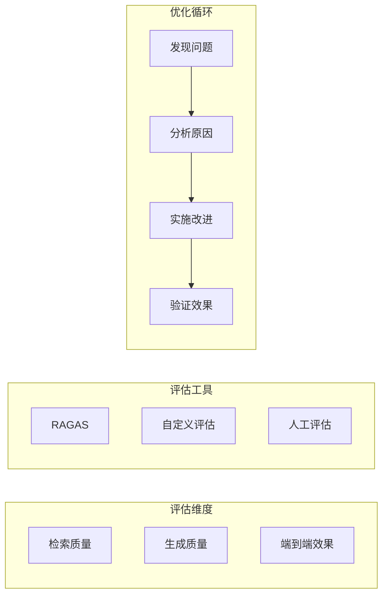

# 第5章 · RAG 评估与迭代 — 持续优化的方法论

> **时长**：约 3 小时 ｜ **难度**：⭐⭐⭐⭐ ｜ **类型**：实践
>
> **目标**：建立 RAG 系统的评估体系和持续优化流程

---

## 学习目标

学完本章后，你将能够：
- 设计 RAG 评估指标体系
- 使用自动化评估工具
- 建立持续优化流程
- 分析和解决常见问题

---

## 知识地图



---

## 1、评估指标体系

### 1.1 检索评估指标

| 指标 | 公式 | 说明 |
|------|------|------|
| Recall@K | 召回的相关文档数 / 总相关文档数 | 召回率 |
| Precision@K | 召回的相关文档数 / K | 准确率 |
| MRR | 1 / 第一个相关结果的排名 | 平均倒数排名 |
| NDCG | DCG / IDCG | 归一化折损累计增益 |

### 1.2 生成评估指标

| 指标 | 说明 | 评估方法 |
|------|------|---------|
| Faithfulness | 回答是否忠于上下文 | LLM 评估 |
| Relevancy | 回答是否相关 | LLM 评估 |
| Completeness | 回答是否完整 | 人工评估 |
| Coherence | 回答是否连贯 | LLM 评估 |

---

## 2、评估实现

### 2.1 检索质量评估

```python
"""
01_retrieval_eval.py
检索质量评估
"""
from typing import List, Set
import numpy as np


def recall_at_k(
    retrieved: List[str],
    relevant: Set[str],
    k: int
) -> float:
    """计算 Recall@K"""
    retrieved_k = set(retrieved[:k])
    hits = len(retrieved_k & relevant)
    return hits / len(relevant) if relevant else 0.0


def precision_at_k(
    retrieved: List[str],
    relevant: Set[str],
    k: int
) -> float:
    """计算 Precision@K"""
    retrieved_k = set(retrieved[:k])
    hits = len(retrieved_k & relevant)
    return hits / k


def mrr(
    retrieved: List[str],
    relevant: Set[str]
) -> float:
    """计算 MRR"""
    for i, doc_id in enumerate(retrieved, 1):
        if doc_id in relevant:
            return 1.0 / i
    return 0.0


def ndcg_at_k(
    retrieved: List[str],
    relevant: Set[str],
    k: int
) -> float:
    """计算 NDCG@K"""
    def dcg(scores):
        return sum(
            (2**s - 1) / np.log2(i + 2)
            for i, s in enumerate(scores)
        )

    # 实际得分
    actual_scores = [1 if doc in relevant else 0 for doc in retrieved[:k]]

    # 理想得分
    ideal_scores = sorted(actual_scores, reverse=True)

    actual_dcg = dcg(actual_scores)
    ideal_dcg = dcg(ideal_scores)

    return actual_dcg / ideal_dcg if ideal_dcg > 0 else 0.0


def evaluate_retrieval(retrieved_ids: List[str], relevant_ids: Set[str]):
    """综合评估检索质量"""
    metrics = {
        "recall@3": recall_at_k(retrieved_ids, relevant_ids, 3),
        "recall@5": recall_at_k(retrieved_ids, relevant_ids, 5),
        "precision@3": precision_at_k(retrieved_ids, relevant_ids, 3),
        "precision@5": precision_at_k(retrieved_ids, relevant_ids, 5),
        "mrr": mrr(retrieved_ids, relevant_ids),
        "ndcg@5": ndcg_at_k(retrieved_ids, relevant_ids, 5),
    }

    print("检索评估结果:")
    for name, value in metrics.items():
        print(f"  {name}: {value:.4f}")

    return metrics


# 演示
if __name__ == "__main__":
    # 假设检索返回的文档 ID
    retrieved = ["doc1", "doc3", "doc5", "doc2", "doc7"]
    # 实际相关的文档 ID
    relevant = {"doc1", "doc2", "doc4"}

    evaluate_retrieval(retrieved, relevant)
```

### 2.2 生成质量评估

```python
"""
02_generation_eval.py
生成质量评估
"""
from openai import OpenAI
import json


class RAGEvaluator:
    """RAG 生成质量评估器"""

    def __init__(self):
        self.client = OpenAI()

    def evaluate_faithfulness(
        self,
        answer: str,
        context: str
    ) -> dict:
        """评估忠实度：回答是否基于上下文"""
        prompt = f"""评估以下回答是否忠实于给定的上下文。

上下文：
{context}

回答：
{answer}

评估标准：
- 回答中的每个陈述都应该能在上下文中找到依据
- 不应该包含上下文中没有的信息

请以 JSON 格式返回：
{{
    "score": 0.0-1.0 的分数,
    "reasoning": "评分理由",
    "unsupported_claims": ["上下文不支持的陈述列表"]
}}"""

        response = self.client.chat.completions.create(
            model="gpt-4o-mini",
            messages=[{"role": "user", "content": prompt}],
            response_format={"type": "json_object"}
        )

        return json.loads(response.choices[0].message.content)

    def evaluate_relevancy(
        self,
        question: str,
        answer: str
    ) -> dict:
        """评估相关性：回答是否针对问题"""
        prompt = f"""评估以下回答与问题的相关性。

问题：
{question}

回答：
{answer}

评估标准：
- 回答是否直接针对问题
- 回答是否完整回答了问题

请以 JSON 格式返回：
{{
    "score": 0.0-1.0 的分数,
    "reasoning": "评分理由"
}}"""

        response = self.client.chat.completions.create(
            model="gpt-4o-mini",
            messages=[{"role": "user", "content": prompt}],
            response_format={"type": "json_object"}
        )

        return json.loads(response.choices[0].message.content)

    def evaluate_rag(
        self,
        question: str,
        context: str,
        answer: str
    ) -> dict:
        """综合评估"""
        faithfulness = self.evaluate_faithfulness(answer, context)
        relevancy = self.evaluate_relevancy(question, answer)

        return {
            "faithfulness": faithfulness,
            "relevancy": relevancy,
            "overall_score": (
                faithfulness["score"] * 0.5 +
                relevancy["score"] * 0.5
            )
        }


def evaluation_demo():
    """评估演示"""
    evaluator = RAGEvaluator()

    question = "LangChain 是什么？"
    context = "LangChain 是一个用于开发 LLM 应用的开源框架，由 Harrison Chase 创建。"
    answer = "LangChain 是一个开源框架，用于构建基于大语言模型的应用程序。"

    print("【RAG 生成质量评估】\n")
    print(f"问题: {question}")
    print(f"上下文: {context}")
    print(f"回答: {answer}\n")

    result = evaluator.evaluate_rag(question, context, answer)

    print("评估结果:")
    print(f"  忠实度: {result['faithfulness']['score']:.2f}")
    print(f"    理由: {result['faithfulness']['reasoning']}")
    print(f"  相关性: {result['relevancy']['score']:.2f}")
    print(f"    理由: {result['relevancy']['reasoning']}")
    print(f"  综合分数: {result['overall_score']:.2f}")


if __name__ == "__main__":
    import os
    if os.getenv("OPENAI_API_KEY"):
        evaluation_demo()
```

---

## 3、测试数据集构建

### 3.1 构建评估数据集

```python
"""
03_test_dataset.py
构建测试数据集
"""
from dataclasses import dataclass
from typing import List, Optional
import json


@dataclass
class TestCase:
    """测试用例"""
    question: str
    expected_answer: str
    relevant_doc_ids: List[str]
    difficulty: str = "medium"  # easy, medium, hard
    category: str = "general"


class TestDataset:
    """测试数据集"""

    def __init__(self):
        self.test_cases: List[TestCase] = []

    def add_case(self, case: TestCase):
        """添加测试用例"""
        self.test_cases.append(case)

    def add_from_dict(self, data: dict):
        """从字典添加"""
        self.test_cases.append(TestCase(**data))

    def save(self, path: str):
        """保存数据集"""
        data = [
            {
                "question": tc.question,
                "expected_answer": tc.expected_answer,
                "relevant_doc_ids": tc.relevant_doc_ids,
                "difficulty": tc.difficulty,
                "category": tc.category,
            }
            for tc in self.test_cases
        ]

        with open(path, "w", encoding="utf-8") as f:
            json.dump(data, f, ensure_ascii=False, indent=2)

    def load(self, path: str):
        """加载数据集"""
        with open(path, "r", encoding="utf-8") as f:
            data = json.load(f)

        self.test_cases = [TestCase(**item) for item in data]

    def get_by_category(self, category: str) -> List[TestCase]:
        """按类别获取"""
        return [tc for tc in self.test_cases if tc.category == category]

    def get_by_difficulty(self, difficulty: str) -> List[TestCase]:
        """按难度获取"""
        return [tc for tc in self.test_cases if tc.difficulty == difficulty]


def create_sample_dataset():
    """创建示例数据集"""
    dataset = TestDataset()

    test_cases = [
        {
            "question": "LangChain 是什么？",
            "expected_answer": "LangChain 是一个用于开发 LLM 应用的框架",
            "relevant_doc_ids": ["doc_langchain_intro"],
            "difficulty": "easy",
            "category": "概念"
        },
        {
            "question": "RAG 和 Fine-tuning 的区别是什么？",
            "expected_answer": "RAG 通过检索外部知识增强生成，Fine-tuning 通过训练调整模型参数",
            "relevant_doc_ids": ["doc_rag_intro", "doc_finetuning"],
            "difficulty": "medium",
            "category": "对比"
        },
        {
            "question": "如何优化 RAG 系统的检索质量？",
            "expected_answer": "可以通过混合检索、重排序、查询改写等方式优化",
            "relevant_doc_ids": ["doc_retrieval_opt", "doc_rerank"],
            "difficulty": "hard",
            "category": "优化"
        },
    ]

    for tc in test_cases:
        dataset.add_from_dict(tc)

    return dataset


if __name__ == "__main__":
    dataset = create_sample_dataset()
    dataset.save("test_dataset.json")
    print(f"创建了 {len(dataset.test_cases)} 个测试用例")
```

---

## 4、常见问题诊断

### 4.1 问题类型与解决方案

| 问题 | 表现 | 可能原因 | 解决方案 |
|------|------|---------|---------|
| 检索不到相关文档 | 回答说无法回答 | 分块策略不当 | 调整分块大小 |
| 检索到但不相关 | 回答偏离主题 | Embedding 质量 | 更换模型 |
| 回答不忠实 | 添加了上下文外内容 | Prompt 不够严格 | 优化 Prompt |
| 回答不完整 | 缺少关键信息 | 检索数量不足 | 增加 top-k |

### 4.2 诊断工具

```python
"""
04_diagnosis.py
RAG 问题诊断
"""
from typing import List
from langchain.schema import Document


def diagnose_retrieval(
    query: str,
    retrieved_docs: List[Document],
    expected_content: str
) -> dict:
    """诊断检索问题"""
    issues = []
    suggestions = []

    # 检查是否检索到预期内容
    retrieved_texts = [doc.page_content for doc in retrieved_docs]
    content_found = any(expected_content in text for text in retrieved_texts)

    if not content_found:
        issues.append("预期内容未被检索到")
        suggestions.append("检查分块策略，确保相关内容在同一块中")
        suggestions.append("尝试调整 Embedding 模型")

    # 检查检索结果的多样性
    if len(retrieved_docs) > 1:
        # 简单检查：如果内容重复度高
        unique_ratio = len(set(retrieved_texts)) / len(retrieved_texts)
        if unique_ratio < 0.5:
            issues.append("检索结果重复度高")
            suggestions.append("使用 MMR 检索增加多样性")

    return {
        "query": query,
        "num_retrieved": len(retrieved_docs),
        "content_found": content_found,
        "issues": issues,
        "suggestions": suggestions
    }


def diagnose_generation(
    question: str,
    context: str,
    answer: str,
    expected_keywords: List[str]
) -> dict:
    """诊断生成问题"""
    issues = []
    suggestions = []

    # 检查答案是否包含关键词
    missing_keywords = [kw for kw in expected_keywords if kw not in answer]

    if missing_keywords:
        issues.append(f"答案缺少关键信息: {missing_keywords}")

        # 检查是否在上下文中
        missing_in_context = [kw for kw in missing_keywords if kw not in context]
        if missing_in_context:
            suggestions.append("关键信息未被检索到，优化检索策略")
        else:
            suggestions.append("关键信息在上下文中但未使用，优化 Prompt")

    # 检查答案长度
    if len(answer) < 20:
        issues.append("答案过短")
        suggestions.append("调整 Prompt，要求更详细的回答")

    return {
        "question": question,
        "issues": issues,
        "suggestions": suggestions
    }
```

---

## 5、持续优化流程

```
┌──────────────────────────────────────────────────────────────┐
│                     RAG 持续优化流程                          │
├──────────────────────────────────────────────────────────────┤
│                                                              │
│  ┌─────────┐    ┌─────────┐    ┌─────────┐    ┌─────────┐  │
│  │ 收集    │    │ 评估    │    │ 分析    │    │ 优化    │  │
│  │ 问题    │ →  │ 指标    │ →  │ 原因    │ →  │ 实施    │  │
│  └─────────┘    └─────────┘    └─────────┘    └─────────┘  │
│       ↑                                            │        │
│       └────────────────────────────────────────────┘        │
│                                                              │
└──────────────────────────────────────────────────────────────┘

1. 收集问题：用户反馈、日志分析、抽样检查
2. 评估指标：计算各维度指标，识别薄弱环节
3. 分析原因：定位是检索问题还是生成问题
4. 优化实施：针对性改进，A/B 测试验证
```

---

## 本节小结

- ✅ 建立了完整的 RAG 评估指标体系
- ✅ 实现了检索和生成的自动化评估
- ✅ 学会了构建测试数据集
- ✅ 掌握了问题诊断和持续优化方法

---

## 模块总结

恭喜完成 **模块8：RAG 高级技术**！

你已经掌握了：
- ✅ RAG 系统的完整架构设计
- ✅ 文档处理和分块优化
- ✅ 多种检索策略和优化技术
- ✅ 生成优化和上下文管理
- ✅ 评估体系和持续优化流程

---

> **下一模块**：模块9 · Agent 开发 — 构建自主决策的 AI 系统
