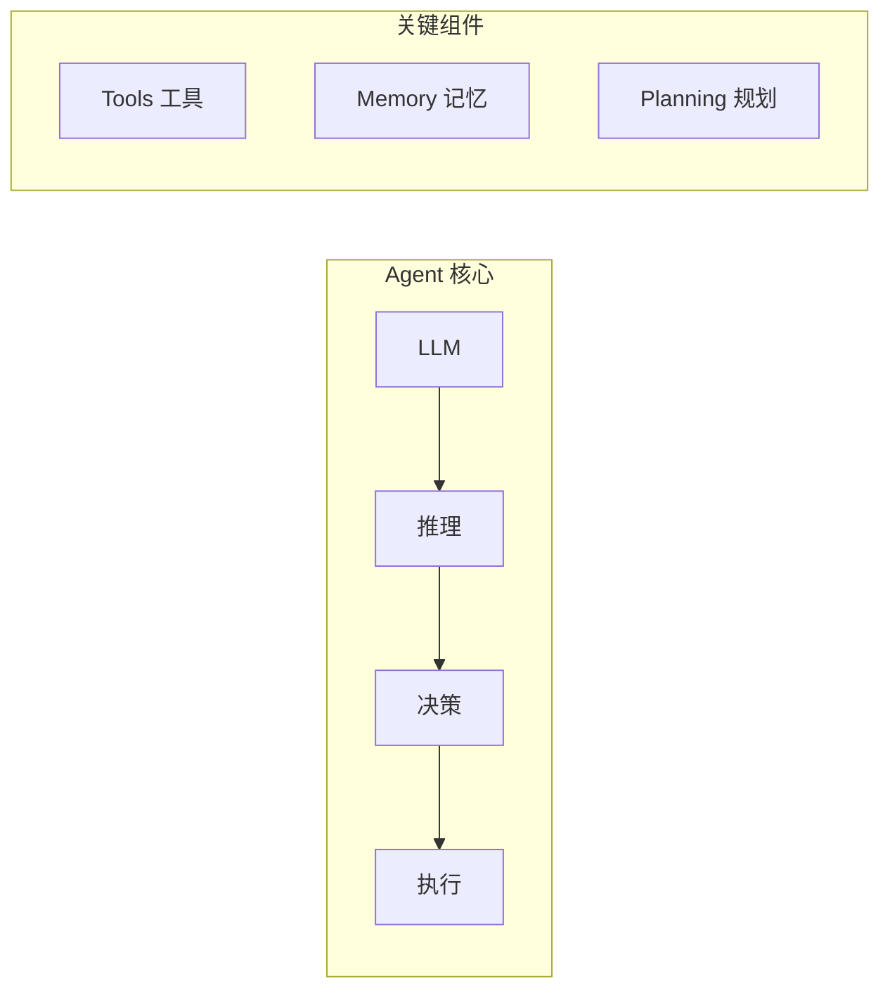

# 第1章 · Agent 基础概念 — 理解自主决策的 AI 系统

> **时长**：约 3 小时 ｜ **难度**：⭐⭐⭐ ｜ **类型**：理论 + 实践
>
> **目标**：理解 AI Agent 的核心概念和工作原理

---

## 学习目标

学完本章后，你将能够：
- 理解 Agent 的定义和核心组件
- 掌握 Agent 的工作流程
- 了解 Agent 与 Chain 的区别
- 实现一个基础 Agent

---

## 知识地图



---

## 1、什么是 Agent

### 1.1 Agent 定义

**AI Agent** 是一个能够自主感知环境、做出决策并采取行动的智能系统：

**概念定义**：Agent（智能体）是一个能够自主感知环境、做出决策并采取行动的 AI 系统，其核心运行模式是"感知-推理-行动"的循环。它利用 LLM 作为大脑进行理解和推理，通过工具与外部世界交互，并利用记忆系统存储历史信息。

**核心定位**：Agent 区别于传统 Chain 的关键在于其**自主决策能力**——不是预定义的固定流程，而是根据上下文动态决定下一步行动。Agent 适合解决开放性问题，而 Chain 更适合确定性任务。

```
┌─────────────────────────────────────────────────────────┐
│                      AI Agent                           │
├─────────────────────────────────────────────────────────┤
│  感知 (Perception)  →  推理 (Reasoning)  →  行动 (Action)│
│       ↑                                          │      │
│       └──────────── 反馈 (Feedback) ─────────────┘      │
└─────────────────────────────────────────────────────────┘
```

### 1.2 Agent vs Chain

| 特性 | Chain | Agent |
|------|-------|-------|
| 执行流程 | 预定义、固定 | 动态决策 |
| 灵活性 | 低 | 高 |
| 工具使用 | 固定序列 | 按需调用 |
| 循环能力 | 无 | 有（推理-行动循环） |
| 适用场景 | 确定性任务 | 开放性问题 |

### 1.3 Agent 核心组件

| 组件 | 职责 | 示例 |
|------|------|------|
| LLM（大脑） | 理解、推理、决策 | GPT-4, Claude |
| Tools（工具） | 与外部世界交互 | 搜索、计算、API |
| Memory（记忆） | 存储历史信息 | 对话历史、执行结果 |
| Planner（规划） | 任务分解和规划 | 思维链、子任务分解 |

---

## 2、Agent 工作流程

### 2.1 ReAct 模式

**ReAct (Reasoning + Acting)** 是 Agent 最常用的工作模式：

```
用户输入 → 思考(Thought) → 行动(Action) → 观察(Observation) → 思考 → ... → 最终答案
```

### 2.2 执行循环

```python
"""
Agent 执行循环伪代码
"""
def agent_loop(query, tools, max_iterations=10):
    messages = [{"role": "user", "content": query}]
    
    for i in range(max_iterations):
        # 1. LLM 推理
        response = llm.invoke(messages)
        
        # 2. 检查是否需要调用工具
        if response.tool_calls:
            # 3. 执行工具
            for tool_call in response.tool_calls:
                result = execute_tool(tool_call)
                # 4. 将结果加入消息
                messages.append(tool_result_message(result))
        else:
            # 5. 返回最终答案
            return response.content
    
    return "达到最大迭代次数"
```

---

## 3、基础 Agent 实现

### ▶ 执行代码

```bash
cd code/01-Agent基础
python 01_basic_agent.py
```

```python
"""
01_basic_agent.py
基础 Agent 实现
"""
import os
from langchain_openai import ChatOpenAI
from langchain.agents import AgentExecutor, create_tool_calling_agent
from langchain_core.prompts import ChatPromptTemplate
from langchain_core.tools import tool


# 定义工具
@tool
def calculator(expression: str) -> str:
    """计算数学表达式。输入一个数学表达式字符串，返回计算结果。"""
    try:
        result = eval(expression)
        return str(result)
    except Exception as e:
        return f"计算错误: {e}"


@tool
def get_current_time() -> str:
    """获取当前时间"""
    from datetime import datetime
    return datetime.now().strftime("%Y-%m-%d %H:%M:%S")


def basic_agent():
    """基础 Agent 示例"""
    print("=" * 60)
    print("【基础 Agent 示例】")
    print("=" * 60)

    # 创建 LLM
    llm = ChatOpenAI(model="gpt-4o-mini", temperature=0)

    # 工具列表
    tools = [calculator, get_current_time]

    # 创建 Prompt
    prompt = ChatPromptTemplate.from_messages([
        ("system", "你是一个有用的助手，可以使用工具来帮助用户解决问题。"),
        ("human", "{input}"),
        ("placeholder", "{agent_scratchpad}"),
    ])

    # 创建 Agent
    agent = create_tool_calling_agent(llm, tools, prompt)

    # 创建执行器
    agent_executor = AgentExecutor(
        agent=agent,
        tools=tools,
        verbose=True,  # 显示执行过程
        max_iterations=5
    )

    # 测试问题
    questions = [
        "现在几点了？",
        "计算 (123 + 456) * 2 的结果",
        "先告诉我现在的时间，然后计算 100 的平方",
    ]

    for q in questions:
        print(f"\n问题: {q}")
        print("-" * 40)
        result = agent_executor.invoke({"input": q})
        print(f"答案: {result['output']}")


if __name__ == "__main__":
    if not os.getenv("OPENAI_API_KEY"):
        print("请设置 OPENAI_API_KEY")
        exit()

    basic_agent()
```

---

## 4、Agent 类型

### 4.1 LangChain Agent 类型

| 类型 | 特点 | 适用场景 |
|------|------|---------|
| Tool Calling Agent | 使用模型原生工具调用 | 推荐，最可靠 |
| ReAct Agent | 显式推理步骤 | 需要解释过程 |
| OpenAI Functions | OpenAI 专用 | OpenAI 模型 |
| Structured Chat | 结构化输出 | 复杂工具调用 |

### 4.2 选择建议

```
是否需要工具调用？
  │
  ├─ 否 → 使用 Chain
  │
  └─ 是 → 模型是否支持 Tool Calling？
           │
           ├─ 是 → Tool Calling Agent（推荐）
           │
           └─ 否 → ReAct Agent
```

---

## 5、Agent 最佳实践

### 5.1 设计原则

| 原则 | 说明 |
|------|------|
| 工具单一职责 | 每个工具只做一件事 |
| 清晰的描述 | 工具描述要准确、详细 |
| 错误处理 | 工具要返回有意义的错误信息 |
| 限制迭代 | 设置最大迭代次数防止死循环 |

---

## 常见踩坑

1. **Agent 陷入死循环**：未设置最大迭代次数或工具返回结果不明确时，Agent 可能无限循环。务必设置 `max_iterations` 参数，并确保工具返回值清晰明确，让 Agent 能够判断何时停止。
2. **工具描述不准确导致 Agent 不使用**：Agent 依赖工具描述的语义来决策是否调用工具；描述模糊会导致 Agent 忽略可用工具。每个工具的描述应清晰说明功能、输入参数和返回值。
3. **LLM 不支持原生 Tool Calling**：部分模型（如早期版本）不支持原生工具调用，应使用 `create_react_agent` 作为备选方案，或升级到支持 Tool Calling 的模型。
4. **Agent 决策延迟过高**：每次推理-行动循环都需要调用 LLM，迭代次数过多会大幅增加响应延迟。应优化工具设计，减少不必要的循环，合理设置 `max_iterations`。
5. **上下文窗口溢出**：Agent 每次循环都会在消息列表中追加工具调用和结果，多轮迭代后容易超出 LLM 的上下文限制。应监控消息长度，必要时使用摘要机制或滑动窗口。

## 课后练习

1. 实现一个带有日历查询功能的 Agent，让它能够回答"今天星期几"、"2026 年春节是哪一天"等日期相关问题
2. 分别用 `create_tool_calling_agent` 和 `create_react_agent` 实现同一个任务，对比两者的执行过程和结果差异
3. 为 Agent 设置不同的 `max_iterations` 值（1、3、10），观察 Agent 行为的变化
4. 给 Agent 添加一个描述故意写得很模糊的工具，观察 Agent 是否仍能正确调用它，然后优化描述后对比调用效果

## 本节小结

- ✅ 理解了 Agent 的核心概念
- ✅ 掌握了 Agent 的工作流程
- ✅ 实现了基础的 Tool Calling Agent
- ✅ 了解了 Agent 设计最佳实践

---

> **下一章**：第2章 · 工具开发与集成 — 扩展 Agent 的能力边界
