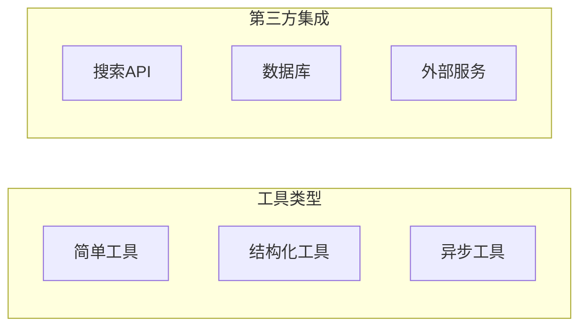

# 第2章 · 工具开发与集成 — 扩展 Agent 的能力边界

> **时长**：约 4 小时 ｜ **难度**：⭐⭐⭐ ｜ **类型**：实践
>
> **目标**：掌握 Agent 工具的开发和集成方法

---

## 学习目标

学完本章后，你将能够：
- 使用 @tool 装饰器创建工具
- 开发复杂的自定义工具
- 集成第三方 API 作为工具
- 处理工具的输入验证和错误

---

## 知识地图



---

## 1、工具基础

### 1.1 使用 @tool 装饰器

**概念定义**：Tool（工具）是 Agent 与外部世界交互的接口，它封装了具体的功能实现（如搜索、计算、API 调用），供 Agent 按需调用。LangChain 提供了 `@tool` 装饰器来快速将普通函数转换为工具。

**核心定位**：工具是 Agent 能力边界的延伸——通过工具，Agent 可以获取实时信息、执行精确计算、操作外部系统，突破 LLM 自身知识截止和纯文本能力的限制。工具设计的质量直接决定了 Agent 的上限。

```python
"""
01_tool_decorator.py
使用装饰器创建工具
"""
from langchain_core.tools import tool


# 最简单的工具
@tool
def add(a: int, b: int) -> int:
    """将两个数字相加"""
    return a + b


# 带详细描述的工具
@tool
def search_web(query: str) -> str:
    """
    在网络上搜索信息。
    
    Args:
        query: 搜索关键词
        
    Returns:
        搜索结果摘要
    """
    # 模拟搜索
    return f"搜索 '{query}' 的结果: ..."


# 带默认参数的工具
@tool
def translate(text: str, target_language: str = "英语") -> str:
    """
    翻译文本到指定语言。
    
    Args:
        text: 要翻译的文本
        target_language: 目标语言，默认为英语
    """
    return f"将 '{text}' 翻译为{target_language}: ..."


if __name__ == "__main__":
    # 查看工具信息
    print("工具名称:", add.name)
    print("工具描述:", add.description)
    print("参数 Schema:", add.args_schema.schema())

    # 调用工具
    result = add.invoke({"a": 1, "b": 2})
    print(f"\n调用结果: {result}")
```

### 1.2 结构化输入工具

```python
"""
02_structured_tool.py
结构化输入的工具
"""
from langchain_core.tools import tool, StructuredTool
from pydantic import BaseModel, Field
from typing import Optional


# 使用 Pydantic 定义输入
class WeatherInput(BaseModel):
    """天气查询输入"""
    city: str = Field(description="城市名称")
    unit: str = Field(default="celsius", description="温度单位: celsius 或 fahrenheit")


@tool(args_schema=WeatherInput)
def get_weather(city: str, unit: str = "celsius") -> str:
    """查询指定城市的天气"""
    # 模拟天气数据
    weather_data = {
        "北京": {"temp": 25, "condition": "晴"},
        "上海": {"temp": 28, "condition": "多云"},
        "广州": {"temp": 32, "condition": "阵雨"},
    }

    data = weather_data.get(city, {"temp": 20, "condition": "未知"})
    temp = data["temp"] if unit == "celsius" else data["temp"] * 9/5 + 32
    unit_str = "°C" if unit == "celsius" else "°F"

    return f"{city}: {temp}{unit_str}, {data['condition']}"


# 使用 StructuredTool 类
class SearchInput(BaseModel):
    query: str = Field(description="搜索关键词")
    max_results: int = Field(default=5, description="最大结果数")


def search_function(query: str, max_results: int = 5) -> str:
    return f"搜索 '{query}'，返回 {max_results} 条结果"


search_tool = StructuredTool.from_function(
    func=search_function,
    name="search",
    description="搜索信息",
    args_schema=SearchInput
)


if __name__ == "__main__":
    # 测试天气工具
    print(get_weather.invoke({"city": "北京"}))
    print(get_weather.invoke({"city": "上海", "unit": "fahrenheit"}))

    # 测试搜索工具
    print(search_tool.invoke({"query": "Python", "max_results": 3}))
```

---

## 2、异步工具

**概念定义**：异步工具是使用 `async def` 定义、支持 `await` 调用的工具。在 Web 应用（如 FastAPI）或高并发场景中，同步工具会阻塞事件循环，导致整体性能下降，而异步工具则允许多个任务并发执行。

**核心定位**：异步工具的核心价值在于**非阻塞执行**——当 Agent 需要同时调用多个工具（如同时搜索多个关键词）时，异步工具可以并行运行，大幅缩短整体响应时间。

```python
"""
03_async_tool.py
异步工具
"""
import asyncio
from langchain_core.tools import tool


@tool
async def async_fetch_data(url: str) -> str:
    """异步获取数据"""
    # 模拟异步请求
    await asyncio.sleep(1)
    return f"从 {url} 获取的数据"


@tool
async def async_process(data: str) -> str:
    """异步处理数据"""
    await asyncio.sleep(0.5)
    return f"处理后的数据: {data.upper()}"


async def main():
    """测试异步工具"""
    print("=" * 60)
    print("【异步工具测试】")
    print("=" * 60)

    # 并行执行多个异步工具
    tasks = [
        async_fetch_data.ainvoke({"url": "https://api1.example.com"}),
        async_fetch_data.ainvoke({"url": "https://api2.example.com"}),
        async_fetch_data.ainvoke({"url": "https://api3.example.com"}),
    ]

    results = await asyncio.gather(*tasks)

    for i, result in enumerate(results, 1):
        print(f"  结果 {i}: {result}")


if __name__ == "__main__":
    asyncio.run(main())
```

---

## 3、集成外部 API

**概念定义**：外部 API 集成是指将第三方服务（搜索引擎、数据库、天气服务等）封装为 Agent 可调用的工具，使 Agent 能够获取实时数据和操作外部系统。

**核心定位**：外部 API 集成解决了 LLM 的两个天然局限——**知识截止日期**（模型训练后的新信息）和**无法直接操作外部系统**（查询数据库、发送通知等），是 Agent 走向生产环境的必经之路。

### 3.1 搜索工具

```python
"""
04_search_tool.py
搜索工具集成
"""
from langchain_core.tools import tool
from langchain_community.tools import DuckDuckGoSearchRun
from langchain_community.utilities import WikipediaAPIWrapper


# DuckDuckGo 搜索
def create_ddg_search():
    """创建 DuckDuckGo 搜索工具"""
    return DuckDuckGoSearchRun()


# Wikipedia 搜索
def create_wiki_search():
    """创建 Wikipedia 搜索工具"""
    wiki = WikipediaAPIWrapper()

    @tool
    def search_wikipedia(query: str) -> str:
        """在 Wikipedia 上搜索信息"""
        return wiki.run(query)

    return search_wikipedia


# 自定义搜索工具（模拟）
@tool
def custom_search(query: str) -> str:
    """
    自定义搜索工具。
    在知识库中搜索相关信息。
    """
    # 这里可以集成任何搜索 API
    knowledge_base = {
        "python": "Python 是一种高级编程语言",
        "langchain": "LangChain 是 LLM 应用开发框架",
        "agent": "Agent 是能够自主决策的 AI 系统",
    }

    query_lower = query.lower()
    for key, value in knowledge_base.items():
        if key in query_lower:
            return value

    return f"未找到关于 '{query}' 的信息"


if __name__ == "__main__":
    # 测试自定义搜索
    print(custom_search.invoke({"query": "什么是 Python"}))
    print(custom_search.invoke({"query": "LangChain 介绍"}))
```

### 3.2 数据库工具

```python
"""
05_database_tool.py
数据库查询工具
"""
from langchain_core.tools import tool
from typing import List, Dict
import sqlite3


class DatabaseTool:
    """数据库工具类"""

    def __init__(self, db_path: str = ":memory:"):
        self.conn = sqlite3.connect(db_path)
        self._init_sample_data()

    def _init_sample_data(self):
        """初始化示例数据"""
        cursor = self.conn.cursor()
        cursor.execute("""
            CREATE TABLE IF NOT EXISTS products (
                id INTEGER PRIMARY KEY,
                name TEXT,
                price REAL,
                category TEXT
            )
        """)
        cursor.executemany(
            "INSERT INTO products (name, price, category) VALUES (?, ?, ?)",
            [
                ("笔记本电脑", 5999.00, "电子产品"),
                ("无线鼠标", 99.00, "电子产品"),
                ("Python书籍", 79.00, "图书"),
                ("咖啡杯", 29.00, "生活用品"),
            ]
        )
        self.conn.commit()

    def query(self, sql: str) -> List[Dict]:
        """执行查询"""
        cursor = self.conn.cursor()
        cursor.execute(sql)
        columns = [desc[0] for desc in cursor.description]
        results = []
        for row in cursor.fetchall():
            results.append(dict(zip(columns, row)))
        return results


# 创建工具
db = DatabaseTool()


@tool
def query_database(sql: str) -> str:
    """
    执行 SQL 查询。
    
    Args:
        sql: SELECT 语句（只支持查询，不支持修改）
        
    Returns:
        查询结果
    """
    if not sql.strip().upper().startswith("SELECT"):
        return "错误：只支持 SELECT 查询"

    try:
        results = db.query(sql)
        if not results:
            return "查询无结果"
        return str(results)
    except Exception as e:
        return f"查询错误: {e}"


if __name__ == "__main__":
    # 测试数据库工具
    print(query_database.invoke({"sql": "SELECT * FROM products"}))
    print(query_database.invoke({"sql": "SELECT * FROM products WHERE price < 100"}))
```

---

## 4、工具错误处理

```python
"""
06_error_handling.py
工具错误处理
"""
from langchain_core.tools import tool, ToolException
from pydantic import BaseModel, Field, validator


class DivisionInput(BaseModel):
    """除法输入"""
    dividend: float = Field(description="被除数")
    divisor: float = Field(description="除数")

    @validator("divisor")
    def divisor_not_zero(cls, v):
        if v == 0:
            raise ValueError("除数不能为零")
        return v


@tool(args_schema=DivisionInput)
def safe_divide(dividend: float, divisor: float) -> str:
    """安全的除法运算"""
    try:
        result = dividend / divisor
        return f"{dividend} / {divisor} = {result}"
    except Exception as e:
        return f"计算错误: {e}"


@tool
def risky_operation(value: int) -> str:
    """一个可能失败的操作"""
    if value < 0:
        raise ToolException("不支持负数")
    if value > 100:
        raise ToolException("值不能超过 100")
    return f"处理成功: {value}"


if __name__ == "__main__":
    # 正常情况
    print(safe_divide.invoke({"dividend": 10, "divisor": 2}))

    # 错误处理
    try:
        print(safe_divide.invoke({"dividend": 10, "divisor": 0}))
    except Exception as e:
        print(f"验证错误: {e}")

    # ToolException
    try:
        print(risky_operation.invoke({"value": -5}))
    except ToolException as e:
        print(f"工具错误: {e}")
```

---

## 5、工具组合

```python
"""
07_tool_composition.py
工具组合使用
"""
import os
from langchain_openai import ChatOpenAI
from langchain.agents import AgentExecutor, create_tool_calling_agent
from langchain_core.prompts import ChatPromptTemplate
from langchain_core.tools import tool


# 定义一组相关工具
@tool
def get_user_info(user_id: str) -> str:
    """获取用户信息"""
    users = {
        "001": {"name": "张三", "email": "zhang@example.com"},
        "002": {"name": "李四", "email": "li@example.com"},
    }
    user = users.get(user_id)
    if user:
        return f"用户 {user_id}: {user}"
    return f"用户 {user_id} 不存在"


@tool
def get_user_orders(user_id: str) -> str:
    """获取用户订单"""
    orders = {
        "001": ["订单A: 笔记本电脑", "订单B: 鼠标"],
        "002": ["订单C: 书籍"],
    }
    user_orders = orders.get(user_id, [])
    if user_orders:
        return f"用户 {user_id} 的订单: {', '.join(user_orders)}"
    return f"用户 {user_id} 没有订单"


@tool
def send_email(to: str, subject: str, body: str) -> str:
    """发送邮件"""
    return f"已发送邮件到 {to}，主题: {subject}"


def customer_service_agent():
    """客服 Agent 示例"""
    print("=" * 60)
    print("【客服 Agent - 工具组合】")
    print("=" * 60)

    llm = ChatOpenAI(model="gpt-4o-mini", temperature=0)

    tools = [get_user_info, get_user_orders, send_email]

    prompt = ChatPromptTemplate.from_messages([
        ("system", """你是一个客服助手，可以：
1. 查询用户信息
2. 查询用户订单
3. 发送邮件通知

请根据用户需求使用合适的工具。"""),
        ("human", "{input}"),
        ("placeholder", "{agent_scratchpad}"),
    ])

    agent = create_tool_calling_agent(llm, tools, prompt)
    executor = AgentExecutor(agent=agent, tools=tools, verbose=True)

    # 测试
    questions = [
        "帮我查询用户 001 的信息和订单",
        "给用户 002 发送一封邮件，提醒他订单已发货",
    ]

    for q in questions:
        print(f"\n请求: {q}")
        print("-" * 40)
        result = executor.invoke({"input": q})
        print(f"结果: {result['output']}")


if __name__ == "__main__":
    if os.getenv("OPENAI_API_KEY"):
        customer_service_agent()
    else:
        print("请设置 OPENAI_API_KEY")
```

---

## 常见踩坑

1. **工具输入验证不足**：Agent 可能传入非法参数（如除数为零、空字符串），工具内部必须有充分的验证逻辑并返回有意义的错误信息，否则 Agent 无法理解失败原因。
2. **同步工具阻塞异步事件循环**：在异步 Agent 代码中调用同步工具会阻塞整个事件循环，导致并发能力急剧下降。应优先使用异步工具，或使用 `asyncio.to_thread` 包装同步函数。
3. **工具描述与实现不一致**：工具的描述说"搜索天气"但实际只查了静态数据，Agent 会产生错误预期导致后续推理偏差。工具描述必须准确反映实现功能。
4. **第三方 API 工具未处理网络异常**：集成外部 API 时未处理超时、限流、断连等异常，会导致 Agent 执行中断。应使用 try/except 兜底并设置合理超时时间。
5. **工具间职责重叠**：多个工具的功能描述过于接近时，Agent 可能调用错误的工具。应确保每个工具的职责单一且描述无歧义，遵循"一个工具只做一件事"原则。

## 课后练习

1. 创建一个天气查询工具，通过公开 API（如 wttr.in 或 OpenWeatherMap）获取实时天气数据，并集成到 Agent 中使用
2. 将第 1 章中的计算器工具改写为异步版本，与同步版本对比批量调用时的性能差异
3. 实现一个具备完整输入验证和错误处理的数据库查询工具，测试除零、空结果、SQL 注入等边界情况
4. 组合 3 个以上工具（日历、天气、备忘录）构建一个"个人助理"Agent，测试多步协作场景

---

## 本节小结

- ✅ 掌握了 @tool 装饰器的使用
- ✅ 学会了创建结构化输入工具
- ✅ 实现了异步工具和 API 集成
- ✅ 了解了工具错误处理和组合使用

---

> **下一章**：第3章 · ReAct 与推理模式 — 让 Agent 更智能
