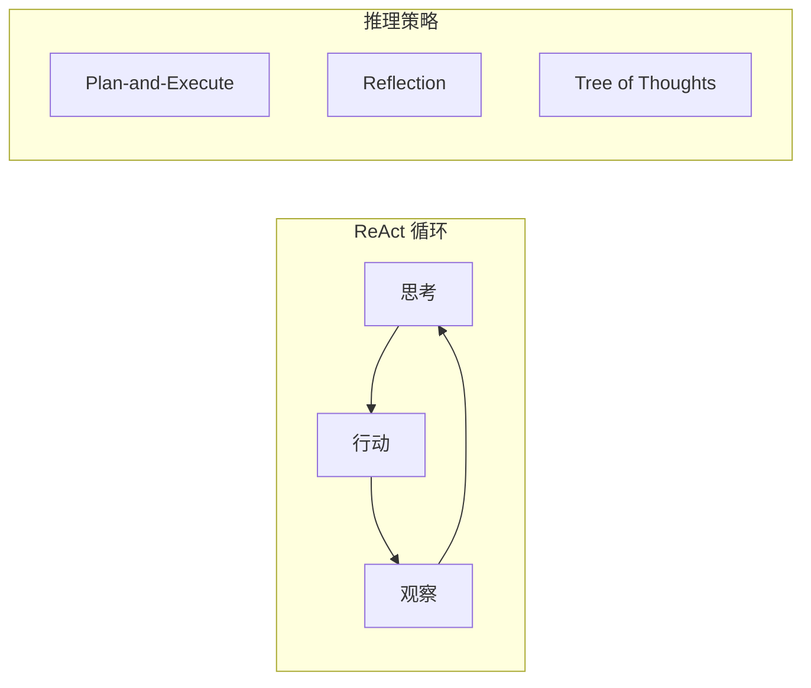

# 第3章 · ReAct 与推理模式 — 让 Agent 更智能

> **时长**：约 3 小时 ｜ **难度**：⭐⭐⭐⭐ ｜ **类型**：实践
>
> **目标**：掌握 ReAct 模式和高级推理策略

---

## 学习目标

学完本章后，你将能够：
- 理解 ReAct 模式的原理
- 实现显式推理的 Agent
- 使用 Plan-and-Execute 策略
- 处理复杂的多步任务

---

## 知识地图



---

## 1、ReAct 模式详解

### 1.1 ReAct 原理

**概念定义**：ReAct（Reasoning + Acting）是一种将推理和行动交织在一起的 Agent 工作模式。Agent 先"思考"当前状况和需要的下一步行动，然后"执行"具体动作，再"观察"执行结果，形成"思考→行动→观察"的循环，直到得出最终答案。

**核心定位**：ReAct 的核心优势在于**显式的推理过程**——每一步决策都有明确的思考依据，使 Agent 的行为可解释、可追溯，并能在观察到结果后动态调整后续行动。这使得 ReAct 特别适合需要多步推理和外部信息获取的复杂任务。

**ReAct (Reasoning + Acting)** 将推理和行动交织在一起：

```
Thought: 我需要搜索用户的问题相关信息
Action: search[用户问题关键词]
Observation: 搜索返回的结果...
Thought: 根据搜索结果，我应该...
Action: ...
Observation: ...
Thought: 现在我可以回答问题了
Final Answer: ...
```

### 1.2 ReAct Agent 实现

```python
"""
01_react_agent.py
ReAct Agent 实现
"""
import os
from langchain_openai import ChatOpenAI
from langchain.agents import AgentExecutor, create_react_agent
from langchain_core.prompts import PromptTemplate
from langchain_core.tools import tool
from langchain import hub


@tool
def search(query: str) -> str:
    """搜索信息"""
    knowledge = {
        "langchain": "LangChain 是一个用于构建 LLM 应用的框架，支持 Chain 和 Agent。",
        "react": "ReAct 是一种将推理和行动结合的 Agent 模式。",
        "agent": "Agent 是能够自主决策并执行任务的 AI 系统。",
    }

    for key, value in knowledge.items():
        if key in query.lower():
            return value

    return f"未找到关于 '{query}' 的信息"


@tool
def calculator(expression: str) -> str:
    """计算数学表达式"""
    try:
        return str(eval(expression))
    except:
        return "计算错误"


def react_agent_demo():
    """ReAct Agent 演示"""
    print("=" * 60)
    print("【ReAct Agent 演示】")
    print("=" * 60)

    llm = ChatOpenAI(model="gpt-4o-mini", temperature=0)
    tools = [search, calculator]

    # ReAct Prompt 模板
    react_prompt = PromptTemplate.from_template("""Answer the following questions as best you can. You have access to the following tools:

{tools}

Use the following format:

Question: the input question you must answer
Thought: you should always think about what to do
Action: the action to take, should be one of [{tool_names}]
Action Input: the input to the action
Observation: the result of the action
... (this Thought/Action/Action Input/Observation can repeat N times)
Thought: I now know the final answer
Final Answer: the final answer to the original input question

Begin!

Question: {input}
Thought:{agent_scratchpad}""")

    # 创建 ReAct Agent
    agent = create_react_agent(llm, tools, react_prompt)
    executor = AgentExecutor(
        agent=agent,
        tools=tools,
        verbose=True,
        handle_parsing_errors=True
    )

    # 测试
    questions = [
        "什么是 LangChain？",
        "计算 (100 + 50) * 2 的结果",
        "什么是 Agent？它和 ReAct 有什么关系？",
    ]

    for q in questions:
        print(f"\n问题: {q}")
        print("-" * 40)
        result = executor.invoke({"input": q})
        print(f"答案: {result['output']}")


if __name__ == "__main__":
    if not os.getenv("OPENAI_API_KEY"):
        print("请设置 OPENAI_API_KEY")
        exit()

    react_agent_demo()
```

---

## 2、Plan-and-Execute 策略

### 2.1 策略原理

**概念定义**：Plan-and-Execute（计划与执行）是一种"先规划后行动"的 Agent 策略。Agent 首先分析任务并制定详细的执行计划（包含多个有序步骤），然后逐步执行每个步骤，并根据中间结果动态调整后续计划。

**核心定位**：与 ReAct 的"边想边做"不同，Plan-and-Execute 采用**全局规划**的思路——先对任务整体建立清晰的执行路径，再按部就班推进。这种方式特别适合包含多个子任务的复杂场景，能避免 Agent"走一步看一步"时可能出现的逻辑偏离。

先制定计划，再逐步执行：

```
1. 分析任务，制定计划
2. 逐步执行计划中的每个步骤
3. 根据执行结果调整后续步骤
4. 完成所有步骤后总结
```

### 2.2 实现

```python
"""
02_plan_execute.py
Plan-and-Execute Agent
"""
import os
from langchain_openai import ChatOpenAI
from langchain_core.prompts import ChatPromptTemplate
from langchain_core.tools import tool
from typing import List


@tool
def search_info(topic: str) -> str:
    """搜索特定主题的信息"""
    info = {
        "python基础": "Python 是一种高级编程语言，语法简洁",
        "数据结构": "常见数据结构包括列表、字典、集合",
        "函数": "函数是组织代码的基本单位",
    }
    return info.get(topic, f"未找到关于 {topic} 的信息")


@tool
def summarize(content: str) -> str:
    """总结内容"""
    return f"总结: {content[:50]}..."


class PlanAndExecuteAgent:
    """Plan-and-Execute Agent"""

    def __init__(self):
        self.llm = ChatOpenAI(model="gpt-4o-mini", temperature=0)
        self.tools = [search_info, summarize]

    def plan(self, task: str) -> List[str]:
        """制定计划"""
        prompt = ChatPromptTemplate.from_template("""
你是一个任务规划专家。请为以下任务制定执行计划。

任务: {task}

可用工具:
- search_info: 搜索特定主题的信息
- summarize: 总结内容

请列出 3-5 个步骤，每行一个步骤。只输出步骤，不要其他内容。
""")

        chain = prompt | self.llm
        response = chain.invoke({"task": task})

        # 解析步骤
        steps = [s.strip() for s in response.content.strip().split("\n") if s.strip()]
        return steps

    def execute_step(self, step: str, context: str) -> str:
        """执行单个步骤"""
        prompt = ChatPromptTemplate.from_template("""
执行以下步骤:
{step}

之前的执行结果:
{context}

请完成这个步骤并返回结果。
""")

        chain = prompt | self.llm
        response = chain.invoke({"step": step, "context": context})
        return response.content

    def run(self, task: str) -> str:
        """运行完整流程"""
        print(f"任务: {task}\n")

        # 1. 制定计划
        print("【制定计划】")
        steps = self.plan(task)
        for i, step in enumerate(steps, 1):
            print(f"  {i}. {step}")

        # 2. 执行计划
        print("\n【执行计划】")
        context = ""
        for i, step in enumerate(steps, 1):
            print(f"\n步骤 {i}: {step}")
            result = self.execute_step(step, context)
            print(f"结果: {result[:100]}...")
            context += f"\n步骤{i}结果: {result}"

        # 3. 总结
        print("\n【最终总结】")
        summary_prompt = ChatPromptTemplate.from_template("""
基于以下执行结果，给出最终答案:

{context}

原始任务: {task}
""")

        chain = summary_prompt | self.llm
        final = chain.invoke({"context": context, "task": task})

        return final.content


def plan_execute_demo():
    """演示"""
    print("=" * 60)
    print("【Plan-and-Execute Agent】")
    print("=" * 60)

    agent = PlanAndExecuteAgent()
    result = agent.run("帮我了解 Python 编程的基础知识，包括数据结构和函数")

    print(f"\n最终答案:\n{result}")


if __name__ == "__main__":
    if os.getenv("OPENAI_API_KEY"):
        plan_execute_demo()
    else:
        print("请设置 OPENAI_API_KEY")
```

---

## 3、自我反思（Self-Reflection）

**概念定义**：自我反思（Self-Reflection）是一种让 Agent 对自己生成的输出进行批判性评估并持续改进的机制。Agent 先生成初始回答，然后反思其不足之处，再根据反思结果生成改进版本，如此循环迭代。

**核心定位**：自我反思解决了 LLM"一次生成即定稿"的问题——模型首轮输出可能不够完善，通过让 Agent 扮演"批评者"角色审视自己的输出，可以显著提升回答的质量和完整性，尤其适合需要深度分析和高质量产出的场景。

```python
"""
03_reflection.py
自我反思 Agent
"""
import os
from langchain_openai import ChatOpenAI
from langchain_core.prompts import ChatPromptTemplate


class ReflectiveAgent:
    """带自我反思的 Agent"""

    def __init__(self):
        self.llm = ChatOpenAI(model="gpt-4o-mini", temperature=0)

    def generate(self, task: str) -> str:
        """生成初始回答"""
        prompt = ChatPromptTemplate.from_template("""
完成以下任务:
{task}

请给出你的回答:
""")
        chain = prompt | self.llm
        return chain.invoke({"task": task}).content

    def reflect(self, task: str, answer: str) -> str:
        """反思回答"""
        prompt = ChatPromptTemplate.from_template("""
任务: {task}

当前回答: {answer}

请反思这个回答:
1. 有什么不足之处？
2. 是否完整回答了问题？
3. 有什么可以改进的地方？

反思结果:
""")
        chain = prompt | self.llm
        return chain.invoke({"task": task, "answer": answer}).content

    def improve(self, task: str, answer: str, reflection: str) -> str:
        """根据反思改进"""
        prompt = ChatPromptTemplate.from_template("""
任务: {task}

原始回答: {answer}

反思: {reflection}

请根据反思改进回答:
""")
        chain = prompt | self.llm
        return chain.invoke({
            "task": task,
            "answer": answer,
            "reflection": reflection
        }).content

    def run(self, task: str, max_iterations: int = 2) -> str:
        """运行带反思的流程"""
        print(f"任务: {task}\n")

        # 初始生成
        answer = self.generate(task)
        print(f"【初始回答】\n{answer}\n")

        for i in range(max_iterations):
            print(f"【反思轮次 {i+1}】")

            # 反思
            reflection = self.reflect(task, answer)
            print(f"反思: {reflection[:200]}...\n")

            # 改进
            answer = self.improve(task, answer, reflection)
            print(f"改进后: {answer[:200]}...\n")

        return answer


def reflection_demo():
    """演示"""
    print("=" * 60)
    print("【自我反思 Agent】")
    print("=" * 60)

    agent = ReflectiveAgent()
    result = agent.run("解释什么是机器学习，以及它的主要应用场景")

    print(f"\n最终答案:\n{result}")


if __name__ == "__main__":
    if os.getenv("OPENAI_API_KEY"):
        reflection_demo()
    else:
        print("请设置 OPENAI_API_KEY")
```

---

## 4、推理策略对比

| 策略 | 特点 | 适用场景 |
|------|------|---------|
| ReAct | 思考-行动交替 | 通用任务 |
| Plan-and-Execute | 先规划后执行 | 复杂多步任务 |
| Self-Reflection | 生成-反思-改进 | 需要高质量输出 |
| Tree of Thoughts | 探索多条路径 | 创意/探索任务 |

---

## 常见踩坑

1. **ReAct Agent 解析中间输出失败**：Agent 输出的 Thought/Action 格式不符合 Prompt 模板的预期格式时会导致解析错误，应设置 `handle_parsing_errors=True` 兜底，让 Agent 在格式错误时自动重试。
2. **Plan-and-Execute 计划过于笼统**：Agent 制定的计划步骤不够具体时，执行阶段难以推进，导致 Agent 在每个步骤上仍需大量推理。应在 Prompt 中要求输出可执行的、原子化的步骤。
3. **自我反思陷入过度修正**：多次反思迭代可能让回答从"不够详细"变成"冗长冗余"，或反复推翻之前的正确结论。应严格限制反思轮次（通常 1-2 轮足够），并设置质量达标即停止的机制。
4. **ReAct 在简单任务上效率低**：对于不需要推理或工具调用的简单查询（如"你好"），ReAct 的思考-行动循环是额外开销。应根据任务复杂度选择合适的策略，简单问题直接用 Chain 处理。
5. **观察结果被忽略**：Agent 在某些情况下可能忽略工具的返回结果，按照自己的预设继续推理。关键工具应返回结构化数据，并在 Prompt 中强调 Agent 必须基于观察结果进行下一步推理。

## 课后练习

1. 实现一个 ReAct Agent 解决多步数学问题（如"计算今年第一季度每月天数的总和再除以 3"），观察其完整的推理-行动过程
2. 修改 Plan-and-Execute Agent，加入执行过程中的计划调整能力——当某步骤失败时自动重新规划后续步骤
3. 为自我反思 Agent 添加"评分-比较"机制：生成 2 个改进版本后让 LLM 评分，选择质量更高的版本作为最终输出
4. 用同一组工具分别实现 ReAct 和 Plan-and-Execute 两种 Agent，对比它们在同一个复杂任务上的执行效率和结果质量

## 本节小结

- ✅ 掌握了 ReAct 模式的原理和实现
- ✅ 学会了 Plan-and-Execute 策略
- ✅ 实现了自我反思机制
- ✅ 了解了不同推理策略的适用场景

---

> **下一章**：第4章 · 多 Agent 协作 — 构建复杂的 Agent 系统
